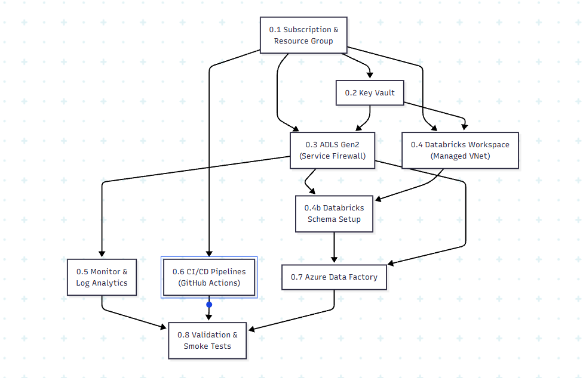

# Phase 0 — IaC & Environment Foundation: Production-Grade Implementation Plan

> [!IMPORTANT]
> This is the **exhaustive, production-grade** plan for Phase 0. Every infrastructure decision — naming conventions, SKU selections, networking topology, RBAC strategy, secret management, diagnostic settings, and CI/CD architecture — is specified here. Phase 0 is the foundation that every subsequent phase depends on. No click-ops. No "we'll configure that later." Everything is code.

> [!CAUTION]
> ## Azure Free Trial Constraints
> This plan is adapted for the **Azure Free Trial** ($200 credit / 30 days). Key constraints:
> - **$200 total budget** — every SKU choice optimizes for cost. Databricks alone can burn $5–15/hour if misconfigured.
> - **No Premium Databricks long-term** — Free Trial includes a 14-day Premium Databricks trial; after that, you drop to Standard (no Unity Catalog, no VNet injection, no cluster policies). Plan accordingly.
> - **No private endpoints** — each private endpoint costs ~$7.20/month. With 4+ endpoints, that's $30/month just for networking. Use service firewall rules instead.
> - **No VNet injection for Databricks** — VNet-injected Databricks requires Premium tier. Use default managed VNet instead.
> - **Azure ML deferred to Phase 3** — Azure ML workspace + compute + Container Registry burns ~$3–5/day even idle. Use MLflow on Databricks (free with Databricks) for Phase 1–2 instead.
> - **Single-environment only** — dev only. No staging/prod until you upgrade to Pay-As-You-Go.
> - **Aggressive auto-termination** — every cluster auto-terminates after 20 minutes idle.
>
> **Upgrade path:** When you move to Pay-As-You-Go or MSDN subscription, the Production Decision Registry (§end) documents exactly what to change: enable VNet injection, add private endpoints, upgrade to Premium Databricks, add Azure ML workspace.

**Phase 0 Goal:** Provision core Azure infrastructure via Terraform, set up Databricks workspace, establish CI/CD pipelines, and create the ADLS Gen2 directory structure — producing an environment where Phase 1 can begin immediately with zero manual setup.

> [!NOTE]
> **Migrated from Bicep to Terraform** (2026-08-11). Every code sample in this section now reflects the real, `terraform validate`-checked `.tf` files under `infrastructure/`, not Bicep. The migration also closed a real gap the Bicep version had: `main.bicep` only ever wired together 5 of 13 modules (Resource Group, Log Analytics, Key Vault, Storage, Databricks) — Event Hubs, Cosmos DB, Service Bus, Azure SQL, App Configuration, RBAC, and Private Endpoints all had to be deployed by hand via separate `az deployment group create` calls. Terraform's root `main.tf` wires all 13 into one graph, so `terraform apply` genuinely deploys everything in one command for the first time.

**Duration:** 1–2 weeks

---

## Phase 0 Internal Dependency Graph



## 0.1 Azure Subscription & Resource Group Strategy

### 0.1.1 Subscription Decision

| Decision | Choice | Rationale |
|---|---|---|
| **Subscription model** | Single subscription, **1 resource group (dev only)** | Free Trial gives $200 for 30 days. Running 3 environments would burn credits 3x faster. Dev-only until upgrade. |
| **Subscription type** | **Azure Free Trial** | $200 credit, 30 days. Some services have 12-month free tiers (see below). |

> [!WARNING]
> **Free Trial limitations to know upfront:**
> - Cannot create more than ~4 cores of VMs per region (relevant for Databricks cluster sizing)
> - Some regions have limited Free Trial quotas — **Central India** or **East US 2** are usually best
> - Databricks Premium trial is 14 days — after that, you must downgrade to Standard or pay
> - Cannot create service principals with OIDC federated credentials (use client secret instead for CI/CD)

### 0.1.2 Resource Group Naming & Tagging

| Environment | Resource Group Name | Region | Purpose |
|---|---|---|---|
| Development | `rg-fraud-detection-dev` | Central India (or East US 2) | Active development — **only environment for Free Trial** |
| ~~Staging~~ | ~~`rg-fraud-detection-staging`~~ | — | ⏸️ Deferred to Pay-As-You-Go upgrade |
| ~~Production~~ | ~~`rg-fraud-detection-prod`~~ | — | ⏸️ Deferred to Pay-As-You-Go upgrade |

**Tagging policy** — every resource gets these tags:

| Tag | Value | Purpose |
|---|---|---|
| `project` | `fraud-detection` | Cost allocation |
| `environment` | `dev` | Environment identification |
| `owner` | `{your-email}` | Accountability |
| `managed-by` | `terraform` | Distinguish IaC-managed from click-ops resources |

### 0.1.3 Budget Alerts

> [!CAUTION]
> **Azure Free Trial burns fast.** Databricks Premium alone costs ~$0.40/DBU. A 2-worker cluster running for 8 hours/day = ~$15–25/day. You have $200 for 30 days. Set these alerts on day 1.

| Alert | Threshold | Action |
|---|---|---|
| Total subscription spend | $50 (25% of $200) | Email notification — you're on pace for 1 week |
| Total subscription spend | $100 (50% of $200) | Email notification — stop and review what's running |
| Total subscription spend | $160 (80% of $200) | Email + **immediately terminate all Databricks clusters** |
| Daily spend | $15/day | Email notification — something is running that shouldn't be |

> [!TIP]
> **Critical cost-saving rules for Free Trial:**
> - Databricks clusters: **auto-terminate after 20 min idle** (not 30 — every minute costs money)
> - **Never leave a cluster running overnight** — that's $10–20 wasted
> - ADLS Gen2: LRS only (cheapest redundancy)
> - **No Azure ML workspace in Phase 0** — use MLflow on Databricks instead (free)
> - **No private endpoints** — saves ~$7.20/endpoint/month
> - **No VNet injection** — saves the Premium tier requirement
> - Key Vault: Standard tier
> - Log Analytics: 30-day retention, 1 GB/day cap
> - **Check Azure Cost Analysis daily** in the Portal: Cost Management → Cost Analysis

### 0.1.4 Azure Free Tier Services (Included with Free Trial)

These services are free or have free tiers that help stretch the $200 credit:

| Service | Free Tier | How We Use It |
|---|---|---|
| **ADLS Gen2** | First 5 GB storage free | Lakehouse storage (we'll use <5 GB for IEEE-CIS) |
| **Key Vault** | 10,000 operations/month free (Standard) | Secret management |
| **Azure Monitor** | First 5 GB/month Log Analytics free | Centralized logging |
| **Azure Data Factory** | First 5 low-frequency activities free | IEEE-CIS ingestion |
| **Databricks** | 14-day Premium trial included | Unity Catalog, cluster policies (first 2 weeks only) |
| **GitHub Actions** | 2,000 minutes/month free (public repos) | CI/CD |

### 0.1.5 Terraform Module: Resource Group

#### `infrastructure/modules/resource-group/main.tf`

```hcl
resource "azurerm_resource_group" "this" {
  name     = "rg-${var.project_name}-${var.environment}"
  location = var.location

  tags = {
    project      = var.project_name
    environment  = var.environment
    owner        = var.owner_email
    "managed-by" = "terraform"
  }
}
```

`variables.tf` declares `environment` (validated to `"dev"` only, matching Bicep's `@allowed(['dev'])`), `location` (default `centralindia`), `project_name`, and `owner_email`. `outputs.tf` exposes `resource_group_name`, `resource_group_id`, and `location` for downstream modules.

---

## 0.2 Networking — SIMPLIFIED FOR FREE TRIAL

> [!NOTE]
> **Free Trial change:** The full production plan uses VNet injection, 6 subnets, private endpoints, and 9 Private DNS zones. All of this is **removed** for the Free Trial to save cost and avoid Premium Databricks dependency.
>
> **What we use instead:** Azure service firewalls (ADLS allows Azure services, Key Vault allows Azure services). Databricks uses its default managed VNet (no custom VNet injection). This is less secure but functional and free.
>
> **Upgrade path:** When you move to Pay-As-You-Go, add the VNet module from the production plan (documented in the Decision Registry at the end of this document).

### 0.2.1 Free Trial Networking Strategy

| Component | Free Trial Choice | Production Upgrade |
|---|---|---|
| **VNet** | ❌ Not created | Add a `vnet` Terraform module with 6 subnets |
| **Databricks networking** | Default managed VNet (Databricks handles it) | VNet injection into custom subnets |
| **ADLS access** | Public endpoint + service firewall (allow Azure services) | Private endpoint + private DNS zone |
| **Key Vault access** | Public endpoint + service firewall | Private endpoint |
| **Private DNS zones** | ❌ Not created | Add all 9 zones |
| **NSGs** | ❌ Not created | Add per-subnet NSGs |

> [!WARNING]
> This means ADLS and Key Vault are accessible from the public internet (with Azure AD auth). For a portfolio/learning project this is acceptable. For anything with real customer data, you MUST add private endpoints.

### 0.2.2 Service Firewall Configuration (Instead of Private Endpoints)

Applied via Terraform `network_acls`/`network_rules` blocks on each resource:

| Resource | Firewall Setting | Effect |
|---|---|---|
| ADLS Gen2 | `defaultAction: Allow`, `bypass: AzureServices` | Accessible from Azure services + your IP |
| Key Vault | `defaultAction: Allow`, `bypass: AzureServices` | Accessible from Azure Portal + Databricks |
| Databricks | Managed VNet (default) | Databricks manages its own networking |

---

## 0.3 Azure Key Vault

### 0.3.1 Configuration

| Setting | Free Trial Value | Production Upgrade |
|---|---|---|
| **Name** | `kv-fraud-dev` | Add `kv-fraud-staging`, `kv-fraud-prod` |
| **SKU** | **Standard** (free tier: 10,000 ops/month) | Premium for prod (HSM-backed keys) |
| **Soft-delete** | Enabled (90-day retention) | Same |
| **Purge protection** | **Disabled** (allows cleanup when trial ends) | Enable for prod |
| **Access model** | Azure RBAC | Same |
| **Network access** | **Public (Allow all)** — no private endpoint | Private endpoint only for prod |
| **Diagnostic settings** | All logs → Log Analytics | Same |

### 0.3.2 Secret Inventory (Phase 0 Provisioning)

> [!NOTE]
> Not all secrets exist yet. Phase 0 creates **placeholder entries** for secrets that will be populated in later phases. This ensures the Key Vault structure is correct and Databricks secret scope/Azure ML connections reference the right names from day one.

| Secret Name | Populated In | Consumer | Value (Phase 0) |
|---|---|---|---|
| `adls-account-name` | Phase 0 | Databricks, ADF | Actual account name |
| `adls-account-key` | Phase 0 | ADF (for legacy linked services) | Actual key (prefer managed identity) |
| `databricks-workspace-url` | Phase 0 | CI/CD, Azure ML | Actual URL |
| `databricks-pat-token` | Phase 0 | CI/CD (for Databricks CLI/API) | Generated PAT |
| `azureml-workspace-name` | Phase 0 | Training scripts, CI/CD | Actual name |
| `azureml-subscription-id` | Phase 0 | Training scripts | Actual sub ID |
| `azureml-resource-group` | Phase 0 | Training scripts | Actual RG name |
| `eventhub-conn-str` | Phase 2 | Databricks streaming, producers | `PLACEHOLDER` |
| `eventhub-namespace` | Phase 2 | Producers | `PLACEHOLDER` |
| `redis-conn-str` | Phase 3 | Feature store, scoring endpoint | `PLACEHOLDER` |
| `azure-sql-conn-str` | Phase 5 | Decision engine, case management | `PLACEHOLDER` |
| `cosmos-db-conn-str` | Phase 3 | Graph queries | `PLACEHOLDER` |
| `service-bus-conn-str` | Phase 5 | Decision engine, audit logger | `PLACEHOLDER` |
| `app-config-conn-str` | Phase 5 | Decision engine (thresholds) | `PLACEHOLDER` |

### 0.3.3 RBAC Assignments

| Principal | Role | Scope | Purpose |
|---|---|---|---|
| Databricks workspace (managed identity) | `Key Vault Secrets User` | Key Vault | Read secrets for connection strings |
| Azure ML workspace (managed identity) | `Key Vault Secrets User` | Key Vault | Read secrets for training/inference |
| ADF (managed identity) | `Key Vault Secrets User` | Key Vault | Read secrets for linked services |
| CI/CD service principal | `Key Vault Secrets Officer` | Key Vault | Create/update secrets during deployment |
| Developer (your Entra ID) | `Key Vault Administrator` | Key Vault (dev only) | Full access for debugging |
| Azure Functions (managed identity) | `Key Vault Secrets User` | Key Vault | Read secrets at runtime (Phase 5) |

### 0.3.4 Terraform Module: Key Vault

#### `infrastructure/modules/key-vault/main.tf`

```hcl
resource "azurerm_key_vault" "this" {
  name                = "kv-fraud-${var.environment}"
  resource_group_name = var.resource_group_name
  location            = var.location
  tenant_id           = var.tenant_id

  sku_name = "standard" # Free Trial: always Standard (10k free ops/month)

  rbac_authorization_enabled    = true  # Use RBAC, not access policies
  soft_delete_retention_days    = 90
  purge_protection_enabled      = false # Free Trial: disabled for easy cleanup
  public_network_access_enabled = true  # Free Trial: no private endpoint

  network_acls {
    default_action = "Allow" # Free Trial: allow all (no VNet)
    bypass          = "AzureServices"
  }

  tags = {
    project      = var.project_name
    environment  = var.environment
    "managed-by" = "terraform"
  }
}

# --- Deployer gets admin role ---
# Unlike Bicep, no manually-computed guid() is needed for the role assignment's
# name -- azurerm_role_assignment auto-generates one, and Terraform's own state
# (not the resource name) is what makes re-applying idempotent.
resource "azurerm_role_assignment" "deployer_kv_admin" {
  scope                = azurerm_key_vault.this.id
  role_definition_name = "Key Vault Administrator"
  principal_id          = var.deployer_object_id
}

# --- Placeholder secrets for later phases ---
resource "azurerm_key_vault_secret" "placeholders" {
  for_each = toset(var.placeholder_secret_names) # eventhub-conn-str, eventhub-namespace, redis-conn-str, azure-sql-conn-str, cosmos-db-conn-str, service-bus-conn-str, app-config-conn-str

  name         = each.value
  value        = "PLACEHOLDER-TO-BE-SET-IN-PHASE-${each.value}"
  key_vault_id = azurerm_key_vault.this.id
  content_type = "text/plain"

  depends_on = [azurerm_role_assignment.deployer_kv_admin]
}

# --- Diagnostic settings ---
resource "azurerm_monitor_diagnostic_setting" "this" {
  name                       = "kv-fraud-${var.environment}-diagnostics"
  target_resource_id        = azurerm_key_vault.this.id
  log_analytics_workspace_id = var.log_analytics_workspace_id

  enabled_log {
    category = "AuditEvent"
  }

  enabled_metric {
    category = "AllMetrics"
  }
}
```

`outputs.tf` exposes `key_vault_id`, `key_vault_name`, and `key_vault_uri`. One deliberate simplification from the Bicep version: retention is set once, at the Log Analytics workspace level (30 days — see §0.7.1), rather than duplicated per-diagnostic-setting — the azurerm provider's modern `azurerm_monitor_diagnostic_setting` schema no longer exposes a separate `retention_policy` on `enabled_log`/`enabled_metric` blocks (Azure itself deprecated per-setting retention in favor of the workspace's own retention).

---

## 0.4 Azure Data Lake Storage Gen2 (ADLS)

### 0.4.1 Configuration

> [!NOTE]
> ADLS Gen2 includes **5 GB free storage** with the Azure Free Trial. The IEEE-CIS dataset is ~1.2 GB raw, and Delta tables with Bronze/Silver/Gold will total ~3–4 GB. You should stay within the free tier for Phase 1.

| Setting | Free Trial Value | Production Upgrade |
|---|---|---|
| **Name** | `stfraudlakedev` | Add `stfraudlakeprod` |
| **Account kind** | StorageV2 | Same |
| **Hierarchical namespace** | Enabled | Same |
| **Redundancy** | **LRS** (cheapest) | ZRS for prod |
| **Access tier (default)** | Hot | Same |
| **TLS version** | 1.2 minimum | Same |
| **Blob public access** | Disabled | Same |
| **Shared key access** | **Enabled** (needed for some Databricks operations) | Disable for prod |
| **Blob soft delete** | **7 days** | 30 days for prod |
| **Container soft delete** | **7 days** | 30 days for prod |
| **Versioning** | Disabled | Same (Delta handles versioning) |

> [!IMPORTANT]
> **Blob versioning decision:** Do NOT enable blob versioning for a Delta Lake lakehouse. Delta's transaction log already provides time-travel, ACID transactions, and full audit trail. Enabling blob versioning on top creates a second copy of every Parquet file on every write, doubling storage cost with zero additional benefit. This is a common and expensive mistake.

### 0.4.2 Container Architecture

ADLS Gen2 uses **filesystem containers** (not blob containers) due to hierarchical namespace:

| Container | Purpose | Lifecycle Policy | Access Pattern |
|---|---|---|---|
| `raw` | Landing zone for batch data (IEEE-CIS CSVs from ADF) | Retain indefinitely (small volume) | Write-once by ADF, read by Auto Loader |
| `bronze` | Raw Delta tables (managed by Unity Catalog) | Retain indefinitely (append-only, replayable) | Write by streaming/batch ingestion, read by Silver jobs |
| `silver` | Cleaned Delta tables | Retain indefinitely | Write by transformation jobs, read by Gold + feature engineering |
| `gold` | Aggregated Delta tables | Retain indefinitely | Write by Gold jobs, read by BI/Power BI |
| `quarantine` | Rejected rows from quality gates | 90-day retention, then auto-delete | Write by quality gates, read by data-quality dashboards |
| `checkpoints` | Structured Streaming checkpoints | Retain while streaming jobs are active; clean up on job replacement | Write/read by Structured Streaming |
| `feature-store` | Offline feature materialization (Azure ML feature store) | Managed by Azure ML feature store | Write by materialization jobs, read by training pipelines |
| `eventhubs-capture` | Event Hubs Capture Avro archive (Phase 2) | 30-day hot, then move to cool tier | Write by Event Hubs Capture, read for recovery backfills |

### 0.4.3 Directory Pre-Creation

```
raw/
├── ieee-cis/                      # Phase 1: IEEE-CIS CSVs
├── reference-data/                # Phase 1+: merchant categories, FX rates
└── kaggle-credit-card/            # Phase 2: Kaggle CC transactions CSV

quarantine/
├── bronze_parse_failures/         # Auto Loader bad records
├── bronze_rejects/                # Quality gate rejects
└── silver_rejects/                # Silver transformation rejects

checkpoints/
├── bronze_ieee_cis/               # Phase 1: batch Auto Loader checkpoint
├── bronze_txn/                    # Phase 2: streaming Event Hubs checkpoint
├── silver_txn/                    # Phase 2: Silver streaming checkpoint
├── feature_eng_velocity/          # Phase 3: velocity features checkpoint
├── feature_eng_geo/               # Phase 3: geo features checkpoint
└── graph_edge_writer/             # Phase 3: Cosmos DB edge writer checkpoint
```

### 0.4.4 Lifecycle Management Policies

```json
{
  "rules": [
    {
      "name": "quarantine-cleanup",
      "enabled": true,
      "type": "Lifecycle",
      "definition": {
        "filters": {
          "blobTypes": ["blockBlob"],
          "prefixMatch": ["quarantine/"]
        },
        "actions": {
          "baseBlob": {
            "delete": { "daysAfterModificationGreaterThan": 90 }
          }
        }
      }
    },
    {
      "name": "eventhubs-capture-tiering",
      "enabled": true,
      "type": "Lifecycle",
      "definition": {
        "filters": {
          "blobTypes": ["blockBlob"],
          "prefixMatch": ["eventhubs-capture/"]
        },
        "actions": {
          "baseBlob": {
            "tierToCool": { "daysAfterModificationGreaterThan": 30 },
            "delete": { "daysAfterModificationGreaterThan": 180 }
          }
        }
      }
    }
  ]
}
```

### 0.4.5 RBAC Assignments for ADLS

| Principal | Role | Scope | Purpose |
|---|---|---|---|
| Databricks workspace (managed identity) | `Storage Blob Data Contributor` | Storage account | Read/write Delta tables, checkpoints |
| Azure ML workspace (managed identity) | `Storage Blob Data Contributor` | Storage account | Feature store materialization, training data access |
| ADF (managed identity) | `Storage Blob Data Contributor` | `raw/` container | Write raw data during ingestion |
| CI/CD service principal | `Storage Blob Data Contributor` | Storage account | Deploy, manage directory structure |
| Developer (Entra ID) | `Storage Blob Data Contributor` | Storage account (dev only) | Debugging, manual inspection |

### 0.4.6 Terraform Module: ADLS Gen2

#### `infrastructure/modules/storage-account/main.tf`

```hcl
resource "azurerm_storage_account" "this" {
  name                = "stfraudlake${var.environment}"
  resource_group_name = var.resource_group_name
  location            = var.location

  account_tier              = "Standard"
  account_replication_type  = "LRS" # Free Trial: cheapest redundancy
  account_kind               = "StorageV2"

  is_hns_enabled = true # Hierarchical namespace = ADLS Gen2

  min_tls_version                  = "TLS1_2"
  https_traffic_only_enabled       = true
  allow_nested_items_to_be_public  = false
  shared_access_key_enabled        = true # Free Trial: needed for some Databricks operations
  default_to_oauth_authentication  = true
  access_tier                      = "Hot"

  network_rules {
    default_action = "Allow" # Free Trial: no VNet/private endpoints
    bypass          = ["AzureServices"]
  }

  blob_properties {
    delete_retention_policy {
      days = 7 # Free Trial: shortest retention to save storage
    }
    container_delete_retention_policy {
      days = 7
    }
    # No blob versioning -- Delta Lake handles versioning via its transaction log
  }

  tags = {
    project      = var.project_name
    environment  = var.environment
    "managed-by" = "terraform"
  }
}

# --- Filesystem containers (ADLS Gen2) ---
# staging: human/Kaggle-API upload landing zone (pl_ingest_ieee_cis copies staging -> raw/ieee-cis/)
# -- added post-launch, see this phase's "Known Issues" below.
resource "azurerm_storage_data_lake_gen2_filesystem" "containers" {
  for_each = toset(var.containers) # staging, raw, bronze, silver, gold, quarantine, checkpoints, feature-store, eventhubs-capture

  name               = each.value
  storage_account_id = azurerm_storage_account.this.id
}
```

Private endpoints are handled by the separate `private-endpoints` module (§0.2, off by default for Free Trial — `enable_private_endpoints = false`), not inline here. `outputs.tf` exposes `storage_account_id`, `storage_account_name`, and `dfs_endpoint`.

---

## 0.5 Azure Databricks Workspace

### 0.5.1 Workspace Configuration

> [!CAUTION]
> **Databricks is the most expensive resource in this project.** A Premium workspace itself is free — you only pay for compute (DBUs + VM costs). But even a small cluster costs $3–8/hour. The 14-day Premium trial gives you Unity Catalog and cluster policies for free. After 14 days, decide: (a) downgrade to Standard and lose Unity Catalog (use Hive Metastore instead), or (b) stay Premium and accept the DBU surcharge.

| Setting | Free Trial Value | Production Upgrade |
|---|---|---|
| **Name** | `dbw-fraud-dev` | Add staging/prod workspaces |
| **Pricing tier** | **Premium** (14-day trial included with Azure Free Trial) → then evaluate Standard | Stay Premium permanently |
| **VNet injection** | **❌ Disabled** (uses Databricks managed VNet) | Enable with custom VNet |
| **Managed resource group** | `rg-dbw-fraud-dev-managed` (auto-created) | Same |
| **Public network access** | **Enabled** | Disabled + Private Link for prod |
| **Encryption** | Azure-managed keys | CMK via Key Vault for prod |

### 0.5.2 Terraform Module: Databricks Workspace

#### `infrastructure/modules/databricks-workspace/main.tf`

```hcl
# Free Trial: Premium SKU is required for Unity Catalog + cluster policies, and
# is included as a 14-day trial with the Azure Free Trial. No VNet injection --
# managed (default) VNet only.
resource "azurerm_databricks_workspace" "this" {
  name                = "dbw-fraud-${var.environment}"
  resource_group_name = var.resource_group_name
  location            = var.location
  sku                 = "premium"

  managed_resource_group_name   = "rg-dbw-fraud-${var.environment}-managed"
  public_network_access_enabled = true # Free Trial: always public

  tags = {
    project      = var.project_name
    environment  = var.environment
    "managed-by" = "terraform"
  }
}
```

`outputs.tf` exposes `workspace_id`, `workspace_url`, `workspace_name`, and — used by the `rbac-assignments` module — `storage_account_identity_principal_id` (the workspace's own managed identity, read straight from `azurerm_databricks_workspace.this.storage_account_identity[0].principal_id`). That last one is a real improvement over the Bicep version: Bicep's `rbac-assignments.bicep` required this principal ID to be looked up by hand after the fact (`az databricks workspace show --query storageAccountIdentity.principalId`) and passed in as an external parameter; Terraform wires it automatically since both resources live in the same state.

### 0.5.3 Unity Catalog Setup (Premium Trial Period Only)

> [!WARNING]
> **Unity Catalog requires Premium tier.** You have 14 days of Premium trial. Set up Unity Catalog immediately on day 1. If you downgrade to Standard after 14 days, Unity Catalog will stop working — you'll need the fallback Hive Metastore approach (documented below).

#### `databricks/workspace-setup/create_catalog_schemas.sql`

```sql
-- ============================================================
-- Unity Catalog Setup for Fraud Detection Platform
-- Run this IMMEDIATELY after workspace deployment (day 1)
-- You have 14 days of Premium trial to use Unity Catalog
-- ============================================================

-- Step 1: Create the catalog
CREATE CATALOG IF NOT EXISTS fraud_detection_dev
COMMENT 'Fraud Detection Platform — Development Environment';

-- Step 2: Set as default catalog for this workspace
USE CATALOG fraud_detection_dev;

-- Step 3: Create medallion schemas
CREATE SCHEMA IF NOT EXISTS bronze
COMMENT 'Raw, append-only data. No transformations beyond parsing and metadata attachment.';

CREATE SCHEMA IF NOT EXISTS silver
COMMENT 'Cleaned, conformed, deduplicated, quality-gated data. Source of truth for analytics and ML.';

CREATE SCHEMA IF NOT EXISTS gold
COMMENT 'Business-ready aggregations. Optimized for BI queries and executive dashboards.';

CREATE SCHEMA IF NOT EXISTS quarantine
COMMENT 'Rejected rows from quality gates. Contains rejection reasons. Retained for 90 days.';

CREATE SCHEMA IF NOT EXISTS reference
COMMENT 'Reference/lookup tables (merchant categories, FX rates, risk tiers).';

-- Step 4: Verify
SHOW SCHEMAS IN fraud_detection_dev;
```

#### Fallback: Hive Metastore (If Premium Trial Expires)

```sql
-- ============================================================
-- Hive Metastore Fallback (Standard tier — after Premium trial)
-- Use this if you can't afford Premium after the 14-day trial
-- ============================================================

-- Hive metastore uses 'default' database. Create schemas as databases.
CREATE DATABASE IF NOT EXISTS bronze;
CREATE DATABASE IF NOT EXISTS silver;
CREATE DATABASE IF NOT EXISTS gold;
CREATE DATABASE IF NOT EXISTS quarantine;
CREATE DATABASE IF NOT EXISTS reference;

-- Note: Hive metastore has NO column-level ACLs, NO lineage,
-- NO cross-workspace sharing. Acceptable for a portfolio project.
```

### 0.5.4 Cluster Policies

Three cluster policies govern all compute in the workspace. **All sized for Free Trial budget constraints:**

#### `databricks/workspace-setup/cluster_policies.json`

```json
[
  {
    "name": "streaming-jobs",
    "description": "FREE TRIAL: Streaming jobs. Single-node, smallest VM. Auto-terminate when not actively streaming.",
    "definition": {
      "spark_version": {
        "type": "regex",
        "pattern": "14\\.[0-9]+\\.x-scala2\\.12",
        "defaultValue": "14.3.x-scala2.12"
      },
      "node_type_id": {
        "type": "fixed",
        "value": "Standard_DS3_v2",
        "hidden": true
      },
      "num_workers": {
        "type": "fixed",
        "value": 0,
        "hidden": true
      },
      "spark_conf.spark.master": {
        "type": "fixed",
        "value": "local[*]",
        "hidden": true
      },
      "autotermination_minutes": {
        "type": "fixed",
        "value": 20,
        "hidden": true
      },
      "custom_tags.job-type": {
        "type": "fixed",
        "value": "streaming",
        "hidden": true
      },
      "spark_conf.spark.databricks.delta.autoOptimize.optimizeWrite": {
        "type": "fixed",
        "value": "true",
        "hidden": true
      }
    }
  },
  {
    "name": "batch-jobs",
    "description": "FREE TRIAL: Batch jobs (Bronze→Silver→Gold). Single-node, no Photon (Photon costs extra DBUs). 20-min auto-terminate.",
    "definition": {
      "spark_version": {
        "type": "regex",
        "pattern": "14\\.[0-9]+\\.x-scala2\\.12",
        "defaultValue": "14.3.x-scala2.12"
      },
      "node_type_id": {
        "type": "fixed",
        "value": "Standard_DS3_v2",
        "hidden": true
      },
      "num_workers": {
        "type": "fixed",
        "value": 0,
        "hidden": true
      },
      "spark_conf.spark.master": {
        "type": "fixed",
        "value": "local[*]",
        "hidden": true
      },
      "autotermination_minutes": {
        "type": "fixed",
        "value": 20,
        "hidden": true
      },
      "custom_tags.job-type": {
        "type": "fixed",
        "value": "batch",
        "hidden": true
      },
      "spark_conf.spark.databricks.delta.autoOptimize.optimizeWrite": {
        "type": "fixed",
        "value": "true",
        "hidden": true
      },
      "spark_conf.spark.databricks.delta.autoOptimize.autoCompact": {
        "type": "fixed",
        "value": "true",
        "hidden": true
      }
    }
  },
  {
    "name": "ml-training",
    "description": "FREE TRIAL: ML training. ML Runtime, single-node, 20-min auto-terminate. No GPU (GPU VMs cost $3+/hour).",
    "definition": {
      "spark_version": {
        "type": "regex",
        "pattern": "14\\.[0-9]+\\.x-cpu-ml-scala2\\.12",
        "defaultValue": "14.3.x-cpu-ml-scala2.12"
      },
      "node_type_id": {
        "type": "fixed",
        "value": "Standard_DS3_v2",
        "hidden": true
      },
      "num_workers": {
        "type": "fixed",
        "value": 0,
        "hidden": true
      },
      "spark_conf.spark.master": {
        "type": "fixed",
        "value": "local[*]",
        "hidden": true
      },
      "autotermination_minutes": {
        "type": "fixed",
        "value": 20,
        "hidden": true
      },
      "custom_tags.job-type": {
        "type": "fixed",
        "value": "ml-training",
        "hidden": true
      }
    }
  }
]
```

### 0.5.5 Secret Scope Linked to Key Vault

#### `databricks/workspace-setup/secret_scope_setup.sh`

```bash
#!/bin/bash
# Create a Databricks secret scope backed by Azure Key Vault
# Run this AFTER the workspace and Key Vault are deployed
# Requires: Databricks CLI configured with workspace URL + PAT

set -euo pipefail

ENVIRONMENT="${1:-dev}"
KV_NAME="kv-fraud-${ENVIRONMENT}"
KV_RESOURCE_ID=$(az keyvault show --name "${KV_NAME}" --query id -o tsv)
KV_DNS_NAME=$(az keyvault show --name "${KV_NAME}" --query properties.vaultUri -o tsv)

echo "Creating Databricks secret scope 'kv-fraud' backed by Key Vault '${KV_NAME}'..."

databricks secrets create-scope \
    --scope "kv-fraud" \
    --scope-backend-type AZURE_KEYVAULT \
    --resource-id "${KV_RESOURCE_ID}" \
    --dns-name "${KV_DNS_NAME}"

echo "Verifying secret scope..."
databricks secrets list-scopes
databricks secrets list --scope "kv-fraud"

echo "Secret scope 'kv-fraud' created and linked to Key Vault '${KV_NAME}'"
```

### 0.5.6 Databricks Repos (Git Integration)

| Setting | Value |
|---|---|
| **Git provider** | GitHub |
| **Repository** | `https://github.com/{org}/fraud-detection-platform` |
| **Branch** | `develop` (dev workspace), `main` (prod workspace) |
| **Repos path** | `/Repos/{user}/fraud-detection-platform` |

> **Production decision:** Notebooks are NOT the source of truth — Git is. Developers edit in VS Code / local IDE, push to GitHub, and Databricks Repos syncs. Never edit directly in the Databricks notebook UI for production code.

---

## ~~0.6 Azure ML Workspace~~ — DEFERRED TO PHASE 3

> [!IMPORTANT]
> **Free Trial change:** Azure ML Workspace is **deferred to Phase 3** (Feature Engineering & Feature Store). Here's why:
>
> An Azure ML workspace deploys 4 resources: the workspace itself + Application Insights + Container Registry + a dedicated Storage Account. Even idle, this costs ~$3–5/day:
> - Container Registry (Basic): ~$5/month
> - Application Insights: ~$2–3/month for minimal ingestion
> - Azure ML compute: billed per-minute when running
>
> **What we use instead for Phase 0–2:**
> - **MLflow on Databricks** — Databricks includes MLflow for free. Experiment tracking, model logging, metric comparison — all available without Azure ML.
> - **MLflow Model Registry on Databricks** — Register models directly in Databricks. No Azure ML Model Registry needed.
>
> **When to add Azure ML (Phase 3+):**
> - When you need the **Azure ML Managed Feature Store** (Phase 3)
> - When you need **Managed Online Endpoints** for real-time serving (Phase 4)
> - When you upgrade to Pay-As-You-Go subscription
>
> No `azureml-workspace` Terraform module exists yet (nor did an equivalent Bicep template) — this is still a real gap to fill when Azure ML is actually needed in Phase 3+, not a preserved-but-dormant file the way this section originally implied.

### 0.6.1 MLflow on Databricks (Phase 0–2 Alternative)

| Feature | MLflow on Databricks | Azure ML |
|---|---|---|
| **Experiment tracking** | ✅ Built-in, free | ✅ |
| **Model logging** | ✅ `mlflow.log_model()` | ✅ |
| **Model registry** | ✅ Databricks Model Registry | ✅ Azure ML Model Registry |
| **Feature store** | ❌ (Phase 3 needs Azure ML) | ✅ Managed Feature Store |
| **Managed endpoints** | ❌ (Phase 4 needs Azure ML) | ✅ Managed Online Endpoints |
| **Cost** | **$0 additional** | ~$3–5/day even idle |

---

## 0.7 Azure Monitor & Log Analytics

### 0.7.1 Log Analytics Workspace

| Setting | Free Trial Value | Production Upgrade |
|---|---|---|
| **Name** | `log-fraud-dev` | Add staging/prod workspaces |
| **Retention** | **30 days** (free tier includes 31 days) | 90d staging, 365d prod |
| **Daily cap** | **1 GB/day** (first 5 GB/month free — cap at 1 GB/day to stay within free tier) | 5 GB/day dev, unlimited prod |
| **SKU** | PerGB2018 | Same |

### 0.7.2 Diagnostic Settings (Connected Resources)

Every major resource provisioned across Phases 0–5 sends diagnostics to Log Analytics.
This is genuinely true for the first time as of the Terraform migration — the Bicep version
only ever wired this up for Key Vault; the Terraform root module applies the generic
`diagnostic-settings` module via `for_each` over Storage, Databricks, Event Hubs, Cosmos DB,
Service Bus, Azure SQL, and App Configuration, using a blanket `categoryGroup = "allLogs"` +
`AllMetrics` rather than hand-picking named categories per resource type (simpler, and
doesn't require knowing every resource type's exact category names up front):

| Resource | Logs | Metrics |
|---|---|---|
| Key Vault | AuditEvent | AllMetrics |
| ADLS Gen2, Databricks, Event Hubs, Cosmos DB, Service Bus, Azure SQL, App Configuration | `allLogs` (category group) | AllMetrics |
| Azure ML | Not yet provisioned (see §0.6) | — |

### 0.7.3 Baseline Alerts (Phase 0)

| Alert | Condition | Severity | Action |
|---|---|---|---|
| Key Vault access failure | AuditEvent where ResultType != "Success" > 5 in 5 min | Sev 2 | Email notification |
| ADLS throttling | StorageAccountThrottling > 0 | Sev 3 | Email notification |
| Resource health degraded | Any resource health status != "Available" | Sev 2 | Email notification |
| Budget threshold exceeded | 80% of monthly budget | Sev 3 | Email notification |
| Databricks job failure | Job status == FAILED | Sev 2 | Email notification |
| Azure ML compute utilization | CPU > 90% sustained for 15 min | Sev 3 | Email notification |

### 0.7.4 Terraform Module: Log Analytics

#### `infrastructure/modules/log-analytics/main.tf`

```hcl
# Free Trial: 30-day retention (free tier) + 1 GB/day cap (stays within the 5 GB/month free tier)
resource "azurerm_log_analytics_workspace" "this" {
  name                = "log-fraud-${var.environment}"
  resource_group_name = var.resource_group_name
  location            = var.location
  sku                 = "PerGB2018"
  retention_in_days   = var.retention_days
  daily_quota_gb      = var.daily_cap_gb > 0 ? var.daily_cap_gb : null

  tags = {
    project      = var.project_name
    environment  = var.environment
    "managed-by" = "terraform"
  }
}
```

`outputs.tf` exposes `log_analytics_id`, `log_analytics_name`, and `workspace_id` (the workspace's own GUID, distinct from its ARM resource ID).

---

## 0.8 CI/CD Pipelines (GitHub Actions)

### 0.8.1 Branch Strategy

| Branch | Purpose | Deploys To | Protection |
|---|---|---|---|
| `main` | Production-ready code | Prod (on merge) | Require PR, 1 reviewer, CI passing |
| `staging` | Pre-production validation | Staging (on merge) | Require PR, CI passing |
| `develop` | Active development | Dev (on push) | CI must pass |
| `feature/*` | Feature branches | None (CI only) | None |

### 0.8.2 GitHub Actions Workflows

#### `.github/workflows/infra-deploy.yml`

```yaml
name: Infrastructure Deployment

on:
  push:
    branches: [develop, staging, main]
    paths:
      - 'infrastructure/**'
  pull_request:
    branches: [develop, staging, main]
    paths:
      - 'infrastructure/**'

permissions:
  id-token: write    # Required for Azure OIDC login
  contents: read

env:
  ARM_SUBSCRIPTION_ID: ${{ secrets.AZURE_SUBSCRIPTION_ID }}
  ARM_TENANT_ID: ${{ secrets.AZURE_TENANT_ID }}
  ARM_CLIENT_ID: ${{ secrets.AZURE_CLIENT_ID }}
  ARM_CLIENT_SECRET: ${{ secrets.AZURE_CLIENT_SECRET }}
  TF_VAR_owner_email: ${{ secrets.OWNER_EMAIL }}
  TF_VAR_deployer_object_id: ${{ secrets.DEPLOYER_OBJECT_ID }}
  TF_VAR_sql_admin_password: ${{ secrets.SQL_ADMIN_PASSWORD }}
  TF_VAR_decision_function_principal_id: ${{ secrets.DECISION_FUNCTION_PRINCIPAL_ID }}
  TF_VAR_logic_app_principal_id: ${{ secrets.LOGIC_APP_PRINCIPAL_ID }}

jobs:
  determine-environment:
    runs-on: ubuntu-latest
    outputs:
      environment: ${{ steps.set-env.outputs.environment }}
    steps:
      - id: set-env
        run: |
          if [[ "${{ github.ref }}" == "refs/heads/main" ]]; then
            echo "environment=prod" >> $GITHUB_OUTPUT
          elif [[ "${{ github.ref }}" == "refs/heads/staging" ]]; then
            echo "environment=staging" >> $GITHUB_OUTPUT
          else
            echo "environment=dev" >> $GITHUB_OUTPUT
          fi

  validate:
    runs-on: ubuntu-latest
    needs: determine-environment
    defaults:
      run:
        working-directory: infrastructure
    steps:
      - uses: actions/checkout@v4

      - name: Setup Terraform
        uses: hashicorp/setup-terraform@v3
        with:
          terraform_version: "~1.9"

      - name: Terraform Format Check
        run: terraform fmt -check -recursive

      # backend-<env>.conf is NOT committed (see backend-dev.conf.example) --
      # this step writes it from repo secrets before `terraform init` can use it.
      - name: Write backend config
        run: |
          cat > backend-${{ needs.determine-environment.outputs.environment }}.conf <<EOF
          resource_group_name  = "${{ secrets.TFSTATE_RESOURCE_GROUP }}"
          storage_account_name = "${{ secrets.TFSTATE_STORAGE_ACCOUNT }}"
          container_name        = "tfstate"
          key                   = "fraud-detection-${{ needs.determine-environment.outputs.environment }}.tfstate"
          EOF

      - name: Terraform Init
        run: |
          terraform init -input=false \
            -backend-config="backend-${{ needs.determine-environment.outputs.environment }}.conf"

      - name: Terraform Validate
        run: terraform validate

      - name: Terraform Plan
        run: |
          terraform plan \
            -var-file="environments/${{ needs.determine-environment.outputs.environment }}.tfvars" \
            -out=tfplan \
            -input=false

      - name: Upload Plan
        uses: actions/upload-artifact@v4
        with:
          name: tfplan-${{ needs.determine-environment.outputs.environment }}
          path: infrastructure/tfplan
          retention-days: 5

  apply:
    runs-on: ubuntu-latest
    needs: [determine-environment, validate]
    if: github.event_name == 'push'
    environment: ${{ needs.determine-environment.outputs.environment }}
    defaults:
      run:
        working-directory: infrastructure
    steps:
      - uses: actions/checkout@v4

      - name: Setup Terraform
        uses: hashicorp/setup-terraform@v3
        with:
          terraform_version: "~1.9"

      - name: Write backend config
        run: |
          cat > backend-${{ needs.determine-environment.outputs.environment }}.conf <<EOF
          resource_group_name  = "${{ secrets.TFSTATE_RESOURCE_GROUP }}"
          storage_account_name = "${{ secrets.TFSTATE_STORAGE_ACCOUNT }}"
          container_name        = "tfstate"
          key                   = "fraud-detection-${{ needs.determine-environment.outputs.environment }}.tfstate"
          EOF

      - name: Terraform Init
        run: |
          terraform init -input=false \
            -backend-config="backend-${{ needs.determine-environment.outputs.environment }}.conf"

      - name: Download Plan
        uses: actions/download-artifact@v4
        with:
          name: tfplan-${{ needs.determine-environment.outputs.environment }}
          path: infrastructure

      - name: Terraform Apply
        run: terraform apply -auto-approve -input=false tfplan

      - name: Show Outputs
        run: terraform output
```

Required GitHub Secrets: `AZURE_SUBSCRIPTION_ID`, `AZURE_TENANT_ID`, `AZURE_CLIENT_ID`, `AZURE_CLIENT_SECRET` (Terraform auth via `ARM_*` env vars — see §0.8.4), `OWNER_EMAIL`, `DEPLOYER_OBJECT_ID`, `SQL_ADMIN_PASSWORD`, `DECISION_FUNCTION_PRINCIPAL_ID`, `LOGIC_APP_PRINCIPAL_ID` (the last two default to empty — see §0.10, those two identities aren't provisioned by this Terraform config), plus `TFSTATE_RESOURCE_GROUP`/`TFSTATE_STORAGE_ACCOUNT` (printed by the one-time `infrastructure/bootstrap/` apply).

#### `.github/workflows/data-ci.yml`

```yaml
name: Data Pipeline CI

on:
  push:
    paths:
      - 'databricks/**'
      - 'data-factory/**'
  pull_request:
    paths:
      - 'databricks/**'
      - 'data-factory/**'

jobs:
  lint-and-test:
    runs-on: ubuntu-latest
    steps:
      - uses: actions/checkout@v4

      - name: Set up Python 3.11
        uses: actions/setup-python@v5
        with:
          python-version: '3.11'

      - name: Install dependencies
        run: |
          pip install ruff pytest pyspark==3.5.* pydeequ delta-spark==3.2.*

      - name: Lint PySpark code
        run: |
          ruff check databricks/ --select E,W,F,I

      - name: Run unit tests
        run: |
          pytest databricks/tests/ -v --tb=short

      - name: Validate ADF pipeline JSON
        run: |
          python -c "
          import json, glob
          for f in glob.glob('data-factory/**/*.json', recursive=True):
              with open(f) as fp:
                  json.load(fp)
              print(f'  ✓ {f}')
          "
```

#### `.github/workflows/ml-ci.yml`

```yaml
name: ML Pipeline CI

on:
  push:
    paths:
      - 'ml/**'
  pull_request:
    paths:
      - 'ml/**'

jobs:
  lint-and-test:
    runs-on: ubuntu-latest
    steps:
      - uses: actions/checkout@v4

      - name: Set up Python 3.11
        uses: actions/setup-python@v5
        with:
          python-version: '3.11'

      - name: Install dependencies
        run: |
          pip install -r ml/requirements.txt
          pip install ruff pytest

      - name: Lint ML code
        run: |
          ruff check ml/ --select E,W,F,I

      - name: Run ML unit tests
        run: |
          pytest ml/tests/ -v --tb=short
```

#### `.github/workflows/security-scan.yml`

```yaml
name: Security Scan

on:
  pull_request:
    branches: [develop, staging, main]
  schedule:
    - cron: '0 6 * * 1'  # Weekly Monday 6am UTC

jobs:
  secret-scan:
    runs-on: ubuntu-latest
    steps:
      - uses: actions/checkout@v4
        with:
          fetch-depth: 0

      - name: TruffleHog Secret Scan
        uses: trufflesecurity/trufflehog@main
        with:
          path: ./
          extra_args: --only-verified

  iac-scan:
    runs-on: ubuntu-latest
    steps:
      - uses: actions/checkout@v4

      - name: Checkov IaC Scan
        uses: bridgecrewio/checkov-action@master
        with:
          directory: infrastructure/
          framework: terraform
          soft_fail: true   # Don't block PR on first run; tighten later
```

> Note: the real `.github/workflows/security-scan.yml` has grown into a 4-job pipeline (TruffleHog, Checkov, Bandit, pip-audit) beyond this Phase 0 sketch — see Phase 7's implementation plan for the current, fuller spec.

### 0.8.3 Repository Configuration Files

#### `.github/CODEOWNERS`

```
# Infrastructure changes require platform team review
infrastructure/    @platform-team

# Data pipeline changes require data engineering review
databricks/        @data-engineering-team
data-factory/      @data-engineering-team

# ML code requires data science review
ml/                @data-science-team

# CI/CD changes require platform team review
.github/           @platform-team
```

#### `.github/pull_request_template.md`

```markdown
## Description
<!-- What does this PR do? -->

## Type of Change
- [ ] Infrastructure (Terraform)
- [ ] Data pipeline (PySpark/ADF)
- [ ] ML model/training
- [ ] CI/CD
- [ ] Documentation

## Phase
- [ ] Phase 0 (IaC & Environment)
- [ ] Phase 1 (Batch Foundation)
- [ ] Phase 2+ (Streaming/Features/Model/etc.)

## Checklist
- [ ] No secrets/credentials in code
- [ ] Unit tests added/updated
- [ ] Documentation updated
- [ ] CI passes
- [ ] Tested in dev environment

## Verification
<!-- How can the reviewer verify this change works? -->
```

### 0.8.4 GitHub Secrets to Configure

| Secret Name | Purpose | Where to Get |
|---|---|---|
| `AZURE_CLIENT_ID` | Service principal app (client) ID for OIDC login | `az ad sp show --id {sp-id}` |
| `AZURE_TENANT_ID` | Azure AD tenant ID | `az account show --query tenantId` |
| `AZURE_SUBSCRIPTION_ID` | Target subscription | `az account show --query id` |
| `DATABRICKS_HOST` | Workspace URL | `https://adb-{workspace-id}.azuredatabricks.net` |
| `DATABRICKS_TOKEN` | PAT token (for Databricks CLI in CI) | Generated in workspace Settings → Developer |

> **Free Trial note:** OIDC federated credentials may not work with Free Trial service principals. Use **client secret** instead (`AZURE_CLIENT_SECRET`). When you upgrade to Pay-As-You-Go, switch to OIDC.
> 
> **Production upgrade:** Use **OIDC (federated credentials)** for Azure login in CI/CD, NOT a client secret.

---

## 0.9 Azure Data Factory

### 0.9.1 Configuration

| Setting | Value | Rationale |
|---|---|---|
| **Name** | `adf-fraud-{env}` | Per-environment factory |
| **Managed identity** | System-assigned | Auth to ADLS Gen2, Key Vault |
| **Git integration** | GitHub (`data-factory/` directory) | Version-controlled pipelines |
| **Global parameters** | `environment`, `adls_account_name` | Environment-specific configuration |
| **Managed VNet** | Enabled (prod), Disabled (dev) | Prod: private connectivity; dev: simpler debugging |

### 0.9.2 Linked Services (Created in Phase 0)

| Linked Service | Type | Auth Method |
|---|---|---|
| `ls_adls_gen2` | Azure Data Lake Storage Gen2 | Managed identity |
| `ls_keyvault` | Azure Key Vault | Managed identity |

### 0.9.3 RBAC Assignments for ADF

| Assignment | Role | Scope |
|---|---|---|
| ADF managed identity | `Storage Blob Data Contributor` | ADLS Gen2 storage account |
| ADF managed identity | `Key Vault Secrets User` | Key Vault |

---

## 0.10 Main Orchestrator (Terraform Root Module)

Unlike the old `main.bicep` (which only ever wired together 5 of 13 modules), the Terraform
root module wires **all 13** into one graph — Event Hubs, Cosmos DB, Service Bus, Azure SQL,
App Configuration, RBAC, and Private Endpoints no longer need separate manual
`az deployment group create` calls per module.

#### `infrastructure/providers.tf`

```hcl
terraform {
  required_version = ">= 1.5"

  required_providers {
    azurerm = {
      source  = "hashicorp/azurerm"
      version = "~> 4.0"
    }
  }

  # Partial backend config -- environment-specific values supplied at
  # `terraform init` time via -backend-config=backend-dev.conf (see
  # infrastructure/bootstrap/ for the one-time step that creates the state
  # storage account itself).
  backend "azurerm" {}
}

provider "azurerm" {
  features {
    key_vault {
      purge_soft_delete_on_destroy    = false
      recover_soft_deleted_key_vaults = true
    }
  }
}

data "azurerm_client_config" "current" {}
```

#### `infrastructure/main.tf` (excerpt — first 5 modules, matching what the old `main.bicep` covered)

```hcl
module "resource_group" {
  source = "./modules/resource-group"

  environment  = var.environment
  location     = var.location
  project_name = var.project_name
  owner_email  = var.owner_email
}

module "log_analytics" {
  source = "./modules/log-analytics"

  environment         = var.environment
  location            = var.location
  resource_group_name = module.resource_group.resource_group_name
  project_name        = var.project_name
}

module "key_vault" {
  source = "./modules/key-vault"

  environment                = var.environment
  location                   = var.location
  resource_group_name        = module.resource_group.resource_group_name
  project_name               = var.project_name
  tenant_id                  = data.azurerm_client_config.current.tenant_id  # auto-derived, no tenantId param needed
  deployer_object_id         = var.deployer_object_id
  log_analytics_workspace_id = module.log_analytics.log_analytics_id
}

module "storage_account" {
  source = "./modules/storage-account"

  environment         = var.environment
  location            = var.location
  resource_group_name = module.resource_group.resource_group_name
  project_name        = var.project_name
}

module "databricks_workspace" {
  source = "./modules/databricks-workspace"

  environment         = var.environment
  location            = var.location
  resource_group_name = module.resource_group.resource_group_name
  project_name        = var.project_name
}

# ... eventhubs, cosmos_db, service_bus, azure_sql, app_configuration,
# diagnostics (for_each over all of the above), rbac_assignments, and
# private_endpoints modules follow -- see the full infrastructure/main.tf
# for all 13. Phases 2, 3, 5, and 7 each document their own module in detail.
```

One param disappears entirely versus Bicep: `tenantId` no longer needs to be supplied by hand — `data.azurerm_client_config.current.tenant_id` reads it straight from the authenticated Azure context.

#### `infrastructure/environments/dev.tfvars`

```hcl
# Replaces infrastructure/modules/parameters/dev.parameters.json from the Bicep version.
# Deliberately NOT included here: sql_admin_password (sensitive, no default --
# supply via TF_VAR_sql_admin_password, never commit a real password).

environment        = "dev"
location           = "centralindia"
owner_email        = "your-email@example.com"
deployer_object_id = "YOUR-OBJECT-ID"

enable_private_endpoints = false
```

Usage:
```bash
cd infrastructure
terraform init -backend-config=backend-dev.conf   # see infrastructure/bootstrap/ for the one-time backend setup
terraform plan  -var-file=environments/dev.tfvars
terraform apply -var-file=environments/dev.tfvars
```

---

## 0.11 Validation & Smoke Tests

### 0.11.1 Automated Smoke Test Script

#### `infrastructure/scripts/smoke_test.sh`

```bash
#!/bin/bash
# Phase 0 Smoke Test — Validates all provisioned resources
# Usage: ./smoke_test.sh dev
set -euo pipefail

ENV="${1:-dev}"
RG="rg-fraud-detection-${ENV}"
STORAGE="stfraudlake${ENV}"
KV="kv-fraud-${ENV}"
DBW="dbw-fraud-${ENV}"
MLW="mlw-fraud-${ENV}"
LOG="log-fraud-${ENV}"

PASS=0
FAIL=0

check() {
    local description="$1"
    local command="$2"
    
    if eval "$command" > /dev/null 2>&1; then
        echo "  ✅ PASS: ${description}"
        ((PASS++))
    else
        echo "  ❌ FAIL: ${description}"
        ((FAIL++))
    fi
}

echo "=========================================="
echo "Phase 0 Smoke Test — Environment: ${ENV}"
echo "=========================================="

echo ""
echo "--- Resource Group ---"
check "Resource group exists" \
    "az group show --name ${RG} --query name -o tsv"

echo ""
echo "--- Networking ---"
check "VNet exists" \
    "az network vnet show --resource-group ${RG} --name vnet-fraud-${ENV} --query name -o tsv"
check "Databricks host subnet exists" \
    "az network vnet subnet show --resource-group ${RG} --vnet-name vnet-fraud-${ENV} --name snet-databricks-host --query name -o tsv"
check "Databricks container subnet exists" \
    "az network vnet subnet show --resource-group ${RG} --vnet-name vnet-fraud-${ENV} --name snet-databricks-container --query name -o tsv"
check "Private endpoints subnet exists" \
    "az network vnet subnet show --resource-group ${RG} --vnet-name vnet-fraud-${ENV} --name snet-private-endpoints --query name -o tsv"

echo ""
echo "--- Key Vault ---"
check "Key Vault exists" \
    "az keyvault show --name ${KV} --query name -o tsv"
check "Key Vault soft-delete enabled" \
    "az keyvault show --name ${KV} --query properties.enableSoftDelete -o tsv | grep -i true"
check "Placeholder secrets exist" \
    "az keyvault secret list --vault-name ${KV} --query '[].name' -o tsv | grep eventhub-conn-str"

echo ""
echo "--- ADLS Gen2 ---"
check "Storage account exists" \
    "az storage account show --name ${STORAGE} --query name -o tsv"
check "Hierarchical namespace enabled" \
    "az storage account show --name ${STORAGE} --query isHnsEnabled -o tsv | grep -i true"
check "Container 'raw' exists" \
    "az storage fs list --account-name ${STORAGE} --auth-mode login --query '[?name==\`raw\`].name' -o tsv | grep raw"
check "Container 'bronze' exists" \
    "az storage fs list --account-name ${STORAGE} --auth-mode login --query '[?name==\`bronze\`].name' -o tsv | grep bronze"
check "Container 'silver' exists" \
    "az storage fs list --account-name ${STORAGE} --auth-mode login --query '[?name==\`silver\`].name' -o tsv | grep silver"
check "Container 'gold' exists" \
    "az storage fs list --account-name ${STORAGE} --auth-mode login --query '[?name==\`gold\`].name' -o tsv | grep gold"
check "Container 'quarantine' exists" \
    "az storage fs list --account-name ${STORAGE} --auth-mode login --query '[?name==\`quarantine\`].name' -o tsv | grep quarantine"
check "Container 'checkpoints' exists" \
    "az storage fs list --account-name ${STORAGE} --auth-mode login --query '[?name==\`checkpoints\`].name' -o tsv | grep checkpoints"

echo ""
echo "--- Databricks ---"
check "Databricks workspace exists" \
    "az databricks workspace show --resource-group ${RG} --name ${DBW} --query name -o tsv"
check "Databricks workspace exists and is accessible" \
    "az databricks workspace show --resource-group ${RG} --name ${DBW} --query provisioningState -o tsv | grep -i succeeded"

# Azure ML deferred to Phase 3 for Free Trial
# echo ""
# echo "--- Azure ML ---"
# check "Azure ML workspace exists" \
#     "az ml workspace show --name ${MLW} --resource-group ${RG} --query name -o tsv"

echo ""
echo "--- Log Analytics ---"
check "Log Analytics workspace exists" \
    "az monitor log-analytics workspace show --workspace-name ${LOG} --resource-group ${RG} --query name -o tsv"

# Private DNS zones not used in Free Trial
# echo ""
# echo "--- Private DNS Zones ---"
# check "ADLS DFS DNS zone exists" \
#     "az network private-dns zone show ..."

echo ""
echo "=========================================="
echo "Results: ${PASS} passed, ${FAIL} failed"
echo "=========================================="

if [ $FAIL -gt 0 ]; then
    echo "❌ Phase 0 smoke test FAILED"
    exit 1
else
    echo "✅ Phase 0 smoke test PASSED"
    exit 0
fi
```

### 0.11.2 Post-Deployment Manual Verification Checklist

| # | Check | Command / Method | Expected Result | Criticality |
|---|---|---|---|---|
| 1 | Resource group exists with tags | `az group show -n rg-fraud-detection-dev --query tags` | Tags present | 🔴 Blocking |
| 2 | Key Vault accessible | `az keyvault secret list --vault-name kv-fraud-dev` | Returns secret names | 🔴 Blocking |
| 3 | Key Vault RBAC mode | `az keyvault show ... --query properties.enableRbacAuthorization` | `true` | 🔴 Blocking |
| 4 | ADLS Gen2 hierarchical namespace | `az storage account show ... --query isHnsEnabled` | `true` | 🔴 Blocking |
| 5 | All 8 ADLS containers exist | `az storage fs list --account-name ...` | 8 containers | 🔴 Blocking |
| 6 | Databricks workspace accessible | Open workspace URL in browser | Workspace UI loads | 🔴 Blocking |
| 7 | Databricks schemas created | Databricks SQL: `SHOW SCHEMAS` or `SHOW DATABASES` | `bronze, silver, gold, quarantine, reference` | 🔴 Blocking |
| 8 | Databricks secret scope linked | `databricks secrets list-scopes` | `kv-fraud` scope present | 🔴 Blocking |
| 9 | Cluster policies exist | Workspace → Compute → Policies | `streaming-jobs`, `batch-jobs`, `ml-training` | 🟡 Warning |
| 10 | Log Analytics workspace exists | `az monitor log-analytics workspace show ...` | Exists | 🟡 Warning |
| 11 | CI/CD pipeline triggers | Push a change → GitHub Actions runs | Workflow passes | 🔴 Blocking |
| 12 | No secrets in codebase | `trufflehog --only-verified .` | Zero findings | 🔴 Blocking |
| — | ~~VNet/Subnets/NSGs~~ | ~~Skipped for Free Trial~~ | — | ⏸️ Deferred |
| — | ~~Private endpoints/DNS~~ | ~~Skipped for Free Trial~~ | — | ⏸️ Deferred |
| — | ~~Azure ML workspace~~ | ~~Skipped for Free Trial~~ | — | ⏸️ Deferred |

---

## Complete File Structure (Phase 0)

```
fraud-detection-platform/
├── infrastructure/
│   ├── main.tf                            # Root module — wires all 13 modules together
│   ├── providers.tf                       # azurerm provider + partial remote backend config
│   ├── variables.tf / outputs.tf
│   ├── modules/
│   │   ├── resource-group/
│   │   ├── key-vault/                     # Key Vault + placeholder secrets
│   │   ├── storage-account/               # ADLS Gen2 + 9 containers (no private endpoints)
│   │   ├── databricks-workspace/          # Premium trial, managed VNet (no VNet injection)
│   │   ├── log-analytics/                 # Centralized logging (1 GB/day cap)
│   │   ├── eventhubs/ cosmos-db/ service-bus/ azure-sql/ app-configuration/
│   │   ├── rbac-assignments/              # Wired into main.tf (Bicep version never was)
│   │   ├── private-endpoints/             # enable_private_endpoints = false for Free Trial
│   │   └── diagnostic-settings/           # Generic module, applied via for_each in main.tf
│   │       # No vnet/ or azureml-workspace/ module exists yet -- both remain real
│   │       # gaps for the production upgrade, not "kept but dormant" files.
│   ├── environments/
│   │   └── dev.tfvars                     # Only dev for Free Trial
│   ├── bootstrap/                         # One-time: creates the remote state storage account
│   ├── scripts/
│   │   └── smoke_test.sh                  # Automated Phase 0 validation (unchanged — az-cli based, tool-agnostic)
│   └── README.md
│
├── databricks/
│   ├── workspace-setup/
│   │   ├── create_catalog_schemas.sql     # Unity Catalog (+ Hive Metastore fallback)
│   │   ├── cluster_policies.json          # 3 policies (all single-node, 20-min timeout)
│   │   └── secret_scope_setup.sh          # Link Databricks → Key Vault
│   └── README.md
│
├── .github/
│   ├── workflows/
│   │   ├── infra-deploy.yml               # IaC CI/CD
│   │   ├── data-ci.yml                    # Data pipeline lint + test
│   │   ├── ml-ci.yml                      # ML code lint + test
│   │   └── security-scan.yml              # TruffleHog + Checkov
│   ├── CODEOWNERS
│   └── pull_request_template.md
│
├── .gitignore
├── README.md
└── docs/
    ├── end_to_end_guide.md                 # [NEW] Full platform walkthrough, all phases
    ├── execution-log/
    │   ├── 00-overview.md                  # [NEW] Index — resource names, links, full bug list
    │   ├── 01-local-environment.md         # [NEW] Real deployment log: local dev environment fixes
    │   └── 02-infrastructure.md            # [NEW] Real deployment log: Terraform apply, CI secrets
    └── phase0/
        ├── free_trial_budget_guide.md      # Daily cost tracking instructions
        └── upgrade_to_production.md        # What to change when upgrading
```

---

## Production Decision Registry (Phase 0)

| # | Decision | Free Trial Choice | Production Upgrade | Rationale |
|---|---|---|---|---|
| 1 | IaC tool | **Terraform** (migrated from Bicep 2026-08-11) | Same | Chosen for state management, `for_each`/`count` module composition, and to match the maintainer's existing Terraform experience. Trade-off accepted: unlike Bicep's stateless ARM deployment model, Terraform needs a real state backend (see the `bootstrap/` one-time step) and state can drift from reality if resources are changed outside Terraform. |
| 2 | CI/CD platform | **GitHub Actions** | Same | Free for public repos |
| 3 | Azure login method | **Client secret** (Free Trial limitation) | Switch to **OIDC federated credentials** | OIDC may not work with Free Trial SPs; client secret is simpler |
| 4 | Key Vault access model | **Azure RBAC** | Same | Modern, auditable |
| 5 | ADLS blob versioning | **Disabled** | Same | Delta handles versioning |
| 6 | ADLS redundancy | **LRS** | ZRS for prod | Cheapest redundancy |
| 7 | Databricks tier | **Premium (14-day trial)** → evaluate Standard | Stay **Premium** permanently | Trial gives Unity Catalog + cluster policies free for 14 days |
| 8 | VNet / Private endpoints | **❌ None** (saves $30–50/month) | Add VNet + 6 subnets + 9 DNS zones + private endpoints | Free Trial can't afford $7.20/endpoint/month × 4+ endpoints |
| 9 | Azure ML Workspace | **❌ Deferred to Phase 3** (saves $3–5/day) | Deploy in Phase 3 | Use MLflow on Databricks instead (free) |
| 10 | Container Registry | **❌ Not deployed** | Basic (dev), Premium (prod) | Only needed when Azure ML is deployed |
| 11 | Databricks cluster sizing | **Single-node, Standard_DS3_v2** | Multi-node autoscale (2–8 workers) | Free Trial vCPU quota is limited; single-node handles IEEE-CIS |
| 12 | Cluster auto-terminate | **20 minutes** (aggressive) | 30 min (batch), disabled (streaming) | Every idle minute costs ~$0.05–0.10 |
| 13 | Environments | **Dev only** | Dev + Staging + Prod | Can't afford 3 environments on $200 |
| 14 | Photon engine | **❌ Disabled** (higher DBU cost) | Enable for batch jobs | Photon charges 2x DBU rate |
| 15 | GPU VMs for ML | **❌ Not used** | Standard_NC6s_v3 ($3+/hour) | Train XGBoost on CPU — tree models don't benefit from GPU |
| 16 | Key Vault SKU | **Standard** | Premium for prod (HSM keys) | Free tier: 10,000 ops/month |
| 17 | Log Analytics daily cap | **1 GB/day** | 5 GB (dev), unlimited (prod) | Free tier: 5 GB/month. 1 GB/day cap stays within that. |
| 18 | Databricks Runtime | **14.x LTS** | Same | LTS for stability |
| 19 | Mono-repo | **Mono-repo** | Same | Simpler for portfolio project |
| 20 | Security scanning | **TruffleHog + Checkov** | Same | Free in GitHub Actions |

---

## Estimated Free Trial Cost Breakdown (Phase 0 + Phase 1)

| Resource | Est. Daily Cost | Monthly Est. | Notes |
|---|---|---|---|
| **Databricks compute** | $5–15/day (when clusters run) | $50–100 | **#1 cost driver.** Only run clusters during active work. |
| **ADLS Gen2 storage** | ~$0.02/day | <$1 | IEEE-CIS data is <5 GB (within free tier) |
| **Key Vault** | ~$0/day | <$1 | 10,000 free operations/month |
| **Log Analytics** | ~$0/day | <$1 | Stay within 5 GB/month free tier |
| **ADF** | ~$0/day | <$1 | 5 free low-frequency activities |
| **Total (with careful use)** | **$5–15/day** | **$50–100** | Leaves $100–150 buffer for the 30-day trial |

---

## Known Issues & Fixes Applied (post-implementation code review, 2026-08-09)

| # | Component | Bug | Fix |
|---|---|---|---|
| 1 | `infrastructure/modules/storage-account.bicep` (now `infrastructure/modules/storage-account/main.tf` after the Terraform migration — the fix carried forward) | The `containers` list provisioned `raw/bronze/silver/gold/quarantine/checkpoints/feature-store/eventhubs-capture` but not `staging` — even though `data-factory/pipelines/pl_ingest_ieee_cis.json`'s own description says it "ingests IEEE-CIS dataset CSVs from staging/blob landing" and `data-factory/datasets/ds_source_ieee_cis_csv.json` reads from `fileSystem: "staging"`. The Copy activities would fail at runtime with "filesystem not found". | Added `staging` to the provisioned container list. |
| 2 | `infrastructure/scripts/smoke_test.sh` | Only checked 6 of the 8 (now 9) provisioned containers — missing `feature-store` and `eventhubs-capture` (and now `staging`). A smoke test that doesn't check every provisioned container can pass while part of the landing zone is silently missing. | Added checks for `feature-store`, `eventhubs-capture`, and `staging`. |


---

## Appendix: Embedded Documentation from docs/

Full content of this phase's docs/ deliverables, embedded here so this plan file is self-contained.

### `docs/end_to_end_guide.md`

# End-to-End Operational Guide
## Real-Time Fraud Detection Platform

> **Scope:** Complete walkthrough from local prerequisites to live streaming inference with automated daily MLOps — every command, config value, and environment variable you need.

---

## Table of Contents

1. [Prerequisites & Local Setup](#1-prerequisites--local-setup)
2. [Phase 0 — Infrastructure Deployment](#2-phase-0--infrastructure-deployment)
3. [Phase 1 — Databricks Workspace Setup](#3-phase-1--databricks-workspace-setup)
4. [Phase 1 — Batch Data Ingestion & Baseline Model](#4-phase-1--batch-data-ingestion--baseline-model)
5. [Phase 2 — Streaming Pipeline](#5-phase-2--streaming-pipeline)
6. [Phase 3 — Feature Store](#6-phase-3--feature-store)
7. [Phase 4 — Hybrid ML Model Training & Serving](#7-phase-4--hybrid-ml-model-training--serving)
8. [Phase 5 — Decision Engine & Case Workflow Deployment](#8-phase-5--decision-engine--case-workflow-deployment)
9. [Phase 6 — MLOps Loop (Drift & Retraining)](#9-phase-6--mlops-loop-drift--retraining)
10. [Phase 7 — Governance, Security & Hardening](#10-phase-7--governance-security--hardening)
11. [End-to-End Smoke Test](#11-end-to-end-smoke-test)
12. [Troubleshooting Reference](#12-troubleshooting-reference)
13. [Quick Reference: Resource Names](#13-quick-reference-resource-names)

---

## 1. Prerequisites & Local Setup

### 1.1 Required Accounts & Subscriptions

| Requirement | Detail |
|---|---|
| **Azure Free Trial** | [azure.microsoft.com/free](https://azure.microsoft.com/en-us/free/) — $200 credit, 30 days |
| **Azure Subscription** | Verify with `az account list` — must show an active subscription |
| **GitHub Account** | To push the repo and enable CI/CD Actions |
| **Kaggle Account** | To download the IEEE-CIS Fraud Detection dataset |

### 1.2 Install Local Tooling

```powershell
# Azure CLI
winget install Microsoft.AzureCLI

# Databricks CLI
pip install databricks-cli

# Azure Functions Core Tools v4
winget install Microsoft.AzureFunctionsCoreTools

# Python 3.11 (project target runtime)
winget install Python.Python.3.11

# Git
winget install Git.Git
```

**Verify:**
```powershell
az --version          # Expect: 2.60+
databricks --version  # Expect: 0.18+
func --version        # Expect: 4.x
python --version      # Expect: 3.11.x
```

### 1.3 Clone the Repository

```powershell
git clone https://github.com/<your-org>/fraud-detection-platform.git
cd "fraud-detection-platform"
```

### 1.4 Login to Azure

```powershell
az login
az account set --subscription "YOUR-SUBSCRIPTION-ID"
az account show --query "{Name:name, ID:id, State:state}"
```

### 1.5 Download the Dataset

1. Go to [kaggle.com/c/ieee-fraud-detection/data](https://www.kaggle.com/c/ieee-fraud-detection/data)
2. Download `train_transaction.csv` and `train_identity.csv`
3. Place them in:

```
Project-2-Real-time-fraudlent detection/
└── data/
    ├── train_transaction.csv   (590,540 rows)
    └── train_identity.csv      (144,233 rows)
```

> **Note:** `data/` is in `.gitignore`. Dataset files never get committed.

---

## 2. Phase 0 — Infrastructure Deployment

### 2.1 Configure Deployment Parameters

Edit `infrastructure/modules/parameters/dev.parameters.json`:

```json
{
  "$schema": "https://schema.management.azure.com/schemas/2019-04-01/deploymentParameters.json#",
  "contentVersion": "1.0.0.0",
  "parameters": {
    "environment":      { "value": "dev" },
    "location":         { "value": "centralindia" },
    "ownerEmail":       { "value": "YOUR-EMAIL@example.com" },
    "tenantId":         { "value": "YOUR-TENANT-ID" },
    "deployerObjectId": { "value": "YOUR-OBJECT-ID" }
  }
}
```

**Get your IDs:**
```powershell
# Tenant ID
az account show --query tenantId -o tsv

# Your AAD Object ID (the deployer — you)
az ad signed-in-user show --query id -o tsv
```

### 2.2 Deploy All Azure Resources via Terraform

One-time bootstrap of the remote state storage account (skip if already done):

```powershell
cd infrastructure/bootstrap
terraform init
terraform apply -var="environment=dev"
# copy the printed backend_config_snippet into ../backend-dev.conf
```

Then deploy everything:

```powershell
cd infrastructure
terraform init -backend-config=backend-dev.conf
$env:TF_VAR_sql_admin_password = "YOUR-STRONG-PASSWORD"
terraform plan  -var-file=environments/dev.tfvars
terraform apply -var-file=environments/dev.tfvars
```

**Expected time:** ~12–18 minutes.

**Resources provisioned:**

| Resource | Name | Purpose |
|---|---|---|
| Resource Group | `rg-fraud-detection-dev` | Container for all resources |
| Key Vault | `kv-fraud-dev` | Secrets & PII salt |
| ADLS Gen2 | `stfraudlakedev` | Delta Lake (8 containers) |
| Databricks Workspace | `dbw-fraud-dev` | PySpark, MLflow |
| Event Hubs Namespace | `ehns-fraud-dev` | Streaming ingestion (4 partitions) |
| Azure SQL Serverless | `sql-fraud-dev` | Case management DB |
| Service Bus | `sbns-fraud-dev` | Decision fan-out (3 subscriptions) |
| App Configuration | `appcs-fraud-dev` | Live threshold management |
| Cosmos DB Gremlin | `cosmos-fraud-dev` | Graph features |
| Log Analytics | `log-fraud-dev` | Centralised monitoring |

### 2.3 Populate Key Vault Secrets

```powershell
$KV = "kv-fraud-dev"

# Event Hubs connection string
# Azure Portal → Event Hubs Namespace → Shared Access Policies → Copy Connection String
az keyvault secret set --vault-name $KV --name "eventhub-conn-str" `
  --value "Endpoint=sb://ehns-fraud-dev.servicebus.windows.net/;SharedAccessKeyName=...;SharedAccessKey=..."

# Service Bus connection string
az keyvault secret set --vault-name $KV --name "servicebus-conn-str" `
  --value "Endpoint=sb://sbns-fraud-dev.servicebus.windows.net/;SharedAccessKeyName=...;SharedAccessKey=..."

# Azure SQL admin password (same as set via TF_VAR_sql_admin_password during Terraform deploy)
az keyvault secret set --vault-name $KV --name "sql-admin-password-dev" --value "YOUR-STRONG-PASSWORD"

# PII hashing salt (generate 32 random chars)
$SALT = -join ((65..90)+(97..122)+(48..57) | Get-Random -Count 32 | % {[char]$_})
az keyvault secret set --vault-name $KV --name "pii-hash-salt" --value $SALT

# Storage access key (for Databricks cluster config during Free Trial)
$STORAGE_KEY = az storage account keys list --account-name stfraudlakedev --query '[0].value' -o tsv
az keyvault secret set --vault-name $KV --name "storage-access-key" --value $STORAGE_KEY
```

### 2.4 Run Phase 0 Smoke Test

```bash
bash infrastructure/scripts/smoke_test.sh dev
```

**Expected output:**
```
==========================================
Phase 0 Smoke Test — Environment: dev
==========================================
✅ PASS: Resource group exists
✅ PASS: Key Vault exists
✅ PASS: Key Vault soft-delete enabled
✅ PASS: Placeholder secrets exist
✅ PASS: Storage account exists
✅ PASS: Hierarchical namespace enabled
✅ PASS: Container 'bronze' exists
✅ PASS: Databricks workspace exists
==========================================
Results: 8 passed, 0 failed
✅ Phase 0 smoke test PASSED
```

---

## 3. Phase 1 — Databricks Workspace Setup

### 3.1 Configure Databricks CLI

```powershell
# Get workspace URL: Azure Portal → Databricks Workspace → Overview → URL
databricks configure --token
# Prompt 1: Databricks Host → https://adb-XXXXXXXXXX.XX.azuredatabricks.net
# Prompt 2: Token → Databricks UI → User Settings → Developer → Access Tokens → Generate New Token
```

### 3.2 Create Unity Catalog Schemas

Open **Databricks UI → SQL Editor** and run:

```sql
-- From: databricks/workspace-setup/create_catalog_schemas.sql
CREATE CATALOG IF NOT EXISTS fraud_detection_dev
  COMMENT 'Fraud Detection Platform — Development Environment';

USE CATALOG fraud_detection_dev;

CREATE SCHEMA IF NOT EXISTS bronze    COMMENT 'Raw, append-only data';
CREATE SCHEMA IF NOT EXISTS silver    COMMENT 'Cleaned, deduplicated, quality-gated data';
CREATE SCHEMA IF NOT EXISTS gold      COMMENT 'Business-ready aggregations and feature store';
CREATE SCHEMA IF NOT EXISTS quarantine COMMENT 'Rejected rows from quality gates';
CREATE SCHEMA IF NOT EXISTS reference COMMENT 'Merchant categories, FX rates, risk tiers';

SHOW SCHEMAS IN fraud_detection_dev;
```

> **Important:** Unity Catalog requires the 14-day Premium trial that begins on workspace creation day. Run this SQL within the first 14 days. After trial expiry, use the Hive Metastore fallback commands at the bottom of `create_catalog_schemas.sql`.

### 3.3 Link Databricks Secret Scope to Key Vault

```bash
bash databricks/workspace-setup/secret_scope_setup.sh dev
```

**Verify:**
```bash
databricks secrets list-scopes
databricks secrets list --scope kv-fraud
# Expected secrets: eventhub-conn-str, servicebus-conn-str, pii-hash-salt, sql-admin-password-dev, storage-access-key
```

### 3.4 Configure ADLS Gen2 Access on the Cluster

When creating a Databricks cluster, add these **Spark Config** properties (under Advanced Options):

```
spark.hadoop.fs.azure.account.key.stfraudlakedev.dfs.core.windows.net  {{secrets/kv-fraud/storage-access-key}}
```

> **Free Trial note:** This uses the Storage Account Access Key from Key Vault — the cheapest auth method requiring no Service Principal setup.

---

## 4. Phase 1 — Batch Data Ingestion & Baseline Model

### 4.1 Upload Dataset to ADLS Gen2 Raw Container

```powershell
$STORAGE = "stfraudlakedev"

az storage fs file upload `
  --source "data/train_transaction.csv" `
  --file-system "raw" --path "ieee-cis/train_transaction.csv" `
  --account-name $STORAGE --auth-mode login

az storage fs file upload `
  --source "data/train_identity.csv" `
  --file-system "raw" --path "ieee-cis/train_identity.csv" `
  --account-name $STORAGE --auth-mode login
```

### 4.2 Run Medallion Bronze → Silver → Gold Notebooks

In Databricks Workspace, open and run these **in order** on a `Standard_DS3_v2` single-node cluster:

| Order | Notebook | Output | Runtime |
|---|---|---|---|
| 1 | `databricks/notebooks/bronze/batch_ingest_ieee_cis.py` | `bronze.transactions` | ~5 min |
| 2 | `databricks/notebooks/quality/data_quality_gates.py` | `quarantine.rejected_transactions` | ~3 min |
| 3 | `databricks/notebooks/silver/silver_transformation.py` | `silver.transactions` (PII hashed) | ~8 min |
| 4 | `databricks/notebooks/gold/gold_aggregation.py` | `gold.transaction_aggregates` | ~5 min |

**Validate Silver row count:**
```sql
-- Databricks SQL Editor
SELECT COUNT(*) FROM fraud_detection_dev.silver.transactions;
-- Expected: ~550,000+ (some rows quarantined by quality gates)
```

### 4.3 Train the XGBoost Baseline Model

```powershell
python ml/training/train_xgboost_baseline.py
```

**Expected output:**
```
Baseline XGBoost Training Complete.
  Validation PR-AUC : 0.847
  Validation ROC-AUC: 0.931
  Model saved: models/baseline/xgb_baseline.pkl
```

> PR-AUC ≥ 0.80 is the quality gate. If below, check your data split and class weighting.

### 4.4 Run the Full Ensemble Training Pipeline

```powershell
# Runs all 9 steps: data load → quality gate → temporal split → SMOTE → XGBoost (Optuna) →
# Autoencoder → Isolation Forest → Calibration → Meta-Learner → MLflow registration
python ml/pipelines/training_pipeline.py
```

---

## 5. Phase 2 — Streaming Pipeline

### 5.1 Verify Event Hub Partition Configuration

```powershell
az eventhubs eventhub show `
  --resource-group rg-fraud-detection-dev `
  --namespace-name ehns-fraud-dev `
  --name eh-transactions `
  --query "{Partitions:partitionCount, Status:status}"
# Expected: {"Partitions": 4, "Status": "Active"}
```

### 5.2 Configure & Start the Transaction Producer

```powershell
cd "producers/transaction_producer"
pip install -r requirements.txt
```

Create `producers/transaction_producer/.env`:
```env
EVENTHUB_PRODUCER_CONN_STR=Endpoint=sb://ehns-fraud-dev.servicebus.windows.net/;SharedAccessKeyName=eh-producer-policy;SharedAccessKey=YOUR_KEY
EVENTHUB_NAME=eh-transactions
DATASET_PATH=../../data/train_transaction.csv
SPEED_MULTIPLIER=100
BATCH_SIZE=100
MAX_EVENTS=10000
LOG_INTERVAL=1000
VALIDATE_SCHEMA=true
```

```powershell
python producer.py
```

**Expected output:**
```
[Producer] Starting IEEE-CIS replay at 100x speed
[Producer] Batch 1 sent: 100 events (txn_000001 → txn_000100)
[Producer] Batch 2 sent: 100 events (txn_000101 → txn_000200)
...
[Producer] 10,000 events sent. Throughput: ~2,800 events/sec
```

### 5.3 Start the Structured Streaming Consumer

In Databricks, create a **Job Cluster** (not interactive) with `autotermination_minutes: 0`, then run:

`databricks/notebooks/bronze/streaming_consumer.py`

This runs continuously, reading from Event Hubs and applying `MERGE INTO bronze.raw_events` with checkpoint recovery on restart.

---

## 6. Phase 3 — Feature Store

Run all feature engineering notebooks **in order**:

| Order | Notebook | Output Table | Runtime |
|---|---|---|---|
| 1 | `notebooks/features/compute_card_velocity_features.py` | `gold.feature_card_velocity` | ~10 min |
| 2 | `notebooks/features/compute_customer_velocity_features.py` | `gold.feature_customer_velocity` | ~8 min |
| 3 | `notebooks/features/compute_geo_velocity_features.py` | `gold.feature_geo_velocity` | ~12 min |
| 4 | `notebooks/features/compute_graph_features.py` | `gold.feature_graph_network` | ~15 min |
| 5 | `notebooks/features/build_baseline_features.py` | `gold.train_feature_snapshot` | ~5 min |

**Validate:**
```sql
SELECT COUNT(*) FROM fraud_detection_dev.gold.train_feature_snapshot;
-- Expected: ~500,000+ rows with 43 feature columns
```

---

## 7. Phase 4 — Hybrid ML Model Training & Serving

### 7.1 Run Full Ensemble Training Pipeline

In Databricks, run `ml/pipelines/training_pipeline.py`.

**Trains in sequence:** XGBoost (Optuna 30 trials) → PyTorch Autoencoder (30 epochs) → Isolation Forest → 3× Isotonic Calibrators → Stacking Meta-Learner.

**MLflow Experiment:** `/Shared/fraud_detection_training`

The pipeline raises `ValueError` and aborts if test PR-AUC < 0.80 (quality gate).

### 7.2 Register the Champion Model in MLflow

After training, in a Databricks notebook:

```python
import mlflow
client = mlflow.tracking.MlflowClient()

# Find the run ID in: Experiments → fraud_detection_training → best test_pr_auc run
RUN_ID = "PASTE-BEST-RUN-ID-FROM-MLFLOW-UI"

model_ver = client.create_model_version(
    name="fraud-ensemble-champion",
    source=f"runs:/{RUN_ID}/ensemble_model",
    run_id=RUN_ID
)
client.transition_model_version_stage(
    name="fraud-ensemble-champion",
    version=model_ver.version,
    stage="Production",
    archive_existing_versions=True
)
print(f"Champion registered: version={model_ver.version}, stage=Production")
```

### 7.3 Deploy Azure ML Online Endpoint

```powershell
az ml online-endpoint create `
  --name "fraud-scoring-endpoint" `
  --resource-group rg-fraud-detection-dev `
  --workspace-name "mlw-fraud-dev"

az ml online-deployment create `
  --name "blue" `
  --endpoint-name "fraud-scoring-endpoint" `
  --file ml/serving/deployment_spec.yaml
```

**Test the scoring endpoint:**
```powershell
az ml online-endpoint invoke `
  --name "fraud-scoring-endpoint" `
  --request-file ml/tests/sample_request.json
```

**Expected response:**
```json
{
  "transaction_id": "txn_sample_001",
  "fraud_probability": 0.0423,
  "component_scores": {"xgboost": 0.038, "autoencoder": 0.041, "isolation_forest": 0.052},
  "top_risk_factors": [],
  "scoring_mode": "full",
  "model_version": "a3b2c1d4",
  "latency_ms": 18.4
}
```

---

## 8. Phase 5 — Decision Engine & Case Workflow Deployment

### 8.1 Deploy Azure SQL Schema

```powershell
$SQL = "sql-fraud-dev.database.windows.net"
$DB  = "sqldb-fraud-cases-dev"
$USR = "sqladmin"

# Run all 5 migrations in order
@("V001","V002","V003","V004","V005") | ForEach-Object {
    $file = Get-Item "database/migrations/${_}__*.sql"
    sqlcmd -S $SQL -d $DB -U $USR -P "YOUR-PASSWORD" -i $file.FullName
    Write-Host "✅ Migration $_ applied"
}
```

### 8.2 Set Decision Thresholds in App Configuration

```powershell
$AC = "appcs-fraud-dev"
az appconfig kv set --name $AC --key "FraudEngine:ApproveMaxThreshold" --value "0.10" --yes
az appconfig kv set --name $AC --key "FraudEngine:StepUpMaxThreshold"  --value "0.60" --yes
az appconfig kv set --name $AC --key "FraudEngine:BlockMinThreshold"   --value "0.90" --yes

# Verify
az appconfig kv list --name $AC --output table
```

### 8.3 Configure Function App Settings

```powershell
$FUNC = "func-decision-engine-dev"
$RG   = "rg-fraud-detection-dev"
$AC_CONN = az appconfig credential list --name appcs-fraud-dev --query '[0].connectionString' -o tsv

az functionapp config appsettings set `
  --name $FUNC --resource-group $RG `
  --settings `
    "SERVICE_BUS_CONN_STR=@Microsoft.KeyVault(VaultName=kv-fraud-dev;SecretName=servicebus-conn-str)" `
    "APP_CONFIG_CONN_STR=$AC_CONN" `
    "SERVICE_BUS_TOPIC_NAME=sb-topic-fraud-events" `
    "ADLS_STORAGE_ACCOUNT_NAME=stfraudlakedev" `
    "FRAUD_ENV=dev"
```

### 8.4 Deploy the Functions

```powershell
# Decision Engine
cd functions/decision_engine
func azure functionapp publish func-decision-engine-dev --python

# Audit Logger (same Function App, different trigger)
cd ../audit_logger
func azure functionapp publish func-decision-engine-dev --python
```

### 8.5 Test the Decision Engine

```powershell
$FUNC_KEY = az functionapp keys list `
  --name func-decision-engine-dev `
  --resource-group rg-fraud-detection-dev `
  --query "functionKeys.default" -o tsv

$URL = "https://func-decision-engine-dev.azurewebsites.net/api/evaluate-decision?code=$FUNC_KEY"

# Low-risk → approve
Invoke-RestMethod -Uri $URL -Method POST -ContentType "application/json" -Body '{
  "transaction_id": "test-low-001",
  "customer_id": "cust-abc",
  "card_id": "card-xyz",
  "amount": 25.00,
  "fraud_probability": 0.04,
  "model_version": "test"
}'
# Expected: {"decision_action": "approve", "fraud_probability": 0.04}

# High-risk → block
Invoke-RestMethod -Uri $URL -Method POST -ContentType "application/json" -Body '{
  "transaction_id": "test-high-001",
  "customer_id": "cust-abc",
  "card_id": "card-xyz",
  "amount": 9800.00,
  "fraud_probability": 0.95,
  "model_version": "test"
}'
# Expected: {"decision_action": "block", "fraud_probability": 0.95}
```

---

## 9. Phase 6 — MLOps Loop (Drift & Retraining)

### 9.1 Create the Daily MLOps Databricks Job

```powershell
databricks jobs create --json-file databricks/jobs/mlops_drift_and_retrain_job.json

# Verify
databricks jobs list --output table
# Expected: mlops_daily_drift_and_retrain — Schedule: 0 0 6 * * ? (06:00 IST)
```

This creates a 4-task sequential daily job:

| Task | Notebook | Purpose |
|---|---|---|
| 1 | `ingest_chargeback_feedback` | MERGE-based label reconciliation (30-day maturation) |
| 2 | `track_model_kpis` | Daily TP/FP/FN/TN + precision/recall/FPR aggregation |
| 3 | `run_daily_drift_check` | PSI/KS/JSD evaluation → auto-triggers retraining on critical drift |
| 4 | `shadow_scoring_batch` | Champion vs Challenger side-by-side scoring |

### 9.2 Trigger a Manual First Run

```powershell
$JOB_ID = databricks jobs list --output json | ConvertFrom-Json | `
  Where-Object { $_.settings.name -eq "mlops_daily_drift_and_retrain" } | `
  Select-Object -ExpandProperty job_id

databricks runs submit --job-id $JOB_ID
databricks runs get --run-id $(databricks runs list --limit 1 --output json | ConvertFrom-Json).runs[0].run_id
```

### 9.3 Monitor Drift History

```sql
-- Databricks SQL Editor
SELECT check_date, feature_drift_status, max_psi, mean_jsd,
       critical_features, warning_features, concept_drift_status
FROM fraud_detection_dev.gold.drift_monitoring_history
ORDER BY check_date DESC
LIMIT 10;
```

### 9.4 Monitor KPI Trends

```sql
SELECT kpi_date, model_version,
       true_positives, false_positives, false_negatives, true_negatives,
       ROUND(precision, 4) AS precision,
       ROUND(recall, 4) AS recall,
       ROUND(false_positive_rate, 4) AS fpr
FROM fraud_detection_dev.gold.model_performance_kpis
ORDER BY kpi_date DESC
LIMIT 14;
```

### 9.5 Deploy Rollback Sentinel

Add this as a recurring Databricks Job (every 6 hours) using a single-node cluster:

```python
# Job Notebook: scripts/automated_rollback_sentinel.py
# Schedule: 0 0 */6 * * ? (every 6 hours)
```

---

## 10. Phase 7 — Governance, Security & Hardening

### 10.1 Apply Unity Catalog Column Masking

In Databricks SQL Editor, run the entire script:
`databricks/governance/apply_data_masking_policies.sql`

Key operations:
- Creates `mask_ip_address()`, `mask_device_id()`, `mask_email()` masking functions
- Applies column-level masks to `silver.transactions`
- Grants role-based access to `fraud-analysts`, `data-engineers`, `ml-engineers`

**Verify masking works:**
```sql
-- Connect as a user in the 'fraud-analysts' group — should see masked IPs
SELECT ip_address, device_id FROM fraud_detection_dev.silver.transactions LIMIT 5;
-- Expected: "192.168.xxx.xxx" and "a1b2****" (not raw values)
```

### 10.2 Create Entra ID Groups

```powershell
az ad group create --display-name "fraud-analysts"       --mail-nickname "fraud-analysts"
az ad group create --display-name "data-engineers"       --mail-nickname "data-engineers"
az ad group create --display-name "ml-engineers"         --mail-nickname "ml-engineers"
az ad group create --display-name "compliance-officers"  --mail-nickname "compliance-officers"
az ad group create --display-name "platform-admins"      --mail-nickname "platform-admins"
```

### 10.3 Apply RBAC Assignments

The Databricks → Storage/Key Vault role assignments are already applied automatically as
part of the `terraform apply` in §2.2 (the RBAC module is wired into the root config, unlike
the old Bicep version where it had to be deployed as a separate manual step). The Decision
Function and Logic App identities aren't provisioned by this Terraform config, though, so
their role assignments need their principal IDs supplied once those resources exist elsewhere:

```powershell
# Get the Managed Identity Object IDs of your Function App and Logic App
$FUNC_MI = az functionapp identity show `
  --name func-decision-engine-dev --resource-group rg-fraud-detection-dev `
  --query principalId -o tsv

$LOGICAPP_MI = az logic-app identity show `
  --name logic-stepup-workflow-dev --resource-group rg-fraud-detection-dev `
  --query principalId -o tsv

cd infrastructure
terraform apply -var-file=environments/dev.tfvars `
  -var="decision_function_principal_id=$FUNC_MI" `
  -var="logic_app_principal_id=$LOGICAPP_MI" `
  -target=module.rbac_assignments
```

### 10.4 Enable CI/CD Security Scanning

Push the repository to GitHub to activate the security scan workflow on every PR:

```powershell
git remote add origin https://github.com/<your-org>/fraud-detection-platform.git
git push -u origin main
```

Every pull request now auto-runs `.github/workflows/security-scan.yml`:
- **TruffleHog** — Verified secret leak detection
- **Checkov** — Terraform IaC misconfiguration scanning
- **Bandit** — Python SAST (hardcoded credentials, insecure patterns)
- **pip-audit** — Dependency CVE scanning

### 10.5 Rotate Key Vault Secrets

```powershell
$env:KEY_VAULT_NAME = "kv-fraud-dev"
python scripts/rotate_keyvault_secrets.py
# Rotates: db-admin-password-dev, pii-hash-salt, sql-admin-password-dev
```

### 10.6 Run the Full Platform Verification

```bash
bash scripts/verify_platform_end_to_end.sh
```

---

## 11. End-to-End Smoke Test

Run this sequence to validate every layer is connected:

```powershell
# 1. Send 100 streaming transactions
cd producers/transaction_producer
$env:MAX_EVENTS = "100"; python producer.py

# 2. Verify they landed in Bronze Delta
#    Databricks SQL: SELECT COUNT(*) FROM fraud_detection_dev.bronze.raw_events
#    WHERE event_date = current_date()

# 3. Test low-risk → approve
$URL = "https://func-decision-engine-dev.azurewebsites.net/api/evaluate-decision?code=$FUNC_KEY"
Invoke-RestMethod -Uri $URL -Method POST -ContentType "application/json" -Body `
  '{"transaction_id":"smoke-001","customer_id":"c1","card_id":"k1","amount":25.00,"fraud_probability":0.04,"model_version":"test"}'

# 4. Test high-risk → block
Invoke-RestMethod -Uri $URL -Method POST -ContentType "application/json" -Body `
  '{"transaction_id":"smoke-002","customer_id":"c1","card_id":"k1","amount":9999.00,"fraud_probability":0.95,"model_version":"test"}'

# 5. Verify audit record in ADLS Gold container
az storage fs file list `
  --file-system gold --path "audit_logs" `
  --account-name stfraudlakedev --auth-mode login

# 6. Verify Service Bus received the event
az servicebus topic show `
  --resource-group rg-fraud-detection-dev `
  --namespace-name sbns-fraud-dev `
  --name sb-topic-fraud-events `
  --query "countDetails"

# 7. Verify fraud case in SQL
#    sqlcmd -S sql-fraud-dev.database.windows.net -d sqldb-fraud-cases-dev -U sqladmin
#    SELECT TOP 5 transaction_id, decision_action, case_status, created_at
#    FROM fraud_cases ORDER BY created_at DESC;
```

---

## 12. Troubleshooting Reference

| Symptom | Likely Cause | Fix |
|---|---|---|
| `terraform apply` fails with "QuotaExceeded" | Free Trial vCPU limits | Use `Standard_DS2_v2` (2 vCPU) instead of DS3_v2 wherever a VM size is set |
| Databricks cluster fails to start | vCPU quota exhausted | Use Single Node cluster: `num_workers: 0`, `cluster.profile: singleNode` |
| `pii_masking.py` raises `RuntimeError` on secret fetch | Key Vault unreachable | Set `FRAUD_ENV=dev` in Databricks cluster environment variables |
| Decision Engine returns `approve_fallback` | Required fields missing from request body | Ensure payload includes: `transaction_id`, `customer_id`, `card_id`, `amount`, `fraud_probability` |
| `track_model_performance_kpis.py` produces 0 rows | No reconciled labels yet | Run `ingest_chargeback_feedback.py` first to seed `gold.reconciled_labeled_transactions` |
| MLflow shows runs in `RUNNING` state indefinitely | Optuna nested runs not closed | Ensure `train_supervised.py` uses `with mlflow.start_run(nested=True):` context manager |
| `score.py` logs `model_version: "unknown"` | MLflow model not tagged | Re-register the model ensuring `run_id` is populated in MLflow model version metadata |
| Service Bus messages not reaching `sub-audit-log` | Subscription filter misconfigured | Azure Portal → Service Bus → Topic → Subscriptions → sub-audit-log → Filters |
| Shadow scoring exits `NO_CHALLENGER` | No model in Staging stage | Trigger a retraining run — champion_challenger_gate.py promotes to Staging on pass |
| `drift_detector.py` returns `NO_DATA` for all features | Feature snapshot table empty | Run Phase 3 feature notebooks to populate `gold.train_feature_snapshot` |
| CI fails TruffleHog scan | Credentials committed to git history | `git log --all --full-history -- "**/*.json"` to find commit; use `git filter-repo` to purge |
| Autoencoder reconstruction error is all zeros | Autoencoder not trained | Check `ae_model.pt` artifact exists and was trained on legitimate transactions only |
| KPI table accumulates duplicate rows per day | Using `.mode("append")` | Ensure production `track_model_performance_kpis.py` (with MERGE INTO fix) is deployed |

---

## 13. Quick Reference: Resource Names

| Category | Resource | Name |
|---|---|---|
| Azure | Resource Group | `rg-fraud-detection-dev` |
| Azure | Key Vault | `kv-fraud-dev` |
| Azure | ADLS Gen2 | `stfraudlakedev` |
| Azure | Databricks Workspace | `dbw-fraud-dev` |
| Azure | Event Hubs Namespace | `ehns-fraud-dev` |
| Azure | Event Hub | `eh-transactions` |
| Azure | Azure SQL Server | `sql-fraud-dev` |
| Azure | SQL Database | `sqldb-fraud-cases-dev` |
| Azure | Service Bus Namespace | `sbns-fraud-dev` |
| Azure | Service Bus Topic | `sb-topic-fraud-events` |
| Azure | App Configuration | `appcs-fraud-dev` |
| Azure | Function App | `func-decision-engine-dev` |
| Databricks | Unity Catalog | `fraud_detection_dev` |
| Databricks | Secret Scope | `kv-fraud` |
| MLflow | Registered Model | `fraud-ensemble-champion` |
| MLflow | Experiment | `/Shared/fraud_detection_training` |
| Key Vault Secrets | Event Hub conn | `eventhub-conn-str` |
| Key Vault Secrets | Service Bus conn | `servicebus-conn-str` |
| Key Vault Secrets | PII salt | `pii-hash-salt` |
| Key Vault Secrets | SQL password | `sql-admin-password-dev` |
| Key Vault Secrets | Storage key | `storage-access-key` |
| Environment Variables | PII env flag | `FRAUD_ENV=dev` |

---

### `docs/execution-log/00-overview.md`

# Execution Log — First Real Deployment & Validation Pass

This is a record of the first time this repository's code was actually run
against real Azure infrastructure, real data, and a real Databricks cluster
— as opposed to just being written. Before this session, per the repo's own
`TODO.md`: zero Azure resources existed, zero models were trained, and the
local test suite didn't even run.

Read this file first — it's the index and the quick-reference for resource
names, links, and the full bug list. Each phase has its own file with exact
commands and step-by-step manual instructions.

## Contents

| File | Covers |
|---|---|
| [01-local-environment.md](01-local-environment.md) | Fixing the local dev environment (PySpark, packages, pytest) |
| [02-infrastructure.md](02-infrastructure.md) | Deploying Azure infra via Terraform, GitHub Actions CI secrets |
| [03-data-landing.md](03-data-landing.md) | Databricks workspace setup, Kaggle data, Bronze→Silver→Gold, baseline model |
| [04-streaming.md](04-streaming.md) | Event Hubs, the transaction producer, streaming ingestion, late-arrival calibration |
| [05-feature-engineering.md](05-feature-engineering.md) | Feature store materialization, GraphFrames, Cosmos DB graph |
| [06-model-ensemble.md](06-model-ensemble.md) | Full hybrid ensemble training, MLflow packaging, scoring path, circuit breaker |
| [07-decision-engine.md](07-decision-engine.md) | Phase 5: Service Bus/SQL/App Config deployment, Azure Functions, a real audit-logger bug found and fixed, DLQ replay |
| [08-mlops-loop.md](08-mlops-loop.md) | Phase 6: drift monitoring, retraining, Champion/Challenger gates + promotion, shadow scoring, a real rollback |
| [09-governance-security.md](09-governance-security.md) | Phase 7: Unity Catalog masking, PII hashing, RBAC, 4-scan security pipeline, chaos tests, platform verification, a real Key Vault/SQL password rotation |
| [10-followup-fixes.md](10-followup-fixes.md) | Follow-up: Logic Apps deployed for real, chaos test_03 latency bug fixed at the root cause, UC masking re-enabled via a view |

## Environment quick-reference

| Thing | Value |
|---|---|
| Azure subscription | `800df714-bea7-4580-8606-22b36ebee0fa` ("Azure subscription 1") |
| Azure tenant | `ce93da9d-d7b7-4db6-a625-8642417af178` |
| Resource group | `rg-fraud-detection-dev` |
| Terraform state resource group | `rg-tfstate-fraud-dev` |
| Terraform state storage account | `sttfstatedevmvm94i` |
| Storage account (data lake) | `stfraudlakedev` |
| Key Vault | `kv-fraud-dev-4th9` (name has a random suffix — see `02-infrastructure.md`) |
| Databricks workspace | https://adb-7405619338601349.9.azuredatabricks.net |
| Databricks cluster | `0830-043110-gk2nx3tn` (`batch-etl-dev`, `Standard_D4s_v5`, single-node) |
| Unity Catalog catalog | `fraud_detection_dev` |
| Cosmos DB account | `cosmos-fraud-dev-604t` |
| Event Hubs namespace / hub | `ehns-fraud-dev` / `eh-transactions` |
| Azure SQL server | `sql-fraud-dev.database.windows.net` |
| App Configuration | `appcs-fraud-dev` |
| CI service principal | `sp-fraud-detection-dev-ci` (app ID `1226f24c-778b-4478-b186-2b56895b6c30`) |
| GitHub repo | `Aniket2555/Fraud-detection-platform` |

## MLflow experiments & registered models

| Name | Link |
|---|---|
| `/fraud-detection-baseline` | https://adb-7405619338601349.9.azuredatabricks.net/ml/experiments/3667937819264216 |
| `/fraud-detection-phase4-ensemble` | https://adb-7405619338601349.9.azuredatabricks.net/ml/experiments/1166970400119118 |
| Registered model `fraud_detection_dev.gold.fraud_xgboost_baseline` | https://adb-7405619338601349.9.azuredatabricks.net/explore/data/models/fraud_detection_dev/gold/fraud_xgboost_baseline |

## Cluster is not always running

The Databricks cluster auto-terminates after a period of inactivity (last
set to 60 minutes). If a link above 404s or a `databricks clusters get`
call shows `TERMINATED`, start it again — see "Starting/using the cluster
manually" in `03-data-landing.md`. Starting takes 3-7 minutes.

## Full bug list (40 real defects found and fixed)

Every one of these was found by actually running the code — not by
inspection. All are fixed in the working tree as of this log; none are
committed to git yet (see "What's not done" below).

### Infrastructure / Terraform
1. `scripts/store_eventhub_secrets.sh` — hardcoded Key Vault name; the real vault has a random suffix
2. `databricks/workspace-setup/secret_scope_setup.sh` — same hardcoded-name bug (fixed pre-emptively)
3. `infrastructure/modules/key-vault/main.tf` — Key Vault names are globally unique across all Azure tenants; `kv-fraud-dev` collided with someone else's vault → added a random suffix
4. `infrastructure/modules/cosmos-db/main.tf` — same global-uniqueness collision → added a random suffix
5. `infrastructure/modules/rbac-assignments/main.tf` — 6 role assignments were unconditional even for identities (Decision Function, Logic App, Databricks storage) that don't exist yet → guarded with `count`
6. `infrastructure/modules/diagnostic-settings/main.tf` + `infrastructure/main.tf` — hardcoded log/metric categories that Storage accounts and Databricks workspaces don't support → made toggleable

### Phase 1 — Bronze/Silver/Gold + baseline model
7. `databricks/notebooks/silver/transform_ieee_cis_to_silver.py` — called `run_bronze_quality_gate()`, which existed but was never importable → moved into `databricks/src/quality/quality_gate.py`
8. `pyproject.toml` — `requires-python = ">=3.11"` but Databricks Runtime 14.3 ships Python 3.10.12 → relaxed to `>=3.10`
9. `databricks/notebooks/bronze/ingest_ieee_cis_transactions.py` + `ingest_ieee_cis_identity.py` — Auto Loader missing required `cloudFiles.schemaLocation`
10. Databricks' auto-provisioned "workspace default" storage credential (`dbw_fraud_dev`) is hard-restricted to its own managed path — registered a new storage credential + 3 external locations for our own storage account
11. Auto Loader `.load()` was given a literal file path instead of a directory + `pathGlobFilter`
12. `cloudFiles.badRecordsPath` isn't a real Auto Loader option key — it's `badRecordsPath` (no `cloudFiles.` prefix)
13. Silver notebook joined on `TransactionID` after the identity side had already been renamed to snake_case — the join silently matched nothing
14. `_rescued_data` column collision after the bronze join (both sides had it)
15. `mlflow.set_experiment("fraud-detection-baseline")` — bare name invalid on Databricks; needs an absolute workspace path
16. **The most serious one:** `unix_timestamp()` in `databricks/src/transformations/cleaning.py` couldn't parse the ISO8601 `REFERENCE_TIMESTAMP` string, returning `NULL` — silently collapsed every transaction's `event_date` into one bucket. Would have produced a Gold layer with 1 row instead of 182, and any date-derived feature would have been quietly wrong.
17. `ml/training/train_xgboost_baseline.py` — `from utils.feature_engineering import ...` (bare import, only works as a standalone script) → fixed to the proper package path
18. `.toPandas()` on all ~470 silver columns caused an OOM kill on the cluster → select only needed columns + downcast to float32 before collecting
19. `mlflow.xgboost.log_model()` was missing the signature Unity Catalog requires, and used a bare (non-three-level) registered model name
20. Missing `mlflow[databricks]` package extras, needed specifically for Unity Catalog model registry access

### Phase 2 — Streaming
21. `producers/transaction_producer/config.py` — `time_anchor` was hardcoded to a fixed past date instead of defaulting to "now", making any live-replay late-arrival measurement meaningless

### Phase 3 — Feature engineering, GraphFrames, Cosmos DB
22. **Critical data-corruption bug:** `databricks/notebooks/silver/stream_silver_from_bronze.py` was merging the live Event Hub dataset into the *same* `silver.transactions` table as the Phase 1 IEEE-CIS baseline data — two completely incompatible schemas. Fixed by routing to a new `silver.streaming_transactions` table.
23. `compute_behavioral_baselines.py` — same wrong-table bug, plus `event_date` doesn't exist on the streaming table (used `event_time_ts` instead)
24. `compute_merchant_risk.py` — same wrong-table bug, plus `is_fraud == 1` doesn't match a boolean column (fixed to `== True`)
25. `compute_graph_metrics.py` — same wrong-table bug
26. GraphFrames' `connectedComponents()` needs `sparkContext.setCheckpointDir()`, which bypasses Unity Catalog entirely and doesn't work with UC Volumes or DBFS root (disabled on this workspace) → used local disk (valid since the cluster is single-node)
27. `stream_edges_to_cosmos.py` — wrong secret scope name (`fraud-secrets` instead of `kv-fraud`)
28. `gremlin_python`'s client runs its own event loop, which conflicts with the notebook kernel's already-running one → needed `nest_asyncio`
29. Cosmos DB's Gremlin API only supports GraphSON 2.0; the client defaults to 3.0 — connects, then gets silently closed by the server on the first real request
30. `upsert_edge()`'s three Gremlin submissions were fire-and-forget (no `.all().result()`) — a real race condition (edge creation could run before its vertices existed) and silently swallowed errors

### Phase 4 — Hybrid ensemble & serving
31. `databricks/notebooks/features/materialize_feature_store.py` — entire body was commented out (already flagged in `TODO.md`) and referenced the wrong table — implemented for real
32. `ml/training/data_preparation.py` — referenced `gold.reconciled_labeled_transactions`, a table never produced anywhere in the pipeline → uses `silver.streaming_transactions` directly
33. `ml/training/data_preparation.py` — split data by calendar month (assumed a multi-month dataset) — nonsensical for a compressed-timeframe streaming replay → replaced with a 70/15/15 chronological split
34. `ml/training/train_supervised.py` — `early_stopping_rounds` passed to `.fit()`, but the installed XGBoost (3.x) requires it as a constructor parameter (the code's own comment claimed the opposite) — fixed in both the Optuna objective and the final model fit; also removed the now-invalid `use_label_encoder` param
35. `train_xgboost_supervised()`'s Optuna trials call `mlflow.start_run(nested=True, ...)`, which needs an active parent run and a set experiment — neither existed by default; fixed at the call site (driver script), not inside the reusable function
36. `ml/serving/score.py` — bare imports (`from shap_explainability import ...`, `from circuit_breaker import ...`) → fixed to package paths

## What's not done / not committed

- **None of these fixes are committed to git yet.** Everything above is a
  working-tree change. Run `git status` / `git diff` to review before
  committing.
- Azure ML Managed Online Endpoint deployment (Phase 4.6) — deliberately
  out of scope; this Free Trial architecture excludes Azure ML entirely
  (see `docs/phase0/upgrade_to_production.md`). Everything up to that
  deployment step (the model, its packaging, the exact scoring/fallback/
  circuit-breaker logic) is built and verified.
- Phase 5 onward (Decision Engine, MLOps loop, governance/hardening) —
  not started this session.
- The `1226f24c-...` CI service principal's client secret was shown once
  during creation and is in the GitHub Actions secrets — it is not
  recorded anywhere else. If lost, reset it with
  `az ad sp credential reset --id 1226f24c-778b-4478-b186-2b56895b6c30`
  and update the `AZURE_CLIENT_SECRET` GitHub secret.

---

### `docs/execution-log/01-local-environment.md`

# 01 — Local Environment

**Starting state:** a `.venv` existed with only `pandas`, `pyspark`,
`scikit-learn` installed. Every PySpark-based test failed with
`Py4JJavaError: SocketTimeoutException: Accept timed out`. `pytest`
couldn't even collect one test module. Result: 5 passing / 12 failing per
the repo's own `TODO.md`.

**End state:** all local packages installed, PySpark genuinely working,
21/21 relevant unit tests passing.

## What was actually wrong (3 separate issues, all needed together)

1. **Missing `HADOOP_HOME`/`winutils.exe`.** PySpark on Windows needs
   Hadoop's native Windows shims even for purely local (non-HDFS)
   operation.
2. **`PYSPARK_PYTHON` not set correctly.** Without it, PySpark's worker
   subprocesses fall back to whatever `python` resolves to on `PATH` —
   on this machine that was the Windows Store app-execution-alias stub,
   which does nothing and exits, so the JVM's accept() call just times
   out waiting for a worker that never starts. Setting `PYSPARK_PYTHON`
   to the venv's `python.exe` fixes it — but the path **must** use
   Windows-style backslashes (`D:\code file\...\python.exe`), not the
   Git-Bash mangled form (`/d/code file/...`) — Java's `ProcessBuilder`
   splits on whitespace when it doesn't recognize the path format, and
   the project directory has a space in it (`Project-2-Real-time-fraudlent
   detection`).
3. **`pytest` couldn't resolve `producers/transaction_producer/test_
   event_mapper.py`'s bare `import event_mapper`** — that directory has
   an `__init__.py`, so pytest's default import mode walks up to `producers/`
   as the insertion point, not `producers/transaction_producer/` itself.

## Commands run

```powershell
# Install winutils.exe + hadoop.dll (Hadoop 3.3.5 build — close enough to
# PySpark 3.5.4's bundled 3.3.4 for the Windows filesystem shims it needs)
mkdir C:\hadoop\bin
curl -fsSL -o C:\hadoop\bin\winutils.exe "https://github.com/cdarlint/winutils/raw/master/hadoop-3.3.5/bin/winutils.exe"
curl -fsSL -o C:\hadoop\bin\hadoop.dll "https://github.com/cdarlint/winutils/raw/master/hadoop-3.3.5/bin/hadoop.dll"

# Set persistent User environment variables (PowerShell)
[Environment]::SetEnvironmentVariable("HADOOP_HOME", "C:\hadoop", "User")
$userPath = [Environment]::GetEnvironmentVariable("Path", "User")
[Environment]::SetEnvironmentVariable("Path", "$userPath;C:\hadoop\bin", "User")
[Environment]::SetEnvironmentVariable("PYSPARK_PYTHON", "D:\code file\Project-2-Real-time-fraudlent detection\.venv\Scripts\python.exe", "User")
[Environment]::SetEnvironmentVariable("PYSPARK_DRIVER_PYTHON", "D:\code file\Project-2-Real-time-fraudlent detection\.venv\Scripts\python.exe", "User")
```

```bash
# Install all Python packages (~50 packages: xgboost, torch, mlflow,
# pydeequ, all azure-* SDKs, shap, jsonschema, etc.)
.venv/Scripts/python.exe -m pip install -r requirements.txt
```

`pyproject.toml` fix — added under `[tool.setuptools.package-data]`:
```toml
[tool.pytest.ini_options]
pythonpath = ["producers/transaction_producer"]
```

## Verifying it worked

```bash
export HADOOP_HOME="C:\\hadoop"
export PATH="$PATH:/c/hadoop/bin"
.venv/Scripts/python.exe -m pytest databricks/tests ml/tests producers/transaction_producer/test_event_mapper.py -q
# -> 21 passed
```

Note: because these were set as persistent **User** environment variables,
new terminal sessions pick them up automatically — you don't need to
re-export `HADOOP_HOME`/`PYSPARK_PYTHON` by hand unless you're in a shell
that predates when they were set.

## To reproduce this from scratch

1. Download `winutils.exe` + `hadoop.dll` for a Hadoop 3.3.x build (the
   [cdarlint/winutils](https://github.com/cdarlint/winutils) repo hosts
   prebuilt Windows binaries) into some stable folder, e.g. `C:\hadoop\bin`.
2. Set `HADOOP_HOME` to that folder's parent and add `\bin` to `PATH`.
3. Set `PYSPARK_PYTHON` / `PYSPARK_DRIVER_PYTHON` to the exact
   `.venv\Scripts\python.exe` path, using backslashes.
4. `pip install -r requirements.txt`.
5. Add the `pythonpath` entry to `pyproject.toml` if it's not already
   there (it is now, as of this session).
6. Run `pytest` as above to confirm.

`tests/chaos/` will still fail locally — those tests hit a live deployed
Azure Function endpoint and are expected to fail until Phase 5 is deployed.

---

### `docs/execution-log/02-infrastructure.md`

# 02 — Infrastructure (Terraform + CI secrets)

**Starting state:** zero Azure resources existed anywhere. `terraform apply`
had never been run. `dev.tfvars` had placeholder values
(`your-email@example.com`, `YOUR-OBJECT-ID`).

**End state:** 64 resources live in `rg-fraud-detection-dev`; CI service
principal created; all 11 GitHub Actions secrets set.

## Tools installed

```powershell
winget install -e --id Microsoft.AzureCLI
winget install -e --id GitHub.cli
```

Terraform (v1.15.8) was already installed.

## Windows/Git-Bash gotcha you'll hit repeatedly

Git Bash mangles two kinds of arguments unless handled explicitly:

- **Paths starting with `/`** (e.g. `/subscriptions/...` for `az` `--ids`
  or REST URLs) get auto-converted to Windows paths. Fix: prefix the
  command with `MSYS_NO_PATHCONV=1`.
- **`PATH` entries in `C:/...` form** get corrupted because Git Bash's `:`
  separator collides with the drive letter's colon. Always use the Unix
  mount form: `/c/Program Files/...`, not `C:/Program Files/...`.

## Logging in

```bash
# Azure CLI — interactive browser login, must be run by a human in their
# own terminal (an agent can't complete a browser OAuth flow)
az login

# GitHub CLI — same constraint
gh auth login
```

## Terraform: bootstrap the remote state backend (one-time)

```bash
cd infrastructure/bootstrap
terraform init
terraform plan -var="environment=dev" -out=bootstrap.tfplan
terraform apply bootstrap.tfplan
# Note the printed storage_account_name (was: sttfstatedevmvm94i)
```

Fill in `infrastructure/backend-dev.conf` (gitignored) with the printed
values:
```
resource_group_name  = "rg-tfstate-fraud-dev"
storage_account_name = "sttfstatedevmvm94i"
container_name        = "tfstate"
key                   = "fraud-detection-dev.tfstate"
```

## Terraform: fill in `dev.tfvars`

```bash
az ad signed-in-user show --query id -o tsv   # your Azure AD object ID
```

Edit `infrastructure/environments/dev.tfvars`:
```hcl
owner_email        = "<your-email>"
deployer_object_id = "<object id from above>"
```

## Terraform: generate the SQL admin password

Never commit this. It's supplied via env var at apply time.
```bash
.venv/Scripts/python.exe -c "
import secrets, string
alphabet = string.ascii_letters + string.digits
pw = ''.join(secrets.choice(alphabet) for _ in range(24)) + '!' + secrets.choice(string.digits) + '#'
print(pw)
" > infrastructure/.sql_admin_password.local   # gitignored
export TF_VAR_sql_admin_password="$(cat infrastructure/.sql_admin_password.local)"
```

## Terraform: init, plan, apply

```bash
export PATH="$PATH:/c/Program Files/Microsoft SDKs/Azure/CLI2/wbin"
cd infrastructure
terraform init -input=false -backend-config=backend-dev.conf
terraform plan -input=false -var-file=environments/dev.tfvars -out=dev.tfplan
terraform apply -input=false dev.tfplan
```

This creates 59 resources on the first clean apply. **Real, ongoing cost:
~$20-25/month base** (Event Hubs Standard + Service Bus Standard), plus
usage-based charges only when Databricks clusters actually run or
Cosmos DB/SQL are queried (both serverless/auto-pause).

### Bugs hit during apply, and their fixes

All already fixed in the working tree; documented here so you understand
why the code looks the way it does.

**1. App Configuration key writes hung for 45 minutes, then failed.**
Root cause: writing App Config key-values requires the "App Configuration
Data Owner" data-plane RBAC role — not covered by subscription Owner or
any ARM-level permission. This is a genuine Azure quirk (unlike Key Vault,
App Config key-values aren't governed by resource-level RBAC alone). Fix
(one-time, per environment, after the store exists):
```bash
az role assignment create \
  --assignee <your-object-id> \
  --role "App Configuration Data Owner" \
  --scope "/subscriptions/<sub>/resourceGroups/rg-fraud-detection-dev/providers/Microsoft.AppConfiguration/configurationStores/appcs-fraud-dev"
```
If `az role assignment create` itself fails with a `MissingSubscription`
error (a real CLI bug we hit), use `az rest` directly instead:
```bash
GUID=$(python -c "import uuid; print(uuid.uuid4())")
ROLE_ID=$(az role definition list --name "App Configuration Data Owner" --query "[0].id" -o tsv)
SCOPE="/subscriptions/<sub>/resourceGroups/rg-fraud-detection-dev/providers/Microsoft.AppConfiguration/configurationStores/appcs-fraud-dev"
az rest --method put \
  --url "https://management.azure.com${SCOPE}/providers/Microsoft.Authorization/roleAssignments/${GUID}?api-version=2022-04-01" \
  --body "{\"properties\":{\"roleDefinitionId\":\"${ROLE_ID}\",\"principalId\":\"<your-object-id>\",\"principalType\":\"User\"}}"
```

**2. Key Vault and Cosmos DB names collided globally.** Both resource
types have DNS-style globally-unique names across *all* Azure tenants —
`kv-fraud-dev` and `cosmos-fraud-dev` were already taken by someone else.
Fixed in `infrastructure/modules/key-vault/main.tf` and
`infrastructure/modules/cosmos-db/main.tf` by adding a `random_string`
suffix (same pattern the bootstrap config already used for the tfstate
storage account). Real names now: `kv-fraud-dev-4th9`, `cosmos-fraud-dev-604t`.

**3. `rbac-assignments` module tried to grant roles to identities that
don't exist yet** (Decision Function, Logic App — both Phase 5; and
Databricks's own storage identity, which doesn't populate on
Unity-Catalog-enabled workspaces). Fixed with `count` guards in
`infrastructure/modules/rbac-assignments/main.tf` — each assignment is
skipped when its principal ID is null/empty.

**4. `diagnostic-settings` module hardcoded log/metric categories that
Storage accounts and Databricks workspaces don't support.** Fixed by
making both toggleable (`enable_logs`, `enable_metrics` variables) in
`infrastructure/modules/diagnostic-settings/main.tf`, with the calling
`for_each` in `infrastructure/main.tf` setting the right flags per
resource type.

### A cosmetic, permanent, safe-to-ignore diff

`terraform plan` will forever show a 4-resource diff (the storage
account's `network_rules` block + 3 diagnostic settings) — a known
azurerm provider quirk where Azure's API doesn't echo back certain
"default/allow" settings on refresh. Re-applying doesn't change real
behavior. Don't chase this.

## CI service principal + GitHub secrets

```bash
# Create SP scoped to just this project's resource group
az ad sp create-for-rbac --name "sp-fraud-detection-dev-ci" \
  --role Contributor \
  --scopes "/subscriptions/<sub>/resourceGroups/rg-fraud-detection-dev"
# (if the role-assignment part fails with the same MissingSubscription
#  bug as above, the SP itself is still created — reset its credentials
#  instead of recreating: az ad sp credential reset --id <appId>)
```

The SP also needs 3 narrow data-plane roles, for the same reasons as the
manual grants above — CI runs `terraform apply` too and needs to
actually write to these services:
```bash
# Repeat the az rest pattern from above for each of:
#   - Contributor on the resource group (control plane)
#   - Key Vault Administrator on the vault
#   - App Configuration Data Owner on the app config store
#   - Storage Blob Data Contributor on the *tfstate* storage account
```

Set the 11 GitHub Actions secrets (`infra-deploy.yml` reads these):
```bash
gh secret set AZURE_SUBSCRIPTION_ID --repo Aniket2555/Fraud-detection-platform --body "<sub>"
gh secret set AZURE_TENANT_ID --repo Aniket2555/Fraud-detection-platform --body "<tenant>"
gh secret set AZURE_CLIENT_ID --repo Aniket2555/Fraud-detection-platform --body "<sp app id>"
gh secret set AZURE_CLIENT_SECRET --repo Aniket2555/Fraud-detection-platform --body "<sp secret>"
gh secret set TFSTATE_RESOURCE_GROUP --repo Aniket2555/Fraud-detection-platform --body "rg-tfstate-fraud-dev"
gh secret set TFSTATE_STORAGE_ACCOUNT --repo Aniket2555/Fraud-detection-platform --body "sttfstatedevmvm94i"
gh secret set OWNER_EMAIL --repo Aniket2555/Fraud-detection-platform --body "<email>"
gh secret set DEPLOYER_OBJECT_ID --repo Aniket2555/Fraud-detection-platform --body "<your object id, NOT the SP's>"
gh secret set SQL_ADMIN_PASSWORD --repo Aniket2555/Fraud-detection-platform --body "$(cat infrastructure/.sql_admin_password.local)"
gh secret set DECISION_FUNCTION_PRINCIPAL_ID --repo Aniket2555/Fraud-detection-platform --body ""   # empty until Phase 5
gh secret set LOGIC_APP_PRINCIPAL_ID --repo Aniket2555/Fraud-detection-platform --body ""            # empty until Phase 5
```

**Why `DEPLOYER_OBJECT_ID` is your personal ID, not the SP's:** the
key-vault module's `deployer_object_id` variable drives a single tracked
`azurerm_role_assignment` resource. If CI used a different value than
your local `dev.tfvars`, every `terraform apply` (local vs. CI) would
fight over that resource's `principal_id` (which is `ForceNew` —
Terraform would destroy-and-recreate it, revoking access, every time).
Keeping both the same avoids drift. The SP's own Key Vault access was
granted separately, out-of-band, as one of the 3 data-plane roles above.

```bash
gh secret list --repo Aniket2555/Fraud-detection-platform   # verify
```

## Verifying the deployment

```bash
terraform plan -input=false -var-file=environments/dev.tfvars
# should show only the cosmetic network_rules/diagnostics diff (see above)
```

---

### `docs/phase0/free_trial_budget_guide.md`

# Azure Free Trial Budget & Cost Management Guide

> [!IMPORTANT]
> The Azure Free Trial grants **$200 credit for 30 days**. This guide documents essential rules to keep overall project spend under $100 while completing all 7 implementation phases.

---

## Top 5 Cost Drivers

| Resource | Uncontrolled Cost | Mitigated Cost | Action Required |
|---|---|---|---|
| **Databricks Compute** | $15–30/day (if left running) | $1–3/day | Set 20-min auto-termination on all cluster policies |
| **Azure ML Endpoints** | $3–5/day continuous | $0 (in Phase 0–2) | Deferred to Phase 3; use Databricks MLflow locally |
| **Private Endpoints** | $7.20/month per endpoint | $0 | Use public access + Service Firewalls for Free Trial |
| **Azure SQL Database** | $15–30/month provisioned | ~$0/month | Serverless SKU (`GP_S_Gen5_1`) with 60-min auto-pause |
| **Cosmos DB** | $25+/month provisioned RU | <$2/month | Serverless SKU or strict 400 RU/s cap |

---

## Daily Budget Checklist

1. **Before Starting Work:**
   - Verify cluster auto-termination is set to **20 minutes**.
   - Use single-node clusters (`Standard_DS3_v2`, 0 workers) for initial notebook runs.

2. **After Finishing Work:**
   - Manually terminate all active Databricks clusters.
   - Verify no jobs are left running in an infinite loop.

3. **Monitoring Azure Portal:**
   - Check **Cost Management → Cost Analysis** daily.
   - Ensure spending stays under **$5/day**.

---

## Budget Alerts Setup

Run the following Azure CLI commands to configure budget threshold alerts:

```bash
# Set a $50 budget alert
az consumption budget create \
  --budget-name "FreeTrialBudget" \
  --amount 100 \
  --time-grain Monthly \
  --start-date $(date +%Y-%m-01) \
  --end-date $(date -d "+1 year" +%Y-%m-01) \
  --resource-group "rg-fraud-detection-dev"
```

---

### `docs/phase0/upgrade_to_production.md`

# Phase 0 — Production Upgrade Runbook

This document describes the architectural and configuration changes required when transitioning this platform from the **Azure Free Trial** setup to an enterprise-grade **Pay-As-You-Go / Production** environment.

---

## Upgrade Steps Matrix

| Component | Free Trial Architecture | Production Upgrade Target | Actions Required |
|---|---|---|---|
| **Networking** | Public endpoints + Service Firewalls | VNet Injection + Private Endpoints | Add a `vnet` Terraform module (6 subnets, 9 Private DNS zones) and set `enable_private_endpoints = true` in `environments/prod.tfvars` — `infrastructure/modules/private-endpoints` already exists and just needs a real `vnet_id`/`private_endpoint_subnet_id` |
| **Databricks Tier** | Premium Trial / Standard | Premium (Permanent) | Enable Unity Catalog across dev/staging/prod workspaces with Metastore admin binding |
| **Databricks Compute** | Single-Node `Standard_DS3_v2` | Multi-Node Autoscaling (`Standard_DS4_v2` / `Standard_E8ds_v5`) | Update cluster policies to permit 2–8 workers; enable Photon engine for batch ETL |
| **Storage (ADLS)** | Standard LRS | Standard ZRS (Zone Redundant) | Re-provision ADLS Gen2 with ZRS redundancy and 30-day soft delete |
| **Key Vault** | Standard SKU | Premium SKU (HSM-backed) | Upgrade SKU for HSM key protection and enable purge protection |
| **Model Serving** | Databricks MLflow PyFunc | Azure ML Managed Online Endpoints | Add an `azureml-workspace` Terraform module (`azurerm_machine_learning_workspace`) + Azure ML Online Endpoints (`Standard_DS3_v2` autoscale pool) — no such module exists yet in either the old Bicep or the new Terraform config |
| **Azure SQL** | Serverless `GP_S_Gen5_1` (Auto-pause) | Provisioned General Purpose / Business Critical | Disable auto-pause, enable ZRS, and configure Read Replicas |
| **Service Bus** | Standard Tier | Premium Tier | Upgrade Service Bus to Premium Tier for VNet integration and dedicated capacity |
| **App Configuration**| Free Tier (1,000 req/day) | Standard Tier | Upgrade to Standard SKU for unlimited requests and private endpoints |
| **CI/CD Security** | Client Secrets | OIDC Federated Credentials | Configure Azure AD Workload Identity Federation for GitHub Actions workflows |
| **Environment Parity**| Single `dev` environment | `dev`, `staging`, `prod` isolated subscriptions | Deploy multi-subscription RG hierarchy with parameter files for staging/prod |

---

