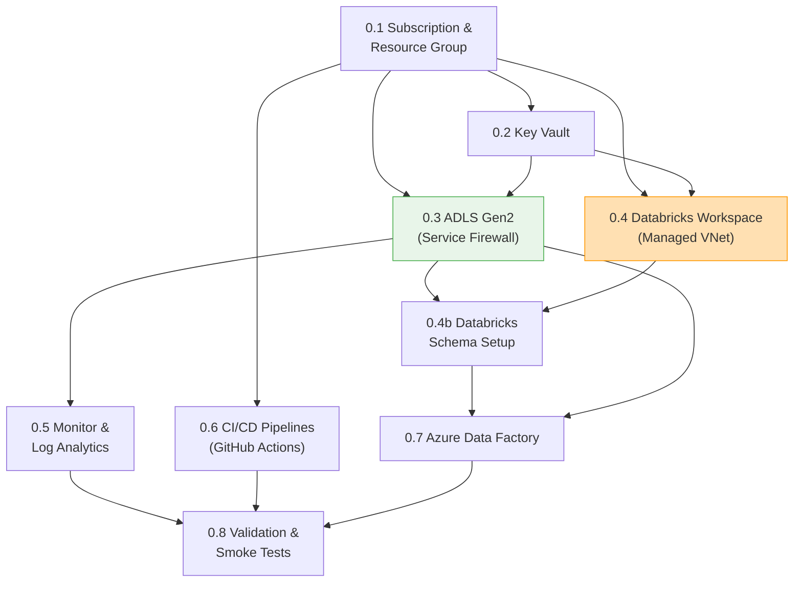

# Phase 0 — IaC & Environment Foundation: Production-Grade Implementation Plan

> [!IMPORTANT]
> This is the **exhaustive, production-grade** plan for Phase 0. Every infrastructure decision — naming conventions, SKU selections, networking topology, RBAC strategy, secret management, diagnostic settings, and CI/CD architecture — is specified here. Phase 0 is the foundation that every subsequent phase depends on. No click-ops. No "we'll configure that later." Everything is code.

> [!CAUTION]
> ## Azure Free Trial Constraints
> This plan is adapted for the **Azure Free Trial** ($200 credit / 30 days). Key constraints:
> - **$200 total budget** — every SKU choice optimizes for cost. Databricks alone can burn $5–15/hour if misconfigured.
> - **No Premium Databricks long-term** — Free Trial includes a 14-day Premium Databricks trial; after that, you drop to Standard (no Unity Catalog, no VNet injection, no cluster policies). Plan accordingly.
> - **No private endpoints** — each private endpoint costs ~$7.20/month. With 4+ endpoints, that's $30/month just for networking. Use service firewall rules instead.
> - **No VNet injection for Databricks** — VNet-injected Databricks requires Premium tier. Use default managed VNet instead.
> - **Azure ML deferred to Phase 3** — Azure ML workspace + compute + Container Registry burns ~$3–5/day even idle. Use MLflow on Databricks (free with Databricks) for Phase 1–2 instead.
> - **Single-environment only** — dev only. No staging/prod until you upgrade to Pay-As-You-Go.
> - **Aggressive auto-termination** — every cluster auto-terminates after 20 minutes idle.
>
> **Upgrade path:** When you move to Pay-As-You-Go or MSDN subscription, the Production Decision Registry (§end) documents exactly what to change: enable VNet injection, add private endpoints, upgrade to Premium Databricks, add Azure ML workspace.

**Phase 0 Goal:** Provision core Azure infrastructure via Bicep, set up Databricks workspace, establish CI/CD pipelines, and create the ADLS Gen2 directory structure — producing an environment where Phase 1 can begin immediately with zero manual setup.

**Duration:** 1–2 weeks

---

## Phase 0 Internal Dependency Graph



> [!NOTE]
> **Compared to the production plan:** Networking (VNet/subnets/private endpoints/DNS zones) is removed entirely for Free Trial. Azure ML Workspace is deferred to Phase 3. Databricks uses managed VNet (default) instead of VNet injection. This saves ~$50–80/month.

---

## 0.1 Azure Subscription & Resource Group Strategy

### 0.1.1 Subscription Decision

| Decision | Choice | Rationale |
|---|---|---|
| **Subscription model** | Single subscription, **1 resource group (dev only)** | Free Trial gives $200 for 30 days. Running 3 environments would burn credits 3x faster. Dev-only until upgrade. |
| **Subscription type** | **Azure Free Trial** | $200 credit, 30 days. Some services have 12-month free tiers (see below). |

> [!WARNING]
> **Free Trial limitations to know upfront:**
> - Cannot create more than ~4 cores of VMs per region (relevant for Databricks cluster sizing)
> - Some regions have limited Free Trial quotas — **Central India** or **East US 2** are usually best
> - Databricks Premium trial is 14 days — after that, you must downgrade to Standard or pay
> - Cannot create service principals with OIDC federated credentials (use client secret instead for CI/CD)

### 0.1.2 Resource Group Naming & Tagging

| Environment | Resource Group Name | Region | Purpose |
|---|---|---|---|
| Development | `rg-fraud-detection-dev` | Central India (or East US 2) | Active development — **only environment for Free Trial** |
| ~~Staging~~ | ~~`rg-fraud-detection-staging`~~ | — | ⏸️ Deferred to Pay-As-You-Go upgrade |
| ~~Production~~ | ~~`rg-fraud-detection-prod`~~ | — | ⏸️ Deferred to Pay-As-You-Go upgrade |

**Tagging policy** — every resource gets these tags:

| Tag | Value | Purpose |
|---|---|---|
| `project` | `fraud-detection` | Cost allocation |
| `environment` | `dev` | Environment identification |
| `owner` | `{your-email}` | Accountability |
| `managed-by` | `bicep` | Distinguish IaC-managed from click-ops resources |

### 0.1.3 Budget Alerts

> [!CAUTION]
> **Azure Free Trial burns fast.** Databricks Premium alone costs ~$0.40/DBU. A 2-worker cluster running for 8 hours/day = ~$15–25/day. You have $200 for 30 days. Set these alerts on day 1.

| Alert | Threshold | Action |
|---|---|---|
| Total subscription spend | $50 (25% of $200) | Email notification — you're on pace for 1 week |
| Total subscription spend | $100 (50% of $200) | Email notification — stop and review what's running |
| Total subscription spend | $160 (80% of $200) | Email + **immediately terminate all Databricks clusters** |
| Daily spend | $15/day | Email notification — something is running that shouldn't be |

> [!TIP]
> **Critical cost-saving rules for Free Trial:**
> - Databricks clusters: **auto-terminate after 20 min idle** (not 30 — every minute costs money)
> - **Never leave a cluster running overnight** — that's $10–20 wasted
> - ADLS Gen2: LRS only (cheapest redundancy)
> - **No Azure ML workspace in Phase 0** — use MLflow on Databricks instead (free)
> - **No private endpoints** — saves ~$7.20/endpoint/month
> - **No VNet injection** — saves the Premium tier requirement
> - Key Vault: Standard tier
> - Log Analytics: 30-day retention, 1 GB/day cap
> - **Check Azure Cost Analysis daily** in the Portal: Cost Management → Cost Analysis

### 0.1.4 Azure Free Tier Services (Included with Free Trial)

These services are free or have free tiers that help stretch the $200 credit:

| Service | Free Tier | How We Use It |
|---|---|---|
| **ADLS Gen2** | First 5 GB storage free | Lakehouse storage (we'll use <5 GB for IEEE-CIS) |
| **Key Vault** | 10,000 operations/month free (Standard) | Secret management |
| **Azure Monitor** | First 5 GB/month Log Analytics free | Centralized logging |
| **Azure Data Factory** | First 5 low-frequency activities free | IEEE-CIS ingestion |
| **Databricks** | 14-day Premium trial included | Unity Catalog, cluster policies (first 2 weeks only) |
| **GitHub Actions** | 2,000 minutes/month free (public repos) | CI/CD |

### 0.1.5 Bicep Template: Resource Group

#### `infrastructure/modules/resource-group.bicep`

```bicep
targetScope = 'subscription'

@description('The environment name — dev only for Free Trial')
@allowed(['dev'])
param environment string = 'dev'

@description('The Azure region for the resource group')
param location string = 'centralindia'

@description('Project name for naming convention')
param projectName string = 'fraud-detection'

@description('Owner email for tagging')
param ownerEmail string

var rgName = 'rg-${projectName}-${environment}'

resource rg 'Microsoft.Resources/resourceGroups@2023-07-01' = {
  name: rgName
  location: location
  tags: {
    project: projectName
    environment: environment
    owner: ownerEmail
    'managed-by': 'bicep'
  }
}

output resourceGroupName string = rg.name
output resourceGroupId string = rg.id
```

---

## 0.2 Networking — SIMPLIFIED FOR FREE TRIAL

> [!NOTE]
> **Free Trial change:** The full production plan uses VNet injection, 6 subnets, private endpoints, and 9 Private DNS zones. All of this is **removed** for the Free Trial to save cost and avoid Premium Databricks dependency.
>
> **What we use instead:** Azure service firewalls (ADLS allows Azure services, Key Vault allows Azure services). Databricks uses its default managed VNet (no custom VNet injection). This is less secure but functional and free.
>
> **Upgrade path:** When you move to Pay-As-You-Go, add the VNet module from the production plan (documented in the Decision Registry at the end of this document).

### 0.2.1 Free Trial Networking Strategy

| Component | Free Trial Choice | Production Upgrade |
|---|---|---|
| **VNet** | ❌ Not created | Add `vnet.bicep` with 6 subnets |
| **Databricks networking** | Default managed VNet (Databricks handles it) | VNet injection into custom subnets |
| **ADLS access** | Public endpoint + service firewall (allow Azure services) | Private endpoint + private DNS zone |
| **Key Vault access** | Public endpoint + service firewall | Private endpoint |
| **Private DNS zones** | ❌ Not created | Add all 9 zones |
| **NSGs** | ❌ Not created | Add per-subnet NSGs |

> [!WARNING]
> This means ADLS and Key Vault are accessible from the public internet (with Azure AD auth). For a portfolio/learning project this is acceptable. For anything with real customer data, you MUST add private endpoints.

### 0.2.2 Service Firewall Configuration (Instead of Private Endpoints)

Applied via Bicep `networkAcls` on each resource:

| Resource | Firewall Setting | Effect |
|---|---|---|
| ADLS Gen2 | `defaultAction: Allow`, `bypass: AzureServices` | Accessible from Azure services + your IP |
| Key Vault | `defaultAction: Allow`, `bypass: AzureServices` | Accessible from Azure Portal + Databricks |
| Databricks | Managed VNet (default) | Databricks manages its own networking |

---

## 0.3 Azure Key Vault

### 0.3.1 Configuration

| Setting | Free Trial Value | Production Upgrade |
|---|---|---|
| **Name** | `kv-fraud-dev` | Add `kv-fraud-staging`, `kv-fraud-prod` |
| **SKU** | **Standard** (free tier: 10,000 ops/month) | Premium for prod (HSM-backed keys) |
| **Soft-delete** | Enabled (90-day retention) | Same |
| **Purge protection** | **Disabled** (allows cleanup when trial ends) | Enable for prod |
| **Access model** | Azure RBAC | Same |
| **Network access** | **Public (Allow all)** — no private endpoint | Private endpoint only for prod |
| **Diagnostic settings** | All logs → Log Analytics | Same |

### 0.3.2 Secret Inventory (Phase 0 Provisioning)

> [!NOTE]
> Not all secrets exist yet. Phase 0 creates **placeholder entries** for secrets that will be populated in later phases. This ensures the Key Vault structure is correct and Databricks secret scope/Azure ML connections reference the right names from day one.

| Secret Name | Populated In | Consumer | Value (Phase 0) |
|---|---|---|---|
| `adls-account-name` | Phase 0 | Databricks, ADF | Actual account name |
| `adls-account-key` | Phase 0 | ADF (for legacy linked services) | Actual key (prefer managed identity) |
| `databricks-workspace-url` | Phase 0 | CI/CD, Azure ML | Actual URL |
| `databricks-pat-token` | Phase 0 | CI/CD (for Databricks CLI/API) | Generated PAT |
| `azureml-workspace-name` | Phase 0 | Training scripts, CI/CD | Actual name |
| `azureml-subscription-id` | Phase 0 | Training scripts | Actual sub ID |
| `azureml-resource-group` | Phase 0 | Training scripts | Actual RG name |
| `eventhub-conn-str` | Phase 2 | Databricks streaming, producers | `PLACEHOLDER` |
| `eventhub-namespace` | Phase 2 | Producers | `PLACEHOLDER` |
| `redis-conn-str` | Phase 3 | Feature store, scoring endpoint | `PLACEHOLDER` |
| `azure-sql-conn-str` | Phase 5 | Decision engine, case management | `PLACEHOLDER` |
| `cosmos-db-conn-str` | Phase 3 | Graph queries | `PLACEHOLDER` |
| `service-bus-conn-str` | Phase 5 | Decision engine, audit logger | `PLACEHOLDER` |
| `app-config-conn-str` | Phase 5 | Decision engine (thresholds) | `PLACEHOLDER` |

### 0.3.3 RBAC Assignments

| Principal | Role | Scope | Purpose |
|---|---|---|---|
| Databricks workspace (managed identity) | `Key Vault Secrets User` | Key Vault | Read secrets for connection strings |
| Azure ML workspace (managed identity) | `Key Vault Secrets User` | Key Vault | Read secrets for training/inference |
| ADF (managed identity) | `Key Vault Secrets User` | Key Vault | Read secrets for linked services |
| CI/CD service principal | `Key Vault Secrets Officer` | Key Vault | Create/update secrets during deployment |
| Developer (your Entra ID) | `Key Vault Administrator` | Key Vault (dev only) | Full access for debugging |
| Azure Functions (managed identity) | `Key Vault Secrets User` | Key Vault | Read secrets at runtime (Phase 5) |

### 0.3.4 Bicep Template: Key Vault

#### `infrastructure/modules/key-vault.bicep`

```bicep
@description('Environment name')
param environment string

@description('Location')
param location string

param projectName string = 'fraud-detection'

@description('Tenant ID for Azure AD')
param tenantId string

@description('Object ID of the deployer for initial access')
param deployerObjectId string

@description('Whether to enable purge protection')
param enablePurgeProtection bool = environment == 'prod'

var kvName = 'kv-fraud-${environment}'

resource keyVault 'Microsoft.KeyVault/vaults@2023-07-01' = {
  name: kvName
  location: location
  tags: {
    project: projectName
    environment: environment
    'managed-by': 'bicep'
  }
  properties: {
    tenantId: tenantId
    sku: {
      family: 'A'
      name: 'standard'    // Free Trial: always Standard (10k free ops/month)
    }
    enableRbacAuthorization: true     // Use RBAC, not access policies
    enableSoftDelete: true
    softDeleteRetentionInDays: 90
    enablePurgeProtection: false     // Free Trial: disabled for easy cleanup
    enabledForDeployment: false
    enabledForDiskEncryption: false
    enabledForTemplateDeployment: true
    publicNetworkAccess: 'Enabled'   // Free Trial: no private endpoint
    networkAcls: {
      defaultAction: 'Allow'         // Free Trial: allow all (no VNet)
      bypass: 'AzureServices'
    }
  }
}

// --- Deployer gets admin role ---
resource deployerAccess 'Microsoft.Authorization/roleAssignments@2022-04-01' = {
  scope: keyVault
  name: guid(keyVault.id, deployerObjectId, 'Key Vault Administrator')
  properties: {
    roleDefinitionId: subscriptionResourceId(
      'Microsoft.Authorization/roleDefinitions', 
      '00482a5a-887f-4fb3-b363-3b7fe8e74483'  // Key Vault Administrator
    )
    principalId: deployerObjectId
    principalType: 'User'
  }
}

// --- Placeholder secrets for later phases ---
resource placeholderSecrets 'Microsoft.KeyVault/vaults/secrets@2023-07-01' = [for secretName in [
  'eventhub-conn-str'
  'eventhub-namespace'
  'redis-conn-str'
  'azure-sql-conn-str'
  'cosmos-db-conn-str'
  'service-bus-conn-str'
  'app-config-conn-str'
]: {
  parent: keyVault
  name: secretName
  properties: {
    value: 'PLACEHOLDER-TO-BE-SET-IN-PHASE-${secretName}'
    contentType: 'text/plain'
    attributes: {
      enabled: true
    }
  }
}]

// --- Diagnostic settings ---
resource kvDiagnostics 'Microsoft.Insights/diagnosticSettings@2021-05-01-preview' = {
  name: '${kvName}-diagnostics'
  scope: keyVault
  properties: {
    workspaceId: logAnalyticsWorkspaceId   // Passed as parameter
    logs: [
      {
        category: 'AuditEvent'
        enabled: true
        retentionPolicy: { enabled: true, days: 365 }
      }
    ]
    metrics: [
      {
        category: 'AllMetrics'
        enabled: true
        retentionPolicy: { enabled: true, days: 90 }
      }
    ]
  }
}

output keyVaultId string = keyVault.id
output keyVaultName string = keyVault.name
output keyVaultUri string = keyVault.properties.vaultUri
```

---

## 0.4 Azure Data Lake Storage Gen2 (ADLS)

### 0.4.1 Configuration

> [!NOTE]
> ADLS Gen2 includes **5 GB free storage** with the Azure Free Trial. The IEEE-CIS dataset is ~1.2 GB raw, and Delta tables with Bronze/Silver/Gold will total ~3–4 GB. You should stay within the free tier for Phase 1.

| Setting | Free Trial Value | Production Upgrade |
|---|---|---|
| **Name** | `stfraudlakedev` | Add `stfraudlakeprod` |
| **Account kind** | StorageV2 | Same |
| **Hierarchical namespace** | Enabled | Same |
| **Redundancy** | **LRS** (cheapest) | ZRS for prod |
| **Access tier (default)** | Hot | Same |
| **TLS version** | 1.2 minimum | Same |
| **Blob public access** | Disabled | Same |
| **Shared key access** | **Enabled** (needed for some Databricks operations) | Disable for prod |
| **Blob soft delete** | **7 days** | 30 days for prod |
| **Container soft delete** | **7 days** | 30 days for prod |
| **Versioning** | Disabled | Same (Delta handles versioning) |

> [!IMPORTANT]
> **Blob versioning decision:** Do NOT enable blob versioning for a Delta Lake lakehouse. Delta's transaction log already provides time-travel, ACID transactions, and full audit trail. Enabling blob versioning on top creates a second copy of every Parquet file on every write, doubling storage cost with zero additional benefit. This is a common and expensive mistake.

### 0.4.2 Container Architecture

ADLS Gen2 uses **filesystem containers** (not blob containers) due to hierarchical namespace:

| Container | Purpose | Lifecycle Policy | Access Pattern |
|---|---|---|---|
| `raw` | Landing zone for batch data (IEEE-CIS CSVs from ADF) | Retain indefinitely (small volume) | Write-once by ADF, read by Auto Loader |
| `bronze` | Raw Delta tables (managed by Unity Catalog) | Retain indefinitely (append-only, replayable) | Write by streaming/batch ingestion, read by Silver jobs |
| `silver` | Cleaned Delta tables | Retain indefinitely | Write by transformation jobs, read by Gold + feature engineering |
| `gold` | Aggregated Delta tables | Retain indefinitely | Write by Gold jobs, read by BI/Power BI |
| `quarantine` | Rejected rows from quality gates | 90-day retention, then auto-delete | Write by quality gates, read by data-quality dashboards |
| `checkpoints` | Structured Streaming checkpoints | Retain while streaming jobs are active; clean up on job replacement | Write/read by Structured Streaming |
| `feature-store` | Offline feature materialization (Azure ML feature store) | Managed by Azure ML feature store | Write by materialization jobs, read by training pipelines |
| `eventhubs-capture` | Event Hubs Capture Avro archive (Phase 2) | 30-day hot, then move to cool tier | Write by Event Hubs Capture, read for recovery backfills |

### 0.4.3 Directory Pre-Creation

```
raw/
├── ieee-cis/                      # Phase 1: IEEE-CIS CSVs
├── reference-data/                # Phase 1+: merchant categories, FX rates
└── kaggle-credit-card/            # Phase 2: Kaggle CC transactions CSV

quarantine/
├── bronze_parse_failures/         # Auto Loader bad records
├── bronze_rejects/                # Quality gate rejects
└── silver_rejects/                # Silver transformation rejects

checkpoints/
├── bronze_ieee_cis/               # Phase 1: batch Auto Loader checkpoint
├── bronze_txn/                    # Phase 2: streaming Event Hubs checkpoint
├── silver_txn/                    # Phase 2: Silver streaming checkpoint
├── feature_eng_velocity/          # Phase 3: velocity features checkpoint
├── feature_eng_geo/               # Phase 3: geo features checkpoint
└── graph_edge_writer/             # Phase 3: Cosmos DB edge writer checkpoint
```

### 0.4.4 Lifecycle Management Policies

```json
{
  "rules": [
    {
      "name": "quarantine-cleanup",
      "enabled": true,
      "type": "Lifecycle",
      "definition": {
        "filters": {
          "blobTypes": ["blockBlob"],
          "prefixMatch": ["quarantine/"]
        },
        "actions": {
          "baseBlob": {
            "delete": { "daysAfterModificationGreaterThan": 90 }
          }
        }
      }
    },
    {
      "name": "eventhubs-capture-tiering",
      "enabled": true,
      "type": "Lifecycle",
      "definition": {
        "filters": {
          "blobTypes": ["blockBlob"],
          "prefixMatch": ["eventhubs-capture/"]
        },
        "actions": {
          "baseBlob": {
            "tierToCool": { "daysAfterModificationGreaterThan": 30 },
            "delete": { "daysAfterModificationGreaterThan": 180 }
          }
        }
      }
    }
  ]
}
```

### 0.4.5 RBAC Assignments for ADLS

| Principal | Role | Scope | Purpose |
|---|---|---|---|
| Databricks workspace (managed identity) | `Storage Blob Data Contributor` | Storage account | Read/write Delta tables, checkpoints |
| Azure ML workspace (managed identity) | `Storage Blob Data Contributor` | Storage account | Feature store materialization, training data access |
| ADF (managed identity) | `Storage Blob Data Contributor` | `raw/` container | Write raw data during ingestion |
| CI/CD service principal | `Storage Blob Data Contributor` | Storage account | Deploy, manage directory structure |
| Developer (Entra ID) | `Storage Blob Data Contributor` | Storage account (dev only) | Debugging, manual inspection |

### 0.4.6 Bicep Template: ADLS Gen2

#### `infrastructure/modules/storage-account.bicep`

```bicep
@description('Environment name')
param environment string

@description('Location')
param location string

param projectName string = 'fraud-detection'

@description('Subnet ID for private endpoint')
param privateEndpointSubnetId string

var storageName = 'stfraudlake${environment}'

resource storageAccount 'Microsoft.Storage/storageAccounts@2023-05-01' = {
  name: storageName
  location: location
  tags: {
    project: projectName
    environment: environment
    'managed-by': 'bicep'
  }
  kind: 'StorageV2'
  sku: {
    name: 'Standard_LRS'                 // Free Trial: cheapest redundancy
  }
  properties: {
    isHnsEnabled: true                   // Hierarchical namespace = ADLS Gen2
    minimumTlsVersion: 'TLS1_2'
    supportsHttpsTrafficOnly: true
    allowBlobPublicAccess: false
    allowSharedKeyAccess: true           // Free Trial: needed for Databricks access
    defaultToOAuthAuthentication: true
    accessTier: 'Hot'
    networkAcls: {
      defaultAction: 'Allow'             // Free Trial: no VNet/private endpoints
      bypass: 'AzureServices'
    }
  }
}

// --- Blob services configuration ---
resource blobServices 'Microsoft.Storage/storageAccounts/blobServices@2023-05-01' = {
  parent: storageAccount
  name: 'default'
  properties: {
    deleteRetentionPolicy: {
      enabled: true
      days: 7                            // Free Trial: shortest retention to save storage
    }
    containerDeleteRetentionPolicy: {
      enabled: true
      days: 7
    }
    // No blob versioning — Delta Lake handles versioning via transaction log
  }
}

// --- Filesystem containers (ADLS Gen2) ---
var containers = [
  'raw'
  'bronze'
  'silver'
  'gold'
  'quarantine'
  'checkpoints'
  'feature-store'
  'eventhubs-capture'
]

resource filesystems 'Microsoft.Storage/storageAccounts/blobServices/containers@2023-05-01' = [for container in containers: {
  parent: blobServices
  name: container
  properties: {
    publicAccess: 'None'
  }
}]

// --- FREE TRIAL: No private endpoints ---
// Private endpoints cost ~$7.20/month each. Skipped for Free Trial.
// Production upgrade: Add pe-${storageName}-dfs and pe-${storageName}-blob
// pointing to snet-private-endpoints subnet.

output storageAccountId string = storageAccount.id
output storageAccountName string = storageAccount.name
output dfsEndpoint string = storageAccount.properties.primaryEndpoints.dfs
```

---

## 0.5 Azure Databricks Workspace

### 0.5.1 Workspace Configuration

> [!CAUTION]
> **Databricks is the most expensive resource in this project.** A Premium workspace itself is free — you only pay for compute (DBUs + VM costs). But even a small cluster costs $3–8/hour. The 14-day Premium trial gives you Unity Catalog and cluster policies for free. After 14 days, decide: (a) downgrade to Standard and lose Unity Catalog (use Hive Metastore instead), or (b) stay Premium and accept the DBU surcharge.

| Setting | Free Trial Value | Production Upgrade |
|---|---|---|
| **Name** | `dbw-fraud-dev` | Add staging/prod workspaces |
| **Pricing tier** | **Premium** (14-day trial included with Azure Free Trial) → then evaluate Standard | Stay Premium permanently |
| **VNet injection** | **❌ Disabled** (uses Databricks managed VNet) | Enable with custom VNet |
| **Managed resource group** | `rg-dbw-fraud-dev-managed` (auto-created) | Same |
| **Public network access** | **Enabled** | Disabled + Private Link for prod |
| **Encryption** | Azure-managed keys | CMK via Key Vault for prod |

### 0.5.2 Bicep Template: Databricks Workspace

#### `infrastructure/modules/databricks-workspace.bicep`

```bicep
@description('Environment name')
param environment string = 'dev'

@description('Location')
param location string

param projectName string = 'fraud-detection'

// FREE TRIAL: No VNet parameters needed — using default managed VNet

var workspaceName = 'dbw-fraud-${environment}'
var managedRgName = 'rg-dbw-fraud-${environment}-managed'

resource databricksWorkspace 'Microsoft.Databricks/workspaces@2024-05-01' = {
  name: workspaceName
  location: location
  tags: {
    project: projectName
    environment: environment
    'managed-by': 'bicep'
  }
  sku: {
    name: 'premium'     // 14-day Premium trial included with Free Trial
  }
  properties: {
    managedResourceGroupId: subscriptionResourceId(
      'Microsoft.Resources/resourceGroups', managedRgName
    )
    publicNetworkAccess: 'Enabled'   // Free Trial: always public
    // FREE TRIAL: No VNet injection parameters
    // Production upgrade: add customVirtualNetworkId, customPublicSubnetName,
    // customPrivateSubnetName, enableNoPublicIp
  }
}

output workspaceId string = databricksWorkspace.id
output workspaceUrl string = databricksWorkspace.properties.workspaceUrl
output workspaceName string = databricksWorkspace.name
```

### 0.5.3 Unity Catalog Setup (Premium Trial Period Only)

> [!WARNING]
> **Unity Catalog requires Premium tier.** You have 14 days of Premium trial. Set up Unity Catalog immediately on day 1. If you downgrade to Standard after 14 days, Unity Catalog will stop working — you'll need the fallback Hive Metastore approach (documented below).

#### `databricks/workspace-setup/create_catalog_schemas.sql`

```sql
-- ============================================================
-- Unity Catalog Setup for Fraud Detection Platform
-- Run this IMMEDIATELY after workspace deployment (day 1)
-- You have 14 days of Premium trial to use Unity Catalog
-- ============================================================

-- Step 1: Create the catalog
CREATE CATALOG IF NOT EXISTS fraud_detection_dev
COMMENT 'Fraud Detection Platform — Development Environment';

-- Step 2: Set as default catalog for this workspace
USE CATALOG fraud_detection_dev;

-- Step 3: Create medallion schemas
CREATE SCHEMA IF NOT EXISTS bronze
COMMENT 'Raw, append-only data. No transformations beyond parsing and metadata attachment.';

CREATE SCHEMA IF NOT EXISTS silver
COMMENT 'Cleaned, conformed, deduplicated, quality-gated data. Source of truth for analytics and ML.';

CREATE SCHEMA IF NOT EXISTS gold
COMMENT 'Business-ready aggregations. Optimized for BI queries and executive dashboards.';

CREATE SCHEMA IF NOT EXISTS quarantine
COMMENT 'Rejected rows from quality gates. Contains rejection reasons. Retained for 90 days.';

CREATE SCHEMA IF NOT EXISTS reference
COMMENT 'Reference/lookup tables (merchant categories, FX rates, risk tiers).';

-- Step 4: Verify
SHOW SCHEMAS IN fraud_detection_dev;
```

#### Fallback: Hive Metastore (If Premium Trial Expires)

```sql
-- ============================================================
-- Hive Metastore Fallback (Standard tier — after Premium trial)
-- Use this if you can't afford Premium after the 14-day trial
-- ============================================================

-- Hive metastore uses 'default' database. Create schemas as databases.
CREATE DATABASE IF NOT EXISTS bronze;
CREATE DATABASE IF NOT EXISTS silver;
CREATE DATABASE IF NOT EXISTS gold;
CREATE DATABASE IF NOT EXISTS quarantine;
CREATE DATABASE IF NOT EXISTS reference;

-- Note: Hive metastore has NO column-level ACLs, NO lineage,
-- NO cross-workspace sharing. Acceptable for a portfolio project.
```

### 0.5.4 Cluster Policies

Three cluster policies govern all compute in the workspace. **All sized for Free Trial budget constraints:**

#### `databricks/workspace-setup/cluster_policies.json`

```json
[
  {
    "name": "streaming-jobs",
    "description": "FREE TRIAL: Streaming jobs. Single-node, smallest VM. Auto-terminate when not actively streaming.",
    "definition": {
      "spark_version": {
        "type": "regex",
        "pattern": "14\\.[0-9]+\\.x-scala2\\.12",
        "defaultValue": "14.3.x-scala2.12"
      },
      "node_type_id": {
        "type": "fixed",
        "value": "Standard_DS3_v2",
        "hidden": true
      },
      "num_workers": {
        "type": "fixed",
        "value": 0,
        "hidden": true
      },
      "spark_conf.spark.master": {
        "type": "fixed",
        "value": "local[*]",
        "hidden": true
      },
      "autotermination_minutes": {
        "type": "fixed",
        "value": 20,
        "hidden": true
      },
      "custom_tags.job-type": {
        "type": "fixed",
        "value": "streaming",
        "hidden": true
      },
      "spark_conf.spark.databricks.delta.autoOptimize.optimizeWrite": {
        "type": "fixed",
        "value": "true",
        "hidden": true
      }
    }
  },
  {
    "name": "batch-jobs",
    "description": "FREE TRIAL: Batch jobs (Bronze→Silver→Gold). Single-node, no Photon (Photon costs extra DBUs). 20-min auto-terminate.",
    "definition": {
      "spark_version": {
        "type": "regex",
        "pattern": "14\\.[0-9]+\\.x-scala2\\.12",
        "defaultValue": "14.3.x-scala2.12"
      },
      "node_type_id": {
        "type": "fixed",
        "value": "Standard_DS3_v2",
        "hidden": true
      },
      "num_workers": {
        "type": "fixed",
        "value": 0,
        "hidden": true
      },
      "spark_conf.spark.master": {
        "type": "fixed",
        "value": "local[*]",
        "hidden": true
      },
      "autotermination_minutes": {
        "type": "fixed",
        "value": 20,
        "hidden": true
      },
      "custom_tags.job-type": {
        "type": "fixed",
        "value": "batch",
        "hidden": true
      },
      "spark_conf.spark.databricks.delta.autoOptimize.optimizeWrite": {
        "type": "fixed",
        "value": "true",
        "hidden": true
      },
      "spark_conf.spark.databricks.delta.autoOptimize.autoCompact": {
        "type": "fixed",
        "value": "true",
        "hidden": true
      }
    }
  },
  {
    "name": "ml-training",
    "description": "FREE TRIAL: ML training. ML Runtime, single-node, 20-min auto-terminate. No GPU (GPU VMs cost $3+/hour).",
    "definition": {
      "spark_version": {
        "type": "regex",
        "pattern": "14\\.[0-9]+\\.x-cpu-ml-scala2\\.12",
        "defaultValue": "14.3.x-cpu-ml-scala2.12"
      },
      "node_type_id": {
        "type": "fixed",
        "value": "Standard_DS3_v2",
        "hidden": true
      },
      "num_workers": {
        "type": "fixed",
        "value": 0,
        "hidden": true
      },
      "spark_conf.spark.master": {
        "type": "fixed",
        "value": "local[*]",
        "hidden": true
      },
      "autotermination_minutes": {
        "type": "fixed",
        "value": 20,
        "hidden": true
      },
      "custom_tags.job-type": {
        "type": "fixed",
        "value": "ml-training",
        "hidden": true
      }
    }
  }
]
```

### 0.5.5 Secret Scope Linked to Key Vault

#### `databricks/workspace-setup/secret_scope_setup.sh`

```bash
#!/bin/bash
# Create a Databricks secret scope backed by Azure Key Vault
# Run this AFTER the workspace and Key Vault are deployed
# Requires: Databricks CLI configured with workspace URL + PAT

set -euo pipefail

ENVIRONMENT="${1:-dev}"
KV_NAME="kv-fraud-${ENVIRONMENT}"
KV_RESOURCE_ID=$(az keyvault show --name "${KV_NAME}" --query id -o tsv)
KV_DNS_NAME=$(az keyvault show --name "${KV_NAME}" --query properties.vaultUri -o tsv)

echo "Creating Databricks secret scope 'kv-fraud' backed by Key Vault '${KV_NAME}'..."

databricks secrets create-scope \
    --scope "kv-fraud" \
    --scope-backend-type AZURE_KEYVAULT \
    --resource-id "${KV_RESOURCE_ID}" \
    --dns-name "${KV_DNS_NAME}"

echo "Verifying secret scope..."
databricks secrets list-scopes
databricks secrets list --scope "kv-fraud"

echo "Secret scope 'kv-fraud' created and linked to Key Vault '${KV_NAME}'"
```

### 0.5.6 Databricks Repos (Git Integration)

| Setting | Value |
|---|---|
| **Git provider** | GitHub |
| **Repository** | `https://github.com/{org}/fraud-detection-platform` |
| **Branch** | `develop` (dev workspace), `main` (prod workspace) |
| **Repos path** | `/Repos/{user}/fraud-detection-platform` |

> **Production decision:** Notebooks are NOT the source of truth — Git is. Developers edit in VS Code / local IDE, push to GitHub, and Databricks Repos syncs. Never edit directly in the Databricks notebook UI for production code.

---

## ~~0.6 Azure ML Workspace~~ — DEFERRED TO PHASE 3

> [!IMPORTANT]
> **Free Trial change:** Azure ML Workspace is **deferred to Phase 3** (Feature Engineering & Feature Store). Here's why:
>
> An Azure ML workspace deploys 4 resources: the workspace itself + Application Insights + Container Registry + a dedicated Storage Account. Even idle, this costs ~$3–5/day:
> - Container Registry (Basic): ~$5/month
> - Application Insights: ~$2–3/month for minimal ingestion
> - Azure ML compute: billed per-minute when running
>
> **What we use instead for Phase 0–2:**
> - **MLflow on Databricks** — Databricks includes MLflow for free. Experiment tracking, model logging, metric comparison — all available without Azure ML.
> - **MLflow Model Registry on Databricks** — Register models directly in Databricks. No Azure ML Model Registry needed.
>
> **When to add Azure ML (Phase 3+):**
> - When you need the **Azure ML Managed Feature Store** (Phase 3)
> - When you need **Managed Online Endpoints** for real-time serving (Phase 4)
> - When you upgrade to Pay-As-You-Go subscription
>
> The `azureml-workspace.bicep` template from the production plan is preserved in the `infrastructure/modules/` directory — ready to deploy when needed.

### 0.6.1 MLflow on Databricks (Phase 0–2 Alternative)

| Feature | MLflow on Databricks | Azure ML |
|---|---|---|
| **Experiment tracking** | ✅ Built-in, free | ✅ |
| **Model logging** | ✅ `mlflow.log_model()` | ✅ |
| **Model registry** | ✅ Databricks Model Registry | ✅ Azure ML Model Registry |
| **Feature store** | ❌ (Phase 3 needs Azure ML) | ✅ Managed Feature Store |
| **Managed endpoints** | ❌ (Phase 4 needs Azure ML) | ✅ Managed Online Endpoints |
| **Cost** | **$0 additional** | ~$3–5/day even idle |

---

## 0.7 Azure Monitor & Log Analytics

### 0.7.1 Log Analytics Workspace

| Setting | Free Trial Value | Production Upgrade |
|---|---|---|
| **Name** | `log-fraud-dev` | Add staging/prod workspaces |
| **Retention** | **30 days** (free tier includes 31 days) | 90d staging, 365d prod |
| **Daily cap** | **1 GB/day** (first 5 GB/month free — cap at 1 GB/day to stay within free tier) | 5 GB/day dev, unlimited prod |
| **SKU** | PerGB2018 | Same |

### 0.7.2 Diagnostic Settings (Connected Resources)

Every resource provisioned in Phase 0 sends diagnostics to Log Analytics:

| Resource | Logs | Metrics |
|---|---|---|
| Key Vault | AuditEvent | AllMetrics |
| ADLS Gen2 | StorageRead, StorageWrite, StorageDelete | Transaction |
| Databricks (via workspace) | Clusters, Jobs, Notebook, SQLPermissions | N/A (via Databricks job metrics) |
| Azure ML | AmlComputeClusterEvent, AmlRunStatusChanged | AllMetrics |

### 0.7.3 Baseline Alerts (Phase 0)

| Alert | Condition | Severity | Action |
|---|---|---|---|
| Key Vault access failure | AuditEvent where ResultType != "Success" > 5 in 5 min | Sev 2 | Email notification |
| ADLS throttling | StorageAccountThrottling > 0 | Sev 3 | Email notification |
| Resource health degraded | Any resource health status != "Available" | Sev 2 | Email notification |
| Budget threshold exceeded | 80% of monthly budget | Sev 3 | Email notification |
| Databricks job failure | Job status == FAILED | Sev 2 | Email notification |
| Azure ML compute utilization | CPU > 90% sustained for 15 min | Sev 3 | Email notification |

### 0.7.4 Bicep Template: Log Analytics

#### `infrastructure/modules/log-analytics.bicep`

```bicep
@description('Environment name')
param environment string

@description('Location')
param location string

param projectName string = 'fraud-detection'

var logAnalyticsName = 'log-fraud-${environment}'

var retentionDays = 30                    // Free Trial: 30 days (free tier)
var dailyCapGb = 1                        // Free Trial: 1 GB/day (stay within free 5 GB/month)

resource logAnalytics 'Microsoft.OperationalInsights/workspaces@2023-09-01' = {
  name: logAnalyticsName
  location: location
  tags: {
    project: projectName
    environment: environment
    'managed-by': 'bicep'
  }
  properties: {
    sku: {
      name: 'PerGB2018'
    }
    retentionInDays: retentionDays
    workspaceCapping: dailyCapGb > 0 ? {
      dailyQuotaGb: dailyCapGb
    } : null
  }
}

output logAnalyticsId string = logAnalytics.id
output logAnalyticsName string = logAnalytics.name
```

---

## 0.8 CI/CD Pipelines (GitHub Actions)

### 0.8.1 Branch Strategy

| Branch | Purpose | Deploys To | Protection |
|---|---|---|---|
| `main` | Production-ready code | Prod (on merge) | Require PR, 1 reviewer, CI passing |
| `staging` | Pre-production validation | Staging (on merge) | Require PR, CI passing |
| `develop` | Active development | Dev (on push) | CI must pass |
| `feature/*` | Feature branches | None (CI only) | None |

### 0.8.2 GitHub Actions Workflows

#### `.github/workflows/infra-deploy.yml`

```yaml
name: Infrastructure Deployment

on:
  push:
    branches: [develop, staging, main]
    paths:
      - 'infrastructure/**'
  pull_request:
    branches: [develop, staging, main]
    paths:
      - 'infrastructure/**'

permissions:
  id-token: write    # Required for Azure OIDC login
  contents: read

env:
  AZURE_SUBSCRIPTION_ID: ${{ secrets.AZURE_SUBSCRIPTION_ID }}

jobs:
  determine-environment:
    runs-on: ubuntu-latest
    outputs:
      environment: ${{ steps.set-env.outputs.environment }}
    steps:
      - id: set-env
        run: |
          if [[ "${{ github.ref }}" == "refs/heads/main" ]]; then
            echo "environment=prod" >> $GITHUB_OUTPUT
          elif [[ "${{ github.ref }}" == "refs/heads/staging" ]]; then
            echo "environment=staging" >> $GITHUB_OUTPUT
          else
            echo "environment=dev" >> $GITHUB_OUTPUT
          fi

  validate:
    runs-on: ubuntu-latest
    needs: determine-environment
    steps:
      - uses: actions/checkout@v4

      - name: Azure Login (OIDC)
        uses: azure/login@v2
        with:
          client-id: ${{ secrets.AZURE_CLIENT_ID }}
          tenant-id: ${{ secrets.AZURE_TENANT_ID }}
          subscription-id: ${{ secrets.AZURE_SUBSCRIPTION_ID }}

      - name: Validate Bicep
        run: |
          az bicep build --file infrastructure/main.bicep
          echo "Bicep validation passed"

      - name: What-If Deployment
        run: |
          az deployment sub what-if \
            --location centralindia \
            --template-file infrastructure/main.bicep \
            --parameters infrastructure/modules/parameters/${{ needs.determine-environment.outputs.environment }}.parameters.json

  deploy:
    runs-on: ubuntu-latest
    needs: [determine-environment, validate]
    if: github.event_name == 'push'
    environment: ${{ needs.determine-environment.outputs.environment }}
    steps:
      - uses: actions/checkout@v4

      - name: Azure Login (OIDC)
        uses: azure/login@v2
        with:
          client-id: ${{ secrets.AZURE_CLIENT_ID }}
          tenant-id: ${{ secrets.AZURE_TENANT_ID }}
          subscription-id: ${{ secrets.AZURE_SUBSCRIPTION_ID }}

      - name: Deploy Infrastructure
        run: |
          az deployment sub create \
            --location centralindia \
            --template-file infrastructure/main.bicep \
            --parameters infrastructure/modules/parameters/${{ needs.determine-environment.outputs.environment }}.parameters.json \
            --name "fraud-infra-$(date +%Y%m%d%H%M%S)"

      - name: Verify Deployment
        run: |
          ENV=${{ needs.determine-environment.outputs.environment }}
          echo "Verifying resources in rg-fraud-detection-${ENV}..."
          az resource list \
            --resource-group "rg-fraud-detection-${ENV}" \
            --output table
```

#### `.github/workflows/data-ci.yml`

```yaml
name: Data Pipeline CI

on:
  push:
    paths:
      - 'databricks/**'
      - 'data-factory/**'
  pull_request:
    paths:
      - 'databricks/**'
      - 'data-factory/**'

jobs:
  lint-and-test:
    runs-on: ubuntu-latest
    steps:
      - uses: actions/checkout@v4

      - name: Set up Python 3.11
        uses: actions/setup-python@v5
        with:
          python-version: '3.11'

      - name: Install dependencies
        run: |
          pip install ruff pytest pyspark==3.5.* pydeequ delta-spark==3.2.*

      - name: Lint PySpark code
        run: |
          ruff check databricks/ --select E,W,F,I

      - name: Run unit tests
        run: |
          pytest databricks/tests/ -v --tb=short

      - name: Validate ADF pipeline JSON
        run: |
          python -c "
          import json, glob
          for f in glob.glob('data-factory/**/*.json', recursive=True):
              with open(f) as fp:
                  json.load(fp)
              print(f'  ✓ {f}')
          "
```

#### `.github/workflows/ml-ci.yml`

```yaml
name: ML Pipeline CI

on:
  push:
    paths:
      - 'ml/**'
  pull_request:
    paths:
      - 'ml/**'

jobs:
  lint-and-test:
    runs-on: ubuntu-latest
    steps:
      - uses: actions/checkout@v4

      - name: Set up Python 3.11
        uses: actions/setup-python@v5
        with:
          python-version: '3.11'

      - name: Install dependencies
        run: |
          pip install -r ml/requirements.txt
          pip install ruff pytest

      - name: Lint ML code
        run: |
          ruff check ml/ --select E,W,F,I

      - name: Run ML unit tests
        run: |
          pytest ml/tests/ -v --tb=short
```

#### `.github/workflows/security-scan.yml`

```yaml
name: Security Scan

on:
  pull_request:
    branches: [develop, staging, main]
  schedule:
    - cron: '0 6 * * 1'  # Weekly Monday 6am UTC

jobs:
  secret-scan:
    runs-on: ubuntu-latest
    steps:
      - uses: actions/checkout@v4
        with:
          fetch-depth: 0

      - name: TruffleHog Secret Scan
        uses: trufflesecurity/trufflehog@main
        with:
          path: ./
          extra_args: --only-verified

  iac-scan:
    runs-on: ubuntu-latest
    steps:
      - uses: actions/checkout@v4

      - name: Checkov IaC Scan
        uses: bridgecrewio/checkov-action@master
        with:
          directory: infrastructure/
          framework: bicep
          soft_fail: true   # Don't block PR on first run; tighten later
```

### 0.8.3 Repository Configuration Files

#### `.github/CODEOWNERS`

```
# Infrastructure changes require platform team review
infrastructure/    @platform-team

# Data pipeline changes require data engineering review
databricks/        @data-engineering-team
data-factory/      @data-engineering-team

# ML code requires data science review
ml/                @data-science-team

# CI/CD changes require platform team review
.github/           @platform-team
```

#### `.github/pull_request_template.md`

```markdown
## Description
<!-- What does this PR do? -->

## Type of Change
- [ ] Infrastructure (Bicep/Terraform)
- [ ] Data pipeline (PySpark/ADF)
- [ ] ML model/training
- [ ] CI/CD
- [ ] Documentation

## Phase
- [ ] Phase 0 (IaC & Environment)
- [ ] Phase 1 (Batch Foundation)
- [ ] Phase 2+ (Streaming/Features/Model/etc.)

## Checklist
- [ ] No secrets/credentials in code
- [ ] Unit tests added/updated
- [ ] Documentation updated
- [ ] CI passes
- [ ] Tested in dev environment

## Verification
<!-- How can the reviewer verify this change works? -->
```

### 0.8.4 GitHub Secrets to Configure

| Secret Name | Purpose | Where to Get |
|---|---|---|
| `AZURE_CLIENT_ID` | Service principal app (client) ID for OIDC login | `az ad sp show --id {sp-id}` |
| `AZURE_TENANT_ID` | Azure AD tenant ID | `az account show --query tenantId` |
| `AZURE_SUBSCRIPTION_ID` | Target subscription | `az account show --query id` |
| `DATABRICKS_HOST` | Workspace URL | `https://adb-{workspace-id}.azuredatabricks.net` |
| `DATABRICKS_TOKEN` | PAT token (for Databricks CLI in CI) | Generated in workspace Settings → Developer |

> **Free Trial note:** OIDC federated credentials may not work with Free Trial service principals. Use **client secret** instead (`AZURE_CLIENT_SECRET`). When you upgrade to Pay-As-You-Go, switch to OIDC.
> 
> **Production upgrade:** Use **OIDC (federated credentials)** for Azure login in CI/CD, NOT a client secret.

---

## 0.9 Azure Data Factory

### 0.9.1 Configuration

| Setting | Value | Rationale |
|---|---|---|
| **Name** | `adf-fraud-{env}` | Per-environment factory |
| **Managed identity** | System-assigned | Auth to ADLS Gen2, Key Vault |
| **Git integration** | GitHub (`data-factory/` directory) | Version-controlled pipelines |
| **Global parameters** | `environment`, `adls_account_name` | Environment-specific configuration |
| **Managed VNet** | Enabled (prod), Disabled (dev) | Prod: private connectivity; dev: simpler debugging |

### 0.9.2 Linked Services (Created in Phase 0)

| Linked Service | Type | Auth Method |
|---|---|---|
| `ls_adls_gen2` | Azure Data Lake Storage Gen2 | Managed identity |
| `ls_keyvault` | Azure Key Vault | Managed identity |

### 0.9.3 RBAC Assignments for ADF

| Assignment | Role | Scope |
|---|---|---|
| ADF managed identity | `Storage Blob Data Contributor` | ADLS Gen2 storage account |
| ADF managed identity | `Key Vault Secrets User` | Key Vault |

---

## 0.10 Main Orchestrator Template

#### `infrastructure/main.bicep`

```bicep
// ============================================================
// Fraud Detection Platform — Main Infrastructure Orchestrator
// FREE TRIAL VERSION — no VNet, no private endpoints, no Azure ML
// ============================================================
// Deploys: Resource Group → Log Analytics → Key Vault → ADLS Gen2 → Databricks
// Usage: az deployment sub create --location centralindia \
//        --template-file main.bicep \
//        --parameters modules/parameters/dev.parameters.json

targetScope = 'subscription'

// --- Parameters ---
@description('Environment name — dev only for Free Trial')
@allowed(['dev'])
param environment string = 'dev'

@description('Azure region')
param location string = 'centralindia'

@description('Owner email for tagging')
param ownerEmail string

@description('Azure AD tenant ID')
param tenantId string

@description('Object ID of the deployer (for Key Vault admin access)')
param deployerObjectId string

param projectName string = 'fraud-detection'

// --- Step 1: Resource Group ---
module rg 'modules/resource-group.bicep' = {
  name: 'deploy-resource-group'
  params: {
    environment: environment
    location: location
    ownerEmail: ownerEmail
  }
}

// --- Step 2: Log Analytics ---
module logAnalytics 'modules/log-analytics.bicep' = {
  name: 'deploy-log-analytics'
  scope: resourceGroup(rg.outputs.resourceGroupName)
  params: {
    environment: environment
    location: location
  }
}

// --- Step 3: Key Vault ---
module keyVault 'modules/key-vault.bicep' = {
  name: 'deploy-keyvault'
  scope: resourceGroup(rg.outputs.resourceGroupName)
  params: {
    environment: environment
    location: location
    tenantId: tenantId
    deployerObjectId: deployerObjectId
  }
}

// --- Step 4: ADLS Gen2 (no private endpoint for Free Trial) ---
module storage 'modules/storage-account.bicep' = {
  name: 'deploy-storage'
  scope: resourceGroup(rg.outputs.resourceGroupName)
  params: {
    environment: environment
    location: location
  }
}

// --- Step 5: Databricks Workspace (no VNet injection for Free Trial) ---
module databricks 'modules/databricks-workspace.bicep' = {
  name: 'deploy-databricks'
  scope: resourceGroup(rg.outputs.resourceGroupName)
  params: {
    environment: environment
    location: location
  }
}

// --- FREE TRIAL: No Azure ML Workspace ---
// Azure ML is deferred to Phase 3. Using MLflow on Databricks instead.
// When ready, uncomment and add azureml-workspace.bicep module.

// --- Outputs ---
output resourceGroupName string = rg.outputs.resourceGroupName
output storageAccountName string = storage.outputs.storageAccountName
output keyVaultName string = keyVault.outputs.keyVaultName
output databricksWorkspaceUrl string = databricks.outputs.workspaceUrl
output logAnalyticsName string = logAnalytics.outputs.logAnalyticsName
```

#### `infrastructure/modules/parameters/dev.parameters.json`

```json
{
  "$schema": "https://schema.management.azure.com/schemas/2019-04-01/deploymentParameters.json#",
  "contentVersion": "1.0.0.0",
  "parameters": {
    "environment": { "value": "dev" },
    "location": { "value": "centralindia" },
    "ownerEmail": { "value": "your-email@example.com" },
    "tenantId": { "value": "YOUR-TENANT-ID" },
    "deployerObjectId": { "value": "YOUR-OBJECT-ID" }
  }
}
```

---

## 0.11 Validation & Smoke Tests

### 0.11.1 Automated Smoke Test Script

#### `infrastructure/scripts/smoke_test.sh`

```bash
#!/bin/bash
# Phase 0 Smoke Test — Validates all provisioned resources
# Usage: ./smoke_test.sh dev
set -euo pipefail

ENV="${1:-dev}"
RG="rg-fraud-detection-${ENV}"
STORAGE="stfraudlake${ENV}"
KV="kv-fraud-${ENV}"
DBW="dbw-fraud-${ENV}"
MLW="mlw-fraud-${ENV}"
LOG="log-fraud-${ENV}"

PASS=0
FAIL=0

check() {
    local description="$1"
    local command="$2"
    
    if eval "$command" > /dev/null 2>&1; then
        echo "  ✅ PASS: ${description}"
        ((PASS++))
    else
        echo "  ❌ FAIL: ${description}"
        ((FAIL++))
    fi
}

echo "=========================================="
echo "Phase 0 Smoke Test — Environment: ${ENV}"
echo "=========================================="

echo ""
echo "--- Resource Group ---"
check "Resource group exists" \
    "az group show --name ${RG} --query name -o tsv"

echo ""
echo "--- Networking ---"
check "VNet exists" \
    "az network vnet show --resource-group ${RG} --name vnet-fraud-${ENV} --query name -o tsv"
check "Databricks host subnet exists" \
    "az network vnet subnet show --resource-group ${RG} --vnet-name vnet-fraud-${ENV} --name snet-databricks-host --query name -o tsv"
check "Databricks container subnet exists" \
    "az network vnet subnet show --resource-group ${RG} --vnet-name vnet-fraud-${ENV} --name snet-databricks-container --query name -o tsv"
check "Private endpoints subnet exists" \
    "az network vnet subnet show --resource-group ${RG} --vnet-name vnet-fraud-${ENV} --name snet-private-endpoints --query name -o tsv"

echo ""
echo "--- Key Vault ---"
check "Key Vault exists" \
    "az keyvault show --name ${KV} --query name -o tsv"
check "Key Vault soft-delete enabled" \
    "az keyvault show --name ${KV} --query properties.enableSoftDelete -o tsv | grep -i true"
check "Placeholder secrets exist" \
    "az keyvault secret list --vault-name ${KV} --query '[].name' -o tsv | grep eventhub-conn-str"

echo ""
echo "--- ADLS Gen2 ---"
check "Storage account exists" \
    "az storage account show --name ${STORAGE} --query name -o tsv"
check "Hierarchical namespace enabled" \
    "az storage account show --name ${STORAGE} --query isHnsEnabled -o tsv | grep -i true"
check "Container 'raw' exists" \
    "az storage fs list --account-name ${STORAGE} --auth-mode login --query '[?name==\`raw\`].name' -o tsv | grep raw"
check "Container 'bronze' exists" \
    "az storage fs list --account-name ${STORAGE} --auth-mode login --query '[?name==\`bronze\`].name' -o tsv | grep bronze"
check "Container 'silver' exists" \
    "az storage fs list --account-name ${STORAGE} --auth-mode login --query '[?name==\`silver\`].name' -o tsv | grep silver"
check "Container 'gold' exists" \
    "az storage fs list --account-name ${STORAGE} --auth-mode login --query '[?name==\`gold\`].name' -o tsv | grep gold"
check "Container 'quarantine' exists" \
    "az storage fs list --account-name ${STORAGE} --auth-mode login --query '[?name==\`quarantine\`].name' -o tsv | grep quarantine"
check "Container 'checkpoints' exists" \
    "az storage fs list --account-name ${STORAGE} --auth-mode login --query '[?name==\`checkpoints\`].name' -o tsv | grep checkpoints"

echo ""
echo "--- Databricks ---"
check "Databricks workspace exists" \
    "az databricks workspace show --resource-group ${RG} --name ${DBW} --query name -o tsv"
check "Databricks workspace exists and is accessible" \
    "az databricks workspace show --resource-group ${RG} --name ${DBW} --query provisioningState -o tsv | grep -i succeeded"

# Azure ML deferred to Phase 3 for Free Trial
# echo ""
# echo "--- Azure ML ---"
# check "Azure ML workspace exists" \
#     "az ml workspace show --name ${MLW} --resource-group ${RG} --query name -o tsv"

echo ""
echo "--- Log Analytics ---"
check "Log Analytics workspace exists" \
    "az monitor log-analytics workspace show --workspace-name ${LOG} --resource-group ${RG} --query name -o tsv"

# Private DNS zones not used in Free Trial
# echo ""
# echo "--- Private DNS Zones ---"
# check "ADLS DFS DNS zone exists" \
#     "az network private-dns zone show ..."

echo ""
echo "=========================================="
echo "Results: ${PASS} passed, ${FAIL} failed"
echo "=========================================="

if [ $FAIL -gt 0 ]; then
    echo "❌ Phase 0 smoke test FAILED"
    exit 1
else
    echo "✅ Phase 0 smoke test PASSED"
    exit 0
fi
```

### 0.11.2 Post-Deployment Manual Verification Checklist

| # | Check | Command / Method | Expected Result | Criticality |
|---|---|---|---|---|
| 1 | Resource group exists with tags | `az group show -n rg-fraud-detection-dev --query tags` | Tags present | 🔴 Blocking |
| 2 | Key Vault accessible | `az keyvault secret list --vault-name kv-fraud-dev` | Returns secret names | 🔴 Blocking |
| 3 | Key Vault RBAC mode | `az keyvault show ... --query properties.enableRbacAuthorization` | `true` | 🔴 Blocking |
| 4 | ADLS Gen2 hierarchical namespace | `az storage account show ... --query isHnsEnabled` | `true` | 🔴 Blocking |
| 5 | All 8 ADLS containers exist | `az storage fs list --account-name ...` | 8 containers | 🔴 Blocking |
| 6 | Databricks workspace accessible | Open workspace URL in browser | Workspace UI loads | 🔴 Blocking |
| 7 | Databricks schemas created | Databricks SQL: `SHOW SCHEMAS` or `SHOW DATABASES` | `bronze, silver, gold, quarantine, reference` | 🔴 Blocking |
| 8 | Databricks secret scope linked | `databricks secrets list-scopes` | `kv-fraud` scope present | 🔴 Blocking |
| 9 | Cluster policies exist | Workspace → Compute → Policies | `streaming-jobs`, `batch-jobs`, `ml-training` | 🟡 Warning |
| 10 | Log Analytics workspace exists | `az monitor log-analytics workspace show ...` | Exists | 🟡 Warning |
| 11 | CI/CD pipeline triggers | Push a change → GitHub Actions runs | Workflow passes | 🔴 Blocking |
| 12 | No secrets in codebase | `trufflehog --only-verified .` | Zero findings | 🔴 Blocking |
| — | ~~VNet/Subnets/NSGs~~ | ~~Skipped for Free Trial~~ | — | ⏸️ Deferred |
| — | ~~Private endpoints/DNS~~ | ~~Skipped for Free Trial~~ | — | ⏸️ Deferred |
| — | ~~Azure ML workspace~~ | ~~Skipped for Free Trial~~ | — | ⏸️ Deferred |

---

## Complete File Structure (Phase 0)

```
fraud-detection-platform/
├── infrastructure/
│   ├── main.bicep                         # Main orchestrator (FREE TRIAL: no VNet, no Azure ML)
│   ├── modules/
│   │   ├── resource-group.bicep
│   │   ├── key-vault.bicep                # Key Vault + placeholder secrets
│   │   ├── storage-account.bicep          # ADLS Gen2 + 8 containers (no private endpoints)
│   │   ├── databricks-workspace.bicep     # Premium trial, managed VNet (no VNet injection)
│   │   ├── log-analytics.bicep            # Centralized logging (1 GB/day cap)
│   │   ├── vnet.bicep                     # ⏸️ KEPT FOR PRODUCTION UPGRADE (not deployed)
│   │   ├── azureml-workspace.bicep        # ⏸️ KEPT FOR PHASE 3 (not deployed)
│   │   └── parameters/
│   │       └── dev.parameters.json        # Only dev for Free Trial
│   ├── scripts/
│   │   └── smoke_test.sh                  # Automated Phase 0 validation
│   └── README.md
│
├── databricks/
│   ├── workspace-setup/
│   │   ├── create_catalog_schemas.sql     # Unity Catalog (+ Hive Metastore fallback)
│   │   ├── cluster_policies.json          # 3 policies (all single-node, 20-min timeout)
│   │   └── secret_scope_setup.sh          # Link Databricks → Key Vault
│   └── README.md
│
├── .github/
│   ├── workflows/
│   │   ├── infra-deploy.yml               # IaC CI/CD
│   │   ├── data-ci.yml                    # Data pipeline lint + test
│   │   ├── ml-ci.yml                      # ML code lint + test
│   │   └── security-scan.yml              # TruffleHog + Checkov
│   ├── CODEOWNERS
│   └── pull_request_template.md
│
├── .gitignore
├── README.md
└── docs/
    └── phase0/
        ├── free_trial_budget_guide.md      # Daily cost tracking instructions
        └── upgrade_to_production.md        # What to change when upgrading
```

---

## Production Decision Registry (Phase 0)

| # | Decision | Free Trial Choice | Production Upgrade | Rationale |
|---|---|---|---|---|
| 1 | IaC tool | **Bicep** | Same | Azure-native, no state file management |
| 2 | CI/CD platform | **GitHub Actions** | Same | Free for public repos |
| 3 | Azure login method | **Client secret** (Free Trial limitation) | Switch to **OIDC federated credentials** | OIDC may not work with Free Trial SPs; client secret is simpler |
| 4 | Key Vault access model | **Azure RBAC** | Same | Modern, auditable |
| 5 | ADLS blob versioning | **Disabled** | Same | Delta handles versioning |
| 6 | ADLS redundancy | **LRS** | ZRS for prod | Cheapest redundancy |
| 7 | Databricks tier | **Premium (14-day trial)** → evaluate Standard | Stay **Premium** permanently | Trial gives Unity Catalog + cluster policies free for 14 days |
| 8 | VNet / Private endpoints | **❌ None** (saves $30–50/month) | Add VNet + 6 subnets + 9 DNS zones + private endpoints | Free Trial can't afford $7.20/endpoint/month × 4+ endpoints |
| 9 | Azure ML Workspace | **❌ Deferred to Phase 3** (saves $3–5/day) | Deploy in Phase 3 | Use MLflow on Databricks instead (free) |
| 10 | Container Registry | **❌ Not deployed** | Basic (dev), Premium (prod) | Only needed when Azure ML is deployed |
| 11 | Databricks cluster sizing | **Single-node, Standard_DS3_v2** | Multi-node autoscale (2–8 workers) | Free Trial vCPU quota is limited; single-node handles IEEE-CIS |
| 12 | Cluster auto-terminate | **20 minutes** (aggressive) | 30 min (batch), disabled (streaming) | Every idle minute costs ~$0.05–0.10 |
| 13 | Environments | **Dev only** | Dev + Staging + Prod | Can't afford 3 environments on $200 |
| 14 | Photon engine | **❌ Disabled** (higher DBU cost) | Enable for batch jobs | Photon charges 2x DBU rate |
| 15 | GPU VMs for ML | **❌ Not used** | Standard_NC6s_v3 ($3+/hour) | Train XGBoost on CPU — tree models don't benefit from GPU |
| 16 | Key Vault SKU | **Standard** | Premium for prod (HSM keys) | Free tier: 10,000 ops/month |
| 17 | Log Analytics daily cap | **1 GB/day** | 5 GB (dev), unlimited (prod) | Free tier: 5 GB/month. 1 GB/day cap stays within that. |
| 18 | Databricks Runtime | **14.x LTS** | Same | LTS for stability |
| 19 | Mono-repo | **Mono-repo** | Same | Simpler for portfolio project |
| 20 | Security scanning | **TruffleHog + Checkov** | Same | Free in GitHub Actions |

---

## Estimated Free Trial Cost Breakdown (Phase 0 + Phase 1)

| Resource | Est. Daily Cost | Monthly Est. | Notes |
|---|---|---|---|
| **Databricks compute** | $5–15/day (when clusters run) | $50–100 | **#1 cost driver.** Only run clusters during active work. |
| **ADLS Gen2 storage** | ~$0.02/day | <$1 | IEEE-CIS data is <5 GB (within free tier) |
| **Key Vault** | ~$0/day | <$1 | 10,000 free operations/month |
| **Log Analytics** | ~$0/day | <$1 | Stay within 5 GB/month free tier |
| **ADF** | ~$0/day | <$1 | 5 free low-frequency activities |
| **Total (with careful use)** | **$5–15/day** | **$50–100** | Leaves $100–150 buffer for the 30-day trial |

---

## Known Issues & Fixes Applied (post-implementation code review, 2026-08-09)

| # | Component | Bug | Fix |
|---|---|---|---|
| 1 | `infrastructure/modules/storage-account.bicep` | The `containers` list provisioned `raw/bronze/silver/gold/quarantine/checkpoints/feature-store/eventhubs-capture` but not `staging` — even though `data-factory/pipelines/pl_ingest_ieee_cis.json`'s own description says it "ingests IEEE-CIS dataset CSVs from staging/blob landing" and `data-factory/datasets/ds_source_ieee_cis_csv.json` reads from `fileSystem: "staging"`. The Copy activities would fail at runtime with "filesystem not found". | Added `staging` to the provisioned container list. |
| 2 | `infrastructure/scripts/smoke_test.sh` | Only checked 6 of the 8 (now 9) provisioned containers — missing `feature-store` and `eventhubs-capture` (and now `staging`). A smoke test that doesn't check every provisioned container can pass while part of the landing zone is silently missing. | Added checks for `feature-store`, `eventhubs-capture`, and `staging`. |

