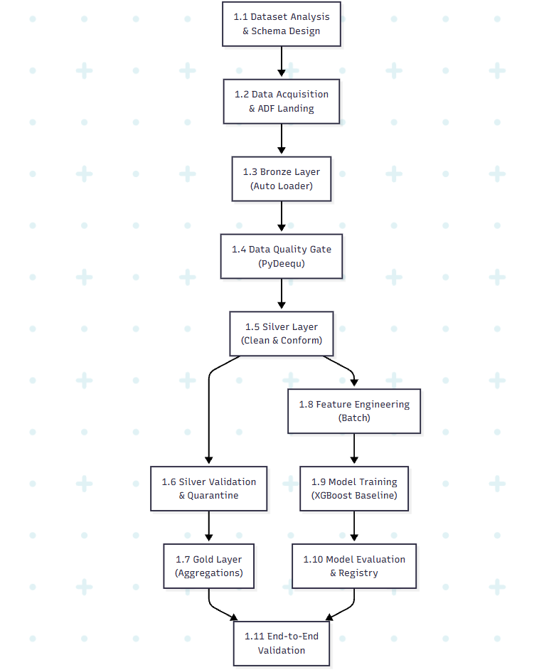
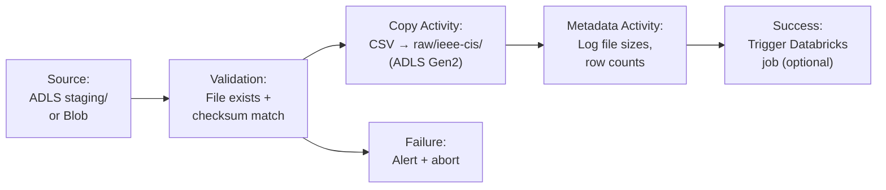

# Phase 1 — Batch Foundation: Production-Grade Implementation Plan

> [!IMPORTANT]
> This is the **exhaustive, production-grade** plan for Phase 1. Every production decision — naming conventions, storage formats, partitioning strategies, data quality rules, null handling policies, feature engineering choices, model evaluation criteria, and failure handling — is specified here. Nothing is left to "figure out later."

**Prerequisite:** Phase 0 (IaC & Environment) is complete. ADLS Gen2, Databricks workspace, Azure ML workspace, Key Vault, CI/CD pipelines, and Unity Catalog are provisioned and verified.

**Phase 1 Goal:** Load the IEEE-CIS Fraud Detection dataset, build a production-quality Bronze → Silver → Gold medallion pipeline, and train a baseline XGBoost model — establishing the data correctness foundation that every subsequent phase depends on.

**Duration:** 2–3 weeks

---

## Phase 1 Internal Dependency Graph



---

## 1.1 Dataset Analysis & Schema Design

> [!NOTE]
> Before writing a single line of ingestion code, you must understand the dataset intimately. Every downstream decision — null handling, type casting, feature engineering, train/test splitting — depends on this analysis.

### 1.1.1 IEEE-CIS Fraud Detection Dataset Anatomy

The IEEE-CIS dataset consists of **4 files** with distinct schemas:

| File | Rows | Columns | Join Key | Role |
|---|---|---|---|---|
| `train_transaction.csv` | ~590,540 | 394 | `TransactionID` | Transaction features + `isFraud` label |
| `train_identity.csv` | ~144,233 | 41 | `TransactionID` | Device/browser/identity features (subset of transactions) |
| `test_transaction.csv` | ~506,691 | 393 | `TransactionID` | Unlabeled transactions (not used for training; useful for distribution comparison) |
| `test_identity.csv` | ~141,907 | 41 | `TransactionID` | Identity for test transactions |

**Critical dataset characteristics that drive production decisions:**

| Characteristic | Detail | Production Impact |
|---|---|---|
| **Fraud rate** | ~3.5% in training set (20,663 fraud / 590,540 total) | Higher than real-world (0.1–0.5%); good for initial training but must not inflate expectations for production metrics |
| **Missing values** | Extreme — many V-columns are 80–99% null; `addr2` is 1.5% null; email domains are ~25% null | Null handling strategy is critical; naive imputation will introduce noise |
| **TransactionDT** | Integer — seconds elapsed from an unspecified reference date (not a real timestamp) | Must synthesize proper timestamps for time-based splitting and temporal feature engineering |
| **Identity coverage** | Only ~24% of transactions have identity records | LEFT JOIN is mandatory; identity features will be null for 76% of rows |
| **Anonymized features** | V1–V339 (Vesta engineered features), id_01–id_38 (identity features) — meanings undisclosed | Cannot apply domain-specific validation; treat as numeric features with careful null handling |
| **Categorical cardinality** | `P_emaildomain`: ~60 unique; `R_emaildomain`: ~60; `id_30` (OS): ~100+; `id_31` (browser): ~130+ | High-cardinality categoricals need encoding strategy (not one-hot for 130+ categories) |

### 1.1.2 Column Classification (Production Schema Design)

Every column must be classified before any transformation code is written. This classification drives type casting, null handling, encoding, and feature selection:

#### Transaction Table Columns

| Column Group | Columns | Type | Null Strategy | Production Notes |
|---|---|---|---|---|
| **Primary key** | `TransactionID` | INT → STRING (cast for consistency with streaming schema) | Never null (reject row) | Uniqueness is the hardest constraint |
| **Label** | `isFraud` | INT (0/1) | Never null in train; absent in test | Only available for training data |
| **Temporal** | `TransactionDT` | INT → TIMESTAMP (synthesized) | Never null (reject row) | See §1.1.3 for timestamp synthesis |
| **Amount** | `TransactionAmt` | DOUBLE | Never null (reject row) | Validate > 0; log-transform for features |
| **Product** | `ProductCD` | STRING categorical | Never null | Domain: {W, H, C, S, R} — validate in quality gate |
| **Card info** | `card1`–`card6` | MIXED (card1/2/3/5 numeric, card4/6 string categorical) | card1: <1% null; card4/card6: ~1% null | card4 = card network (visa/mastercard/etc); card6 = card type (debit/credit) |
| **Address** | `addr1`, `addr2` | NUMERIC (encoded region/country) | addr1: ~11% null; addr2: ~1.5% null | Not real addresses — already anonymized numeric encodings |
| **Distance** | `dist1`, `dist2` | DOUBLE | dist1: ~60% null; dist2: ~93% null | Highly sparse; distance from some reference point |
| **Email domains** | `P_emaildomain`, `R_emaildomain` | STRING categorical | P: ~16% null; R: ~77% null | Purchaser and recipient email domain |
| **Count features** | `C1`–`C14` | DOUBLE | Low nulls (<0.3%) | Counts associated with the payment card |
| **Delta features** | `D1`–`D15` | DOUBLE | D1: ~0%; D2–D15: 50–90% null | Time deltas; extremely sparse |
| **Match features** | `M1`–`M9` | STRING (T/F) | M1: ~48% null; others: 2–50% null | True/False match indicators |
| **Vesta features** | `V1`–`V339` | DOUBLE | Varies wildly: V1–V11 ~47% null; V12–V34 ~13% null; V35–V52 ~17% null; V53–V137 variable; V138–V339 variable | Anonymized engineered features from Vesta; treat as opaque numeric |

#### Identity Table Columns

| Column Group | Columns | Type | Null Strategy | Production Notes |
|---|---|---|---|---|
| **Join key** | `TransactionID` | INT → STRING | Never null | Used for LEFT JOIN to transaction table |
| **Device type** | `DeviceType` | STRING categorical | ~25% null → `"unknown"` | `mobile` / `desktop` |
| **Device info** | `DeviceInfo` | STRING categorical | ~30% null → `"unknown"` | High cardinality (thousands of unique values); needs grouping |
| **ID features** | `id_01`–`id_11` | DOUBLE | Variable (0–40% null) | Anonymized continuous identity features |
| **ID categoricals** | `id_12`–`id_38` | STRING categorical | Variable (0–70% null) | Includes OS version, browser, screen size, etc. |

### 1.1.3 Timestamp Synthesis Decision

> [!WARNING]
> `TransactionDT` is seconds from an unknown reference date. For production-quality temporal features and time-based splitting, we need a proper timestamp strategy.

**Production decision:** Synthesize timestamps by anchoring `TransactionDT = 0` to a chosen reference date. The IEEE-CIS competition context suggests data spans approximately 6 months.

```python
# Timestamp synthesis — anchored to a fixed reference for reproducibility
import pyspark.sql.functions as F

REFERENCE_DATE = "2025-01-01T00:00:00Z"  # Arbitrary but fixed anchor

df = df.withColumn(
    "event_time",
    F.from_unixtime(
        F.unix_timestamp(F.lit(REFERENCE_DATE)) + F.col("TransactionDT")
    )
)
df = df.withColumn("event_date", F.col("event_time").cast("date"))
```

**Why this matters:**
- Time-based train/val/test split requires ordered timestamps
- Temporal features (hour_of_day, day_of_week, is_weekend) need real date components
- Gold aggregations (daily_fraud_summary) need proper date grouping
- Downstream streaming pipeline (Phase 2+) uses `event_time` everywhere — establishing this now prevents refactoring later

### 1.1.4 Production Naming Conventions

| Convention | Rule | Example |
|---|---|---|
| **Table names** | `{layer}.{domain}_{entity}` lowercase, snake_case | `bronze.ieee_cis_transactions`, `silver.transactions` |
| **Column names** | lowercase, snake_case (rename from IEEE-CIS PascalCase) | `TransactionAmt` → `transaction_amt`, `isFraud` → `is_fraud` |
| **Metadata columns** | Prefixed with `_` | `_ingested_at`, `_source_file`, `_batch_id` |
| **Quarantine tables** | `quarantine.{source}_{gate}_rejects` | `quarantine.ieee_cis_bronze_rejects`, `quarantine.ieee_cis_silver_rejects` |
| **Delta table properties** | Set on every table | `delta.autoOptimize.optimizeWrite = true`, `delta.autoOptimize.autoCompact = true` |

---

## 1.2 Data Acquisition & ADF Landing

### 1.2.1 Data Source Preparation

| Step | Detail | Production Decision |
|---|---|---|
| **Download** | Kaggle CLI: `kaggle competitions download -c ieee-fraud-detection` | Automate in CI or document as a one-time manual step |
| **Validation** | SHA256 checksum of each CSV file | Store expected checksums in `data-factory/checksums/ieee_cis_checksums.json` — verify before ADF copies |
| **Upload to staging** | Upload to a temporary Blob container or directly to ADLS `raw/ieee-cis/` | Use `azcopy` for large files (train_transaction.csv is ~1.2GB) |

### 1.2.2 Azure Data Factory Pipeline: `pl_ingest_ieee_cis`



**Pipeline design decisions:**

| Decision | Choice | Rationale |
|---|---|---|
| **Copy mode** | Binary copy (no parsing in ADF) | ADF should not transform CSVs — that's Databricks' job. Binary copy preserves the exact source file. |
| **File naming** | Preserve original filenames | `raw/ieee-cis/train_transaction.csv`, not renamed — Bronze's Auto Loader will handle schema inference |
| **Partitioning at landing** | None (single files per entity) | IEEE-CIS files are not partitioned; partitioning happens at Bronze write time |
| **Parameterization** | Pipeline parameter: `source_path`, `target_container`, `environment` | Same pipeline works for dev/staging/prod; different parameter files per environment |
| **Retry policy** | 2 retries, 30-second interval | Network blips on large file copies are common |
| **Concurrency** | Max 4 concurrent copy activities | Copy all 4 files in parallel |
| **Logging** | ADF pipeline run → Log Analytics | Every pipeline run is auditable |

### 1.2.3 Files to Create

```
data-factory/
├── pipelines/
│   ├── pl_ingest_ieee_cis.json           # Main ingestion pipeline
│   └── pl_validate_raw_landing.json      # Post-copy validation (row counts, schema check)
├── datasets/
│   ├── ds_source_ieee_cis_csv.json       # Source dataset (CSV on Blob/ADLS)
│   └── ds_adls_raw_ieee_cis.json         # Sink dataset (ADLS Gen2 raw/)
├── linked-services/
│   ├── ls_adls_gen2.json                 # ADLS Gen2 linked service (managed identity auth)
│   └── ls_keyvault.json                  # Key Vault linked service
├── triggers/
│   └── tr_manual_ieee_cis.json           # Manual trigger (one-time load)
├── checksums/
│   └── ieee_cis_checksums.json           # Expected SHA256 hashes
└── README.md
```

### 1.2.4 Post-Landing Validation

Before Bronze ingestion starts, validate the raw landing:

| Check | Method | Failure Action |
|---|---|---|
| All 4 files present | ADF GetMetadata activity | Abort pipeline, alert |
| File sizes within expected range | ADF GetMetadata → if-condition | Alert (don't abort — file size can vary with encoding) |
| CSV header row matches expected schema | Databricks notebook: read first row, compare to expected columns | Alert + log mismatch (schema evolution may be intentional) |
| No zero-byte files | ADF GetMetadata | Abort pipeline, alert |

---

## 1.3 Bronze Layer — Raw Ingestion

### 1.3.1 Production Design Decisions

| Decision | Choice | Rationale |
|---|---|---|
| **Ingestion method** | Databricks Auto Loader (`cloudFiles` format) | Handles schema evolution, exactly-once via checkpoint, file-notification mode for efficiency at scale |
| **Trigger mode** | `trigger(availableNow=True)` | Batch-mode for historical load — processes all available files then stops (not a continuous streaming job) |
| **Schema inference** | `cloudFiles.inferColumnTypes = true` | Let Auto Loader infer types from CSV; Bronze should faithfully represent source types |
| **Schema evolution** | `cloudFiles.schemaEvolutionMode = addNewColumns` | If the source adds columns in the future (won't happen for IEEE-CIS, but establishing the pattern for Phase 2 streaming) |
| **Column renaming** | **None at Bronze** | Bronze is raw — preserve original column names exactly as they appear in the source CSV |
| **Partitioning** | `load_date` (processing date, not event date) | Bronze partitions by when data was loaded, not by event time — this is correct because Bronze is append-only and we need to track "when did this data arrive" |
| **Compression** | Delta default (Snappy) | Good balance of speed and compression ratio |
| **Delta table properties** | `delta.autoOptimize.optimizeWrite = true`, `delta.autoOptimize.autoCompact = true` | Prevents small-file problem without manual OPTIMIZE runs |
| **Metadata columns** | `_ingested_at`, `_source_file`, `_batch_id` | Full lineage from source file to Bronze row |

### 1.3.2 Bronze Tables

| Table | Source File | Key | Row Count (Expected) |
|---|---|---|---|
| `bronze.ieee_cis_transactions` | `train_transaction.csv` | `TransactionID` | ~590,540 |
| `bronze.ieee_cis_identity` | `train_identity.csv` | `TransactionID` | ~144,233 |
| `bronze.ieee_cis_test_transactions` | `test_transaction.csv` | `TransactionID` | ~506,691 |
| `bronze.ieee_cis_test_identity` | `test_identity.csv` | `TransactionID` | ~141,907 |

> [!NOTE]
> **Why ingest test data too?** The test set (unlabeled) is useful for: (a) distribution comparison between train/test to detect dataset shift, (b) validating that the pipeline handles the slightly different schema (test has no `isFraud` column) via schema evolution, (c) can be used for unsupervised model evaluation in Phase 4.

### 1.3.3 Bronze Ingestion Code

#### `databricks/notebooks/bronze/ingest_ieee_cis_transactions.py`

```python
# Databricks notebook
# Bronze ingestion: IEEE-CIS train_transaction.csv → bronze.ieee_cis_transactions
# Production-grade: Auto Loader, schema evolution, full metadata, Delta optimization

from pyspark.sql.functions import current_timestamp, input_file_name, lit, md5, concat_ws
from pyspark.sql.types import StringType
import uuid

# --- Configuration ---
ADLS_ACCOUNT = dbutils.secrets.get("kv-fraud", "adls-account-name")
RAW_PATH = f"abfss://raw@{ADLS_ACCOUNT}.dfs.core.windows.net/ieee-cis/"
CHECKPOINT_PATH = f"abfss://checkpoints@{ADLS_ACCOUNT}.dfs.core.windows.net/bronze/ieee_cis_transactions/"
BATCH_ID = str(uuid.uuid4())

# --- Schema hints for problematic columns ---
# Auto Loader infers types, but some IEEE-CIS columns are ambiguous
# (e.g., card1 looks numeric but is semantically categorical)
# Decision: Let Auto Loader infer, then cast explicitly in Silver.
# Bronze preserves source types faithfully.

schema_hints = {
    "cloudFiles.schemaHints": "TransactionID INT, TransactionDT INT, TransactionAmt DOUBLE, isFraud INT"
}

# --- Read with Auto Loader ---
raw_df = (
    spark.readStream
        .format("cloudFiles")
        .option("cloudFiles.format", "csv")
        .option("cloudFiles.schemaEvolutionMode", "addNewColumns")
        .option("cloudFiles.inferColumnTypes", "true")
        .option("header", "true")
        .option("multiLine", "false")
        .option("escape", '"')       # Handle quoted fields
        .option("nullValue", "")     # Empty strings → null (not empty string)
        .options(**schema_hints)
        .load(f"{RAW_PATH}train_transaction.csv")
)

# --- Add metadata columns ---
bronze_df = (
    raw_df
        .withColumn("_ingested_at", current_timestamp())
        .withColumn("_source_file", input_file_name())
        .withColumn("_batch_id", lit(BATCH_ID))
        .withColumn("load_date", current_timestamp().cast("date"))
)

# --- Write to Bronze (Delta) ---
(bronze_df.writeStream
    .format("delta")
    .option("checkpointLocation", CHECKPOINT_PATH)
    .option("mergeSchema", "true")      # Allow schema evolution
    .partitionBy("load_date")
    .trigger(availableNow=True)          # Batch: process all, then stop
    .toTable("fraud_detection_dev.bronze.ieee_cis_transactions"))

# --- Post-ingestion: Set Delta table properties ---
spark.sql("""
    ALTER TABLE fraud_detection_dev.bronze.ieee_cis_transactions 
    SET TBLPROPERTIES (
        'delta.autoOptimize.optimizeWrite' = 'true',
        'delta.autoOptimize.autoCompact' = 'true',
        'delta.logRetentionDuration' = 'interval 30 days',
        'delta.deletedFileRetentionDuration' = 'interval 7 days'
    )
""")

# --- Validation ---
count = spark.table("fraud_detection_dev.bronze.ieee_cis_transactions").count()
print(f"Bronze ieee_cis_transactions: {count} rows ingested (expected ~590,540)")
assert 580_000 < count < 600_000, f"Row count {count} outside expected range"
```

#### `databricks/notebooks/bronze/ingest_ieee_cis_identity.py`

```python
# Bronze ingestion: IEEE-CIS train_identity.csv → bronze.ieee_cis_identity
# Same pattern as transactions, different source and table

from pyspark.sql.functions import current_timestamp, input_file_name, lit
import uuid

ADLS_ACCOUNT = dbutils.secrets.get("kv-fraud", "adls-account-name")
RAW_PATH = f"abfss://raw@{ADLS_ACCOUNT}.dfs.core.windows.net/ieee-cis/"
CHECKPOINT_PATH = f"abfss://checkpoints@{ADLS_ACCOUNT}.dfs.core.windows.net/bronze/ieee_cis_identity/"
BATCH_ID = str(uuid.uuid4())

raw_df = (
    spark.readStream
        .format("cloudFiles")
        .option("cloudFiles.format", "csv")
        .option("cloudFiles.schemaEvolutionMode", "addNewColumns")
        .option("cloudFiles.inferColumnTypes", "true")
        .option("header", "true")
        .option("nullValue", "")
        .load(f"{RAW_PATH}train_identity.csv")
)

bronze_df = (
    raw_df
        .withColumn("_ingested_at", current_timestamp())
        .withColumn("_source_file", input_file_name())
        .withColumn("_batch_id", lit(BATCH_ID))
        .withColumn("load_date", current_timestamp().cast("date"))
)

(bronze_df.writeStream
    .format("delta")
    .option("checkpointLocation", CHECKPOINT_PATH)
    .option("mergeSchema", "true")
    .partitionBy("load_date")
    .trigger(availableNow=True)
    .toTable("fraud_detection_dev.bronze.ieee_cis_identity"))

spark.sql("""
    ALTER TABLE fraud_detection_dev.bronze.ieee_cis_identity 
    SET TBLPROPERTIES (
        'delta.autoOptimize.optimizeWrite' = 'true',
        'delta.autoOptimize.autoCompact' = 'true'
    )
""")

count = spark.table("fraud_detection_dev.bronze.ieee_cis_identity").count()
print(f"Bronze ieee_cis_identity: {count} rows ingested (expected ~144,233)")
assert 140_000 < count < 150_000, f"Row count {count} outside expected range"
```

### 1.3.4 Bronze DLQ / Parse Failure Handling

| Failure Type | Detection | Action |
|---|---|---|
| CSV parse error (malformed row) | Auto Loader's `cloudFiles.badRecordsPath` option | Bad rows written to `quarantine/bronze_parse_failures/` with source file + error reason |
| Schema mismatch (unexpected type) | Auto Loader schema evolution logs | Log warning; column lands as STRING (Auto Loader fallback behavior) |
| Zero-byte file | Post-ingestion row count check | Alert, do not fail pipeline (file may be legitimately empty) |
| Duplicate file re-processing | Auto Loader checkpoint | Silently skipped (exactly-once semantics via checkpoint) |

**Add to the ingestion notebooks:**

```python
# Enable bad-records handling
.option("cloudFiles.badRecordsPath", 
        f"abfss://quarantine@{ADLS_ACCOUNT}.dfs.core.windows.net/bronze_parse_failures/")
```

---

## 1.4 Data Quality Gate (Bronze → Silver)

> [!IMPORTANT]
> This gate runs **before** any Silver transformation. It operates on the raw Bronze data and determines which rows are eligible for promotion to Silver and which are quarantined. This is a hard gate — rows that fail Error-level checks are **never** promoted.

### 1.4.1 Constraint Classification

Production data quality checks are classified into three levels:

| Level | Behavior on Failure | Example |
|---|---|---|
| **Error (Hard)** | Row is rejected → quarantine. Silver never sees it. | `TransactionID IS NULL`, `TransactionAmt < 0` |
| **Warning (Soft)** | Row proceeds to Silver with a `_quality_flag` column set. Surfaced on dashboard. | `addr1` outside expected range but not null |
| **Metric** | Row proceeds; metric is logged for monitoring. No flag, no quarantine. | Distribution of nulls per column, cardinality changes |

### 1.4.2 PyDeequ Constraint Suite

#### `databricks/src/quality/bronze_constraints.py`

```python
"""
Bronze → Silver data quality gate.
Defines hard constraints (Error), soft constraints (Warning), and metrics.

Production decisions:
- Error constraints reject rows → quarantine
- Warning constraints flag rows but allow passage
- Metrics are logged to MLflow/Log Analytics for trend monitoring
"""

from pydeequ.checks import Check, CheckLevel
from pydeequ.verification import VerificationSuite, VerificationResult
from pydeequ.analyzers import (
    AnalysisRunner, Size, Completeness, Uniqueness, 
    Mean, StandardDeviation, Minimum, Maximum,
    CountDistinct, Histogram
)


def create_transaction_error_checks(spark):
    """Hard constraints — failure means row goes to quarantine."""
    return (Check(spark, CheckLevel.Error, "bronze_txn_hard_gate")
        # Primary key: must exist and be unique
        .isComplete("TransactionID")
        .isUnique("TransactionID")
        
        # Amount: must be positive (zero is debatable — keep for now, flag in warning)
        .isNonNegative("TransactionAmt")
        .satisfies("TransactionAmt > 0", "amount_positive", 
                   lambda x: x >= 0.999)  # Allow 0.1% tolerance for edge cases
        
        # Temporal: must exist (we can't place the transaction in time without this)
        .isComplete("TransactionDT")
        .isNonNegative("TransactionDT")
        
        # Product code: must be in known domain
        .isContainedIn("ProductCD", ["W", "H", "C", "S", "R"])
        
        # Label: must be 0 or 1 (for training data)
        .isContainedIn("isFraud", ["0", "1", 0, 1])
    )


def create_transaction_warning_checks(spark):
    """Soft constraints — failure means row is flagged but not rejected."""
    return (Check(spark, CheckLevel.Warning, "bronze_txn_soft_gate")
        # Amount upper bound — extremely large amounts are suspicious data issues
        .satisfies("TransactionAmt < 50000", "amount_upper_bound",
                   lambda x: x >= 0.999)
        
        # Card fields: expect mostly non-null
        .hasCompleteness("card1", lambda x: x >= 0.99)
        .hasCompleteness("card4", lambda x: x >= 0.98)
        .hasCompleteness("card6", lambda x: x >= 0.98)
        
        # Card network: known values
        .isContainedIn("card4", 
            ["visa", "mastercard", "american express", "discover"],
            lambda x: x >= 0.99)
        
        # Card type: known values
        .isContainedIn("card6", 
            ["debit", "credit", "debit or credit", "charge card"],
            lambda x: x >= 0.99)
        
        # Address fields: expect some nulls but not extreme
        .hasCompleteness("addr1", lambda x: x >= 0.85)
        .hasCompleteness("addr2", lambda x: x >= 0.95)
    )


def create_identity_error_checks(spark):
    """Hard constraints for identity table."""
    return (Check(spark, CheckLevel.Error, "bronze_identity_hard_gate")
        .isComplete("TransactionID")
        # TransactionID should be unique in identity table too
        .isUnique("TransactionID")
    )


def run_data_profiling(spark, df, table_name):
    """
    Run statistical profiling on the data.
    Results are logged to MLflow for trend monitoring across loads.
    
    Production rationale: Profiling on every load detects distribution 
    drift in the source data before it manifests as model degradation.
    """
    analysis_result = (AnalysisRunner(spark)
        .onData(df)
        .addAnalyzer(Size())
        .addAnalyzer(Completeness("TransactionID"))
        .addAnalyzer(Completeness("TransactionAmt"))
        .addAnalyzer(Mean("TransactionAmt"))
        .addAnalyzer(StandardDeviation("TransactionAmt"))
        .addAnalyzer(Minimum("TransactionAmt"))
        .addAnalyzer(Maximum("TransactionAmt"))
        .addAnalyzer(CountDistinct("ProductCD"))
        .addAnalyzer(Completeness("card1"))
        .addAnalyzer(Completeness("P_emaildomain"))
        .run()
    )
    return analysis_result
```

### 1.4.3 Quality Gate Orchestrator

#### `databricks/notebooks/quality/run_quality_gate.py`

```python
"""
Orchestrates the data quality gate between Bronze and Silver.
Runs hard checks → soft checks → profiling → routes rows.

Production behavior:
- Hard-fail rows → quarantine.ieee_cis_bronze_rejects (with failure reason)
- Soft-fail rows → proceed to Silver with _quality_flags column
- All results → logged to MLflow for monitoring
"""

from pyspark.sql.functions import col, lit, current_timestamp, array, when, concat_ws
from pydeequ.verification import VerificationSuite, VerificationResult
import mlflow
import json

# Import constraint definitions
# (in production, these are imported from the src/ package)

def run_bronze_quality_gate(spark, bronze_table, quarantine_table):
    """
    Execute the full quality gate.
    Returns: (clean_df, reject_df, quality_report)
    """
    bronze_df = spark.table(bronze_table)
    
    # --- Step 1: Run hard constraints ---
    hard_checks = create_transaction_error_checks(spark)
    hard_result = (VerificationSuite(spark)
        .onData(bronze_df)
        .addCheck(hard_checks)
        .run())
    
    hard_result_df = VerificationResult.checkResultsAsDataFrame(spark, hard_result)
    
    # --- Step 2: Identify failing rows ---
    # PyDeequ operates at dataset level; for row-level routing,
    # we need to apply the constraints as row-level filters
    
    reject_conditions = (
        col("TransactionID").isNull() |
        (col("TransactionAmt") <= 0) |
        col("TransactionDT").isNull() |
        (col("TransactionDT") < 0) |
        col("isFraud").isNull() |
        (~col("ProductCD").isin("W", "H", "C", "S", "R"))
    )
    
    reject_df = (
        bronze_df
            .filter(reject_conditions)
            .withColumn("_rejection_reason", 
                concat_ws("; ",
                    when(col("TransactionID").isNull(), lit("NULL_TRANSACTION_ID")),
                    when(col("TransactionAmt") <= 0, lit("NON_POSITIVE_AMOUNT")),
                    when(col("TransactionDT").isNull(), lit("NULL_TRANSACTION_DT")),
                    when(col("isFraud").isNull(), lit("NULL_LABEL")),
                    when(~col("ProductCD").isin("W", "H", "C", "S", "R"), 
                         lit("INVALID_PRODUCT_CD")),
                ))
            .withColumn("_quarantined_at", current_timestamp())
            .withColumn("_gate", lit("bronze_to_silver"))
    )
    
    clean_df = bronze_df.filter(~reject_conditions)
    
    # --- Step 3: Run soft constraints on clean rows ---
    warning_checks = create_transaction_warning_checks(spark)
    warning_result = (VerificationSuite(spark)
        .onData(clean_df)
        .addCheck(warning_checks)
        .run())
    
    # --- Step 4: Add quality flags to clean rows ---
    flagged_df = (
        clean_df
            .withColumn("_quality_flags",
                concat_ws("; ",
                    when(col("TransactionAmt") >= 50000, lit("HIGH_AMOUNT")),
                    when(col("addr1").isNull(), lit("MISSING_ADDR1")),
                    when(col("P_emaildomain").isNull(), lit("MISSING_EMAIL")),
                ))
    )
    
    # --- Step 5: Write rejects to quarantine ---
    reject_count = reject_df.count()
    if reject_count > 0:
        reject_df.write.mode("append").saveAsTable(quarantine_table)
    
    # --- Step 6: Run profiling ---
    profile = run_data_profiling(spark, clean_df, "ieee_cis_transactions")
    
    # --- Step 7: Log results to MLflow ---
    with mlflow.start_run(run_name="bronze_quality_gate"):
        mlflow.log_metric("total_rows", bronze_df.count())
        mlflow.log_metric("clean_rows", clean_df.count())
        mlflow.log_metric("rejected_rows", reject_count)
        mlflow.log_metric("rejection_rate", reject_count / max(bronze_df.count(), 1))
        mlflow.log_dict(
            VerificationResult.checkResultsAsDataFrame(spark, hard_result)
                .toPandas().to_dict(),
            "hard_check_results.json"
        )
    
    report = {
        "total_rows": bronze_df.count(),
        "clean_rows": clean_df.count(),
        "rejected_rows": reject_count,
        "rejection_rate": reject_count / max(bronze_df.count(), 1),
    }
    
    print(f"Quality Gate Results: {json.dumps(report, indent=2)}")
    return flagged_df, reject_df, report
```

---

## 1.5 Silver Layer — Clean & Conform

### 1.5.1 Production Transformation Decisions

Every transformation applied in Silver is a deliberate production decision:

| Transformation | Rule | Rationale |
|---|---|---|
| **Column renaming** | PascalCase → snake_case (e.g., `TransactionAmt` → `transaction_amt`) | Consistency with streaming schema (Phase 2); Python/SQL convention |
| **Type casting** | `TransactionID` INT → STRING; `card1`–`card5` → STRING (categorical); `isFraud` → INT | Categorical columns must be STRING for encoding; ID as STRING for consistency with streaming UUID |
| **Timestamp synthesis** | `TransactionDT` → `event_time` (TIMESTAMP) anchored to reference date | Time-based splitting, temporal features, Gold aggregations |
| **Null handling (categoricals)** | NULL → `"unknown"` (never `"other"`, never `""`) | `"unknown"` is semantically honest; empty string pollutes categorical encodings; `"other"` implies a known category |
| **Null handling (numerics)** | NULL preserved as NULL + `_{col}_is_null` indicator flag added | Model can learn "missingness as signal" (which is a real fraud signal — missing data often correlates with fraud) |
| **Email domain normalization** | Lowercase, strip whitespace, group rare domains (< 100 occurrences) → `"rare_domain"` | Reduces cardinality while preserving top domains' signal |
| **Card network standardization** | Lowercase, map known variants (`"visa"`, `"Visa"`, `"VISA"` → `"visa"`) | Consistent categorical values |
| **Amount features (pre-computed)** | `log_amount = log1p(transaction_amt)`, `amount_bin` (bucketed) | These are stateless, deterministic transforms that should live in Silver, not recomputed per-model |
| **Deduplication** | `MERGE INTO silver ON transaction_id WHEN NOT MATCHED THEN INSERT` | Idempotent — safe to re-run; handles potential duplicates from Auto Loader or manual re-ingestion |

### 1.5.2 IEEE-CIS-Specific Feature Pre-Processing (Silver-Level)

These are **not** model features — they are data conforming steps that make the data usable for any downstream consumer:

| Pre-Processing | Implementation | Production Notes |
|---|---|---|
| **V-column null grouping** | Group V1–V339 into blocks by null pattern (V1–V11, V12–V34, V35–V52, etc.) | Columns within a block are null together — this is a known IEEE-CIS structure. Track which block a row has data for. |
| **Email domain extraction** | Split `P_emaildomain` on `.` → `email_provider` (gmail, yahoo, etc.) + `email_tld` (.com, .net, etc.) | Provider is a stronger signal than full domain |
| **M-column binarization** | `M1`–`M9`: `"T"` → 1, `"F"` → 0, NULL → NULL (keep the flag pattern) | Boolean encoding for match columns |
| **Device info grouping** | `DeviceInfo` has thousands of unique values → group into top 20 + `"other_device"` | Prevents extreme cardinality from blowing up encoding |
| **OS and browser extraction** | `id_30` → `os_name`, `os_version`; `id_31` → `browser_name`, `browser_version` | Parse structured strings into separate features |

### 1.5.3 Silver Transformation Code

#### `databricks/src/transformations/cleaning.py`

```python
"""
Shared cleaning functions for Silver layer.
Used by both batch (Phase 1) and streaming (Phase 2+) pipelines.

Production principle: Every function is stateless, deterministic, and testable
in isolation without Spark (pure column transformations).
"""

from pyspark.sql import DataFrame
from pyspark.sql.functions import (
    col, when, lower, trim, regexp_replace, log1p, lit,
    split, element_at, coalesce, to_timestamp, from_unixtime,
    unix_timestamp, concat, floor
)
from pyspark.sql.types import StringType, IntegerType, DoubleType


# --- Constants ---
REFERENCE_TIMESTAMP = "2025-01-01T00:00:00Z"
UNKNOWN_SENTINEL = "unknown"
RARE_DOMAIN_SENTINEL = "rare_domain"
RARE_DEVICE_SENTINEL = "other_device"

# Amount bins for bucketing
AMOUNT_BINS = [0, 50, 100, 250, 500, 1000, 2500, 5000, 10000, 50000]
AMOUNT_LABELS = [
    "0_50", "50_100", "100_250", "250_500", "500_1k",
    "1k_2.5k", "2.5k_5k", "5k_10k", "10k_plus"
]


def rename_columns_to_snake_case(df: DataFrame) -> DataFrame:
    """Rename all columns from PascalCase/camelCase to snake_case."""
    import re
    renamed = df
    for col_name in df.columns:
        # Handle special cases first
        snake = col_name
        if col_name == "TransactionID":
            snake = "transaction_id"
        elif col_name == "TransactionDT":
            snake = "transaction_dt"
        elif col_name == "TransactionAmt":
            snake = "transaction_amt"
        elif col_name == "isFraud":
            snake = "is_fraud"
        elif col_name == "ProductCD":
            snake = "product_cd"
        elif col_name == "DeviceType":
            snake = "device_type"
        elif col_name == "DeviceInfo":
            snake = "device_info"
        elif col_name.startswith("_"):
            # Metadata columns — keep as-is
            continue
        else:
            # General PascalCase → snake_case
            snake = re.sub(r'(?<!^)(?=[A-Z])', '_', col_name).lower()
            # Handle P_emaildomain, R_emaildomain (already has underscore)
            if col_name.startswith("P_") or col_name.startswith("R_"):
                snake = col_name.lower()
        
        if snake != col_name:
            renamed = renamed.withColumnRenamed(col_name, snake)
    return renamed


def synthesize_timestamps(df: DataFrame) -> DataFrame:
    """
    Convert TransactionDT (seconds from reference) to proper timestamps.
    
    Production decision: Anchor to a fixed reference date for reproducibility.
    The exact anchor doesn't matter for relative features (time_since_last, 
    hour_of_day) but matters for time-based splitting.
    """
    return (df
        .withColumn("event_time",
            to_timestamp(
                from_unixtime(
                    unix_timestamp(lit(REFERENCE_TIMESTAMP)) + col("transaction_dt")
                )
            ))
        .withColumn("event_date", col("event_time").cast("date"))
        .withColumn("event_hour", col("event_time").cast("int") % 86400 // 3600)
        .withColumn("event_day_of_week", 
            (floor(col("transaction_dt") / 86400) % 7).cast("int"))
    )


def handle_categorical_nulls(df: DataFrame, columns: list) -> DataFrame:
    """Replace null categoricals with 'unknown' sentinel."""
    result = df
    for c in columns:
        result = result.withColumn(c,
            coalesce(lower(trim(col(c))), lit(UNKNOWN_SENTINEL))
        )
    return result


def handle_numeric_null_flags(df: DataFrame, columns: list) -> DataFrame:
    """
    Add _is_null indicator flags for numeric columns.
    
    Production rationale: In fraud detection, missingness IS a feature.
    A missing address field is correlated with fraud — the model should 
    be able to learn this signal. Simply imputing with median destroys it.
    """
    result = df
    for c in columns:
        result = result.withColumn(f"{c}_is_null",
            when(col(c).isNull(), lit(1)).otherwise(lit(0))
        )
    return result


def normalize_email_domains(df: DataFrame, column: str, 
                            min_count: int = 100) -> DataFrame:
    """
    Normalize email domains:
    1. Lowercase + trim
    2. Extract provider and TLD
    3. Group rare domains (< min_count occurrences) into 'rare_domain'
    
    Note: min_count threshold should be computed on the training set 
    and applied consistently to validation/test (stored as a lookup).
    """
    provider_col = f"{column}_provider"
    tld_col = f"{column}_tld"
    
    return (df
        .withColumn(column, lower(trim(col(column))))
        .withColumn(provider_col,
            coalesce(
                element_at(split(col(column), "\\."), 1),
                lit(UNKNOWN_SENTINEL)
            ))
        .withColumn(tld_col,
            coalesce(
                element_at(split(col(column), "\\."), -1),
                lit(UNKNOWN_SENTINEL)
            ))
    )


def standardize_card_network(df: DataFrame) -> DataFrame:
    """Standardize card4 (network) and card6 (type) to lowercase."""
    return (df
        .withColumn("card4", lower(trim(col("card4"))))
        .withColumn("card6", lower(trim(col("card6"))))
    )


def binarize_match_columns(df: DataFrame) -> DataFrame:
    """Convert M1–M9 from T/F strings to 1/0 integers."""
    result = df
    for i in range(1, 10):
        m_col = f"m{i}" if f"m{i}" in df.columns else f"M{i}"
        if m_col in df.columns:
            result = result.withColumn(m_col,
                when(col(m_col) == "T", lit(1))
                .when(col(m_col) == "F", lit(0))
                .otherwise(lit(None).cast(IntegerType()))
            )
    return result


def add_amount_features(df: DataFrame) -> DataFrame:
    """Pre-compute deterministic amount features."""
    return (df
        .withColumn("log_amount", log1p(col("transaction_amt")))
        .withColumn("amount_cents", 
            (col("transaction_amt") * 100).cast("long") % 100)
        .withColumn("is_round_amount",
            when(col("transaction_amt") == floor(col("transaction_amt")), 
                 lit(1)).otherwise(lit(0)))
    )


def cast_types(df: DataFrame) -> DataFrame:
    """
    Explicit type casting for Silver.
    
    Production decision: Cast IDs and categorical-semantics columns to STRING,
    even if they arrived as INT from CSV. This prevents numeric operations 
    on categorical values (e.g., avg(card1) is meaningless).
    """
    string_cols = ["transaction_id", "card1", "card2", "card3", "card5"]
    result = df
    for c in string_cols:
        if c in df.columns:
            result = result.withColumn(c, col(c).cast(StringType()))
    return result
```

#### `databricks/notebooks/silver/transform_ieee_cis_to_silver.py`

```python
"""
Silver transformation: Bronze → Silver for IEEE-CIS dataset.
Applies all cleaning, conforming, deduplication, and quality flagging.

Production guarantees:
- Idempotent (MERGE-based upsert on transaction_id)
- Quarantine-aware (rejects written to quarantine table)
- Fully logged (MLflow metrics for every run)
"""

from pyspark.sql.functions import col, current_timestamp, lit
import mlflow

# Import transformation functions
# In production, these are packaged and installed on the cluster
# from fraud_detection.transformations.cleaning import *

# --- Configuration ---
BRONZE_TXN_TABLE = "fraud_detection_dev.bronze.ieee_cis_transactions"
BRONZE_IDENTITY_TABLE = "fraud_detection_dev.bronze.ieee_cis_identity"
SILVER_TABLE = "fraud_detection_dev.silver.transactions"
QUARANTINE_TABLE = "fraud_detection_dev.quarantine.ieee_cis_silver_rejects"

# --- Step 1: Run quality gate on Bronze data ---
# (see §1.4 — the quality gate notebook runs first and produces clean_df)
clean_df, reject_df, quality_report = run_bronze_quality_gate(
    spark, BRONZE_TXN_TABLE, QUARANTINE_TABLE
)

# --- Step 2: Join with identity table ---
identity_df = spark.table(BRONZE_IDENTITY_TABLE)
# Rename identity columns to avoid collision
identity_renamed = rename_columns_to_snake_case(identity_df)

# LEFT JOIN: only ~24% of transactions have identity records
joined_df = clean_df.join(
    identity_renamed.drop("_ingested_at", "_source_file", "_batch_id", "load_date"),
    on="TransactionID",
    how="left"
)

# --- Step 3: Apply transformations in order ---
silver_df = joined_df
silver_df = rename_columns_to_snake_case(silver_df)
silver_df = cast_types(silver_df)
silver_df = synthesize_timestamps(silver_df)
silver_df = standardize_card_network(silver_df)
silver_df = handle_categorical_nulls(silver_df, [
    "product_cd", "card4", "card6", "p_emaildomain", "r_emaildomain",
    "device_type", "device_info"
])
silver_df = normalize_email_domains(silver_df, "p_emaildomain")
silver_df = normalize_email_domains(silver_df, "r_emaildomain")
silver_df = binarize_match_columns(silver_df)
silver_df = add_amount_features(silver_df)
silver_df = handle_numeric_null_flags(silver_df, [
    "addr1", "addr2", "dist1", "dist2",
    "c1", "c2", "c3", "c4", "c5", "c6", "c7", "c8", "c9", 
    "c10", "c11", "c12", "c13", "c14"
])

# Add Silver metadata
silver_df = (silver_df
    .withColumn("_silver_processed_at", current_timestamp())
    .withColumn("_silver_version", lit("1.0"))
)

# --- Step 4: Write to Silver (idempotent MERGE) ---
# First run: create table. Subsequent runs: MERGE upsert.
if spark.catalog.tableExists(SILVER_TABLE):
    # MERGE for idempotency
    from delta.tables import DeltaTable
    
    silver_table = DeltaTable.forName(spark, SILVER_TABLE)
    
    (silver_table.alias("target")
        .merge(
            silver_df.alias("source"),
            "target.transaction_id = source.transaction_id"
        )
        .whenNotMatchedInsertAll()
        .execute())
else:
    # First run: create table
    (silver_df.write
        .format("delta")
        .partitionBy("event_date")
        .option("overwriteSchema", "true")
        .saveAsTable(SILVER_TABLE))

# --- Step 5: Set Delta table properties ---
spark.sql(f"""
    ALTER TABLE {SILVER_TABLE} 
    SET TBLPROPERTIES (
        'delta.autoOptimize.optimizeWrite' = 'true',
        'delta.autoOptimize.autoCompact' = 'true',
        'delta.logRetentionDuration' = 'interval 30 days'
    )
""")

# --- Step 6: Post-Silver validation ---
silver_count = spark.table(SILVER_TABLE).count()
print(f"Silver transactions: {silver_count} rows")

# Validate: Silver count should be close to Bronze clean count
assert silver_count > 0, "Silver table is empty!"
assert abs(silver_count - quality_report["clean_rows"]) < 100, \
    f"Silver count {silver_count} differs significantly from clean count {quality_report['clean_rows']}"

# --- Step 7: Log to MLflow ---
with mlflow.start_run(run_name="silver_transformation"):
    mlflow.log_metric("silver_row_count", silver_count)
    mlflow.log_metric("identity_join_rate", 
        silver_df.filter(col("device_type").isNotNull()).count() / silver_count)
    mlflow.log_metric("fraud_rate", 
        silver_df.filter(col("is_fraud") == 1).count() / silver_count)
```

### 1.5.4 Silver Data Quality Validation (Post-Transformation)

#### `databricks/src/quality/silver_constraints.py`

```python
"""
Post-transformation Silver quality checks.
These validate that transformations were applied correctly,
not just that the source data is valid.
"""

from pydeequ.checks import Check, CheckLevel
from pydeequ.verification import VerificationSuite


def create_silver_post_transform_checks(spark):
    """Verify Silver transformations produced correct results."""
    return (Check(spark, CheckLevel.Error, "silver_post_transform")
        # Primary key integrity
        .isComplete("transaction_id")
        .isUnique("transaction_id")
        
        # Timestamp synthesis: event_time should exist for all rows
        .isComplete("event_time")
        
        # Column renaming: old names should not exist
        .satisfies("1 = 1", "schema_check")  # placeholder — actual check is schema inspection
        
        # Categorical nulls: should be 'unknown', never null
        .isComplete("product_cd")
        .isComplete("card4")
        .isComplete("card6")
        
        # Amount features: should exist
        .isComplete("log_amount")
        .isNonNegative("log_amount")
        
        # Label: 0 or 1 only
        .isContainedIn("is_fraud", [0, 1])
        
        # Fraud rate sanity check (IEEE-CIS is ~3.5%)
        .satisfies("is_fraud = 1", "fraud_prevalence",
                   lambda x: 0.02 <= x <= 0.06)  # Expect 2–6% fraud rate
    )
```

---

## 1.6 Quarantine System

### 1.6.1 Quarantine Table Schema

```sql
CREATE TABLE IF NOT EXISTS fraud_detection_dev.quarantine.ieee_cis_bronze_rejects (
    -- All original Bronze columns (schema inherited)
    -- Plus:
    _rejection_reason   STRING     COMMENT 'Semicolon-separated list of failed constraints',
    _quarantined_at     TIMESTAMP  COMMENT 'When the row was quarantined',
    _gate               STRING     COMMENT 'Which quality gate rejected this row',
    _batch_id           STRING     COMMENT 'Which ingestion batch this row came from'
)
USING DELTA
PARTITIONED BY (load_date)
TBLPROPERTIES (
    'delta.autoOptimize.optimizeWrite' = 'true',
    'delta.autoOptimize.autoCompact' = 'true',
    'delta.logRetentionDuration' = 'interval 90 days'
);
```

### 1.6.2 Quarantine Monitoring

| Metric | Alert Threshold | Action |
|---|---|---|
| `rejection_rate` (rejects / total) | > 1% (for IEEE-CIS, expect < 0.1%) | Alert — investigate source data quality |
| `rejection_reason_distribution` | Any single reason > 50% of rejects | Alert — systematic data issue |
| Quarantine table row count growth | > 10x previous load | Alert — upstream schema change or data corruption |

---

## 1.7 Gold Layer — Business-Ready Aggregations

### 1.7.1 Gold Table Specifications

Each Gold table has a precise schema, refresh strategy, and downstream consumer:

#### `gold.daily_fraud_summary`

```sql
CREATE TABLE IF NOT EXISTS fraud_detection_dev.gold.daily_fraud_summary (
    event_date           DATE       NOT NULL,
    total_transactions   BIGINT     NOT NULL,
    fraud_transactions   BIGINT     NOT NULL,
    legit_transactions   BIGINT     NOT NULL,
    fraud_rate           DOUBLE     NOT NULL,
    total_amount         DOUBLE     NOT NULL,
    fraud_amount         DOUBLE     NOT NULL,
    legit_amount         DOUBLE     NOT NULL,
    avg_fraud_amount     DOUBLE,
    avg_legit_amount     DOUBLE,
    median_fraud_amount  DOUBLE,
    max_fraud_amount     DOUBLE,
    distinct_products    INT,
    distinct_card_networks INT,
    _computed_at         TIMESTAMP  NOT NULL
)
USING DELTA
PARTITIONED BY (event_date)
COMMENT 'Daily aggregated fraud statistics for executive dashboards and drift monitoring';
```

**Computation:**

```python
# databricks/notebooks/gold/daily_fraud_summary.py

from pyspark.sql.functions import (
    count, sum as _sum, avg, max as _max, 
    countDistinct, col, when, lit, current_timestamp, expr
)

silver_df = spark.table("fraud_detection_dev.silver.transactions")

daily_summary = (
    silver_df
        .groupBy("event_date")
        .agg(
            count("*").alias("total_transactions"),
            _sum(when(col("is_fraud") == 1, 1).otherwise(0)).alias("fraud_transactions"),
            _sum(when(col("is_fraud") == 0, 1).otherwise(0)).alias("legit_transactions"),
            (
                _sum(when(col("is_fraud") == 1, 1).otherwise(0)) / count("*")
            ).alias("fraud_rate"),
            _sum("transaction_amt").alias("total_amount"),
            _sum(when(col("is_fraud") == 1, col("transaction_amt"))).alias("fraud_amount"),
            _sum(when(col("is_fraud") == 0, col("transaction_amt"))).alias("legit_amount"),
            avg(when(col("is_fraud") == 1, col("transaction_amt"))).alias("avg_fraud_amount"),
            avg(when(col("is_fraud") == 0, col("transaction_amt"))).alias("avg_legit_amount"),
            expr("percentile_approx(CASE WHEN is_fraud = 1 THEN transaction_amt END, 0.5)")
                .alias("median_fraud_amount"),
            _max(when(col("is_fraud") == 1, col("transaction_amt"))).alias("max_fraud_amount"),
            countDistinct("product_cd").alias("distinct_products"),
            countDistinct("card4").alias("distinct_card_networks"),
        )
        .withColumn("_computed_at", current_timestamp())
)

# Overwrite entire table (Gold aggregations are recomputable)
(daily_summary.write
    .format("delta")
    .mode("overwrite")
    .option("overwriteSchema", "true")
    .partitionBy("event_date")
    .saveAsTable("fraud_detection_dev.gold.daily_fraud_summary"))
```

#### `gold.merchant_risk_scores` (Placeholder for IEEE-CIS)

> [!NOTE]
> IEEE-CIS doesn't have a real `merchant_id`. The anonymized columns can serve as proxy grouping keys for demonstrating the pattern. In production (Phase 2+), this table will be populated from the streaming canonical schema which has real `merchant_id`.

```python
# databricks/notebooks/gold/product_risk_scores.py
# For Phase 1, we use ProductCD as the grouping key (proxy for merchant category)

product_risk = (
    silver_df
        .groupBy("product_cd")
        .agg(
            count("*").alias("total_transactions"),
            _sum(when(col("is_fraud") == 1, 1).otherwise(0)).alias("fraud_count"),
            (
                _sum(when(col("is_fraud") == 1, 1).otherwise(0)) / count("*")
            ).alias("fraud_rate"),
            avg("transaction_amt").alias("avg_ticket_size"),
            _sum("transaction_amt").alias("total_volume"),
        )
        .withColumn("risk_tier",
            when(col("fraud_rate") > 0.05, lit("high"))
            .when(col("fraud_rate") > 0.02, lit("medium"))
            .otherwise(lit("low"))
        )
        .withColumn("_computed_at", current_timestamp())
)
```

#### `gold.hourly_txn_stats`

```python
# databricks/notebooks/gold/hourly_txn_stats.py

hourly_stats = (
    silver_df
        .groupBy("event_date", "event_hour")
        .agg(
            count("*").alias("txn_count"),
            _sum("transaction_amt").alias("total_amount"),
            avg("transaction_amt").alias("avg_amount"),
            _sum(when(col("is_fraud") == 1, 1).otherwise(0)).alias("fraud_count"),
            (
                _sum(when(col("is_fraud") == 1, 1).otherwise(0)) / count("*")
            ).alias("fraud_rate"),
        )
        .withColumn("_computed_at", current_timestamp())
)
```

#### `gold.card_type_analysis`

```python
# databricks/notebooks/gold/card_type_analysis.py

card_analysis = (
    silver_df
        .groupBy("card4", "card6")  # network x type (visa-debit, visa-credit, etc.)
        .agg(
            count("*").alias("total_transactions"),
            _sum(when(col("is_fraud") == 1, 1).otherwise(0)).alias("fraud_count"),
            (
                _sum(when(col("is_fraud") == 1, 1).otherwise(0)) / count("*")
            ).alias("fraud_rate"),
            avg("transaction_amt").alias("avg_amount"),
            avg(when(col("is_fraud") == 1, col("transaction_amt"))).alias("avg_fraud_amount"),
        )
        .withColumn("_computed_at", current_timestamp())
)
```

### 1.7.2 Gold Layer Quality Checks

```python
# Post-computation validation for all Gold tables
def validate_gold_table(spark, table_name, expected_min_rows):
    df = spark.table(table_name)
    count = df.count()
    assert count >= expected_min_rows, \
        f"{table_name} has {count} rows, expected >= {expected_min_rows}"
    
    # No nulls in computed metrics
    for c in df.columns:
        if not c.startswith("_"):
            null_count = df.filter(col(c).isNull()).count()
            if null_count > 0:
                print(f"WARNING: {table_name}.{c} has {null_count} nulls")

validate_gold_table(spark, "fraud_detection_dev.gold.daily_fraud_summary", 100)
validate_gold_table(spark, "fraud_detection_dev.gold.hourly_txn_stats", 1000)
```

---

## 1.8 Batch Feature Engineering (for Baseline Model)

### 1.8.1 Feature Selection Strategy

> [!IMPORTANT]
> **Production decision:** For the Phase 1 baseline, we use **only batch-computable features** — no streaming velocity features, no graph features, no real-time lookups. This establishes a performance floor that Phase 3+ features must beat.

#### Feature Categories for Baseline

| Category | Features | Count | Source |
|---|---|---|---|
| **Amount** | `log_amount`, `amount_cents`, `is_round_amount`, `transaction_amt` | 4 | Silver pre-computed |
| **Temporal** | `event_hour`, `event_day_of_week`, `is_weekend` (event_day_of_week in [5,6]), `is_night` (event_hour in [0..5]) | 4 | Silver pre-computed |
| **Product/card** | `product_cd` (encoded), `card4` (encoded), `card6` (encoded) | 3 | Silver categoricals |
| **Email** | `p_emaildomain_provider` (encoded), `r_emaildomain_provider` (encoded), `email_domain_match` (P == R) | 3 | Silver pre-computed |
| **Address** | `addr1`, `addr2`, `addr1_is_null`, `addr2_is_null` | 4 | Silver |
| **Distance** | `dist1`, `dist2`, `dist1_is_null`, `dist2_is_null` | 4 | Silver |
| **Count (C)** | `c1`–`c14` + their null flags | 28 | Silver |
| **Delta (D)** | `d1`–`d15` + their null flags | 30 | Silver |
| **Match (M)** | `m1`–`m9` (binarized) | 9 | Silver |
| **Vesta (V)** | Top-N V-columns by importance (selected via initial feature importance or variance threshold) | ~50 | Silver |
| **Identity** | `device_type` (encoded), selected `id_XX` features, `has_identity` (whether identity record exists) | ~15 | Silver (from identity join) |
| **Total** | | **~154** | |

### 1.8.2 Encoding Strategy

| Encoding Type | Applied To | Method |
|---|---|---|
| **Label encoding** | Low-cardinality categoricals (product_cd: 5, card4: 4, card6: 4) | `OrdinalEncoder` (scikit-learn) — preserves for tree models |
| **Target encoding** | Medium-cardinality categoricals (email_provider: ~20 unique) | `TargetEncoder` with 5-fold CV to prevent leakage |
| **Frequency encoding** | High-cardinality categoricals (device_info: 1000+ unique) | Map to frequency rank; rare → single bucket |
| **No encoding needed** | Numeric features (amounts, counts, distances, V-columns) | Used as-is by tree models |

> [!WARNING]
> **Target encoding leakage prevention:** Target encoding uses the label (`is_fraud`) to compute the encoding. To prevent leakage: (a) use leave-one-out or k-fold target encoding during training, (b) compute target-encoding maps ONLY on the training split, (c) apply the frozen map to validation/test.

### 1.8.3 Feature Engineering Code

#### `ml/training/utils/feature_engineering.py`

```python
"""
Batch feature engineering for Phase 1 baseline model.

Production decisions:
- Feature engineering pipeline is a sklearn Pipeline (serializable, reproducible)
- Encoding maps are fitted on train split ONLY, then applied to val/test
- V-column selection uses variance threshold, not manual selection
- Missing value indicators are explicit features (not just imputed away)
"""

import numpy as np
import pandas as pd
from sklearn.base import BaseEstimator, TransformerMixin
from sklearn.pipeline import Pipeline
from sklearn.preprocessing import OrdinalEncoder, StandardScaler
from sklearn.impute import SimpleImputer
from sklearn.feature_selection import VarianceThreshold
from category_encoders import TargetEncoder


class VColumnSelector(BaseEstimator, TransformerMixin):
    """
    Select V-columns with variance above threshold.
    
    Rationale: Many V-columns are >90% null or near-constant.
    Including them adds noise without signal. Use VarianceThreshold 
    after imputation to filter.
    """
    def __init__(self, variance_threshold=0.01, null_threshold=0.95):
        self.variance_threshold = variance_threshold
        self.null_threshold = null_threshold
        self.selected_columns = None
    
    def fit(self, X, y=None):
        # Drop columns with >95% nulls
        null_rates = X.isnull().mean()
        low_null_cols = null_rates[null_rates < self.null_threshold].index.tolist()
        
        # Among remaining, keep those with variance > threshold
        X_filtered = X[low_null_cols].fillna(0)
        vt = VarianceThreshold(threshold=self.variance_threshold)
        vt.fit(X_filtered)
        self.selected_columns = [
            low_null_cols[i] for i, keep in enumerate(vt.get_support()) if keep
        ]
        return self
    
    def transform(self, X):
        return X[self.selected_columns]


class FraudFeatureEngineer(BaseEstimator, TransformerMixin):
    """
    Complete feature engineering pipeline for the baseline model.
    
    Produces a numeric matrix ready for XGBoost/LightGBM.
    """
    def __init__(self):
        self.low_card_encoder = None      # OrdinalEncoder for product_cd, card4, card6
        self.target_encoder = None        # TargetEncoder for email providers
        self.v_selector = None            # V-column variance selector
        self.feature_names = None
        
        # Column groups
        self.numeric_cols = [
            'transaction_amt', 'log_amount', 'amount_cents', 'is_round_amount',
            'event_hour', 'event_day_of_week',
            'addr1', 'addr2', 'dist1', 'dist2',
        ]
        self.count_cols = [f'c{i}' for i in range(1, 15)]
        self.delta_cols = [f'd{i}' for i in range(1, 16)]
        self.match_cols = [f'm{i}' for i in range(1, 10)]
        self.null_flag_cols = [
            'addr1_is_null', 'addr2_is_null', 'dist1_is_null', 'dist2_is_null'
        ] + [f'c{i}_is_null' for i in range(1, 15)]
        self.low_card_cols = ['product_cd', 'card4', 'card6']
        self.target_encode_cols = ['p_emaildomain_provider', 'r_emaildomain_provider']
        self.v_cols = [f'v{i}' for i in range(1, 340)]
        
    def fit(self, X, y=None):
        # Fit encoders on training data only
        self.low_card_encoder = OrdinalEncoder(
            handle_unknown='use_encoded_value', unknown_value=-1
        )
        self.low_card_encoder.fit(X[self.low_card_cols].fillna('unknown'))
        
        if y is not None:
            self.target_encoder = TargetEncoder(cols=self.target_encode_cols)
            self.target_encoder.fit(X[self.target_encode_cols].fillna('unknown'), y)
        
        # Fit V-column selector
        existing_v_cols = [c for c in self.v_cols if c in X.columns]
        if existing_v_cols:
            self.v_selector = VColumnSelector()
            self.v_selector.fit(X[existing_v_cols])
        
        return self
    
    def transform(self, X):
        parts = []
        
        # Numeric features (impute nulls with -999 for tree models)
        numeric_existing = [c for c in self.numeric_cols if c in X.columns]
        parts.append(X[numeric_existing].fillna(-999))
        
        # Count features
        count_existing = [c for c in self.count_cols if c in X.columns]
        parts.append(X[count_existing].fillna(-999))
        
        # Delta features
        delta_existing = [c for c in self.delta_cols if c in X.columns]
        parts.append(X[delta_existing].fillna(-999))
        
        # Match features (already binarized in Silver)
        match_existing = [c for c in self.match_cols if c in X.columns]
        parts.append(X[match_existing].fillna(-1))
        
        # Null flag features
        flag_existing = [c for c in self.null_flag_cols if c in X.columns]
        parts.append(X[flag_existing].fillna(0))
        
        # Low-cardinality encoded
        low_card_encoded = pd.DataFrame(
            self.low_card_encoder.transform(X[self.low_card_cols].fillna('unknown')),
            columns=[f"{c}_encoded" for c in self.low_card_cols],
            index=X.index
        )
        parts.append(low_card_encoded)
        
        # Target-encoded (if fitted)
        if self.target_encoder is not None:
            target_encoded = self.target_encoder.transform(
                X[self.target_encode_cols].fillna('unknown')
            )
            parts.append(target_encoded)
        
        # V-columns (selected)
        if self.v_selector is not None:
            existing_v = [c for c in self.v_cols if c in X.columns]
            v_selected = self.v_selector.transform(X[existing_v]).fillna(-999)
            parts.append(v_selected)
        
        # Derived features
        derived = pd.DataFrame(index=X.index)
        derived['is_weekend'] = X['event_day_of_week'].isin([5, 6]).astype(int)
        derived['is_night'] = X['event_hour'].isin(range(0, 6)).astype(int)
        derived['has_identity'] = (
            X['device_type'].notna() if 'device_type' in X.columns 
            else pd.Series(0, index=X.index)
        ).astype(int)
        derived['email_domain_match'] = (
            (X.get('p_emaildomain_provider', '') == X.get('r_emaildomain_provider', ''))
            & X.get('p_emaildomain_provider', pd.Series('unknown', index=X.index)).ne('unknown')
        ).astype(int)
        parts.append(derived)
        
        result = pd.concat(parts, axis=1)
        self.feature_names = result.columns.tolist()
        return result
```

---

## 1.9 Model Training (XGBoost Baseline)

### 1.9.1 Production Training Decisions

| Decision | Choice | Rationale |
|---|---|---|
| **Algorithm** | XGBoost (start), also train LightGBM for comparison | Tree-based models are SOTA for tabular fraud detection; XGBoost is the IEEE-CIS competition winner family |
| **Splitting** | **Time-based split only** — never random | Random split leaks future fraud patterns into training; produces optimistic, misleading offline metrics. Sort by `transaction_dt`, take first 70% train / next 15% val / last 15% test. |
| **Class imbalance** | `scale_pos_weight = neg_count / pos_count` + evaluate on PR-AUC (not accuracy) | Accuracy is meaningless at 96.5% legitimate — a model that predicts "legit" for everything gets 96.5% accuracy |
| **Metric hierarchy** | Primary: **PR-AUC**. Secondary: Recall@1%FPR, Recall@5%FPR. Tertiary: F1 at optimal threshold. Never: accuracy, ROC-AUC alone | PR-AUC is the right metric for highly imbalanced classification. Recall@fixed-FPR directly maps to business decisions (how much fraud do we catch at an acceptable false-positive rate). |
| **Hyperparameter search** | Bayesian optimization (Optuna) over key hyperparams | Grid search is wasteful; random search doesn't converge; Bayesian is the production standard |
| **Cross-validation** | **Time-series CV** (expanding window or sliding window), not k-fold | k-fold violates temporal ordering; time-series CV respects causality |
| **Early stopping** | `early_stopping_rounds=50` on validation PR-AUC | Prevents overfitting; uses the time-ordered validation set |
| **Calibration** | Platt scaling (sigmoid) on the validation set | XGBoost raw probabilities are not well-calibrated; calibration is required for the decision engine thresholds in Phase 5 |
| **SHAP** | Compute on test set, log summary plot + top-20 feature importances | Required for explainability (regulatory) and for understanding what the model learned |

### 1.9.2 Training Code

#### `ml/training/train_xgboost_baseline.py`

```python
"""
XGBoost baseline training for fraud detection.

Production-grade:
- Time-based splitting (never random)
- Class-weighted loss
- Hyperparameter optimization via Optuna
- Calibration via Platt scaling
- SHAP explainability
- Full MLflow logging (params, metrics, artifacts, model)
- Registered in Azure ML Model Registry
"""

import xgboost as xgb
import lightgbm as lgb
import optuna
import mlflow
import mlflow.xgboost
import numpy as np
import pandas as pd
import shap
import matplotlib.pyplot as plt
from sklearn.calibration import CalibratedClassifierCV
from sklearn.metrics import (
    precision_recall_curve, auc, f1_score, 
    confusion_matrix, classification_report
)
import joblib
import json
import yaml
import os


# --- Configuration ---
with open("config/xgboost_baseline.yaml", "r") as f:
    config = yaml.safe_load(f)

EXPERIMENT_NAME = config["experiment_name"]  # "fraud-detection-baseline"
SILVER_TABLE = config["silver_table"]
TRAIN_RATIO = config.get("train_ratio", 0.70)
VAL_RATIO = config.get("val_ratio", 0.15)
# TEST_RATIO = 1 - TRAIN_RATIO - VAL_RATIO = 0.15
N_OPTUNA_TRIALS = config.get("n_optuna_trials", 50)


def load_time_split_data(spark, silver_table, train_ratio, val_ratio):
    """
    Load Silver data and split by time.
    
    Production decision: Sort by transaction_dt, not by event_time (synthetic).
    transaction_dt preserves the original temporal ordering from IEEE-CIS.
    """
    df = spark.table(silver_table).toPandas()
    
    # Sort by original temporal column
    df = df.sort_values("transaction_dt").reset_index(drop=True)
    
    n = len(df)
    train_end = int(n * train_ratio)
    val_end = int(n * (train_ratio + val_ratio))
    
    train_df = df.iloc[:train_end]
    val_df = df.iloc[train_end:val_end]
    test_df = df.iloc[val_end:]
    
    # Log split statistics
    for name, split_df in [("train", train_df), ("val", val_df), ("test", test_df)]:
        fraud_rate = split_df["is_fraud"].mean()
        print(f"{name}: {len(split_df)} rows, fraud rate: {fraud_rate:.4f}")
    
    return train_df, val_df, test_df


def compute_metrics(y_true, y_pred_proba, prefix=""):
    """Compute all production fraud detection metrics."""
    precision, recall, thresholds = precision_recall_curve(y_true, y_pred_proba)
    pr_auc = auc(recall, precision)
    
    # Recall at fixed false positive rates
    from sklearn.metrics import roc_curve
    fpr, tpr, roc_thresholds = roc_curve(y_true, y_pred_proba)
    recall_at_1_fpr = np.interp(0.01, fpr, tpr)
    recall_at_5_fpr = np.interp(0.05, fpr, tpr)
    
    # Optimal threshold (maximize F1)
    f1_scores = 2 * (precision * recall) / (precision + recall + 1e-10)
    optimal_idx = np.argmax(f1_scores)
    optimal_threshold = thresholds[optimal_idx] if optimal_idx < len(thresholds) else 0.5
    
    y_pred_optimal = (y_pred_proba >= optimal_threshold).astype(int)
    f1_optimal = f1_score(y_true, y_pred_optimal)
    
    metrics = {
        f"{prefix}pr_auc": pr_auc,
        f"{prefix}recall_at_1pct_fpr": recall_at_1_fpr,
        f"{prefix}recall_at_5pct_fpr": recall_at_5_fpr,
        f"{prefix}f1_optimal": f1_optimal,
        f"{prefix}optimal_threshold": optimal_threshold,
    }
    return metrics, precision, recall, thresholds


def train_and_evaluate():
    """Main training function."""
    
    mlflow.set_experiment(EXPERIMENT_NAME)
    
    with mlflow.start_run(run_name="xgboost-baseline-v1") as run:
        # --- Load and split data ---
        train_df, val_df, test_df = load_time_split_data(
            spark, SILVER_TABLE, TRAIN_RATIO, VAL_RATIO
        )
        
        # --- Feature engineering ---
        feature_engineer = FraudFeatureEngineer()
        
        y_train = train_df["is_fraud"].values
        y_val = val_df["is_fraud"].values
        y_test = test_df["is_fraud"].values
        
        # Fit on train only
        feature_engineer.fit(train_df, y_train)
        
        X_train = feature_engineer.transform(train_df)
        X_val = feature_engineer.transform(val_df)
        X_test = feature_engineer.transform(test_df)
        
        mlflow.log_metric("n_features", X_train.shape[1])
        mlflow.log_metric("n_train", len(X_train))
        mlflow.log_metric("n_val", len(X_val))
        mlflow.log_metric("n_test", len(X_test))
        mlflow.log_metric("train_fraud_rate", y_train.mean())
        mlflow.log_metric("val_fraud_rate", y_val.mean())
        mlflow.log_metric("test_fraud_rate", y_test.mean())
        
        # --- Hyperparameter optimization ---
        fraud_ratio = y_train.mean()
        scale_pos_weight = (1 - fraud_ratio) / fraud_ratio
        
        def objective(trial):
            params = {
                "objective": "binary:logistic",
                "eval_metric": "aucpr",
                "scale_pos_weight": scale_pos_weight,
                "max_depth": trial.suggest_int("max_depth", 3, 10),
                "learning_rate": trial.suggest_float("learning_rate", 0.01, 0.3, log=True),
                "n_estimators": trial.suggest_int("n_estimators", 100, 1000),
                "subsample": trial.suggest_float("subsample", 0.5, 1.0),
                "colsample_bytree": trial.suggest_float("colsample_bytree", 0.3, 1.0),
                "min_child_weight": trial.suggest_int("min_child_weight", 1, 10),
                "gamma": trial.suggest_float("gamma", 0, 5),
                "reg_alpha": trial.suggest_float("reg_alpha", 1e-8, 10, log=True),
                "reg_lambda": trial.suggest_float("reg_lambda", 1e-8, 10, log=True),
                "tree_method": "hist",   # Fast histogram-based
                "random_state": 42,
            }
            
            model = xgb.XGBClassifier(**params)
            model.fit(
                X_train, y_train,
                eval_set=[(X_val, y_val)],
                verbose=False
            )
            
            y_pred = model.predict_proba(X_val)[:, 1]
            precision, recall, _ = precision_recall_curve(y_val, y_pred)
            return auc(recall, precision)
        
        study = optuna.create_study(direction="maximize")
        study.optimize(objective, n_trials=N_OPTUNA_TRIALS, show_progress_bar=True)
        
        best_params = study.best_trial.params
        best_params.update({
            "objective": "binary:logistic",
            "eval_metric": "aucpr",
            "scale_pos_weight": scale_pos_weight,
            "tree_method": "hist",
            "random_state": 42,
        })
        
        mlflow.log_params(best_params)
        
        # --- Train final model with best params ---
        final_model = xgb.XGBClassifier(**best_params)
        final_model.fit(
            X_train, y_train,
            eval_set=[(X_val, y_val)],
            verbose=50
        )
        
        # --- Evaluate on test set ---
        y_test_proba = final_model.predict_proba(X_test)[:, 1]
        test_metrics, precision, recall, thresholds = compute_metrics(
            y_test, y_test_proba, prefix="test_"
        )
        mlflow.log_metrics(test_metrics)
        
        # --- Calibration ---
        calibrated_model = CalibratedClassifierCV(
            final_model, method="sigmoid", cv="prefit"
        )
        calibrated_model.fit(X_val, y_val)
        
        y_test_calibrated = calibrated_model.predict_proba(X_test)[:, 1]
        cal_metrics, _, _, _ = compute_metrics(
            y_test, y_test_calibrated, prefix="calibrated_test_"
        )
        mlflow.log_metrics(cal_metrics)
        
        # --- SHAP Explainability ---
        explainer = shap.TreeExplainer(final_model)
        shap_values = explainer.shap_values(X_test.iloc[:1000])  # Subsample for speed
        
        # Summary plot
        fig, ax = plt.subplots(figsize=(12, 8))
        shap.summary_plot(shap_values, X_test.iloc[:1000], 
                         feature_names=feature_engineer.feature_names,
                         show=False)
        plt.tight_layout()
        mlflow.log_figure(fig, "shap_summary_plot.png")
        plt.close()
        
        # Top-20 feature importances
        feature_importance = pd.DataFrame({
            "feature": feature_engineer.feature_names,
            "importance": final_model.feature_importances_
        }).sort_values("importance", ascending=False).head(20)
        mlflow.log_dict(feature_importance.to_dict(), "top_20_features.json")
        
        # --- Precision-Recall curve ---
        fig, ax = plt.subplots(figsize=(8, 6))
        ax.plot(recall, precision, label=f"PR-AUC = {test_metrics['test_pr_auc']:.4f}")
        ax.set_xlabel("Recall")
        ax.set_ylabel("Precision")
        ax.set_title("Precision-Recall Curve (Test Set)")
        ax.legend()
        mlflow.log_figure(fig, "pr_curve.png")
        plt.close()
        
        # --- Save artifacts ---
        joblib.dump(feature_engineer, "feature_engineer.pkl")
        mlflow.log_artifact("feature_engineer.pkl")
        
        joblib.dump(calibrated_model, "calibrated_model.pkl")
        mlflow.log_artifact("calibrated_model.pkl")
        
        # --- Register model ---
        mlflow.xgboost.log_model(
            final_model, 
            "model",
            registered_model_name="fraud-xgboost-baseline"
        )
        
        # --- Print summary ---
        print("\n" + "="*60)
        print("TRAINING COMPLETE")
        print("="*60)
        for k, v in test_metrics.items():
            print(f"  {k}: {v:.4f}")
        print(f"\n  Top 5 Features:")
        for _, row in feature_importance.head(5).iterrows():
            print(f"    {row['feature']}: {row['importance']:.4f}")
        print("="*60)


# Execute
train_and_evaluate()
```

### 1.9.3 Expected Baseline Performance

Based on IEEE-CIS competition results and the feature set available in Phase 1:

| Metric | Expected Range | Notes |
|---|---|---|
| **PR-AUC** | 0.55–0.75 | Without streaming velocity features, this is the floor. Phase 3 features should push this to 0.80+ |
| **Recall@1% FPR** | 0.30–0.50 | How much fraud we catch while blocking only 1% of legitimate transactions |
| **Recall@5% FPR** | 0.55–0.70 | More permissive false-positive tolerance |
| **F1 (optimal threshold)** | 0.50–0.65 | At the threshold that maximizes F1 |

> [!NOTE]
> These numbers are **intentionally conservative**. The baseline uses only batch features. The value of this baseline is not its absolute performance — it's that every future model change can be measured against this floor. If Phase 3 streaming features don't beat this, something is wrong with the features, not the model.

---

## 1.10 Model Registry & Artifact Management

| Artifact | Storage | Purpose |
|---|---|---|
| **XGBoost model** | Azure ML Model Registry: `fraud-xgboost-baseline` v1 | Inference (Phase 4+) |
| **Calibrated model** | MLflow artifact: `calibrated_model.pkl` | Calibrated probabilities for decision engine |
| **Feature engineer** | MLflow artifact: `feature_engineer.pkl` | Reproducible feature transformation (same pipeline for train and inference) |
| **SHAP summary** | MLflow artifact: `shap_summary_plot.png` | Explainability / compliance |
| **Feature importance** | MLflow artifact: `top_20_features.json` | Feature selection for future iterations |
| **Optuna study** | MLflow artifact: `optuna_study.pkl` | Hyperparameter optimization history |
| **Training data snapshot** | Delta table version number logged in MLflow tags | Reproducibility — know exactly which data version trained this model |

---

## 1.11 End-to-End Validation & Phase 1 Acceptance Criteria

### 1.11.1 Data Pipeline Validation

| Check | Query / Command | Expected Result | Criticality |
|---|---|---|---|
| Raw files landed | `dbutils.fs.ls("abfss://raw@.../ieee-cis/")` | 4 CSV files present | 🔴 Blocking |
| Bronze transaction count | `SELECT COUNT(*) FROM bronze.ieee_cis_transactions` | ~590,540 ± 100 | 🔴 Blocking |
| Bronze identity count | `SELECT COUNT(*) FROM bronze.ieee_cis_identity` | ~144,233 ± 50 | 🔴 Blocking |
| Bronze uniqueness | `SELECT COUNT(DISTINCT TransactionID) FROM bronze.ieee_cis_transactions` | = total count | 🔴 Blocking |
| Quality gate rejection rate | From quality gate report | < 1% | 🟡 Warning if > 1% |
| Silver row count | `SELECT COUNT(*) FROM silver.transactions` | ≈ Bronze - rejects | 🔴 Blocking |
| Silver schema | `DESCRIBE silver.transactions` | All columns snake_case; `event_time` exists; no `TransactionDT` | 🔴 Blocking |
| Silver null sentinels | `SELECT COUNT(*) FROM silver.transactions WHERE product_cd IS NULL` | = 0 (all nulls → 'unknown') | 🔴 Blocking |
| Silver timestamp range | `SELECT MIN(event_time), MAX(event_time) FROM silver.transactions` | Spans ~6 months | 🟡 Warning |
| Silver fraud rate | `SELECT AVG(is_fraud) FROM silver.transactions` | ~0.035 (3.5%) | 🟡 Warning if outside 2–6% |
| Gold daily summary | `SELECT COUNT(*) FROM gold.daily_fraud_summary` | > 100 rows (100+ distinct days) | 🔴 Blocking |
| Gold fraud rate consistency | `SELECT AVG(fraud_rate) FROM gold.daily_fraud_summary` | ≈ Silver-level fraud rate | 🔴 Blocking |
| Quarantine has reasons | `SELECT DISTINCT _rejection_reason FROM quarantine.*` | Non-empty reasons for all rejected rows | 🟡 Warning |

### 1.11.2 Model Validation

| Check | Method | Expected Result | Criticality |
|---|---|---|---|
| MLflow experiment exists | MLflow UI | Experiment `fraud-detection-baseline` with ≥1 run | 🔴 Blocking |
| PR-AUC logged | MLflow metrics | `test_pr_auc` ≥ 0.50 | 🔴 Blocking |
| No random split | Code review + MLflow tags | `split_method = time_based` tag present | 🔴 Blocking |
| Feature engineer serialized | MLflow artifacts | `feature_engineer.pkl` present and loadable | 🔴 Blocking |
| SHAP plot exists | MLflow artifacts | `shap_summary_plot.png` present | 🟡 Warning |
| Model registered | Azure ML Model Registry | `fraud-xgboost-baseline` v1 exists | 🔴 Blocking |
| Calibration computed | MLflow artifacts | `calibrated_model.pkl` present | 🟡 Warning |
| Train/val/test fraud rates logged | MLflow metrics | All 3 logged; train ≈ val ≈ test | 🟡 Warning |

### 1.11.3 Operational Validation

| Check | Method | Expected Result |
|---|---|---|
| All notebooks version-controlled | `git status` | No untracked notebooks |
| CI pipeline passes | GitHub Actions | `data-ci.yml` green |
| Delta table properties set | `SHOW TBLPROPERTIES` on each table | `autoOptimize.optimizeWrite = true` on all |
| Unity Catalog governance | `SHOW GRANTS ON TABLE silver.transactions` | Appropriate role-based access |
| No secrets in code | `grep -r "password\|secret\|key" databricks/` | No hardcoded secrets |
| Checkpoint paths exist and are populated | `dbutils.fs.ls("abfss://checkpoints@.../")` | Checkpoint directories with `_delta_log` |

---

## Complete File Structure (Phase 1)

```
fraud-detection-platform/
├── data-factory/
│   ├── pipelines/
│   │   ├── pl_ingest_ieee_cis.json
│   │   └── pl_validate_raw_landing.json
│   ├── datasets/
│   │   ├── ds_source_ieee_cis_csv.json
│   │   └── ds_adls_raw_ieee_cis.json
│   ├── linked-services/
│   │   ├── ls_adls_gen2.json
│   │   └── ls_keyvault.json
│   ├── triggers/
│   │   └── tr_manual_ieee_cis.json
│   ├── checksums/
│   │   └── ieee_cis_checksums.json
│   └── README.md
│
├── databricks/
│   ├── notebooks/
│   │   ├── bronze/
│   │   │   ├── ingest_ieee_cis_transactions.py
│   │   │   ├── ingest_ieee_cis_identity.py
│   │   │   ├── ingest_ieee_cis_test_transactions.py
│   │   │   └── ingest_ieee_cis_test_identity.py
│   │   ├── quality/
│   │   │   └── run_quality_gate.py
│   │   ├── silver/
│   │   │   ├── transform_ieee_cis_to_silver.py
│   │   │   └── validate_silver.py
│   │   ├── gold/
│   │   │   ├── daily_fraud_summary.py
│   │   │   ├── product_risk_scores.py
│   │   │   ├── hourly_txn_stats.py
│   │   │   └── card_type_analysis.py
│   │   └── validation/
│   │       └── phase1_end_to_end_validation.py
│   │
│   ├── src/
│   │   ├── __init__.py
│   │   ├── transformations/
│   │   │   ├── __init__.py
│   │   │   ├── cleaning.py
│   │   │   ├── conforming.py
│   │   │   └── pii_masking.py
│   │   └── quality/
│   │       ├── __init__.py
│   │       ├── bronze_constraints.py
│   │       └── silver_constraints.py
│   │
│   ├── tests/
│   │   ├── __init__.py
│   │   ├── test_cleaning.py
│   │   ├── test_conforming.py
│   │   ├── test_bronze_constraints.py
│   │   └── test_silver_constraints.py
│   │
│   └── jobs/
│       ├── phase1_batch_pipeline.json      # Databricks workflow: Bronze → Quality → Silver → Gold
│       └── README.md
│
├── ml/
│   ├── training/
│   │   ├── config/
│   │   │   ├── xgboost_baseline.yaml
│   │   │   └── lightgbm_baseline.yaml
│   │   ├── train_xgboost_baseline.py
│   │   ├── train_lightgbm_baseline.py
│   │   ├── evaluate_model.py
│   │   ├── calibrate_model.py
│   │   ├── compute_shap.py
│   │   └── utils/
│   │       ├── __init__.py
│   │       ├── data_loader.py
│   │       ├── feature_engineering.py
│   │       ├── metrics.py
│   │       └── time_split.py
│   ├── tests/
│   │   ├── test_feature_engineering.py
│   │   ├── test_time_split.py
│   │   └── test_metrics.py
│   └── requirements.txt
│
└── docs/
    └── phase1/
        ├── dataset_analysis.md
        ├── column_classification.md
        ├── transformation_decisions.md
        └── baseline_model_report.md
```

---

## Databricks Workflow Definition (Phase 1 Orchestration)

```json
{
    "name": "phase1_batch_pipeline",
    "tasks": [
        {
            "task_key": "ingest_transactions",
            "notebook_task": {
                "notebook_path": "/Repos/fraud-detection/databricks/notebooks/bronze/ingest_ieee_cis_transactions"
            },
            "job_cluster_key": "batch_cluster"
        },
        {
            "task_key": "ingest_identity",
            "notebook_task": {
                "notebook_path": "/Repos/fraud-detection/databricks/notebooks/bronze/ingest_ieee_cis_identity"
            },
            "job_cluster_key": "batch_cluster"
        },
        {
            "task_key": "quality_gate",
            "depends_on": [
                {"task_key": "ingest_transactions"},
                {"task_key": "ingest_identity"}
            ],
            "notebook_task": {
                "notebook_path": "/Repos/fraud-detection/databricks/notebooks/quality/run_quality_gate"
            },
            "job_cluster_key": "batch_cluster"
        },
        {
            "task_key": "transform_to_silver",
            "depends_on": [{"task_key": "quality_gate"}],
            "notebook_task": {
                "notebook_path": "/Repos/fraud-detection/databricks/notebooks/silver/transform_ieee_cis_to_silver"
            },
            "job_cluster_key": "batch_cluster"
        },
        {
            "task_key": "validate_silver",
            "depends_on": [{"task_key": "transform_to_silver"}],
            "notebook_task": {
                "notebook_path": "/Repos/fraud-detection/databricks/notebooks/silver/validate_silver"
            },
            "job_cluster_key": "batch_cluster"
        },
        {
            "task_key": "gold_daily_summary",
            "depends_on": [{"task_key": "validate_silver"}],
            "notebook_task": {
                "notebook_path": "/Repos/fraud-detection/databricks/notebooks/gold/daily_fraud_summary"
            },
            "job_cluster_key": "batch_cluster"
        },
        {
            "task_key": "gold_product_risk",
            "depends_on": [{"task_key": "validate_silver"}],
            "notebook_task": {
                "notebook_path": "/Repos/fraud-detection/databricks/notebooks/gold/product_risk_scores"
            },
            "job_cluster_key": "batch_cluster"
        },
        {
            "task_key": "gold_hourly_stats",
            "depends_on": [{"task_key": "validate_silver"}],
            "notebook_task": {
                "notebook_path": "/Repos/fraud-detection/databricks/notebooks/gold/hourly_txn_stats"
            },
            "job_cluster_key": "batch_cluster"
        },
        {
            "task_key": "train_baseline_model",
            "depends_on": [{"task_key": "validate_silver"}],
            "notebook_task": {
                "notebook_path": "/Repos/fraud-detection/ml/training/train_xgboost_baseline"
            },
            "job_cluster_key": "ml_cluster"
        },
        {
            "task_key": "end_to_end_validation",
            "depends_on": [
                {"task_key": "gold_daily_summary"},
                {"task_key": "gold_product_risk"},
                {"task_key": "gold_hourly_stats"},
                {"task_key": "train_baseline_model"}
            ],
            "notebook_task": {
                "notebook_path": "/Repos/fraud-detection/databricks/notebooks/validation/phase1_end_to_end_validation"
            },
            "job_cluster_key": "batch_cluster"
        }
    ],
    "job_clusters": [
        {
            "job_cluster_key": "batch_cluster",
            "new_cluster": {
                "spark_version": "14.3.x-scala2.12",
                "node_type_id": "Standard_DS3_v2",
                "num_workers": 2,
                "spark_conf": {
                    "spark.databricks.delta.autoOptimize.optimizeWrite": "true",
                    "spark.databricks.delta.autoOptimize.autoCompact": "true"
                },
                "runtime_engine": "PHOTON"
            }
        },
        {
            "job_cluster_key": "ml_cluster",
            "new_cluster": {
                "spark_version": "14.3.x-cpu-ml-scala2.12",
                "node_type_id": "Standard_DS4_v2",
                "num_workers": 2
            }
        }
    ]
}
```

---

## Production Decision Registry (Phase 1)

Every non-obvious decision made in this phase, documented for future reference:

| # | Decision | Choice | Alternatives Considered | Rationale |
|---|---|---|---|---|
| 1 | Timestamp anchor for TransactionDT | Fixed reference date (2025-01-01) | Use current date; use competition date hints | Fixed anchor = reproducible across runs and environments |
| 2 | Null categorical sentinel | `"unknown"` | `"other"`, `""`, `None`, `-1` | `"unknown"` is semantically honest; `""` pollutes string operations; `"other"` implies a known category; `-1` is type-inconsistent |
| 3 | Numeric null handling | Preserve NULL + add `_is_null` flag | Impute with median/mean; impute with -999 | Missingness IS a fraud signal; imputation destroys information. The flag lets the model learn from the null pattern. |
| 4 | V-column selection | Variance threshold after null-rate filter | Use all 339; manual selection; PCA | All 339 = too many near-constant/null columns; manual = not reproducible; PCA = loses interpretability; variance threshold is automated and reproducible |
| 5 | Train/test split method | Time-based (chronological) | Random k-fold; stratified random | Random split leaks future fraud patterns → inflated metrics → production failure. Non-negotiable. |
| 6 | Class imbalance strategy | scale_pos_weight + PR-AUC evaluation | SMOTE; random oversampling; cost-sensitive loss | SMOTE for Phase 1 baseline is premature (used in Phase 4 for augmentation); scale_pos_weight is simpler and effective for trees |
| 7 | Primary evaluation metric | PR-AUC | ROC-AUC; accuracy; F1 | ROC-AUC is misleading for imbalanced data (high AUC with poor precision); accuracy is useless; F1 is threshold-dependent. PR-AUC captures the precision-recall trade-off directly. |
| 8 | Hyperparameter tuning | Optuna Bayesian optimization | Grid search; random search; manual | Grid search is combinatorially explosive; random search doesn't converge; Bayesian is sample-efficient and production-standard |
| 9 | Bronze column naming | Preserve original (PascalCase) | Rename to snake_case at Bronze | Bronze is raw — it should faithfully represent the source. Renaming happens at Silver. |
| 10 | Bronze partitioning | `load_date` (processing date) | `event_date` (derived from TransactionDT) | Bronze partitions by arrival time, not event time. This is standard medallion practice — "when did this data arrive?" for debugging and replay. |
| 11 | Silver idempotency | MERGE (upsert) on `transaction_id` | INSERT OVERWRITE; APPEND | MERGE is idempotent — safe to re-run without duplicates. INSERT OVERWRITE is destructive; APPEND creates duplicates on re-run. |
| 12 | Email domain handling | Extract provider + group rare | Full domain as categorical; hash | Full domain has too many unique values; hashing loses interpretability; provider + rare grouping balances cardinality and signal |
| 13 | Target encoding leakage prevention | K-fold target encoding, fit on train only | Global target encoding; no target encoding | Global target encoding leaks label information across splits. K-fold with train-only fitting is the correct approach. |
| 14 | Model calibration | Platt scaling (sigmoid) on validation set | Isotonic regression; no calibration | XGBoost raw probabilities are not calibrated — decision engine thresholds (Phase 5) require calibrated probabilities. Platt is simpler and sufficient for Phase 1. |
| 15 | Quality gate levels | Error (reject) + Warning (flag) + Metric (log) | Binary pass/fail; all soft constraints | Three levels give granular control — hard constraints protect data integrity, soft constraints surface issues without blocking, metrics enable trend monitoring. |

---

## Known Issues & Fixes Applied (post-implementation code review, 2026-08-08)

| # | Component | Bug | Fix |
|---|---|---|---|
| 1 | `ml/training/train_xgboost_baseline.py` | `from feature_engineering import FraudFeatureEngineer` is a bare same-directory import, but the module actually lives in `ml/training/utils/feature_engineering.py` — a different directory. Raised `ModuleNotFoundError` on any real run. | Changed to `from utils.feature_engineering import FraudFeatureEngineer`. |
| 2 | `ml/tests/test_feature_engineering.py` | Same bare-import bug (`from feature_engineering import ...`) — the test module couldn't even be collected by pytest. | Changed to `from fraud_detection.ml.training.utils.feature_engineering import FraudFeatureEngineer`. |
| 3 | Repo-wide (no `setup.py`/`pyproject.toml` existed) | `ml/pipelines/`, `ml/tests/`, `ml/training/data_preparation.py`, and several `databricks/notebooks/` modules import from a `fraud_detection.*` namespace (e.g. `fraud_detection.ml.training.*`, `fraud_detection.features.*`) that had no physical package backing it anywhere in the repo — every one of those imports raised `ModuleNotFoundError`, and both CI workflows masked this with `|| echo "No tests found yet"`. | Added a root `pyproject.toml` mapping `fraud_detection` → `databricks/src` and `fraud_detection.ml` → `ml` (two physical roots, one logical namespace), added the missing `ml/__init__.py` and `ml/training/__init__.py`, and updated `.github/workflows/{data-ci,ml-ci}.yml` to `pip install -e .` and to stop swallowing test failures. Verified locally: `pytest ml/tests/` (4 passed) and `pytest databricks/tests/` (8 passed) both now collect and pass. |
| 4 | `databricks/src/quality/silver_constraints.py`, `databricks/notebooks/silver/validate_silver.py` | `silver.transactions` is a table this table shares with Phase 2 — it blends IEEE-CIS batch rows (~3.5% fraud, what the `[0.02, 0.06]` bound was calibrated for) with Kaggle streaming replay rows (~0.17% fraud, per Phase 2's producer). `validate_silver.py` ran a hard `assert 0.02 <= fraud_rate <= 0.06` against the *full* table — once Phase 2's streaming data lands in the same table, this assert fails every run. The imported `create_silver_post_transform_checks()` had the same hardcoded bound baked into a `CheckLevel.Error` PyDeequ constraint (unused by any current caller, but exported as the canonical Silver post-transform gate per this phase's own spec). | `create_silver_post_transform_checks()` now takes a `fraud_prevalence_bounds` parameter (default `(0.0, 1.0)`, i.e. skip) and moved the prevalence check to `CheckLevel.Warning` — a business/statistical signal shouldn't hard-block the pipeline the way structural checks (completeness, uniqueness) should. `validate_silver.py`'s hard assert was replaced with a warning print against a broad sanity band `[0.0001, 0.10]` that both sources fall within. |
| 5 | `data-factory/triggers/tr_manual_ieee_cis.json` | Declared `"type": "CustomEventsTrigger"` with no `typeProperties` at all — that trigger type requires `events`/`scope` (an Event Grid custom topic resource ID); deploying it as-is fails ARM schema validation. | ADF has no true "manual" trigger type — one-time/re-run loads are meant to be started on-demand (`az datafactory pipeline create-run`), not by a firing trigger. Changed to a minimal, valid `ScheduleTrigger` deployed in `runtimeState: "Stopped"`, documented as intentionally never started — it exists purely so this IaC artifact is deployable. |
| 6 | `data-factory/pipelines/pl_validate_raw_landing.json` | Despite its name, only ran two `GetMetadata` (`exists`, `size`) activities and never compared the results to anything — no `If Condition`/`Fail` activity, and `data-factory/checksums/ieee_cis_checksums.json`'s `expected_columns`/`expected_rows` were referenced nowhere in the repo. The pipeline could never actually detect a bad or incomplete landing. | Added `columnCount` to the `GetMetadata` field list and `If Condition` + `Fail` activities per file, comparing `exists`/`size > 0`/`columnCount` against new `expectedTransactionColumns`/`expectedIdentityColumns` pipeline parameters (defaulted from the checksums file's `expected_columns`). **Not fully closed**: `expected_rows` is still unvalidated — ADF's `GetMetadata` activity can't count CSV rows without a Data Flow or Lookup activity; row-count validation is a follow-up. |

