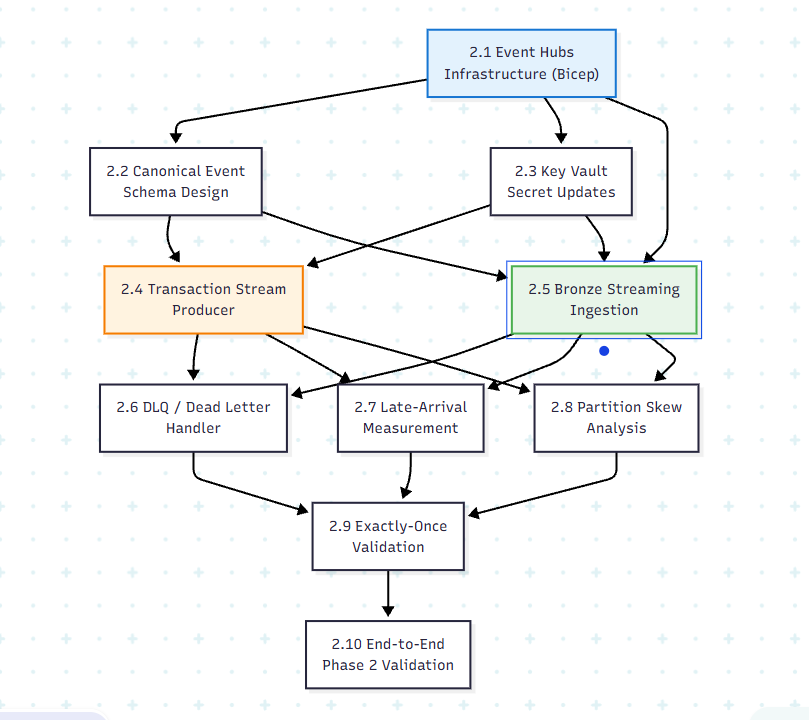

# Phase 2 — Streaming Path (Real-Time Ingestion): Production-Grade Implementation Plan

> [!IMPORTANT]
> This is the **exhaustive, production-grade** plan for Phase 2. Every production decision — Event Hubs tier selection, partition strategy, schema registry design, producer architecture, back-pressure tuning, DLQ handling, late-arrival measurement, and exactly-once validation — is specified here. Phase 2 is where your pipeline stops being a batch toy and becomes a streaming system. Nothing is deferred to "figure out when we get there."

> [!CAUTION]
> ## Azure Free Trial Constraints (Phase 2 Impact)
> Phase 2 adds the most expensive new resource in the project: **Azure Event Hubs**. Budget impact:
> - **Event Hubs Standard tier:** ~$11/month base + $0.028 per million events. Premium/Dedicated ($$$) is deferred.
> - **No Schema Registry** — Standard tier doesn't include built-in Schema Registry. Use application-level schema validation (JSON Schema) instead.
> - **No Capture to ADLS** — Capture requires Standard tier (available) but costs storage writes. Enable with a 15-min / 300MB window to minimize writes.
> - **No private endpoints for Event Hubs** — use SAS token auth with Azure AD fallback.
> - **Producer runs locally** (not containerized) to avoid ACI/AKS costs.
> - **Streaming cluster must auto-terminate** after 20 min idle — this means no 24/7 streaming in Free Trial. Run streaming as "start → produce → consume → stop" sessions.
> - **Total Phase 2 estimated cost:** $15–25/month additional (on top of Phase 0+1 baseline).
>
> **Upgrade path:** Production Decision Registry (§end) documents: upgrade Event Hubs to Premium, enable built-in Schema Registry, add Capture with 5-min window, enable private endpoints, run 24/7 streaming cluster.

**Prerequisite:** Phase 0 (IaC) and Phase 1 (Batch Foundation) are complete. ADLS Gen2, Databricks workspace, Key Vault, Bronze/Silver/Gold medallion pipeline, and baseline XGBoost model are verified.

**Phase 2 Goal:** Stand up Azure Event Hubs, build a transaction stream producer that replays the Kaggle Credit Card dataset into the event stream, get real-time events flowing into Bronze via Databricks Structured Streaming, validate exactly-once semantics and schema evolution, and measure the late-arrival distribution that will calibrate Phase 3's watermark.

**Duration:** 2–3 weeks

---

## Phase 2 Internal Dependency Graph



---

## 2.1 Azure Event Hubs Infrastructure

### 2.1.1 Event Hubs Configuration

> [!NOTE]
> Event Hubs Standard tier is the most cost-effective option for Azure Free Trial. Premium ($$$) adds Kafka protocol support, Schema Registry, larger partition counts, and dedicated capacity — all deferred to production.

| Setting | Free Trial Value | Production Upgrade |
|---|---|---|
| **Namespace name** | `ehns-fraud-dev` | Add `ehns-fraud-staging`, `ehns-fraud-prod` |
| **SKU** | **Standard** ($11.16/month base) | Premium ($690/month) or Dedicated |
| **Throughput Units (TU)** | **1 TU** (1 MB/s ingress, 2 MB/s egress, 1000 events/s) | Auto-inflate to 20 TU |
| **Auto-inflate** | **Disabled** (cost control) | Enabled, max 20 TU |
| **Event Hub name** | `eh-transactions` | Same |
| **Partition count** | **4** (Standard tier max is 32; 4 is sufficient for dev throughput) | 32 (for 50k events/s burst) |
| **Message retention** | **1 day** (Standard tier minimum; free) | 7 days (Premium) |
| **Partition key** | `card_id` | Same |
| **Consumer groups** | `$Default`, `bronze-ingest` | Add `feature-eng`, `monitoring` |
| **Capture** | **Enabled** — 15-min / 300MB window → `eventhubs-capture/` on ADLS | 5-min / 300MB window |
| **Schema Registry** | **❌ Not available** (Standard tier) — use app-level validation | Enable with Premium tier |
| **Network access** | **Public** with SAS auth | Private endpoint |

> [!WARNING]
> **Why 4 partitions, not 32?** Each partition is a unit of parallelism. With a single-node Databricks cluster (Free Trial constraint), you can only process partitions sequentially on one executor. 4 partitions gives enough parallelism for the demo producer's throughput (~100–500 events/s) without wasting resources. Production scales to 32 partitions when you have multi-node clusters.
>
> **Partition key = `card_id`:** This ensures all transactions for the same card land in the same partition, preserving per-card event ordering. This is critical for Phase 3's velocity features (e.g., `time_since_last_txn` requires strict per-card ordering).

### 2.1.2 Consumer Group Design

| Consumer Group | Purpose | Used By |
|---|---|---|
| `$Default` | Azure Portal monitoring / ad-hoc debugging | Azure Portal |
| `bronze-ingest` | Dedicated consumer for Bronze streaming job | `stream_transactions_from_eventhub.py` |

> [!TIP]
> **Free Trial:** Only 2 consumer groups needed. Production adds `feature-eng` (Phase 3 direct feature stream) and `monitoring` (late-arrival metrics). Each consumer group is free — they're just named cursors, not resources.

### 2.1.3 Event Hubs Capture Configuration

| Setting | Free Trial Value | Rationale |
|---|---|---|
| **Enabled** | Yes | Zero-code backup of all events to ADLS as Avro files |
| **Window size** | 15 minutes | Minimizes ADLS write operations (cost) |
| **Window bytes** | 300 MB | Won't hit this at dev throughput |
| **Destination** | ADLS Gen2: `stfraudlakedev/eventhubs-capture/` | Same storage account used by lakehouse |
| **Encoding** | Avro | Only supported format |
| **Skip empty archives** | **Enabled** | Don't write empty Avro files during idle periods |

> [!IMPORTANT]
> **Capture is your disaster recovery path.** If the Databricks streaming job goes down for hours, Capture's Avro files accumulate in ADLS. Recovery is: point Auto Loader at `eventhubs-capture/` and backfill Bronze from Avro instead of the live stream. Document this runbook step in `docs/runbooks/streaming_recovery.md`.

### 2.1.4 Terraform Module: Event Hubs

#### `infrastructure/modules/eventhubs/main.tf`

```hcl
resource "azurerm_eventhub_namespace" "this" {
  name                = "ehns-fraud-${var.environment}"
  resource_group_name = var.resource_group_name
  location            = var.location

  sku      = "Standard" # Free Trial: Standard ($11/month base)
  capacity = 1          # 1 TU -- sufficient for dev throughput

  auto_inflate_enabled           = false # Free Trial: disabled (cost control)
  public_network_access_enabled  = true  # Free Trial: no private endpoints
  local_authentication_enabled   = true  # Allow SAS auth (simpler for Free Trial)

  tags = {
    project      = var.project_name
    environment  = var.environment
    "managed-by" = "terraform"
  }
}

resource "azurerm_eventhub" "transactions" {
  name              = "eh-transactions"
  namespace_id      = azurerm_eventhub_namespace.this.id
  partition_count   = 4 # Free Trial: 4 partitions (Standard tier max: 32)
  message_retention = 1 # Free Trial: minimum retention (free)

  capture_description {
    enabled             = true # Always-on Capture for disaster recovery
    encoding            = "Avro"
    interval_in_seconds = 900       # 15-minute window (minimizes write cost)
    size_limit_in_bytes = 314572800 # 300 MB window
    skip_empty_archives = true      # Don't write empty Avro files

    destination {
      name                = "EventHubArchive.AzureBlockBlob"
      archive_name_format = "{Namespace}/{EventHub}/{PartitionId}/{Year}/{Month}/{Day}/{Hour}/{Minute}/{Second}"
      blob_container_name = "eventhubs-capture"
      storage_account_id  = var.storage_account_id
    }
  }
}

# NOTE: "$Default" is not declared as a resource -- Azure creates it
# automatically with every Event Hub, and azurerm_eventhub_consumer_group's
# name validation rejects the literal string "$Default" anyway.
resource "azurerm_eventhub_consumer_group" "bronze_ingest" {
  name                = "bronze-ingest"
  namespace_name      = azurerm_eventhub_namespace.this.name
  eventhub_name       = azurerm_eventhub.transactions.name
  resource_group_name = var.resource_group_name
}

# --- Authorization Rules (least privilege: separate send-only / listen-only) ---
resource "azurerm_eventhub_authorization_rule" "producer_send" {
  name                = "producer-send-rule"
  namespace_name      = azurerm_eventhub_namespace.this.name
  eventhub_name       = azurerm_eventhub.transactions.name
  resource_group_name = var.resource_group_name
  send   = true
  listen = false
  manage = false
}

resource "azurerm_eventhub_authorization_rule" "consumer_listen" {
  name                = "consumer-listen-rule"
  namespace_name      = azurerm_eventhub_namespace.this.name
  eventhub_name       = azurerm_eventhub.transactions.name
  resource_group_name = var.resource_group_name
  send   = false
  listen = true
  manage = false
}
```

`outputs.tf` exposes `namespace_id`, `namespace_name`, `eventhub_name`, and the two connection strings (both marked `sensitive = true`, unlike the Bicep version's plaintext outputs).

### 2.1.5 Key Vault Secret Updates (Post Event Hubs Deployment)

After deploying Event Hubs, store connection strings in Key Vault:

| Secret Name | Value Source | Used By |
|---|---|---|
| `eventhub-producer-conn-str` | Producer auth rule connection string | Transaction producer |
| `eventhub-consumer-conn-str` | Consumer auth rule connection string | Bronze streaming job |
| `eventhub-namespace` | `ehns-fraud-dev` | Monitoring scripts |
| `eventhub-name` | `eh-transactions` | All consumers |

```bash
# Store Event Hubs secrets in Key Vault (run after `terraform apply`)
PRODUCER_CONN=$(az eventhubs eventhub authorization-rule keys list \
  --resource-group rg-fraud-detection-dev \
  --namespace-name ehns-fraud-dev \
  --eventhub-name eh-transactions \
  --name producer-send-rule \
  --query primaryConnectionString -o tsv)

CONSUMER_CONN=$(az eventhubs eventhub authorization-rule keys list \
  --resource-group rg-fraud-detection-dev \
  --namespace-name ehns-fraud-dev \
  --eventhub-name eh-transactions \
  --name consumer-listen-rule \
  --query primaryConnectionString -o tsv)

az keyvault secret set --vault-name kv-fraud-dev \
  --name eventhub-producer-conn-str --value "$PRODUCER_CONN"

az keyvault secret set --vault-name kv-fraud-dev \
  --name eventhub-consumer-conn-str --value "$CONSUMER_CONN"

az keyvault secret set --vault-name kv-fraud-dev \
  --name eventhub-namespace --value "ehns-fraud-dev"

az keyvault secret set --vault-name kv-fraud-dev \
  --name eventhub-name --value "eh-transactions"
```

---

## 2.2 Canonical Event Schema Design

### 2.2.1 Schema Definition (JSON Schema — Free Trial Alternative to Avro Registry)

> [!NOTE]
> **Free Trial:** Standard tier Event Hubs doesn't include the built-in Schema Registry. We use a **JSON Schema** file checked into the repo for application-level validation. The producer validates every event against this schema before sending. The Bronze consumer validates against the same schema on receive.
>
> **Production upgrade:** Switch to Event Hubs Schema Registry (Avro) with Premium tier — this enforces the schema at the Event Hubs level (rejects invalid events before they even reach consumers).

#### `schemas/transaction_event_v1.json`

```json
{
  "$schema": "http://json-schema.org/draft-07/schema#",
  "$id": "https://fraud-detection.dev/schemas/transaction_event_v1.json",
  "title": "TransactionEvent",
  "description": "Canonical transaction event for the fraud detection pipeline. Schema version 1.0.",
  "type": "object",
  "required": [
    "transaction_id",
    "schema_version",
    "event_time",
    "customer_id",
    "card_id",
    "amount",
    "merchant_id",
    "payment_method",
    "channel",
    "source"
  ],
  "properties": {
    "transaction_id": {
      "type": "string",
      "description": "Globally unique transaction identifier (UUID v4)"
    },
    "schema_version": {
      "type": "string",
      "enum": ["1.0"],
      "description": "Event schema version — enables consumer branching on upgrades"
    },
    "event_time": {
      "type": "string",
      "format": "date-time",
      "description": "Transaction timestamp in ISO 8601 UTC"
    },
    "ingestion_time": {
      "type": "string",
      "format": "date-time",
      "description": "Producer-side ingestion timestamp"
    },
    "customer_id": {
      "type": "string",
      "description": "Anonymized customer identifier"
    },
    "card_id": {
      "type": "string",
      "description": "Anonymized card/instrument identifier — used as partition key"
    },
    "amount": {
      "type": "number",
      "minimum": 0,
      "description": "Transaction amount in the specified currency"
    },
    "currency": {
      "type": "string",
      "default": "USD",
      "description": "ISO 4217 currency code"
    },
    "merchant_id": {
      "type": "string",
      "description": "Anonymized merchant identifier"
    },
    "merchant_category": {
      "type": "string",
      "description": "Merchant category code / name"
    },
    "payment_method": {
      "type": "string",
      "enum": ["credit_card", "debit_card", "prepaid", "wallet", "upi", "bank_transfer"],
      "description": "Payment instrument type"
    },
    "device_id": {
      "type": ["string", "null"],
      "description": "Anonymized device fingerprint"
    },
    "ip_address": {
      "type": ["string", "null"],
      "description": "SHA-256 hashed IP address (salted)"
    },
    "latitude": {
      "type": ["number", "null"],
      "minimum": -90,
      "maximum": 90,
      "description": "Transaction latitude (may be null for non-geo transactions)"
    },
    "longitude": {
      "type": ["number", "null"],
      "minimum": -180,
      "maximum": 180,
      "description": "Transaction longitude"
    },
    "billing_country": {
      "type": "string",
      "description": "ISO 3166-1 alpha-2 billing country"
    },
    "shipping_country": {
      "type": ["string", "null"],
      "description": "ISO 3166-1 alpha-2 shipping country (null for non-physical goods)"
    },
    "channel": {
      "type": "string",
      "enum": ["mobile_app", "web", "pos", "atm", "moto", "recurring"],
      "description": "Transaction channel"
    },
    "is_recurring": {
      "type": "boolean",
      "default": false,
      "description": "Whether this is a recurring/subscription payment"
    },
    "session_id": {
      "type": ["string", "null"],
      "description": "Session identifier linking to browsing/auth context"
    },
    "is_fraud": {
      "type": ["boolean", "null"],
      "default": null,
      "description": "Ground truth label — null for unlabeled/live events, true/false for labeled data"
    },
    "is_synthetic": {
      "type": "boolean",
      "default": false,
      "description": "Whether this event was generated by the synthetic fraud generator"
    },
    "source": {
      "type": "string",
      "description": "Originating source system identifier"
    }
  },
  "additionalProperties": false
}
```

### 2.2.2 Schema Evolution Strategy

| Version | Change Type | Handling |
|---|---|---|
| **1.0** (current) | Initial schema | All fields defined above |
| **1.1** (future) | Add optional field | `additionalProperties: false` → `true`, or add to schema. Bronze handles via `mergeSchema`. Silver maps new field or ignores. |
| **2.0** (future) | Breaking change (rename/remove field) | Deploy new `eh-transactions-v2` Event Hub. Run both in parallel during migration. Never break existing consumers. |

> [!IMPORTANT]
> **Schema evolution rule:** New optional fields are always safe (backward-compatible). Removing or renaming fields requires a new Event Hub (v2) with a migration window. This is why `schema_version` exists — consumers branch on it.

### 2.2.3 Spark Schema (for Bronze Consumer)

#### `databricks/src/schemas/transaction_event_schema.py`

```python
"""
Spark StructType for the canonical TransactionEvent.
Used by the Bronze streaming consumer to parse JSON from Event Hubs.
Must be kept in sync with schemas/transaction_event_v1.json.
"""

from pyspark.sql.types import (
    StructType, StructField, StringType, DoubleType,
    BooleanType, TimestampType
)

TRANSACTION_EVENT_SCHEMA_V1 = StructType([
    StructField("transaction_id", StringType(), nullable=False),
    StructField("schema_version", StringType(), nullable=False),
    StructField("event_time", StringType(), nullable=False),     # ISO 8601 string → parsed later
    StructField("ingestion_time", StringType(), nullable=True),
    StructField("customer_id", StringType(), nullable=False),
    StructField("card_id", StringType(), nullable=False),
    StructField("amount", DoubleType(), nullable=False),
    StructField("currency", StringType(), nullable=True),
    StructField("merchant_id", StringType(), nullable=False),
    StructField("merchant_category", StringType(), nullable=True),
    StructField("payment_method", StringType(), nullable=False),
    StructField("device_id", StringType(), nullable=True),
    StructField("ip_address", StringType(), nullable=True),
    StructField("latitude", DoubleType(), nullable=True),
    StructField("longitude", DoubleType(), nullable=True),
    StructField("billing_country", StringType(), nullable=True),
    StructField("shipping_country", StringType(), nullable=True),
    StructField("channel", StringType(), nullable=False),
    StructField("is_recurring", BooleanType(), nullable=True),
    StructField("session_id", StringType(), nullable=True),
    StructField("is_fraud", BooleanType(), nullable=True),
    StructField("is_synthetic", BooleanType(), nullable=True),
    StructField("source", StringType(), nullable=True),
])
```

---

## 2.3 Transaction Stream Producer

### 2.3.1 Producer Architecture

> [!NOTE]
> The producer replays the **Kaggle Credit Card Fraud Detection** dataset (284,807 rows, 30 features + `Amount` + `Time` + `Class`) into Event Hubs, simulating a live payment gateway. It maps the Kaggle dataset's limited fields to the full canonical schema by synthesizing realistic values for missing fields.

| Component | Detail |
|---|---|
| **Input dataset** | [Kaggle Credit Card Fraud Detection](https://www.kaggle.com/datasets/mlg-ulb/creditcardfraud) — `creditcard.csv` |
| **Replay mode** | Chronological replay respecting relative inter-arrival times, with configurable speed multiplier |
| **Speed multiplier** | `1x` = real-time (48 hours of data), `100x` = 29 minutes, `1000x` = ~3 minutes |
| **Event format** | Maps Kaggle fields → canonical schema; synthesizes `merchant_id`, `device_id`, `session_id`, geo-coordinates from plausible distributions |
| **Partition key** | `card_id` (deterministically derived from Kaggle V-features) |
| **Batch size** | 100 events per `send_batch()` call |
| **Schema validation** | Every event validated against `transaction_event_v1.json` before sending |
| **Fraud injection** | Kaggle `Class=1` rows are sent with `is_fraud=true` (known fraud) |
| **Run location** | **Local Python** (not containerized — saves ACI/AKS costs for Free Trial) |

### 2.3.2 Field Mapping: Kaggle → Canonical Schema

| Canonical Field | Source | Synthesis Method |
|---|---|---|
| `transaction_id` | Generated | `uuid4()` per row |
| `schema_version` | Static | `"1.0"` |
| `event_time` | `Time` column | Anchor `Time=0` to `2025-01-01T00:00:00Z` + `Time` seconds |
| `ingestion_time` | Generated | `datetime.utcnow()` at send time |
| `customer_id` | Derived | Hash of `V1 + V2 + V3` → first 8 chars = deterministic customer |
| `card_id` | Derived | Hash of `V1 + V2 + V4 + V5` → first 10 chars = deterministic card per customer |
| `amount` | `Amount` | Direct mapping |
| `currency` | Static | `"USD"` (Kaggle dataset is Euro-based but anonymized amounts) |
| `merchant_id` | Derived | Hash of `V12 + V13 + V14` → deterministic merchant |
| `merchant_category` | Synthesized | Weighted random from `["retail", "ecommerce", "grocery", "gas", "travel", "dining", "entertainment", "other"]` based on amount range |
| `payment_method` | Synthesized | `"credit_card"` for 85%, `"debit_card"` for 15% (based on V-feature distributions) |
| `device_id` | Synthesized | Hash of `customer_id + day_of_month` → simulates ~2–3 devices per customer |
| `ip_address` | Synthesized | SHA-256 of `device_id + hour` → simulates rotating IPs |
| `latitude` / `longitude` | Synthesized | Base location per customer (from a pool of 50 cities) + Gaussian noise (σ=0.05°) |
| `billing_country` | Synthesized | Derived from base city → country code |
| `shipping_country` | Synthesized | Same as billing_country 95% of time; random other 5% (simulates cross-border) |
| `channel` | Synthesized | Weighted random: `mobile_app` 40%, `web` 35%, `pos` 20%, `atm` 5% |
| `is_recurring` | Synthesized | 8% of transactions flagged as recurring |
| `session_id` | Synthesized | Hash of `customer_id + hour` → groups txns into sessions |
| `is_fraud` | `Class` | Direct mapping (`1` = True) |
| `is_synthetic` | Static | `false` (real Kaggle data) |
| `source` | Static | `"kaggle_credit_card_replay"` |

> [!TIP]
> **Why synthesize all these fields?** The Kaggle dataset only has PCA-transformed V-features and Amount/Time. The canonical schema needs merchant, device, geo, and channel data for Phase 3 feature engineering. Synthesizing these deterministically (via hashes of existing features) ensures:
> - Same input row → same output event (reproducible)
> - Realistic cardinality (50 cities, ~1000 merchants, ~5000 cards)
> - Correlated patterns (same customer → same base location → similar devices)

### 2.3.3 Producer Code

#### `producers/transaction_producer/config.py`

```python
"""
Producer configuration. All sensitive values from environment variables / Key Vault.
"""
import os
from dataclasses import dataclass, field

@dataclass
class ProducerConfig:
    # Event Hubs connection
    eventhub_conn_str: str = field(
        default_factory=lambda: os.environ["EVENTHUB_PRODUCER_CONN_STR"]
    )
    eventhub_name: str = field(
        default_factory=lambda: os.environ.get("EVENTHUB_NAME", "eh-transactions")
    )
    
    # Replay settings
    speed_multiplier: float = float(os.environ.get("SPEED_MULTIPLIER", "100"))
    batch_size: int = int(os.environ.get("BATCH_SIZE", "100"))
    max_events: int = int(os.environ.get("MAX_EVENTS", "0"))  # 0 = all rows
    
    # Dataset path
    dataset_path: str = os.environ.get(
        "DATASET_PATH", "data/creditcard.csv"
    )
    
    # Schema validation
    schema_path: str = os.environ.get(
        "SCHEMA_PATH", "schemas/transaction_event_v1.json"
    )
    validate_schema: bool = bool(os.environ.get("VALIDATE_SCHEMA", "true"))
    
    # Metrics
    log_interval: int = int(os.environ.get("LOG_INTERVAL", "1000"))  # Log every N events
    
    # Timestamp anchor
    time_anchor: str = "2025-01-01T00:00:00Z"
```

#### `producers/transaction_producer/event_mapper.py`

```python
"""
Maps Kaggle Credit Card dataset rows to the canonical TransactionEvent schema.
All synthesis is deterministic (hash-based) for reproducibility.
"""
import hashlib
import uuid
import random
from datetime import datetime, timedelta, timezone
from typing import Dict, Any

# City pool for geo-synthesis (50 cities with realistic lat/long)
CITY_POOL = [
    {"city": "Mumbai", "lat": 19.076, "lon": 72.877, "country": "IN"},
    {"city": "Delhi", "lat": 28.613, "lon": 77.209, "country": "IN"},
    {"city": "Bangalore", "lat": 12.971, "lon": 77.594, "country": "IN"},
    {"city": "New York", "lat": 40.712, "lon": -74.006, "country": "US"},
    {"city": "London", "lat": 51.507, "lon": -0.127, "country": "GB"},
    {"city": "Singapore", "lat": 1.352, "lon": 103.819, "country": "SG"},
    {"city": "Dubai", "lat": 25.204, "lon": 55.270, "country": "AE"},
    {"city": "Tokyo", "lat": 35.676, "lon": 139.650, "country": "JP"},
    {"city": "Sydney", "lat": -33.868, "lon": 151.209, "country": "AU"},
    {"city": "São Paulo", "lat": -23.550, "lon": -46.633, "country": "BR"},
    # ... extend to 50 cities in production
]

MERCHANT_CATEGORIES = [
    ("retail", 0.25), ("ecommerce", 0.30), ("grocery", 0.15),
    ("gas", 0.08), ("travel", 0.05), ("dining", 0.10),
    ("entertainment", 0.04), ("other", 0.03)
]

CHANNELS = [
    ("mobile_app", 0.40), ("web", 0.35), ("pos", 0.20), ("atm", 0.05)
]


def _deterministic_hash(seed: str, length: int = 10) -> str:
    """Generate a deterministic hash string from a seed."""
    return hashlib.sha256(seed.encode()).hexdigest()[:length]


def _weighted_choice(options: list, seed: int) -> str:
    """Deterministic weighted random selection."""
    rng = random.Random(seed)
    items, weights = zip(*options)
    return rng.choices(items, weights=weights, k=1)[0]


def map_kaggle_row_to_event(
    row: Dict[str, Any],
    row_index: int,
    time_anchor: datetime
) -> Dict[str, Any]:
    """
    Map a single Kaggle Credit Card dataset row to a canonical TransactionEvent.
    
    Args:
        row: Dict with keys Time, Amount, Class, V1..V28
        row_index: Row position in dataset (for deterministic synthesis)
        time_anchor: Base timestamp for Time=0
    
    Returns:
        Dict matching the canonical TransactionEvent schema
    """
    # --- Deterministic IDs ---
    v1 = str(row.get("V1", 0))
    v2 = str(row.get("V2", 0))
    v3 = str(row.get("V3", 0))
    v4 = str(row.get("V4", 0))
    v5 = str(row.get("V5", 0))
    v12 = str(row.get("V12", 0))
    v13 = str(row.get("V13", 0))
    v14 = str(row.get("V14", 0))
    
    customer_id = f"cust_{_deterministic_hash(f'{v1}_{v2}_{v3}', 8)}"
    card_id = f"card_{_deterministic_hash(f'{v1}_{v2}_{v4}_{v5}', 10)}"
    merchant_id = f"merch_{_deterministic_hash(f'{v12}_{v13}_{v14}', 8)}"
    
    # --- Timestamps ---
    time_offset = float(row.get("Time", 0))
    event_time = time_anchor + timedelta(seconds=time_offset)
    
    # --- Geo synthesis (deterministic per customer) ---
    city_index = int(_deterministic_hash(customer_id, 4), 16) % len(CITY_POOL)
    base_city = CITY_POOL[city_index]
    geo_rng = random.Random(row_index)
    lat = base_city["lat"] + geo_rng.gauss(0, 0.05)
    lon = base_city["lon"] + geo_rng.gauss(0, 0.05)
    
    # --- Channel / payment method synthesis ---
    amount = float(row.get("Amount", 0))
    channel = _weighted_choice(CHANNELS, row_index)
    payment_method = "credit_card" if (row_index % 100) < 85 else "debit_card"
    merchant_category = _weighted_choice(MERCHANT_CATEGORIES, row_index + 7)
    
    # --- Device / session synthesis ---
    day_of_event = event_time.day
    hour_of_event = event_time.hour
    device_id = f"dev_{_deterministic_hash(f'{customer_id}_{day_of_event % 3}', 8)}"
    session_id = f"sess_{_deterministic_hash(f'{customer_id}_{hour_of_event}', 8)}"
    ip_hash = _deterministic_hash(f"{device_id}_{hour_of_event}", 16)
    
    # --- Cross-border simulation ---
    billing_country = base_city["country"]
    is_cross_border = (row_index % 20) == 0  # 5% cross-border
    shipping_country = (
        CITY_POOL[(city_index + 1) % len(CITY_POOL)]["country"]
        if is_cross_border else billing_country
    )
    
    return {
        "transaction_id": str(uuid.uuid4()),
        "schema_version": "1.0",
        "event_time": event_time.strftime("%Y-%m-%dT%H:%M:%S.%f")[:-3] + "Z",
        "ingestion_time": datetime.now(timezone.utc).strftime(
            "%Y-%m-%dT%H:%M:%S.%f"
        )[:-3] + "Z",
        "customer_id": customer_id,
        "card_id": card_id,
        "amount": round(amount, 2),
        "currency": "USD",
        "merchant_id": merchant_id,
        "merchant_category": merchant_category,
        "payment_method": payment_method,
        "device_id": device_id,
        "ip_address": ip_hash,
        "latitude": round(lat, 6),
        "longitude": round(lon, 6),
        "billing_country": billing_country,
        "shipping_country": shipping_country,
        "channel": channel,
        "is_recurring": (row_index % 12) == 0,  # ~8% recurring
        "session_id": session_id,
        "is_fraud": bool(row.get("Class", 0) == 1),
        "is_synthetic": False,
        "source": "kaggle_credit_card_replay",
    }
```

#### `producers/transaction_producer/producer.py`

```python
"""
Main producer: replays Kaggle Credit Card dataset into Azure Event Hubs.

Usage:
    export EVENTHUB_PRODUCER_CONN_STR="Endpoint=sb://ehns-fraud-dev..."
    python producer.py

    # Accelerated replay (100x speed, first 10k events)
    SPEED_MULTIPLIER=100 MAX_EVENTS=10000 python producer.py
"""
import asyncio
import csv
import json
import time
import logging
from datetime import datetime, timezone

from azure.eventhub.aio import EventHubProducerClient
from azure.eventhub import EventData

from config import ProducerConfig
from event_mapper import map_kaggle_row_to_event

logging.basicConfig(
    level=logging.INFO,
    format="%(asctime)s [%(levelname)s] %(message)s"
)
logger = logging.getLogger(__name__)


class TransactionProducer:
    """Replays Kaggle Credit Card dataset as streaming events into Event Hubs."""
    
    def __init__(self, config: ProducerConfig):
        self.config = config
        self.client = EventHubProducerClient.from_connection_string(
            config.eventhub_conn_str,
            eventhub_name=config.eventhub_name,
        )
        self.time_anchor = datetime.fromisoformat(
            config.time_anchor.replace("Z", "+00:00")
        )
        self.events_sent = 0
        self.fraud_sent = 0
        self.errors = 0
        self.start_time = None
    
    async def replay_dataset(self):
        """Replay the entire dataset chronologically into Event Hubs."""
        logger.info(
            f"Starting replay: speed={self.config.speed_multiplier}x, "
            f"batch_size={self.config.batch_size}, "
            f"max_events={self.config.max_events or 'all'}"
        )
        
        self.start_time = time.time()
        
        # Read dataset
        rows = []
        with open(self.config.dataset_path, 'r') as f:
            reader = csv.DictReader(f)
            for i, row in enumerate(reader):
                if self.config.max_events and i >= self.config.max_events:
                    break
                rows.append(row)
        
        # Sort by Time (chronological replay)
        rows.sort(key=lambda r: float(r.get("Time", 0)))
        logger.info(f"Loaded {len(rows)} rows, sorted chronologically")
        
        # Replay with batching
        batch = []
        prev_time = 0.0
        
        async with self.client:
            for idx, row in enumerate(rows):
                # Map to canonical event
                event = map_kaggle_row_to_event(row, idx, self.time_anchor)
                event_data = EventData(json.dumps(event))
                # Partition key ensures per-card ordering
                event_data.properties = {"partition_key": event["card_id"]}
                batch.append(event_data)
                
                if event.get("is_fraud"):
                    self.fraud_sent += 1
                
                # Send batch when full
                if len(batch) >= self.config.batch_size:
                    await self._send_batch(batch)
                    batch = []
                    
                    # Respect inter-arrival timing
                    current_time = float(row.get("Time", 0))
                    delay = (current_time - prev_time) / self.config.speed_multiplier
                    prev_time = current_time
                    
                    if delay > 0 and delay < 10:  # Cap delay at 10 seconds
                        await asyncio.sleep(delay)
                
                # Progress logging
                if (idx + 1) % self.config.log_interval == 0:
                    elapsed = time.time() - self.start_time
                    rate = self.events_sent / elapsed if elapsed > 0 else 0
                    logger.info(
                        f"Progress: {self.events_sent}/{len(rows)} events sent "
                        f"({rate:.1f} events/s), "
                        f"fraud={self.fraud_sent}, errors={self.errors}"
                    )
            
            # Send remaining events
            if batch:
                await self._send_batch(batch)
        
        # Final summary
        elapsed = time.time() - self.start_time
        logger.info(
            f"Replay complete: {self.events_sent} events sent in {elapsed:.1f}s "
            f"({self.events_sent/elapsed:.1f} events/s), "
            f"fraud={self.fraud_sent} ({100*self.fraud_sent/max(1,self.events_sent):.2f}%), "
            f"errors={self.errors}"
        )
    
    async def _send_batch(self, events: list):
        """Send a batch of EventData objects to Event Hubs."""
        try:
            event_batch = await self.client.create_batch()
            for event in events:
                try:
                    event_batch.add(event)
                except ValueError:
                    # Event too large for current batch — send what we have, start new
                    await self.client.send_batch(event_batch)
                    event_batch = await self.client.create_batch()
                    event_batch.add(event)
            
            await self.client.send_batch(event_batch)
            self.events_sent += len(events)
        except Exception as e:
            self.errors += len(events)
            logger.error(f"Failed to send batch of {len(events)} events: {e}")


async def main():
    config = ProducerConfig()
    producer = TransactionProducer(config)
    await producer.replay_dataset()


if __name__ == "__main__":
    asyncio.run(main())
```

#### `producers/transaction_producer/requirements.txt`

```
azure-eventhub>=5.11.0
jsonschema>=4.20.0
```

### 2.3.4 Producer Testing

Before connecting to Event Hubs, test the mapper locally:

#### `producers/transaction_producer/test_event_mapper.py`

```python
"""
Unit tests for the event mapper — validates deterministic synthesis,
schema compliance, and edge cases.
"""
import pytest
import json
from datetime import datetime, timezone
from jsonschema import validate, ValidationError
from event_mapper import map_kaggle_row_to_event

# Load JSON Schema
with open("schemas/transaction_event_v1.json") as f:
    EVENT_SCHEMA = json.load(f)

TIME_ANCHOR = datetime(2025, 1, 1, tzinfo=timezone.utc)


def _make_kaggle_row(time=0, amount=100.0, fraud=0, **kwargs):
    row = {"Time": time, "Amount": amount, "Class": fraud}
    for i in range(1, 29):
        row[f"V{i}"] = kwargs.get(f"V{i}", float(i) * 0.1)
    return row


class TestEventMapper:
    def test_schema_compliance(self):
        """Every mapped event must pass JSON Schema validation."""
        row = _make_kaggle_row()
        event = map_kaggle_row_to_event(row, 0, TIME_ANCHOR)
        validate(instance=event, schema=EVENT_SCHEMA)  # Raises on failure
    
    def test_deterministic_ids(self):
        """Same input row → same customer_id, card_id, merchant_id."""
        row = _make_kaggle_row()
        event1 = map_kaggle_row_to_event(row, 0, TIME_ANCHOR)
        event2 = map_kaggle_row_to_event(row, 0, TIME_ANCHOR)
        assert event1["customer_id"] == event2["customer_id"]
        assert event1["card_id"] == event2["card_id"]
        assert event1["merchant_id"] == event2["merchant_id"]
    
    def test_unique_transaction_ids(self):
        """Every event gets a unique transaction_id (UUID)."""
        row = _make_kaggle_row()
        event1 = map_kaggle_row_to_event(row, 0, TIME_ANCHOR)
        event2 = map_kaggle_row_to_event(row, 0, TIME_ANCHOR)
        assert event1["transaction_id"] != event2["transaction_id"]
    
    def test_fraud_label_mapping(self):
        """Class=1 → is_fraud=True, Class=0 → is_fraud=False."""
        fraud_row = _make_kaggle_row(fraud=1)
        legit_row = _make_kaggle_row(fraud=0)
        assert map_kaggle_row_to_event(fraud_row, 0, TIME_ANCHOR)["is_fraud"] is True
        assert map_kaggle_row_to_event(legit_row, 1, TIME_ANCHOR)["is_fraud"] is False
    
    def test_timestamp_synthesis(self):
        """Time=3600 → event_time = anchor + 1 hour."""
        row = _make_kaggle_row(time=3600)
        event = map_kaggle_row_to_event(row, 0, TIME_ANCHOR)
        assert "2025-01-01T01:00:00" in event["event_time"]
    
    def test_amount_preserved(self):
        """Amount is preserved exactly."""
        row = _make_kaggle_row(amount=42.50)
        event = map_kaggle_row_to_event(row, 0, TIME_ANCHOR)
        assert event["amount"] == 42.50
    
    def test_geo_within_bounds(self):
        """Synthesized lat/lon must be valid coordinates."""
        row = _make_kaggle_row()
        event = map_kaggle_row_to_event(row, 0, TIME_ANCHOR)
        assert -90 <= event["latitude"] <= 90
        assert -180 <= event["longitude"] <= 180
```

---

## 2.4 Bronze Streaming Ingestion (Event Hubs → Delta)

### 2.4.1 Streaming Job Configuration

| Setting | Free Trial Value | Production Upgrade |
|---|---|---|
| **Source** | Azure Event Hubs via `spark.readStream.format("eventhubs")` | Same |
| **Consumer group** | `bronze-ingest` | Same |
| **Starting position** | `fromStartOfStream` (on first run) / `fromEnqueuedTime` (on restart) | Same |
| **Schema handling** | `from_json()` with explicit `TRANSACTION_EVENT_SCHEMA_V1` | Same + Schema Registry validation |
| **Metadata columns** | `_ingested_at`, `_source_partition`, `_enqueued_time` | Same |
| **Output table** | `bronze.transactions` (Delta, partitioned by `event_date`) | Same |
| **Trigger** | `processingTime = "10 seconds"` (Free Trial: less frequent = lower cost) | `processingTime = "5 seconds"` |
| **Back-pressure** | `maxEventsPerTrigger = 10000` (Free Trial: single-node, limit batch size) | `100000` |
| **Checkpoint** | `abfss://checkpoints@stfraudlakedev.../bronze_streaming_txn/` | Same |
| **DLQ** | Parse failures → `quarantine.bronze_stream_parse_failures` table | Same + DLQ Event Hub |
| **Cluster** | **Single-node** `Standard_DS3_v2`, 20-min auto-terminate | Multi-node dedicated, no auto-terminate |

> [!CAUTION]
> **Free Trial streaming reality:** You cannot run a 24/7 streaming job on Free Trial. A single-node `Standard_DS3_v2` costs ~$0.30/hour in DBUs + VM. Running 24/7 = ~$216/month = exceeds the $200 budget alone. Instead, run streaming **on-demand**: start the producer, start the streaming job, let it consume, then stop both. The 20-min auto-terminate protects you from accidental cost.
>
> **Workflow for Free Trial:** `Start producer (100x speed) → events flow → streaming job consumes → auto-terminates after 20 min idle → validate Bronze`

### 2.4.2 Bronze Streaming Code

#### `databricks/notebooks/bronze/stream_transactions_from_eventhub.py`

```python
# Databricks notebook source
# MAGIC %md
# MAGIC # Bronze Streaming Ingestion: Event Hubs → Delta
# MAGIC
# MAGIC Reads transaction events from Azure Event Hubs, parses JSON,
# MAGIC attaches metadata, and writes to `bronze.transactions` as Delta.
# MAGIC
# MAGIC **Exactly-once semantics:** Event Hubs offset tracking +
# MAGIC Delta transaction log + Structured Streaming checkpoints.

# COMMAND ----------

# --- Configuration ---
import json
from pyspark.sql.functions import (
    col, from_json, current_timestamp, to_date, lit
)

# Import schema
# %run ../src/schemas/transaction_event_schema  
# OR use the schema directly:
from pyspark.sql.types import (
    StructType, StructField, StringType, DoubleType, BooleanType
)

TRANSACTION_EVENT_SCHEMA_V1 = StructType([
    StructField("transaction_id", StringType(), False),
    StructField("schema_version", StringType(), False),
    StructField("event_time", StringType(), False),
    StructField("ingestion_time", StringType(), True),
    StructField("customer_id", StringType(), False),
    StructField("card_id", StringType(), False),
    StructField("amount", DoubleType(), False),
    StructField("currency", StringType(), True),
    StructField("merchant_id", StringType(), False),
    StructField("merchant_category", StringType(), True),
    StructField("payment_method", StringType(), False),
    StructField("device_id", StringType(), True),
    StructField("ip_address", StringType(), True),
    StructField("latitude", DoubleType(), True),
    StructField("longitude", DoubleType(), True),
    StructField("billing_country", StringType(), True),
    StructField("shipping_country", StringType(), True),
    StructField("channel", StringType(), False),
    StructField("is_recurring", BooleanType(), True),
    StructField("session_id", StringType(), True),
    StructField("is_fraud", BooleanType(), True),
    StructField("is_synthetic", BooleanType(), True),
    StructField("source", StringType(), True),
])

# COMMAND ----------

# --- Event Hubs connection config ---
consumer_conn_str = dbutils.secrets.get("kv-fraud", "eventhub-consumer-conn-str")

# Event Hubs Spark connector config
eh_conf = {
    "eventhubs.connectionString": sc._jvm.org.apache.spark.eventhubs
        .EventHubsUtils.encrypt(consumer_conn_str),
    "eventhubs.consumerGroup": "bronze-ingest",
    "eventhubs.startingPosition": json.dumps({
        "offset": "-1",           # From start of stream (first run)
        "seqNo": -1,
        "enqueuedTime": None,
        "isInclusive": True
    }),
    "maxEventsPerTrigger": "10000",  # FREE TRIAL: cap per-batch volume
}

# COMMAND ----------

# --- Read from Event Hubs ---
raw_stream = (
    spark.readStream
        .format("eventhubs")
        .options(**eh_conf)
        .load()
)

# COMMAND ----------

# --- Parse JSON body + attach metadata ---
parsed_stream = (
    raw_stream
    .withColumn("body_str", col("body").cast("string"))
    .withColumn("parsed", from_json(col("body_str"), TRANSACTION_EVENT_SCHEMA_V1))
    .select(
        # Parsed event fields
        col("parsed.*"),
        # Event Hubs metadata
        col("enqueuedTime").alias("_enqueued_time"),
        col("offset").alias("_eh_offset"),
        col("partition").cast("string").alias("_source_partition"),
        # Processing metadata
        current_timestamp().alias("_ingested_at"),
        # Parse success flag
        col("parsed").isNotNull().alias("_parse_success"),
        # Original body for DLQ (only if parse failed)
        col("body_str").alias("_raw_body"),
    )
)

# COMMAND ----------

# --- Split: successfully parsed vs. parse failures ---
# Successfully parsed events → Bronze
success_stream = (
    parsed_stream
    .filter(col("_parse_success") == True)
    .drop("_parse_success", "_raw_body")
    .withColumn("event_date", to_date(col("event_time")))
)

# Parse failures → DLQ / Quarantine
failure_stream = (
    parsed_stream
    .filter(col("_parse_success") == False)
    .select(
        col("_raw_body"),
        col("_enqueued_time"),
        col("_source_partition"),
        col("_ingested_at"),
        lit("JSON_PARSE_FAILURE").alias("failure_reason"),
    )
)

# COMMAND ----------

# --- Write successfully parsed events to Bronze ---
checkpoint_path = "abfss://checkpoints@stfraudlakedev.dfs.core.windows.net/bronze_streaming_txn/"

bronze_query = (
    success_stream.writeStream
    .format("delta")
    .outputMode("append")
    .option("checkpointLocation", checkpoint_path)
    .option("mergeSchema", "true")          # Handle schema evolution
    .partitionBy("event_date")
    .trigger(processingTime="10 seconds")   # FREE TRIAL: 10s trigger
    .toTable("bronze.transactions")
)

# COMMAND ----------

# --- Write parse failures to DLQ table ---
dlq_checkpoint = "abfss://checkpoints@stfraudlakedev.dfs.core.windows.net/bronze_dlq/"

dlq_query = (
    failure_stream.writeStream
    .format("delta")
    .outputMode("append")
    .option("checkpointLocation", dlq_checkpoint)
    .trigger(processingTime="30 seconds")   # DLQ doesn't need fast writes
    .toTable("quarantine.bronze_stream_parse_failures")
)

# COMMAND ----------

# --- Monitor streaming queries ---
# Check status in notebook
print(f"Bronze query: {bronze_query.status}")
print(f"DLQ query: {dlq_query.status}")

# Wait for termination (streaming job runs until manually stopped or auto-terminated)
# bronze_query.awaitTermination()
```

### 2.4.3 DLQ and Error Handling Strategy

| Error Type | Detection | Handling | Alert |
|---|---|---|---|
| **JSON parse failure** | `from_json()` returns null | Route to `quarantine.bronze_stream_parse_failures` with raw body + failure reason | Warning if rate > 0.1% |
| **Schema mismatch** | Missing required fields after parse | Same DLQ table, `failure_reason = "SCHEMA_MISMATCH"` | Warning |
| **Oversized event** | Event > 1 MB (Event Hubs limit) | Rejected at producer level (pre-send validation) | Error at producer |
| **Duplicate transaction_id** | Detected at Silver layer (MERGE) | Handled by Silver dedup — Bronze is append-only | Metric only |
| **Event Hubs throttling** | Producer gets `429 Busy` | Exponential backoff retry (built into SDK) | Warning |
| **Checkpoint corruption** | Streaming query fails on restart | Delete checkpoint, restart from Event Hubs beginning or specific `enqueuedTime` | P1 alert |

> [!TIP]
> **Checkpoint recovery runbook:** If checkpoint is corrupted:
> 1. Stop the streaming job
> 2. Record the last known `_enqueued_time` from `bronze.transactions`: `SELECT MAX(_enqueued_time) FROM bronze.transactions`
> 3. Delete the checkpoint directory: `dbutils.fs.rm("abfss://checkpoints@.../bronze_streaming_txn/", recurse=True)`
> 4. Update `eh_conf` with `startingPosition` = `{"enqueuedTime": "<last_known_time>", "isInclusive": false}`
> 5. Restart the streaming job — it will resume from that timestamp
> 6. Silver's MERGE handles any duplicates from overlap

---

## 2.5 Late-Arrival Measurement

> [!IMPORTANT]
> **This is the most important validation in Phase 2.** The late-arrival distribution you measure here directly determines Phase 3's watermark setting. Too tight = dropped events = missing velocity features = degraded model. Too loose = excessive state = OOM risk = high latency.

### 2.5.1 Late-Arrival Analysis Notebook

#### `databricks/notebooks/validation/late_arrival_analysis.py`

```python
# Databricks notebook source
# MAGIC %md
# MAGIC # Late-Arrival Distribution Analysis
# MAGIC
# MAGIC Measures the distribution of `_enqueued_time - event_time` across all partitions.
# MAGIC This calibrates Phase 3's watermark setting.
# MAGIC
# MAGIC **Run this:** After at least 30 minutes of sustained producer replay at 1x speed.

# COMMAND ----------

from pyspark.sql.functions import (
    col, unix_timestamp, to_timestamp, percentile_approx,
    avg, stddev, max as smax, min as smin, count, hour
)

# Read Bronze transactions (batch mode)
bronze_df = spark.table("bronze.transactions")

# COMMAND ----------

# --- Calculate late-arrival delay ---
late_arrival_df = (
    bronze_df
    .withColumn("event_ts", to_timestamp(col("event_time")))
    .withColumn("enqueue_ts", col("_enqueued_time"))
    .withColumn(
        "arrival_delay_seconds",
        unix_timestamp("enqueue_ts") - unix_timestamp("event_ts")
    )
    .filter(col("arrival_delay_seconds").isNotNull())
)

# COMMAND ----------

# --- Overall distribution ---
delay_stats = late_arrival_df.select(
    count("*").alias("total_events"),
    avg("arrival_delay_seconds").alias("mean_delay_s"),
    stddev("arrival_delay_seconds").alias("stddev_delay_s"),
    smin("arrival_delay_seconds").alias("min_delay_s"),
    smax("arrival_delay_seconds").alias("max_delay_s"),
    percentile_approx("arrival_delay_seconds", 0.50).alias("p50_delay_s"),
    percentile_approx("arrival_delay_seconds", 0.90).alias("p90_delay_s"),
    percentile_approx("arrival_delay_seconds", 0.95).alias("p95_delay_s"),
    percentile_approx("arrival_delay_seconds", 0.99).alias("p99_delay_s"),
    percentile_approx("arrival_delay_seconds", 0.999).alias("p999_delay_s"),
).collect()[0]

print("=" * 60)
print("LATE-ARRIVAL DISTRIBUTION")
print("=" * 60)
print(f"Total events:    {delay_stats.total_events:,}")
print(f"Mean delay:      {delay_stats.mean_delay_s:.2f}s")
print(f"Stddev:          {delay_stats.stddev_delay_s:.2f}s")
print(f"Min delay:       {delay_stats.min_delay_s:.2f}s")
print(f"Max delay:       {delay_stats.max_delay_s:.2f}s")
print(f"P50 (median):    {delay_stats.p50_delay_s:.2f}s")
print(f"P90:             {delay_stats.p90_delay_s:.2f}s")
print(f"P95:             {delay_stats.p95_delay_s:.2f}s")
print(f"P99:             {delay_stats.p99_delay_s:.2f}s")
print(f"P99.9:           {delay_stats.p999_delay_s:.2f}s")
print("=" * 60)
print(f"\nRECOMMENDED WATERMARK: {max(delay_stats.p99_delay_s * 2, 600)}s")
print(f"  (2x P99, minimum 10 minutes)")

# COMMAND ----------

# --- Per-partition distribution ---
per_partition = (
    late_arrival_df
    .groupBy("_source_partition")
    .agg(
        count("*").alias("event_count"),
        avg("arrival_delay_seconds").alias("mean_delay_s"),
        percentile_approx("arrival_delay_seconds", 0.99).alias("p99_delay_s"),
        smax("arrival_delay_seconds").alias("max_delay_s"),
    )
    .orderBy("_source_partition")
)

display(per_partition)

# COMMAND ----------

# --- Delay histogram (for visualization) ---
histogram_df = (
    late_arrival_df
    .withColumn("delay_bucket", 
        (col("arrival_delay_seconds") / 10).cast("int") * 10  # 10-second buckets
    )
    .groupBy("delay_bucket")
    .agg(count("*").alias("event_count"))
    .orderBy("delay_bucket")
)

display(histogram_df)
```

### 2.5.2 Watermark Recommendation Logic

| Measured P99 Delay | Recommended Watermark | Rationale |
|---|---|---|
| < 30 seconds | **10 minutes** (minimum) | Even if measured delay is low, keep 10 min as buffer for production network jitter |
| 30–120 seconds | **P99 × 3** (e.g., 60s → 3 min) | 3x provides safety margin without excessive state |
| 120–300 seconds | **P99 × 2** (e.g., 180s → 6 min) | At higher delays, 2x is sufficient |
| > 300 seconds | **Investigate producer** | Something is fundamentally wrong — don't just increase watermark |

---

## 2.6 Partition Skew Analysis

#### `databricks/notebooks/validation/partition_skew_analysis.py`

```python
# Databricks notebook source
# MAGIC %md
# MAGIC # Partition Skew Analysis
# MAGIC
# MAGIC Validates that `card_id` as partition key distributes events evenly.
# MAGIC Skewed partitions cause streaming lag on specific partitions.

# COMMAND ----------

from pyspark.sql.functions import col, count, stddev, avg, max as smax, min as smin

bronze_df = spark.table("bronze.transactions")

# --- Events per partition ---
partition_counts = (
    bronze_df
    .groupBy("_source_partition")
    .agg(count("*").alias("event_count"))
    .orderBy("_source_partition")
)

display(partition_counts)

# --- Skew metrics ---
skew_stats = partition_counts.select(
    avg("event_count").alias("avg_per_partition"),
    stddev("event_count").alias("stddev_per_partition"),
    smax("event_count").alias("max_partition"),
    smin("event_count").alias("min_partition"),
).collect()[0]

skew_ratio = skew_stats.max_partition / max(skew_stats.min_partition, 1)

print(f"Partition skew ratio (max/min): {skew_ratio:.2f}")
print(f"  Avg per partition: {skew_stats.avg_per_partition:.0f}")
print(f"  Stddev: {skew_stats.stddev_per_partition:.0f}")

if skew_ratio > 3.0:
    print("⚠️ WARNING: Partition skew > 3x. Consider a composite partition key.")
elif skew_ratio > 2.0:
    print("⚡ NOTICE: Mild partition skew. Monitor but acceptable.")
else:
    print("✅ Partitions are well-balanced.")
```

---

## 2.7 Exactly-Once Validation

#### `databricks/notebooks/validation/exactly_once_validation.py`

```python
# Databricks notebook source
# MAGIC %md
# MAGIC # Exactly-Once Semantics Validation
# MAGIC
# MAGIC Compares distinct `transaction_id` count in Bronze vs. events sent by producer.
# MAGIC Must match exactly for the exactly-once guarantee to hold.

# COMMAND ----------

from pyspark.sql.functions import countDistinct, count, col

bronze_df = spark.table("bronze.transactions")

# --- Counts ---
total_rows = bronze_df.count()
distinct_txn_ids = bronze_df.select(countDistinct("transaction_id")).collect()[0][0]
duplicate_count = total_rows - distinct_txn_ids

print(f"Total rows in bronze.transactions: {total_rows:,}")
print(f"Distinct transaction_ids:           {distinct_txn_ids:,}")
print(f"Duplicate rows:                     {duplicate_count:,}")

if duplicate_count == 0:
    print("✅ EXACTLY-ONCE VALIDATED: No duplicates in Bronze.")
else:
    print(f"⚠️ WARNING: {duplicate_count} duplicate rows detected.")
    print("   Duplicates will be handled by Silver MERGE, but investigate root cause.")
    
    # Show duplicate transaction_ids
    duplicates = (
        bronze_df
        .groupBy("transaction_id")
        .agg(count("*").alias("occurrences"))
        .filter(col("occurrences") > 1)
        .orderBy(col("occurrences").desc())
        .limit(10)
    )
    display(duplicates)

# COMMAND ----------

# --- Compare with producer-reported count ---
# The producer logs total events sent. Enter that number here:
PRODUCER_REPORTED_COUNT = dbutils.widgets.get("producer_event_count")  # e.g., "284807"

if PRODUCER_REPORTED_COUNT:
    producer_count = int(PRODUCER_REPORTED_COUNT)
    diff = distinct_txn_ids - producer_count
    
    print(f"\nProducer reported: {producer_count:,}")
    print(f"Bronze distinct:   {distinct_txn_ids:,}")
    print(f"Difference:        {diff:,}")
    
    if diff == 0:
        print("✅ PERFECT MATCH: Every event sent was received exactly once.")
    elif diff > 0:
        print("⚠️ Bronze has MORE events than producer sent — possible duplicate delivery.")
    else:
        print("❌ Bronze has FEWER events than producer sent — events were lost!")
```

---

## 2.8 Streaming Silver Integration

> [!NOTE]
> Phase 2 extends the existing Phase 1 Silver pipeline to handle streaming events alongside the batch IEEE-CIS data. Both paths write to the same `silver.transactions` table via MERGE on `transaction_id`.

### 2.8.1 Silver Streaming Notebook

#### `databricks/notebooks/silver/stream_silver_from_bronze.py`

```python
# Databricks notebook source
# MAGIC %md
# MAGIC # Silver Streaming: Bronze (streaming) → Silver
# MAGIC
# MAGIC Reads new events from `bronze.transactions` as a stream,
# MAGIC applies the same cleaning/conforming logic as the batch Silver pipeline,
# MAGIC and merges into `silver.transactions`.

# COMMAND ----------

from pyspark.sql.functions import (
    col, lower, trim, when, to_timestamp, hour,
    dayofweek, current_timestamp, lit
)
from delta.tables import DeltaTable

# COMMAND ----------

# --- Read Bronze as a stream ---
bronze_stream = (
    spark.readStream
    .format("delta")
    .option("ignoreChanges", "true")  # Handle schema evolution in Bronze
    .table("bronze.transactions")
)

# COMMAND ----------

# --- Apply Silver transformations (same logic as batch) ---
def apply_silver_transforms(df):
    """
    Same transformations as Phase 1 batch Silver pipeline.
    Extracted into a function for reuse across batch and streaming.
    """
    return (
        df
        # Parse event_time from ISO string to timestamp
        .withColumn("event_time_ts", to_timestamp(col("event_time")))
        
        # Standardize categoricals
        .withColumn("merchant_category", lower(trim(col("merchant_category"))))
        .withColumn("payment_method", lower(trim(col("payment_method"))))
        .withColumn("channel", lower(trim(col("channel"))))
        .withColumn("billing_country", lower(trim(col("billing_country"))))
        
        # Null handling for optional fields
        .withColumn("device_id", 
            when(col("device_id").isNull(), lit("unknown"))
            .otherwise(col("device_id")))
        .withColumn("shipping_country",
            when(col("shipping_country").isNull(), col("billing_country"))
            .otherwise(col("shipping_country")))
        
        # Geo validation
        .withColumn("latitude",
            when(
                (col("latitude").between(-90, 90)),
                col("latitude")
            ).otherwise(lit(None)))
        .withColumn("longitude",
            when(
                (col("longitude").between(-180, 180)),
                col("longitude")
            ).otherwise(lit(None)))
        
        # Amount validation
        .filter(col("amount") >= 0)  # Negative amounts → dropped (quarantine in production)
        
        # Temporal features for downstream use
        .withColumn("hour_of_day", hour(col("event_time_ts")))
        .withColumn("day_of_week", dayofweek(col("event_time_ts")))
        
        # Processing metadata
        .withColumn("_silver_processed_at", current_timestamp())
    )

silver_stream = apply_silver_transforms(bronze_stream)

# COMMAND ----------

# --- Merge into Silver (foreachBatch for MERGE support) ---
def merge_to_silver(batch_df, batch_id):
    """
    Merge a micro-batch into silver.transactions.
    Deduplicates on transaction_id (handles at-least-once delivery).
    """
    silver_table = DeltaTable.forName(spark, "silver.transactions")
    
    (silver_table.alias("target")
        .merge(
            batch_df.alias("source"),
            "target.transaction_id = source.transaction_id"
        )
        .whenNotMatchedInsertAll()
        .execute()
    )

# COMMAND ----------

# --- Start Silver streaming merge ---
silver_checkpoint = (
    "abfss://checkpoints@stfraudlakedev.dfs.core.windows.net/"
    "silver_streaming_txn/"
)

silver_query = (
    silver_stream.writeStream
    .foreachBatch(merge_to_silver)
    .option("checkpointLocation", silver_checkpoint)
    .trigger(processingTime="30 seconds")  # FREE TRIAL: less frequent merges
    .start()
)

print(f"Silver streaming merge started: {silver_query.status}")
```

---

## 2.9 Databricks Job Definitions

### 2.9.1 Bronze Streaming Job

#### `databricks/jobs/bronze_streaming_job.json`

```json
{
    "name": "phase2-bronze-streaming-ingest",
    "tags": {
        "phase": "2",
        "type": "streaming",
        "environment": "dev"
    },
    "tasks": [
        {
            "task_key": "bronze_stream",
            "notebook_task": {
                "notebook_path": "/Repos/fraud-detection/databricks/notebooks/bronze/stream_transactions_from_eventhub",
                "base_parameters": {}
            },
            "new_cluster": {
                "spark_version": "14.3.x-scala2.12",
                "node_type_id": "Standard_DS3_v2",
                "num_workers": 0,
                "spark_conf": {
                    "spark.master": "local[*]",
                    "spark.databricks.delta.autoOptimize.optimizeWrite": "true"
                },
                "autotermination_minutes": 20
            }
        }
    ],
    "max_concurrent_runs": 1,
    "timeout_seconds": 7200
}
```

---

## 2.10 File Tree — Phase 2 Additions

```
fraud-detection-platform/
├── infrastructure/
│   └── modules/
│       └── eventhubs/                           # [NEW] Event Hubs namespace + hub + auth rules + capture
│
├── schemas/
│   ├── transaction_event_v1.json               # [NEW] Canonical event JSON Schema
│   └── README.md                               # [NEW] Schema documentation
│
├── producers/
│   └── transaction_producer/
│       ├── __init__.py                         # [NEW]
│       ├── producer.py                         # [NEW] Main producer loop
│       ├── event_mapper.py                     # [NEW] Kaggle → canonical schema mapper
│       ├── config.py                           # [NEW] Configuration dataclass
│       ├── test_event_mapper.py                # [NEW] Unit tests for mapper
│       ├── requirements.txt                    # [NEW] azure-eventhub, jsonschema
│       └── README.md                           # [NEW] Setup and usage instructions
│
├── databricks/
│   ├── notebooks/
│   │   ├── bronze/
│   │   │   └── stream_transactions_from_eventhub.py  # [NEW] EH → Bronze streaming
│   │   ├── silver/
│   │   │   └── stream_silver_from_bronze.py          # [NEW] Bronze → Silver streaming
│   │   └── validation/
│   │       ├── late_arrival_analysis.py               # [NEW] Watermark calibration
│   │       ├── partition_skew_analysis.py             # [NEW] Partition balance check
│   │       └── exactly_once_validation.py             # [NEW] Exactly-once verification
│   ├── src/
│   │   └── schemas/
│   │       └── transaction_event_schema.py            # [NEW] Spark StructType
│   └── jobs/
│       └── bronze_streaming_job.json                  # [NEW] Databricks job definition
│
├── docs/
│   ├── execution-log/
│   │   └── 04-streaming.md                     # [NEW] Real deployment log: Event Hubs, producer, streaming
│   └── runbooks/
│       └── streaming_recovery.md               # [NEW] Recovery runbook for streaming failures
│
└── scripts/
    └── store_eventhub_secrets.sh                # [NEW] Post-deployment secret storage
```

---

## 2.11 Phase 2 Validation Checklist

| # | Check | Command / Method | Expected Result | Criticality |
|---|---|---|---|---|
| 1 | Event Hubs namespace exists | `az eventhubs namespace show --name ehns-fraud-dev` | Returns namespace info | 🔴 Blocking |
| 2 | Event Hub `eh-transactions` exists with 4 partitions | `az eventhubs eventhub show --name eh-transactions --namespace-name ehns-fraud-dev` | 4 partitions | 🔴 Blocking |
| 3 | Consumer groups created | `az eventhubs eventhub consumer-group list ...` | `$Default`, `bronze-ingest` | 🔴 Blocking |
| 4 | Producer sends events successfully | Run producer with `MAX_EVENTS=100 SPEED_MULTIPLIER=1000` | 100 events sent, 0 errors | 🔴 Blocking |
| 5 | Events appear in `bronze.transactions` | `SELECT COUNT(*), MAX(_ingested_at) FROM bronze.transactions WHERE source = 'kaggle_credit_card_replay'` | Count matches producer output | 🔴 Blocking |
| 6 | DLQ captures malformed events | Send intentionally malformed JSON to Event Hub | Appears in `quarantine.bronze_stream_parse_failures` | 🔴 Blocking |
| 7 | Exactly-once validated | Run `exactly_once_validation.py` notebook | `DISTINCT transaction_id count == producer count` | 🔴 Blocking |
| 8 | Late-arrival distribution measured | Run `late_arrival_analysis.py` notebook | Histogram + P99 value → documents recommended watermark | 🔴 Blocking |
| 9 | Partition skew < 3x | Run `partition_skew_analysis.py` notebook | Skew ratio < 3.0 | 🟡 Warning |
| 10 | Event Hubs Capture writing to ADLS | Check `eventhubs-capture/` container for Avro files | Files appear within 15 minutes | 🟡 Warning |
| 11 | Silver streaming MERGE working | `SELECT COUNT(*) FROM silver.transactions WHERE source = 'kaggle_credit_card_replay'` | Count growing with each micro-batch | 🔴 Blocking |
| 12 | Key Vault secrets updated | `az keyvault secret show --vault-name kv-fraud-dev --name eventhub-producer-conn-str` | Secret exists | 🔴 Blocking |
| 13 | Producer unit tests pass | `pytest producers/transaction_producer/test_event_mapper.py` | All tests pass | 🔴 Blocking |
| 14 | CI/CD pipeline updated | Push a change to `producers/` → GitHub Actions runs `data-ci.yml` | Workflow passes | 🟡 Warning |

---

## 2.12 Estimated Free Trial Cost Impact (Phase 2)

| Resource | Est. Monthly Cost | Notes |
|---|---|---|
| **Event Hubs Standard (1 TU)** | ~$11/month | Base cost, includes 1M events/month |
| **Event Hubs ingress (events)** | ~$0.03–0.08/month | 284k events × 1–5 replays |
| **ADLS Capture writes** | ~$0.01/month | 15-min windows = ~96 writes/day |
| **Databricks streaming compute** | $3–8/session | ~1–2 hours per streaming session |
| **Phase 2 total additional** | **~$15–25/month** | On top of Phase 0+1 baseline |

---

## Production Decision Registry (Phase 2)

| # | Decision | Free Trial Choice | Production Upgrade | Rationale |
|---|---|---|---|---|
| 1 | Event Hubs tier | **Standard** ($11/month) | Premium ($690/month) or Dedicated | Premium adds Schema Registry, Kafka protocol, 90-day retention, dedicated capacity |
| 2 | Partition count | **4** | **32** | 4 matches single-node parallelism; 32 handles 50k events/s burst with multi-node cluster |
| 3 | Message retention | **1 day** | **7 days** (Premium) | 1 day is Standard tier default; 7 days gives recovery headroom |
| 4 | Schema validation | **Application-level JSON Schema** | Event Hubs Schema Registry (Avro) | Standard tier lacks built-in Schema Registry |
| 5 | Capture window | **15 minutes** | **5 minutes** | 15 min reduces write cost; 5 min reduces recovery point gap |
| 6 | Consumer groups | **2** (`$Default`, `bronze-ingest`) | **4** (add `feature-eng`, `monitoring`) | Additional groups for Phase 3 feature engineering and monitoring |
| 7 | Streaming trigger | **10 seconds** | **5 seconds** | Faster trigger = fresher Bronze, but higher DBU cost |
| 8 | `maxEventsPerTrigger` | **10,000** | **100,000** | Single-node can only handle 10k events/micro-batch without OOM |
| 9 | Streaming cluster | **Single-node, 20-min auto-terminate** | **Multi-node dedicated, no auto-terminate** | Free Trial can't run 24/7 streaming |
| 10 | Producer deployment | **Local Python** | **ACI or AKS** container with auto-restart | Saves container runtime costs |
| 11 | DLQ Event Hub | **❌ Not deployed** (table DLQ only) | Separate `eh-transactions-dlq` Event Hub | Standard tier DLQ is manual; dedicated DLQ Event Hub with alerting for production |
| 12 | Private endpoints for Event Hubs | **❌ None** | Add private endpoint in VNet | Saves $7.20/month |
| 13 | Auto-inflate | **Disabled** | Enabled (max 20 TU) | Prevents burst throughput from being throttled |
| 14 | Network access | **Public** with SAS auth | Private endpoint + Azure AD auth | Free Trial simplicity |
| 15 | Partition key | **`card_id`** | Same | Per-card ordering is critical for velocity features — not changing |

---

## Known Issues & Fixes Applied (post-implementation code review, 2026-08-08)

| # | Component | Bug | Fix |
|---|---|---|---|
| 1 | `producers/transaction_producer/producer.py` | Set `event_data.properties = {"partition_key": event["card_id"]}`, which writes an application-metadata property, not the actual Event Hubs partition key. Row 15 of this table says per-`card_id` partition affinity is load-bearing for Phase 3 velocity features, but as written every event was distributed round-robin across partitions with no card affinity at all. | `_send_batch` now groups events by `card_id` and creates one `EventDataBatch` per group via `create_batch(partition_key=card_id)`, which is the SDK's actual partition-routing mechanism. |
| 2 | `producers/transaction_producer/config.py` | `validate_schema: bool = bool(os.environ.get("VALIDATE_SCHEMA", "true"))` — `bool()` on any non-empty string is `True`, so `VALIDATE_SCHEMA=false` still evaluated to `True`; the flag could never actually be disabled. Additionally, `validate_schema`/`schema_path` were never read anywhere in `producer.py`, so no schema validation ever ran despite `jsonschema` being a declared dependency for exactly this purpose. | Added a proper string-to-bool parser (`_env_bool`, checks against `1/true/yes/on`). Wired schema validation into `producer.py`: the JSON Schema at `config.schema_path` is loaded once at startup when `validate_schema` is true, and every mapped event is validated before being queued for send; invalid events are skipped and counted as errors instead of being sent or crashing the run. |
| 3 | `producers/transaction_producer/producer.py` | Progress logging triggered on `(idx + 1) % log_interval == 0` (loop position) but printed `self.events_sent` (only incremented after a batch actually flushes). When `log_interval` wasn't an exact multiple of `batch_size`, the printed count/rate lagged the real send progress. | Trigger now compares `self.events_sent - last_logged_at >= log_interval`, so the log line always reflects events actually sent. |
