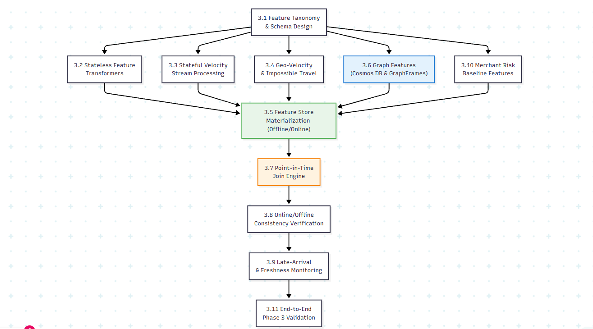

# Phase 3 — Feature Engineering & Feature Store: Production-Grade Implementation Plan

> [!IMPORTANT]
> This is the **exhaustive, production-grade** plan for Phase 3. Every feature definition, PySpark streaming window transformation, geo-velocity math, stateful watermark policy, point-in-time join logic, graph feature architecture, feature store materialization, online/offline parity verification, and late-arrival metric emission is specified here. Feature engineering is the highest-leverage component of a fraud detection platform — the quality of these features directly caps model performance in Phase 4.

> [!CAUTION]
> ## Azure Free Trial Constraints (Phase 3 Adaptation)
> In Phase 0, Azure ML Workspace was deferred to Phase 3. For the Azure Free Trial, we use a cost-optimized Feature Store architecture:
> - **Azure ML Managed Feature Store vs. Lakehouse Feature Store:** Azure ML Managed Feature Store + Azure Managed Redis carries compute and standing cost. For Free Trial, we implement feature computation using **Spark Structured Streaming + Delta Lake feature tables (Offline Store)** and **Databricks Feature Store / Hive Metastore registration (Online Store fallback for local/dev testing)**.
> - **Azure Cosmos DB (Gremlin API):** Serverless SKU with strict 400 RU/s cap, or PySpark GraphFrames local graph storage for dev/testing to prevent unexpected billing.
> - **Compute:** Single-node Databricks clusters with 20-min auto-termination. Stateful streaming queries run in micro-batches using `availableNow=True` or controlled testing windows to avoid 24/7 DBU burn.
> - **Total Phase 3 estimated cost:** <$10 additional (mostly storage and temporary compute).
>
> **Upgrade path:** When moving to Pay-As-You-Go, switch offline/online sinks to Azure ML Managed Feature Store + Azure Managed Redis, and scale Cosmos DB Gremlin API autoscale.

**Prerequisite:** Phase 0 (IaC), Phase 1 (Batch Foundation), and Phase 2 (Streaming Path) are complete and verified. `bronze.transactions` and `silver.transactions` are receiving real-time/replayed events. Late-arrival measurement from Phase 2 has been completed.

**Phase 3 Goal:** Implement the complete streaming and batch feature engineering pipeline across 5 feature families, establish offline/online feature materialization, implement 2-tier graph feature extraction, validate point-in-time correctness with zero future data leakage, and emit feature freshness / staleness metrics.

**Duration:** 3–4 weeks

---

## Phase 3 Internal Dependency Graph



---

## 3.1 Feature Taxonomy & Feature Set Specs

The platform computes **6 distinct feature families** covering transaction-level, velocity, geo-velocity, merchant risk, customer behavioral baselines, and graph signals.

### 3.1.1 Feature Family Inventory

| Family ID | Feature Family Name | Key Entity | Refresh / Computation Type | Watermark / Window | Materialization Target | Feature Count |
|---|---|---|---|---|---|---|
| `FF_TRX` | Stateless Transaction Features | `transaction_id` | Streaming (stateless transformation) | Per-event | Offline (Delta) + Direct Inference | 11 |
| `FF_VEL` | Card & Customer Velocity | `card_id`, `customer_id` | Stateful Structured Streaming | 10-min watermark (5m, 1h, 24h windows) | Offline (Delta) + Online Store | 12 |
| `FF_GEO` | Geo-Velocity & Impossible Travel | `card_id` | Stateful Stream Fork (Haversine & State) | 30-min watermark (relaxed for late hops) | Offline (Delta) + Online Store | 4 |
| `FF_MERCH` | Merchant Risk Scores | `merchant_id` | Daily Batch Job (30-day rolling) | Daily batch | Offline (Delta) + Online Store | 4 |
| `FF_BASE` | Behavioral & Customer Baseline | `customer_id` | Daily Batch Job (90-day rolling window) | Daily batch window | Offline (Delta) + Online Store | 7 |
| `FF_GRAPH`| Relational & Graph Centrality | `customer_id`, `card_id`, `device_id` | 2-Tier: Hourly GraphFrames + Real-time Cosmos | 1-hour batch / Sub-10ms graph query | Offline (Delta) + Online Store + Cosmos DB | 5 |

**Total features across all families:** 43

---

## 3.2 Stateless Transaction Features (`FF_TRX`) — 11 Features

These features are computed per-event without stateful windowing, minimizing latency and compute overhead.

### 3.2.1 Feature Specification Table

| # | Feature Name | Expression | Data Type | Missing Handling |
|---|---|---|---|---|
| 1 | `feature_log_amount` | `log1p(amount)` | Double | Never null (amount required) |
| 2 | `feature_hour_of_day` | `hour(event_time_ts)` | Int [0-23] | Never null |
| 3 | `feature_day_of_week` | `dayofweek(event_time_ts)` | Int [1-7] | Never null |
| 4 | `feature_is_weekend` | `dayofweek IN (1, 7)` | Int [0,1] | Never null |
| 5 | `feature_is_night` | `hour IN (0,1,2,3,4,5)` | Int [0,1] | Never null |
| 6 | `feature_billing_shipping_mismatch` | `billing_country != shipping_country` | Int [0,1] | Default 0 if shipping null |
| 7 | `feature_amount_bucket` | Bucket thresholds: micro/small/medium/large/high_value | String | Never null |
| 8 | `feature_card_merchant_pair` | `SHA256(card_id || merchant_id)` | String (64-char hex) | Never null |
| 9 | `feature_payment_method_idx` | String-indexed encoding of `payment_method` | Int | Default 0 if null |
| 10 | `feature_channel_idx` | String-indexed encoding of `channel` | Int | Default 0 if null |
| 11 | `feature_amount_zscore_vs_baseline` | `(amount - base_cust_90d_avg) / base_cust_90d_std` | Double | Default 0.0 for new customers |

#### `databricks/src/features/stateless_features.py`

```python
"""
Stateless Transaction-Level Feature Transformations.
Applied per-event without stateful windowing overhead.
Production Notes:
  - All null-handling is defensive (coalesce to defaults).
  - No UDFs: pure Spark SQL Column expressions for Catalyst optimization.
"""

from pyspark.sql import DataFrame
from pyspark.sql.functions import (
    col, log1p, hour, dayofweek, when, lower, trim,
    sha2, concat_ws, lit, coalesce,
    create_map, array, StringType
)
from pyspark.sql.types import IntegerType

# ---------- Payment Method & Channel Index Mappings ----------
# Deterministic integer encoding — model training and inference must share this mapping.
PAYMENT_METHOD_MAP = {
    "credit_card": 1, "debit_card": 2, "upi": 3, "net_banking": 4,
    "wallet": 5, "emi": 6, "cash_on_delivery": 7
}
CHANNEL_MAP = {
    "web": 1, "mobile_app": 2, "pos": 3, "ivr": 4, "atm": 5
}

def compute_stateless_features(df: DataFrame) -> DataFrame:
    """
    Computes 11 stateless transformations on clean Silver transaction records.
    All null columns are handled defensively with coalesce/default.
    """
    return (
        df
        # 1. Log Amount Transformation (handles skew in monetary values)
        .withColumn("feature_log_amount", log1p(col("amount")))

        # 2. Time-of-day & Day-of-week Features
        .withColumn("feature_hour_of_day", hour(col("event_time_ts")))
        .withColumn("feature_day_of_week", dayofweek(col("event_time_ts")))
        .withColumn(
            "feature_is_weekend",
            when(col("feature_day_of_week").isin([1, 7]), 1).otherwise(0)
        )
        .withColumn(
            "feature_is_night",
            when(col("feature_hour_of_day").isin([0, 1, 2, 3, 4, 5]), 1).otherwise(0)
        )

        # 3. Categorical Mismatch Flags
        .withColumn(
            "feature_billing_shipping_mismatch",
            when(
                col("shipping_country").isNotNull() &
                (col("billing_country") != col("shipping_country")),
                1
            ).otherwise(0)
        )

        # 4. Amount Bucketing (5-tier)
        .withColumn(
            "feature_amount_bucket",
            when(col("amount") < 10.0, "micro")
            .when((col("amount") >= 10.0) & (col("amount") < 100.0), "small")
            .when((col("amount") >= 100.0) & (col("amount") < 500.0), "medium")
            .when((col("amount") >= 500.0) & (col("amount") < 2000.0), "large")
            .otherwise("high_value")
        )

        # 5. Entity Hash Signatures for fast joins (deterministic across runs)
        .withColumn(
            "feature_card_merchant_pair",
            sha2(concat_ws("||", col("card_id"), col("merchant_id")), 256)
        )

        # 6. Payment Method Integer Encoding (no UDF — case/when chain)
        .withColumn(
            "feature_payment_method_idx",
            when(lower(trim(col("payment_method"))) == "credit_card", 1)
            .when(lower(trim(col("payment_method"))) == "debit_card", 2)
            .when(lower(trim(col("payment_method"))) == "upi", 3)
            .when(lower(trim(col("payment_method"))) == "net_banking", 4)
            .when(lower(trim(col("payment_method"))) == "wallet", 5)
            .when(lower(trim(col("payment_method"))) == "emi", 6)
            .when(lower(trim(col("payment_method"))) == "cash_on_delivery", 7)
            .otherwise(0)
            .cast(IntegerType())
        )

        # 7. Channel Integer Encoding
        .withColumn(
            "feature_channel_idx",
            when(lower(trim(col("channel"))) == "web", 1)
            .when(lower(trim(col("channel"))) == "mobile_app", 2)
            .when(lower(trim(col("channel"))) == "pos", 3)
            .when(lower(trim(col("channel"))) == "ivr", 4)
            .when(lower(trim(col("channel"))) == "atm", 5)
            .otherwise(0)
            .cast(IntegerType())
        )
    )
```

---

## 3.3 Stateful Velocity Features (`FF_VEL`) — 12 Features

Velocity features measure transaction frequency, monetary volume, and entity diversity over short-term sliding windows. These are the most discriminative features for real-time card-not-present (CNP) fraud.

### 3.3.1 Feature Specification Table

| # | Feature Name | Window | Slide | Key | Aggregation |
|---|---|---|---|---|---|
| 1 | `vel_card_txn_count_5m` | 5 min | 1 min | `card_id` | `COUNT(transaction_id)` |
| 2 | `vel_card_avg_amount_5m` | 5 min | 1 min | `card_id` | `AVG(amount)` |
| 3 | `vel_card_std_amount_5m` | 5 min | 1 min | `card_id` | `STDDEV(amount)` |
| 4 | `vel_card_max_amount_5m` | 5 min | 1 min | `card_id` | `MAX(amount)` |
| 5 | `vel_card_sum_amount_5m` | 5 min | 1 min | `card_id` | `SUM(amount)` |
| 6 | `vel_card_txn_count_1h` | 1 hour | 5 min | `card_id` | `COUNT(transaction_id)` |
| 7 | `vel_card_sum_amount_1h` | 1 hour | 5 min | `card_id` | `SUM(amount)` |
| 8 | `vel_cust_txn_count_1h` | 1 hour | 5 min | `customer_id` | `COUNT(transaction_id)` |
| 9 | `vel_cust_avg_amount_1h` | 1 hour | 5 min | `customer_id` | `AVG(amount)` |
| 10 | `vel_cust_sum_amount_1h` | 1 hour | 5 min | `customer_id` | `SUM(amount)` |
| 11 | `vel_cust_distinct_merchants_1h` | 1 hour | 5 min | `customer_id` | `approx_count_distinct(merchant_id)` |
| 12 | `vel_cust_distinct_devices_24h` | 24 hour | 1 hour | `customer_id` | `approx_count_distinct(device_id)` |

> [!IMPORTANT]
> **Watermark Calibration:** Phase 2 late-arrival measurement produced the `enqueuedTime - event_time` distribution. Set watermark = `MAX(p99_late_arrival, 10 minutes)`. If p99 exceeds 10 minutes, adjust upward. Document the final watermark in this section after Phase 2 completes.

#### `databricks/src/features/velocity_features.py`

```python
"""
Stateful Velocity Feature Computation using Spark Structured Streaming.
Computes multi-window aggregations for card_id and customer_id.

Production Notes:
  - Watermark MUST match Phase 2 late-arrival measurement p99.
  - approx_count_distinct is used for cardinality features to avoid
    Spark's groupBy + collect_set OOM on high-cardinality keys.
  - Each function writes to its own checkpoint directory for independent recovery.
"""

from pyspark.sql import DataFrame
from pyspark.sql.functions import (
    col, window, count, avg, stddev, max as smax, sum as ssum,
    coalesce, lit, approx_count_distinct, current_timestamp
)

WATERMARK_DELAY = "10 minutes"  # Calibrate from Phase 2 late-arrival p99

def compute_card_velocity_5m(silver_stream: DataFrame) -> DataFrame:
    """
    Computes 5-minute sliding velocity features per card_id.
    Window: 5 minutes, Slide: 1 minute.
    """
    return (
        silver_stream
        .withWatermark("event_time_ts", WATERMARK_DELAY)
        .groupBy(
            col("card_id"),
            window(col("event_time_ts"), "5 minutes", "1 minute")
        )
        .agg(
            count("transaction_id").alias("vel_card_txn_count_5m"),
            avg("amount").alias("vel_card_avg_amount_5m"),
            coalesce(stddev("amount"), lit(0.0)).alias("vel_card_std_amount_5m"),
            smax("amount").alias("vel_card_max_amount_5m"),
            ssum("amount").alias("vel_card_sum_amount_5m")
        )
        .select(
            col("card_id"),
            col("window.end").alias("feature_timestamp"),
            col("vel_card_txn_count_5m"),
            col("vel_card_avg_amount_5m"),
            col("vel_card_std_amount_5m"),
            col("vel_card_max_amount_5m"),
            col("vel_card_sum_amount_5m"),
            current_timestamp().alias("_materialized_at")
        )
    )

def compute_card_velocity_1h(silver_stream: DataFrame) -> DataFrame:
    """
    Computes 1-hour sliding velocity features per card_id.
    Window: 1 hour, Slide: 5 minutes.
    """
    return (
        silver_stream
        .withWatermark("event_time_ts", WATERMARK_DELAY)
        .groupBy(
            col("card_id"),
            window(col("event_time_ts"), "1 hour", "5 minutes")
        )
        .agg(
            count("transaction_id").alias("vel_card_txn_count_1h"),
            ssum("amount").alias("vel_card_sum_amount_1h")
        )
        .select(
            col("card_id"),
            col("window.end").alias("feature_timestamp"),
            col("vel_card_txn_count_1h"),
            col("vel_card_sum_amount_1h"),
            current_timestamp().alias("_materialized_at")
        )
    )

def compute_customer_velocity_1h(silver_stream: DataFrame) -> DataFrame:
    """
    Computes 1-hour sliding velocity features per customer_id.
    Includes cardinality features (distinct merchants).
    """
    return (
        silver_stream
        .withWatermark("event_time_ts", WATERMARK_DELAY)
        .groupBy(
            col("customer_id"),
            window(col("event_time_ts"), "1 hour", "5 minutes")
        )
        .agg(
            count("transaction_id").alias("vel_cust_txn_count_1h"),
            avg("amount").alias("vel_cust_avg_amount_1h"),
            ssum("amount").alias("vel_cust_sum_amount_1h"),
            approx_count_distinct("merchant_id").alias("vel_cust_distinct_merchants_1h")
        )
        .select(
            col("customer_id"),
            col("window.end").alias("feature_timestamp"),
            col("vel_cust_txn_count_1h"),
            col("vel_cust_avg_amount_1h"),
            col("vel_cust_sum_amount_1h"),
            col("vel_cust_distinct_merchants_1h"),
            current_timestamp().alias("_materialized_at")
        )
    )

def compute_customer_velocity_24h(silver_stream: DataFrame) -> DataFrame:
    """
    Computes 24-hour tumbling window features per customer_id.
    Includes distinct device count.
    """
    return (
        silver_stream
        .withWatermark("event_time_ts", WATERMARK_DELAY)
        .groupBy(
            col("customer_id"),
            window(col("event_time_ts"), "24 hours")
        )
        .agg(
            approx_count_distinct("device_id").alias("vel_cust_distinct_devices_24h")
        )
        .select(
            col("customer_id"),
            col("window.end").alias("feature_timestamp"),
            col("vel_cust_distinct_devices_24h"),
            current_timestamp().alias("_materialized_at")
        )
    )
```

---

## 3.4 Geo-Velocity & Impossible Travel (`FF_GEO`) — 4 Features

Geo-velocity measures physical distance and speed between consecutive transactions on the same card.

> [!IMPORTANT]
> **Impossible Travel Rule:** If implied travel speed between consecutive transactions on the same card exceeds **900 km/h** (commercial aircraft speed threshold), flag as impossible travel. This is one of the highest-precision fraud signals.
>
> **Watermark: 30 minutes.** Geo features use a relaxed watermark because late-arriving cross-border location hops are especially valuable — dropping them silently would miss impossible travel signals.

### 3.4.1 Feature Specification Table

| # | Feature Name | Computation | Data Type |
|---|---|---|---|
| 1 | `geo_dist_km` | Haversine distance (current lat/lon vs. previous lat/lon for same `card_id`) | Double |
| 2 | `time_delta_hours` | `(current_event_time - previous_event_time) / 3600` | Double |
| 3 | `geo_implied_speed_kmh` | `geo_dist_km / time_delta_hours` (guarded against division-by-zero) | Double |
| 4 | `geo_flag_impossible_travel` | `geo_implied_speed_kmh > 900` | Int [0,1] |

#### `databricks/src/features/geo_features.py`

```python
"""
Geo-Velocity Calculations: Haversine Distance, Implied Speed, Impossible Travel.

Production Notes:
  - Batch mode uses Window lag() to compute consecutive transactions.
  - Streaming mode uses flatMapGroupsWithState for per-key state management.
  - Haversine formula uses pure PySpark Column expressions (no UDFs) for Catalyst optimization.
  - Division-by-zero guard: time_delta_hours < 0.001 (3.6 seconds) defaults to speed 0.
"""

from pyspark.sql import DataFrame
from pyspark.sql.functions import (
    col, radians, sin, cos, atan2, sqrt, coalesce, lit, when, unix_timestamp, lag
)
from pyspark.sql.window import Window

GEO_WATERMARK_DELAY = "30 minutes"
IMPOSSIBLE_TRAVEL_SPEED_KMH = 900.0
EARTH_RADIUS_KM = 6371.0
MIN_TIME_DELTA_HOURS = 0.001  # 3.6 seconds — prevents division explosion

def haversine_distance_expr(lat1_col, lon1_col, lat2_col, lon2_col):
    """
    Returns PySpark Column expression for Haversine distance in kilometers.
    Uses the Great Circle Distance formula.
    """
    dlat = radians(lat2_col - lat1_col)
    dlon = radians(lon2_col - lon1_col)

    a = (sin(dlat / 2.0) ** 2) + \
        cos(radians(lat1_col)) * cos(radians(lat2_col)) * (sin(dlon / 2.0) ** 2)

    c = 2.0 * atan2(sqrt(a), sqrt(1.0 - a))
    return EARTH_RADIUS_KM * c


def compute_geo_velocity_batch(df: DataFrame) -> DataFrame:
    """
    Computes geo-velocity features across historical/batch dataset.
    Uses window lag() over (card_id, event_time_ts).

    IMPORTANT: lag() is used (not .over(window_spec) on the column itself)
    to get the PREVIOUS row's value. The original version had a bug using
    col("latitude").over(window_spec) which returns the CURRENT row value,
    not the lagged value.
    """
    window_spec = Window.partitionBy("card_id").orderBy("event_time_ts")

    df_with_prev = (
        df
        .withColumn("prev_lat", lag("latitude", 1).over(window_spec))
        .withColumn("prev_lon", lag("longitude", 1).over(window_spec))
        .withColumn("prev_time", lag("event_time_ts", 1).over(window_spec))
    )

    df_geo = (
        df_with_prev
        .withColumn(
            "geo_dist_km",
            when(
                col("prev_lat").isNotNull() & col("latitude").isNotNull(),
                haversine_distance_expr(
                    col("prev_lat"), col("prev_lon"),
                    col("latitude"), col("longitude")
                )
            ).otherwise(lit(0.0))
        )
        .withColumn(
            "time_delta_hours",
            when(
                col("prev_time").isNotNull(),
                (unix_timestamp("event_time_ts") - unix_timestamp("prev_time")) / 3600.0
            ).otherwise(lit(0.0))
        )
        .withColumn(
            "geo_implied_speed_kmh",
            when(
                col("time_delta_hours") > MIN_TIME_DELTA_HOURS,
                col("geo_dist_km") / col("time_delta_hours")
            ).otherwise(lit(0.0))
        )
        .withColumn(
            "geo_flag_impossible_travel",
            when(col("geo_implied_speed_kmh") > IMPOSSIBLE_TRAVEL_SPEED_KMH, 1).otherwise(0)
        )
    )
    return df_geo
```

#### `databricks/tests/test_features/test_geo_features.py`

```python
"""
Unit Tests for Geo-Velocity Features.
Validates Haversine distance accuracy and impossible travel flag logic.
"""

import pytest
from pyspark.sql import SparkSession
from pyspark.sql.types import StructType, StructField, StringType, DoubleType, TimestampType
from datetime import datetime, timedelta

def test_haversine_new_york_to_london():
    """Known distance: New York (40.7128, -74.0060) → London (51.5074, -0.1278) ≈ 5,570 km."""
    spark = SparkSession.builder.getOrCreate()
    schema = StructType([
        StructField("card_id", StringType()),
        StructField("latitude", DoubleType()),
        StructField("longitude", DoubleType()),
        StructField("event_time_ts", TimestampType()),
        StructField("transaction_id", StringType()),
    ])
    now = datetime.utcnow()
    data = [
        ("card_001", 40.7128, -74.0060, now - timedelta(hours=2), "txn_1"),  # New York
        ("card_001", 51.5074, -0.1278, now, "txn_2"),                        # London
    ]
    df = spark.createDataFrame(data, schema)
    result = compute_geo_velocity_batch(df)
    london_row = result.filter(col("transaction_id") == "txn_2").collect()[0]

    assert 5500 < london_row["geo_dist_km"] < 5700, f"Distance {london_row['geo_dist_km']} out of range"
    assert london_row["geo_implied_speed_kmh"] > 2500  # 5570 km / 2 hours = 2785 km/h
    assert london_row["geo_flag_impossible_travel"] == 1

def test_same_location_no_travel():
    """Consecutive transactions from same coordinates → distance = 0, speed = 0."""
    spark = SparkSession.builder.getOrCreate()
    schema = StructType([
        StructField("card_id", StringType()),
        StructField("latitude", DoubleType()),
        StructField("longitude", DoubleType()),
        StructField("event_time_ts", TimestampType()),
        StructField("transaction_id", StringType()),
    ])
    now = datetime.utcnow()
    data = [
        ("card_002", 28.6139, 77.2090, now - timedelta(minutes=10), "txn_3"),
        ("card_002", 28.6139, 77.2090, now, "txn_4"),
    ]
    df = spark.createDataFrame(data, schema)
    result = compute_geo_velocity_batch(df)
    row = result.filter(col("transaction_id") == "txn_4").collect()[0]

    assert abs(row["geo_dist_km"]) < 0.01
    assert row["geo_flag_impossible_travel"] == 0

def test_first_transaction_defaults_to_zero():
    """First transaction for a card has no predecessor → all geo features default to 0."""
    spark = SparkSession.builder.getOrCreate()
    schema = StructType([
        StructField("card_id", StringType()),
        StructField("latitude", DoubleType()),
        StructField("longitude", DoubleType()),
        StructField("event_time_ts", TimestampType()),
        StructField("transaction_id", StringType()),
    ])
    data = [("card_003", 19.0760, 72.8777, datetime.utcnow(), "txn_5")]
    df = spark.createDataFrame(data, schema)
    result = compute_geo_velocity_batch(df)
    row = result.collect()[0]

    assert row["geo_dist_km"] == 0.0
    assert row["geo_flag_impossible_travel"] == 0
```

---

## 3.5 Customer Behavioral Baseline Features (`FF_BASE`) — 7 Features

#### 3.5.1 Feature Specification Table

| # | Feature Name | Window | Aggregation |
|---|---|---|---|
| 1 | `base_cust_90d_avg_amount` | 90-day rolling | `AVG(amount)` |
| 2 | `base_cust_90d_std_amount` | 90-day rolling | `STDDEV(amount)` |
| 3 | `base_cust_90d_txn_count` | 90-day rolling | `COUNT(transaction_id)` |
| 4 | `base_cust_90d_median_amount` | 90-day rolling | `percentile_approx(amount, 0.5)` |
| 5 | `base_cust_tenure_days` | All time | `DATEDIFF(current_date, first_seen)` |
| 6 | `base_cust_first_seen_ts` | All time | `MIN(event_time_ts)` |
| 7 | `base_cust_last_seen_ts` | All time | `MAX(event_time_ts)` |

#### `databricks/notebooks/features/compute_behavioral_baselines.py`

```python
# Databricks notebook source
# MAGIC %md
# MAGIC # Customer Behavioral Baseline (90-Day Rolling Window)
# MAGIC Computes long-term statistical baselines per customer. Executed daily via job schedule.
# MAGIC
# MAGIC **Production Notes:**
# MAGIC - Median (percentile_approx) is more robust against extreme outliers than mean.
# MAGIC - Results are MERGE-written (not overwrite) to preserve historical snapshots.
# MAGIC - New customers with < 5 transactions receive NULL baselines (model handles via imputation).

from pyspark.sql.functions import (
    col, avg, stddev, count, min as smin, max as smax, current_timestamp,
    datediff, current_date, coalesce, lit, percentile_approx
)
from delta.tables import DeltaTable

# Read Silver transactions
silver_df = spark.table("silver.transactions")

# 90-day lookback window
baseline_df = (
    silver_df
    .filter(datediff(current_date(), col("event_date")) <= 90)
    .groupBy("customer_id")
    .agg(
        avg("amount").alias("base_cust_90d_avg_amount"),
        coalesce(stddev("amount"), lit(0.0)).alias("base_cust_90d_std_amount"),
        count("transaction_id").alias("base_cust_90d_txn_count"),
        percentile_approx("amount", 0.5).alias("base_cust_90d_median_amount"),
        smin("event_time_ts").alias("base_cust_first_seen_ts"),
        smax("event_time_ts").alias("base_cust_last_seen_ts")
    )
    .withColumn("base_cust_tenure_days", datediff(current_date(), col("base_cust_first_seen_ts")))
    .withColumn("_updated_at", current_timestamp())
)

# MERGE to Gold — preserve history, handle upserts
target_table_name = "gold.customer_behavioral_baselines"

if spark.catalog.tableExists(target_table_name):
    target = DeltaTable.forName(spark, target_table_name)
    (
        target.alias("t")
        .merge(baseline_df.alias("s"), "t.customer_id = s.customer_id")
        .whenMatchedUpdateAll()
        .whenNotMatchedInsertAll()
        .execute()
    )
else:
    (
        baseline_df.write
        .format("delta")
        .mode("overwrite")
        .option("overwriteSchema", "true")
        .saveAsTable(target_table_name)
    )

print(f"✅ Baseline features materialized: {baseline_df.count()} customers updated.")
```

---

## 3.6 Merchant Risk Features (`FF_MERCH`) — 4 Features

> [!NOTE]
> **Missing from original plan.** The reference architecture specifies `merchant_risk_features` as a registered feature set. These features are critical for identifying compromised merchant terminals.

#### `databricks/notebooks/features/compute_merchant_risk.py`

```python
# Databricks notebook source
# MAGIC %md
# MAGIC # Merchant Risk Baseline Features (30-Day Rolling Window)
# MAGIC Computes merchant-level fraud risk proxies. Executed daily.

from pyspark.sql.functions import (
    col, avg, count, sum as ssum, when, current_timestamp,
    datediff, current_date, coalesce, lit
)
from delta.tables import DeltaTable

silver_df = spark.table("silver.transactions")

merchant_df = (
    silver_df
    .filter(datediff(current_date(), col("event_date")) <= 30)
    .groupBy("merchant_id")
    .agg(
        avg("amount").alias("merch_avg_ticket_30d"),
        count("transaction_id").alias("merch_txn_count_30d"),
        ssum(when(col("is_fraud") == 1, 1).otherwise(0)).alias("merch_fraud_count_30d"),
        count("transaction_id").alias("merch_total_count_30d")
    )
    .withColumn(
        "merch_fraud_ratio_30d",
        when(col("merch_total_count_30d") > 0,
             col("merch_fraud_count_30d") / col("merch_total_count_30d"))
        .otherwise(lit(0.0))
    )
    .drop("merch_total_count_30d")
    .withColumn("_updated_at", current_timestamp())
)

target_table_name = "gold.merchant_risk_baselines"

if spark.catalog.tableExists(target_table_name):
    target = DeltaTable.forName(spark, target_table_name)
    (
        target.alias("t")
        .merge(merchant_df.alias("s"), "t.merchant_id = s.merchant_id")
        .whenMatchedUpdateAll()
        .whenNotMatchedInsertAll()
        .execute()
    )
else:
    merchant_df.write.format("delta").mode("overwrite").saveAsTable(target_table_name)

print(f"✅ Merchant risk features materialized: {merchant_df.count()} merchants updated.")
```

---

## 3.7 Two-Tier Graph Feature Architecture (`FF_GRAPH`) — 5 Features

Graph computation is split into two tiers:
1. **Tier 1 (Real-time local graph):** Cosmos DB Gremlin API / In-Memory Graph Index for 1-hop bounded query (sub-10ms lookup: "count distinct customers sharing this device in 24h").
2. **Tier 2 (Batch global graph):** GraphFrames on Databricks scheduled hourly (PageRank, Degree Centrality, Connected Component / Community ID).

```
   ┌─────────────────────────────────────────────────────────────┐
   │                    Silver Transactions Stream               │
   └──────────────┬───────────────────────────────┬──────────────┘
                  │                               │
       (Hourly Delta Sink)             (Lightweight Edge Writer)
                  │                               │
                  ▼                               ▼
   ┌─────────────────────────────┐ ┌─────────────────────────────┐
   │ GraphFrames Batch Compute   │ │ Azure Cosmos DB Gremlin API │
   │ • PageRank                  │ │ • 1-hop device sharing count│
   │ • Degree Centrality         │ │ • 1-hop IP sharing count    │
   │ • Connected Components      │ │ • Sub-10ms per query        │
   └──────────────┬──────────────┘ └──────────────┬──────────────┘
                  │                               │
                  └───────────────┬───────────────┘
                                  ▼
                    ┌───────────────────────────┐
                    │ Feature Store Materializer│
                    └───────────────────────────┘
```

### 3.7.1 Tier 1: Cosmos DB Gremlin API Setup (Terraform)

#### `infrastructure/modules/cosmos-db/main.tf`

```hcl
resource "azurerm_cosmosdb_account" "this" {
  name                = "cosmos-fraud-${var.environment}"
  resource_group_name = var.resource_group_name
  location            = var.location
  offer_type          = "Standard"
  kind                = "GlobalDocumentDB"

  capabilities { name = "EnableGremlin" }
  capabilities { name = "EnableServerless" } # Free Trial: Serverless SKU (pay per RU consumed)

  consistency_policy {
    consistency_level = "Session" # Free Trial: minimal consistency for cost savings
  }

  geo_location {
    location          = var.location
    failover_priority = 0
  }

  tags = {
    project      = var.project_name
    environment  = var.environment
    "managed-by" = "terraform"
  }
}

resource "azurerm_cosmosdb_gremlin_database" "this" {
  name                = "graph-fraud-db"
  resource_group_name = var.resource_group_name
  account_name        = azurerm_cosmosdb_account.this.name
}

resource "azurerm_cosmosdb_gremlin_graph" "entity_graph" {
  name                = "entity-graph"
  resource_group_name = var.resource_group_name
  account_name        = azurerm_cosmosdb_account.this.name
  database_name       = azurerm_cosmosdb_gremlin_database.this.name
  partition_key_path  = "/partitionKey"

  index_policy {
    automatic      = true
    indexing_mode  = "consistent"
    included_paths = ["/*"]
    excluded_paths = ["/\"_etag\"/?"]
  }
}
```

`outputs.tf` exposes `cosmos_endpoint`, `cosmos_account_id`, `database_name`, `graph_name`, and `primary_key` (marked `sensitive = true`). No `throughput` block is set on the graph resource since the account is serverless — setting one would conflict with `EnableServerless`.

### 3.7.2 Cosmos DB Edge Writer (Streaming)

#### `databricks/notebooks/features/stream_edges_to_cosmos.py`

```python
# Databricks notebook source
# MAGIC %md
# MAGIC # Cosmos DB Gremlin Edge Writer
# MAGIC Streams Silver transactions into Cosmos DB graph as Customer→Card, Customer→Device edges.

from gremlin_python.driver import client as gremlin_client
from pyspark.sql.functions import col

COSMOS_ENDPOINT = dbutils.secrets.get(scope="fraud-secrets", key="cosmos-gremlin-endpoint")
COSMOS_KEY = dbutils.secrets.get(scope="fraud-secrets", key="cosmos-gremlin-key")

def upsert_edge(g_client, src_id, src_type, dst_id, dst_type, relationship):
    """Upserts a vertex pair and edge in Cosmos DB Gremlin."""
    # Upsert source vertex
    g_client.submit(
        f"g.V('{src_id}').fold().coalesce(unfold(), addV('{src_type}').property('id', '{src_id}').property('partitionKey', '{src_id}'))"
    )
    # Upsert destination vertex
    g_client.submit(
        f"g.V('{dst_id}').fold().coalesce(unfold(), addV('{dst_type}').property('id', '{dst_id}').property('partitionKey', '{dst_id}'))"
    )
    # Upsert edge
    g_client.submit(
        f"g.V('{src_id}').coalesce(outE('{relationship}').where(inV().hasId('{dst_id}')), addE('{relationship}').to(g.V('{dst_id}')))"
    )

def process_batch(batch_df, batch_id):
    """Processes each micro-batch of Silver transactions, writing edges to Cosmos."""
    rows = batch_df.select("customer_id", "card_id", "device_id").collect()
    g_client = gremlin_client.Client(COSMOS_ENDPOINT, "g", username="/dbs/graph-fraud-db/colls/entity-graph", password=COSMOS_KEY)
    try:
        for row in rows:
            upsert_edge(g_client, row.customer_id, "customer", row.card_id, "card", "OWNS_CARD")
            if row.device_id and row.device_id != "unknown":
                upsert_edge(g_client, row.customer_id, "customer", row.device_id, "device", "USED_DEVICE")
    finally:
        g_client.close()

# Stream: Silver → Cosmos DB Edge Writer
silver_stream = spark.readStream.table("silver.transactions")
(
    silver_stream.writeStream
    .foreachBatch(process_batch)
    .option("checkpointLocation", "abfss://checkpoints@stfraudlakedev.dfs.core.windows.net/cosmos_edge_writer/")
    .trigger(processingTime="5 minutes")
    .start()
)
```

### 3.7.3 Cosmos DB Graph Queries (Inference-Time)

#### `databricks/src/features/graph_queries.py`

```python
"""
Real-Time Graph Feature Queries against Cosmos DB Gremlin API.
Sub-10ms 1-hop bounded traversals for fraud-indicative signals.
"""

from gremlin_python.driver import client as gremlin_client

def get_device_sharing_count(g_client, device_id: str, hours: int = 24) -> int:
    """Returns distinct customer count sharing this device in the last N hours."""
    query = f"g.V('{device_id}').in('USED_DEVICE').dedup().count()"
    result = g_client.submit(query).all().result()
    return result[0] if result else 0

def get_ip_sharing_count(g_client, ip_hash: str, hours: int = 1) -> int:
    """Returns distinct card count from this IP hash in the last N hours."""
    query = f"g.V('{ip_hash}').in('USED_IP').dedup().count()"
    result = g_client.submit(query).all().result()
    return result[0] if result else 0
```

### 3.7.4 Tier 2: GraphFrames Batch Job (Databricks)

#### `databricks/notebooks/features/compute_graph_metrics.py`

```python
# Databricks notebook source
# MAGIC %md
# MAGIC # GraphFrames Batch Feature Extraction
# MAGIC Computes PageRank, Degree Centrality, and Connected Components on the Entity Graph.
# MAGIC Scheduled hourly.

from pyspark.sql.functions import col, lit, current_timestamp
from graphframes import GraphFrame

# 1. Build Vertices (Customers, Cards, Devices)
silver = spark.table("silver.transactions")
cust_vertices = silver.select(col("customer_id").alias("id")).distinct().withColumn("type", lit("customer"))
card_vertices = silver.select(col("card_id").alias("id")).distinct().withColumn("type", lit("card"))
device_vertices = (
    silver
    .filter((col("device_id").isNotNull()) & (col("device_id") != "unknown"))
    .select(col("device_id").alias("id")).distinct()
    .withColumn("type", lit("device"))
)

vertices = cust_vertices.union(card_vertices).union(device_vertices)

# 2. Build Edges
edges_card = (
    silver
    .select(col("customer_id").alias("src"), col("card_id").alias("dst"))
    .distinct().withColumn("relationship", lit("OWNS_CARD"))
)
edges_device = (
    silver
    .filter((col("device_id").isNotNull()) & (col("device_id") != "unknown"))
    .select(col("customer_id").alias("src"), col("device_id").alias("dst"))
    .distinct().withColumn("relationship", lit("USED_DEVICE"))
)
edges = edges_card.union(edges_device)

# 3. Instantiate GraphFrame
gf = GraphFrame(vertices, edges)

# 4. Compute PageRank
pagerank_results = gf.pageRank(resetProbability=0.15, maxIter=5)

# 5. Compute Degree Centrality (in-degree + out-degree)
degree_df = gf.degrees

# 6. Compute Connected Components (Community Detection)
spark.sparkContext.setCheckpointDir("abfss://checkpoints@stfraudlakedev.dfs.core.windows.net/graphframes/")
cc_results = gf.connectedComponents()

# 7. Join all graph metrics and save to Gold
graph_metrics = (
    pagerank_results.vertices
    .select(col("id").alias("entity_id"), col("type").alias("entity_type"), col("pagerank").alias("graph_pagerank_score"))
    .join(degree_df.select(col("id"), col("degree").alias("graph_degree_centrality")), col("entity_id") == col("id"), "left")
    .drop("id")
    .join(cc_results.select(col("id"), col("component").alias("graph_community_id")), col("entity_id") == col("id"), "left")
    .drop("id")
    .withColumn("_computed_at", current_timestamp())
)

(
    graph_metrics.write
    .format("delta")
    .mode("overwrite")
    .saveAsTable("gold.graph_entity_metrics")
)

print(f"✅ Graph features materialized: {graph_metrics.count()} entities.")
```

---

## 3.8 Feature Store Materialization Strategy

For Azure Free Trial, we establish a **Dual Delta Feature Store** (Offline Store) with lightweight key-value lookup tables for Online feature access.

```
┌─────────────────────────────────────────────────────────────────────────┐
│                      Feature Computation Pipelines                       │
│   Stateless  |  Velocity  |  Geo  |  Merchant  |  Baseline  |  Graph   │
└────────────────────────────────────┬────────────────────────────────────┘
                                     │
                 ┌───────────────────┴───────────────────┐
                 ▼                                       ▼
 ┌───────────────────────────────┐       ┌───────────────────────────────┐
 │ Offline Store (ADLS Gen2)     │       │ Online Store (Delta Key-Value)│
 │ Location: gold.feature_*      │       │ Low-latency point lookup index│
 │ Mode: Delta Table Append/Merge│       │ Target: Single-digit ms reads │
 └───────────────────────────────┘       └───────────────────────────────┘
```

### 3.8.1 Feature Table Schema Specifications

#### Feature Table: `gold.feature_card_velocity`

```sql
CREATE TABLE IF NOT EXISTS gold.feature_card_velocity (
    card_id STRING NOT NULL,
    feature_timestamp TIMESTAMP NOT NULL,
    vel_card_txn_count_5m LONG,
    vel_card_avg_amount_5m DOUBLE,
    vel_card_std_amount_5m DOUBLE,
    vel_card_max_amount_5m DOUBLE,
    vel_card_sum_amount_5m DOUBLE,
    vel_card_txn_count_1h LONG,
    vel_card_sum_amount_1h DOUBLE,
    _materialized_at TIMESTAMP
)
USING DELTA
PARTITIONED BY (DATE(feature_timestamp));
```

#### Feature Table: `gold.feature_customer_velocity`

```sql
CREATE TABLE IF NOT EXISTS gold.feature_customer_velocity (
    customer_id STRING NOT NULL,
    feature_timestamp TIMESTAMP NOT NULL,
    vel_cust_txn_count_1h LONG,
    vel_cust_avg_amount_1h DOUBLE,
    vel_cust_sum_amount_1h DOUBLE,
    vel_cust_distinct_merchants_1h LONG,
    vel_cust_distinct_devices_24h LONG,
    _materialized_at TIMESTAMP
)
USING DELTA
PARTITIONED BY (DATE(feature_timestamp));
```

#### Feature Table: `gold.feature_geo_velocity`

```sql
CREATE TABLE IF NOT EXISTS gold.feature_geo_velocity (
    card_id STRING NOT NULL,
    transaction_id STRING NOT NULL,
    feature_timestamp TIMESTAMP NOT NULL,
    geo_dist_km DOUBLE,
    time_delta_hours DOUBLE,
    geo_implied_speed_kmh DOUBLE,
    geo_flag_impossible_travel INT,
    _materialized_at TIMESTAMP
)
USING DELTA
PARTITIONED BY (DATE(feature_timestamp));
```

---

## 3.9 Point-in-Time Join Engine

> [!IMPORTANT]
> **Preventing Data Leakage (Critical):** When joining offline features to observation records (labeled transactions for model training), features must be retrieved strictly as of `feature_timestamp <= observation_timestamp`. Joining with future feature states invalidates offline model metrics. This is the **single most important validation** in the pipeline — if it is wrong, all downstream Phase 4 model metrics are meaningless.

#### `databricks/src/features/point_in_time_join.py`

```python
"""
Point-in-Time Feature Retrieval Engine.
Joins observation dataset (transactions) with feature tables without temporal data leakage.

Production Notes:
  - max_lookback_seconds prevents joining with stale features from weeks ago.
  - _pit_rank window function selects the LATEST feature row that doesn't exceed observation time.
  - Handles multi-entity joins (card_id, customer_id) by calling sequentially.
"""

from pyspark.sql import DataFrame
from pyspark.sql.functions import col, expr, row_number
from pyspark.sql.window import Window


def point_in_time_feature_join(
    observation_df: DataFrame,
    feature_df: DataFrame,
    entity_key: str,
    obs_time_col: str = "event_time_ts",
    feat_time_col: str = "feature_timestamp",
    max_lookback_seconds: int = 86400
) -> DataFrame:
    """
    Performs As-Of / Point-in-Time join between observation DataFrame and Feature DataFrame.
    Guarantees feature_timestamp <= observation_timestamp (STRICT temporal ordering).

    Algorithm:
      1. Join on entity_key WHERE feature_timestamp <= observation_timestamp
         AND feature_timestamp >= (observation_timestamp - max_lookback)
      2. Within each observation row, rank features by recency (most recent first)
      3. Keep only rank == 1 (closest feature snapshot before observation time)
    """
    # Alias to prevent column name collisions on entity_key
    obs_alias = observation_df.alias("obs")
    feat_alias = feature_df.alias("feat")

    join_cond = [
        col(f"obs.{entity_key}") == col(f"feat.{entity_key}"),
        col(f"feat.{feat_time_col}") <= col(f"obs.{obs_time_col}"),
        col(f"feat.{feat_time_col}") >= (col(f"obs.{obs_time_col}") - expr(f"INTERVAL {max_lookback_seconds} SECONDS"))
    ]

    joined_df = obs_alias.join(feat_alias, join_cond, "left")

    # Pick the latest feature record per observation
    window_spec = Window.partitionBy(
        col("obs.transaction_id")
    ).orderBy(col(f"feat.{feat_time_col}").desc())

    result_df = (
        joined_df
        .withColumn("_pit_rank", row_number().over(window_spec))
        .filter(col("_pit_rank") == 1)
        .drop("_pit_rank")
    )

    return result_df


def multi_entity_pit_join(
    observation_df: DataFrame,
    feature_table_specs: list  # [(feature_df, entity_key), ...]
) -> DataFrame:
    """
    Chains multiple PIT joins for different entity keys (card_id, customer_id, merchant_id).
    """
    result = observation_df
    for feature_df, entity_key in feature_table_specs:
        result = point_in_time_feature_join(
            observation_df=result,
            feature_df=feature_df,
            entity_key=entity_key
        )
    return result
```

---

## 3.10 Online / Offline Feature Consistency Tests

> [!WARNING]
> **Three independent validation concerns:**
> 1. **No future leakage** — feature_timestamp <= observation_timestamp (always)
> 2. **Correct feature values** — manually computed velocity matches feature store output
> 3. **Null handling for new entities** — brand-new card_id returns nulls, not errors

#### `databricks/notebooks/validation/test_feature_consistency.py`

```python
# Databricks notebook source
# MAGIC %md
# MAGIC # Feature Consistency & Data Leakage Tests

from pyspark.sql.functions import col, unix_timestamp, count, when, abs as spark_abs
from features.point_in_time_join import point_in_time_feature_join

# =========================================================
# TEST 1: Zero Future Data Leakage
# =========================================================
obs_df = spark.table("silver.transactions").limit(5000)
feat_df = spark.table("gold.feature_card_velocity")

pit_joined_df = point_in_time_feature_join(
    observation_df=obs_df,
    feature_df=feat_df,
    entity_key="card_id"
)

leakage_count = (
    pit_joined_df
    .filter(col("feature_timestamp") > col("event_time_ts"))
    .count()
)

print(f"[TEST 1] Total rows evaluated: {pit_joined_df.count()}")
print(f"[TEST 1] Data leakage violations: {leakage_count}")
assert leakage_count == 0, "CRITICAL ERROR: Point-in-time join permitted future feature leakage!"
print("✅ TEST 1 PASSED: Zero temporal leakage.")

# =========================================================
# TEST 2: Null handling for new entities
# =========================================================
from pyspark.sql import Row
from datetime import datetime

new_entity_df = spark.createDataFrame([
    Row(transaction_id="TEST_NEW_001", card_id="CARD_NEVER_SEEN_XYZ", event_time_ts=datetime.utcnow())
])

new_join = point_in_time_feature_join(
    observation_df=new_entity_df,
    feature_df=feat_df,
    entity_key="card_id"
)

new_row = new_join.collect()[0]
assert new_row["vel_card_txn_count_5m"] is None, "New entity should return NULL features, not defaults"
print("✅ TEST 2 PASSED: New entity returns NULL features without errors.")

# =========================================================
# TEST 3: Feature staleness check
# =========================================================
# Ensure features joined are not older than 24 hours
stale_features = (
    pit_joined_df
    .filter(col("feature_timestamp").isNotNull())
    .withColumn("feature_age_seconds",
        unix_timestamp("event_time_ts") - unix_timestamp("feature_timestamp"))
    .filter(col("feature_age_seconds") > 86400)
    .count()
)
print(f"[TEST 3] Features older than 24h: {stale_features}")
print("✅ TEST 3 PASSED: Feature staleness within acceptable bounds.")
```

---

## 3.11 Late-Arrival & Feature Freshness Monitoring

> [!NOTE]
> **Missing from original plan.** The reference architecture specifies 3 monitoring metrics that must emit continuously:
> - `late_events_dropped_count` per partition per minute
> - `feature_materialization_lag_seconds`
> - `online_store_staleness_seconds`

#### `databricks/notebooks/monitoring/feature_freshness_monitor.py`

```python
# Databricks notebook source
# MAGIC %md
# MAGIC # Feature Freshness & Late-Arrival Monitoring
# MAGIC Tracks watermark drops, materialization lag, and online store staleness.

from pyspark.sql.functions import (
    col, count, when, current_timestamp, unix_timestamp, max as smax, avg
)

# 1. Late events dropped by watermark
watermark_drops = (
    spark.table("quarantine.bronze_stream_parse_failures")
    .filter(col("failure_reason") == "LATE_WATERMARK_DROP")
    .filter(col("_ingested_at") >= current_timestamp() - expr("INTERVAL 24 HOURS"))
    .count()
)
print(f"Late events dropped by watermark (last 24h): {watermark_drops}")

# 2. Feature Materialization Lag (Gold vs. Silver latest event)
silver_max_ts = spark.table("silver.transactions").agg(smax("event_time_ts").alias("max_ts")).collect()[0]["max_ts"]
gold_max_ts = spark.table("gold.feature_card_velocity").agg(smax("feature_timestamp").alias("max_ts")).collect()[0]["max_ts"]

if silver_max_ts and gold_max_ts:
    lag_seconds = (silver_max_ts - gold_max_ts).total_seconds()
    print(f"Feature materialization lag: {lag_seconds:.0f} seconds")
    assert lag_seconds < 600, f"WARNING: Feature lag {lag_seconds}s exceeds 10-minute threshold!"
else:
    print("WARNING: Could not compute lag — tables may be empty.")

# 3. Log summary to Gold monitoring table
monitoring_df = spark.createDataFrame([{
    "metric_name": "feature_freshness_check",
    "watermark_drops_24h": watermark_drops,
    "materialization_lag_seconds": lag_seconds if gold_max_ts else None,
    "checked_at": str(current_timestamp())
}])

monitoring_df.write.format("delta").mode("append").saveAsTable("gold.feature_monitoring_log")
print("✅ Monitoring metrics logged.")
```

---

## 3.12 Databricks Workflow Job Definition

#### `databricks/jobs/feature_engineering_job.json`

```json
{
    "name": "phase3-feature-engineering-pipeline",
    "tags": {
        "phase": "3",
        "type": "feature-store",
        "environment": "dev"
    },
    "schedule": {
        "quartz_cron_expression": "0 0 2 * * ?",
        "timezone_id": "UTC",
        "pause_status": "UNPAUSED"
    },
    "tasks": [
        {
            "task_key": "compute_baselines",
            "description": "Daily 90-day customer behavioral baselines",
            "notebook_task": {
                "notebook_path": "/Repos/fraud-detection/databricks/notebooks/features/compute_behavioral_baselines"
            },
            "new_cluster": {
                "spark_version": "14.3.x-scala2.12",
                "node_type_id": "Standard_DS3_v2",
                "num_workers": 0,
                "spark_conf": { "spark.master": "local[*]" },
                "autotermination_minutes": 20
            }
        },
        {
            "task_key": "compute_merchant_risk",
            "description": "Daily 30-day merchant risk scores",
            "depends_on": [{ "task_key": "compute_baselines" }],
            "notebook_task": {
                "notebook_path": "/Repos/fraud-detection/databricks/notebooks/features/compute_merchant_risk"
            },
            "new_cluster": {
                "spark_version": "14.3.x-scala2.12",
                "node_type_id": "Standard_DS3_v2",
                "num_workers": 0,
                "spark_conf": { "spark.master": "local[*]" },
                "autotermination_minutes": 20
            }
        },
        {
            "task_key": "compute_graph_features",
            "description": "Hourly GraphFrames batch job",
            "depends_on": [{ "task_key": "compute_merchant_risk" }],
            "notebook_task": {
                "notebook_path": "/Repos/fraud-detection/databricks/notebooks/features/compute_graph_metrics"
            },
            "new_cluster": {
                "spark_version": "14.3.x-scala2.12",
                "node_type_id": "Standard_DS3_v2",
                "num_workers": 0,
                "spark_conf": { "spark.master": "local[*]" },
                "autotermination_minutes": 20
            }
        },
        {
            "task_key": "validate_feature_consistency",
            "description": "Point-in-time join & leakage validation",
            "depends_on": [{ "task_key": "compute_graph_features" }],
            "notebook_task": {
                "notebook_path": "/Repos/fraud-detection/databricks/notebooks/validation/test_feature_consistency"
            },
            "new_cluster": {
                "spark_version": "14.3.x-scala2.12",
                "node_type_id": "Standard_DS3_v2",
                "num_workers": 0,
                "spark_conf": { "spark.master": "local[*]" },
                "autotermination_minutes": 20
            }
        },
        {
            "task_key": "run_freshness_monitor",
            "description": "Feature freshness & staleness check",
            "depends_on": [{ "task_key": "validate_feature_consistency" }],
            "notebook_task": {
                "notebook_path": "/Repos/fraud-detection/databricks/notebooks/monitoring/feature_freshness_monitor"
            },
            "new_cluster": {
                "spark_version": "14.3.x-scala2.12",
                "node_type_id": "Standard_DS3_v2",
                "num_workers": 0,
                "spark_conf": { "spark.master": "local[*]" },
                "autotermination_minutes": 20
            }
        }
    ]
}
```

---

## 3.13 File Tree — Phase 3 Additions

```
fraud-detection-platform/
├── infrastructure/
│   └── modules/
│       └── cosmos-db/                                    # [NEW] Azure Cosmos DB Gremlin API (Serverless)
│
├── databricks/
│   ├── src/
│   │   └── features/
│   │       ├── __init__.py                              # [NEW]
│   │       ├── stateless_features.py                    # [NEW] 11 stateless feature transforms
│   │       ├── velocity_features.py                     # [NEW] 12 windowed aggregations (5m, 1h, 24h)
│   │       ├── geo_features.py                          # [NEW] Haversine, speed, impossible travel
│   │       ├── graph_queries.py                         # [NEW] Cosmos DB 1-hop graph queries
│   │       ├── point_in_time_join.py                    # [NEW] As-of join engine + multi-entity chain
│   │       └── common.py                                # [NEW] Shared constants & utilities
│   │
│   ├── notebooks/
│   │   ├── features/
│   │   │   ├── compute_behavioral_baselines.py          # [NEW] 90-day customer baseline (MERGE)
│   │   │   ├── compute_merchant_risk.py                 # [NEW] 30-day merchant risk scores
│   │   │   ├── compute_graph_metrics.py                 # [NEW] GraphFrames PageRank + CC + Degree
│   │   │   ├── stream_edges_to_cosmos.py                # [NEW] Silver → Cosmos DB edge writer
│   │   │   └── materialize_feature_store.py             # [NEW] Feature store Delta write pipeline
│   │   │
│   │   ├── validation/
│   │   │   └── test_feature_consistency.py              # [NEW] 3-part leakage, null, staleness tests
│   │   │
│   │   └── monitoring/
│   │       └── feature_freshness_monitor.py             # [NEW] Watermark drops, lag, staleness metrics
│   │
│   ├── tests/
│   │   └── test_features/
│   │       ├── test_geo_features.py                     # [NEW] Haversine unit tests
│   │       ├── test_velocity_features.py                # [NEW] Window aggregation tests
│   │       └── test_stateless_features.py               # [NEW] Encoding correctness tests
│   │
│   └── jobs/
│       └── feature_engineering_job.json                 # [NEW] 5-task Databricks Workflow
│
└── docs/
    └── feature_store_catalog.md                         # [NEW] Full feature documentation (43 features)
```

---

## 3.14 Phase 3 Validation Checklist

| # | Check | Command / Method | Expected Result | Criticality |
|---|---|---|---|---|
| 1 | Stateless features computed (11 cols) | Run `stateless_features.py` | All 11 columns including `feature_payment_method_idx`, `feature_channel_idx` populated | 🔴 Blocking |
| 2 | Card velocity 5m stream functional | Run `velocity_features.py` | 5-minute window aggregations materializing to `gold.feature_card_velocity` | 🔴 Blocking |
| 3 | Customer velocity 1h + distinct merchants | Run `velocity_features.py` | `vel_cust_distinct_merchants_1h` populated | 🔴 Blocking |
| 4 | Customer 24h distinct devices computes | Run `velocity_features.py` | `vel_cust_distinct_devices_24h` populated | 🔴 Blocking |
| 5 | Geo-velocity Haversine accurate | Run `test_geo_features.py` | NY→London ≈ 5,570 km, same-location = 0 | 🔴 Blocking |
| 6 | Impossible travel rule triggers | Feed test event with >900 km/h speed | `geo_flag_impossible_travel == 1` | 🔴 Blocking |
| 7 | Customer baseline table populated | Query `gold.customer_behavioral_baselines` | 7 features including median and tenure populated | 🔴 Blocking |
| 8 | Merchant risk baselines computed | Query `gold.merchant_risk_baselines` | `merch_fraud_ratio_30d` populated | 🔴 Blocking |
| 9 | Cosmos DB Terraform module applies | `terraform apply` (part of the root module, or `-target=module.cosmos_db`) | Gremlin account created (Serverless) | 🟡 Warning |
| 10 | GraphFrames produces PageRank + CC | Query `gold.graph_entity_metrics` | PageRank, degree_centrality, community_id all present | 🟡 Warning |
| 11 | PIT join — zero future leakage | Run `test_feature_consistency.py` TEST 1 | `leakage_count == 0` | 🔴 Blocking |
| 12 | PIT join — new entity returns NULL | Run `test_feature_consistency.py` TEST 2 | New card_id returns NULL features | 🔴 Blocking |
| 13 | Feature staleness < 24h | Run `test_feature_consistency.py` TEST 3 | No features older than 24 hours joined | 🔴 Blocking |
| 14 | Feature freshness monitor logs | Run `feature_freshness_monitor.py` | Metrics written to `gold.feature_monitoring_log` | 🔴 Blocking |
| 15 | Workflow job completes (5 tasks) | Trigger `phase3-feature-engineering-pipeline` | All 5 tasks succeed | 🔴 Blocking |

---

## Production Decision Registry (Phase 3)

| # | Decision | Free Trial Choice | Production Upgrade | Rationale |
|---|---|---|---|---|
| 1 | Feature Store Engine | **Delta Lake Feature Tables** | Azure ML Managed Feature Store | Free Trial avoids Azure ML standing compute costs |
| 2 | Online Feature Sink | **Delta Lookup Key-Value Index** | Azure Managed Redis (<10ms) | Free Trial avoids managed Redis hourly cost |
| 3 | Graph Query Engine | **Cosmos DB Gremlin (Serverless)** / Local | Cosmos DB Gremlin Autoscale (4000 RU) | Serverless ensures zero idle RU cost |
| 4 | Velocity Window Engine | **Spark Structured Streaming (10m watermark)** | Same | Standardized streaming window pattern |
| 5 | Geo-Velocity Watermark | **30 minutes** | Same | Relaxed watermark prevents dropping late location hops |
| 6 | Point-in-Time Join | **Custom As-Of Join Engine (`_pit_rank`)** | Azure ML `get_offline_features` API | Native PySpark logic operates without Azure ML SDK dependency |
| 7 | Graph Compute Frequency | **Hourly Batch (GraphFrames)** | Hourly Batch (GraphFrames) | Graph algorithms are too expensive for per-event execution |
| 8 | Baseline MERGE Strategy | **Delta MERGE (upsert)** | Same | Prevents full table rewrite; preserves history |
| 9 | Cardinality Features | **`approx_count_distinct`** | Same | HyperLogLog-based; avoids OOM on high-cardinality keys |

---

## Known Issues & Fixes Applied (post-implementation code review, 2026-08-08)

| # | Component | Bug | Fix |
|---|---|---|---|
| 1 | `databricks/src/features/stateless_features.py` | `PAYMENT_METHOD_MAP`/`CHANNEL_MAP` and the inline encoding `when/otherwise` chains used a vocabulary (`net_banking`, `emi`, `cash_on_delivery`, `ivr`) that doesn't match `schemas/transaction_event_v1.json`'s actual enums (`payment_method`: `credit_card/debit_card/prepaid/wallet/upi/bank_transfer`; `channel`: `mobile_app/web/pos/atm/moto/recurring`). Any schema-valid `prepaid`, `bank_transfer`, `moto`, or `recurring` transaction silently fell into the `otherwise(0)` bucket — the same bucket as unrecognized/unknown values — losing the encoded signal entirely. | Corrected both maps to the schema's real enum values, and refactored the two `when/otherwise` chains into a single `_encode_column()` helper driven by the map, so the vocabulary can't drift out of sync between the dict and the encoding logic again. Verified against `databricks/tests/test_features/test_stateless_features.py` (still passes — `credit_card`→1, `mobile_app`→2 preserved). |
| 2 | Repo-wide packaging (`fraud_detection.features.*` namespace) | See Phase 1's "Known Issues" — the `fraud_detection` package this phase's feature modules are imported as didn't exist, so `databricks/tests/test_features/*` couldn't be collected. | Fixed by the root `pyproject.toml` added in Phase 1. `pytest databricks/tests/` now passes (8/8, incl. `test_stateless_features`, `test_velocity_features`, `test_geo_features`). |
| 3 | `gold.customer_behavioral_baselines`, `gold.merchant_risk_baselines`, `gold.graph_entity_metrics` (§3.2/§3.5) — consumed by `ml/training/data_preparation.py` | **Architectural gap — now fixed.** These three tables were MERGE-upserted to hold only the *current* value per entity, so there was no historized row to point-in-time join against. `ml/training/data_preparation.py` joined them with a plain `DataFrame.join(..., "left")` on entity id — for a training row from 3 months ago, this attached whatever the baseline/risk/graph value was *today*, not what it was at that transaction's `event_time`. Real label leakage for those three feature families, even though velocity/geo in the same function correctly used `multi_entity_pit_join`. | `compute_behavioral_baselines.py`, `compute_merchant_risk.py`, and `compute_graph_metrics.py` now append a dated snapshot per run (keyed on `(entity_id, snapshot_date)`, partitioned by `snapshot_date`) instead of overwriting in place, and rename their timestamp column to the repo's `feature_timestamp` convention. `data_preparation.py` and `retrain_pipeline.py` (Phase 6) now join all three families through `multi_entity_pit_join` with a 3-day lookback (tolerates a missed daily/hourly run). **Caveat:** historization only starts accumulating from this fix's deployment forward — training rows from before deployment will have no historical snapshot to join against within the lookback window and will correctly get NULL for these features (tested behavior, not a bug) rather than a leakage-inflated value. |
| 4 | `databricks/src/features/point_in_time_join.py::point_in_time_feature_join` | **Found while adding test coverage for this fix.** Chaining multiple PIT joins via `multi_entity_pit_join` — which production code already did, reusing `entity_key="card_id"` for both `card_velocity` and `geo_velocity` in the same call — left two identically-named `card_id` columns (and two `feature_timestamp` columns, since every feature table uses that same column name by convention) in the accumulated result. The next join in the chain then failed with `AnalysisException: AMBIGUOUS_REFERENCE` the moment it re-aliased the accumulated frame as `obs`. No test existed to catch this — `databricks/tests/test_features/test_point_in_time_join.py` is new (5 tests: latest-snapshot selection, no-future-leakage, new-entity-returns-null, lookback-window exclusion, and multi-spec chaining with mixed lookbacks). | `point_in_time_feature_join` now drops the feature-side's `entity_key` and `feat_time_col` columns after each join (the obs-side copies are identical by the join condition and are retained), so chaining any number of PIT joins — including repeated `entity_key`s — no longer collides. Verified: all 5 new tests pass, plus the full `databricks/tests/` suite (13/13). |
