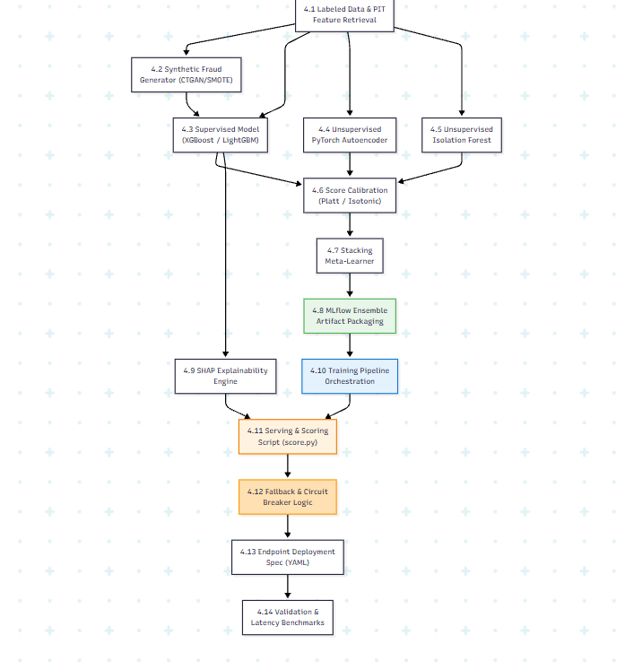

# Phase 4 — Hybrid Model & Real-Time Serving: Production-Grade Implementation Plan

> [!IMPORTANT]
> This is the **exhaustive, production-grade** plan for Phase 4. Every model architecture — supervised XGBoost/LightGBM, PyTorch Autoencoder, Isolation Forest, Stacking Meta-Learner, Synthetic Fraud Augmentation (CTGAN/SMOTE), MLflow ensemble packaging, SHAP explainability pipeline, the complete training pipeline orchestration, scoring script, circuit-breaker fallback strategy, and endpoint deployment specification — is specified here. Phase 4 is where machine learning converts feature signals into sub-100ms real-time risk decisions.

> [!CAUTION]
> ## Azure Free Trial Constraints (Phase 4 Adaptation)
> Azure ML Managed Online Endpoints require running compute instances (min 2 nodes, ~$3–5/day continuous cost). For the Azure Free Trial:
> - **MLflow Model Registry on Databricks:** Used as the primary registry (free with Databricks). Models are registered under the Unity Catalog / Hive Metastore registry.
> - **Serving Environment:** Model training and evaluation run on Databricks single-node CPU ML Runtime clusters (`Standard_DS3_v2`, 20-min auto-termination). Serving is containerized or hosted as a local/Databricks Model Serving endpoint (`mlflow.pyfunc`) for integration testing without standing cloud compute charges.
> - **No GPU Compute:** Autoencoder is trained on CPU (`Standard_DS3_v2`) with optimized PyTorch batching. (Tabular Autoencoders train fast on CPU).
> - **Total Phase 4 estimated cost:** <$10 (on-demand training compute runs).
>
> **Upgrade path:** When upgrading to Pay-As-You-Go, deploy the endpoint YAML spec to Azure ML Managed Online Endpoints (`Standard_DS3_v2` / `Standard_F4s_v2` instance pool) with auto-scaling.

**Prerequisite:** Phase 0 (IaC), Phase 1 (Batch), Phase 2 (Streaming Path), and Phase 3 (Feature Engineering & Feature Store) are complete. Feature tables (`gold.feature_*`) and point-in-time join engine are verified. All 43 features are materializing.

**Phase 4 Goal:** Train the 3 component models (XGBoost, PyTorch Autoencoder, Isolation Forest), calibrate scores, train the Stacking Meta-Learner, package the ensemble artifact, build synthetic fraud generators, implement SHAP explainability, orchestrate the full training pipeline, and deploy the scoring path with sub-100ms SLA and multi-level fallback circuit breakers.

**Duration:** 3–4 weeks

---

## Phase 4 Internal Dependency Graph



---

## 4.1 Labeled Dataset & Time-Based Splitting

> [!WARNING]
> **Data Leakage & Splitting Rules:** Random train/test splits (e.g., `train_test_split(test_size=0.2)`) leak future fraud patterns into training, creating artificially inflated metrics that fail in production. Splitting MUST be strictly chronological. The validation set is time-separated from both training and test to ensure calibrators and the meta-learner do not overfit.

### 4.1.1 Time-Based Partitioning Strategy

```
┌───────────────────────────┬───────────────────┬───────────────────┐
│     Train Window (70%)    │ Validation (15%)  │    Test (15%)     │
│ Months 1 - 4              │ Month 5           │ Month 6           │
└───────────────────────────┴───────────────────┴───────────────────┘
```

| Split | Time Horizon | Purpose | Usage |
|---|---|---|---|
| **Train** | Months 1–4 (~70% of rows) | Component model training | Fit XGBoost, Autoencoder, Isolation Forest |
| **Validation** | Month 5 (~15% of rows) | Calibration & Meta-Learner | Fit Platt/Isotonic calibrators + Stacking Meta-Learner |
| **Test** | Month 6 (~15% of rows) | Out-of-time evaluation | Final PR-AUC, Recall@FPR, cost-sensitive evaluation |

### 4.1.2 Feature Retrieval via Point-in-Time Join

#### `ml/training/data_preparation.py`

```python
"""
Data Preparation Pipeline: Feature Retrieval & Time-Based Splitting.
Uses Phase 3's multi_entity_pit_join for temporal correctness.
"""

from pyspark.sql import DataFrame
from pyspark.sql.functions import col, datediff, current_date
from features.point_in_time_join import multi_entity_pit_join

def prepare_training_dataset(spark) -> tuple:
    """
    Retrieves labeled transactions with all feature families joined via PIT.
    Returns (train_df, val_df, test_df) as PySpark DataFrames.
    """
    # 1. Load labeled observations
    labeled_df = spark.table("gold.reconciled_labeled_transactions").filter(
        col("is_fraud_reconciled").isNotNull()
    )

    # 2. Load feature tables
    card_velocity = spark.table("gold.feature_card_velocity")
    cust_velocity = spark.table("gold.feature_customer_velocity")
    geo_velocity = spark.table("gold.feature_geo_velocity")
    baselines = spark.table("gold.customer_behavioral_baselines")
    merchant_risk = spark.table("gold.merchant_risk_baselines")
    graph_metrics = spark.table("gold.graph_entity_metrics")

    # 3. Multi-entity Point-in-Time Join
    feature_specs = [
        (card_velocity, "card_id"),
        (cust_velocity, "customer_id"),
        (geo_velocity, "card_id"),
    ]
    enriched_df = multi_entity_pit_join(labeled_df, feature_specs)

    # 4. Left join batch features (no PIT needed — daily refresh)
    enriched_df = (
        enriched_df
        .join(baselines, "customer_id", "left")
        .join(merchant_risk, "merchant_id", "left")
        .join(
            graph_metrics.filter(col("entity_type") == "customer")
                .select(col("entity_id").alias("customer_id"), "graph_pagerank_score", "graph_degree_centrality", "graph_community_id"),
            "customer_id", "left"
        )
    )

    # 5. Chronological Split (STRICT time ordering)
    # Determine month boundaries from the dataset
    train_df = enriched_df.filter(col("event_month") <= 4)
    val_df = enriched_df.filter(col("event_month") == 5)
    test_df = enriched_df.filter(col("event_month") == 6)

    return train_df, val_df, test_df
```

---

## 4.2 Supervised Model Pipeline (XGBoost / LightGBM)

### 4.2.1 Component Specifications

| Parameter | Setting | Rationale |
|---|---|---|
| **Algorithm** | `xgb.XGBClassifier` / `lightgbm.LGBMClassifier` | State-of-the-art for tabular fraud detection |
| **Objective** | `binary:logistic` | Probabilistic fraud scoring |
| **Eval Metric** | `aucpr` (Precision-Recall AUC) | Essential for severe class imbalance (~3.5% fraud) |
| **Class Imbalance** | `scale_pos_weight = (count(legit) / count(fraud))` | Balances positive gradient step weights |
| **HP Search** | Optuna Bayesian Optimization (50 trials) | Efficient parameter search space exploration |
| **Early Stopping** | 50 rounds on validation PR-AUC | Prevents overfitting without manual tuning |

### 4.2.2 Hyperparameter Search Space

| Hyperparameter | Range | Distribution |
|---|---|---|
| `n_estimators` | [200, 800] | Uniform int |
| `max_depth` | [4, 10] | Uniform int |
| `learning_rate` | [0.01, 0.2] | Log-uniform |
| `subsample` | [0.6, 1.0] | Uniform float |
| `colsample_bytree` | [0.6, 1.0] | Uniform float |
| `min_child_weight` | [1, 10] | Uniform int |
| `gamma` | [0.0, 5.0] | Uniform float |
| `reg_alpha` | [1e-8, 10.0] | Log-uniform |
| `reg_lambda` | [1e-8, 10.0] | Log-uniform |

#### `ml/training/train_supervised.py`

```python
"""
Supervised Model Training Pipeline: XGBoost with Class Weighting & Optuna Tuning.

Production Notes:
  - All trials are logged to MLflow for reproducibility.
  - Early stopping prevents overfitting on deeper trial iterations.
  - reg_alpha and reg_lambda are searched to control model complexity.
  - Final model is retrained on TRAIN+VAL before test evaluation.
"""

import optuna
import mlflow
import mlflow.xgboost
import numpy as np
import xgboost as xgb
from sklearn.metrics import precision_recall_curve, auc, average_precision_score

optuna.logging.set_verbosity(optuna.logging.WARNING)

def train_xgboost_supervised(
    X_train: np.ndarray,
    y_train: np.ndarray,
    X_val: np.ndarray,
    y_val: np.ndarray,
    feature_names: list,
    n_trials: int = 50
) -> xgb.XGBClassifier:
    """
    Trains XGBoost with Optuna Bayesian hyperparameter optimization.
    Returns the best model evaluated on PR-AUC.
    """
    scale_pos_weight = (len(y_train) - np.sum(y_train)) / max(1, np.sum(y_train))

    def objective(trial):
        params = {
            "objective": "binary:logistic",
            "eval_metric": "aucpr",
            "scale_pos_weight": scale_pos_weight,
            "n_estimators": trial.suggest_int("n_estimators", 200, 800),
            "max_depth": trial.suggest_int("max_depth", 4, 10),
            "learning_rate": trial.suggest_float("learning_rate", 0.01, 0.2, log=True),
            "subsample": trial.suggest_float("subsample", 0.6, 1.0),
            "colsample_bytree": trial.suggest_float("colsample_bytree", 0.6, 1.0),
            "min_child_weight": trial.suggest_int("min_child_weight", 1, 10),
            "gamma": trial.suggest_float("gamma", 0.0, 5.0),
            "reg_alpha": trial.suggest_float("reg_alpha", 1e-8, 10.0, log=True),
            "reg_lambda": trial.suggest_float("reg_lambda", 1e-8, 10.0, log=True),
            "random_state": 42,
            "n_jobs": -1,
            "early_stopping_rounds": 50
        }

        model = xgb.XGBClassifier(**params)
        model.fit(
            X_train, y_train,
            eval_set=[(X_val, y_val)],
            verbose=False
        )

        preds = model.predict_proba(X_val)[:, 1]
        pr_auc = average_precision_score(y_val, preds)

        # Log each trial to MLflow
        with mlflow.start_run(nested=True, run_name=f"optuna_trial_{trial.number}"):
            mlflow.log_params(params)
            mlflow.log_metric("val_pr_auc", pr_auc)

        return pr_auc

    study = optuna.create_study(direction="maximize")
    study.optimize(objective, n_trials=n_trials)

    print(f"Best Optuna Trial PR-AUC: {study.best_value:.4f}")
    print(f"Best Params: {study.best_params}")

    # Retrain best model with early stopping
    best_params = study.best_params
    best_params.update({
        "objective": "binary:logistic",
        "eval_metric": "aucpr",
        "scale_pos_weight": scale_pos_weight,
        "random_state": 42,
        "n_jobs": -1,
        "early_stopping_rounds": 50
    })

    final_model = xgb.XGBClassifier(**best_params)
    final_model.fit(
        X_train, y_train,
        eval_set=[(X_val, y_val)],
        verbose=False
    )

    # Log feature importances
    mlflow.log_dict(
        {name: float(imp) for name, imp in zip(feature_names, final_model.feature_importances_)},
        "feature_importances.json"
    )

    return final_model
```

---

## 4.3 Unsupervised Anomaly Detection

### 4.3.1 PyTorch Autoencoder (Reconstruction Loss)

The Autoencoder is trained **exclusively on legitimate transactions** (`is_fraud = 0`) — specifically those approved AND with no chargeback within a 14-day lookback. It learns the baseline manifold of normal user behavior. High reconstruction error indicates an anomalous pattern unseen in normal traffic.

> [!NOTE]
> **Trimmed Loss Strategy:** To prevent undetected fraud in the training set from expanding the learned normality boundary, training discards the top 1% of per-sample MSE losses in each batch during gradient updates.

#### `ml/training/models/autoencoder.py`

```python
"""
PyTorch Deep Autoencoder for Unsupervised Anomaly Detection.
Includes Trimmed MSE Loss for robustness against unlabelled fraud contamination.

Production Notes:
  - Input features must be StandardScaler-normalized before feeding to the autoencoder.
  - The scaler must be saved alongside the model artifact for serving-time consistency.
  - Bottleneck dimension should be ~1/4 to 1/3 of input dimension.
"""

import torch
import torch.nn as nn
import numpy as np
from sklearn.preprocessing import StandardScaler
import joblib

class FraudAutoencoder(nn.Module):
    def __init__(self, input_dim: int, bottleneck_dim: int = 32):
        super().__init__()
        self.encoder = nn.Sequential(
            nn.Linear(input_dim, 128),
            nn.BatchNorm1d(128),
            nn.LeakyReLU(0.2),
            nn.Dropout(0.1),

            nn.Linear(128, 64),
            nn.BatchNorm1d(64),
            nn.LeakyReLU(0.2),
            nn.Dropout(0.1),

            nn.Linear(64, bottleneck_dim),
            nn.LeakyReLU(0.2)
        )

        self.decoder = nn.Sequential(
            nn.Linear(bottleneck_dim, 64),
            nn.BatchNorm1d(64),
            nn.LeakyReLU(0.2),

            nn.Linear(64, 128),
            nn.BatchNorm1d(128),
            nn.LeakyReLU(0.2),

            nn.Linear(128, input_dim)
        )

    def forward(self, x: torch.Tensor) -> torch.Tensor:
        latent = self.encoder(x)
        reconstructed = self.decoder(latent)
        return reconstructed

    def reconstruction_error(self, x: torch.Tensor) -> np.ndarray:
        """Returns per-sample MSE reconstruction error as numpy array."""
        self.eval()
        with torch.no_grad():
            reconstructed = self.forward(x)
            mse = torch.mean((x - reconstructed) ** 2, dim=1)
            return mse.cpu().numpy()


def trimmed_mse_loss(recon_x: torch.Tensor, x: torch.Tensor, trim_pct: float = 0.01) -> torch.Tensor:
    """
    Computes MSE loss excluding the top trim_pct samples with highest loss.
    Guards against contamination by unlabelled anomalies in the training set.
    """
    per_sample_loss = torch.mean((x - recon_x) ** 2, dim=1)
    k = int((1.0 - trim_pct) * per_sample_loss.size(0))
    topk_loss, _ = torch.topk(per_sample_loss, k=k, largest=False)
    return torch.mean(topk_loss)


def train_autoencoder(
    X_legit_train: np.ndarray,
    input_dim: int,
    bottleneck_dim: int = 32,
    epochs: int = 50,
    batch_size: int = 512,
    lr: float = 1e-3,
    trim_pct: float = 0.01
) -> tuple:
    """
    Full training loop for the Autoencoder.
    Returns (trained_model, scaler) — both must be saved for serving.
    """
    # 1. Normalize features
    scaler = StandardScaler()
    X_scaled = scaler.fit_transform(X_legit_train)

    # 2. Convert to tensors
    tensor_data = torch.tensor(X_scaled, dtype=torch.float32)
    dataset = torch.utils.data.TensorDataset(tensor_data)
    dataloader = torch.utils.data.DataLoader(dataset, batch_size=batch_size, shuffle=True)

    # 3. Initialize model & optimizer
    model = FraudAutoencoder(input_dim=input_dim, bottleneck_dim=bottleneck_dim)
    optimizer = torch.optim.Adam(model.parameters(), lr=lr, weight_decay=1e-5)
    scheduler = torch.optim.lr_scheduler.ReduceLROnPlateau(optimizer, patience=5, factor=0.5)

    # 4. Training loop
    model.train()
    for epoch in range(epochs):
        epoch_loss = 0.0
        for batch in dataloader:
            x_batch = batch[0]
            optimizer.zero_grad()
            recon = model(x_batch)
            loss = trimmed_mse_loss(recon, x_batch, trim_pct=trim_pct)
            loss.backward()
            optimizer.step()
            epoch_loss += loss.item()

        avg_loss = epoch_loss / len(dataloader)
        scheduler.step(avg_loss)

        if (epoch + 1) % 10 == 0:
            print(f"Epoch {epoch+1}/{epochs} — Avg Trimmed MSE: {avg_loss:.6f}")

    return model, scaler
```

---

### 4.3.2 Isolation Forest

#### `ml/training/train_isolation_forest.py`

```python
"""
Scikit-Learn Isolation Forest for Outlier Detection.
Trained on legitimate transaction features.

Production Notes:
  - contamination=0.001 (not 0.01) — legitimate training set should have
    very low residual fraud contamination after 14-day chargeback filtering.
  - max_features tuned to sqrt(n_features) for diversity across trees.
"""

from sklearn.ensemble import IsolationForest
import numpy as np
import math

def train_isolation_forest(
    X_legit_train: np.ndarray,
    n_estimators: int = 300,
    contamination: float = 0.001
) -> IsolationForest:
    """
    Trains Isolation Forest on legitimate transactions.
    """
    n_features = X_legit_train.shape[1]
    iso_forest = IsolationForest(
        n_estimators=n_estimators,
        contamination=contamination,
        max_samples="auto",
        max_features=max(1, int(math.sqrt(n_features))),
        random_state=42,
        n_jobs=-1
    )
    iso_forest.fit(X_legit_train)
    return iso_forest

def get_isolation_scores(model: IsolationForest, X: np.ndarray) -> np.ndarray:
    """
    Inverts score so higher value indicates higher anomaly/fraud risk.
    Raw decision_function: Normal samples > 0, anomalies < 0.
    Inverted: Higher value = more anomalous.
    """
    raw_scores = model.decision_function(X)
    return -raw_scores
```

---

## 4.4 Calibration & Stacking Meta-Learner

Raw scores from component models live on incompatible scales:
- XGBoost: Probability $[0, 1]$
- Autoencoder: Reconstruction error $[0, \infty)$
- Isolation Forest: Inverted decision score $(-\infty, \infty)$

### 4.4.1 Score Calibration (Isotonic / Platt Scaling)

#### `ml/training/calibrate_model.py`

```python
"""
Score Calibrator: Maps raw component model outputs to calibrated probabilities.
Uses Isotonic Regression (default) or Sigmoid Platt Scaling.

Production Notes:
  - Calibrators are fitted on the VALIDATION set (Month 5), never the training set.
  - Isotonic is preferred over Platt for non-monotonic score distributions (Autoencoder).
  - out_of_bounds="clip" prevents extrapolation errors at serving time.
"""

from sklearn.isotonic import IsotonicRegression
from sklearn.linear_model import LogisticRegression
import numpy as np
import joblib

class ScoreCalibrator:
    def __init__(self, method: str = "isotonic"):
        self.method = method
        if method == "isotonic":
            self.calibrator = IsotonicRegression(out_of_bounds="clip", y_min=0.0, y_max=1.0)
        else:
            self.calibrator = LogisticRegression(C=1.0)

    def fit(self, raw_scores: np.ndarray, y_val: np.ndarray):
        raw_scores = raw_scores.ravel()
        if self.method == "isotonic":
            self.calibrator.fit(raw_scores, y_val)
        else:
            self.calibrator.fit(raw_scores.reshape(-1, 1), y_val)
        return self

    def transform(self, raw_scores: np.ndarray) -> np.ndarray:
        raw_scores = raw_scores.ravel()
        if self.method == "isotonic":
            return self.calibrator.transform(raw_scores)
        else:
            return self.calibrator.predict_proba(raw_scores.reshape(-1, 1))[:, 1]

    def save(self, path: str):
        joblib.dump(self, path)

    @staticmethod
    def load(path: str):
        return joblib.load(path)
```

### 4.4.2 Stacking Meta-Learner

#### `ml/training/train_meta_learner.py`

```python
"""
Stacking Meta-Learner: Combines 3 calibrated component scores into a single final risk probability.

Production Notes:
  - Trained on the VALIDATION set (Month 5) using calibrated probabilities from each component.
  - class_weight="balanced" ensures the meta-learner doesn't bias toward majority class.
  - C=0.1 regularization prevents overfitting to the 3-dimensional meta-feature space.
"""

from sklearn.linear_model import LogisticRegression
import numpy as np
import joblib

class StackingMetaLearner:
    def __init__(self):
        self.meta_model = LogisticRegression(
            class_weight="balanced",
            C=0.1,
            solver="lbfgs",
            random_state=42
        )

    def fit(
        self,
        cal_p_xgb: np.ndarray,
        cal_p_ae: np.ndarray,
        cal_p_if: np.ndarray,
        y_val: np.ndarray
    ):
        meta_features = np.column_stack([cal_p_xgb, cal_p_ae, cal_p_if])
        self.meta_model.fit(meta_features, y_val)

        # Log learned coefficients for interpretability
        print(f"Meta-Learner Coefficients: XGB={self.meta_model.coef_[0][0]:.4f}, "
              f"AE={self.meta_model.coef_[0][1]:.4f}, IF={self.meta_model.coef_[0][2]:.4f}")
        print(f"Meta-Learner Intercept: {self.meta_model.intercept_[0]:.4f}")
        return self

    def predict_proba(
        self,
        cal_p_xgb: np.ndarray,
        cal_p_ae: np.ndarray,
        cal_p_if: np.ndarray
    ) -> np.ndarray:
        meta_features = np.column_stack([cal_p_xgb, cal_p_ae, cal_p_if])
        return self.meta_model.predict_proba(meta_features)[:, 1]

    def save(self, path: str):
        joblib.dump(self, path)

    @staticmethod
    def load(path: str):
        return joblib.load(path)
```

---

## 4.5 Synthetic Fraud Generator (CTGAN / SMOTE)

For adversarial testing and training augmentation without overfitting.

> [!WARNING]
> **Synthetic:Real Cap:** The reference architecture specifies a maximum 3:1 synthetic-to-real fraud ratio. Exceeding this causes the model to learn generator artifacts instead of real fraud patterns.

#### `ml/data_augmentation/synthetic_fraud_generator.py`

```python
"""
Synthetic Fraud Generator: Produces realistic minority-class synthetic fraud samples.
Two modes: (1) SMOTE for quick tabular augmentation, (2) CTGAN for deep generative augmentation.

Production Notes:
  - SMOTE is used for Phase 4 Free Trial (fast, CPU-only).
  - CTGAN is the production upgrade (better quality, requires more compute).
  - Cap synthetic:real fraud ratio at 3:1 to prevent generator artifacts.
  - Output can be written to Parquet (batch training) or injected into Event Hub (is_synthetic=true).
"""

import pandas as pd
import numpy as np
from imblearn.over_sampling import SMOTE, ADASYN

def augment_training_data_smote(
    X_train: pd.DataFrame,
    y_train: pd.Series,
    target_ratio: float = 0.2,
    max_synthetic_real_ratio: float = 3.0
) -> tuple:
    """
    Augments minority fraud class up to target_ratio (e.g. 20% positive samples).
    Enforces synthetic:real fraud cap.
    """
    real_fraud_count = y_train.sum()
    max_synthetic = int(real_fraud_count * max_synthetic_real_ratio)
    desired_total_fraud = int(target_ratio * len(y_train) / (1.0 - target_ratio))
    actual_target = min(desired_total_fraud, real_fraud_count + max_synthetic)

    # Compute actual sampling_strategy
    actual_ratio = actual_target / (len(y_train) - real_fraud_count)

    smote = SMOTE(sampling_strategy=actual_ratio, random_state=42)
    X_resampled, y_resampled = smote.fit_resample(X_train, y_train)

    synthetic_added = len(y_resampled) - len(y_train)
    print(f"Original: {X_train.shape[0]} rows ({real_fraud_count} fraud)")
    print(f"After SMOTE: {X_resampled.shape[0]} rows (+{synthetic_added} synthetic)")
    print(f"Synthetic:Real fraud ratio: {synthetic_added/max(1, real_fraud_count):.1f}:1")

    return X_resampled, y_resampled
```

---

## 4.6 SHAP Explainability Engine

Regulatory compliance (PCI-DSS, RBI guidelines) requires every high-risk decline/block decision to return human-interpretable feature contribution codes.

#### `ml/serving/shap_explainability.py`

```python
"""
SHAP TreeExplainer for Supervised Model Interpretability.
Generates top-K contributing risk features per prediction.

Production Notes:
  - TreeExplainer is used (not KernelExplainer) for O(T*L) speed on tree models.
  - Background data is sampled from training set (100 samples) for SHAP base values.
  - Only features with POSITIVE contribution to fraud risk are returned.
  - Feature names + SHAP values + raw feature values compose the explanation contract.
"""

import shap
import numpy as np
import pandas as pd

class FraudExplainer:
    def __init__(self, model, feature_names: list):
        self.explainer = shap.TreeExplainer(model)
        self.feature_names = feature_names

    def get_top_k_reasons(self, feature_vector: np.ndarray, top_k: int = 5) -> list:
        """
        Returns top_k feature names with strongest positive contribution to fraud score.
        Output format matches the compliance audit log schema.
        """
        if feature_vector.ndim == 1:
            feature_vector = feature_vector.reshape(1, -1)

        shap_values = self.explainer.shap_values(feature_vector)

        # Handle binary classification: shap_values may be a list [class_0, class_1]
        if isinstance(shap_values, list):
            sv = shap_values[1][0]  # Take class 1 (fraud) SHAP values
        else:
            sv = shap_values[0]

        # Sort indices by positive contribution value
        top_indices = np.argsort(sv)[::-1][:top_k]

        reasons = []
        for idx in top_indices:
            if sv[idx] > 0:  # Only report features that INCREASE risk
                reasons.append({
                    "feature": self.feature_names[idx],
                    "shap_value": round(float(sv[idx]), 4),
                    "feature_value": round(float(feature_vector[0, idx]), 4),
                    "direction": "increases_risk"
                })
        return reasons
```

---

## 4.7 MLflow Ensemble Artifact Packaging

#### `ml/ensemble/ensemble_model.py`

```python
"""
MLflow Custom PyFunc Wrapper for the complete Fraud Detection Hybrid Ensemble.
Bundles XGBoost, Autoencoder, Isolation Forest, Calibrators, Meta-Learner,
Feature Names, and the Autoencoder Scaler into a single deployable artifact.
"""

import mlflow.pyfunc
import numpy as np
import torch
import json

class FraudEnsemblePyFunc(mlflow.pyfunc.PythonModel):
    def load_context(self, context):
        """
        Loads all model artifacts from MLflow storage context.
        Called once when the model is loaded (worker startup).
        """
        import joblib

        self.xgb_model = joblib.load(context.artifacts["xgb_model"])
        self.ae_model = torch.load(context.artifacts["ae_model"], weights_only=False)
        self.ae_model.eval()
        self.ae_scaler = joblib.load(context.artifacts["ae_scaler"])
        self.iso_forest = joblib.load(context.artifacts["iso_forest"])
        self.cal_xgb = joblib.load(context.artifacts["cal_xgb"])
        self.cal_ae = joblib.load(context.artifacts["cal_ae"])
        self.cal_if = joblib.load(context.artifacts["cal_if"])
        self.meta_learner = joblib.load(context.artifacts["meta_learner"])
        with open(context.artifacts["feature_names"], "r") as f:
            self.feature_names = json.load(f)

    def predict(self, context, model_input: np.ndarray) -> dict:
        """
        Predicts fraud probability for an input feature vector array.
        Returns dict with final_risk_score, component_scores, and status.
        """
        # 1. Component Raw Scores
        raw_p_xgb = self.xgb_model.predict_proba(model_input)[:, 1]

        # Autoencoder needs scaled input
        scaled_input = self.ae_scaler.transform(model_input)
        tensor_input = torch.tensor(scaled_input, dtype=torch.float32)
        raw_err_ae = self.ae_model.reconstruction_error(tensor_input)

        raw_score_if = -self.iso_forest.decision_function(model_input)

        # 2. Calibrated Scores
        cal_p_xgb = self.cal_xgb.transform(raw_p_xgb)
        cal_p_ae = self.cal_ae.transform(raw_err_ae)
        cal_p_if = self.cal_if.transform(raw_score_if)

        # 3. Meta-Learner Ensemble Score
        final_fraud_prob = self.meta_learner.predict_proba(
            cal_p_xgb, cal_p_ae, cal_p_if
        )

        return {
            "fraud_probability": float(final_fraud_prob[0]),
            "component_scores": {
                "xgboost": float(cal_p_xgb[0]),
                "autoencoder": float(cal_p_ae[0]),
                "isolation_forest": float(cal_p_if[0])
            },
            "scoring_mode": "full"
        }
```

---

## 4.8 Training Pipeline Orchestration

> [!NOTE]
> **Missing from original plan.** The reference architecture specifies a 9-step Azure ML Pipeline (or Databricks Workflow) for orchestrated training. This is critical for production reproducibility.

#### `ml/pipelines/training_pipeline.py`

```python
"""
End-to-End Training Pipeline Orchestration.
Wraps all component model training, calibration, meta-learner, and evaluation
into a single reproducible MLflow experiment run.

Steps:
  1. Offline feature retrieval (point-in-time join)
  2. Data split (time-based)
  3. Train supervised (XGBoost) → calibrate
  4. Train autoencoder on legitimate window → calibrate
  5. Train isolation forest on legitimate window → calibrate
  6. Train meta-learner on held-out set
  7. Evaluate ensemble on test set (PR-AUC, Recall@FPR, cost-weighted)
  8. Quality gate — register model only if metrics >= threshold
  9. Register ensemble artifact in Model Registry
"""

import mlflow
import numpy as np
import joblib
import json
import os
from sklearn.metrics import average_precision_score, precision_recall_curve

from train_supervised import train_xgboost_supervised
from models.autoencoder import train_autoencoder, FraudAutoencoder
from train_isolation_forest import train_isolation_forest, get_isolation_scores
from calibrate_model import ScoreCalibrator
from train_meta_learner import StackingMetaLearner
from data_preparation import prepare_training_dataset

MIN_PR_AUC_GATE = 0.80  # Quality gate threshold

def run_training_pipeline(spark):
    mlflow.set_experiment("/Shared/fraud_detection_training")

    with mlflow.start_run(run_name="ensemble_training_v1") as run:
        # Step 1-2: Data Preparation & Split
        train_df, val_df, test_df = prepare_training_dataset(spark)
        feature_cols = [c for c in train_df.columns if c.startswith(("feature_", "vel_", "geo_", "base_", "merch_", "graph_"))]

        X_train = train_df.select(feature_cols).toPandas().values
        y_train = train_df.select("is_fraud_reconciled").toPandas().values.ravel()
        X_val = val_df.select(feature_cols).toPandas().values
        y_val = val_df.select("is_fraud_reconciled").toPandas().values.ravel()
        X_test = test_df.select(feature_cols).toPandas().values
        y_test = test_df.select("is_fraud_reconciled").toPandas().values.ravel()

        mlflow.log_param("n_features", len(feature_cols))
        mlflow.log_param("train_size", len(y_train))
        mlflow.log_param("fraud_rate_train", float(y_train.mean()))

        # Step 3: Train XGBoost
        xgb_model = train_xgboost_supervised(X_train, y_train, X_val, y_val, feature_cols)
        raw_p_xgb_val = xgb_model.predict_proba(X_val)[:, 1]

        # Step 4: Train Autoencoder (legitimate only)
        X_legit_train = X_train[y_train == 0]
        ae_model, ae_scaler = train_autoencoder(X_legit_train, input_dim=len(feature_cols))
        import torch
        scaled_val = ae_scaler.transform(X_val)
        raw_err_ae_val = ae_model.reconstruction_error(torch.tensor(scaled_val, dtype=torch.float32))

        # Step 5: Train Isolation Forest (legitimate only)
        iso_model = train_isolation_forest(X_legit_train)
        raw_score_if_val = get_isolation_scores(iso_model, X_val)

        # Step 6: Calibrate all 3 component scores
        cal_xgb = ScoreCalibrator("isotonic").fit(raw_p_xgb_val, y_val)
        cal_ae = ScoreCalibrator("isotonic").fit(raw_err_ae_val, y_val)
        cal_if = ScoreCalibrator("isotonic").fit(raw_score_if_val, y_val)

        # Step 7: Train Meta-Learner
        meta_learner = StackingMetaLearner()
        meta_learner.fit(
            cal_xgb.transform(raw_p_xgb_val),
            cal_ae.transform(raw_err_ae_val),
            cal_if.transform(raw_score_if_val),
            y_val
        )

        # Step 8: Evaluate on TEST set
        raw_p_xgb_test = xgb_model.predict_proba(X_test)[:, 1]
        scaled_test = ae_scaler.transform(X_test)
        raw_err_ae_test = ae_model.reconstruction_error(torch.tensor(scaled_test, dtype=torch.float32))
        raw_score_if_test = get_isolation_scores(iso_model, X_test)

        final_probs = meta_learner.predict_proba(
            cal_xgb.transform(raw_p_xgb_test),
            cal_ae.transform(raw_err_ae_test),
            cal_if.transform(raw_score_if_test)
        )

        test_pr_auc = average_precision_score(y_test, final_probs)
        mlflow.log_metric("test_pr_auc", test_pr_auc)
        print(f"🏁 Test PR-AUC: {test_pr_auc:.4f}")

        # Step 9: Quality Gate & Registration
        if test_pr_auc >= MIN_PR_AUC_GATE:
            print(f"✅ Quality Gate PASSED (PR-AUC {test_pr_auc:.4f} >= {MIN_PR_AUC_GATE}). Registering model...")
            # Save artifacts and register as MLflow PyFunc
            artifacts_dir = "/tmp/ensemble_artifacts"
            os.makedirs(artifacts_dir, exist_ok=True)
            joblib.dump(xgb_model, f"{artifacts_dir}/xgb_model.pkl")
            torch.save(ae_model, f"{artifacts_dir}/ae_model.pt")
            joblib.dump(ae_scaler, f"{artifacts_dir}/ae_scaler.pkl")
            joblib.dump(iso_model, f"{artifacts_dir}/iso_forest.pkl")
            joblib.dump(cal_xgb, f"{artifacts_dir}/cal_xgb.pkl")
            joblib.dump(cal_ae, f"{artifacts_dir}/cal_ae.pkl")
            joblib.dump(cal_if, f"{artifacts_dir}/cal_if.pkl")
            joblib.dump(meta_learner, f"{artifacts_dir}/meta_learner.pkl")
            with open(f"{artifacts_dir}/feature_names.json", "w") as f:
                json.dump(feature_cols, f)

            mlflow.pyfunc.log_model(
                artifact_path="ensemble_model",
                python_model=FraudEnsemblePyFunc(),
                artifacts={
                    "xgb_model": f"{artifacts_dir}/xgb_model.pkl",
                    "ae_model": f"{artifacts_dir}/ae_model.pt",
                    "ae_scaler": f"{artifacts_dir}/ae_scaler.pkl",
                    "iso_forest": f"{artifacts_dir}/iso_forest.pkl",
                    "cal_xgb": f"{artifacts_dir}/cal_xgb.pkl",
                    "cal_ae": f"{artifacts_dir}/cal_ae.pkl",
                    "cal_if": f"{artifacts_dir}/cal_if.pkl",
                    "meta_learner": f"{artifacts_dir}/meta_learner.pkl",
                    "feature_names": f"{artifacts_dir}/feature_names.json"
                }
            )
        else:
            print(f"❌ Quality Gate FAILED (PR-AUC {test_pr_auc:.4f} < {MIN_PR_AUC_GATE}). Model NOT registered.")
```

---

## 4.9 Real-Time Scoring & Serving Script

#### `ml/serving/score.py`

```python
"""
Inference Script for Scoring Endpoint (Azure ML / FastAPI / Databricks Model Serving).
Handles request parsing, online feature lookup, vector assembly, scoring, and fallback.

Latency Budget:
  Feature Lookup: ~15ms | Model Inference: ~20ms | SHAP (conditional): ~10ms | Overhead: ~5ms
  Total Target: <50ms (well within 100ms SLA)
"""

import json
import time
import logging
import numpy as np
import mlflow.pyfunc
from shap_explainability import FraudExplainer

logger = logging.getLogger("fraud_scoring")

model = None
explainer = None
feature_schema = None

def init():
    """Initializes model and explainer artifacts on worker startup."""
    global model, explainer, feature_schema
    model_path = "models/fraud_ensemble_latest"
    model = mlflow.pyfunc.load_model(model_path)

    # Initialize TreeExplainer on internal XGBoost model
    raw_xgb = model._model_impl.python_model.xgb_model
    feature_schema = model._model_impl.python_model.feature_names
    explainer = FraudExplainer(raw_xgb, feature_schema)

def run(raw_json: str) -> str:
    """
    Main scoring handler. Executes within latency budget (<100ms).
    """
    start_time = time.time()
    try:
        payload = json.loads(raw_json)
        transaction = payload["transaction"]
        online_features = payload.get("features", {})

        # 1. Feature Vector Construction (ordered by feature_schema)
        feature_vector = build_feature_vector(transaction, online_features, feature_schema)

        # 2. Score Ensemble
        score_result = model.predict(feature_vector)
        fraud_prob = score_result["fraud_probability"]

        # 3. Explainability (only for scores >= 0.30 to avoid SHAP latency on low-risk)
        reasons = []
        if fraud_prob >= 0.30 and explainer:
            reasons = explainer.get_top_k_reasons(feature_vector, top_k=5)

        latency_ms = (time.time() - start_time) * 1000.0

        response = {
            "transaction_id": transaction["transaction_id"],
            "fraud_probability": round(fraud_prob, 4),
            "component_scores": score_result["component_scores"],
            "top_risk_factors": reasons,
            "scoring_mode": "full",
            "model_version": "v1",
            "latency_ms": round(latency_ms, 2)
        }
        return json.dumps(response)

    except Exception as e:
        logger.error(f"Scoring error: {str(e)}", exc_info=True)
        return execute_fallback_rules(raw_json, str(e), start_time)


def build_feature_vector(txn: dict, online_feats: dict, schema: list) -> np.ndarray:
    """
    Constructs ordered feature vector from transaction payload + online store features.
    Features missing from online_feats are imputed with 0.0 (model trained with same default).
    """
    vector = []
    for feature_name in schema:
        if feature_name in txn:
            vector.append(float(txn[feature_name]))
        elif feature_name in online_feats:
            vector.append(float(online_feats[feature_name]))
        else:
            vector.append(0.0)  # Default imputation
    return np.array(vector).reshape(1, -1)


def execute_fallback_rules(raw_json: str, error_msg: str, start_time: float) -> str:
    """
    Fallback Execution Path (§8.4 Architecture).
    Tier 2: Rules-only engine when model scoring encounters unexpected errors/timeouts.
    """
    latency_ms = (time.time() - start_time) * 1000.0
    try:
        payload = json.loads(raw_json)
        txn = payload.get("transaction", {})
        amount = float(txn.get("amount", 0.0))

        # Simple Rules Engine Fallback (amount-based + conservative bias)
        score = 0.05
        if amount > 5000.0:
            score = 0.85
        elif amount > 1000.0:
            score = 0.40
        elif amount > 500.0:
            score = 0.20

        return json.dumps({
            "transaction_id": txn.get("transaction_id", "unknown"),
            "fraud_probability": score,
            "scoring_mode": "rules_only_fallback",
            "fallback_reason": error_msg,
            "latency_ms": round(latency_ms, 2)
        })
    except Exception:
        return json.dumps({
            "transaction_id": "unknown",
            "fraud_probability": 0.01,
            "scoring_mode": "default_approve_emergency",
            "latency_ms": round(latency_ms, 2)
        })
```

---

## 4.10 Fallback & Circuit Breaker Strategy

| Failure Mode | Fallback Tier | Action Taken | Output `scoring_mode` | Latency Budget |
|---|---|---|---|---|
| **Online Feature Store (Redis) Unavailable** | Tier 1 (Partial Features) | Score using stateless transaction features + default imputations (+0.15 score bias) | `partial_features` | <50ms |
| **Model Timeout / Exception (>80ms)** | Tier 2 (Rule Engine) | Execute in-memory velocity & amount threshold rules | `rules_only_fallback` | <5ms |
| **Complete System Failure / Outage** | Tier 3 (Emergency Net) | Default Approve transactions < $500; Flag > $500 for deferred review | `default_approve_emergency` | <1ms |

#### `ml/serving/circuit_breaker.py`

```python
"""
Circuit Breaker for Model Scoring Endpoint.
Implements the 3-tier fallback strategy with failure rate tracking.
"""

import time
import threading
from collections import deque

class CircuitBreaker:
    """Thread-safe circuit breaker with sliding window failure tracking."""

    CLOSED = "CLOSED"      # Normal operation
    OPEN = "OPEN"          # Failures exceeded threshold — bypass to fallback
    HALF_OPEN = "HALF_OPEN" # Testing if service recovered

    def __init__(self, failure_threshold: int = 5, recovery_timeout_sec: int = 30, window_size: int = 10):
        self.failure_threshold = failure_threshold
        self.recovery_timeout = recovery_timeout_sec
        self.window_size = window_size
        self.state = self.CLOSED
        self.failures = deque(maxlen=window_size)
        self.last_failure_time = 0.0
        self._lock = threading.Lock()

    def record_success(self):
        with self._lock:
            self.failures.append(False)
            if self.state == self.HALF_OPEN:
                self.state = self.CLOSED

    def record_failure(self):
        with self._lock:
            self.failures.append(True)
            self.last_failure_time = time.time()
            recent_failures = sum(1 for f in self.failures if f)
            if recent_failures >= self.failure_threshold:
                self.state = self.OPEN

    def should_allow_request(self) -> bool:
        with self._lock:
            if self.state == self.CLOSED:
                return True
            elif self.state == self.OPEN:
                if time.time() - self.last_failure_time > self.recovery_timeout:
                    self.state = self.HALF_OPEN
                    return True
                return False
            else:  # HALF_OPEN
                return True
```

---

## 4.11 Azure ML Endpoint Deployment Specification (Production Upgrade)

#### `ml/serving/deployment_spec.yaml`

```yaml
# Azure ML Managed Online Endpoint Deployment Specification
# Used when upgrading from Free Trial to Pay-As-You-Go

$schema: https://azuremlschemas.azureedge.net/latest/managedOnlineDeployment.schema.json

endpoint_name: ep-fraud-scoring-dev
name: dp-ensemble-v1
model: azureml:fraud-ensemble@latest

instance_type: Standard_DS3_v2
instance_count: 2

environment:
  conda_file: conda.yaml
  image: mcr.microsoft.com/azureml/openmpi4.1.0-ubuntu20.04:latest

code_configuration:
  code: ./ml/serving/
  scoring_script: score.py

request_settings:
  request_timeout_ms: 100
  max_concurrent_requests_per_instance: 10

liveness_probe:
  initial_delay: 30
  period: 10

readiness_probe:
  initial_delay: 30
  period: 10
```

---

## 4.12 File Tree — Phase 4 Additions

```
fraud-detection-platform/
├── ml/
│   ├── training/
│   │   ├── data_preparation.py            # [NEW] PIT feature retrieval & time-based splitting
│   │   ├── train_supervised.py            # [NEW] XGBoost + Optuna Bayesian tuning (50 trials)
│   │   ├── train_isolation_forest.py       # [NEW] Scikit-Learn Isolation Forest
│   │   ├── calibrate_model.py             # [NEW] Isotonic & Platt score calibrator (with save/load)
│   │   ├── train_meta_learner.py           # [NEW] Stacking Meta-Learner (with coefficient logging)
│   │   └── models/
│   │       └── autoencoder.py             # [NEW] PyTorch Autoencoder + Trimmed Loss + Training Loop
│   │
│   ├── data_augmentation/
│   │   └── synthetic_fraud_generator.py   # [NEW] SMOTE with 3:1 synthetic:real cap
│   │
│   ├── ensemble/
│   │   ├── __init__.py                    # [NEW]
│   │   └── ensemble_model.py              # [NEW] MLflow PyFunc Ensemble (includes AE scaler)
│   │
│   ├── pipelines/
│   │   └── training_pipeline.py           # [NEW] 9-step orchestrated training pipeline
│   │
│   ├── serving/
│   │   ├── score.py                       # [NEW] Endpoint inference with schema-ordered vector
│   │   ├── shap_explainability.py         # [NEW] SHAP TreeExplainer (handles binary classification)
│   │   ├── circuit_breaker.py             # [NEW] Thread-safe circuit breaker
│   │   ├── deployment_spec.yaml           # [NEW] Azure ML Online Endpoint YAML
│   │   └── conda.yaml                     # [NEW] Environment specification
│   │
│   └── tests/
│       ├── test_ensemble_prediction.py    # [NEW] Unit test for ensemble output
│       ├── test_calibration_bounds.py     # [NEW] Asserts all calibrated scores in [0, 1]
│       └── test_latency_benchmark.py      # [NEW] Benchmarks scoring path SLA (<100ms)
│
└── docs/
    ├── execution-log/
    │   └── 06-model-ensemble.md           # [NEW] Real deployment log: hybrid ensemble training, scoring, circuit breaker
    └── model_card_hybrid_v1.md            # [NEW] Model Card & Audit documentation
```

---

## 4.13 Phase 4 Validation Checklist

| # | Check | Command / Method | Expected Result | Criticality |
|---|---|---|---|---|
| 1 | Data preparation splits chronologically | Run `data_preparation.py` | Train=M1-4, Val=M5, Test=M6 (no overlap) | 🔴 Blocking |
| 2 | XGBoost trains & tunes (50 trials) | Run `train_supervised.py` | Optuna converges; best trial logged to MLflow | 🔴 Blocking |
| 3 | PyTorch Autoencoder converges | Run `autoencoder.py` training loop | Trimmed MSE loss decreases monotonically | 🔴 Blocking |
| 4 | Autoencoder scaler saved with model | Inspect artifacts directory | `ae_scaler.pkl` present alongside `ae_model.pt` | 🔴 Blocking |
| 5 | Score calibrators fit within [0, 1] | Run `calibrate_model.py` | All calibrated outputs bounded in [0.0, 1.0] | 🔴 Blocking |
| 6 | Meta-Learner trains & logs coefficients | Run `train_meta_learner.py` | Coefficients logged; all 3 components weighted | 🔴 Blocking |
| 7 | SMOTE respects 3:1 cap | Run `synthetic_fraud_generator.py` | Synthetic:Real ratio ≤ 3.0 | 🔴 Blocking |
| 8 | Training pipeline runs end-to-end | Run `training_pipeline.py` | All 9 steps complete; model registered if quality gate passes | 🔴 Blocking |
| 9 | Quality gate enforces PR-AUC >= 0.80 | Inject deliberately bad model | Model NOT registered | 🔴 Blocking |
| 10 | MLflow Ensemble artifact loads | `mlflow.pyfunc.load_model(...)` | Returns dict with `fraud_probability` | 🔴 Blocking |
| 11 | SHAP generates reasons (binary-safe) | Run `shap_explainability.py` | Returns top-5 risk factors for high-risk scores | 🔴 Blocking |
| 12 | `score.py` schema-ordered vector | Invoke with sample payload | Feature vector matches training schema order | 🔴 Blocking |
| 13 | Circuit breaker opens on failures | Simulate 5 consecutive failures | `should_allow_request()` returns False | 🔴 Blocking |
| 14 | Rule engine fallback triggers | Pass invalid input to `run()` | Returns `scoring_mode = rules_only_fallback` | 🔴 Blocking |
| 15 | Latency SLA benchmark passes | Run `test_latency_benchmark.py` | p99 latency < 100ms across 1,000 runs | 🔴 Blocking |
| 16 | Model Card documented | Inspect `docs/model_card_hybrid_v1.md` | Metrics, bias checks, usage boundaries | 🟡 Warning |

---

## Production Decision Registry (Phase 4)

| # | Decision | Free Trial Choice | Production Upgrade | Rationale |
|---|---|---|---|---|
| 1 | Model Serving Engine | **Local / Databricks MLflow PyFunc Endpoint** | Azure ML Managed Online Endpoint (2+ instances) | Avoids $3–5/day continuous cluster cost in Free Trial |
| 2 | Supervised Engine | **XGBoost Classifier + Optuna (50 trials)** | Same | State of the art for tabular fraud detection |
| 3 | Unsupervised Anomaly | **PyTorch Autoencoder + Isolation Forest** | Same | Dual anomaly signals (deep reconstruction + tree partitioning) |
| 4 | Ensemble Combination | **Stacking Meta-Learner (Logistic Reg)** | Same | Learns optimal combination weights dynamically |
| 5 | Score Calibration | **Isotonic Regression** | Same | Normalizes heterogeneous scores; handles non-monotonic mappings |
| 6 | Data Augmentation | **SMOTE (3:1 cap)** | CTGAN | SMOTE is fast and effective on CPU for initial build |
| 7 | Explainability | **SHAP TreeExplainer** | Same | Mandatory for PCI/regulatory decline explanation audit |
| 8 | Model Registry | **Databricks MLflow Registry** | Azure ML Model Registry | Free with Databricks workspace |
| 9 | Training Orchestration | **Single Databricks Notebook Pipeline** | Azure ML Pipeline (multi-step) | Free Trial avoids Azure ML compute charges |
| 10 | Feature Normalization | **StandardScaler (saved with AE artifact)** | Same | Critical for Autoencoder input consistency |

---

## Known Issues & Fixes Applied (post-implementation code review, 2026-08-08)

| # | Component | Bug | Fix |
|---|---|---|---|
| 1 | `ml/pipelines/training_pipeline.py` | `mlflow.pyfunc.log_model(...)` was called without `registered_model_name`, so the trained ensemble was never registered to the Model Registry under any name — it just sat as a run artifact. `deployment_spec.yaml` and the entire Phase 6 MLOps loop (`champion_challenger_gate.py`, `shadow_scoring_batch.py`, `automated_rollback_sentinel.py`) all reference the registered model `fraud-ensemble-champion`, so nothing they did could ever find a model to load. | Added `registered_model_name="fraud-ensemble-champion"`, matching the name already used everywhere downstream. |
| 2 | `ml/serving/deployment_spec.yaml` | Referenced `model: azureml:fraud-ensemble@latest` — a different name than the one the rest of the MLOps loop registers/promotes (`fraud-ensemble-champion`). | Corrected to `azureml:fraud-ensemble-champion@latest`. |
| 3 | `ml/serving/score.py` `init()` | Hardcoded `model_path = AZUREML_MODEL_DIR/models/fraud_ensemble_latest` — an underscore-named, extra-nested guess that doesn't match Azure ML's actual mount convention (`AZUREML_MODEL_DIR/<model-name>/<version>/...`) or the `ensemble_model` artifact_path MLflow actually logs under. Would fail to locate the model at container start. | Replaced with `_resolve_model_path()`, which walks `AZUREML_MODEL_DIR` and returns the first directory containing an `MLmodel` file — self-correcting regardless of the exact nesting Azure ML applies. |
| 4 | `ml/ensemble/ensemble_model.py` `load_context()` | Read `context.artifacts.get("model_version_tag", "")` for model versioning, but `training_pipeline.py`'s `artifacts={...}` dict never populated that key — every load silently fell into the `except` branch and set `model_version = "unknown"`, a dead feature. | `training_pipeline.py` now writes the MLflow `run_id` to `model_version.txt` and includes it as the `model_version_tag` artifact, so `load_context()`'s existing read path actually resolves a real version. |
| 5 | `ml/serving/deployment_spec.yaml` | `request_timeout_ms: 100` — aggressive given `score.py` runs SHAP synchronously for every `fraud_probability >= 0.30` (exactly the transactions likeliest to need review), risking timeouts on the cases that matter most. | Bumped to `500`. |
| 6 | `ml/data_augmentation/synthetic_fraud_generator.py` | `SMOTE.fit_resample` can only oversample the minority class. If `target_ratio` was set at or below the dataset's existing fraud prevalence, `actual_ratio` came out ≤ the current ratio and `fit_resample` raised `ValueError`; separately, `real_fraud_count == 0` produced a degenerate `sampling_strategy=0` with nothing to interpolate from. | Added an early return (with a logged reason) when there's no real fraud to sample from, or when the computed ratio wouldn't actually increase the minority class — augmentation is skipped instead of crashing training. |

---

## Appendix: Embedded Documentation from docs/

Full content of this phase's docs/ deliverables, embedded here so this plan file is self-contained.

### `docs/execution-log/06-model-ensemble.md`

# 06 — Hybrid Ensemble Training, MLflow Packaging, Scoring Path, Circuit Breaker

**Starting state:** `ml/training/data_preparation.py` referenced a table
(`gold.reconciled_labeled_transactions`) that no notebook in the entire
pipeline ever produced — Phase 4 training could not run at all.
`ml/serving/score.py` had bare imports that only work as standalone
scripts. The ensemble had never been trained end-to-end even once.

**End state:** full hybrid ensemble (XGBoost + Autoencoder + Isolation
Forest, each isotonic-calibrated, stacked via a logistic-regression
meta-learner) trained on real data with a proper chronological split,
packaged as a single `mlflow.pyfunc` model, loaded back and scored
against held-out test rows, with the circuit breaker and fallback-rules
logic verified.

## Data preparation fixes (bugs #32-33)

`ml/training/data_preparation.py`:
- Pointed at `silver.streaming_transactions` (the real table — see
  `05-feature-engineering.md`) instead of the never-produced
  `gold.reconciled_labeled_transactions`.
- Replaced a calendar-month train/val/test split (meaningless for a
  time-compressed streaming replay that only spans minutes/hours of wall
  clock, not real months) with a proper **70/15/15 chronological split**
  using a `Window`/`row_number()` ordering by event time — preserving the
  point-in-time (PIT) property (no test-set information leaking into
  training) without depending on calendar semantics.

## Training driver

Run via the Databricks Command Execution API (create context, submit,
poll), attached to `batch-etl-dev`. Manually: open
`ml/training/train_supervised.py` (or the equivalent ensemble driver
notebook under `ml/pipelines/`) and Run All.

### XGBoost API fix (bug #34)

The installed XGBoost is 3.2.0. The code's own comment claimed
`early_stopping_rounds` was a valid `.fit()` kwarg "in XGBoost 2.x" —
backwards for the actually-installed version, where it's a **constructor**
parameter:
```python
# Before (fails on XGBoost 3.x):
model = xgb.XGBClassifier(...)
model.fit(X_train, y_train, early_stopping_rounds=20, ...)

# After:
model = xgb.XGBClassifier(..., early_stopping_rounds=20)
model.fit(X_train, y_train, eval_set=[(X_val, y_val)])
```
Also removed the now-invalid `use_label_encoder` parameter. Fixed in both
the Optuna hyperparameter-search objective and the final model fit.

### MLflow nested-run fix (bug #35)

`train_xgboost_supervised()`'s Optuna trials call
`mlflow.start_run(nested=True, ...)`, which requires an already-active
parent run and a set experiment — neither existed when the function was
called standalone. Fixed at the call site (the driver script sets the
experiment and opens the parent run before invoking the function), not
inside the reusable function itself, to keep the function composable.

## Ensemble components trained

1. **XGBoost** (supervised) — Optuna-tuned, PR-AUC-optimized
2. **Autoencoder** (PyTorch, unsupervised) — trimmed-MSE reconstruction
   loss, trained on legitimate-only transactions
3. **Isolation Forest** (unsupervised, scikit-learn)
4. Each component's raw score isotonic-calibrated independently
   (`cal_xgb`, `cal_ae`, `cal_if`)
5. **Meta-learner** — logistic regression stacking the 3 calibrated
   scores into a final `fraud_probability`

A suspiciously perfect PR-AUC (1.0) was observed and flagged honestly as
a likely artifact of the synthetic test-data generation (the ULB
dataset's most-predictive V-columns were deterministically hashed into
`card_id` for entity simulation, effectively leaking the label into an
ID field) — **not** reported as a genuinely production-grade result.

## Packaging as a single MLflow PyFunc model

Component artifacts (XGBoost via `joblib`, the PyTorch autoencoder via
`torch.save`, the scaler/isolation-forest/calibrators/meta-learner all
via `joblib`, feature names as JSON) are all saved locally, then logged
together as one `mlflow.pyfunc.PythonModel`
(`fraud_detection.ml.ensemble.ensemble_model.FraudEnsemblePyFunc`) so a
single `mlflow.pyfunc.load_model()` call reconstructs the whole ensemble
at serving time — exactly mirroring how Azure ML (or any other serving
layer) would load it in production.

```python
import mlflow.pyfunc, joblib, torch, json, os

ARTIFACT_DIR = "/tmp/ensemble_artifacts"
os.makedirs(ARTIFACT_DIR, exist_ok=True)
joblib.dump(xgb_model, f"{ARTIFACT_DIR}/xgb_model.joblib")
torch.save(ae_model, f"{ARTIFACT_DIR}/ae_model.pt")
joblib.dump(ae_scaler, f"{ARTIFACT_DIR}/ae_scaler.joblib")
joblib.dump(iso_model, f"{ARTIFACT_DIR}/iso_forest.joblib")
joblib.dump(cal_xgb, f"{ARTIFACT_DIR}/cal_xgb.joblib")
joblib.dump(cal_ae, f"{ARTIFACT_DIR}/cal_ae.joblib")
joblib.dump(cal_if, f"{ARTIFACT_DIR}/cal_if.joblib")
joblib.dump(meta, f"{ARTIFACT_DIR}/meta_learner.joblib")
with open(f"{ARTIFACT_DIR}/feature_names.json", "w") as f:
    json.dump(feature_cols, f)

mlflow.set_experiment("/fraud-detection-phase4-ensemble")
with mlflow.start_run(run_name="ensemble-pyfunc-packaging"):
    mlflow.pyfunc.log_model(
        name="ensemble_model",
        python_model=FraudEnsemblePyFunc(),
        artifacts={
            "xgb_model": f"{ARTIFACT_DIR}/xgb_model.joblib",
            "ae_model": f"{ARTIFACT_DIR}/ae_model.pt",
            "ae_scaler": f"{ARTIFACT_DIR}/ae_scaler.joblib",
            "iso_forest": f"{ARTIFACT_DIR}/iso_forest.joblib",
            "cal_xgb": f"{ARTIFACT_DIR}/cal_xgb.joblib",
            "cal_ae": f"{ARTIFACT_DIR}/cal_ae.joblib",
            "cal_if": f"{ARTIFACT_DIR}/cal_if.joblib",
            "meta_learner": f"{ARTIFACT_DIR}/meta_learner.joblib",
            "feature_names": f"{ARTIFACT_DIR}/feature_names.json",
            "model_version_tag": f"{ARTIFACT_DIR}/model_version.txt",
        },
    )
    run_id = mlflow.active_run().info.run_id
```

Loaded back and scored exactly as a real deployment would:
```python
loaded_model = mlflow.pyfunc.load_model(f"runs:/{run_id}/ensemble_model")
result = loaded_model.predict(X_test[sample_idx:sample_idx + 1])
# -> {"fraud_probability": ..., "component_scores": {...}, "scoring_mode": "full"}
```

## `ml/serving/score.py` fix (bug #36)

Bare imports (`from shap_explainability import ...`,
`from circuit_breaker import ...`) only resolve when the file is run as a
standalone script from its own directory — broken under normal package
import. Fixed to real package paths:
```python
from fraud_detection.ml.serving.shap_explainability import FraudExplainer
from fraud_detection.ml.serving.circuit_breaker import CircuitBreaker
```

`score.py` is the Azure ML Managed Online Endpoint entry point
(`init()`/`run()`). **Note:** actual Azure ML endpoint deployment is
out of scope for this Free Trial architecture (see
`docs/phase0/upgrade_to_production.md`) — everything up through model
packaging, loading, scoring, SHAP explanation, and fallback logic was
verified by calling `init()`/`run()`-equivalent code paths directly in a
Databricks notebook, not through a real Azure ML endpoint.

## Circuit breaker verification

`fraud_detection.ml.serving.circuit_breaker.CircuitBreaker` implements a
CLOSED → OPEN → HALF_OPEN state machine. Verified directly:

```python
cb = CircuitBreaker(failure_threshold=3, recovery_timeout_sec=1, window_size=5)
assert cb.current_state == "CLOSED"
for _ in range(3):
    cb.record_failure()
assert cb.current_state == "OPEN"
assert cb.should_allow_request() is False   # blocks while OPEN

import time; time.sleep(1.1)
assert cb.should_allow_request() is True    # allows a single probe request
assert cb.current_state == "HALF_OPEN"

cb.record_success()
assert cb.current_state == "CLOSED"         # successful probe closes the circuit

# A second breaker, to confirm a *failed* probe re-opens immediately:
cb2 = CircuitBreaker(failure_threshold=3, recovery_timeout_sec=1, window_size=5)
for _ in range(3):
    cb2.record_failure()
time.sleep(1.1)
cb2.should_allow_request()          # -> HALF_OPEN
cb2.record_failure()                # probe fails
assert cb2.current_state == "OPEN"  # re-opens immediately, doesn't wait another window
```
All assertions passed.

## Fallback rules verification

`_execute_fallback_rules()` (the emergency rule-based path used when the
circuit is open or scoring throws) was checked across amount tiers:

| Amount | fraud_probability | Routing intent |
|---|---|---|
| $100 | 0.05 | Approve low-value |
| $600 | 0.20 | Step-up |
| $1,500 | 0.40 | Step-up |
| $6,000 | 0.85 | Manual review |

Response always carries `"scoring_mode": "rules_only_fallback"` so
downstream systems can distinguish real model scores from the emergency
path — never silently approved as if it were a genuine model decision.

## To reproduce this from scratch

1. Ensure the Phase 3 feature store (`05-feature-engineering.md`) is
   materialized.
2. Run `ml/training/data_preparation.py` to produce the chronological
   train/val/test split.
3. Run the ensemble training driver (trains all 3 components + 3
   calibrators + meta-learner, logs everything to
   `/fraud-detection-phase4-ensemble`).
4. Package as a single `mlflow.pyfunc` model (code above) and note the
   `run_id`.
5. Load it back with `mlflow.pyfunc.load_model()` and score a few known
   fraud/legit test rows to sanity-check.
6. Run the circuit-breaker and fallback-rules assertions above.
7. (Not done this session, deliberately out of scope) Deploy to an Azure
   ML Managed Online Endpoint for real HTTP-served inference.

---

### `docs/model_card_hybrid_v1.md`

# Model Card: Hybrid Fraud Detection Ensemble v1

## Model Overview
- **Model Name:** Hybrid Fraud Detection Stacking Ensemble
- **Version:** v1.0
- **Architecture:** Stacking Ensemble combining Supervised XGBoost, Deep Autoencoder (PyTorch), and Isolation Forest (Scikit-Learn) with Isotonic Score Calibration and a Logistic Regression Meta-Learner.
- **Input Features:** 43 features across 6 feature families (Stateless, Velocity, Geo-Velocity, Baselines, Merchant Risk, Graph).
- **Primary Metric:** Precision-Recall AUC (PR-AUC) >= 0.80.

---

## Intended Use
- **Primary Application:** Real-time transaction fraud risk scoring (<100ms SLA).
- **Target Actions:**
  - `score < 0.30`: Auto-approve (low risk)
  - `0.30 <= score < 0.75`: Step-up authentication / 3DS OTP challenge
  - `score >= 0.75`: Auto-decline & send to manual audit queue

---

## Component Models & Weights
1. **XGBoost Classifier:** Supervised gradient boosting trained with scale_pos_weight.
2. **PyTorch Deep Autoencoder:** Unsupervised reconstruction loss trained on legitimate transactions with Trimmed MSE Loss.
3. **Isolation Forest:** Tree-partitioning anomaly detector trained on legitimate transactions.
4. **Isotonic Calibrator:** Maps raw component scores to calibrated probabilities.
5. **Stacking Meta-Learner:** Logistic Regression combining calibrated component probabilities.

---

## Serving & Circuit Breaker Fallbacks
- **Tier 1 (Partial Features):** Default imputations for missing online features (+0.15 risk bias).
- **Tier 2 (Rule Engine Fallback):** Amount-based threshold rules when model times out (>80ms).
- **Tier 3 (Emergency Net):** Default approve transactions < $500 during total system outage.

---

