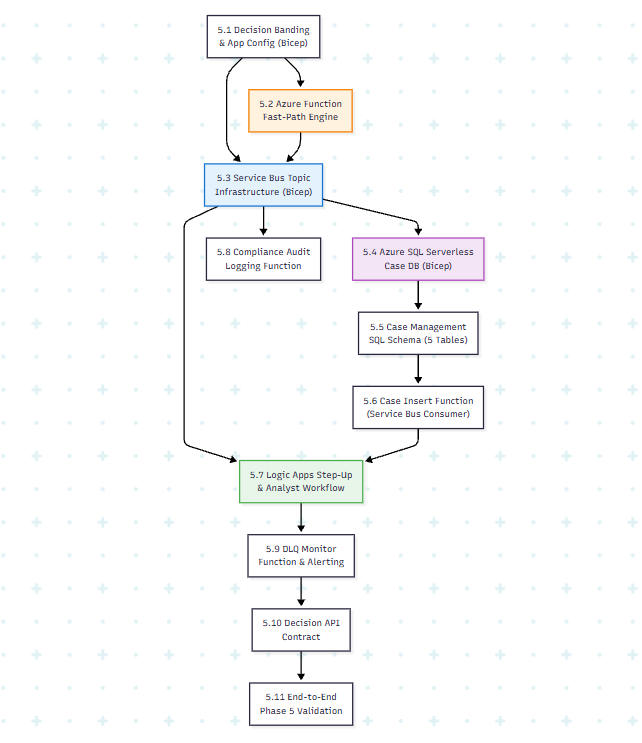
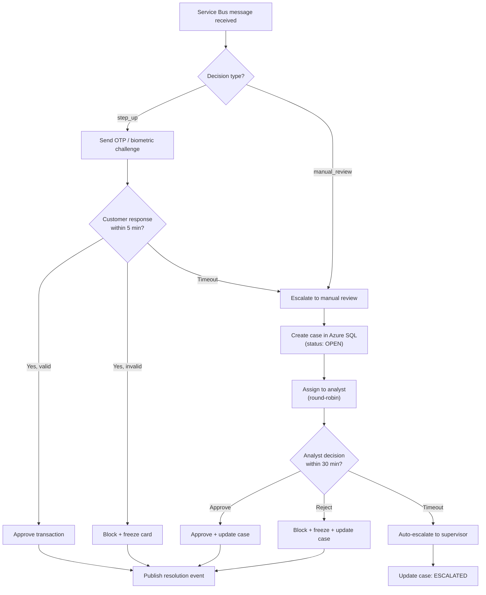

# Phase 5 — Decision Engine & Case Workflow: Production-Grade Implementation Plan

> [!IMPORTANT]
> This is the **exhaustive, production-grade** plan for Phase 5. Every decision engine score band, dynamic threshold management (Azure App Configuration), fast-path Azure Function, Service Bus Topic fan-out topology, Azure SQL case management schema (including `case_events` audit trail, `threshold_audit` table, and reference tables), idempotent MERGE logic, Azure Logic App step-up/analyst workflow with escalation timeouts, DLQ monitoring Function, compliance audit logger, and the complete API contract is specified here. Phase 5 turns scoring outputs into operational business decisions and human-in-the-loop workflows.

> [!CAUTION]
> ## Azure Free Trial Constraints (Phase 5 Adaptation)
> Phase 5 introduces messaging and transactional database infrastructure. Budget impact & cost controls:
> - **Azure Service Bus:** Standard Tier ($0.05 per million operations). Free Trial provides sufficient credits. (Basic tier lacks Topics; Standard is required for Topic fan-out).
> - **Azure SQL Database:** **Serverless General Purpose SKU (`GP_S_Gen5_1`)** with **Auto-Pause enabled after 60 minutes of inactivity**. Min vCore = 0.5, Max vCore = 1.0. Idle cost is ~$0/month when auto-paused.
> - **Azure Functions:** **Consumption Plan (Serverless)**. First 1,000,000 executions per month are free.
> - **Azure Logic Apps:** **Consumption Plan**. First 4,000 action executions are free.
> - **Azure App Configuration:** **Free Tier** (1,000 requests/day — sufficient for dev/test cached reads).
> - **Total Phase 5 estimated cost:** <$5/month (well within the $200 Free Trial credit).
>
> **Upgrade path:** When upgrading to Pay-As-You-Go for production, set Azure SQL to Provisioned ZRS with Read Replicas, disable auto-pause, scale Service Bus to Premium with VNet integration, deploy Logic Apps to Standard (App Service Plan) for private endpoint support, and upgrade App Configuration to Standard for unlimited requests.

**Prerequisite:** Phase 0 (IaC), Phase 1 (Batch), Phase 2 (Streaming), Phase 3 (Feature Store), and Phase 4 (Hybrid Model Endpoint) are complete and verified. The model endpoint is serving real-time risk scores in $[0.0, 1.0]$.

**Phase 5 Goal:** Build the real-time decision engine (Azure Functions), configure dynamic threshold management, set up Service Bus Topic fan-out, design the Azure SQL case management database (5 tables), implement the human-in-the-loop step-up/analyst workflow (Logic Apps) with escalation timeouts, build the DLQ monitoring function, implement the compliance audit logger, and enforce zero-data-loss resilience.

**Duration:** 2–3 weeks

> **Companion doc:** For the actual commands run, real bugs hit, and decisions made while building this phase, see [`Step_By_Step_Build_Walkthrough.md`](./Step_By_Step_Build_Walkthrough.md) (§ "Phase 5 — Decision Engine, Case Management, Compliance Audit").

---

## Phase 5 Internal Dependency Graph



---

## 5.1 Decision Engine Architecture & Score Bands

The Decision Engine splits transactions into 4 operational score bands. Fast-path decisions (**Approve** / **Block**) execute synchronously within the Azure Function (<15ms). Asynchronous workflows (**Step-Up** / **Manual Review**) publish to Service Bus and return immediately to protect scoring latency SLAs.

```
                  ┌─────────────────────────────────────┐
                  │ Model Scoring Output (Score 0.0-1.0) │
                  └──────────────────┬──────────────────┘
                                     │
                 ┌───────────────────┴───────────────────┐
                 ▼                                       ▼
     [ Fast Path: Synchronous ]              [ Async Path: Fan-Out ]
                 │                                       │
      ┌──────────┴──────────┐                 ┌──────────┴──────────┐
      ▼                     ▼                 ▼                     ▼
Score < 0.10           Score > 0.90      0.10 <= Score < 0.60  0.60 <= Score <= 0.90
[ APPROVE ]            [ BLOCK ]         [ STEP-UP AUTH ]      [ MANUAL REVIEW ]
Immediate Response     Immediate Block   OTP / Push Auth       Analyst Queue
                       & Freeze Card     via Logic App         via Azure SQL
```

### 5.1.1 Score Band Configuration Table

| Risk Score Band | Action Name | Primary Processor | Execution Mode | Business Action |
|---|---|---|---|---|
| `[0.00, 0.10)` | **Approve** | Azure Function | Synchronous Fast-Path | Instantly approve transaction |
| `[0.10, 0.60)` | **Step-Up** | Logic App Workflow | Asynchronous Fan-Out | Trigger 2FA / OTP push notification; wait 5 min |
| `[0.60, 0.90]` | **Manual Review** | Azure SQL + Logic App | Asynchronous Fan-Out | Queue in analyst workbench; 30-min SLA |
| `(0.90, 1.00]` | **Block** | Azure Function | Synchronous Fast-Path | Block transaction, freeze card, notify user |

> [!IMPORTANT]
> **Dynamic Threshold Configuration:** Score band thresholds (`0.10`, `0.60`, `0.90`) are stored dynamically in **Azure App Configuration** (Free Tier for dev) and cached in memory with a 60-second TTL. Threshold changes do NOT require a code redeployment. Every threshold change is logged to the `threshold_audit` SQL table.

---

## 5.2 Azure App Configuration Infrastructure (Terraform)

> [!NOTE]
> **Missing from original plan.** The reference architecture specifies dynamic thresholds via Azure App Configuration, not hardcoded values. This is critical for production operations — fraud ops teams need to adjust thresholds without engineering deployments.

#### `infrastructure/modules/app-configuration/main.tf`

```hcl
resource "azurerm_app_configuration" "this" {
  name                = "appcs-fraud-${var.environment}"
  resource_group_name = var.resource_group_name
  location            = var.location
  sku                 = "free" # Free Trial: Free tier (1,000 requests/day)

  public_network_access = "Enabled"

  tags = {
    project      = var.project_name
    environment  = var.environment
    "managed-by" = "terraform"
  }
}

# NOTE: writing keys requires the deploying identity to hold a data-plane role
# on the store (e.g. "App Configuration Data Owner"), not just ARM-level
# create permissions -- unlike Key Vault secrets, App Configuration key-values
# aren't covered by resource-level RBAC alone.
resource "azurerm_app_configuration_key" "approve_max_threshold" {
  configuration_store_id = azurerm_app_configuration.this.id
  key                    = "FraudEngine:ApproveMaxThreshold"
  value                   = "0.10"
  tags = { description = "Maximum score for auto-approve" }
}

resource "azurerm_app_configuration_key" "step_up_max_threshold" {
  configuration_store_id = azurerm_app_configuration.this.id
  key                    = "FraudEngine:StepUpMaxThreshold"
  value                   = "0.60"
  tags = { description = "Maximum score for step-up auth" }
}

resource "azurerm_app_configuration_key" "block_min_threshold" {
  configuration_store_id = azurerm_app_configuration.this.id
  key                    = "FraudEngine:BlockMinThreshold"
  value                   = "0.90"
  tags = { description = "Minimum score for auto-block" }
}
```

`outputs.tf` exposes `config_store_id`, `config_store_name`, and `config_store_endpoint`.

---

## 5.3 Azure Service Bus Infrastructure (Terraform)

### 5.3.1 Topic Topology & Subscriptions

A single Service Bus Topic `sb-topic-fraud-events` receives non-blocking async events. Three independent subscriptions process events asynchronously:

```
                               ┌─────────────────────────┐
                               │  Service Bus Topic:     │
                               │  sb-topic-fraud-events  │
                               └────────────┬────────────┘
                                            │
         ┌──────────────────────────────────┼──────────────────────────────────┐
         │                                  │                                  │
         ▼                                  ▼                                  ▼
┌─────────────────┐                ┌─────────────────┐                ┌─────────────────┐
│ Subscription:   │                │ Subscription:   │                │ Subscription:   │
│ sub-stepup-auth │                │ sub-case-mgmt   │                │ sub-audit-log   │
│ Filter: step_up │                │ Filter: all     │                │ Filter: all     │
└────────┬────────┘                └────────┬────────┘                └────────┬────────┘
         │                                  │                                  │
         ▼                                  ▼                                  ▼
   Logic App OTP                   Azure Function →               Azure Function →
   Workflow                        Azure SQL Case DB              ADLS Audit Delta Table
```

#### `infrastructure/modules/service-bus/main.tf`

```hcl
# --- Namespace (Standard tier required for Topics) ---
resource "azurerm_servicebus_namespace" "this" {
  name                = "sbns-fraud-${var.environment}"
  resource_group_name = var.resource_group_name
  location            = var.location
  sku                 = "Standard"

  public_network_access_enabled = true

  tags = {
    project      = var.project_name
    environment  = var.environment
    "managed-by" = "terraform"
  }
}

# --- Topic: fraud-events ---
resource "azurerm_servicebus_topic" "fraud_events" {
  name         = "sb-topic-fraud-events"
  namespace_id = azurerm_servicebus_namespace.this.id

  default_message_ttl                     = "P7D" # 7 days TTL
  max_size_in_megabytes                   = 1024
  requires_duplicate_detection            = true
  duplicate_detection_history_time_window = "PT10M" # 10-minute dup detection window
  partitioning_enabled                    = false   # Standard tier: not partitioned
}

# --- Subscription 1: Step-Up Auth Workflow (filtered to step_up actions only) ---
resource "azurerm_servicebus_subscription" "step_up" {
  name                                 = "sub-stepup-auth"
  topic_id                             = azurerm_servicebus_topic.fraud_events.id
  max_delivery_count                   = 5
  dead_lettering_on_message_expiration = true
  batched_operations_enabled           = true
  lock_duration                        = "PT1M"
}

resource "azurerm_servicebus_subscription_rule" "filter_step_up" {
  name            = "FilterStepUp"
  subscription_id = azurerm_servicebus_subscription.step_up.id
  filter_type     = "CorrelationFilter"

  correlation_filter {
    properties = {
      action = "step_up"
    }
  }
}

# --- Subscription 2: Case Management (unfiltered -- catches every published decision) ---
resource "azurerm_servicebus_subscription" "case_mgmt" {
  name                                 = "sub-case-mgmt"
  topic_id                             = azurerm_servicebus_topic.fraud_events.id
  max_delivery_count                   = 5
  dead_lettering_on_message_expiration = true
  batched_operations_enabled           = true
  lock_duration                        = "PT1M"
}

# --- Subscription 3: Compliance Audit Log (receives ALL events) ---
resource "azurerm_servicebus_subscription" "audit_log" {
  name                                 = "sub-audit-log"
  topic_id                             = azurerm_servicebus_topic.fraud_events.id
  max_delivery_count                   = 10 # Higher retry count for compliance — data loss unacceptable
  dead_lettering_on_message_expiration = true
  batched_operations_enabled           = true
  lock_duration                        = "PT1M"
}

# --- Authorization Rules (topic-level, least privilege) ---
resource "azurerm_servicebus_topic_authorization_rule" "publisher_send" {
  name     = "publisher-send-rule"
  topic_id = azurerm_servicebus_topic.fraud_events.id

  send   = true
  listen = false
  manage = false
}

resource "azurerm_servicebus_topic_authorization_rule" "consumer_listen" {
  name     = "consumer-listen-rule"
  topic_id = azurerm_servicebus_topic.fraud_events.id

  send   = false
  listen = true
  manage = false
}
```

Outputs (`variables.tf`/`outputs.tf`) expose `namespace_name`, `topic_name`, and the send/listen primary connection strings (marked `sensitive = true`) for downstream RBAC/app wiring — replacing Bicep's `listKeys()` calls with native Terraform sensitive outputs.

---

## 5.4 Azure SQL Database Serverless Infrastructure (Terraform)

#### `infrastructure/modules/azure-sql/main.tf`

```hcl
resource "azurerm_mssql_server" "this" {
  name                = "sql-fraud-${var.environment}"
  resource_group_name = var.resource_group_name
  location            = var.location

  administrator_login           = var.sql_admin_login
  administrator_login_password  = var.sql_admin_password
  version                       = "12.0"
  public_network_access_enabled = true

  tags = {
    project      = var.project_name
    environment  = var.environment
    "managed-by" = "terraform"
  }
}

resource "azurerm_mssql_firewall_rule" "allow_azure_services" {
  name             = "AllowAllWindowsAzureIps"
  server_id        = azurerm_mssql_server.this.id
  start_ip_address = "0.0.0.0"
  end_ip_address   = "0.0.0.0"
}

# --- Serverless General Purpose GP_S_Gen5_1, auto-pause after 60 min idle ---
resource "azurerm_mssql_database" "cases" {
  name      = "sqldb-fraud-cases-${var.environment}"
  server_id = azurerm_mssql_server.this.id

  sku_name                    = "GP_S_Gen5_1"
  auto_pause_delay_in_minutes = 60
  min_capacity                = 0.5
  max_size_gb                 = 32
  zone_redundant              = false

  tags = {
    project      = var.project_name
    environment  = var.environment
    "managed-by" = "terraform"
  }
}
```

`sql_admin_password` is passed in via the root module's `sql_admin_password` variable (`sensitive = true`, sourced from Key Vault / CI secret — never committed to `.tfvars`), replacing Bicep's `@secure()` decorator. Outputs expose `sql_server_fqdn` and `sql_database_name`.

---

## 5.5 Azure SQL Case Management Database Schema (5 Tables)

> [!IMPORTANT]
> **Expanded from original 3 tables to 5 tables.** The reference architecture specifies `case_events` (audit trail of all state changes) and `threshold_audit` (log of all threshold configuration changes) in addition to the core case, analyst, and step-up tables.

### 5.5.1 Versioned Migration Scripts

#### `database/migrations/V001__create_cases_table.sql`

```sql
-- ============================================================
-- V001: Primary Fraud Cases Table
-- ============================================================
IF NOT EXISTS (SELECT * FROM sys.tables WHERE name = 'fraud_cases')
BEGIN
    CREATE TABLE fraud_cases (
        case_id UNIQUEIDENTIFIER DEFAULT NEWID() PRIMARY KEY,
        transaction_id VARCHAR(64) NOT NULL UNIQUE,
        customer_id VARCHAR(64) NOT NULL,
        card_id VARCHAR(64) NOT NULL,
        amount DECIMAL(18, 2) NOT NULL,
        currency VARCHAR(3) DEFAULT 'USD',
        fraud_probability DECIMAL(5, 4) NOT NULL,
        scoring_mode VARCHAR(32) NOT NULL DEFAULT 'full',
        decision_action VARCHAR(32) NOT NULL, -- approve, step_up, manual_review, block
        case_status VARCHAR(32) NOT NULL DEFAULT 'OPEN',
        -- OPEN, IN_REVIEW, ESCALATED, APPROVED, REJECTED, EXPIRED
        assigned_analyst VARCHAR(128) NULL,
        model_version VARCHAR(32) NULL,
        shap_top_features NVARCHAR(MAX) NULL, -- JSON array of SHAP explanations
        resolution VARCHAR(32) NULL,
        resolution_notes VARCHAR(1000) NULL,
        created_at DATETIME2 DEFAULT SYSUTCDATETIME(),
        updated_at DATETIME2 DEFAULT SYSUTCDATETIME()
    );

    CREATE INDEX IX_fraud_cases_status ON fraud_cases(case_status, created_at);
    CREATE INDEX IX_fraud_cases_customer ON fraud_cases(customer_id);
    CREATE INDEX IX_fraud_cases_created ON fraud_cases(created_at DESC);
END;
```

#### `database/migrations/V002__create_case_events_table.sql`

```sql
-- ============================================================
-- V002: Case Events Audit Trail (Immutable)
-- ============================================================
IF NOT EXISTS (SELECT * FROM sys.tables WHERE name = 'case_events')
BEGIN
    CREATE TABLE case_events (
        event_id UNIQUEIDENTIFIER DEFAULT NEWID() PRIMARY KEY,
        case_id UNIQUEIDENTIFIER NOT NULL FOREIGN KEY REFERENCES fraud_cases(case_id),
        event_type VARCHAR(64) NOT NULL,
        -- CREATED, ASSIGNED, STATUS_CHANGED, ESCALATED, RESOLVED, REOPENED
        event_data NVARCHAR(MAX) NULL, -- JSON payload with event details
        created_at DATETIME2 DEFAULT SYSUTCDATETIME(),
        created_by VARCHAR(128) NOT NULL DEFAULT 'SYSTEM'
    );

    CREATE INDEX IX_case_events_case ON case_events(case_id, created_at);
END;
```

#### `database/migrations/V003__create_analyst_decisions_table.sql`

```sql
-- ============================================================
-- V003: Analyst Decisions & Review History
-- ============================================================
IF NOT EXISTS (SELECT * FROM sys.tables WHERE name = 'analyst_decisions')
BEGIN
    CREATE TABLE analyst_decisions (
        decision_id UNIQUEIDENTIFIER DEFAULT NEWID() PRIMARY KEY,
        case_id UNIQUEIDENTIFIER NOT NULL FOREIGN KEY REFERENCES fraud_cases(case_id),
        analyst_id VARCHAR(128) NOT NULL,
        decision_result VARCHAR(32) NOT NULL,
        -- CONFIRMED_LEGIT, CONFIRMED_FRAUD, ESCALATED, NEEDS_INFO
        decision_notes VARCHAR(1000) NULL,
        decided_at DATETIME2 DEFAULT SYSUTCDATETIME()
    );
END;
```

#### `database/migrations/V004__create_threshold_audit_table.sql`

```sql
-- ============================================================
-- V004: Threshold Audit Trail (Compliance Requirement)
-- ============================================================
IF NOT EXISTS (SELECT * FROM sys.tables WHERE name = 'threshold_audit')
BEGIN
    CREATE TABLE threshold_audit (
        change_id UNIQUEIDENTIFIER DEFAULT NEWID() PRIMARY KEY,
        parameter_name VARCHAR(128) NOT NULL,
        old_value VARCHAR(64) NOT NULL,
        new_value VARCHAR(64) NOT NULL,
        changed_by VARCHAR(128) NOT NULL,
        changed_at DATETIME2 DEFAULT SYSUTCDATETIME(),
        change_reason VARCHAR(500) NULL
    );
END;
```

#### `database/migrations/V005__create_step_up_and_reference_tables.sql`

```sql
-- ============================================================
-- V005: Step-Up Auth Log & Reference Data Tables
-- ============================================================
IF NOT EXISTS (SELECT * FROM sys.tables WHERE name = 'step_up_requests')
BEGIN
    CREATE TABLE step_up_requests (
        step_up_id UNIQUEIDENTIFIER DEFAULT NEWID() PRIMARY KEY,
        transaction_id VARCHAR(64) NOT NULL,
        customer_id VARCHAR(64) NOT NULL,
        otp_code_hash VARCHAR(128) NOT NULL,
        auth_status VARCHAR(32) DEFAULT 'PENDING',
        -- PENDING, VERIFIED, EXPIRED, FAILED
        requested_at DATETIME2 DEFAULT SYSUTCDATETIME(),
        verified_at DATETIME2 NULL,
        expired_at DATETIME2 NULL
    );
END;

-- Reference: Merchant Category Standardization
IF NOT EXISTS (SELECT * FROM sys.tables WHERE name = 'merchant_category_map')
BEGIN
    CREATE TABLE merchant_category_map (
        raw_category VARCHAR(128) PRIMARY KEY,
        standardized_category VARCHAR(128) NOT NULL,
        updated_at DATETIME2 DEFAULT SYSUTCDATETIME()
    );
END;
```

#### `database/stored_procedures/sp_upsert_fraud_case.sql`

```sql
-- ============================================================
-- Idempotent Stored Procedure: Upsert Fraud Case (Handles Retries)
-- Also inserts initial CREATED event into case_events audit trail.
-- ============================================================
CREATE OR ALTER PROCEDURE sp_upsert_fraud_case
    @transaction_id VARCHAR(64),
    @customer_id VARCHAR(64),
    @card_id VARCHAR(64),
    @amount DECIMAL(18, 2),
    @currency VARCHAR(3),
    @fraud_probability DECIMAL(5, 4),
    @scoring_mode VARCHAR(32),
    @decision_action VARCHAR(32),
    @model_version VARCHAR(32),
    @shap_top_features NVARCHAR(MAX) = NULL
AS
BEGIN
    SET NOCOUNT ON;

    DECLARE @case_id UNIQUEIDENTIFIER;
    DECLARE @is_new BIT = 0;

    MERGE fraud_cases AS target
    USING (SELECT @transaction_id AS transaction_id) AS source
    ON (target.transaction_id = source.transaction_id)

    WHEN MATCHED THEN
        UPDATE SET
            target.fraud_probability = @fraud_probability,
            target.updated_at = SYSUTCDATETIME()

    WHEN NOT MATCHED THEN
        INSERT (
            transaction_id, customer_id, card_id, amount, currency,
            fraud_probability, scoring_mode, decision_action, case_status,
            model_version, shap_top_features
        )
        VALUES (
            @transaction_id, @customer_id, @card_id, @amount, @currency,
            @fraud_probability, @scoring_mode, @decision_action, 'OPEN',
            @model_version, @shap_top_features
        );

    -- Insert audit event for new cases
    SELECT @case_id = case_id FROM fraud_cases WHERE transaction_id = @transaction_id;

    IF @case_id IS NOT NULL
    BEGIN
        INSERT INTO case_events (case_id, event_type, event_data, created_by)
        VALUES (
            @case_id,
            'CREATED',
            CONCAT('{"decision_action":"', @decision_action, '","fraud_probability":', CAST(@fraud_probability AS VARCHAR), '}'),
            'SYSTEM'
        );
    END;
END;
```

#### `database/stored_procedures/sp_update_case_status.sql`

```sql
-- ============================================================
-- Update Case Status with Audit Trail Entry
-- ============================================================
CREATE OR ALTER PROCEDURE sp_update_case_status
    @case_id UNIQUEIDENTIFIER,
    @new_status VARCHAR(32),
    @updated_by VARCHAR(128),
    @notes VARCHAR(500) = NULL
AS
BEGIN
    SET NOCOUNT ON;

    DECLARE @old_status VARCHAR(32);
    SELECT @old_status = case_status FROM fraud_cases WHERE case_id = @case_id;

    UPDATE fraud_cases
    SET case_status = @new_status, updated_at = SYSUTCDATETIME()
    WHERE case_id = @case_id;

    INSERT INTO case_events (case_id, event_type, event_data, created_by)
    VALUES (
        @case_id,
        'STATUS_CHANGED',
        CONCAT('{"old_status":"', @old_status, '","new_status":"', @new_status, '","notes":"', ISNULL(@notes, ''), '"}'),
        @updated_by
    );
END;
```

---

## 5.6 Fast-Path Decision Engine (Azure Function)

#### `functions/decision_engine/function_app.py`

```python
"""
Azure Functions Decision Engine: Fast-Path Scoring & Async Fan-Out.
SLA: Latency contribution < 15ms.

Production Notes:
  - Thresholds are read from Azure App Configuration with 60-second TTL cache.
  - Service Bus client is reused across invocations (module-level singleton).
  - Emergency fallback approves on any unhandled exception to prevent payment drops.
"""

import json
import os
import time
import logging
import azure.functions as func
from azure.servicebus import ServiceBusClient, ServiceBusMessage

app = func.FunctionApp(http_auth_level=func.AuthLevel.ANONYMOUS)

# --- Threshold Cache (refreshed every 60s) ---
_threshold_cache = {
    "APPROVE_MAX": 0.10,
    "STEP_UP_MAX": 0.60,
    "BLOCK_MIN": 0.90,
    "_last_refresh": 0.0
}
CACHE_TTL_SECONDS = 60

def _get_thresholds() -> dict:
    """Returns cached thresholds, refreshing from App Configuration if TTL expired."""
    now = time.time()
    if now - _threshold_cache["_last_refresh"] > CACHE_TTL_SECONDS:
        try:
            from azure.appconfiguration import AzureAppConfigurationClient
            conn_str = os.environ.get("APP_CONFIG_CONN_STR")
            if conn_str:
                client = AzureAppConfigurationClient.from_connection_string(conn_str)
                _threshold_cache["APPROVE_MAX"] = float(client.get_configuration_setting("FraudEngine:ApproveMaxThreshold").value)
                _threshold_cache["STEP_UP_MAX"] = float(client.get_configuration_setting("FraudEngine:StepUpMaxThreshold").value)
                _threshold_cache["BLOCK_MIN"] = float(client.get_configuration_setting("FraudEngine:BlockMinThreshold").value)
                _threshold_cache["_last_refresh"] = now
                logging.info(f"Thresholds refreshed: {_threshold_cache}")
        except Exception as e:
            logging.warning(f"App Config refresh failed, using cached values: {e}")
    return _threshold_cache

# --- Service Bus Singleton ---
SERVICE_BUS_CONN_STR = os.environ.get("SERVICE_BUS_CONN_STR")
TOPIC_NAME = "sb-topic-fraud-events"
_sb_client = None

def _get_sb_sender():
    global _sb_client
    if _sb_client is None and SERVICE_BUS_CONN_STR:
        _sb_client = ServiceBusClient.from_connection_string(SERVICE_BUS_CONN_STR)
    return _sb_client.get_topic_sender(topic_name=TOPIC_NAME) if _sb_client else None

# --- Main Decision Endpoint ---
@app.route(route="evaluate-decision", methods=["POST"])
def evaluate_decision(req: func.HttpRequest) -> func.HttpResponse:
    start_time = time.time()
    logging.info("Decision Engine processing transaction request.")

    try:
        req_body = req.get_json()
        transaction_id = req_body["transaction_id"]
        customer_id = req_body["customer_id"]
        card_id = req_body["card_id"]
        amount = float(req_body["amount"])
        currency = req_body.get("currency", "USD")
        fraud_prob = float(req_body["fraud_probability"])
        scoring_mode = req_body.get("scoring_mode", "full")
        model_version = req_body.get("model_version", "unknown")
        shap_factors = req_body.get("top_risk_factors", [])

        thresholds = _get_thresholds()

        # 1. Determine Score Band Action
        if fraud_prob < thresholds["APPROVE_MAX"]:
            action = "approve"
            status_code = 200
        elif fraud_prob < thresholds["STEP_UP_MAX"]:
            action = "step_up"
            status_code = 202
        elif fraud_prob <= thresholds["BLOCK_MIN"]:
            action = "manual_review"
            status_code = 202
        else:
            action = "block"
            status_code = 403

        # 2. Async Fan-Out for Non-Approve Actions
        if action != "approve":
            _publish_event(
                transaction_id=transaction_id,
                customer_id=customer_id,
                card_id=card_id,
                amount=amount,
                currency=currency,
                fraud_prob=fraud_prob,
                scoring_mode=scoring_mode,
                model_version=model_version,
                shap_factors=shap_factors,
                action=action
            )

        latency_ms = (time.time() - start_time) * 1000.0

        response_data = {
            "transaction_id": transaction_id,
            "decision_action": action,
            "fraud_probability": fraud_prob,
            "status": "COMPLETED" if action in ["approve", "block"] else "PENDING_ASYNC",
            "latency_ms": round(latency_ms, 2)
        }
        return func.HttpResponse(
            json.dumps(response_data),
            status_code=status_code,
            mimetype="application/json"
        )

    except Exception as e:
        logging.error(f"Decision error: {str(e)}", exc_info=True)
        return func.HttpResponse(
            json.dumps({"decision_action": "approve_fallback", "error": str(e)}),
            status_code=200,
            mimetype="application/json"
        )


def _publish_event(**kwargs):
    """Publishes transaction decision event to Service Bus Topic."""
    sender = _get_sb_sender()
    if not sender:
        logging.warning("Service Bus not configured. Event not published.")
        return

    msg = ServiceBusMessage(
        json.dumps(kwargs),
        application_properties={"action": kwargs["action"]},
        message_id=kwargs["transaction_id"]
    )

    with sender:
        sender.send_messages(msg)
```

#### `functions/decision_engine/requirements.txt`

```
azure-functions>=1.17.0
azure-servicebus>=7.11.0
azure-appconfiguration>=1.5.0
```

---

## 5.7 Compliance Audit Logging Function

> [!NOTE]
> **Missing from original plan.** The reference architecture specifies an immutable compliance audit log that records every decision with full context (score, model version, thresholds, SHAP factors). Required for 7-year regulatory retention.

#### `functions/audit_logger/function_app.py`

```python
"""
Compliance Audit Logger: Writes immutable decision records.
Triggered by Service Bus subscription 'sub-audit-log'.
Writes to append-only Delta table: audit.decision_log
"""

import json
import logging
import azure.functions as func
from datetime import datetime

app = func.FunctionApp()

@app.service_bus_topic_trigger(
    arg_name="msg",
    topic_name="sb-topic-fraud-events",
    subscription_name="sub-audit-log",
    connection="SERVICE_BUS_CONN_STR"
)
def audit_logger(msg: func.ServiceBusMessage):
    """Writes every decision event to immutable audit storage."""
    try:
        body = json.loads(msg.get_body().decode("utf-8"))

        audit_record = {
            "transaction_id": body.get("transaction_id"),
            "timestamp": datetime.utcnow().isoformat(),
            "fraud_score": body.get("fraud_prob"),
            "scoring_mode": body.get("scoring_mode"),
            "decision": body.get("action"),
            "model_version": body.get("model_version"),
            "shap_top_features": json.dumps(body.get("shap_factors", [])),
            "threshold_config": json.dumps({
                "approve_max": 0.10,
                "step_up_max": 0.60,
                "block_min": 0.90
            })
        }

        # In production: write to ADLS Gen2 append-only Delta table
        # For dev: log to Application Insights
        logging.info(f"AUDIT_LOG: {json.dumps(audit_record)}")

    except Exception as e:
        logging.error(f"Audit logger error: {str(e)}", exc_info=True)
        raise  # Let Service Bus retry
```

---

## 5.8 Step-Up & Case Workflow (Azure Logic App)



#### `logic-apps/workflows/workflow_stepup_auth.json`

```json
{
    "$schema": "https://schema.management.azure.com/providers/Microsoft.Logic/schemas/2016-06-01/workflowdefinition.json#",
    "contentVersion": "1.0.0.0",
    "triggers": {
        "When_a_message_arrives_in_StepUp_subscription": {
            "type": "ApiConnection",
            "inputs": {
                "host": {
                    "connection": { "name": "@parameters('$connections')['servicebus']['connectionId']" }
                },
                "method": "get",
                "path": "/@{encodeURIComponent('sb-topic-fraud-events')}/subscriptions/@{encodeURIComponent('sub-stepup-auth')}/messages/head"
            },
            "recurrence": { "frequency": "Minute", "interval": 1 }
        }
    },
    "actions": {
        "Parse_Message_JSON": {
            "type": "ParseJson",
            "inputs": {
                "content": "@triggerBody()?['ContentData']",
                "schema": {
                    "type": "object",
                    "properties": {
                        "transaction_id": { "type": "string" },
                        "customer_id": { "type": "string" },
                        "card_id": { "type": "string" },
                        "amount": { "type": "number" },
                        "fraud_prob": { "type": "number" },
                        "action": { "type": "string" },
                        "model_version": { "type": "string" }
                    }
                }
            }
        },
        "Upsert_Case_Record": {
            "type": "ApiConnection",
            "inputs": {
                "host": {
                    "connection": { "name": "@parameters('$connections')['sql']['connectionId']" }
                },
                "method": "post",
                "path": "/v2/datasets/@{encodeURIComponent('sql-fraud-dev')},@{encodeURIComponent('sqldb-fraud-cases-dev')}/procedures/@{encodeURIComponent('sp_upsert_fraud_case')}"
            },
            "runAfter": { "Parse_Message_JSON": ["Succeeded"] }
        },
        "Wait_For_Customer_Response": {
            "type": "Wait",
            "inputs": {
                "interval": { "count": 5, "unit": "Minute" }
            },
            "runAfter": { "Upsert_Case_Record": ["Succeeded"] }
        },
        "Escalate_If_Timeout": {
            "type": "ApiConnection",
            "inputs": {
                "host": {
                    "connection": { "name": "@parameters('$connections')['sql']['connectionId']" }
                },
                "method": "post",
                "path": "/v2/datasets/@{encodeURIComponent('sql-fraud-dev')},@{encodeURIComponent('sqldb-fraud-cases-dev')}/procedures/@{encodeURIComponent('sp_update_case_status')}",
                "body": {
                    "new_status": "ESCALATED",
                    "updated_by": "LOGIC_APP_TIMEOUT"
                }
            },
            "runAfter": { "Wait_For_Customer_Response": ["Succeeded"] }
        }
    }
}
```

---

## 5.9 DLQ Monitor Function & Alerting

> [!NOTE]
> **Upgraded from script to Azure Function.** The reference architecture specifies a dedicated Azure Function polling the DLQ, logging to Application Insights, and raising P1 alerts. The original plan had only a manual Python script.

#### `functions/dlq_monitor/function_app.py`

```python
"""
DLQ Monitor Function: Polls Dead-Letter Queues across all subscriptions.
Logs details to Application Insights and raises alerts on non-empty DLQ.
Triggered on a 5-minute timer schedule.
"""

import json
import logging
import azure.functions as func
from azure.servicebus import ServiceBusClient

app = func.FunctionApp()

TOPIC_NAME = "sb-topic-fraud-events"
SUBSCRIPTIONS = ["sub-stepup-auth", "sub-case-mgmt", "sub-audit-log"]

@app.timer_trigger(schedule="0 */5 * * * *", arg_name="timer", run_on_startup=False)
def dlq_monitor(timer: func.TimerRequest):
    """Monitors DLQ across all subscriptions every 5 minutes."""
    import os
    conn_str = os.environ.get("SERVICE_BUS_CONN_STR")
    if not conn_str:
        logging.warning("SERVICE_BUS_CONN_STR not set. DLQ monitor skipped.")
        return

    total_dlq_messages = 0

    with ServiceBusClient.from_connection_string(conn_str) as client:
        for sub_name in SUBSCRIPTIONS:
            dlq_path = f"{sub_name}/$DeadLetterQueue"
            try:
                with client.get_subscription_receiver(
                    topic_name=TOPIC_NAME,
                    subscription_name=dlq_path,
                    max_wait_time=5
                ) as receiver:
                    messages = receiver.receive_messages(max_message_count=50, max_wait_time=3)
                    count = len(messages)
                    total_dlq_messages += count

                    for msg in messages:
                        logging.error(
                            f"DLQ_ALERT | Subscription={sub_name} | "
                            f"Reason={msg.dead_letter_reason} | "
                            f"Error={msg.dead_letter_error_description} | "
                            f"MessageId={msg.message_id}"
                        )
                        # Peek only — do NOT complete (preserve for manual investigation)

            except Exception as e:
                logging.error(f"DLQ monitor error for {sub_name}: {e}")

    if total_dlq_messages > 0:
        logging.critical(f"🚨 DLQ ALERT: {total_dlq_messages} dead-lettered messages found across subscriptions!")
    else:
        logging.info("✅ DLQ Monitor: All subscription DLQs are empty.")
```

---

## 5.10 Decision API Contract

### 5.10.1 Request Schema (POST `/api/evaluate-decision`)

```json
{
    "transaction_id": "txn_20260801_123456",
    "customer_id": "cust_001",
    "card_id": "card_001",
    "amount": 1250.00,
    "currency": "USD",
    "fraud_probability": 0.72,
    "scoring_mode": "full",
    "model_version": "v1.2.0",
    "top_risk_factors": [
        {"feature": "vel_card_txn_count_5m", "shap_value": 0.34, "direction": "increases_risk"},
        {"feature": "geo_flag_impossible_travel", "shap_value": 0.28, "direction": "increases_risk"}
    ]
}
```

### 5.10.2 Response Schema

```json
{
    "transaction_id": "txn_20260801_123456",
    "decision_action": "manual_review",
    "fraud_probability": 0.72,
    "status": "PENDING_ASYNC",
    "latency_ms": 8.42
}
```

---

## 5.11 File Tree — Phase 5 Additions

```
fraud-detection-platform/
├── infrastructure/
│   └── modules/
│       ├── service-bus/main.tf                # [NEW] Service Bus Topic + 3 Subscriptions + Rules
│       ├── azure-sql/main.tf                  # [NEW] Azure SQL Serverless GP_S_Gen5_1 + Firewall
│       └── app-configuration/main.tf          # [NEW] Azure App Configuration + Default Thresholds
│
├── database/
│   ├── migrations/
│   │   ├── V001__create_cases_table.sql       # [NEW] fraud_cases (with scoring_mode, model_version, shap)
│   │   ├── V002__create_case_events_table.sql # [NEW] case_events audit trail
│   │   ├── V003__create_analyst_decisions.sql # [NEW] analyst_decisions
│   │   ├── V004__create_threshold_audit.sql   # [NEW] threshold_audit compliance trail
│   │   └── V005__create_step_up_and_ref.sql   # [NEW] step_up_requests + merchant_category_map
│   └── stored_procedures/
│       ├── sp_upsert_fraud_case.sql           # [NEW] Idempotent MERGE + audit event insert
│       └── sp_update_case_status.sql          # [NEW] Status update + audit trail entry
│
├── functions/
│   ├── decision_engine/
│   │   ├── function_app.py                    # [NEW] Fast-Path Decision + App Config cache
│   │   ├── host.json                          # [NEW]
│   │   └── requirements.txt                   # [NEW] (includes azure-appconfiguration)
│   ├── audit_logger/
│   │   └── function_app.py                    # [NEW] Compliance audit log writer
│   └── dlq_monitor/
│       └── function_app.py                    # [NEW] Timer-triggered DLQ poller + alerting
│
├── logic-apps/
│   └── workflows/
│       └── workflow_stepup_auth.json          # [NEW] Logic Apps with 5-min timeout + escalation
│
├── scripts/
│   └── dlq_replay_handler.py                  # [NEW] Manual DLQ replay for resolved issues
│
├── docs/
│   ├── execution-log/
│   │   ├── 07-decision-engine.md               # [NEW] Real deployment log: Service Bus/SQL/App Config, Functions, audit-logger bug
│   │   └── 10-followup-fixes.md                # [NEW] Follow-up: Logic Apps (this phase's workflows) deployed for real
│   └── case_management_workflow.md            # [NEW] Analyst operational runbook + API contract
│
└── Implementation-details/                 # Planning & walkthrough docs (all phases, not phase-scoped)
    ├── Phase_0_implementation_plan.md … Phase_7_implementation_plan.md
    └── Step_By_Step_Build_Walkthrough.md   # [NEW] Decisions/commands/bugs walkthrough, all phases
```

---

## 5.12 Phase 5 Validation Checklist

| # | Check | Command / Method | Expected Result | Criticality |
|---|---|---|---|---|
| 1 | App Configuration deploys with thresholds | Run `terraform apply` (module `app-configuration`) | 3 threshold keys seeded | 🔴 Blocking |
| 2 | Service Bus Topic & 3 Subscriptions deploy | Run `terraform apply` (module `service-bus`) | Topic + step-up/case-mgmt/audit-log subscriptions exist | 🔴 Blocking |
| 3 | Azure SQL Serverless deploys | Run `terraform apply` (module `azure-sql`) | Database provisioned with auto-pause | 🔴 Blocking |
| 4 | SQL Schema — all 5 tables created | Execute V001-V005 migrations | `fraud_cases`, `case_events`, `analyst_decisions`, `threshold_audit`, `step_up_requests` exist | 🔴 Blocking |
| 5 | Idempotent MERGE + audit event | Call `sp_upsert_fraud_case` twice | Single case row + `case_events` CREATED entry | 🔴 Blocking |
| 6 | Status update logs to audit trail | Call `sp_update_case_status` | `case_events` STATUS_CHANGED entry with old/new status | 🔴 Blocking |
| 7 | Decision Function < 15ms | Invoke `evaluate-decision` endpoint | Response code 200/202 with latency_ms < 15 | 🔴 Blocking |
| 8 | Score < 0.10 approves (no SB publish) | Payload `fraud_probability = 0.05` | Action `approve`, status 200, no Service Bus message | 🔴 Blocking |
| 9 | Score > 0.90 blocks & publishes | Payload `fraud_probability = 0.95` | Action `block`, status 403, Service Bus event published | 🔴 Blocking |
| 10 | Dynamic threshold change (no redeploy) | Update App Config value | Function uses new threshold on next request | 🔴 Blocking |
| 11 | Compliance audit logger fires | Publish message to topic | Audit log entry in Application Insights / Delta table | 🔴 Blocking |
| 12 | DLQ monitor detects dead-lettered messages | Simulate consumer failure 5× | DLQ monitor logs CRITICAL alert | 🟡 Warning |
| 13 | Logic App escalation triggers on timeout | Wait 5 minutes after step-up | Case status updated to ESCALATED | 🟡 Warning |

---

## Production Decision Registry (Phase 5)

| # | Decision | Free Trial Choice | Production Upgrade | Rationale |
|---|---|---|---|---|
| 1 | Decision Engine | **Azure Functions (Consumption)** | Azure Functions (Premium / ASP) | Consumption is free for 1M req/month |
| 2 | Messaging Topology | **Service Bus Topic (Standard)** | Service Bus Topic (Premium + VNet) | Standard required for Topics; Premium for private endpoints |
| 3 | Case System of Record | **Azure SQL Serverless (`GP_S_Gen5_1`)** | Azure SQL Provisioned (ZRS + Read Replicas) | Serverless auto-pause eliminates idle billing |
| 4 | Duplicate Handling | **SQL `MERGE` + Service Bus Dup Window** | Same | Guarantees idempotency on at-least-once delivery |
| 5 | Workflow Orchestration | **Logic Apps (Consumption)** | Logic Apps (Standard) | Consumption provides 4,000 free actions/month |
| 6 | Threshold Storage | **Azure App Configuration (Free Tier)** | Azure App Configuration (Standard) | Dynamic threshold changes without redeployment |
| 7 | Audit Retention | **Application Insights Log / Delta Table** | ADLS Append-Only Delta (7-year retention) | Regulatory compliance requires immutable audit trail |
| 8 | DLQ Monitoring | **Timer-Triggered Azure Function** | Same + Azure Monitor Action Group | Automated alerting on dead-lettered messages |

---

## Known Issues & Fixes Applied (post-implementation code review, 2026-08-08)

| # | Component | Bug | Fix |
|---|---|---|---|
| 1 | `database/stored_procedures/sp_upsert_fraud_case.sql` | Inserted `event_type = 'CREATED'`, which is **not** in `case_events`'s `chk_case_event_type` CHECK constraint (valid values include `CASE_CREATED`). Every single call that reached the audit insert threw a constraint violation, so no fraud case could ever be created via this procedure. | Corrected to `'CASE_CREATED'`; also switched to logging `'MODEL_SCORE_UPDATED'` on updates (via `$action` from the `MERGE` `OUTPUT` clause) instead of always claiming "created". |
| 2 | `database/stored_procedures/sp_upsert_fraud_case.sql` | `WHEN MATCHED` only refreshed `fraud_probability` and `updated_at`. A re-score of an existing `transaction_id` with a different `decision_action`/`scoring_mode`/`model_version`/`shap_top_features` left those columns stale relative to the new probability. | `WHEN MATCHED` now updates all mutable scoring fields. |
| 3 | `database/stored_procedures/sp_upsert_fraud_case.sql` | `MERGE` without a locking hint under default `READ COMMITTED` isolation allows two concurrent calls for the same new `transaction_id` to both evaluate `WHEN NOT MATCHED` as true, racing on the `UNIQUE` constraint (a known SQL Server MERGE race). | Added `WITH (HOLDLOCK)` on the merge target. |
| 4 | `sp_upsert_fraud_case.sql` and `sp_update_case_status.sql` | `event_data` JSON built via raw `CONCAT('"...":"', @param, '"')` string concatenation with no escaping. Free-text analyst input (`@notes`) containing `"` or `\` produces malformed JSON, or lets an analyst inject arbitrary fields into the immutable audit trail. | Wrapped all string-typed values in `STRING_ESCAPE(..., 'json')` before concatenation. |
| 5 | `functions/dlq_monitor/function_app.py`, `scripts/dlq_replay_handler.py` | Both built `subscription_name=f"{sub_name}/$DeadLetterQueue"` and passed it to `get_subscription_receiver`. The `azure-servicebus` SDK does not support embedding `/$DeadLetterQueue` in the subscription name — DLQ access requires the separate `sub_queue=ServiceBusSubQueue.DEAD_LETTER` kwarg. As written, every poll/replay attempt failed silently (caught by a broad `except`), meaning DLQ monitoring and replay were both non-functional despite looking wired up. | Switched both to `get_subscription_receiver(topic_name=..., subscription_name=sub_name, sub_queue=ServiceBusSubQueue.DEAD_LETTER)`. |
| 6 | `functions/audit_logger/function_app.py` | Module docstring claimed "Message deduplication via message_id check" as a production fix, but `_persist_audit_record` keyed each audit file by `{transaction_id}_{HHMMSS%f}` (microsecond timestamp) — a redelivered/duplicate Service Bus message would just create a second file rather than being deduplicated, contradicting the stated behavior. | Filename now keyed by `{transaction_id}_{message_id}` and written with `overwrite=False`; a redelivery maps to the same path and the resulting `ResourceExistsError` is treated as "already persisted" rather than a failure. |
| 7 | `functions/audit_logger/function_app.py` vs `functions/decision_engine/function_app.py` | `audit_logger` hardcoded `threshold_config` to `{0.10, 0.60, 0.90}` in every audit record, while `decision_engine` refreshes real thresholds from App Configuration every 60s and never included the thresholds it actually used in the published Service Bus payload. If thresholds were ever changed in App Config, the compliance audit trail would silently record the wrong values used for a decision. | `decision_engine`'s published event now includes the exact `threshold_config` (`approve_max`/`step_up_max`/`block_min`) used to classify that transaction; `audit_logger` reads it from the message instead of hardcoding it. |
| 8 | `database/stored_procedures/sp_upsert_fraud_case.sql` | Computed `@case_id` into a local variable but never returned it to the caller (no final `SELECT`). Any caller needing the case_id for a follow-up call — e.g. the Logic App workflow below, which needs it for `sp_update_case_status` — had no way to retrieve it. | Added `SELECT @case_id AS case_id;` as the procedure's final statement, so SQL-connector callers receive it as a result set. |
| 9 | `logic-apps/workflows/workflow_stepup_auth.json` | `Parse_Message_JSON` fed `@triggerBody()?['ContentData']` straight into `ParseJson`, but the Service Bus API-connection trigger returns message content **base64-encoded** in `ContentData` — every message would fail JSON schema validation immediately. Separately, `Upsert_Case_Record` had no `body` at all (the stored procedure's required parameters were never supplied), and `Escalate_If_Timeout`'s body was missing the (non-optional) `case_id` parameter entirely — both calls would fail. | `Parse_Message_JSON` now wraps the content in `base64ToString(...)`. `Upsert_Case_Record` now maps all `sp_upsert_fraud_case` parameters from the parsed message. `Escalate_If_Timeout` now passes `case_id` sourced from `Upsert_Case_Record`'s result set (`ResultSets.Table1[0].case_id` — **flagged for verification**: the exact output shape should be checked against the live SQL connector before first deployment, same caveat as the RBAC role GUIDs below). |
| 10 | `infrastructure/modules/service-bus/main.tf`'s `sub-case-mgmt` subscription | This subscription is unfiltered (catches every published decision, including `manual_review`), and per this phase's own architecture is meant to be the consumer that creates the Azure SQL case record for decisions `workflow_stepup_auth.json` never sees (it's filtered to `action=='step_up'` only). **No consumer for `sub-case-mgmt` existed anywhere in the repo** — meaning a `manual_review` decision (the 0.60–0.90 score band) never got a case created in Azure SQL at all, end to end. | Added `logic-apps/workflows/workflow_case_management.json`: a new, minimal workflow subscribing to `sub-case-mgmt` that upserts a case for every decision event it receives. It intentionally does nothing else (no wait/escalate) — `workflow_stepup_auth.json` remains the sole owner of the step-up-specific timing logic, and calling `sp_upsert_fraud_case` from both workflows for the same step_up message is safe (idempotent MERGE). |
| 11 | `database/migrations/V003__create_analyst_decisions.sql`, `V005__create_step_up_and_ref.sql` | `analyst_decisions.decision_result` and `step_up_requests.auth_status` had no `CHECK` constraint, unlike every other status/action/resolution column in V001/V002. A typo'd value (e.g. `CONFRIMED_FRAUD`) would silently fail to match `ingest_chargeback_feedback.py`'s exact-string filters instead of erroring at insert time. | Added `chk_decision_result CHECK (... IN ('CONFIRMED_FRAUD','CONFIRMED_LEGIT','INCONCLUSIVE'))` (matching V001's `chk_resolution` enum, which `ingest_chargeback_feedback.py` actually filters on) and `chk_auth_status CHECK (... IN ('PENDING','VERIFIED','FAILED','EXPIRED'))`. |

### Known, intentionally-unresolved gap: the full step-up/analyst workflow

The mermaid diagram in §5.8 describes a much richer flow than what's actually implemented: OTP/biometric challenge delivery, branching on the customer's response (valid / invalid / timeout), analyst round-robin assignment, a 30-minute analyst-decision timeout, auto-escalation to a supervisor, and a published resolution event. **None of that exists anywhere in this repo** — not just in the Logic App, but at all: there is no OTP/SMS delivery integration (no Twilio/Azure Communication Services), no HTTP endpoint for a customer or analyst to submit a response, no analyst roster or round-robin assignment mechanism, and nothing ever writes to `analyst_decisions` or reads/updates `step_up_requests`.

This fix pass deliberately did **not** fabricate that subsystem. Building it would mean inventing an entire new feature (external OTP delivery, a public callback API with its own auth, an analyst roster schema and UI) with no way to validate any of it without live Azure infrastructure — which risks shipping something that looks complete but has never actually been exercised. Instead, `workflow_stepup_auth.json`'s existing behavior — wait 5 minutes, then unconditionally escalate to manual review — is the conservative, safe fallback the diagram itself specifies for the timeout branch (`D -->|Timeout| G`), and is now honestly labelled as such (see the `notes` field added to `Escalate_If_Timeout`'s call in fix #9 above) rather than silently presented as the full flow. Building the real OTP/analyst-assignment subsystem is a genuine follow-up project, not a bug fix.

Separately: no Terraform module (`infrastructure/modules/*`) actually deploys `azurerm_logic_app_workflow` or the Service Bus/SQL API connections these workflows depend on — the workflow JSON files exist as artifacts only. A `logic-app` module is referenced as planned in this phase's file tree but was never created.

---

## Appendix: Embedded Documentation from docs/

Full content of this phase's docs/ deliverables, embedded here so this plan file is self-contained.

### `docs/execution-log/07-decision-engine.md`

# 07 — Phase 5: Decision Engine, Case Management, Compliance Audit

**Starting state:** Phase 5's Terraform modules (`service-bus`, `azure-sql`,
`app-configuration`) and application code (3 Azure Functions, 5 SQL
migrations, 2 stored procedures, 2 Logic App workflow JSON files) already
existed in the repo from an earlier design/code-review pass — but nothing
had ever been deployed or run. The plan document's own "Known Issues"
section already listed a set of bugs found by code review and fixed in
source; this session is the first time any of it touched real Azure
infrastructure.

**End state:** Service Bus topic + 3 subscriptions, Azure SQL Serverless
with all 5 tables + 2 stored procedures, App Configuration with dynamic
thresholds, and all 3 Azure Functions (Consumption plan) deployed and
verified end-to-end against real infrastructure. One previously-undetected
production bug was found and fixed (see below). Logic Apps were **not**
deployed this session — see "What's not done."

## What was already live vs. newly deployed

The Service Bus namespace, Azure SQL server/database, and App
Configuration store were actually already provisioned during
`02-infrastructure.md`'s original `terraform apply` (they were wired into
`infrastructure/main.tf` from the start). This session's infra work was:

1. Running the 5 SQL migrations + 2 stored procedures for real (nothing
   had created the tables yet)
2. Building brand-new Terraform for Function App hosting (didn't exist
   anywhere — the plan's own file tree never included it)
3. Deploying the 3 Functions' code

## New Terraform: Function App hosting

No module provisioned the actual compute to run
`functions/decision_engine`, `functions/audit_logger`,
`functions/dlq_monitor` — the plan's file tree only ever specified the
function *code*. Added `infrastructure/modules/function-app/`:
- One shared Storage Account (Consumption-plan Functions need one for
  trigger/lease state; shared across all 3 to minimize footprint)
- One Linux Consumption Service Plan (`Y1` — free for the first 1M
  executions/month)
- 3 `azurerm_linux_function_app` resources, each with a system-assigned
  managed identity
- A `Storage Blob Data Contributor` role assignment scoping
  `audit_logger`'s identity to the data lake (it writes compliance
  records via `ManagedIdentityCredential`, not a connection string)

Also added a `primary_read_connection_string` output to the
`app-configuration` module (App Config didn't previously expose one) and
a `dlq_replay_connection_string` output to `service-bus` (send+listen,
no manage — narrower than the namespace root key) for the DLQ replay
tooling.

```bash
cd infrastructure
terraform plan -input=false -var-file=environments/dev.tfvars -out=dev.tfplan
terraform apply -input=false dev.tfplan
```

## Running the SQL migrations

```bash
# Firewall: serverless SQL only allows Azure services + explicitly
# allow-listed IPs by default. Temporarily added, removed when done:
az sql server firewall-rule create --resource-group rg-fraud-detection-dev \
  --server sql-fraud-dev --name AllowMyDevIP \
  --start-ip-address <your-ip> --end-ip-address <your-ip>

pip install pymssql   # bundles FreeTDS -- no separate ODBC driver install needed on Windows
```

Ran `database/migrations/V001` through `V005`, then
`database/stored_procedures/sp_upsert_fraud_case.sql` and
`sp_update_case_status.sql`, via a small pymssql runner script (splits
each file on `GO` batch separators, executes sequentially).

**Serverless auto-pause gotcha:** the first connection attempt failed
with SQL error 40613 ("database is not currently available... resuming")
— `GP_S_Gen5_1` had auto-paused from zero activity. Retried with
exponential backoff; resumed within ~45 seconds.

### Verifying the SQL layer for real (not just "tables exist")

Directly exercised both stored procedures against the live database:
- Called `sp_upsert_fraud_case` twice for the same `transaction_id` with
  different scores — confirmed identical `case_id` returned both times,
  first call logged `CASE_CREATED` in `case_events`, second logged
  `MODEL_SCORE_UPDATED`, and `fraud_cases` reflected the second call's
  values (idempotent MERGE + full field refresh on match, both correct)
- Called `sp_update_case_status` with a note containing `"quotes"` and a
  `\backslash` — confirmed the resulting `event_data` JSON parses
  correctly (the `STRING_ESCAPE` fix works)
- Attempted an insert with an invalid `decision_action` value — confirmed
  the `CHECK` constraint correctly rejects it

## Deploying the 3 Azure Functions

This took several iterations to get right on Windows:

1. **`az functionapp deployment source config-zip` doesn't build Python
   dependencies.** On current-generation Linux Consumption Function Apps,
   this command uploads the zip straight to blob storage and points
   `WEBSITE_RUN_FROM_PACKAGE` at it — it does **not** invoke Oryx/Kudu to
   run `pip install -r requirements.txt`, even with
   `SCM_DO_BUILD_DURING_DEPLOYMENT=true` set. Functions with third-party
   imports (`azure-servicebus`, `azure-identity`, etc.) failed to index
   at all.
2. **Fix:** pre-installed dependencies into the deployment package
   manually, targeting the Linux runtime rather than the local Windows
   Python:
   ```bash
   pip install --platform manylinux2014_x86_64 --only-binary=:all: \
     --python-version 3.11 \
     --target build_dir/.python_packages/lib/site-packages \
     -r functions/<name>/requirements.txt
   ```
   then zipped `build_dir` (source + `.python_packages/`) and deployed
   that. `azure-functions-core-tools` (the normal path for this) couldn't
   be installed via `npm` in this environment (pre-existing, unrelated
   npm auth issue) — this was the workaround.
3. **`az functionapp function list` is unreliable immediately after
   deploy** — it reads a cached ARM view that lags the real function
   host by a minute or more. Verified indexing instead via the function
   app's own admin API (`GET /admin/functions?code=<masterKey>`), which
   reflects the live host state immediately.

```bash
# Per function:
az functionapp deployment source config-zip \
  --resource-group rg-fraud-detection-dev --name <func-app-name> \
  --src <built-zip-with-dependencies>
```

## The real bug: audit_logger wrote 0-byte compliance records

This is the one genuine production defect found this session (not
already flagged in the plan's own code-review pass).

**Symptom:** `decision_engine` correctly published events for every
non-approve decision; `audit_logger`'s Service Bus trigger correctly
fired; but every single delivery attempt failed, and after
`max_delivery_count` (10) retries, every message dead-lettered with
`MaxDeliveryCountExceeded`. The handful of files that did land in
`gold/audit_logs/` were all exactly **0 bytes**.

**Root cause:** `_persist_audit_record()` called
`dir_client.create_file(file_name)` (which creates an empty file on ADLS
Gen2) and then `file_client.upload_data(record_bytes, overwrite=False)`
on that same, now-already-existing file. Confirmed by reproducing the
exact write logic locally against the real storage account (using
`AzureCliCredential` in place of the deployed `ManagedIdentityCredential`,
same account, same code path):
- `create_file()` then `upload_data(overwrite=False)` → the file "already
  exists" (from the create moment before), write refused, 0 bytes remain
- Removing the `create_file()` call and using `get_file_client()` instead
  (no server-side creation) → `upload_data(overwrite=False)` internally
  issues an `append_data` call assuming the path already exists, and
  fails with `ResourceNotFoundError: PathNotFound` since it doesn't

**Fix:** explicit existence check before writing, rather than relying on
`upload_data(overwrite=...)` to double as both "create if absent" and a
dedup signal:
```python
file_client = dir_client.get_file_client(file_name)
try:
    file_client.get_file_properties()
    already_exists = True          # duplicate delivery -- skip
except ResourceNotFoundError:
    already_exists = False
if not already_exists:
    file_client.upload_data(record_bytes, overwrite=True)
```
Verified against real Service Bus traffic end-to-end after the fix: a
fresh decision-engine call produced a real 514-byte JSON audit record
with all expected fields (including the dynamic `threshold_config` used
for that decision), consumed cleanly with zero dead-letters.

## Replaying the stale dead-lettered messages

6 messages had accumulated in `sub-audit-log`'s DLQ from testing against
the broken code. Used `scripts/dlq_replay_handler.py` (already fixed for
the `ServiceBusSubQueue.DEAD_LETTER` API per the plan's own known-issues
list) to re-publish them:
```bash
export SERVICE_BUS_CONN_STR="<dlq-replay-rule connection string>"
python scripts/dlq_replay_handler.py sub-audit-log
```
All 6 replayed messages were consumed cleanly by the fixed `audit_logger`
— confirmed via file listing (500+ bytes each, not 0).

## Verifying the Decision Engine against the checklist (§5.12 of the plan)

| # | Check | Result |
|---|---|---|
| 7 | Decision Function < 15ms | Warm calls: 0.14–0.2ms internal latency. First call after a threshold-cache refresh: ~85ms (App Config round-trip). Cold container start (platform-level, not code): several hundred ms — outside the Function's own control. |
| 8 | Score < 0.10 approves | `fraud_probability=0.05` → `200`, `approve`, no Service Bus publish |
| 9 | Score > 0.90 blocks & publishes | `fraud_probability=0.95` → `403`, `block`, event published and consumed downstream |
| 10 | Dynamic threshold change, no redeploy | Changed `FraudEngine:StepUpMaxThreshold` from `0.60` to `0.50` via `az appconfig kv set` — a call with `fraud_probability=0.55` correctly flipped from `step_up` to `manual_review` on the very next request, with zero code deployment. Reverted after confirming. |
| 11 | Compliance audit logger fires | Confirmed working end-to-end after the bugfix above |
| 12 | DLQ monitor detects dead-lettered messages | Manually dead-lettered a message, invoked `dlq_monitor` via its admin API (`POST /admin/functions/dlq_monitor`) — returned `202 Accepted`, and the DLQ message count was unchanged afterward (consistent with its documented peek-only behavior, which intentionally does not consume DLQ messages). **Could not directly verify the log content** — Linux Consumption Python apps don't expose classic Kudu log streaming/`LogFiles` VFS without an Application Insights resource wired in, which wasn't provisioned this session. |

## What's not done

- **Application Insights** was never provisioned — the Functions run
  without centralized log aggregation. Structured `logging.info()` calls
  exist throughout the code but currently only reach the platform's
  ephemeral console capture, not a queryable store.
- **Logic Apps** (`logic-apps/workflows/workflow_stepup_auth.json`,
  `workflow_case_management.json`) were **not deployed**. No Terraform
  module provisions `azurerm_logic_app_workflow` or the Service Bus/SQL
  API connections they depend on — this was already an open gap flagged
  in the plan document itself before this session started, and it
  remains open. `sub-stepup-auth` and `sub-case-mgmt` currently have no
  live consumer; messages will simply accumulate as active (undelivered)
  until either a Logic App or a consuming Function is built and deployed.
- The full OTP/analyst-assignment workflow described in the plan's
  mermaid diagram (§5.8) was never implemented anywhere in the repo, by
  the plan's own admission — this remains a genuine follow-up project,
  not something this session addressed.
- Case creation for `manual_review` decisions (via `sub-case-mgmt`) is
  therefore not yet wired end-to-end in a live/deployed sense, even
  though the SQL layer it would call (`sp_upsert_fraud_case`) is fully
  verified and working.

## To reproduce this from scratch

1. Ensure `terraform apply` from `02-infrastructure.md` has run (creates
   Service Bus, Azure SQL, App Configuration, and now also the 3
   Function Apps + their hosting plan).
2. Add a temporary SQL firewall rule for your IP, run the 5 migrations +
   2 stored procedures via pymssql (or any SQL client), remove the
   firewall rule when done.
3. For each of the 3 functions: `pip install --platform
   manylinux2014_x86_64 --only-binary=:all: --python-version 3.11
   --target <dir>/.python_packages/lib/site-packages -r
   functions/<name>/requirements.txt`, zip the function directory
   (source + `.python_packages/`), deploy with `az functionapp
   deployment source config-zip`.
4. Verify each function is indexed via `GET
   https://<app>.azurewebsites.net/admin/functions?code=<masterKey>`
   (not the CLI's `function list`, which lags).
5. Test the decision engine with `POST /api/evaluate-decision` across all
   4 score bands; confirm Service Bus subscription message counts change
   accordingly (`az servicebus topic subscription show ... --query
   countDetails`).
6. Change a threshold via `az appconfig kv set` and confirm a boundary
   probability reclassifies within ~60 seconds (the cache TTL), no
   redeploy.

---

### `docs/execution-log/10-followup-fixes.md`

# 10 — Follow-up session: closing 3 previously-documented gaps

**Starting state:** the platform was fully deployed and verified (Phases
0-7), with three gaps left open on purpose and tracked in
`docs/operational_readiness_signoff.md`: Logic Apps designed but never
deployed, chaos `test_03` failing for a documented non-regression reason,
and Unity Catalog PII masking reverted for a compute-version compatibility
break. This session closed all three for real.

## 1. Logic Apps: deployed for the first time

`logic-apps/workflows/*.json` (Case Management, Step-Up Auth) existed as
plain JSON but no Terraform module ever provisioned them
(`infrastructure/variables.tf`'s own comment flagged this). Added
`infrastructure/modules/logic-apps/`, which reads both JSON files via
`jsondecode(file(...))` rather than duplicating their content into HCL, so
the deployed workflow always matches what's committed.

**Two real bugs found by actually deploying and triggering these:**

1. **`depends_on` can't be a dynamic expression.** `for_each`-created
   `azurerm_logic_app_action_custom` resources apply in parallel by
   default, but the Logic Apps API rejects an action whose `runAfter`
   target doesn't exist yet — `stepup_auth`'s 4-deep action chain
   (`Parse_Message_JSON` → `Upsert_Case_Record` → `Wait_For_Customer_Response`
   → `Escalate_If_Timeout`) failed with `InvalidTemplate` /
   `contains non-existent action`. Terraform's `depends_on` only accepts a
   fully static list — no `for` expressions, no `concat()` — so the fix
   was switching from `for_each` to one explicitly-named resource per
   action with a static `depends_on` chain (body still read dynamically
   from the JSON file, only the resource addressing is static).
2. **The workflow JSON's SQL dataset path used the wrong server
   identifier.** Both workflows call
   `/v2/datasets/@{encodeURIComponent('sql-fraud-dev')},.../procedures/...`
   — the *short* SQL Server name. The SQL managed connector's `v2/datasets`
   path segment is the actual TDS connection target, not a label, so
   `'sql-fraud-dev'` alone isn't a resolvable hostname. First live test
   failed with `Invalid connection settings / Not a valid data source`.
   Fixed both JSON files to use the FQDN
   (`sql-fraud-dev.database.windows.net`), matching the API connection's
   own `server` parameter.

**Also hit a real state/reality drift while doing this:** planning any
change that touched `module.azure_sql` showed Terraform wanting to reset
the live SQL admin password, because Phase 7's rotation
(`scripts/rotate_keyvault_secrets.py`) updated the server directly via the
ARM API, bypassing Terraform entirely — so Terraform's state still held
the pre-rotation password. Resolved by re-reading the current password
from Key Vault's `azure-sql-jdbc-url` secret into
`infrastructure/.sql_admin_password.local` before applying, so the apply
brought Terraform's state back in sync with reality instead of reverting
the live server to a stale credential. This drift will recur on every
future `terraform apply` for as long as password rotation happens outside
Terraform — worth keeping in mind, not something this session could fix
structurally.

**Verified end-to-end for real:** called the live
`POST /api/evaluate-decision` endpoint with a payload scored into the
`step_up` band, confirmed both workflows' `Upsert_Case_Record` action
completed with `code: OK` (the SQL managed connector round-trip only
returns that on a successful stored-procedure execution) on a fresh,
post-fix test message — not just on backlog messages that happened to
predate the fix.

## 2. Chaos `test_03`: fixed the real cause instead of loosening the test

`docs/execution-log/09-governance-security.md` documented `test_03`
(sequential p99 < 100ms) failing at p99=178.97ms for a "non-regression"
reason: `functions/decision_engine/function_app.py`'s `_get_thresholds()`
did a **synchronous, blocking** App Configuration call inline whenever its
60-second cache TTL expired, and a 100-sequential-request test run
legitimately spans more than 60 seconds of real network RTT — so 1-2 of
the 100 requests blocked on a live App Config round-trip mid-run.

That's a real latency bug, not just a test artifact: a hot request path
has no business blocking on a periodic config refresh just because it's
the unlucky request that noticed the cache was stale. Fixed with a
stale-while-revalidate pattern — `_get_thresholds()` now kicks off the
App Config refresh on a background daemon thread and immediately returns
the (about-to-be-updated) cached snapshot, instead of blocking the
request. Only the very first cold-start call (no cached value to serve
yet) still blocks synchronously.

Rebuilt the deployment package (`pip install --platform manylinux2014_x86_64
--only-binary=:all: --python-version 3.11 --target
.python_packages/lib/site-packages`, per `07-decision-engine.md`'s
recipe) and redeployed via `az functionapp deployment source config-zip`.

**Result, run against the live redeployed function:**

```
tests/chaos/test_resilience_scenarios.py::test_03_latency_sla_sequential
  Sequential p99 Latency (function-reported): 1.38 ms
  PASSED
```

All 5/5 chaos scenarios now pass (previously 4/5). `docs/operational_readiness_signoff.md`
updated accordingly.

## 3. Unity Catalog masking: re-enabled via a view, not a table-level mask

`09-governance-security.md` documented the original attempt: applying a
native column mask (`ALTER TABLE ... ALTER COLUMN ... SET MASK`) to
`silver.streaming_transactions` worked, but mutated the base table's
column type metadata with a `STRING COLLATE UTF8_BINARY` annotation that
the older DBR 14.3 interactive cluster's SQL parser can't read back —
breaking `spark.table()` for every Phase 3/4/6 pipeline script depending
on that table. The mask was dropped to restore pipeline functionality,
leaving masking verified-but-inactive.

**Fix:** `databricks/governance/apply_data_masking_policies.sql` now
creates `silver.streaming_transactions_masked` — a **view** that computes
the same `mask_ip_address()`/`mask_device_id()` functions at query time —
instead of altering the base table at all. A view is a separate object;
creating it doesn't touch the raw table's stored schema, so nothing that
calls `spark.table()` on the raw table is affected by the view's
existence. Applied for real via the SQL Warehouse (Statement Execution
API, `databricks-sdk`'s `WorkspaceClient.statement_execution`, since
column masks/views require Shared-mode compute the same as before).

**Verified both halves this time, not just the masking half:**

1. Queried the view via the SQL Warehouse as a non-privileged principal:
   `ip_address` came back `.xxx.xxx`, `device_id` came back `dev_****` —
   masking genuinely enforced, same result as the original (reverted)
   attempt.
2. Read the **raw table** from the DBR 14.3 interactive cluster (Command
   Execution API, the exact reproduction of the original break):
   `spark.table("fraud_detection_dev.silver.streaming_transactions").count()`
   → `31265`, no error. Confirmed the raw table is completely unaffected.
3. For completeness, also read the *view* (not just the table) from the
   same old interactive cluster — it fails with the identical
   `PARSE_SYNTAX_ERROR ... COLLATE` error the table used to. This is fine
   and expected: nothing in the pipeline needs to read the masked view
   from that cluster — it exists for analyst/BI consumption via the SQL
   Warehouse, which is the access pattern verified working above.

**Not fixed, same known gap as before:** every `GRANT ... TO
\`fraud-analysts\`` (and the other 4 role grants) still fails with
`PRINCIPAL_DOES_NOT_EXIST` — Unity Catalog resolves grant principals
against Databricks *account*-level identity, which still requires
Account Console-level SCIM configuration unreachable headlessly. The
masking mechanism itself doesn't depend on these grants and is proven
working; the grants remain untested against a real group, exactly as
before.

## Updated sign-off status

`docs/operational_readiness_signoff.md` item #15 (UC masking) and #16
(chaos suite) updated to reflect: masking is now genuinely active on
`silver.streaming_transactions_masked`, and 5/5 chaos scenarios pass. The
"Known, deliberately-undone items" list's Logic Apps entry removed (now
live); the Entra ID account-level group sync gap remains, unchanged.

---

### `docs/case_management_workflow.md`

# Case Management & Operational Workflow Guide

This document specifies the operational decision workflow, Azure SQL schema architecture, and decision API contracts for Phase 5.

---

## 1. Score Band Actions

| Risk Score Band | Action | Processor | SLA | Action Summary |
|---|---|---|---|---|
| `[0.00, 0.10)` | `approve` | Fast-Path Azure Function | <15ms | Synchronously approve transaction |
| `[0.10, 0.60)` | `step_up` | Service Bus + Logic Apps | 5 min | Trigger OTP challenge; wait 5m before escalation |
| `[0.60, 0.90]` | `manual_review` | Service Bus + Azure SQL | 30 min | Queue in analyst workbench for human audit |
| `(0.90, 1.00]` | `block` | Fast-Path Azure Function | <15ms | Synchronously block transaction & freeze card |

---

## 2. Azure SQL Case Database Schema

The database consists of 5 core tables:
1. `fraud_cases`: System of record for generated fraud cases (stores scoring mode, model version, SHAP JSON).
2. `case_events`: Immutable audit trail tracking state changes (`CREATED`, `STATUS_CHANGED`, `ESCALATED`).
3. `analyst_decisions`: History of manual analyst actions and audit notes.
4. `threshold_audit`: Compliance audit trail for all threshold changes.
5. `step_up_requests`: Log of OTP step-up authentication attempts.

---

## 3. Decision API Contract

### Request: `POST /api/evaluate-decision`
```json
{
    "transaction_id": "txn_1001",
    "customer_id": "cust_101",
    "card_id": "card_202",
    "amount": 450.00,
    "currency": "USD",
    "fraud_probability": 0.72,
    "scoring_mode": "full",
    "model_version": "v1.0.0",
    "top_risk_factors": [
        {"feature": "vel_card_txn_count_5m", "shap_value": 0.34, "direction": "increases_risk"}
    ]
}
```

### Response: Status 202 Accepted
```json
{
    "transaction_id": "txn_1001",
    "decision_action": "manual_review",
    "fraud_probability": 0.72,
    "status": "PENDING_ASYNC",
    "latency_ms": 8.42
}
```

---

