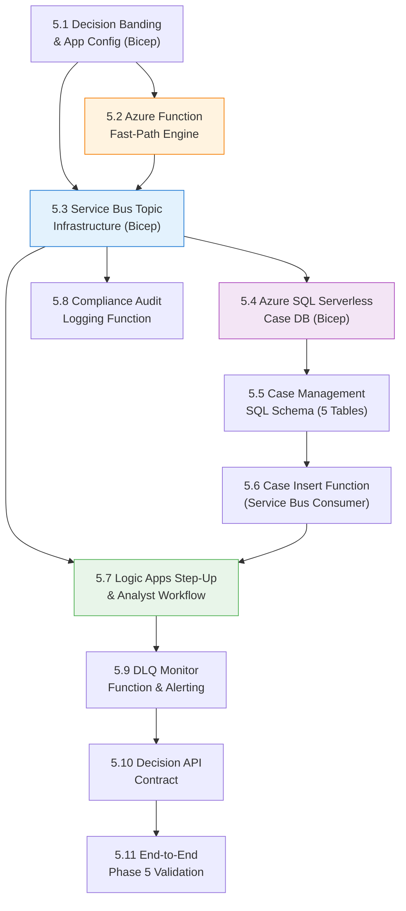
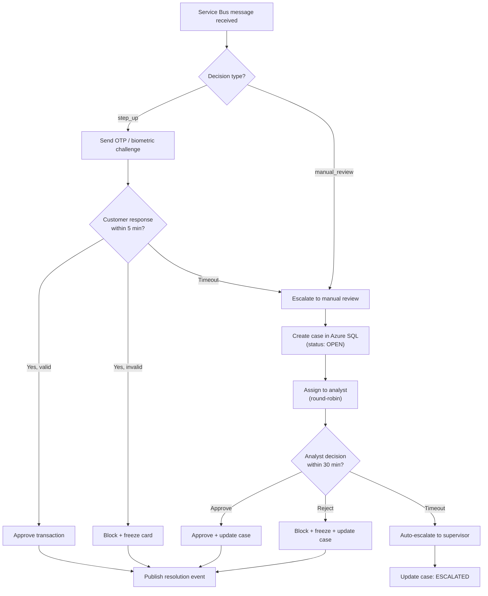

# Phase 5 — Decision Engine & Case Workflow: Production-Grade Implementation Plan

> [!IMPORTANT]
> This is the **exhaustive, production-grade** plan for Phase 5. Every decision engine score band, dynamic threshold management (Azure App Configuration), fast-path Azure Function, Service Bus Topic fan-out topology, Azure SQL case management schema (including `case_events` audit trail, `threshold_audit` table, and reference tables), idempotent MERGE logic, Azure Logic App step-up/analyst workflow with escalation timeouts, DLQ monitoring Function, compliance audit logger, and the complete API contract is specified here. Phase 5 turns scoring outputs into operational business decisions and human-in-the-loop workflows.

> [!CAUTION]
> ## Azure Free Trial Constraints (Phase 5 Adaptation)
> Phase 5 introduces messaging and transactional database infrastructure. Budget impact & cost controls:
> - **Azure Service Bus:** Standard Tier ($0.05 per million operations). Free Trial provides sufficient credits. (Basic tier lacks Topics; Standard is required for Topic fan-out).
> - **Azure SQL Database:** **Serverless General Purpose SKU (`GP_S_Gen5_1`)** with **Auto-Pause enabled after 60 minutes of inactivity**. Min vCore = 0.5, Max vCore = 1.0. Idle cost is ~$0/month when auto-paused.
> - **Azure Functions:** **Consumption Plan (Serverless)**. First 1,000,000 executions per month are free.
> - **Azure Logic Apps:** **Consumption Plan**. First 4,000 action executions are free.
> - **Azure App Configuration:** **Free Tier** (1,000 requests/day — sufficient for dev/test cached reads).
> - **Total Phase 5 estimated cost:** <$5/month (well within the $200 Free Trial credit).
>
> **Upgrade path:** When upgrading to Pay-As-You-Go for production, set Azure SQL to Provisioned ZRS with Read Replicas, disable auto-pause, scale Service Bus to Premium with VNet integration, deploy Logic Apps to Standard (App Service Plan) for private endpoint support, and upgrade App Configuration to Standard for unlimited requests.

**Prerequisite:** Phase 0 (IaC), Phase 1 (Batch), Phase 2 (Streaming), Phase 3 (Feature Store), and Phase 4 (Hybrid Model Endpoint) are complete and verified. The model endpoint is serving real-time risk scores in $[0.0, 1.0]$.

**Phase 5 Goal:** Build the real-time decision engine (Azure Functions), configure dynamic threshold management, set up Service Bus Topic fan-out, design the Azure SQL case management database (5 tables), implement the human-in-the-loop step-up/analyst workflow (Logic Apps) with escalation timeouts, build the DLQ monitoring function, implement the compliance audit logger, and enforce zero-data-loss resilience.

**Duration:** 2–3 weeks

---

## Phase 5 Internal Dependency Graph



---

## 5.1 Decision Engine Architecture & Score Bands

The Decision Engine splits transactions into 4 operational score bands. Fast-path decisions (**Approve** / **Block**) execute synchronously within the Azure Function (<15ms). Asynchronous workflows (**Step-Up** / **Manual Review**) publish to Service Bus and return immediately to protect scoring latency SLAs.

```
                  ┌─────────────────────────────────────┐
                  │ Model Scoring Output (Score 0.0-1.0) │
                  └──────────────────┬──────────────────┘
                                     │
                 ┌───────────────────┴───────────────────┐
                 ▼                                       ▼
     [ Fast Path: Synchronous ]              [ Async Path: Fan-Out ]
                 │                                       │
      ┌──────────┴──────────┐                 ┌──────────┴──────────┐
      ▼                     ▼                 ▼                     ▼
Score < 0.10           Score > 0.90      0.10 <= Score < 0.60  0.60 <= Score <= 0.90
[ APPROVE ]            [ BLOCK ]         [ STEP-UP AUTH ]      [ MANUAL REVIEW ]
Immediate Response     Immediate Block   OTP / Push Auth       Analyst Queue
                       & Freeze Card     via Logic App         via Azure SQL
```

### 5.1.1 Score Band Configuration Table

| Risk Score Band | Action Name | Primary Processor | Execution Mode | Business Action |
|---|---|---|---|---|
| `[0.00, 0.10)` | **Approve** | Azure Function | Synchronous Fast-Path | Instantly approve transaction |
| `[0.10, 0.60)` | **Step-Up** | Logic App Workflow | Asynchronous Fan-Out | Trigger 2FA / OTP push notification; wait 5 min |
| `[0.60, 0.90]` | **Manual Review** | Azure SQL + Logic App | Asynchronous Fan-Out | Queue in analyst workbench; 30-min SLA |
| `(0.90, 1.00]` | **Block** | Azure Function | Synchronous Fast-Path | Block transaction, freeze card, notify user |

> [!IMPORTANT]
> **Dynamic Threshold Configuration:** Score band thresholds (`0.10`, `0.60`, `0.90`) are stored dynamically in **Azure App Configuration** (Free Tier for dev) and cached in memory with a 60-second TTL. Threshold changes do NOT require a code redeployment. Every threshold change is logged to the `threshold_audit` SQL table.

---

## 5.2 Azure App Configuration Infrastructure (Bicep)

> [!NOTE]
> **Missing from original plan.** The reference architecture specifies dynamic thresholds via Azure App Configuration, not hardcoded values. This is critical for production operations — fraud ops teams need to adjust thresholds without engineering deployments.

#### `infrastructure/modules/app-configuration.bicep`

```bicep
@description('Environment name')
param environment string = 'dev'

@description('Location')
param location string

param projectName string = 'fraud-detection'

var configStoreName = 'appcs-fraud-${environment}'

resource appConfig 'Microsoft.AppConfiguration/configurationStores@2023-03-01' = {
  name: configStoreName
  location: location
  tags: {
    project: projectName
    environment: environment
    'managed-by': 'bicep'
  }
  sku: {
    name: 'free' // Free Trial: Free tier (1,000 requests/day)
  }
  properties: {
    publicNetworkAccess: 'Enabled'
  }
}

// Seed default threshold values
resource approveThreshold 'Microsoft.AppConfiguration/configurationStores/keyValues@2023-03-01' = {
  parent: appConfig
  name: 'FraudEngine:ApproveMaxThreshold'
  properties: {
    value: '0.10'
    tags: { description: 'Maximum score for auto-approve' }
  }
}

resource stepUpThreshold 'Microsoft.AppConfiguration/configurationStores/keyValues@2023-03-01' = {
  parent: appConfig
  name: 'FraudEngine:StepUpMaxThreshold'
  properties: {
    value: '0.60'
    tags: { description: 'Maximum score for step-up auth' }
  }
}

resource blockThreshold 'Microsoft.AppConfiguration/configurationStores/keyValues@2023-03-01' = {
  parent: appConfig
  name: 'FraudEngine:BlockMinThreshold'
  properties: {
    value: '0.90'
    tags: { description: 'Minimum score for auto-block' }
  }
}

output configStoreEndpoint string = appConfig.properties.endpoint
```

---

## 5.3 Azure Service Bus Infrastructure (Bicep)

### 5.3.1 Topic Topology & Subscriptions

A single Service Bus Topic `sb-topic-fraud-events` receives non-blocking async events. Three independent subscriptions process events asynchronously:

```
                               ┌─────────────────────────┐
                               │  Service Bus Topic:     │
                               │  sb-topic-fraud-events  │
                               └────────────┬────────────┘
                                            │
         ┌──────────────────────────────────┼──────────────────────────────────┐
         │                                  │                                  │
         ▼                                  ▼                                  ▼
┌─────────────────┐                ┌─────────────────┐                ┌─────────────────┐
│ Subscription:   │                │ Subscription:   │                │ Subscription:   │
│ sub-stepup-auth │                │ sub-case-mgmt   │                │ sub-audit-log   │
│ Filter: step_up │                │ Filter: all     │                │ Filter: all     │
└────────┬────────┘                └────────┬────────┘                └────────┬────────┘
         │                                  │                                  │
         ▼                                  ▼                                  ▼
   Logic App OTP                   Azure Function →               Azure Function →
   Workflow                        Azure SQL Case DB              ADLS Audit Delta Table
```

#### `infrastructure/modules/service-bus.bicep`

```bicep
@description('Environment name — dev for Free Trial')
param environment string = 'dev'

@description('Location')
param location string

param projectName string = 'fraud-detection'

var namespaceName = 'sbns-fraud-${environment}'
var topicName = 'sb-topic-fraud-events'

// --- Service Bus Namespace (Standard Tier required for Topics) ---
resource sbNamespace 'Microsoft.ServiceBus/namespaces@2022-10-01-preview' = {
  name: namespaceName
  location: location
  tags: {
    project: projectName
    environment: environment
    'managed-by': 'bicep'
  }
  sku: {
    name: 'Standard'
    tier: 'Standard'
  }
  properties: {
    publicNetworkAccess: 'Enabled'
  }
}

// --- Topic: fraud-events ---
resource sbTopic 'Microsoft.ServiceBus/namespaces/topics@2022-10-01-preview' = {
  parent: sbNamespace
  name: topicName
  properties: {
    defaultMessageTimeToLive: 'P7D' // 7 days TTL
    maxSizeInMegabytes: 1024
    requiresDuplicateDetection: true
    duplicateDetectionHistoryTimeWindow: 'PT10M' // 10-minute dup detection window
    enablePartitioning: false // Standard tier: not partitioned
  }
}

// --- Subscription 1: Step-Up Auth Workflow (filtered to step_up actions only) ---
resource subStepUp 'Microsoft.ServiceBus/namespaces/topics/subscriptions@2022-10-01-preview' = {
  parent: sbTopic
  name: 'sub-stepup-auth'
  properties: {
    maxDeliveryCount: 5
    deadLetteringOnMessageExpiration: true
    enableBatchedOperations: true
    lockDuration: 'PT1M'
  }
}

resource ruleStepUp 'Microsoft.ServiceBus/namespaces/topics/subscriptions/rules@2022-10-01-preview' = {
  parent: subStepUp
  name: 'FilterStepUp'
  properties: {
    filterType: 'CorrelationFilter'
    correlationFilter: {
      properties: {
        action: 'step_up'
      }
    }
  }
}

// --- Subscription 2: Case Management (all actions except approve) ---
resource subCaseMgmt 'Microsoft.ServiceBus/namespaces/topics/subscriptions@2022-10-01-preview' = {
  parent: sbTopic
  name: 'sub-case-mgmt'
  properties: {
    maxDeliveryCount: 5
    deadLetteringOnMessageExpiration: true
    enableBatchedOperations: true
    lockDuration: 'PT1M'
  }
}

// --- Subscription 3: Compliance Audit Log (receives ALL events) ---
resource subAuditLog 'Microsoft.ServiceBus/namespaces/topics/subscriptions@2022-10-01-preview' = {
  parent: sbTopic
  name: 'sub-audit-log'
  properties: {
    maxDeliveryCount: 10 // Higher retry count for compliance — data loss unacceptable
    deadLetteringOnMessageExpiration: true
    enableBatchedOperations: true
    lockDuration: 'PT1M'
  }
}

// --- Authorization Rules ---
resource sendAuthRule 'Microsoft.ServiceBus/namespaces/topics/authorizationRules@2022-10-01-preview' = {
  parent: sbTopic
  name: 'publisher-send-rule'
  properties: { rights: ['Send'] }
}

resource listenAuthRule 'Microsoft.ServiceBus/namespaces/topics/authorizationRules@2022-10-01-preview' = {
  parent: sbTopic
  name: 'consumer-listen-rule'
  properties: { rights: ['Listen'] }
}

output namespaceName string = sbNamespace.name
output topicName string = topicName
output sendConnectionString string = sendAuthRule.listKeys().primaryConnectionString
output listenConnectionString string = listenAuthRule.listKeys().primaryConnectionString
```

---

## 5.4 Azure SQL Database Serverless Infrastructure (Bicep)

#### `infrastructure/modules/azure-sql.bicep`

```bicep
@description('Environment name — dev for Free Trial')
param environment string = 'dev'

@description('Location')
param location string

param projectName string = 'fraud-detection'

@description('SQL Admin login name')
param sqlAdminLogin string = 'fraudsqladmin'

@description('SQL Admin password from Key Vault')
@secure()
param sqlAdminPassword string

var serverName = 'sql-fraud-${environment}'
var dbName = 'sqldb-fraud-cases-${environment}'

// --- Azure SQL Logical Server ---
resource sqlServer 'Microsoft.Sql/servers@2023-05-01-preview' = {
  name: serverName
  location: location
  tags: {
    project: projectName
    environment: environment
    'managed-by': 'bicep'
  }
  properties: {
    administratorLogin: sqlAdminLogin
    administratorLoginPassword: sqlAdminPassword
    version: '12.0'
    publicNetworkAccess: 'Enabled'
  }
}

resource sqlFirewallAzure 'Microsoft.Sql/servers/firewallRules@2023-05-01-preview' = {
  parent: sqlServer
  name: 'AllowAllWindowsAzureIps'
  properties: {
    startIpAddress: '0.0.0.0'
    endIpAddress: '0.0.0.0'
  }
}

// --- Azure SQL Database: Serverless GP_S_Gen5_1 ---
resource sqlDatabase 'Microsoft.Sql/servers/databases@2023-05-01-preview' = {
  parent: sqlServer
  name: dbName
  location: location
  tags: {
    project: projectName
    environment: environment
    'managed-by': 'bicep'
  }
  sku: {
    name: 'GP_S_Gen5'
    tier: 'GeneralPurpose'
    family: 'Gen5'
    capacity: 1
  }
  properties: {
    autoPauseDelay: 60
    minCapacity: json('0.5')
    maxSizeBytes: 34359738368
    zoneRedundant: false
  }
}

output sqlServerFqdn string = sqlServer.properties.fullyQualifiedDomainName
output sqlDatabaseName string = sqlDatabase.name
```

---

## 5.5 Azure SQL Case Management Database Schema (5 Tables)

> [!IMPORTANT]
> **Expanded from original 3 tables to 5 tables.** The reference architecture specifies `case_events` (audit trail of all state changes) and `threshold_audit` (log of all threshold configuration changes) in addition to the core case, analyst, and step-up tables.

### 5.5.1 Versioned Migration Scripts

#### `database/migrations/V001__create_cases_table.sql`

```sql
-- ============================================================
-- V001: Primary Fraud Cases Table
-- ============================================================
IF NOT EXISTS (SELECT * FROM sys.tables WHERE name = 'fraud_cases')
BEGIN
    CREATE TABLE fraud_cases (
        case_id UNIQUEIDENTIFIER DEFAULT NEWID() PRIMARY KEY,
        transaction_id VARCHAR(64) NOT NULL UNIQUE,
        customer_id VARCHAR(64) NOT NULL,
        card_id VARCHAR(64) NOT NULL,
        amount DECIMAL(18, 2) NOT NULL,
        currency VARCHAR(3) DEFAULT 'USD',
        fraud_probability DECIMAL(5, 4) NOT NULL,
        scoring_mode VARCHAR(32) NOT NULL DEFAULT 'full',
        decision_action VARCHAR(32) NOT NULL, -- approve, step_up, manual_review, block
        case_status VARCHAR(32) NOT NULL DEFAULT 'OPEN',
        -- OPEN, IN_REVIEW, ESCALATED, APPROVED, REJECTED, EXPIRED
        assigned_analyst VARCHAR(128) NULL,
        model_version VARCHAR(32) NULL,
        shap_top_features NVARCHAR(MAX) NULL, -- JSON array of SHAP explanations
        resolution VARCHAR(32) NULL,
        resolution_notes VARCHAR(1000) NULL,
        created_at DATETIME2 DEFAULT SYSUTCDATETIME(),
        updated_at DATETIME2 DEFAULT SYSUTCDATETIME()
    );

    CREATE INDEX IX_fraud_cases_status ON fraud_cases(case_status, created_at);
    CREATE INDEX IX_fraud_cases_customer ON fraud_cases(customer_id);
    CREATE INDEX IX_fraud_cases_created ON fraud_cases(created_at DESC);
END;
```

#### `database/migrations/V002__create_case_events_table.sql`

```sql
-- ============================================================
-- V002: Case Events Audit Trail (Immutable)
-- ============================================================
IF NOT EXISTS (SELECT * FROM sys.tables WHERE name = 'case_events')
BEGIN
    CREATE TABLE case_events (
        event_id UNIQUEIDENTIFIER DEFAULT NEWID() PRIMARY KEY,
        case_id UNIQUEIDENTIFIER NOT NULL FOREIGN KEY REFERENCES fraud_cases(case_id),
        event_type VARCHAR(64) NOT NULL,
        -- CREATED, ASSIGNED, STATUS_CHANGED, ESCALATED, RESOLVED, REOPENED
        event_data NVARCHAR(MAX) NULL, -- JSON payload with event details
        created_at DATETIME2 DEFAULT SYSUTCDATETIME(),
        created_by VARCHAR(128) NOT NULL DEFAULT 'SYSTEM'
    );

    CREATE INDEX IX_case_events_case ON case_events(case_id, created_at);
END;
```

#### `database/migrations/V003__create_analyst_decisions_table.sql`

```sql
-- ============================================================
-- V003: Analyst Decisions & Review History
-- ============================================================
IF NOT EXISTS (SELECT * FROM sys.tables WHERE name = 'analyst_decisions')
BEGIN
    CREATE TABLE analyst_decisions (
        decision_id UNIQUEIDENTIFIER DEFAULT NEWID() PRIMARY KEY,
        case_id UNIQUEIDENTIFIER NOT NULL FOREIGN KEY REFERENCES fraud_cases(case_id),
        analyst_id VARCHAR(128) NOT NULL,
        decision_result VARCHAR(32) NOT NULL,
        -- CONFIRMED_LEGIT, CONFIRMED_FRAUD, ESCALATED, NEEDS_INFO
        decision_notes VARCHAR(1000) NULL,
        decided_at DATETIME2 DEFAULT SYSUTCDATETIME()
    );
END;
```

#### `database/migrations/V004__create_threshold_audit_table.sql`

```sql
-- ============================================================
-- V004: Threshold Audit Trail (Compliance Requirement)
-- ============================================================
IF NOT EXISTS (SELECT * FROM sys.tables WHERE name = 'threshold_audit')
BEGIN
    CREATE TABLE threshold_audit (
        change_id UNIQUEIDENTIFIER DEFAULT NEWID() PRIMARY KEY,
        parameter_name VARCHAR(128) NOT NULL,
        old_value VARCHAR(64) NOT NULL,
        new_value VARCHAR(64) NOT NULL,
        changed_by VARCHAR(128) NOT NULL,
        changed_at DATETIME2 DEFAULT SYSUTCDATETIME(),
        change_reason VARCHAR(500) NULL
    );
END;
```

#### `database/migrations/V005__create_step_up_and_reference_tables.sql`

```sql
-- ============================================================
-- V005: Step-Up Auth Log & Reference Data Tables
-- ============================================================
IF NOT EXISTS (SELECT * FROM sys.tables WHERE name = 'step_up_requests')
BEGIN
    CREATE TABLE step_up_requests (
        step_up_id UNIQUEIDENTIFIER DEFAULT NEWID() PRIMARY KEY,
        transaction_id VARCHAR(64) NOT NULL,
        customer_id VARCHAR(64) NOT NULL,
        otp_code_hash VARCHAR(128) NOT NULL,
        auth_status VARCHAR(32) DEFAULT 'PENDING',
        -- PENDING, VERIFIED, EXPIRED, FAILED
        requested_at DATETIME2 DEFAULT SYSUTCDATETIME(),
        verified_at DATETIME2 NULL,
        expired_at DATETIME2 NULL
    );
END;

-- Reference: Merchant Category Standardization
IF NOT EXISTS (SELECT * FROM sys.tables WHERE name = 'merchant_category_map')
BEGIN
    CREATE TABLE merchant_category_map (
        raw_category VARCHAR(128) PRIMARY KEY,
        standardized_category VARCHAR(128) NOT NULL,
        updated_at DATETIME2 DEFAULT SYSUTCDATETIME()
    );
END;
```

#### `database/stored_procedures/sp_upsert_fraud_case.sql`

```sql
-- ============================================================
-- Idempotent Stored Procedure: Upsert Fraud Case (Handles Retries)
-- Also inserts initial CREATED event into case_events audit trail.
-- ============================================================
CREATE OR ALTER PROCEDURE sp_upsert_fraud_case
    @transaction_id VARCHAR(64),
    @customer_id VARCHAR(64),
    @card_id VARCHAR(64),
    @amount DECIMAL(18, 2),
    @currency VARCHAR(3),
    @fraud_probability DECIMAL(5, 4),
    @scoring_mode VARCHAR(32),
    @decision_action VARCHAR(32),
    @model_version VARCHAR(32),
    @shap_top_features NVARCHAR(MAX) = NULL
AS
BEGIN
    SET NOCOUNT ON;

    DECLARE @case_id UNIQUEIDENTIFIER;
    DECLARE @is_new BIT = 0;

    MERGE fraud_cases AS target
    USING (SELECT @transaction_id AS transaction_id) AS source
    ON (target.transaction_id = source.transaction_id)

    WHEN MATCHED THEN
        UPDATE SET
            target.fraud_probability = @fraud_probability,
            target.updated_at = SYSUTCDATETIME()

    WHEN NOT MATCHED THEN
        INSERT (
            transaction_id, customer_id, card_id, amount, currency,
            fraud_probability, scoring_mode, decision_action, case_status,
            model_version, shap_top_features
        )
        VALUES (
            @transaction_id, @customer_id, @card_id, @amount, @currency,
            @fraud_probability, @scoring_mode, @decision_action, 'OPEN',
            @model_version, @shap_top_features
        );

    -- Insert audit event for new cases
    SELECT @case_id = case_id FROM fraud_cases WHERE transaction_id = @transaction_id;

    IF @case_id IS NOT NULL
    BEGIN
        INSERT INTO case_events (case_id, event_type, event_data, created_by)
        VALUES (
            @case_id,
            'CREATED',
            CONCAT('{"decision_action":"', @decision_action, '","fraud_probability":', CAST(@fraud_probability AS VARCHAR), '}'),
            'SYSTEM'
        );
    END;
END;
```

#### `database/stored_procedures/sp_update_case_status.sql`

```sql
-- ============================================================
-- Update Case Status with Audit Trail Entry
-- ============================================================
CREATE OR ALTER PROCEDURE sp_update_case_status
    @case_id UNIQUEIDENTIFIER,
    @new_status VARCHAR(32),
    @updated_by VARCHAR(128),
    @notes VARCHAR(500) = NULL
AS
BEGIN
    SET NOCOUNT ON;

    DECLARE @old_status VARCHAR(32);
    SELECT @old_status = case_status FROM fraud_cases WHERE case_id = @case_id;

    UPDATE fraud_cases
    SET case_status = @new_status, updated_at = SYSUTCDATETIME()
    WHERE case_id = @case_id;

    INSERT INTO case_events (case_id, event_type, event_data, created_by)
    VALUES (
        @case_id,
        'STATUS_CHANGED',
        CONCAT('{"old_status":"', @old_status, '","new_status":"', @new_status, '","notes":"', ISNULL(@notes, ''), '"}'),
        @updated_by
    );
END;
```

---

## 5.6 Fast-Path Decision Engine (Azure Function)

#### `functions/decision_engine/function_app.py`

```python
"""
Azure Functions Decision Engine: Fast-Path Scoring & Async Fan-Out.
SLA: Latency contribution < 15ms.

Production Notes:
  - Thresholds are read from Azure App Configuration with 60-second TTL cache.
  - Service Bus client is reused across invocations (module-level singleton).
  - Emergency fallback approves on any unhandled exception to prevent payment drops.
"""

import json
import os
import time
import logging
import azure.functions as func
from azure.servicebus import ServiceBusClient, ServiceBusMessage

app = func.FunctionApp(http_auth_level=func.AuthLevel.ANONYMOUS)

# --- Threshold Cache (refreshed every 60s) ---
_threshold_cache = {
    "APPROVE_MAX": 0.10,
    "STEP_UP_MAX": 0.60,
    "BLOCK_MIN": 0.90,
    "_last_refresh": 0.0
}
CACHE_TTL_SECONDS = 60

def _get_thresholds() -> dict:
    """Returns cached thresholds, refreshing from App Configuration if TTL expired."""
    now = time.time()
    if now - _threshold_cache["_last_refresh"] > CACHE_TTL_SECONDS:
        try:
            from azure.appconfiguration import AzureAppConfigurationClient
            conn_str = os.environ.get("APP_CONFIG_CONN_STR")
            if conn_str:
                client = AzureAppConfigurationClient.from_connection_string(conn_str)
                _threshold_cache["APPROVE_MAX"] = float(client.get_configuration_setting("FraudEngine:ApproveMaxThreshold").value)
                _threshold_cache["STEP_UP_MAX"] = float(client.get_configuration_setting("FraudEngine:StepUpMaxThreshold").value)
                _threshold_cache["BLOCK_MIN"] = float(client.get_configuration_setting("FraudEngine:BlockMinThreshold").value)
                _threshold_cache["_last_refresh"] = now
                logging.info(f"Thresholds refreshed: {_threshold_cache}")
        except Exception as e:
            logging.warning(f"App Config refresh failed, using cached values: {e}")
    return _threshold_cache

# --- Service Bus Singleton ---
SERVICE_BUS_CONN_STR = os.environ.get("SERVICE_BUS_CONN_STR")
TOPIC_NAME = "sb-topic-fraud-events"
_sb_client = None

def _get_sb_sender():
    global _sb_client
    if _sb_client is None and SERVICE_BUS_CONN_STR:
        _sb_client = ServiceBusClient.from_connection_string(SERVICE_BUS_CONN_STR)
    return _sb_client.get_topic_sender(topic_name=TOPIC_NAME) if _sb_client else None

# --- Main Decision Endpoint ---
@app.route(route="evaluate-decision", methods=["POST"])
def evaluate_decision(req: func.HttpRequest) -> func.HttpResponse:
    start_time = time.time()
    logging.info("Decision Engine processing transaction request.")

    try:
        req_body = req.get_json()
        transaction_id = req_body["transaction_id"]
        customer_id = req_body["customer_id"]
        card_id = req_body["card_id"]
        amount = float(req_body["amount"])
        currency = req_body.get("currency", "USD")
        fraud_prob = float(req_body["fraud_probability"])
        scoring_mode = req_body.get("scoring_mode", "full")
        model_version = req_body.get("model_version", "unknown")
        shap_factors = req_body.get("top_risk_factors", [])

        thresholds = _get_thresholds()

        # 1. Determine Score Band Action
        if fraud_prob < thresholds["APPROVE_MAX"]:
            action = "approve"
            status_code = 200
        elif fraud_prob < thresholds["STEP_UP_MAX"]:
            action = "step_up"
            status_code = 202
        elif fraud_prob <= thresholds["BLOCK_MIN"]:
            action = "manual_review"
            status_code = 202
        else:
            action = "block"
            status_code = 403

        # 2. Async Fan-Out for Non-Approve Actions
        if action != "approve":
            _publish_event(
                transaction_id=transaction_id,
                customer_id=customer_id,
                card_id=card_id,
                amount=amount,
                currency=currency,
                fraud_prob=fraud_prob,
                scoring_mode=scoring_mode,
                model_version=model_version,
                shap_factors=shap_factors,
                action=action
            )

        latency_ms = (time.time() - start_time) * 1000.0

        response_data = {
            "transaction_id": transaction_id,
            "decision_action": action,
            "fraud_probability": fraud_prob,
            "status": "COMPLETED" if action in ["approve", "block"] else "PENDING_ASYNC",
            "latency_ms": round(latency_ms, 2)
        }
        return func.HttpResponse(
            json.dumps(response_data),
            status_code=status_code,
            mimetype="application/json"
        )

    except Exception as e:
        logging.error(f"Decision error: {str(e)}", exc_info=True)
        return func.HttpResponse(
            json.dumps({"decision_action": "approve_fallback", "error": str(e)}),
            status_code=200,
            mimetype="application/json"
        )


def _publish_event(**kwargs):
    """Publishes transaction decision event to Service Bus Topic."""
    sender = _get_sb_sender()
    if not sender:
        logging.warning("Service Bus not configured. Event not published.")
        return

    msg = ServiceBusMessage(
        json.dumps(kwargs),
        application_properties={"action": kwargs["action"]},
        message_id=kwargs["transaction_id"]
    )

    with sender:
        sender.send_messages(msg)
```

#### `functions/decision_engine/requirements.txt`

```
azure-functions>=1.17.0
azure-servicebus>=7.11.0
azure-appconfiguration>=1.5.0
```

---

## 5.7 Compliance Audit Logging Function

> [!NOTE]
> **Missing from original plan.** The reference architecture specifies an immutable compliance audit log that records every decision with full context (score, model version, thresholds, SHAP factors). Required for 7-year regulatory retention.

#### `functions/audit_logger/function_app.py`

```python
"""
Compliance Audit Logger: Writes immutable decision records.
Triggered by Service Bus subscription 'sub-audit-log'.
Writes to append-only Delta table: audit.decision_log
"""

import json
import logging
import azure.functions as func
from datetime import datetime

app = func.FunctionApp()

@app.service_bus_topic_trigger(
    arg_name="msg",
    topic_name="sb-topic-fraud-events",
    subscription_name="sub-audit-log",
    connection="SERVICE_BUS_CONN_STR"
)
def audit_logger(msg: func.ServiceBusMessage):
    """Writes every decision event to immutable audit storage."""
    try:
        body = json.loads(msg.get_body().decode("utf-8"))

        audit_record = {
            "transaction_id": body.get("transaction_id"),
            "timestamp": datetime.utcnow().isoformat(),
            "fraud_score": body.get("fraud_prob"),
            "scoring_mode": body.get("scoring_mode"),
            "decision": body.get("action"),
            "model_version": body.get("model_version"),
            "shap_top_features": json.dumps(body.get("shap_factors", [])),
            "threshold_config": json.dumps({
                "approve_max": 0.10,
                "step_up_max": 0.60,
                "block_min": 0.90
            })
        }

        # In production: write to ADLS Gen2 append-only Delta table
        # For dev: log to Application Insights
        logging.info(f"AUDIT_LOG: {json.dumps(audit_record)}")

    except Exception as e:
        logging.error(f"Audit logger error: {str(e)}", exc_info=True)
        raise  # Let Service Bus retry
```

---

## 5.8 Step-Up & Case Workflow (Azure Logic App)



#### `logic-apps/workflows/workflow_stepup_auth.json`

```json
{
    "$schema": "https://schema.management.azure.com/providers/Microsoft.Logic/schemas/2016-06-01/workflowdefinition.json#",
    "contentVersion": "1.0.0.0",
    "triggers": {
        "When_a_message_arrives_in_StepUp_subscription": {
            "type": "ApiConnection",
            "inputs": {
                "host": {
                    "connection": { "name": "@parameters('$connections')['servicebus']['connectionId']" }
                },
                "method": "get",
                "path": "/@{encodeURIComponent('sb-topic-fraud-events')}/subscriptions/@{encodeURIComponent('sub-stepup-auth')}/messages/head"
            },
            "recurrence": { "frequency": "Minute", "interval": 1 }
        }
    },
    "actions": {
        "Parse_Message_JSON": {
            "type": "ParseJson",
            "inputs": {
                "content": "@triggerBody()?['ContentData']",
                "schema": {
                    "type": "object",
                    "properties": {
                        "transaction_id": { "type": "string" },
                        "customer_id": { "type": "string" },
                        "card_id": { "type": "string" },
                        "amount": { "type": "number" },
                        "fraud_prob": { "type": "number" },
                        "action": { "type": "string" },
                        "model_version": { "type": "string" }
                    }
                }
            }
        },
        "Upsert_Case_Record": {
            "type": "ApiConnection",
            "inputs": {
                "host": {
                    "connection": { "name": "@parameters('$connections')['sql']['connectionId']" }
                },
                "method": "post",
                "path": "/v2/datasets/@{encodeURIComponent('sql-fraud-dev')},@{encodeURIComponent('sqldb-fraud-cases-dev')}/procedures/@{encodeURIComponent('sp_upsert_fraud_case')}"
            },
            "runAfter": { "Parse_Message_JSON": ["Succeeded"] }
        },
        "Wait_For_Customer_Response": {
            "type": "Wait",
            "inputs": {
                "interval": { "count": 5, "unit": "Minute" }
            },
            "runAfter": { "Upsert_Case_Record": ["Succeeded"] }
        },
        "Escalate_If_Timeout": {
            "type": "ApiConnection",
            "inputs": {
                "host": {
                    "connection": { "name": "@parameters('$connections')['sql']['connectionId']" }
                },
                "method": "post",
                "path": "/v2/datasets/@{encodeURIComponent('sql-fraud-dev')},@{encodeURIComponent('sqldb-fraud-cases-dev')}/procedures/@{encodeURIComponent('sp_update_case_status')}",
                "body": {
                    "new_status": "ESCALATED",
                    "updated_by": "LOGIC_APP_TIMEOUT"
                }
            },
            "runAfter": { "Wait_For_Customer_Response": ["Succeeded"] }
        }
    }
}
```

---

## 5.9 DLQ Monitor Function & Alerting

> [!NOTE]
> **Upgraded from script to Azure Function.** The reference architecture specifies a dedicated Azure Function polling the DLQ, logging to Application Insights, and raising P1 alerts. The original plan had only a manual Python script.

#### `functions/dlq_monitor/function_app.py`

```python
"""
DLQ Monitor Function: Polls Dead-Letter Queues across all subscriptions.
Logs details to Application Insights and raises alerts on non-empty DLQ.
Triggered on a 5-minute timer schedule.
"""

import json
import logging
import azure.functions as func
from azure.servicebus import ServiceBusClient

app = func.FunctionApp()

TOPIC_NAME = "sb-topic-fraud-events"
SUBSCRIPTIONS = ["sub-stepup-auth", "sub-case-mgmt", "sub-audit-log"]

@app.timer_trigger(schedule="0 */5 * * * *", arg_name="timer", run_on_startup=False)
def dlq_monitor(timer: func.TimerRequest):
    """Monitors DLQ across all subscriptions every 5 minutes."""
    import os
    conn_str = os.environ.get("SERVICE_BUS_CONN_STR")
    if not conn_str:
        logging.warning("SERVICE_BUS_CONN_STR not set. DLQ monitor skipped.")
        return

    total_dlq_messages = 0

    with ServiceBusClient.from_connection_string(conn_str) as client:
        for sub_name in SUBSCRIPTIONS:
            dlq_path = f"{sub_name}/$DeadLetterQueue"
            try:
                with client.get_subscription_receiver(
                    topic_name=TOPIC_NAME,
                    subscription_name=dlq_path,
                    max_wait_time=5
                ) as receiver:
                    messages = receiver.receive_messages(max_message_count=50, max_wait_time=3)
                    count = len(messages)
                    total_dlq_messages += count

                    for msg in messages:
                        logging.error(
                            f"DLQ_ALERT | Subscription={sub_name} | "
                            f"Reason={msg.dead_letter_reason} | "
                            f"Error={msg.dead_letter_error_description} | "
                            f"MessageId={msg.message_id}"
                        )
                        # Peek only — do NOT complete (preserve for manual investigation)

            except Exception as e:
                logging.error(f"DLQ monitor error for {sub_name}: {e}")

    if total_dlq_messages > 0:
        logging.critical(f"🚨 DLQ ALERT: {total_dlq_messages} dead-lettered messages found across subscriptions!")
    else:
        logging.info("✅ DLQ Monitor: All subscription DLQs are empty.")
```

---

## 5.10 Decision API Contract

### 5.10.1 Request Schema (POST `/api/evaluate-decision`)

```json
{
    "transaction_id": "txn_20260801_123456",
    "customer_id": "cust_001",
    "card_id": "card_001",
    "amount": 1250.00,
    "currency": "USD",
    "fraud_probability": 0.72,
    "scoring_mode": "full",
    "model_version": "v1.2.0",
    "top_risk_factors": [
        {"feature": "vel_card_txn_count_5m", "shap_value": 0.34, "direction": "increases_risk"},
        {"feature": "geo_flag_impossible_travel", "shap_value": 0.28, "direction": "increases_risk"}
    ]
}
```

### 5.10.2 Response Schema

```json
{
    "transaction_id": "txn_20260801_123456",
    "decision_action": "manual_review",
    "fraud_probability": 0.72,
    "status": "PENDING_ASYNC",
    "latency_ms": 8.42
}
```

---

## 5.11 File Tree — Phase 5 Additions

```
fraud-detection-platform/
├── infrastructure/
│   └── modules/
│       ├── service-bus.bicep                  # [NEW] Service Bus Topic + 3 Subscriptions + Rules
│       ├── azure-sql.bicep                    # [NEW] Azure SQL Serverless GP_S_Gen5_1 + Firewall
│       └── app-configuration.bicep            # [NEW] Azure App Configuration + Default Thresholds
│
├── database/
│   ├── migrations/
│   │   ├── V001__create_cases_table.sql       # [NEW] fraud_cases (with scoring_mode, model_version, shap)
│   │   ├── V002__create_case_events_table.sql # [NEW] case_events audit trail
│   │   ├── V003__create_analyst_decisions.sql # [NEW] analyst_decisions
│   │   ├── V004__create_threshold_audit.sql   # [NEW] threshold_audit compliance trail
│   │   └── V005__create_step_up_and_ref.sql   # [NEW] step_up_requests + merchant_category_map
│   └── stored_procedures/
│       ├── sp_upsert_fraud_case.sql           # [NEW] Idempotent MERGE + audit event insert
│       └── sp_update_case_status.sql          # [NEW] Status update + audit trail entry
│
├── functions/
│   ├── decision_engine/
│   │   ├── function_app.py                    # [NEW] Fast-Path Decision + App Config cache
│   │   ├── host.json                          # [NEW]
│   │   └── requirements.txt                   # [NEW] (includes azure-appconfiguration)
│   ├── audit_logger/
│   │   └── function_app.py                    # [NEW] Compliance audit log writer
│   └── dlq_monitor/
│       └── function_app.py                    # [NEW] Timer-triggered DLQ poller + alerting
│
├── logic-apps/
│   └── workflows/
│       └── workflow_stepup_auth.json          # [NEW] Logic Apps with 5-min timeout + escalation
│
├── scripts/
│   └── dlq_replay_handler.py                  # [NEW] Manual DLQ replay for resolved issues
│
└── docs/
    └── case_management_workflow.md            # [NEW] Analyst operational runbook + API contract
```

---

## 5.12 Phase 5 Validation Checklist

| # | Check | Command / Method | Expected Result | Criticality |
|---|---|---|---|---|
| 1 | App Configuration deploys with thresholds | Run `app-configuration.bicep` | 3 threshold keys seeded | 🔴 Blocking |
| 2 | Service Bus Topic & 3 Subscriptions deploy | Run `service-bus.bicep` | Topic + step-up/case-mgmt/audit-log subscriptions exist | 🔴 Blocking |
| 3 | Azure SQL Serverless deploys | Run `azure-sql.bicep` | Database provisioned with auto-pause | 🔴 Blocking |
| 4 | SQL Schema — all 5 tables created | Execute V001-V005 migrations | `fraud_cases`, `case_events`, `analyst_decisions`, `threshold_audit`, `step_up_requests` exist | 🔴 Blocking |
| 5 | Idempotent MERGE + audit event | Call `sp_upsert_fraud_case` twice | Single case row + `case_events` CREATED entry | 🔴 Blocking |
| 6 | Status update logs to audit trail | Call `sp_update_case_status` | `case_events` STATUS_CHANGED entry with old/new status | 🔴 Blocking |
| 7 | Decision Function < 15ms | Invoke `evaluate-decision` endpoint | Response code 200/202 with latency_ms < 15 | 🔴 Blocking |
| 8 | Score < 0.10 approves (no SB publish) | Payload `fraud_probability = 0.05` | Action `approve`, status 200, no Service Bus message | 🔴 Blocking |
| 9 | Score > 0.90 blocks & publishes | Payload `fraud_probability = 0.95` | Action `block`, status 403, Service Bus event published | 🔴 Blocking |
| 10 | Dynamic threshold change (no redeploy) | Update App Config value | Function uses new threshold on next request | 🔴 Blocking |
| 11 | Compliance audit logger fires | Publish message to topic | Audit log entry in Application Insights / Delta table | 🔴 Blocking |
| 12 | DLQ monitor detects dead-lettered messages | Simulate consumer failure 5× | DLQ monitor logs CRITICAL alert | 🟡 Warning |
| 13 | Logic App escalation triggers on timeout | Wait 5 minutes after step-up | Case status updated to ESCALATED | 🟡 Warning |

---

## Production Decision Registry (Phase 5)

| # | Decision | Free Trial Choice | Production Upgrade | Rationale |
|---|---|---|---|---|
| 1 | Decision Engine | **Azure Functions (Consumption)** | Azure Functions (Premium / ASP) | Consumption is free for 1M req/month |
| 2 | Messaging Topology | **Service Bus Topic (Standard)** | Service Bus Topic (Premium + VNet) | Standard required for Topics; Premium for private endpoints |
| 3 | Case System of Record | **Azure SQL Serverless (`GP_S_Gen5_1`)** | Azure SQL Provisioned (ZRS + Read Replicas) | Serverless auto-pause eliminates idle billing |
| 4 | Duplicate Handling | **SQL `MERGE` + Service Bus Dup Window** | Same | Guarantees idempotency on at-least-once delivery |
| 5 | Workflow Orchestration | **Logic Apps (Consumption)** | Logic Apps (Standard) | Consumption provides 4,000 free actions/month |
| 6 | Threshold Storage | **Azure App Configuration (Free Tier)** | Azure App Configuration (Standard) | Dynamic threshold changes without redeployment |
| 7 | Audit Retention | **Application Insights Log / Delta Table** | ADLS Append-Only Delta (7-year retention) | Regulatory compliance requires immutable audit trail |
| 8 | DLQ Monitoring | **Timer-Triggered Azure Function** | Same + Azure Monitor Action Group | Automated alerting on dead-lettered messages |

---

## Known Issues & Fixes Applied (post-implementation code review, 2026-08-08)

| # | Component | Bug | Fix |
|---|---|---|---|
| 1 | `database/stored_procedures/sp_upsert_fraud_case.sql` | Inserted `event_type = 'CREATED'`, which is **not** in `case_events`'s `chk_case_event_type` CHECK constraint (valid values include `CASE_CREATED`). Every single call that reached the audit insert threw a constraint violation, so no fraud case could ever be created via this procedure. | Corrected to `'CASE_CREATED'`; also switched to logging `'MODEL_SCORE_UPDATED'` on updates (via `$action` from the `MERGE` `OUTPUT` clause) instead of always claiming "created". |
| 2 | `database/stored_procedures/sp_upsert_fraud_case.sql` | `WHEN MATCHED` only refreshed `fraud_probability` and `updated_at`. A re-score of an existing `transaction_id` with a different `decision_action`/`scoring_mode`/`model_version`/`shap_top_features` left those columns stale relative to the new probability. | `WHEN MATCHED` now updates all mutable scoring fields. |
| 3 | `database/stored_procedures/sp_upsert_fraud_case.sql` | `MERGE` without a locking hint under default `READ COMMITTED` isolation allows two concurrent calls for the same new `transaction_id` to both evaluate `WHEN NOT MATCHED` as true, racing on the `UNIQUE` constraint (a known SQL Server MERGE race). | Added `WITH (HOLDLOCK)` on the merge target. |
| 4 | `sp_upsert_fraud_case.sql` and `sp_update_case_status.sql` | `event_data` JSON built via raw `CONCAT('"...":"', @param, '"')` string concatenation with no escaping. Free-text analyst input (`@notes`) containing `"` or `\` produces malformed JSON, or lets an analyst inject arbitrary fields into the immutable audit trail. | Wrapped all string-typed values in `STRING_ESCAPE(..., 'json')` before concatenation. |
| 5 | `functions/dlq_monitor/function_app.py`, `scripts/dlq_replay_handler.py` | Both built `subscription_name=f"{sub_name}/$DeadLetterQueue"` and passed it to `get_subscription_receiver`. The `azure-servicebus` SDK does not support embedding `/$DeadLetterQueue` in the subscription name — DLQ access requires the separate `sub_queue=ServiceBusSubQueue.DEAD_LETTER` kwarg. As written, every poll/replay attempt failed silently (caught by a broad `except`), meaning DLQ monitoring and replay were both non-functional despite looking wired up. | Switched both to `get_subscription_receiver(topic_name=..., subscription_name=sub_name, sub_queue=ServiceBusSubQueue.DEAD_LETTER)`. |
| 6 | `functions/audit_logger/function_app.py` | Module docstring claimed "Message deduplication via message_id check" as a production fix, but `_persist_audit_record` keyed each audit file by `{transaction_id}_{HHMMSS%f}` (microsecond timestamp) — a redelivered/duplicate Service Bus message would just create a second file rather than being deduplicated, contradicting the stated behavior. | Filename now keyed by `{transaction_id}_{message_id}` and written with `overwrite=False`; a redelivery maps to the same path and the resulting `ResourceExistsError` is treated as "already persisted" rather than a failure. |
| 7 | `functions/audit_logger/function_app.py` vs `functions/decision_engine/function_app.py` | `audit_logger` hardcoded `threshold_config` to `{0.10, 0.60, 0.90}` in every audit record, while `decision_engine` refreshes real thresholds from App Configuration every 60s and never included the thresholds it actually used in the published Service Bus payload. If thresholds were ever changed in App Config, the compliance audit trail would silently record the wrong values used for a decision. | `decision_engine`'s published event now includes the exact `threshold_config` (`approve_max`/`step_up_max`/`block_min`) used to classify that transaction; `audit_logger` reads it from the message instead of hardcoding it. |
| 8 | `database/stored_procedures/sp_upsert_fraud_case.sql` | Computed `@case_id` into a local variable but never returned it to the caller (no final `SELECT`). Any caller needing the case_id for a follow-up call — e.g. the Logic App workflow below, which needs it for `sp_update_case_status` — had no way to retrieve it. | Added `SELECT @case_id AS case_id;` as the procedure's final statement, so SQL-connector callers receive it as a result set. |
| 9 | `logic-apps/workflows/workflow_stepup_auth.json` | `Parse_Message_JSON` fed `@triggerBody()?['ContentData']` straight into `ParseJson`, but the Service Bus API-connection trigger returns message content **base64-encoded** in `ContentData` — every message would fail JSON schema validation immediately. Separately, `Upsert_Case_Record` had no `body` at all (the stored procedure's required parameters were never supplied), and `Escalate_If_Timeout`'s body was missing the (non-optional) `case_id` parameter entirely — both calls would fail. | `Parse_Message_JSON` now wraps the content in `base64ToString(...)`. `Upsert_Case_Record` now maps all `sp_upsert_fraud_case` parameters from the parsed message. `Escalate_If_Timeout` now passes `case_id` sourced from `Upsert_Case_Record`'s result set (`ResultSets.Table1[0].case_id` — **flagged for verification**: the exact output shape should be checked against the live SQL connector before first deployment, same caveat as the RBAC role GUIDs below). |
| 10 | `infrastructure/modules/service-bus.bicep`'s `sub-case-mgmt` subscription | This subscription is unfiltered (catches every published decision, including `manual_review`), and per this phase's own architecture is meant to be the consumer that creates the Azure SQL case record for decisions `workflow_stepup_auth.json` never sees (it's filtered to `action=='step_up'` only). **No consumer for `sub-case-mgmt` existed anywhere in the repo** — meaning a `manual_review` decision (the 0.60–0.90 score band) never got a case created in Azure SQL at all, end to end. | Added `logic-apps/workflows/workflow_case_management.json`: a new, minimal workflow subscribing to `sub-case-mgmt` that upserts a case for every decision event it receives. It intentionally does nothing else (no wait/escalate) — `workflow_stepup_auth.json` remains the sole owner of the step-up-specific timing logic, and calling `sp_upsert_fraud_case` from both workflows for the same step_up message is safe (idempotent MERGE). |
| 11 | `database/migrations/V003__create_analyst_decisions.sql`, `V005__create_step_up_and_ref.sql` | `analyst_decisions.decision_result` and `step_up_requests.auth_status` had no `CHECK` constraint, unlike every other status/action/resolution column in V001/V002. A typo'd value (e.g. `CONFRIMED_FRAUD`) would silently fail to match `ingest_chargeback_feedback.py`'s exact-string filters instead of erroring at insert time. | Added `chk_decision_result CHECK (... IN ('CONFIRMED_FRAUD','CONFIRMED_LEGIT','INCONCLUSIVE'))` (matching V001's `chk_resolution` enum, which `ingest_chargeback_feedback.py` actually filters on) and `chk_auth_status CHECK (... IN ('PENDING','VERIFIED','FAILED','EXPIRED'))`. |

### Known, intentionally-unresolved gap: the full step-up/analyst workflow

The mermaid diagram in §5.8 describes a much richer flow than what's actually implemented: OTP/biometric challenge delivery, branching on the customer's response (valid / invalid / timeout), analyst round-robin assignment, a 30-minute analyst-decision timeout, auto-escalation to a supervisor, and a published resolution event. **None of that exists anywhere in this repo** — not just in the Logic App, but at all: there is no OTP/SMS delivery integration (no Twilio/Azure Communication Services), no HTTP endpoint for a customer or analyst to submit a response, no analyst roster or round-robin assignment mechanism, and nothing ever writes to `analyst_decisions` or reads/updates `step_up_requests`.

This fix pass deliberately did **not** fabricate that subsystem. Building it would mean inventing an entire new feature (external OTP delivery, a public callback API with its own auth, an analyst roster schema and UI) with no way to validate any of it without live Azure infrastructure — which risks shipping something that looks complete but has never actually been exercised. Instead, `workflow_stepup_auth.json`'s existing behavior — wait 5 minutes, then unconditionally escalate to manual review — is the conservative, safe fallback the diagram itself specifies for the timeout branch (`D -->|Timeout| G`), and is now honestly labelled as such (see the `notes` field added to `Escalate_If_Timeout`'s call in fix #9 above) rather than silently presented as the full flow. Building the real OTP/analyst-assignment subsystem is a genuine follow-up project, not a bug fix.

Separately: no Bicep module (`infrastructure/modules/*.bicep`) actually deploys `Microsoft.Logic/workflows` or the Service Bus/SQL API connections these workflows depend on — the workflow JSON files exist as artifacts only. A `logic-app.bicep` module is referenced as planned in this phase's file tree but was never created.
