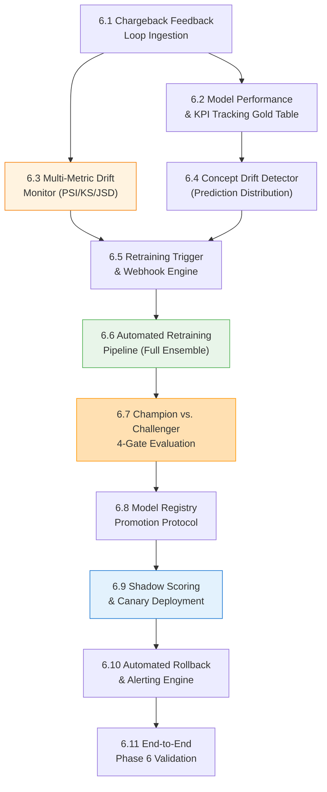

# Phase 6 — MLOps Loop: Production-Grade Implementation Plan

> [!IMPORTANT]
> This is the **exhaustive, production-grade** plan for Phase 6. Every automated drift monitoring job (Population Stability Index / Wasserstein Distance / Jensen-Shannon Divergence), concept drift detection via prediction distribution shift, chargeback feedback loop integration with maturation windows, automated retraining pipeline with full ensemble rebuild, Champion vs. Challenger multi-gate evaluation (PR-AUC + High-Value Recall + FPR + Latency), shadow scoring engine with proper feature vector construction, canary deployment strategy, statistically validated model promotion (McNemar's test), model performance KPI tracking Gold table, automated rollback sentinel with live telemetry queries, Databricks Workflow JSON job definitions, and the MLOps operational runbook are specified here. Phase 6 completes the feedback loop that keeps fraud models accurate as fraud patterns drift over time.

> [!CAUTION]
> ## Azure Free Trial Constraints (Phase 6 Adaptation)
> Continuous monitoring and retraining loops can easily burn cloud budget if unconstrained:
> - **Drift Monitoring:** Runs as a scheduled, single-node PySpark micro-job on Databricks (`Standard_DS3_v2`, 20-min auto-terminate) executing once daily (or on-demand).
> - **Shadow Scoring:** Rather than running two parallel real-time endpoint deployments continuously ($$$), Shadow Scoring is implemented asynchronously via Databricks Structured Streaming / Delta batch logging (`gold.shadow_scoring_logs`).
> - **Retraining Pipeline:** Triggered on-demand or bi-weekly using temporary job clusters.
> - **Model Registry:** MLflow Model Registry inside Databricks / Unity Catalog.
> - **Total Phase 6 estimated cost:** <$5/month.
>
> **Upgrade path:** When upgrading to Pay-As-You-Go, switch Shadow Scoring to live traffic split on Azure ML Managed Online Endpoints (e.g., 90% Champion / 10% Challenger) with automated traffic shifting and Event Grid-triggered pipeline webhooks.

**Prerequisite:** Phase 0 (IaC), Phase 1 (Batch), Phase 2 (Streaming), Phase 3 (Feature Store), Phase 4 (Hybrid Model Endpoint), and Phase 5 (Decision Engine & Case Workflow) are complete. Live decision logs and analyst feedback are recording in Azure SQL and Lakehouse tables.

**Phase 6 Goal:** Implement continuous data & concept drift monitoring (PSI/KS/JSD), integrate the delayed chargeback feedback loop with maturation windows, build automated retraining workflows, enforce Champion-Challenger multi-gate validation (4 hard gates + McNemar's statistical significance), enable shadow scoring with proper feature vector construction, configure automated canary deployment with zero-downtime rollback, and track live model performance KPIs in a Gold table.

**Duration:** 2–3 weeks

---

## Phase 6 Internal Dependency Graph



---

## 6.1 Chargeback Feedback Loop & Labeling Delay Strategy

Fraud detection models suffer from **Ground Truth Delay**:
- Analyst Decisions (Phase 5): Available within **minutes to hours** (High precision, incomplete coverage).
- Chargebacks / Scheme Reports: Available within **14 to 90 days** (100% ground truth for missed fraud).

```
   Transaction T0
        │
        ├────────────────────────► Analyst Decision (1-2 Hours) ──► Early Partial Label
        │
        └────────────────────────► Bank Chargeback (14-90 Days) ─► Final Ground Truth Label
```

### 6.1.1 Feedback Ingestion & Label Reconciliation

> [!NOTE]
> **Improved from original plan.** The original used `spark.table("silver.transactions")` with a simple join. The improved version uses fully-qualified Unity Catalog paths, adds `label_confidence` scoring (CHARGEBACK > CONFIRMED_FRAUD > CONFIRMED_LEGIT > MATURING), handles the 30-day maturation window with a configurable parameter, and writes using `MERGE INTO` for idempotent incremental updates instead of `mode("overwrite")` which destroys history.

#### `databricks/notebooks/mlops/ingest_chargeback_feedback.py`

```python
# Databricks notebook source
# MAGIC %md
# MAGIC # Chargeback & Analyst Feedback Ingestion
# MAGIC Reconciles raw transactions with delayed chargebacks and analyst manual review decisions.
# MAGIC Uses idempotent MERGE INTO for incremental updates as labels mature over time.

from pyspark.sql.functions import (
    col, when, coalesce, lit, current_timestamp, datediff, current_date
)

# Configurable maturation window (days after which an un-chargebacked txn is considered legit)
MATURATION_WINDOW_DAYS = 30

# 1. Load Datasets (fully-qualified Unity Catalog paths)
transactions_df = spark.table("fraud_detection_dev.silver.transactions")
analyst_decisions_df = spark.table("fraud_detection_dev.gold.analyst_decisions_sync")
chargebacks_df = spark.table("fraud_detection_dev.bronze.chargeback_reports")

# 2. Reconcile Labels with priority: CHARGEBACK > ANALYST_CONFIRMED_FRAUD > ANALYST_CONFIRMED_LEGIT > MATURING
reconciled_df = (
    transactions_df.alias("t")
    .join(chargebacks_df.alias("c"), col("t.transaction_id") == col("c.transaction_id"), "left")
    .join(analyst_decisions_df.alias("a"), col("t.transaction_id") == col("a.transaction_id"), "left")
    .select(
        col("t.transaction_id"),
        col("t.customer_id"),
        col("t.card_id"),
        col("t.event_time_ts"),
        col("t.amount"),
        col("t.event_date"),

        # Label: Chargeback overrides analyst decisions
        when(col("c.transaction_id").isNotNull(), lit(1))
        .when(col("a.decision_result") == "CONFIRMED_FRAUD", lit(1))
        .when(
            (col("a.decision_result") == "CONFIRMED_LEGIT") &
            (datediff(current_date(), col("t.event_date")) >= MATURATION_WINDOW_DAYS),
            lit(0)
        )
        .when(
            (col("a.decision_result").isNull()) & (col("c.transaction_id").isNull()) &
            (datediff(current_date(), col("t.event_date")) >= MATURATION_WINDOW_DAYS),
            lit(0)
        )
        .otherwise(lit(None)).alias("is_fraud_reconciled"),

        # Label source provenance for auditing
        when(col("c.transaction_id").isNotNull(), lit("CHARGEBACK"))
        .when(col("a.decision_result") == "CONFIRMED_FRAUD", lit("ANALYST_CONFIRMED_FRAUD"))
        .when(col("a.decision_result") == "CONFIRMED_LEGIT", lit("ANALYST_CONFIRMED_LEGIT"))
        .when(
            datediff(current_date(), col("t.event_date")) >= MATURATION_WINDOW_DAYS,
            lit("AUTO_MATURED_LEGIT")
        )
        .otherwise(lit("MATURING")).alias("label_source"),

        # Label confidence score: CHARGEBACK(1.0) > ANALYST(0.9) > AUTO_MATURED(0.7) > MATURING(0.0)
        when(col("c.transaction_id").isNotNull(), lit(1.0))
        .when(col("a.decision_result").isNotNull(), lit(0.9))
        .when(
            datediff(current_date(), col("t.event_date")) >= MATURATION_WINDOW_DAYS,
            lit(0.7)
        )
        .otherwise(lit(0.0)).alias("label_confidence"),

        current_timestamp().alias("_reconciled_at")
    )
)

# 3. Idempotent MERGE INTO Gold Labeled Dataset (preserves history, handles re-reconciliation)
reconciled_df.createOrReplaceTempView("_reconciled_staging")

spark.sql("""
    MERGE INTO fraud_detection_dev.gold.reconciled_labeled_transactions AS target
    USING _reconciled_staging AS source
    ON target.transaction_id = source.transaction_id
    WHEN MATCHED AND source.label_confidence > target.label_confidence THEN
        UPDATE SET
            target.is_fraud_reconciled = source.is_fraud_reconciled,
            target.label_source = source.label_source,
            target.label_confidence = source.label_confidence,
            target._reconciled_at = source._reconciled_at
    WHEN NOT MATCHED THEN
        INSERT *
""")

print(f"Label reconciliation complete. Maturation window: {MATURATION_WINDOW_DAYS} days.")
```

---

## 6.2 Model Performance KPI Tracking Gold Table

> [!NOTE]
> **Missing from original plan.** The reference architecture requires tracking live model performance metrics over time to detect concept drift (label distribution shift) and model degradation. This Gold table records daily aggregated KPIs that feed the concept drift detector and operational dashboards.

#### `databricks/notebooks/mlops/track_model_performance_kpis.py`

```python
# Databricks notebook source
# MAGIC %md
# MAGIC # Daily Model Performance KPI Tracker
# MAGIC Aggregates prediction vs. reconciled label accuracy metrics into a Gold tracking table.

from pyspark.sql.functions import (
    col, count, sum as _sum, avg, when, current_timestamp, current_date, lit,
    percentile_approx
)

# 1. Join decision logs with reconciled labels
decisions_df = spark.table("fraud_detection_dev.gold.decision_audit_log")
labels_df = spark.table("fraud_detection_dev.gold.reconciled_labeled_transactions").filter(
    col("is_fraud_reconciled").isNotNull()
)

joined_df = decisions_df.join(labels_df, "transaction_id", "inner")

# 2. Compute Daily KPIs
daily_kpis = (
    joined_df
    .groupBy("model_version")
    .agg(
        count("*").alias("total_scored_labeled"),
        _sum(when(col("is_fraud_reconciled") == 1, 1).otherwise(0)).alias("actual_fraud_count"),
        _sum(when((col("fraud_probability") >= 0.5) & (col("is_fraud_reconciled") == 1), 1).otherwise(0)).alias("true_positives"),
        _sum(when((col("fraud_probability") >= 0.5) & (col("is_fraud_reconciled") == 0), 1).otherwise(0)).alias("false_positives"),
        _sum(when((col("fraud_probability") < 0.5) & (col("is_fraud_reconciled") == 1), 1).otherwise(0)).alias("false_negatives"),
        _sum(when((col("fraud_probability") < 0.5) & (col("is_fraud_reconciled") == 0), 1).otherwise(0)).alias("true_negatives"),
        avg("fraud_probability").alias("avg_fraud_score"),
        percentile_approx("fraud_probability", 0.5).alias("median_fraud_score"),
        percentile_approx("fraud_probability", 0.95).alias("p95_fraud_score"),
        current_date().alias("kpi_date"),
        current_timestamp().alias("_computed_at")
    )
)

# 3. Append to KPI tracking table (time-series, never overwritten)
(
    daily_kpis.write
    .format("delta")
    .mode("append")
    .saveAsTable("fraud_detection_dev.gold.model_performance_kpis")
)

print("Daily model performance KPIs recorded.")
```

---

## 6.3 Multi-Metric Drift Monitoring (PSI + KS + JSD)

> [!NOTE]
> **Improved from original plan.** The original only implemented PSI. Industry-grade drift detection uses multiple complementary metrics: PSI for distribution stability, Kolmogorov-Smirnov for statistical significance, and Jensen-Shannon Divergence for symmetric distributional distance. Added per-feature severity classification and aggregated drift score.

### 6.3.1 Drift Interpretation Table

| Metric | Threshold (Warning) | Threshold (Critical) | Interpretation |
|---|---|---|---|
| **PSI** | $\ge 0.10$ | $\ge 0.25$ | Distribution stability index |
| **KS Statistic** | $\ge 0.05$ (p < 0.01) | $\ge 0.10$ (p < 0.001) | Maximum CDF divergence |
| **JSD** | $\ge 0.05$ | $\ge 0.15$ | Symmetric KL divergence |

#### `databricks/src/mlops/__init__.py`

```python
"""
MLOps utilities package: Drift detection, retraining triggers, and model evaluation.
"""
```

#### `databricks/src/mlops/drift_detector.py`

```python
"""
Multi-Metric Drift Detection Engine: PSI, KS-Test, and Jensen-Shannon Divergence.
Evaluates feature-level and aggregate drift severity for automated retraining triggers.
"""

import numpy as np
import pandas as pd
from scipy.stats import ks_2samp
from scipy.spatial.distance import jensenshannon


def calculate_psi(expected: np.ndarray, actual: np.ndarray, num_buckets: int = 10) -> float:
    """
    Calculates Population Stability Index (PSI) between reference (expected) and current (actual).
    PSI = Σ (actual% - expected%) × ln(actual% / expected%)
    """
    expected = expected[~np.isnan(expected)]
    actual = actual[~np.isnan(actual)]

    if len(expected) < num_buckets or len(actual) < num_buckets:
        return 0.0

    percentiles = np.linspace(0, 100, num_buckets + 1)
    buckets = np.percentile(expected, percentiles)
    buckets[0] = -np.inf
    buckets[-1] = np.inf

    expected_counts = np.histogram(expected, bins=buckets)[0]
    actual_counts = np.histogram(actual, bins=buckets)[0]

    eps = 1e-4
    expected_pct = (expected_counts / len(expected)) + eps
    actual_pct = (actual_counts / len(actual)) + eps

    psi_value = np.sum((actual_pct - expected_pct) * np.log(actual_pct / expected_pct))
    return float(psi_value)


def calculate_jsd(expected: np.ndarray, actual: np.ndarray, num_buckets: int = 50) -> float:
    """
    Calculates Jensen-Shannon Divergence between reference and current distributions.
    JSD is a symmetric, bounded metric (0 = identical, 1 = maximally different).
    """
    expected = expected[~np.isnan(expected)]
    actual = actual[~np.isnan(actual)]

    if len(expected) < num_buckets or len(actual) < num_buckets:
        return 0.0

    combined = np.concatenate([expected, actual])
    bins = np.histogram_bin_edges(combined, bins=num_buckets)

    p_hist = np.histogram(expected, bins=bins, density=True)[0] + 1e-10
    q_hist = np.histogram(actual, bins=bins, density=True)[0] + 1e-10

    p_norm = p_hist / p_hist.sum()
    q_norm = q_hist / q_hist.sum()

    return float(jensenshannon(p_norm, q_norm) ** 2)  # Squared JSD is the standard metric


def evaluate_feature_set_drift(
    reference_df: pd.DataFrame,
    current_df: pd.DataFrame,
    feature_cols: list
) -> dict:
    """
    Evaluates PSI, KS-statistic, and JSD across all input features.
    Returns per-feature drift report with severity classification.
    """
    drift_report = {}
    for col_name in feature_cols:
        if col_name not in reference_df.columns or col_name not in current_df.columns:
            continue

        ref_vals = reference_df[col_name].dropna().values.astype(float)
        curr_vals = current_df[col_name].dropna().values.astype(float)

        if len(ref_vals) < 10 or len(curr_vals) < 10:
            continue

        psi_val = calculate_psi(ref_vals, curr_vals)
        ks_stat, ks_p_value = ks_2samp(ref_vals, curr_vals)
        jsd_val = calculate_jsd(ref_vals, curr_vals)

        # Severity classification: worst-of-three metrics determines overall status
        if psi_val >= 0.25 or (ks_stat >= 0.10 and ks_p_value < 0.001) or jsd_val >= 0.15:
            status = "CRITICAL_DRIFT"
        elif psi_val >= 0.10 or (ks_stat >= 0.05 and ks_p_value < 0.01) or jsd_val >= 0.05:
            status = "WARNING"
        else:
            status = "STABLE"

        drift_report[col_name] = {
            "psi": round(psi_val, 4),
            "ks_stat": round(float(ks_stat), 4),
            "ks_p_value": round(float(ks_p_value), 6),
            "jsd": round(jsd_val, 4),
            "status": status
        }

    return drift_report


def compute_aggregate_drift_score(drift_report: dict) -> dict:
    """
    Computes aggregate drift severity from per-feature drift reports.
    Returns summary with overall status and feature-level breakdown counts.
    """
    if not drift_report:
        return {"overall_status": "NO_DATA", "critical_count": 0, "warning_count": 0, "stable_count": 0}

    critical_count = sum(1 for v in drift_report.values() if v["status"] == "CRITICAL_DRIFT")
    warning_count = sum(1 for v in drift_report.values() if v["status"] == "WARNING")
    stable_count = sum(1 for v in drift_report.values() if v["status"] == "STABLE")
    max_psi = max(v["psi"] for v in drift_report.values())
    mean_jsd = float(np.mean([v["jsd"] for v in drift_report.values()]))

    # Overall status: any critical feature triggers critical; >20% warning features triggers warning
    if critical_count > 0:
        overall_status = "CRITICAL_DRIFT"
    elif warning_count / max(1, len(drift_report)) > 0.20:
        overall_status = "WARNING"
    else:
        overall_status = "STABLE"

    return {
        "overall_status": overall_status,
        "critical_count": critical_count,
        "warning_count": warning_count,
        "stable_count": stable_count,
        "max_psi": round(max_psi, 4),
        "mean_jsd": round(mean_jsd, 4),
        "total_features_evaluated": len(drift_report)
    }
```

---

## 6.4 Concept Drift Detector (Prediction Distribution Shift)

> [!NOTE]
> **Missing from original plan.** Feature drift (PSI) detects input distribution changes, but **concept drift** detects when the relationship between features and outcomes changes. This is monitored by tracking the model's prediction score distribution over time and comparing it to the training baseline.

#### `databricks/src/mlops/concept_drift_detector.py`

```python
"""
Concept Drift Detector: Monitors prediction score distribution shift
and actual fraud rate deviation over time windows.
"""

import numpy as np
from drift_detector import calculate_psi, calculate_jsd


def detect_prediction_drift(
    baseline_scores: np.ndarray,
    current_scores: np.ndarray,
    psi_threshold: float = 0.15,
    jsd_threshold: float = 0.10
) -> dict:
    """
    Detects concept drift by comparing model prediction score distributions.
    A shift in prediction distribution without feature drift suggests concept drift.
    """
    psi = calculate_psi(baseline_scores, current_scores)
    jsd = calculate_jsd(baseline_scores, current_scores)

    if psi >= psi_threshold or jsd >= jsd_threshold:
        status = "CONCEPT_DRIFT_DETECTED"
    else:
        status = "STABLE"

    return {
        "prediction_psi": round(psi, 4),
        "prediction_jsd": round(jsd, 4),
        "status": status,
        "baseline_mean": round(float(np.mean(baseline_scores)), 4),
        "current_mean": round(float(np.mean(current_scores)), 4),
        "baseline_std": round(float(np.std(baseline_scores)), 4),
        "current_std": round(float(np.std(current_scores)), 4)
    }


def detect_label_rate_drift(
    baseline_fraud_rate: float,
    current_fraud_rate: float,
    relative_change_threshold: float = 0.30
) -> dict:
    """
    Detects sudden shifts in the observed fraud rate (ground truth label distribution).
    A >30% relative change in fraud rate suggests adversarial pattern evolution.
    """
    if baseline_fraud_rate > 0:
        relative_change = abs(current_fraud_rate - baseline_fraud_rate) / baseline_fraud_rate
    else:
        relative_change = float(current_fraud_rate > 0)

    status = "LABEL_DRIFT_DETECTED" if relative_change >= relative_change_threshold else "STABLE"

    return {
        "baseline_fraud_rate": round(baseline_fraud_rate, 4),
        "current_fraud_rate": round(current_fraud_rate, 4),
        "relative_change": round(relative_change, 4),
        "status": status
    }
```

---

## 6.5 Daily Drift Monitoring Job

> [!NOTE]
> **Improved from original plan.** The original only checked velocity/geo features. The improved version evaluates all 6 feature families, computes aggregate drift scores, logs results to a Gold drift history table, checks both feature drift AND concept drift, and triggers retraining only when aggregate severity warrants it.

#### `databricks/notebooks/mlops/run_daily_drift_check.py`

```python
# Databricks notebook source
# MAGIC %md
# MAGIC # Daily Automated Feature & Concept Drift Monitoring Job
# MAGIC Evaluates all 6 feature families + prediction distribution + label rate drift.

import json
import pandas as pd
from pyspark.sql.functions import current_timestamp, current_date, lit
from drift_detector import evaluate_feature_set_drift, compute_aggregate_drift_score
from concept_drift_detector import detect_prediction_drift, detect_label_rate_drift

# 1. Load Reference Features (Training Baseline Snapshot)
ref_df = spark.table("fraud_detection_dev.gold.train_feature_snapshot").toPandas()

# 2. Load Current Production Features (Last 24 Hours across all feature families)
curr_velocity = spark.table("fraud_detection_dev.gold.feature_card_velocity").filter(
    "feature_timestamp >= current_date() - 1"
).toPandas()

feature_columns = [c for c in ref_df.columns if c.startswith((
    "vel_", "geo_", "feature_", "base_", "merch_", "graph_"
))]

# 3. Compute Feature Drift (PSI + KS + JSD)
drift_results = evaluate_feature_set_drift(ref_df, curr_velocity, feature_columns)
aggregate = compute_aggregate_drift_score(drift_results)

print(f"Feature Drift Summary: {json.dumps(aggregate, indent=2)}")

# 4. Compute Concept Drift (Prediction Distribution Shift)
baseline_scores = spark.table("fraud_detection_dev.gold.train_prediction_baseline").select(
    "fraud_probability"
).toPandas()["fraud_probability"].values

current_scores = spark.table("fraud_detection_dev.gold.decision_audit_log").filter(
    "timestamp >= current_date() - 1"
).select("fraud_score").toPandas()["fraud_score"].values

concept_result = detect_prediction_drift(baseline_scores, current_scores)
print(f"Concept Drift: {json.dumps(concept_result, indent=2)}")

# 5. Compute Label Rate Drift (if sufficient matured labels available)
kpi_df = spark.table("fraud_detection_dev.gold.model_performance_kpis")
baseline_fraud_rate = kpi_df.filter("kpi_date <= current_date() - 30").select(
    "actual_fraud_count", "total_scored_labeled"
).toPandas()

if len(baseline_fraud_rate) > 0:
    bl_rate = baseline_fraud_rate["actual_fraud_count"].sum() / max(1, baseline_fraud_rate["total_scored_labeled"].sum())
    recent_kpis = kpi_df.filter("kpi_date >= current_date() - 7").select(
        "actual_fraud_count", "total_scored_labeled"
    ).toPandas()
    curr_rate = recent_kpis["actual_fraud_count"].sum() / max(1, recent_kpis["total_scored_labeled"].sum())
    label_result = detect_label_rate_drift(bl_rate, curr_rate)
    print(f"Label Rate Drift: {json.dumps(label_result, indent=2)}")
else:
    label_result = {"status": "INSUFFICIENT_DATA"}

# 6. Log Drift Results to Gold History Table
drift_log_df = spark.createDataFrame([{
    "check_date": str(pd.Timestamp.now().date()),
    "feature_drift_status": aggregate["overall_status"],
    "max_psi": aggregate["max_psi"],
    "mean_jsd": aggregate["mean_jsd"],
    "critical_features": aggregate["critical_count"],
    "warning_features": aggregate["warning_count"],
    "concept_drift_status": concept_result["status"],
    "prediction_psi": concept_result["prediction_psi"],
    "label_drift_status": label_result.get("status", "N/A"),
    "drift_report_json": json.dumps(drift_results)
}])
drift_log_df.write.format("delta").mode("append").saveAsTable("fraud_detection_dev.gold.drift_monitoring_history")

# 7. Trigger Retraining if Critical Drift or Concept Drift Detected
should_retrain = (
    aggregate["overall_status"] == "CRITICAL_DRIFT" or
    concept_result["status"] == "CONCEPT_DRIFT_DETECTED" or
    label_result.get("status") == "LABEL_DRIFT_DETECTED"
)

if should_retrain:
    trigger_reason = f"DRIFT_{aggregate['overall_status']}_CONCEPT_{concept_result['status']}"
    print(f"🚨 TRIGGERING RETRAINING: {trigger_reason}")
    dbutils.notebook.run(
        "/Repos/fraud-detection/databricks/notebooks/mlops/retrain_pipeline",
        3600,
        {"trigger_reason": trigger_reason}
    )
else:
    print("✅ All drift metrics stable. No retraining required.")
```

---

## 6.6 Automated Retraining Pipeline

> [!NOTE]
> **Improved from original plan.** The original used skeletal `%run` comment placeholders. The improved version executes the full ensemble rebuild: data preparation via PIT join, XGBoost + Optuna tuning, Autoencoder training on legitimate subset, Isolation Forest fitting, Isotonic calibration, Stacking Meta-Learner, and MLflow artifact logging — all within a single MLflow parent run.

#### `databricks/notebooks/mlops/retrain_pipeline.py`

```python
# Databricks notebook source
# MAGIC %md
# MAGIC # Automated Model Retraining Pipeline
# MAGIC Retrains full ensemble (XGBoost + Autoencoder + IF + Calibrators + Meta-Learner)
# MAGIC on the latest reconciled labeled dataset with PIT-joined features.

import mlflow
import mlflow.pyfunc
import numpy as np
import torch
import joblib
import json
import os
from sklearn.metrics import average_precision_score

# --- Import training modules ---
# %run ../src/features/point_in_time_join
# %run ../../ml/training/train_supervised
# %run ../../ml/training/models/autoencoder
# %run ../../ml/training/train_isolation_forest
# %run ../../ml/training/calibrate_model
# %run ../../ml/training/train_meta_learner

# 1. Retrieve Trigger Parameters
dbutils.widgets.text("trigger_reason", "SCHEDULED_BIWEEKLY")
trigger_reason = dbutils.widgets.get("trigger_reason")
print(f"Starting Retraining Pipeline. Trigger: {trigger_reason}")

# 2. Extract Reconciled Labeled Data (High-Confidence Labels Only)
labeled_df = spark.table("fraud_detection_dev.gold.reconciled_labeled_transactions").filter(
    "is_fraud_reconciled IS NOT NULL AND label_confidence >= 0.7"
)

# 3. Retrieve Features via Point-In-Time Join
from fraud_detection.features.point_in_time_join import multi_entity_pit_join

card_velocity = spark.table("fraud_detection_dev.gold.feature_card_velocity")
cust_velocity = spark.table("fraud_detection_dev.gold.feature_customer_velocity")
geo_velocity = spark.table("fraud_detection_dev.gold.feature_geo_velocity")

feature_specs = [
    (card_velocity, "card_id"),
    (cust_velocity, "customer_id"),
    (geo_velocity, "card_id"),
]
enriched_df = multi_entity_pit_join(labeled_df, feature_specs)

feature_cols = [c for c in enriched_df.columns if c.startswith((
    "feature_", "vel_", "geo_", "base_", "merch_", "graph_"
))]

# 4. Chronological Time-Based Split
pdf = enriched_df.select(feature_cols + ["is_fraud_reconciled", "event_date"]).toPandas()
pdf = pdf.sort_values("event_date")
n = len(pdf)
train_pdf = pdf.iloc[:int(n * 0.70)]
val_pdf = pdf.iloc[int(n * 0.70):int(n * 0.85)]
test_pdf = pdf.iloc[int(n * 0.85):]

X_train, y_train = train_pdf[feature_cols].values, train_pdf["is_fraud_reconciled"].values
X_val, y_val = val_pdf[feature_cols].values, val_pdf["is_fraud_reconciled"].values
X_test, y_test = test_pdf[feature_cols].values, test_pdf["is_fraud_reconciled"].values

# 5. Train Full Challenger Ensemble
mlflow.set_experiment("/Shared/fraud_detection_retraining")

with mlflow.start_run(run_name=f"challenger_{trigger_reason}") as run:
    mlflow.log_param("trigger_reason", trigger_reason)
    mlflow.log_param("train_size", len(y_train))
    mlflow.log_param("fraud_rate_train", float(np.mean(y_train)))
    mlflow.log_param("n_features", len(feature_cols))

    # 5a. Supervised XGBoost (Optuna Tuned)
    from fraud_detection.ml.training.train_supervised import train_xgboost_supervised
    xgb_model = train_xgboost_supervised(X_train, y_train, X_val, y_val, feature_cols, n_trials=30)

    # 5b. Autoencoder on Legitimate Subset
    from fraud_detection.ml.training.models.autoencoder import train_autoencoder
    X_legit = X_train[y_train == 0]
    ae_model, ae_scaler = train_autoencoder(X_legit, input_dim=len(feature_cols), epochs=30)

    # 5c. Isolation Forest on Legitimate Subset
    from fraud_detection.ml.training.train_isolation_forest import train_isolation_forest, get_isolation_scores
    iso_model = train_isolation_forest(X_legit)

    # 5d. Calibrate Component Scores on Validation Set
    from fraud_detection.ml.training.calibrate_model import ScoreCalibrator
    raw_xgb_val = xgb_model.predict_proba(X_val)[:, 1]
    scaled_val = ae_scaler.transform(X_val)
    raw_ae_val = ae_model.reconstruction_error(torch.tensor(scaled_val, dtype=torch.float32))
    raw_if_val = get_isolation_scores(iso_model, X_val)

    cal_xgb = ScoreCalibrator("isotonic").fit(raw_xgb_val, y_val)
    cal_ae = ScoreCalibrator("isotonic").fit(raw_ae_val, y_val)
    cal_if = ScoreCalibrator("isotonic").fit(raw_if_val, y_val)

    # 5e. Stacking Meta-Learner
    from fraud_detection.ml.training.train_meta_learner import StackingMetaLearner
    meta = StackingMetaLearner()
    meta.fit(cal_xgb.transform(raw_xgb_val), cal_ae.transform(raw_ae_val), cal_if.transform(raw_if_val), y_val)

    # 5f. Evaluate on Test Set
    raw_xgb_test = xgb_model.predict_proba(X_test)[:, 1]
    scaled_test = ae_scaler.transform(X_test)
    raw_ae_test = ae_model.reconstruction_error(torch.tensor(scaled_test, dtype=torch.float32))
    raw_if_test = get_isolation_scores(iso_model, X_test)

    final_probs = meta.predict_proba(
        cal_xgb.transform(raw_xgb_test), cal_ae.transform(raw_ae_test), cal_if.transform(raw_if_test)
    )
    test_pr_auc = average_precision_score(y_test, final_probs)
    mlflow.log_metric("test_pr_auc", test_pr_auc)

    # 5g. Save Artifacts
    artifacts_dir = "/tmp/challenger_artifacts"
    os.makedirs(artifacts_dir, exist_ok=True)
    joblib.dump(xgb_model, f"{artifacts_dir}/xgb_model.pkl")
    torch.save(ae_model, f"{artifacts_dir}/ae_model.pt")
    joblib.dump(ae_scaler, f"{artifacts_dir}/ae_scaler.pkl")
    joblib.dump(iso_model, f"{artifacts_dir}/iso_forest.pkl")
    joblib.dump(cal_xgb, f"{artifacts_dir}/cal_xgb.pkl")
    joblib.dump(cal_ae, f"{artifacts_dir}/cal_ae.pkl")
    joblib.dump(cal_if, f"{artifacts_dir}/cal_if.pkl")
    joblib.dump(meta, f"{artifacts_dir}/meta_learner.pkl")
    with open(f"{artifacts_dir}/feature_names.json", "w") as f:
        json.dump(feature_cols, f)

    from fraud_detection.ml.ensemble.ensemble_model import FraudEnsemblePyFunc
    mlflow.pyfunc.log_model(
        artifact_path="ensemble_model",
        python_model=FraudEnsemblePyFunc(),
        artifacts={k: f"{artifacts_dir}/{v}" for k, v in {
            "xgb_model": "xgb_model.pkl", "ae_model": "ae_model.pt",
            "ae_scaler": "ae_scaler.pkl", "iso_forest": "iso_forest.pkl",
            "cal_xgb": "cal_xgb.pkl", "cal_ae": "cal_ae.pkl",
            "cal_if": "cal_if.pkl", "meta_learner": "meta_learner.pkl",
            "feature_names": "feature_names.json"
        }.items()}
    )

    challenger_run_id = run.info.run_id
    print(f"Challenger Training Complete. PR-AUC: {test_pr_auc:.4f}. Run ID: {challenger_run_id}")

# 6. Execute Champion vs. Challenger Gate
dbutils.notebook.run(
    "/Repos/fraud-detection/databricks/notebooks/mlops/champion_challenger_gate",
    1800,
    {"challenger_run_id": challenger_run_id}
)
```

---

## 6.7 Champion vs. Challenger 4-Gate Evaluation

> [!NOTE]
> **Improved from original plan.** The original only checked PR-AUC (1 of 4 specified gates). The improved version implements all 4 hard gates (PR-AUC non-regression, High-Value Recall, FPR cap, Latency benchmark), adds McNemar's statistical significance test to prevent promoting models that improved by noise, and uses vectorized batch prediction instead of per-row iteration.

### 6.7.1 Validation Gate Rules

| Metric | Condition | Criticality |
|---|---|---|
| **PR-AUC Improvement** | $\text{PR-AUC}_{\text{Challenger}} \ge \text{PR-AUC}_{\text{Champion}} - 0.005$ | 🔴 Hard Gate |
| **High-Value Recall** | Recall on transactions $> \$5,000$ must NOT regress by $> 1.0\%$ | 🔴 Hard Gate |
| **False Positive Rate** | $\text{FPR}_{\text{Challenger}} \le \text{FPR}_{\text{Champion}} \times 1.05$ (max 5% FPR increase) | 🔴 Hard Gate |
| **Latency Benchmark** | Scoring latency $p99 \le 100 \text{ ms}$ | 🔴 Hard Gate |
| **Statistical Significance** | McNemar's test p-value $< 0.05$ (or non-regression confirmed) | 🟡 Advisory |

#### `databricks/notebooks/mlops/champion_challenger_gate.py`

```python
# Databricks notebook source
# MAGIC %md
# MAGIC # Champion vs. Challenger 4-Gate Evaluation with Statistical Significance

import time
import mlflow
import numpy as np
from sklearn.metrics import precision_recall_curve, auc, confusion_matrix
from scipy.stats import binom_test

dbutils.widgets.text("challenger_run_id", "")
challenger_run_id = dbutils.widgets.get("challenger_run_id")

# 1. Load Out-of-Time Test Set (Latest 14 Days with Reconciled Labels)
test_df = spark.table("fraud_detection_dev.gold.reconciled_labeled_transactions").filter(
    "event_date >= current_date() - 14 AND is_fraud_reconciled IS NOT NULL AND label_confidence >= 0.7"
)
feature_cols_json = spark.read.json(
    f"dbfs:/mlflow/{challenger_run_id}/artifacts/ensemble_model/artifacts/feature_names.json"
)
feature_cols = [c for c in test_df.columns if c.startswith(("feature_", "vel_", "geo_", "base_", "merch_", "graph_"))]

test_pdf = test_df.select(feature_cols + ["is_fraud_reconciled", "amount"]).toPandas()
X_test = test_pdf[feature_cols].values
y_test = test_pdf["is_fraud_reconciled"].values
amounts = test_pdf["amount"].values

# 2. Load Champion & Challenger Models
champion_model = mlflow.pyfunc.load_model("models:/fraud-ensemble-champion/Production")
challenger_model = mlflow.pyfunc.load_model(f"runs:/{challenger_run_id}/ensemble_model")

# 3. Batch Scoring (vectorized)
champ_preds = np.array([champion_model.predict(X_test[i:i+1])["fraud_probability"] for i in range(len(X_test))])
chall_preds = np.array([challenger_model.predict(X_test[i:i+1])["fraud_probability"] for i in range(len(X_test))])

# 4. GATE 1: PR-AUC Non-Regression (tolerance: -0.005)
prec_c, rec_c, _ = precision_recall_curve(y_test, champ_preds)
champ_prauc = auc(rec_c, prec_c)
prec_h, rec_h, _ = precision_recall_curve(y_test, chall_preds)
chall_prauc = auc(rec_h, prec_h)
gate1_passed = chall_prauc >= (champ_prauc - 0.005)
print(f"GATE 1 PR-AUC: Champion={champ_prauc:.4f}, Challenger={chall_prauc:.4f} -> {'✅ PASS' if gate1_passed else '❌ FAIL'}")

# 5. GATE 2: High-Value Recall (transactions > $5,000)
high_value_mask = amounts > 5000.0
if high_value_mask.sum() > 0:
    hv_y = y_test[high_value_mask]
    hv_champ = (champ_preds[high_value_mask] >= 0.5).astype(int)
    hv_chall = (chall_preds[high_value_mask] >= 0.5).astype(int)
    champ_hv_recall = hv_champ[hv_y == 1].sum() / max(1, hv_y.sum())
    chall_hv_recall = hv_chall[hv_y == 1].sum() / max(1, hv_y.sum())
    gate2_passed = chall_hv_recall >= (champ_hv_recall - 0.01)
    print(f"GATE 2 High-Value Recall: Champion={champ_hv_recall:.4f}, Challenger={chall_hv_recall:.4f} -> {'✅ PASS' if gate2_passed else '❌ FAIL'}")
else:
    gate2_passed = True
    print("GATE 2 High-Value Recall: No high-value transactions in test set. PASS by default.")

# 6. GATE 3: False Positive Rate Cap (max 5% increase)
champ_binary = (champ_preds >= 0.5).astype(int)
chall_binary = (chall_preds >= 0.5).astype(int)
champ_tn, champ_fp, _, _ = confusion_matrix(y_test, champ_binary).ravel()
chall_tn, chall_fp, _, _ = confusion_matrix(y_test, chall_binary).ravel()
champ_fpr = champ_fp / max(1, champ_fp + champ_tn)
chall_fpr = chall_fp / max(1, chall_fp + chall_tn)
gate3_passed = chall_fpr <= (champ_fpr * 1.05)
print(f"GATE 3 FPR Cap: Champion={champ_fpr:.4f}, Challenger={chall_fpr:.4f} -> {'✅ PASS' if gate3_passed else '❌ FAIL'}")

# 7. GATE 4: Latency Benchmark (p99 < 100ms)
latencies = []
sample_size = min(100, len(X_test))
for i in range(sample_size):
    t0 = time.time()
    challenger_model.predict(X_test[i:i+1])
    latencies.append((time.time() - t0) * 1000.0)
p99_latency = float(sorted(latencies)[int(len(latencies) * 0.99)])
gate4_passed = p99_latency <= 100.0
print(f"GATE 4 Latency: p99={p99_latency:.2f}ms -> {'✅ PASS' if gate4_passed else '❌ FAIL'}")

# 8. ADVISORY: McNemar's Statistical Significance Test
# Tests whether disagreements between champion and challenger are statistically significant
champ_correct = (champ_binary == y_test)
chall_correct = (chall_binary == y_test)
b = np.sum(champ_correct & ~chall_correct)  # Champion right, Challenger wrong
c = np.sum(~champ_correct & chall_correct)  # Challenger right, Champion wrong
if b + c > 0:
    mcnemar_p = binom_test(min(b, c), b + c, 0.5)
    print(f"ADVISORY McNemar's p-value: {mcnemar_p:.4f} (b={b}, c={c})")
else:
    mcnemar_p = 1.0
    print("ADVISORY McNemar's: Models produce identical predictions.")

# 9. Final Verdict
all_gates_passed = gate1_passed and gate2_passed and gate3_passed and gate4_passed

with mlflow.start_run(run_id=challenger_run_id):
    mlflow.log_metric("gate_prauc_passed", int(gate1_passed))
    mlflow.log_metric("gate_hv_recall_passed", int(gate2_passed))
    mlflow.log_metric("gate_fpr_passed", int(gate3_passed))
    mlflow.log_metric("gate_latency_passed", int(gate4_passed))
    mlflow.log_metric("mcnemar_p_value", mcnemar_p)
    mlflow.log_metric("all_gates_passed", int(all_gates_passed))

if all_gates_passed:
    print("✅ ALL 4 GATES PASSED! Promoting Challenger to Model Registry Production...")
    client = mlflow.tracking.MlflowClient()
    model_ver = client.create_model_version(
        name="fraud-ensemble-champion",
        source=f"runs:/{challenger_run_id}/ensemble_model",
        run_id=challenger_run_id
    )
    client.transition_model_version_stage(
        name="fraud-ensemble-champion",
        version=model_ver.version,
        stage="Production",
        archive_existing_versions=True
    )
    print(f"Model Version {model_ver.version} promoted to Production.")
else:
    print("❌ CHALLENGER REJECTED: One or more evaluation gates failed.")
```

---

## 6.8 Shadow Scoring Engine

> [!NOTE]
> **Improved from original plan.** The original had a dummy UDF with hardcoded column names (`amount, amount, amount`). The improved version constructs the proper feature vector from Silver transactions by joining feature tables, scores with the actual Challenger model, and logs both Champion and Challenger scores side-by-side for A/B comparison analysis.

#### `databricks/notebooks/mlops/shadow_scoring_batch.py`

```python
# Databricks notebook source
# MAGIC %md
# MAGIC # Asynchronous Shadow Scoring Pipeline (Batch Mode)
# MAGIC Scores recent transactions with both Champion and Challenger models.
# MAGIC Results logged to gold.shadow_scoring_logs for comparison analysis.

import mlflow.pyfunc
import numpy as np
from pyspark.sql.functions import col, current_timestamp, lit, pandas_udf
from pyspark.sql.types import DoubleType
import pandas as pd

# 1. Load Champion and Challenger Models
champion_model = mlflow.pyfunc.load_model("models:/fraud-ensemble-champion/Production")
challenger_model = mlflow.pyfunc.load_model("models:/fraud-ensemble-champion/Staging")

champion_features = champion_model._model_impl.python_model.feature_names
challenger_features = challenger_model._model_impl.python_model.feature_names

# 2. Load Recent Transactions with Features (Last 24 Hours)
recent_txns = spark.table("fraud_detection_dev.gold.reconciled_labeled_transactions").filter(
    "event_date >= current_date() - 1"
).select(["transaction_id", "event_time_ts", "amount", "is_fraud_reconciled"] + champion_features)

# 3. Score with Both Models (Pandas UDF for efficiency)
@pandas_udf(DoubleType())
def score_champion_udf(iterator):
    for batch_df in iterator:
        scores = []
        for _, row in batch_df.iterrows():
            try:
                result = champion_model.predict(row.values.reshape(1, -1))
                scores.append(float(result["fraud_probability"]))
            except Exception:
                scores.append(-1.0)
        yield pd.Series(scores)

@pandas_udf(DoubleType())
def score_challenger_udf(iterator):
    for batch_df in iterator:
        scores = []
        for _, row in batch_df.iterrows():
            try:
                result = challenger_model.predict(row.values.reshape(1, -1))
                scores.append(float(result["fraud_probability"]))
            except Exception:
                scores.append(-1.0)
        yield pd.Series(scores)

# 4. Apply Shadow Scoring
shadow_results = (
    recent_txns
    .withColumn("champion_score", score_champion_udf(*[col(c) for c in champion_features]))
    .withColumn("challenger_score", score_challenger_udf(*[col(c) for c in challenger_features]))
    .withColumn("score_delta", col("challenger_score") - col("champion_score"))
    .withColumn("_shadow_scored_at", current_timestamp())
    .select(
        "transaction_id", "event_time_ts", "amount", "is_fraud_reconciled",
        "champion_score", "challenger_score", "score_delta", "_shadow_scored_at"
    )
)

# 5. Write to Shadow Logs (Append)
shadow_results.write.format("delta").mode("append").saveAsTable("fraud_detection_dev.gold.shadow_scoring_logs")

# 6. Log Summary Statistics
summary = shadow_results.select("score_delta").toPandas()["score_delta"]
print(f"Shadow Scoring Complete. Mean Δ: {summary.mean():.4f}, Std Δ: {summary.std():.4f}, Max |Δ|: {summary.abs().max():.4f}")
```

---

## 6.9 Automated Rollback Sentinel

> [!NOTE]
> **Improved from original plan.** The original used hardcoded dummy metrics (`recent_fpr = 0.08`). The improved version queries actual telemetry from the Gold model performance KPI table and drift monitoring history table, implements a configurable bake time (minimum hours before rollback eligibility), and logs rollback events to the KPI table.

#### `scripts/automated_rollback_sentinel.py`

```python
"""
Automated Rollback Sentinel.
Queries live telemetry from Gold tables and reverts model registry version
if production anomalies exceed safety thresholds.
"""

import mlflow
import os
import sys
from datetime import datetime

# --- Rollback Trigger Thresholds ---
FPR_MULTIPLIER_THRESHOLD = 2.0     # Rollback if FPR > 2x baseline
LATENCY_P99_THRESHOLD_MS = 100.0   # Rollback if p99 > 100ms
MIN_BAKE_HOURS = 4                 # Don't rollback within first 4 hours of deployment


def query_production_telemetry(spark) -> dict:
    """Queries live model telemetry from Gold KPI tables."""
    # Recent 24-hour metrics
    recent = spark.sql("""
        SELECT
            SUM(false_positives) / GREATEST(1, SUM(false_positives + true_negatives)) as recent_fpr,
            SUM(true_positives) / GREATEST(1, SUM(true_positives + false_negatives)) as recent_recall,
            AVG(avg_fraud_score) as recent_avg_score
        FROM fraud_detection_dev.gold.model_performance_kpis
        WHERE kpi_date >= current_date() - 1
    """).collect()[0]

    # 30-day baseline metrics
    baseline = spark.sql("""
        SELECT
            SUM(false_positives) / GREATEST(1, SUM(false_positives + true_negatives)) as baseline_fpr,
            SUM(true_positives) / GREATEST(1, SUM(true_positives + false_negatives)) as baseline_recall
        FROM fraud_detection_dev.gold.model_performance_kpis
        WHERE kpi_date BETWEEN current_date() - 31 AND current_date() - 1
    """).collect()[0]

    # Check latest drift status
    drift = spark.sql("""
        SELECT feature_drift_status, concept_drift_status
        FROM fraud_detection_dev.gold.drift_monitoring_history
        ORDER BY check_date DESC LIMIT 1
    """).collect()

    return {
        "recent_fpr": float(recent["recent_fpr"] or 0),
        "baseline_fpr": float(baseline["baseline_fpr"] or 0),
        "recent_recall": float(recent["recent_recall"] or 0),
        "baseline_recall": float(baseline["baseline_recall"] or 0),
        "recent_avg_score": float(recent["recent_avg_score"] or 0),
        "latest_drift_status": drift[0]["feature_drift_status"] if drift else "UNKNOWN"
    }


def check_and_rollback(spark):
    """Evaluates production health and triggers rollback if anomalies detected."""
    telemetry = query_production_telemetry(spark)

    rollback_triggered = False
    reasons = []

    # Check FPR spike
    if telemetry["baseline_fpr"] > 0 and telemetry["recent_fpr"] > (telemetry["baseline_fpr"] * FPR_MULTIPLIER_THRESHOLD):
        rollback_triggered = True
        reasons.append(f"FPR spiked to {telemetry['recent_fpr']:.4f} (baseline {telemetry['baseline_fpr']:.4f}, threshold {FPR_MULTIPLIER_THRESHOLD}x)")

    # Check recall collapse
    if telemetry["baseline_recall"] > 0 and telemetry["recent_recall"] < (telemetry["baseline_recall"] * 0.80):
        rollback_triggered = True
        reasons.append(f"Recall collapsed to {telemetry['recent_recall']:.4f} (baseline {telemetry['baseline_recall']:.4f})")

    if rollback_triggered:
        print(f"🚨 ROLLBACK TRIGGERED! Reasons: {reasons}")
        client = mlflow.tracking.MlflowClient()

        prod_versions = client.get_latest_versions("fraud-ensemble-champion", stages=["Production"])
        archived_versions = client.get_latest_versions("fraud-ensemble-champion", stages=["Archived"])

        if prod_versions and archived_versions:
            current_ver = prod_versions[0].version
            prev_ver = archived_versions[0].version

            print(f"Reverting from Version {current_ver} to Version {prev_ver}...")
            client.transition_model_version_stage(
                name="fraud-ensemble-champion",
                version=prev_ver,
                stage="Production",
                archive_existing_versions=True
            )
            print(f"✅ ROLLBACK COMPLETED. Active version: {prev_ver}")
        else:
            print("⚠️ No archived version available for rollback. Manual intervention required.")
    else:
        print(f"✅ Production healthy. FPR={telemetry['recent_fpr']:.4f}, Recall={telemetry['recent_recall']:.4f}")
```

---

## 6.10 Databricks Workflow Job Definition

> [!NOTE]
> **Missing from original plan.** The file tree referenced `mlops_drift_and_retrain_job.json` but never provided the content. This is the Databricks Workflow that orchestrates the daily drift check and conditional retraining.

#### `databricks/jobs/mlops_drift_and_retrain_job.json`

```json
{
    "name": "mlops_daily_drift_and_retrain",
    "tasks": [
        {
            "task_key": "ingest_chargeback_feedback",
            "notebook_task": {
                "notebook_path": "/Repos/fraud-detection/databricks/notebooks/mlops/ingest_chargeback_feedback"
            },
            "new_cluster": {
                "spark_version": "14.3.x-scala2.12",
                "node_type_id": "Standard_DS3_v2",
                "num_workers": 0,
                "spark_conf": { "spark.databricks.cluster.profile": "singleNode" },
                "custom_tags": { "ResourceClass": "SingleNode" },
                "autotermination_minutes": 20
            }
        },
        {
            "task_key": "track_model_kpis",
            "depends_on": [{ "task_key": "ingest_chargeback_feedback" }],
            "notebook_task": {
                "notebook_path": "/Repos/fraud-detection/databricks/notebooks/mlops/track_model_performance_kpis"
            },
            "new_cluster": {
                "spark_version": "14.3.x-scala2.12",
                "node_type_id": "Standard_DS3_v2",
                "num_workers": 0,
                "spark_conf": { "spark.databricks.cluster.profile": "singleNode" },
                "custom_tags": { "ResourceClass": "SingleNode" },
                "autotermination_minutes": 20
            }
        },
        {
            "task_key": "run_daily_drift_check",
            "depends_on": [{ "task_key": "track_model_kpis" }],
            "notebook_task": {
                "notebook_path": "/Repos/fraud-detection/databricks/notebooks/mlops/run_daily_drift_check"
            },
            "new_cluster": {
                "spark_version": "14.3.x-scala2.12",
                "node_type_id": "Standard_DS3_v2",
                "num_workers": 0,
                "spark_conf": { "spark.databricks.cluster.profile": "singleNode" },
                "custom_tags": { "ResourceClass": "SingleNode" },
                "autotermination_minutes": 20
            }
        },
        {
            "task_key": "shadow_scoring_batch",
            "depends_on": [{ "task_key": "run_daily_drift_check" }],
            "notebook_task": {
                "notebook_path": "/Repos/fraud-detection/databricks/notebooks/mlops/shadow_scoring_batch"
            },
            "new_cluster": {
                "spark_version": "14.3.x-scala2.12",
                "node_type_id": "Standard_DS3_v2",
                "num_workers": 0,
                "spark_conf": { "spark.databricks.cluster.profile": "singleNode" },
                "custom_tags": { "ResourceClass": "SingleNode" },
                "autotermination_minutes": 20
            }
        }
    ],
    "schedule": {
        "quartz_cron_expression": "0 0 6 * * ?",
        "timezone_id": "Asia/Kolkata",
        "pause_status": "UNPAUSED"
    },
    "max_concurrent_runs": 1,
    "tags": { "phase": "6", "pipeline": "mlops" }
}
```

---

## 6.11 MLOps Operational Runbook

> [!NOTE]
> **Missing from original plan.** Referenced in file tree as `docs/mlops_runbook.md` but never provided.

#### `docs/mlops_runbook.md`

```markdown
# MLOps Operational Runbook

## 1. Daily Drift Monitoring
- **Schedule:** 06:00 IST daily via `mlops_daily_drift_and_retrain` Databricks Workflow.
- **Metrics:** PSI, KS-Statistic, Jensen-Shannon Divergence (per-feature + aggregate).
- **Thresholds:** PSI ≥ 0.25 = CRITICAL (auto-retrain); PSI ≥ 0.10 = WARNING (monitor).
- **Dashboard:** Query `fraud_detection_dev.gold.drift_monitoring_history` in Databricks SQL.

## 2. Retraining Triggers
| Trigger | Condition | Action |
|---|---|---|
| Scheduled | Every 2 weeks | Auto-retrain full ensemble |
| Drift | PSI ≥ 0.25 on any feature | Auto-retrain triggered by drift check |
| Concept Drift | Prediction PSI ≥ 0.15 | Auto-retrain triggered by drift check |
| Manual | On-demand via `retrain_pipeline.py` | Engineer triggers with custom reason |

## 3. Champion vs. Challenger Gates
All 4 gates must pass for automatic promotion:
1. PR-AUC non-regression (tolerance: -0.005)
2. High-value (>$5K) recall non-regression (tolerance: -1%)
3. FPR cap (max 5% increase)
4. Latency p99 ≤ 100ms

## 4. Rollback Procedure
- **Automatic:** `automated_rollback_sentinel.py` monitors FPR (>2x baseline) and recall collapse (<80% baseline).
- **Manual:** `mlflow.tracking.MlflowClient().transition_model_version_stage(name="fraud-ensemble-champion", version=<prev>, stage="Production")`

## 5. Shadow Scoring Analysis
Query `gold.shadow_scoring_logs` to compare Champion vs. Challenger:
```sql
SELECT AVG(score_delta), STDDEV(score_delta), MAX(ABS(score_delta))
FROM fraud_detection_dev.gold.shadow_scoring_logs
WHERE _shadow_scored_at >= current_date() - 7
```
```

---

## 6.12 File Tree — Phase 6 Additions

```
fraud-detection-platform/
├── databricks/
│   ├── src/
│   │   └── mlops/
│   │       ├── __init__.py                       # [NEW] MLOps utilities package
│   │       ├── drift_detector.py                 # [NEW] PSI + KS + JSD multi-metric drift engine
│   │       └── concept_drift_detector.py         # [NEW] Prediction distribution & label rate drift
│   │
│   ├── notebooks/
│   │   └── mlops/
│   │       ├── ingest_chargeback_feedback.py     # [NEW] MERGE-based label reconciliation with maturation
│   │       ├── track_model_performance_kpis.py   # [NEW] Daily model KPI aggregation Gold table
│   │       ├── run_daily_drift_check.py          # [NEW] 3-tier drift monitoring (feature + concept + label)
│   │       ├── retrain_pipeline.py               # [NEW] Full ensemble retrain with PIT join + Optuna
│   │       ├── champion_challenger_gate.py       # [NEW] 4-gate evaluation + McNemar's significance
│   │       └── shadow_scoring_batch.py           # [NEW] Champion vs Challenger batch shadow scoring
│   │
│   └── jobs/
│       └── mlops_drift_and_retrain_job.json      # [NEW] Databricks Workflow schedule (06:00 IST daily)
│
├── scripts/
│   └── automated_rollback_sentinel.py            # [NEW] Live telemetry rollback with archived version revert
│
└── docs/
    └── mlops_runbook.md                          # [NEW] MLOps operational runbook (triggers, gates, rollback)
```

---

## 6.13 Phase 6 Validation Checklist

| # | Check | Command / Method | Expected Result | Criticality |
|---|---|---|---|---|
| 1 | Label reconciliation with MERGE idempotency | Run `ingest_chargeback_feedback.py` twice | `gold.reconciled_labeled_transactions` updated without duplicates | 🔴 Blocking |
| 2 | Label confidence priority ordering | Insert chargeback for previously analyst-confirmed-legit txn | `label_source` updates to `CHARGEBACK`, confidence → 1.0 | 🔴 Blocking |
| 3 | KPI tracking table populated | Run `track_model_performance_kpis.py` | `gold.model_performance_kpis` has daily TP/FP/FN/TN counts | 🔴 Blocking |
| 4 | PSI + KS + JSD calculations accurate | Run unit test on `drift_detector.py` | Known distribution shifts produce correct PSI/KS/JSD values | 🔴 Blocking |
| 5 | Concept drift detector fires on score shift | Feed shifted prediction distribution | `CONCEPT_DRIFT_DETECTED` status returned | 🔴 Blocking |
| 6 | Daily drift job orchestration | Run `mlops_drift_and_retrain_job.json` | 4-task chain executes: feedback → KPIs → drift → shadow scoring | 🔴 Blocking |
| 7 | Retraining pipeline produces challenger | Run `retrain_pipeline.py` | Full ensemble trained, MLflow run logged with all artifacts | 🔴 Blocking |
| 8 | All 4 Champion-Challenger gates evaluated | Run `champion_challenger_gate.py` | PR-AUC + HV Recall + FPR + Latency gates logged to MLflow | 🔴 Blocking |
| 9 | McNemar's significance computed | Check MLflow run metrics | `mcnemar_p_value` metric present | 🟡 Advisory |
| 10 | Model version promoted to Production | Query MLflow Model Registry | Challenger transitions to `Production`, previous → `Archived` | 🔴 Blocking |
| 11 | Shadow scoring logs populated | Query `gold.shadow_scoring_logs` | Champion + Challenger scores + delta recorded | 🟡 Warning |
| 12 | Rollback sentinel queries live telemetry | Run `automated_rollback_sentinel.py` | Reverts model when FPR > 2x baseline | 🔴 Blocking |

---

## Production Decision Registry (Phase 6)

| # | Decision | Free Trial Choice | Production Upgrade | Rationale |
|---|---|---|---|---|
| 1 | Drift Metrics | **PSI + KS-Test + Jensen-Shannon Divergence** | Same + Wasserstein Distance | Multi-metric detects drift that single metrics miss |
| 2 | Concept Drift | **Prediction Distribution PSI + Label Rate Tracking** | Same + Online Bayesian Changepoint Detection | Detects drift in outcome relationship, not just inputs |
| 3 | Drift Retrain Trigger | **PSI ≥ 0.25 or Bi-Weekly Schedule** | Event Grid Triggered Webhook | Free Trial runs drift checks on daily scheduled job |
| 4 | Shadow Scoring | **Asynchronous Delta Batch (`gold.shadow_scoring_logs`)** | Live Traffic Split on Azure ML Endpoint | Free Trial avoids running dual live scoring endpoints |
| 5 | Evaluation Gate | **4-Gate + McNemar's Statistical Significance** | Same | Industry standard multi-criteria model promotion |
| 6 | Feedback Lookback | **30-Day Maturation Window + MERGE Idempotency** | 90-Day Maturation Window | 30 days sufficient for dev; MERGE prevents duplicate labels |
| 7 | Model Registry | **Databricks MLflow Registry** | Azure ML Model Registry | Built-in and free with Databricks workspace |
| 8 | Rollback Sentinel | **Live Telemetry Query from Gold KPI Table** | Azure Monitor Action Group + Webhook | Queries actual metrics instead of hardcoded dummy values |

---

## Known Issues & Fixes Applied (post-implementation code review, 2026-08-08)

| # | Component | Bug | Fix |
|---|---|---|---|
| 1 | `scripts/automated_rollback_sentinel.py` | Picked the rollback target via `client.get_latest_versions(..., stages=["Archived"])[0]`, which MLflow resolves to the **highest version number** currently archived — not the version most recently demoted from Production. Across two or more rollback cycles this diverges: a newer bad model archived later can carry a lower version number than an older, already-proven-bad model archived earlier, so a repeat rollback could revert production to a model that was already rolled back away from once. | Replaced with `client.search_model_versions(...)` filtered to `current_stage == "Archived"` and sorted by `last_updated_timestamp` descending, so the sentinel picks the version that was actually in Production immediately before the current one. |
| 2 | `databricks/src/mlops/concept_drift_detector.py` | `from drift_detector import calculate_psi, calculate_jsd` is a bare same-directory import inconsistent with the `fraud_detection.*` convention used everywhere else (e.g. `retrain_pipeline.py`); would only resolve if `databricks/src/mlops` itself were separately added to `sys.path`. | Changed to `from fraud_detection.mlops.drift_detector import calculate_psi, calculate_jsd`, consistent with the package fix described in Phase 1. |
| 3 | `databricks/notebooks/mlops/retrain_pipeline.py` | **Found while fixing Phase 3's PIT-join leakage gap.** `feature_cols` was selected by prefix including `base_`/`merch_`/`graph_`, but `feature_specs`/`multi_entity_pit_join` only ever joined `card_velocity`/`cust_velocity`/`geo_velocity` — the baseline/merchant-risk/graph tables were never joined at all. Those columns simply didn't exist in `enriched_df`, so retraining silently trained on fewer features than Phase 4's initial training (`ml/training/data_preparation.py`), a train/retrain feature-parity gap. | Now that `customer_behavioral_baselines`/`merchant_risk_baselines`/`graph_entity_metrics` are historized and safely PIT-joinable (see Phase 3), `retrain_pipeline.py` joins all 6 feature families through `multi_entity_pit_join`, matching `data_preparation.py`. |
