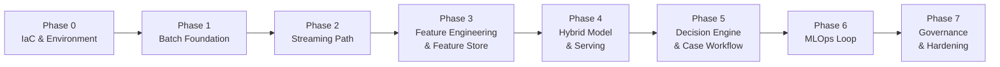
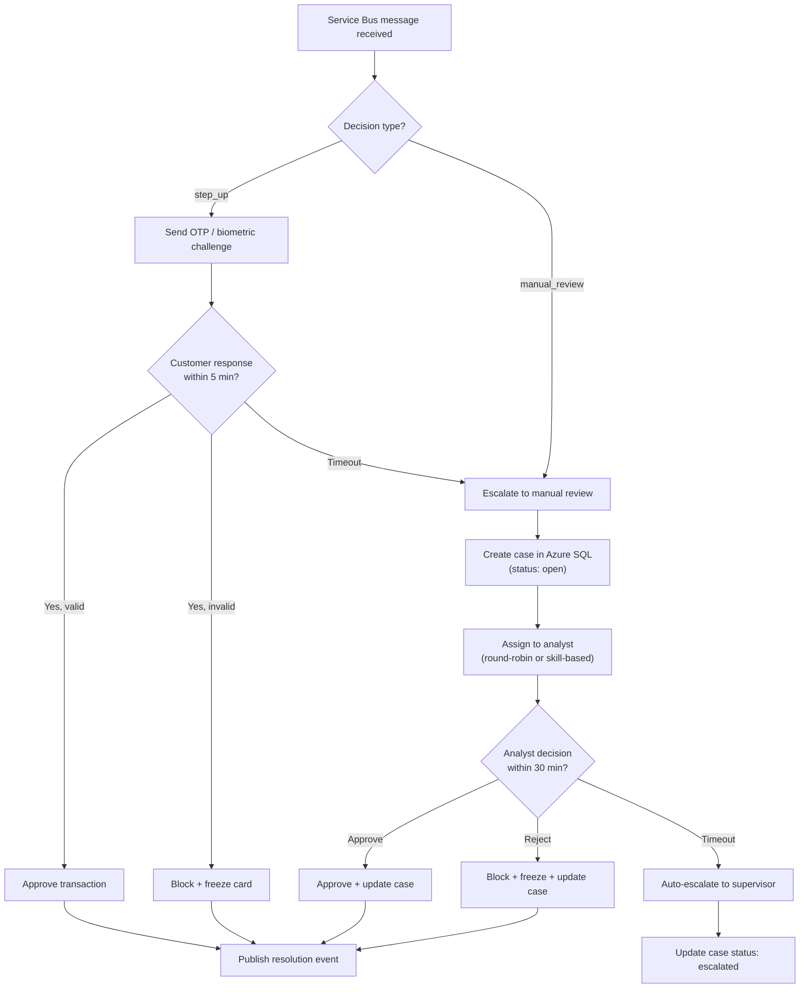

# Real-Time Fraud Detection Platform — Phased Implementation Plan

> [!CAUTION]
> **Superseded.** This was the original combined 7-phase outline, written before implementation started. Each phase has since been split into its own exhaustive, production-grade plan — `Phase_0_implementation_plan.md` through `Phase_7_implementation_plan.md` — which reflect what was actually built, including a Bicep→Terraform migration this file predates. For what was actually run, the real bugs hit, and the decisions made phase by phase, see [`Step_By_Step_Build_Walkthrough.md`](./Step_By_Step_Build_Walkthrough.md). This file is kept only for historical reference to the original scope.

> [!IMPORTANT]
> This plan breaks the entire platform into **7 sequential phases**, each independently demoable. Every component, file, Azure resource, code artifact, and verification step is specified in detail. Phases are ordered to front-load data correctness and infrastructure before the ML work — each phase de-risks everything that follows.

---

## Phase Dependency Map



---

## Phase 0 — Environment & IaC Foundation

**Goal:** Provision all core Azure infrastructure via code. Zero click-ops. Dev/staging/prod parity from day one.

**Duration:** 1–2 weeks

### 0.1 Azure Resource Provisioning (Terraform)

| Resource | Configuration | Purpose |
|---|---|---|
| **Resource Group** | `rg-fraud-detection-{env}` (dev / staging / prod) | Logical container, cost tracking |
| **Azure Data Lake Storage Gen2** | `stfraudlake{env}`, hierarchical namespace enabled, LRS (dev) / ZRS (prod) | Lakehouse storage (Bronze/Silver/Gold), checkpoints, quarantine |
| **Azure Databricks Workspace** | Premium tier (required for Unity Catalog), VNet-injected | Streaming + batch compute |
| **Azure ML Workspace** | Standard tier, linked to ADLS Gen2 and Key Vault | Feature store, training, endpoints |
| **Azure Key Vault** | `kv-fraud-{env}`, soft-delete enabled, purge protection | Secrets for Event Hubs, Redis, SQL connection strings |
| **VNet + Subnets** | `vnet-fraud-{env}`, subnets: `snet-databricks-host`, `snet-databricks-container`, `snet-private-endpoints`, `snet-aks` (reserved) | Network isolation |
| **Private Endpoints** | For ADLS Gen2, Key Vault, Azure ML, Databricks (Premium supports VNet injection natively) | No public internet on the data path |
| **Azure Monitor + Log Analytics Workspace** | `log-fraud-{env}` | Centralized monitoring for all phases |

#### Files to Create

```
infrastructure/
├── main.tf                       # Root module — wires all child modules
├── providers.tf                  # terraform/backend/provider blocks
├── variables.tf
├── outputs.tf
├── modules/
│   ├── resource-group/main.tf
│   ├── storage-account/main.tf   # ADLS Gen2
│   ├── databricks-workspace/main.tf
│   ├── azureml-workspace/main.tf
│   ├── key-vault/main.tf
│   ├── vnet/main.tf
│   ├── private-endpoints/main.tf
│   ├── log-analytics/main.tf
├── environments/
│   ├── dev.tfvars
│   ├── staging.tfvars
│   └── prod.tfvars
└── README.md
```

### 0.2 CI/CD Pipeline Skeleton

| Component | Tooling | Configuration |
|---|---|---|
| **Source control** | GitHub (or Azure DevOps Repos) | Mono-repo with branch policies: `main` (prod), `staging`, `develop` |
| **IaC pipeline** | GitHub Actions / Azure DevOps Pipeline | `infra-deploy.yml` — validates Terraform (`fmt`/`validate`) → plans → deploys to target environment on merge |
| **Data pipeline CI** | GitHub Actions | `data-ci.yml` — lint PySpark code, run unit tests (local Spark), validate schemas |
| **ML pipeline CI** | GitHub Actions | `ml-ci.yml` — lint training code, run model unit tests |
| **Branch protection** | Require PR review + passing CI before merge | Prevents broken code from reaching any environment |

#### Files to Create

```
.github/
├── workflows/
│   ├── infra-deploy.yml
│   ├── data-ci.yml
│   └── ml-ci.yml
├── CODEOWNERS
└── pull_request_template.md
```

### 0.3 Databricks Workspace Configuration

| Setting | Value | Rationale |
|---|---|---|
| **Unity Catalog** | Enable as metastore, create catalog `fraud_detection_{env}` | Consistent governance, lineage |
| **Schemas** | `bronze`, `silver`, `gold`, `quarantine`, `reference` | Medallion layer separation |
| **Secret scope** | `kv-fraud` linked to Azure Key Vault | No secrets in code |
| **Cluster policies** | `streaming-jobs` (dedicated, autoscale 2–8 nodes, Runtime 14.x LTS), `batch-jobs` (autoscale 1–4 nodes, Photon enabled) | Cost control, right-sizing |
| **Repos** | Connect GitHub repo for notebook/script sync | Version-controlled development |

#### Files to Create

```
databricks/
├── workspace-setup/
│   ├── create_catalog_schemas.sql
│   ├── cluster_policies.json
│   └── secret_scope_setup.sh
└── README.md
```

### 0.4 ADLS Gen2 Container & Directory Structure

```
stfraudlake{env}/
├── raw/                           # Landing zone for batch sources
│   └── ieee-cis/                  # IEEE-CIS CSVs from ADF
├── bronze/                        # Delta tables (managed by Unity Catalog, but physical path here)
├── silver/
├── gold/
├── quarantine/
│   ├── bronze_rejects/
│   └── silver_rejects/
├── checkpoints/                   # Structured Streaming checkpoints
│   ├── bronze_txn/
│   ├── silver_txn/
│   └── feature_eng/
├── feature-store/                 # Offline feature materialization
└── eventhubs-capture/             # Event Hubs Capture Avro archive
```

### Phase 0 — Deliverables & Verification

| Deliverable | Verification |
|---|---|
| All Azure resources provisioned via Terraform | `az resource list --resource-group rg-fraud-detection-dev` shows all resources |
| CI/CD pipelines running | Push a dummy change → pipeline triggers, validates, deploys |
| Databricks Unity Catalog configured | `SHOW SCHEMAS IN fraud_detection_dev` returns `bronze`, `silver`, `gold`, `quarantine`, `reference` |
| ADLS Gen2 containers/directories exist | `az storage fs list --account-name stfraudlakedev` |
| Key Vault populated with placeholder secrets | Databricks `dbutils.secrets.list("kv-fraud")` returns expected keys |
| Private endpoints verified | `nslookup stfraudlakedev.dfs.core.windows.net` resolves to private IP |

---

## Phase 1 — Batch Foundation (Historical Data Pipeline)

**Goal:** Load IEEE-CIS dataset, build the full Bronze → Silver → Gold medallion pipeline for batch data, train a baseline XGBoost model. No streaming yet.

**Duration:** 2–3 weeks

### 1.1 Data Acquisition & Landing

| Component | Detail |
|---|---|
| **Source dataset** | [IEEE-CIS Fraud Detection](https://www.kaggle.com/c/ieee-fraud-detection) — `train_transaction.csv`, `train_identity.csv`, `test_transaction.csv`, `test_identity.csv` |
| **Azure Data Factory pipeline** | `pl_ingest_ieee_cis` — Copy activity from source (local upload or Kaggle API → Blob → ADF) to `raw/ieee-cis/` on ADLS Gen2 |
| **Landing format** | CSV, preserved as-is in `raw/` (no transformation at landing) |
| **Trigger** | Manual (one-time load) + parameterized for re-runs |

#### Files to Create

```
data-factory/
├── pipelines/
│   ├── pl_ingest_ieee_cis.json
│   └── pl_ingest_reference_data.json
├── datasets/
│   ├── ds_raw_ieee_cis_csv.json
│   └── ds_adls_raw_landing.json
├── linked-services/
│   ├── ls_adls_gen2.json
│   └── ls_keyvault.json
└── README.md
```

### 1.2 Bronze Layer — Raw Ingestion

| Component | Detail |
|---|---|
| **Ingestion method** | Databricks Auto Loader (`cloudFiles` format) reading from `raw/ieee-cis/` |
| **Schema handling** | `cloudFiles.schemaEvolutionMode = addNewColumns`, `cloudFiles.inferColumnTypes = true` |
| **Metadata columns** | `_ingested_at` (processing timestamp), `_source_file` (source file path), `_source_partition` |
| **Output table** | `bronze.ieee_cis_transactions` (Delta, partitioned by synthetic `load_date`) |
| **Checkpoint** | `/checkpoints/bronze_ieee_cis/` |

#### Files to Create

```
databricks/
├── notebooks/
│   └── bronze/
│       ├── ingest_ieee_cis_transactions.py
│       └── ingest_ieee_cis_identity.py
```

#### Code: `ingest_ieee_cis_transactions.py`

```python
from pyspark.sql.functions import current_timestamp, input_file_name, current_date

raw_df = (
    spark.readStream
        .format("cloudFiles")
        .option("cloudFiles.format", "csv")
        .option("cloudFiles.schemaEvolutionMode", "addNewColumns")
        .option("cloudFiles.inferColumnTypes", "true")
        .option("header", "true")
        .load("abfss://raw@stfraudlakedev.dfs.core.windows.net/ieee-cis/train_transaction.csv")
)

bronze_df = (
    raw_df
        .withColumn("_ingested_at", current_timestamp())
        .withColumn("_source_file", input_file_name())
        .withColumn("load_date", current_date())
)

(bronze_df.writeStream
    .format("delta")
    .option("checkpointLocation", "/checkpoints/bronze_ieee_cis")
    .option("mergeSchema", "true")
    .partitionBy("load_date")
    .trigger(availableNow=True)  # batch-mode for historical load
    .toTable("bronze.ieee_cis_transactions"))
```

### 1.3 Silver Layer — Cleaned & Conformed

| Transformation | Implementation |
|---|---|
| **Deduplication** | `MERGE INTO silver.transactions USING bronze_batch ON TransactionID WHEN NOT MATCHED THEN INSERT` |
| **Null handling** | Categorical nulls → `"unknown"` sentinel; numeric nulls → flagged with `_is_imputed` column, imputed with median |
| **Timestamp normalization** | `TransactionDT` (seconds from reference) → proper UTC timestamp |
| **Amount validation** | `amount >= 0`; negative amounts → quarantine |
| **Categorical standardization** | `ProductCD`, `card4`, `card6`, `P_emaildomain`, `R_emaildomain` — lowercase, trim, standardize known variants |
| **Geo validation** | `addr1`, `addr2` range checks |
| **PII handling** | Card fields already anonymized in IEEE-CIS; hash email domains for privacy |
| **Data quality gate** | PyDeequ constraint suite (completeness, uniqueness, range checks) |

#### Files to Create

```
databricks/
├── notebooks/
│   └── silver/
│       ├── transform_ieee_cis_to_silver.py
│       └── data_quality_checks.py
├── src/
│   ├── transformations/
│   │   ├── __init__.py
│   │   ├── cleaning.py          # Shared cleaning functions
│   │   ├── conforming.py        # Standardization logic
│   │   └── pii_masking.py       # Hashing, masking utilities
│   └── quality/
│       ├── __init__.py
│       └── silver_constraints.py # PyDeequ constraint definitions
```

#### Code: `silver_constraints.py`

```python
from pydeequ.checks import Check, CheckLevel
from pydeequ.verification import VerificationSuite, VerificationResult

def run_silver_quality_gate(spark, df):
    check = (Check(spark, CheckLevel.Error, "ieee_cis_silver_gate")
        .isComplete("TransactionID")
        .isUnique("TransactionID")
        .isNonNegative("TransactionAmt")
        .isContainedIn("ProductCD", ["W", "H", "C", "S", "R"])
        .satisfies("TransactionAmt < 50000", "amount_upper_bound", 
                   lambda x: x >= 0.999)  # 99.9% must satisfy
    )
    result = VerificationSuite(spark).onData(df).addCheck(check).run()
    return result
```

### 1.4 Gold Layer — Business-Ready Aggregations

| Gold Table | Content | Refresh |
|---|---|---|
| `gold.daily_fraud_summary` | Daily counts of fraud/legit, fraud rate, total fraud loss | Daily batch |
| `gold.merchant_risk_scores` | Per-merchant fraud ratio, avg ticket size, fraud count | Daily batch |
| `gold.customer_risk_profile` | Per-customer fraud count, avg amount, distinct merchants | Daily batch |
| `gold.hourly_txn_stats` | Hourly transaction volume, amount distribution | Daily batch |
| `gold.product_category_analysis` | Fraud rate by product category, payment type | Daily batch |

#### Files to Create

```
databricks/
├── notebooks/
│   └── gold/
│       ├── daily_fraud_summary.py
│       ├── merchant_risk_scores.py
│       ├── customer_risk_profile.py
│       ├── hourly_txn_stats.py
│       └── product_category_analysis.py
```

### 1.5 Baseline Model Training

| Component | Detail |
|---|---|
| **Algorithm** | XGBoost with `scale_pos_weight` for class imbalance |
| **Features** | Transaction-level only (amount, product, card type, time-of-day, email domain match, address match) — no streaming features yet |
| **Splitting** | **Time-based split** — earliest 70% for train, next 15% for validation, latest 15% for test |
| **Metrics** | PR-AUC, Recall@1% FPR, Recall@5% FPR, F1 at optimal threshold |
| **Tracking** | MLflow experiment in Azure ML workspace |
| **Output** | Registered model `fraud-xgboost-baseline-v1` in Azure ML Model Registry |

#### Files to Create

```
ml/
├── training/
│   ├── config/
│   │   └── xgboost_baseline.yaml     # Hyperparameters, data paths
│   ├── train_xgboost_baseline.py      # Training script
│   ├── evaluate_model.py              # Evaluation metrics + plots
│   └── utils/
│       ├── __init__.py
│       ├── data_loader.py             # Load from Gold, time-split
│       ├── feature_engineering.py     # Batch feature computation
│       └── metrics.py                 # PR-AUC, cost-weighted metrics
├── requirements.txt
└── README.md
```

#### Code: `train_xgboost_baseline.py` (skeleton)

```python
import xgboost as xgb
import mlflow
import mlflow.xgboost
from sklearn.metrics import precision_recall_curve, auc

mlflow.set_experiment("fraud-detection-baseline")

with mlflow.start_run(run_name="xgboost-baseline-v1"):
    # Load time-split data
    X_train, y_train, X_val, y_val, X_test, y_test = load_time_split_data()
    
    # Train with class weighting
    fraud_ratio = y_train.sum() / len(y_train)
    params = {
        "objective": "binary:logistic",
        "eval_metric": "aucpr",
        "scale_pos_weight": (1 - fraud_ratio) / fraud_ratio,
        "max_depth": 6,
        "learning_rate": 0.1,
        "n_estimators": 500,
        "subsample": 0.8,
        "colsample_bytree": 0.8,
    }
    
    model = xgb.XGBClassifier(**params)
    model.fit(X_train, y_train, eval_set=[(X_val, y_val)], 
              early_stopping_rounds=50, verbose=50)
    
    # Evaluate
    y_pred_proba = model.predict_proba(X_test)[:, 1]
    precision, recall, _ = precision_recall_curve(y_test, y_pred_proba)
    pr_auc = auc(recall, precision)
    
    mlflow.log_metric("pr_auc", pr_auc)
    mlflow.log_params(params)
    mlflow.xgboost.log_model(model, "model", registered_model_name="fraud-xgboost-baseline")
```

### Phase 1 — Deliverables & Verification

| Deliverable | Verification |
|---|---|
| IEEE-CIS data landed in `raw/ieee-cis/` | `dbutils.fs.ls("abfss://raw@.../ieee-cis/")` shows all files |
| `bronze.ieee_cis_transactions` populated | `SELECT COUNT(*) FROM bronze.ieee_cis_transactions` ≈ 590k rows |
| `silver.transactions` cleaned and quality-gated | PyDeequ report passes all hard constraints; quarantine table has rejected rows with reasons |
| Gold aggregation tables populated | `SELECT * FROM gold.daily_fraud_summary LIMIT 10` returns meaningful aggregates |
| Baseline XGBoost trained with PR-AUC tracked | MLflow UI shows experiment with metrics; model registered in Azure ML |
| All code version-controlled and CI passing | GitHub Actions green on `data-ci.yml` |

---

## Phase 2 — Streaming Path (Real-Time Ingestion)

**Goal:** Stand up Event Hubs, build the transaction stream producer, get real-time events flowing into Bronze via Structured Streaming. Validate exactly-once semantics, schema evolution, and measure late-arrival distribution.

**Duration:** 2–3 weeks

### 2.1 Azure Event Hubs Setup

| Resource | Configuration |
|---|---|
| **Event Hubs Namespace** | `ehns-fraud-{env}`, Premium tier (or Dedicated for prod) |
| **Event Hub** | `eh-transactions`, 32 partitions (sized for 50k events/sec burst), 7-day retention |
| **Partition key** | `card_id` — keeps per-card event ordering for velocity features |
| **Consumer groups** | `$Default`, `bronze-ingest`, `feature-eng`, `monitoring` |
| **Capture** | Enabled → `eventhubs-capture/` on ADLS Gen2, 5-min / 300MB window |
| **Schema Registry** | `sr-fraud-{env}`, Avro schema for the canonical transaction event |
| **Auto-inflate** | Enabled, max 20 TUs (Premium) |

#### IaC Files to Add

```
infrastructure/modules/
└── eventhubs/main.tf             # Namespace, Event Hub, consumer group, auth rules
```

### 2.2 Canonical Event Schema (Avro)

```json
{
  "type": "record",
  "name": "TransactionEvent",
  "namespace": "com.fraud.detection",
  "fields": [
    {"name": "transaction_id", "type": "string"},
    {"name": "schema_version", "type": "string", "default": "1.0"},
    {"name": "event_time", "type": "string"},
    {"name": "ingestion_time", "type": "string"},
    {"name": "customer_id", "type": "string"},
    {"name": "card_id", "type": "string"},
    {"name": "amount", "type": "double"},
    {"name": "currency", "type": "string", "default": "INR"},
    {"name": "merchant_id", "type": "string"},
    {"name": "merchant_category", "type": "string"},
    {"name": "payment_method", "type": "string"},
    {"name": "device_id", "type": "string"},
    {"name": "ip_address", "type": "string"},
    {"name": "latitude", "type": ["null", "double"], "default": null},
    {"name": "longitude", "type": ["null", "double"], "default": null},
    {"name": "billing_country", "type": "string"},
    {"name": "shipping_country", "type": "string"},
    {"name": "channel", "type": "string"},
    {"name": "is_recurring", "type": "boolean", "default": false},
    {"name": "session_id", "type": "string"},
    {"name": "is_synthetic", "type": "boolean", "default": false},
    {"name": "source", "type": "string"}
  ]
}
```

#### File to Create

```
schemas/
├── transaction_event_v1.avsc
└── README.md
```

### 2.3 Transaction Stream Producer

A Python service that replays the Kaggle Credit Card Transactions dataset row-by-row into Event Hubs, simulating a live payment gateway.

| Component | Detail |
|---|---|
| **Input dataset** | [Kaggle Credit Card Transactions](https://www.kaggle.com/datasets/mlg-ulb/creditcardfraud) |
| **Replay mode** | Chronological replay with configurable speed multiplier (1x = real-time, 10x = accelerated) |
| **Event format** | Maps dataset fields to the canonical schema; fills in synthetic fields (`merchant_id`, `device_id`, `session_id`, geo-coordinates) from plausible distributions |
| **Partition key** | `card_id` (generated deterministically from dataset features) |
| **Throughput control** | Configurable batch size and inter-batch delay to hit target events/sec |
| **Synthetic fraud injection** | Separate flag `is_synthetic = true` for injected fraud patterns (Phase 4 uses this more heavily) |

#### Files to Create

```
producers/
├── transaction_producer/
│   ├── __init__.py
│   ├── producer.py               # Main producer loop
│   ├── event_mapper.py           # Maps Kaggle CSV → canonical schema
│   ├── synthetic_enricher.py     # Adds merchant/device/geo/session fields
│   ├── config.py                 # Replay speed, batch size, Event Hub config
│   ├── requirements.txt
│   └── Dockerfile
├── synthetic_fraud_generator/
│   ├── __init__.py
│   ├── generator.py              # SMOTE/ADASYN/CTGAN-based fraud generation
│   ├── injection_producer.py     # Publishes synthetic fraud to Event Hub
│   └── requirements.txt
└── README.md
```

#### Code: `producer.py` (skeleton)

```python
import asyncio
import json
import time
from azure.eventhub.aio import EventHubProducerClient
from azure.eventhub import EventData
from event_mapper import map_to_canonical_event

class TransactionProducer:
    def __init__(self, config):
        self.client = EventHubProducerClient.from_connection_string(
            config.eventhub_conn_str, 
            eventhub_name=config.eventhub_name
        )
        self.speed_multiplier = config.speed_multiplier
        self.batch_size = config.batch_size
    
    async def replay_dataset(self, dataset_path: str):
        """Replay transactions chronologically into Event Hubs."""
        df = load_and_sort_by_time(dataset_path)
        
        batch = []
        for idx, row in df.iterrows():
            event = map_to_canonical_event(row)
            event_data = EventData(json.dumps(event))
            event_data.partition_key = event["card_id"]
            batch.append(event_data)
            
            if len(batch) >= self.batch_size:
                async with self.client:
                    event_batch = await self.client.create_batch()
                    for e in batch:
                        event_batch.add(e)
                    await self.client.send_batch(event_batch)
                batch = []
                
                # Respect inter-arrival time / speed multiplier
                await asyncio.sleep(compute_delay(row, self.speed_multiplier))
```

### 2.4 Bronze Streaming Ingestion (Event Hubs → Delta)

| Component | Detail |
|---|---|
| **Source** | Azure Event Hubs via `spark.readStream.format("eventhubs")` |
| **Consumer group** | `bronze-ingest` |
| **Schema handling** | `from_json` with explicit schema matching the Avro definition; schema mismatches → DLQ |
| **Metadata** | `_ingested_at`, `_source_partition`, `enqueuedTime` (Event Hubs server time) |
| **Output** | `bronze.transactions` (Delta, partitioned by `event_date`) |
| **Trigger** | `processingTime = "5 seconds"` |
| **Back-pressure** | `maxEventsPerTrigger = 100000` |
| **DLQ** | Parse failures → `quarantine.bronze_parse_failures` + ADLS `quarantine/bronze_rejects/` |

#### Files to Create

```
databricks/
├── notebooks/
│   └── bronze/
│       ├── stream_transactions_from_eventhub.py
│       └── bronze_dlq_handler.py
├── jobs/
│   └── bronze_streaming_job.json     # Databricks job definition (API payload)
```

### 2.5 Late-Arrival Measurement

> [!IMPORTANT]
> **This is a critical step.** Before building feature engineering (Phase 3), measure the actual distribution of `enqueuedTime - event_time` across all partitions during a sustained replay run. This empirical measurement calibrates the watermark for Phase 3.

| Metric | How to Measure | Target Output |
|---|---|---|
| Late-arrival distribution | `enqueuedTime - event_time` histogram (p50, p90, p95, p99, max) | Determines watermark setting (starting at 10 min, adjust based on data) |
| Partition skew | Events per partition over a 1-hour window | Validates `card_id` as partition key distributes evenly |
| Throughput achieved | Events/sec sustained over 30 minutes | Confirms cluster sizing handles 5k–20k events/sec |
| Exactly-once validation | Compare `COUNT(DISTINCT transaction_id)` in Bronze vs. events sent by producer | Must match exactly |

#### File to Create

```
databricks/
├── notebooks/
│   └── validation/
│       ├── late_arrival_analysis.py
│       ├── partition_skew_analysis.py
│       └── exactly_once_validation.py
```

### Phase 2 — Deliverables & Verification

| Deliverable | Verification |
|---|---|
| Event Hubs provisioned with Schema Registry | Azure Portal → Event Hubs → Schema Registry shows `TransactionEvent` schema |
| Producer replays transactions at configurable speed | Producer logs show events/sec matching configured rate |
| `bronze.transactions` receiving live events | `SELECT COUNT(*), MAX(_ingested_at) FROM bronze.transactions` shows growing count |
| DLQ captures malformed events | Send intentionally malformed event → appears in `quarantine.bronze_parse_failures` |
| Late-arrival distribution measured and documented | Notebook output: histogram + p99 value → informs Phase 3 watermark |
| Exactly-once validated | Distinct count in Bronze == events sent by producer |
| Event Hubs Capture writing to ADLS | Avro files appear in `eventhubs-capture/` within 5 minutes |

---

## Phase 3 — Feature Engineering & Feature Store

**Goal:** Implement streaming feature computation (velocity, geo, behavioral), stand up Azure ML Managed Feature Store with offline + online materialization, validate point-in-time joins, add Cosmos DB for real-time graph queries.

**Duration:** 3–4 weeks

### 3.1 Streaming Feature Engineering (Spark Structured Streaming)

#### 3.1.1 Transaction-Level Features (Stateless)

| Feature | Computation | Type |
|---|---|---|
| `log_amount` | `log1p(amount)` | Numeric |
| `hour_of_day` | Extract hour from `event_time` in customer's timezone | Numeric (0–23) |
| `day_of_week` | Extract day of week | Numeric (0–6) |
| `is_weekend` | `day_of_week in (5, 6)` | Boolean |
| `is_night` | `hour_of_day in (0,1,2,3,4,5)` | Boolean |
| `amount_bin` | Bucket amount into ranges (0–100, 100–500, 500–2k, 2k–10k, 10k+) | Categorical |
| `billing_shipping_mismatch` | `billing_country != shipping_country` | Boolean |
| `payment_method_encoded` | One-hot encode `payment_method` | Categorical |
| `channel_encoded` | One-hot encode `channel` | Categorical |

#### 3.1.2 Velocity Features (Stateful, Windowed)

| Feature | Window | Key | Computation |
|---|---|---|---|
| `txn_count_5m` | 5 min sliding (1 min slide) | `card_id` | `COUNT(transaction_id)` |
| `txn_count_1h` | 1 hour sliding (5 min slide) | `card_id` | `COUNT(transaction_id)` |
| `txn_count_24h` | 24 hour tumbling | `card_id` | `COUNT(transaction_id)` |
| `avg_amount_5m` | 5 min sliding | `card_id` | `AVG(amount)` |
| `std_amount_5m` | 5 min sliding | `card_id` | `STDDEV(amount)` |
| `max_amount_5m` | 5 min sliding | `card_id` | `MAX(amount)` |
| `sum_amount_1h` | 1 hour sliding | `card_id` | `SUM(amount)` |
| `time_since_last_txn` | Stateful (per-key state) | `card_id` | Current `event_time` - last `event_time` |
| `distinct_merchants_1h` | 1 hour sliding | `customer_id` | `COUNT(DISTINCT merchant_id)` |
| `distinct_devices_24h` | 24 hour tumbling | `customer_id` | `COUNT(DISTINCT device_id)` |

**Watermark:** 10 minutes (adjust based on Phase 2 late-arrival measurement).

#### 3.1.3 Geo-Velocity Features (Separate Stream Fork, 30-min Watermark)

| Feature | Computation |
|---|---|
| `distance_from_last_txn_km` | Haversine distance between current and previous lat/long for the same `card_id` |
| `implied_speed_kmh` | `distance_from_last_txn_km / time_since_last_txn` (in hours) |
| `impossible_travel_flag` | `implied_speed_kmh > 900` (faster than commercial aviation) |
| `country_hop_flag` | `billing_country` changed between consecutive transactions |

#### 3.1.4 Behavioral / Baseline Features (Offline Batch, Joined at Serving Time)

| Feature | Source | Refresh |
|---|---|---|
| `customer_90d_avg_amount` | 90-day rolling average transaction amount per customer | Daily batch |
| `customer_90d_std_amount` | 90-day rolling stddev | Daily batch |
| `amount_zscore_vs_baseline` | `(current_amount - customer_90d_avg) / customer_90d_std` | Computed at inference from stored baseline |
| `is_first_international_txn` | First time `billing_country` differs from registered country | Daily batch |
| `customer_tenure_days` | Days since first transaction | Daily batch |

#### Files to Create

```
databricks/
├── notebooks/
│   └── features/
│       ├── stateless_features.py
│       ├── velocity_features.py
│       ├── geo_velocity_features.py
│       └── behavioral_baseline_features.py
├── src/
│   └── features/
│       ├── __init__.py
│       ├── transaction_features.py    # Stateless feature transforms
│       ├── velocity_features.py       # Windowed aggregation logic
│       ├── geo_features.py            # Haversine, impossible travel
│       └── common.py                  # Shared utilities (haversine function, etc.)
├── tests/
│   └── test_features/
│       ├── test_transaction_features.py
│       ├── test_velocity_features.py
│       └── test_geo_features.py
```

### 3.2 Azure ML Managed Feature Store

| Component | Configuration |
|---|---|
| **Feature Store** | `fs-fraud-{env}` linked to Azure ML workspace |
| **Offline store** | ADLS Gen2 / Delta (same storage account) |
| **Online store** | Azure Managed Redis (not legacy Azure Cache for Redis) |
| **Entities** | `card_id`, `customer_id`, `merchant_id`, `device_id` |

#### Feature Sets to Register

| Feature Set Name | Entity | Features | Materialization |
|---|---|---|---|
| `card_velocity_features` | `card_id` | `txn_count_5m`, `txn_count_1h`, `avg_amount_5m`, `std_amount_5m`, `max_amount_5m`, `sum_amount_1h`, `time_since_last_txn` | Online: every 5 min. Offline: every 1 hour |
| `customer_velocity_features` | `customer_id` | `txn_count_24h`, `distinct_merchants_1h`, `distinct_devices_24h` | Online: every 5 min. Offline: every 1 hour |
| `geo_velocity_features` | `card_id` | `distance_from_last_txn_km`, `implied_speed_kmh`, `impossible_travel_flag` | Online: every 5 min. Offline: every 1 hour |
| `merchant_risk_features` | `merchant_id` | `merchant_fraud_ratio`, `merchant_avg_ticket`, `merchant_txn_count_30d` | Online: every 1 hour. Offline: daily |
| `customer_baseline_features` | `customer_id` | `customer_90d_avg_amount`, `customer_90d_std_amount`, `customer_tenure_days`, `is_first_international_txn` | Online: daily. Offline: daily |

#### Files to Create

```
feature-store/
├── entities/
│   ├── card_entity.yaml
│   ├── customer_entity.yaml
│   ├── merchant_entity.yaml
│   └── device_entity.yaml
├── feature-specs/
│   ├── card_velocity/
│   │   ├── spec.yaml
│   │   └── transformation.py
│   ├── customer_velocity/
│   │   ├── spec.yaml
│   │   └── transformation.py
│   ├── geo_velocity/
│   │   ├── spec.yaml
│   │   └── transformation.py
│   ├── merchant_risk/
│   │   ├── spec.yaml
│   │   └── transformation.py
│   └── customer_baseline/
│       ├── spec.yaml
│       └── transformation.py
├── register_feature_store.py
└── README.md
```

### 3.3 Point-in-Time Join Validation

> [!IMPORTANT]
> This is the **single most important validation** in the entire pipeline. If point-in-time joins are wrong, the model will silently train on future information and produce inflated offline metrics that collapse in production.

| Test | Method | Expected Outcome |
|---|---|---|
| **No future leakage** | For a transaction at time T, retrieve features → verify all feature timestamps ≤ T | Zero violations |
| **Correct feature values** | Manually compute velocity features for a known card over a known window → compare to feature store retrieval | Values match within floating-point tolerance |
| **Null handling for new entities** | Query features for a brand-new `card_id` with no history | Returns nulls/defaults, not errors |

#### File to Create

```
feature-store/
├── tests/
│   ├── test_point_in_time_join.py
│   ├── test_online_offline_consistency.py
│   └── test_new_entity_handling.py
```

### 3.4 Cosmos DB (Gremlin API) — Real-Time Graph Queries

| Component | Detail |
|---|---|
| **Azure Cosmos DB** | Gremlin API, provisioned throughput (start at 400 RU/s, autoscale to 4000) |
| **Graph model** | Vertices: `Customer`, `Card`, `Device`, `Merchant`, `IP`. Edges: `OWNS` (customer→card), `USED_DEVICE` (customer→device), `TRANSACTED_AT` (card→merchant), `USED_IP` (card→IP) |
| **Edge writer** | Streaming Databricks job reads from Silver, upserts edges in Cosmos DB |
| **Query at inference** | 1-hop bounded traversals: "distinct customers using this device in 24h", "distinct cards from this IP in 1h" |

#### Files to Create

```
graph/
├── cosmos_setup/
│   ├── create_graph.py           # Initialize graph, define partition keys
│   └── graph_schema.md           # Vertex/edge type documentation
├── edge_writer/
│   ├── stream_edges_to_cosmos.py # Streaming job: Silver → Cosmos edges
│   └── edge_mapper.py            # Maps Silver rows to graph edges
├── graph_queries/
│   ├── device_sharing_query.py   # "Distinct customers on this device in 24h"
│   └── ip_sharing_query.py       # "Distinct cards from this IP in 1h"
└── README.md

infrastructure/modules/
├── cosmos-db/main.tf
└── managed-redis/main.tf
```

### 3.5 Graph Feature Batch Computation (GraphFrames)

| Component | Detail |
|---|---|
| **Compute** | Dedicated Databricks job cluster, scheduled every 1 hour |
| **Algorithm** | GraphFrames: PageRank, degree centrality, connected components (community detection) |
| **Output** | Materialized to feature store as slowly-changing features per entity |

#### File to Create

```
graph/
├── batch_graph_features/
│   ├── compute_graph_metrics.py  # PageRank, centrality, communities
│   └── materialize_to_store.py   # Write to offline + online feature store
```

### 3.6 Late-Arrival Metrics & Monitoring

| Metric | Emission Target | Alert Threshold |
|---|---|---|
| `late_events_dropped_count` per partition per minute | Azure Monitor | Spike > 2× baseline |
| `feature_materialization_lag_seconds` | Azure Monitor | > 30 seconds |
| `online_store_staleness_seconds` | Azure Monitor | > 60 seconds |

### Phase 3 — Deliverables & Verification

| Deliverable | Verification |
|---|---|
| Streaming feature jobs running on all feature families | `silver.transactions` → velocity/geo features materializing in Delta |
| Feature store registered with all 5 feature sets | `fs_client.feature_sets.list()` returns all 5 |
| Online store (Managed Redis) populated | `init_online_lookup()` returns feature vector for known `card_id` in < 10ms |
| Point-in-time join validated | Test notebook passes all 3 join correctness tests |
| Online ↔ offline consistency validated | Same entity + same timestamp → same feature values (within tolerance) |
| Cosmos DB graph populated and queryable | Gremlin query for known device returns correct customer count |
| GraphFrames batch job producing centrality/community features | Feature store contains `pagerank`, `degree_centrality`, `community_id` for entities |
| Late-arrival metrics flowing to Azure Monitor | Dashboard shows `late_events_dropped_count` |

---

## Phase 4 — Hybrid Model & Real-Time Serving

**Goal:** Train the full hybrid ensemble (XGBoost + Autoencoder + Isolation Forest + meta-learner), deploy to Azure ML Managed Online Endpoint, wire up the scoring path with feature retrieval and fallback/circuit-breaker logic.

**Duration:** 3–4 weeks

### 4.1 Supervised Model (XGBoost / LightGBM)

| Component | Detail |
|---|---|
| **Training data** | IEEE-CIS + synthetic augmentation from the fraud generator |
| **Features** | Full feature set from feature store (retrieved via point-in-time join) |
| **Class imbalance** | (a) `scale_pos_weight` / focal loss, (b) synthetic minority augmentation (capped at 3:1 synthetic:real), (c) evaluate on PR-AUC |
| **Splitting** | Time-based: train on months 1–4, validate on month 5, test on month 6 |
| **Hyperparameter tuning** | Azure ML HyperDrive (Bayesian search) |
| **Calibration** | Platt scaling (sigmoid) or isotonic regression on the validation set |
| **SHAP** | Compute SHAP values for explainability — required for compliance |

#### Files to Create

```
ml/
├── training/
│   ├── train_supervised.py
│   ├── calibrate_model.py         # Platt / isotonic calibration
│   ├── compute_shap.py            # SHAP value computation
│   ├── config/
│   │   ├── xgboost_full.yaml
│   │   └── lightgbm_full.yaml
│   └── hyperdrive_config.py       # HyperDrive search space
```

### 4.2 Unsupervised — Autoencoder

| Component | Detail |
|---|---|
| **Architecture** | Dense autoencoder (encoder: input→128→64→32, decoder: 32→64→128→input), trained in PyTorch |
| **Training data** | **Legitimate transactions only** — approved + no chargeback within 14-day lookback |
| **Loss** | MSE reconstruction loss with **trimmed loss** (discard top 1% per-sample loss to guard against contamination) |
| **Output** | Reconstruction error as anomaly score |
| **Calibration** | Fit an isotonic regression on reconstruction error → fraud probability, using a held-out set with known fraud labels |
| **Retraining** | Weekly (or drift-triggered), using most recent 30-day window of legitimate traffic |

#### Files to Create

```
ml/
├── training/
│   ├── train_autoencoder.py
│   ├── models/
│   │   └── autoencoder.py         # PyTorch model definition
│   └── config/
│       └── autoencoder.yaml
```

#### Code: `autoencoder.py`

```python
import torch
import torch.nn as nn

class FraudAutoencoder(nn.Module):
    def __init__(self, input_dim):
        super().__init__()
        self.encoder = nn.Sequential(
            nn.Linear(input_dim, 128), nn.ReLU(), nn.BatchNorm1d(128), nn.Dropout(0.2),
            nn.Linear(128, 64), nn.ReLU(), nn.BatchNorm1d(64), nn.Dropout(0.2),
            nn.Linear(64, 32), nn.ReLU(),
        )
        self.decoder = nn.Sequential(
            nn.Linear(32, 64), nn.ReLU(), nn.BatchNorm1d(64),
            nn.Linear(64, 128), nn.ReLU(), nn.BatchNorm1d(128),
            nn.Linear(128, input_dim),
        )
    
    def forward(self, x):
        encoded = self.encoder(x)
        decoded = self.decoder(encoded)
        return decoded
    
    def reconstruction_error(self, x):
        return torch.mean((x - self.forward(x)) ** 2, dim=1)
```

### 4.3 Unsupervised — Isolation Forest

| Component | Detail |
|---|---|
| **Library** | scikit-learn `IsolationForest` |
| **Training data** | Same legitimate-only window as Autoencoder |
| **Parameters** | `n_estimators=300`, `contamination=0.001`, `max_samples="auto"` |
| **Output** | Anomaly score (decision function value) |
| **Calibration** | Isotonic regression on anomaly score → fraud probability |

#### File to Create

```
ml/
├── training/
│   └── train_isolation_forest.py
```

### 4.4 Stacking Meta-Learner

| Component | Detail |
|---|---|
| **Input** | 3 calibrated probabilities from supervised, autoencoder, isolation forest |
| **Model** | Logistic regression with `class_weight='balanced'`, regularization `C=0.1` |
| **Training** | On a held-out meta-training set (separate from component model training sets — time-split) |
| **Output** | Final fraud probability [0, 1] |
| **Versioning** | Packaged as part of the ensemble artifact in Azure ML Model Registry |

#### File to Create

```
ml/
├── training/
│   └── train_meta_learner.py
├── ensemble/
│   ├── __init__.py
│   ├── ensemble_model.py          # Wraps all 3 models + meta-learner
│   └── model_artifact_builder.py  # Packages ensemble for registry
```

### 4.5 Synthetic Fraud Generator (Training Augmentation)

| Component | Detail |
|---|---|
| **Method 1** | SMOTE / ADASYN for simple tabular augmentation |
| **Method 2** | CTGAN trained on the fraud subclass for more realistic synthetic rows |
| **Output (batch)** | Parquet files for offline training augmentation |
| **Output (stream)** | Inject into Event Hub with `is_synthetic = true` for live adversarial testing |
| **Cap** | Synthetic:real fraud ratio ≤ 3:1 to prevent learning generator artifacts |

#### Files to Create

```
ml/
├── data_augmentation/
│   ├── smote_augmentation.py
│   ├── ctgan_augmentation.py
│   └── config/
│       └── augmentation.yaml
```

### 4.6 Azure ML Managed Online Endpoint

| Component | Configuration |
|---|---|
| **Endpoint** | `ep-fraud-scoring-{env}`, Managed Online Endpoint |
| **Deployment** | `dp-ensemble-v1`, instance type `Standard_DS3_v2` (or GPU instance if autoencoder warrants), min 2 instances |
| **Scoring script** | Receives transaction → fetches online features → runs ensemble → returns score + SHAP top-5 |
| **Model artifact** | Contains: XGBoost model, Autoencoder weights, Isolation Forest, calibrators, meta-learner, feature schema |

#### Files to Create

```
ml/
├── serving/
│   ├── score.py                   # Scoring script for Managed Online Endpoint
│   ├── deployment_config.yaml     # Endpoint/deployment configuration
│   └── environment.yaml           # Conda/pip environment spec
```

#### Code: `score.py` (skeleton)

```python
import json
import mlflow
import numpy as np
from azureml.featurestore import init_online_lookup

def init():
    global ensemble, feature_lookup
    ensemble = mlflow.pyfunc.load_model("model")  # Loads the full ensemble artifact
    feature_lookup = init_online_lookup()

def run(raw_data):
    data = json.loads(raw_data)
    txn = data["transaction"]
    
    # 1. Fetch online features
    features = feature_lookup.get_online_features(
        entity_ids={
            "card_id": txn["card_id"],
            "customer_id": txn["customer_id"],
            "merchant_id": txn["merchant_id"],
            "device_id": txn["device_id"],
        }
    )
    
    # 2. Combine transaction-level + store features
    feature_vector = build_feature_vector(txn, features)
    
    # 3. Score ensemble
    result = ensemble.predict(feature_vector)
    
    return json.dumps({
        "transaction_id": txn["transaction_id"],
        "fraud_probability": float(result["probability"]),
        "scoring_mode": "full",
        "shap_top_features": result["shap_top_5"],
        "model_version": result["model_version"],
    })
```

### 4.7 Fallback & Circuit Breaker Logic

| Failure Mode | Fallback | `scoring_mode` |
|---|---|---|
| Redis (feature store) unreachable | Score with transaction-level features only + conservative bias (+0.15) | `partial_features` |
| ML endpoint timeout (>100ms) or 5xx | Rules-only engine (pre-cached velocity + amount thresholds) | `rules_only` |
| Full scoring path down | Default-approve below fraud-ops-agreed amount cap | `default_approve` |

#### Files to Create

```
ml/
├── serving/
│   ├── fallback_rules_engine.py   # Rule-based scoring for degraded mode
│   └── circuit_breaker.py         # Circuit breaker wrapper (Python)
```

### 4.8 Azure ML Pipeline (Orchestrated Training)

```
Azure ML Pipeline:
    Step 1: Offline feature retrieval (point-in-time join)
    Step 2: Data split (time-based)
    Step 3: Train supervised (XGBoost/LightGBM) → calibrate
    Step 4: Train autoencoder on legitimate window → calibrate
    Step 5: Train isolation forest on legitimate window → calibrate
    Step 6: Train meta-learner on held-out set
    Step 7: Evaluate ensemble on test set (PR-AUC, Recall@FPR, cost-weighted)
    Step 8: Quality gate — register model only if metrics ≥ threshold
    Step 9: Register ensemble artifact in Model Registry
```

#### File to Create

```
ml/
├── pipelines/
│   ├── training_pipeline.py       # Azure ML pipeline definition
│   └── pipeline_config.yaml
```

### Phase 4 — Deliverables & Verification

| Deliverable | Verification |
|---|---|
| Supervised model trained with full features, PR-AUC tracked | MLflow shows improvement over Phase 1 baseline |
| Autoencoder trained on legitimate traffic, reconstruction error calibrated | Calibration plot shows well-calibrated probabilities |
| Isolation Forest trained and calibrated | Anomaly scores → probabilities via isotonic regression |
| Meta-learner trained, ensemble packaged | Ensemble artifact registered in Azure ML Model Registry |
| Managed Online Endpoint live | `az ml online-endpoint invoke` returns score + SHAP in < 100ms |
| Fallback logic tested | Kill Redis → endpoint returns `scoring_mode: partial_features`; kill ML → returns `rules_only` |
| Synthetic fraud generator producing augmented training data | Training set shows controlled synthetic:real ratio ≤ 3:1 |
| End-to-end latency budget validated | p99 < 100ms (feature lookup + inference + ensemble + decision) |

---

## Phase 5 — Decision Engine & Case Workflow

**Goal:** Build the full decision layer — Azure Function fast-path (approve/block), Service Bus fan-out, Logic App step-up/review workflow, Azure SQL case management, compliance audit trail.

**Duration:** 2–3 weeks

### 5.1 Azure Function — Decision Engine (Fast Path)

| Component | Detail |
|---|---|
| **Runtime** | Python 3.11 (or .NET 8 if using Polly for circuit breakers) |
| **Trigger** | HTTP trigger (called by the scoring endpoint or directly by the payment gateway) |
| **Input** | Scoring response: `transaction_id`, `fraud_probability`, `scoring_mode`, `shap_top_features` |
| **Thresholds** | From Azure App Configuration (not hardcoded): `approve_threshold = 0.10`, `step_up_threshold = 0.60`, `block_threshold = 0.90` |
| **Actions** | See decision table below |

| Score Range | Action | Implementation |
|---|---|---|
| < 0.10 | **Approve** | Return `decision: approve` immediately |
| 0.10 – 0.60 | **Step-up auth** | Publish to Service Bus Topic → return `decision: step_up` |
| 0.60 – 0.90 | **Manual review** | Publish to Service Bus Topic → return `decision: review` |
| > 0.90 | **Block + freeze** | Call card-freeze API → return `decision: block` |

#### Files to Create

```
decision-engine/
├── function-app/
│   ├── host.json
│   ├── local.settings.json
│   ├── requirements.txt
│   ├── decision_function/
│   │   ├── __init__.py            # Azure Function entry point
│   │   ├── function.json
│   │   ├── decision_logic.py      # Threshold evaluation
│   │   ├── service_bus_publisher.py
│   │   └── config_client.py       # Azure App Configuration client
│   └── health_check/
│       ├── __init__.py
│       └── function.json
├── tests/
│   ├── test_decision_logic.py
│   └── test_threshold_bands.py
└── README.md
```

### 5.2 Azure Service Bus Topic

| Component | Configuration |
|---|---|
| **Namespace** | `sbns-fraud-{env}`, Premium tier |
| **Topic** | `fraud-case-events` |
| **Subscriptions** | `sub-logic-app` (step-up/review workflow), `sub-case-mgmt` (Azure SQL insert), `sub-compliance-audit` (immutable audit log) |
| **DLQ** | Enabled on all subscriptions, `maxDeliveryCount = 5`, exponential backoff |
| **DLQ monitor** | Dedicated Azure Function polling DLQ, logging to Application Insights, raising P1 alert |

#### IaC Files to Add

```
infrastructure/modules/
├── service-bus/main.tf
└── app-configuration/main.tf
```

#### Files to Create

```
decision-engine/
├── dlq-monitor/
│   ├── __init__.py
│   ├── function.json
│   └── dlq_handler.py            # Polls DLQ, logs, alerts
```

### 5.3 Azure SQL — Case Management

| Table | Purpose | Key Columns |
|---|---|---|
| `cases` | Fraud case records | `case_id` (PK), `transaction_id` (unique), `fraud_score`, `scoring_mode`, `decision`, `status` (open/in_review/escalated/resolved/review_failed), `assigned_analyst`, `created_at`, `updated_at`, `resolution`, `resolution_notes` |
| `case_events` | Audit trail of all state changes | `event_id` (PK), `case_id` (FK), `event_type`, `event_data` (JSON), `created_at`, `created_by` |
| `threshold_audit` | Log of all threshold configuration changes | `change_id` (PK), `parameter_name`, `old_value`, `new_value`, `changed_by`, `changed_at` |
| `merchant_category_map` | Reference data: merchant category standardization | `raw_category`, `standardized_category`, `updated_at` |
| `fx_rates` | Reference data: daily FX rates | `currency_pair`, `rate`, `rate_date` |

**Idempotency:** Case insert uses `MERGE ON transaction_id` — handles at-least-once Service Bus delivery.

#### Files to Create

```
database/
├── migrations/
│   ├── V001__create_cases_table.sql
│   ├── V002__create_case_events_table.sql
│   ├── V003__create_threshold_audit_table.sql
│   ├── V004__create_reference_tables.sql
│   └── V005__create_indexes.sql
├── stored-procedures/
│   ├── usp_upsert_case.sql        # Idempotent MERGE on transaction_id
│   └── usp_update_case_status.sql
└── README.md

infrastructure/modules/
├── azure-sql/main.tf
```

### 5.4 Azure Logic App — Step-Up / Manual Review Workflow



#### Files to Create

```
workflows/
├── logic-app/
│   ├── step-up-review-workflow.json  # Logic App definition (Terraform-deployed)
│   └── README.md

infrastructure/modules/
├── logic-app/main.tf
```

### 5.5 Compliance Audit Logging

| Component | Detail |
|---|---|
| **Audit subscriber** | Third Service Bus subscription → writes immutable event records |
| **Storage** | Azure Table Storage or dedicated `audit.decision_log` Delta table (append-only, no deletes/updates) |
| **Content** | `transaction_id`, `timestamp`, `fraud_score`, `scoring_mode`, `decision`, `model_version`, `threshold_config_version`, `shap_top_features` |
| **Retention** | 7 years (regulatory requirement) |

#### File to Create

```
decision-engine/
├── audit-logger/
│   ├── __init__.py
│   ├── function.json
│   └── audit_writer.py
```

### Phase 5 — Deliverables & Verification

| Deliverable | Verification |
|---|---|
| Azure Function decision engine deployed | HTTP POST with a score → correct decision returned in < 25ms |
| Threshold changes via App Configuration (no redeploy) | Change threshold → Function uses new value on next request |
| Service Bus Topic with 3 subscriptions | `az servicebus topic subscription list` shows all 3 |
| Azure SQL case management schema deployed | Run migrations → tables exist with correct schema |
| Idempotent case upsert working | Send same `transaction_id` twice → only 1 case record (MERGE) |
| Logic App workflow end-to-end | Trigger step-up → OTP sent → timeout → case created in SQL → analyst assigned |
| DLQ monitor alerting | Force a DLQ message → Application Insights alert fires |
| Compliance audit log writing | Every decision appears in the audit log with full context |
| Threshold audit trail | Change a threshold in App Configuration → logged in `threshold_audit` table |

---

## Phase 6 — MLOps Loop (Continuous Improvement)

**Goal:** Close the ML lifecycle loop — MLflow tracking, model registry with lineage, drift monitors, automated retraining triggers, canary/shadow deployment, A/B testing infrastructure.

**Duration:** 2–3 weeks

### 6.1 MLflow Experiment Tracking (Azure ML Native)

| Component | Detail |
|---|---|
| **Experiment** | `fraud-detection-ensemble` — tracks all retraining runs |
| **Logged per run** | Params (hyperparams, data window, augmentation ratio), metrics (PR-AUC, Recall@1%FPR, cost-weighted metric), artifacts (model files, calibration plots, SHAP summary plot, confusion matrix) |
| **Tags** | `trigger_type` (scheduled / drift_triggered / manual), `data_window_start`, `data_window_end` |

### 6.2 Model Registry & Versioning

| Component | Detail |
|---|---|
| **Model name** | `fraud-ensemble` |
| **Versioned artifact** | Contains: supervised model, autoencoder, isolation forest, all calibrators, meta-learner, feature schema |
| **Stages** | `Development` → `Staging` → `Production` |
| **Lineage** | Each model version links to: training run ID, training data snapshot (Delta table version), feature store version |

### 6.3 Drift Monitoring

| Monitor | Metric | Threshold | Action |
|---|---|---|---|
| **Feature drift** | PSI (Population Stability Index) per feature | PSI > 0.2 (any feature) | Alert + trigger retraining |
| **Prediction drift** | PSI on predicted probabilities vs. reference window | PSI > 0.15 | Alert + trigger retraining |
| **Performance drift** | Daily PR-AUC (computed on labeled feedback from chargebacks) | PR-AUC drops > 5% from baseline | Alert + urgent retraining |
| **Data quality drift** | Quarantine rate (bronze + silver rejects / total) | > 2% | Alert (may indicate upstream change, not model issue) |

| Tool | Configuration |
|---|---|
| **Azure ML Data Drift Monitor** or **Evidently AI** | Scheduled daily, reference window = last successful model's training data |
| **Output** | `gold.model_performance_daily` (daily metrics), `gold.drift_report` (per-feature PSI) |
| **Trigger mechanism** | Azure Event Grid event → triggers Azure ML retraining pipeline |

#### Files to Create

```
ml/
├── monitoring/
│   ├── drift_monitor.py           # Evidently / Azure ML drift computation
│   ├── performance_tracker.py     # Daily PR-AUC from chargeback labels
│   ├── drift_trigger.py           # Event Grid → retraining pipeline trigger
│   └── config/
│       └── drift_config.yaml      # Reference window, thresholds
├── pipelines/
│   └── retraining_pipeline.py     # Full retraining pipeline (reuse from Phase 4, add auto-trigger)
```

### 6.4 Automated Retraining Pipeline

```
Trigger (scheduled weekly OR drift event, whichever first)
    ↓
Step 1: Snapshot current training data (Delta table version)
    ↓
Step 2: Offline feature retrieval (point-in-time join)
    ↓
Step 3: Time-based split
    ↓
Step 4: Train supervised model (XGBoost/LightGBM)
Step 5: Train autoencoder (legitimate traffic, 14-day chargeback filter, trimmed loss)
Step 6: Train isolation forest (same legitimate window)
    ↓
Step 7: Calibrate all 3 component scores
    ↓
Step 8: Train meta-learner on held-out meta-training set
    ↓
Step 9: Evaluate ensemble on test set
    ↓
Step 10: Quality gate — PR-AUC ≥ current production model's PR-AUC - 0.01
    ↓
Step 11: Register model in registry (stage: Development)
    ↓
Step 12: Auto-promote to Staging → trigger canary deployment
```

### 6.5 Canary / Shadow Deployment

| Strategy | Implementation |
|---|---|
| **Shadow deployment** | New model scores live traffic in parallel via a second deployment on the same Managed Online Endpoint; responses are logged but not used for decisions |
| **Canary** | Route 5% → 10% → 25% → 50% → 100% of traffic to the new model over 48 hours |
| **Rollback criterion** | If new model's precision drops > 2% OR recall drops > 5% at any stage → automatic rollback to previous version |
| **Promotion** | After 48 hours with no regression → auto-promote to Production stage in registry |

#### Files to Create

```
ml/
├── deployment/
│   ├── canary_deployment.py       # Gradual traffic shift logic
│   ├── shadow_scorer.py           # Parallel scoring for comparison
│   ├── rollback.py                # Automatic rollback on regression
│   └── config/
│       └── canary_config.yaml     # Traffic percentages, duration, rollback thresholds

.github/
├── workflows/
│   └── ml-deploy.yml              # CD pipeline for model deployment
```

### 6.6 Gold Layer — Model Performance Tables

| Table | Refresh | Content |
|---|---|---|
| `gold.model_performance_daily` | Daily | PR-AUC, precision, recall, F1, cost-weighted metric by model version |
| `gold.drift_report` | Daily | PSI per feature, prediction distribution comparison |
| `gold.retraining_history` | On each retraining | Run ID, trigger type, metrics before/after, promotion status |

### Phase 6 — Deliverables & Verification

| Deliverable | Verification |
|---|---|
| MLflow tracking all training runs with full lineage | MLflow UI shows experiments with params, metrics, artifacts, linked data versions |
| Model registry with versioned ensemble artifacts | `az ml model list --name fraud-ensemble` shows versions with stages |
| Drift monitor running daily | `gold.drift_report` populated; PSI values visible |
| Drift-triggered retraining fires automatically | Inject artificial drift → retraining pipeline kicks off |
| Canary deployment working | New model receives configured traffic %; metrics tracked per version |
| Automatic rollback tested | Deploy a deliberately bad model → rollback triggers automatically |
| `gold.model_performance_daily` populated | Power BI can query daily model metrics |

---

## Phase 7 — Governance, Hardening & Production Readiness

**Goal:** Harden security, complete governance setup, build operational dashboards, conduct PCI-DSS scope review, finalize documentation, and perform end-to-end load testing.

**Duration:** 2–3 weeks

### 7.1 Microsoft Purview — Data Catalog & Lineage

| Component | Detail |
|---|---|
| **Purview account** | `pv-fraud-{env}` |
| **Scanned sources** | ADLS Gen2 (Bronze/Silver/Gold), Azure SQL, Event Hubs, Azure ML |
| **Lineage** | Automated from Databricks → Delta → Feature Store → Model → Endpoint |
| **PII classification** | Built-in classifiers for email, IP, device ID; custom classifier for card tokens |
| **Glossary** | Business terms for all Gold table columns (fraud rate, velocity, risk score) |

#### Files to Create / IaC

```
infrastructure/modules/
├── purview/main.tf

governance/
├── purview-setup/
│   ├── register_sources.py
│   ├── pii_classification_rules.json
│   └── business_glossary.csv
```

### 7.2 Network & Security Hardening

| Control | Implementation | Verification |
|---|---|---|
| **Private endpoints** | All data services (ADLS, Redis, SQL, Event Hubs, Cosmos DB) accessible only via private endpoint | `nslookup` resolves to private IPs; public access disabled |
| **VNet integration** | Azure Functions, Azure ML endpoints in VNet | No public ingress to scoring path |
| **Managed identities** | All service-to-service auth uses system-assigned managed identities | Zero shared keys in Key Vault (connection strings only for legacy services) |
| **Key Vault access policies** | Minimum-privilege RBAC; Function app → only read secrets; Databricks → only read secrets | Audit Key Vault access logs |
| **Network Security Groups** | Restrict inter-subnet traffic to required ports only | NSG flow logs analyzed |
| **DDoS protection** | Azure DDoS Standard on the VNet (if external-facing) | DDoS plan associated |

### 7.3 PCI-DSS Scope Review

| Checklist Item | Status | Evidence |
|---|---|---|
| PAN never enters the pipeline (tokenized upstream) | ✅ | Schema only has `card_id` (token), never full PAN |
| IP addresses hashed before Silver | ✅ | `pii_masking.py` applies salted hash |
| Column-level ACLs on PII columns | ✅ | Unity Catalog dynamic views mask PII for non-privileged users |
| Encryption at rest | ✅ | ADLS Gen2: Microsoft-managed keys (or CMK). Azure SQL: TDE enabled |
| Encryption in transit | ✅ | All connections require TLS 1.2+ |
| Access logging | ✅ | Diagnostic settings enabled on all services → Log Analytics |

### 7.4 Operational Dashboards (Power BI)

| Dashboard | Audience | Key Metrics |
|---|---|---|
| **Fraud Operations** | Fraud analysts | Open cases, review queue depth, SLA compliance (% reviewed within 30 min), step-up success rate |
| **Model Performance** | Data science team | PR-AUC trend, precision/recall by threshold, feature drift PSI, scoring mode distribution |
| **Executive** | Leadership | Total fraud loss ($), fraud rate trend, false positive rate (customer friction), model uptime |
| **System Health** | Platform engineers | Streaming lag, endpoint latency (p50/p95/p99), throughput (events/sec), error rates, DLQ depth |
| **Compliance** | Audit/compliance | Decision audit trail, threshold change log, PII access log, data lineage |

#### Files to Create

```
dashboards/
├── power-bi/
│   ├── fraud_operations.pbix
│   ├── model_performance.pbix
│   ├── executive_summary.pbix
│   ├── system_health.pbix
│   └── compliance.pbix
├── synapse/
│   └── views/                     # Serverless SQL views over Gold Delta tables
│       ├── vw_daily_fraud_summary.sql
│       ├── vw_model_performance.sql
│       ├── vw_case_analytics.sql
│       └── vw_system_metrics.sql
```

### 7.5 Azure Monitor Alerting

| Alert | Condition | Severity | Action |
|---|---|---|---|
| Scoring endpoint latency | p99 > 100ms for 5 consecutive minutes | Sev 1 | Page on-call, auto-scale endpoint |
| Streaming job lag | Consumer lag > 20 min | Sev 1 | Page on-call |
| DLQ messages | Any message in Service Bus DLQ | Sev 1 | P1 alert to fraud-ops |
| Feature store staleness | Online features > 60s old | Sev 2 | Alert data engineering |
| Quarantine rate spike | Bronze/Silver reject rate > 2% | Sev 2 | Alert data engineering |
| Model drift detected | PSI > 0.2 on any feature | Sev 3 | Auto-trigger retraining |
| Endpoint error rate | 5xx rate > 1% | Sev 1 | Page on-call, check circuit breakers |

#### Files to Create

```
infrastructure/modules/
├── alerts/main.tf                 # All Azure Monitor alert rules

monitoring/
├── alert-config/
│   └── alert_rules.yaml           # Alert definitions for IaC
├── runbooks/
│   ├── streaming_lag_runbook.md
│   ├── endpoint_degradation_runbook.md
│   ├── dlq_investigation_runbook.md
│   └── drift_retraining_runbook.md
```

### 7.6 Load Testing & Chaos Engineering

| Test | Tool | Target |
|---|---|---|
| **Throughput test** | Azure Load Testing / Locust | Endpoint handles 5k–20k concurrent scoring requests/sec with p99 < 100ms |
| **Burst test** | Locust | Endpoint handles 50k events/sec burst for 5 minutes |
| **Chaos: Kill Redis** | Azure Chaos Studio | Fallback to `partial_features` mode within 1 second |
| **Chaos: Kill ML endpoint** | Azure Chaos Studio | Fallback to `rules_only` mode within 1 second |
| **Chaos: Kill Databricks streaming** | Manual | Verify Event Hubs Capture continues; streaming resumes from checkpoint on restart |
| **Chaos: Poison Service Bus message** | Manual | DLQ handler fires, alert raised, case parked as `review_failed` |

#### Files to Create

```
tests/
├── load-tests/
│   ├── locustfile.py              # Load test scenarios
│   └── config.yaml
├── chaos/
│   ├── chaos_experiments.json     # Azure Chaos Studio experiment definitions
│   └── README.md
```

### 7.7 Documentation & Runbooks

| Document | Content |
|---|---|
| **Architecture Decision Records (ADRs)** | Key design decisions with rationale (why Azure ML over AI Foundry, why meta-learner over fixed weights, etc.) |
| **Operational Runbooks** | Step-by-step procedures for each alert scenario |
| **Data Dictionary** | Complete field definitions for Bronze/Silver/Gold tables |
| **Model Card** | Per the ML model documentation standard: intended use, limitations, fairness considerations, performance metrics |
| **Onboarding Guide** | How a new engineer gets the dev environment running |

#### Files to Create

```
docs/
├── architecture/
│   ├── adr/
│   │   ├── 001-azure-ml-over-ai-foundry.md
│   │   ├── 002-meta-learner-over-fixed-weights.md
│   │   ├── 003-card-id-partition-key.md
│   │   └── 004-two-tier-graph-architecture.md
│   └── data_dictionary.md
├── operations/
│   └── runbooks/
│       ├── streaming_lag.md
│       ├── endpoint_degradation.md
│       ├── dlq_investigation.md
│       └── drift_retraining.md
├── ml/
│   └── model_card.md
└── onboarding/
    └── getting_started.md
```

### Phase 7 — Deliverables & Verification

| Deliverable | Verification |
|---|---|
| Purview scanning all sources, lineage visible | Purview portal shows end-to-end lineage from Event Hub → model endpoint |
| All private endpoints verified, no public access | Network tests confirm private-only access |
| PCI-DSS scope review documented and passed | Checklist completed, no PAN in pipeline |
| 5 Power BI dashboards operational | Each dashboard loads with live data from Gold/Azure SQL |
| Azure Monitor alerts configured and tested | Trigger each alert condition → notification received |
| Load test passed at 20k events/sec with p99 < 100ms | Load test report shows pass |
| Chaos tests passed for all failure modes | Each chaos scenario → correct fallback behavior |
| All documentation complete | ADRs, runbooks, data dictionary, model card, onboarding guide published |

---

## Complete Project File Structure

```
fraud-detection-platform/
├── infrastructure/
│   ├── main.tf
│   ├── providers.tf
│   ├── variables.tf
│   ├── outputs.tf
│   ├── environments/
│   │   ├── dev.tfvars
│   │   ├── staging.tfvars
│   │   └── prod.tfvars
│   ├── bootstrap/                # One-time remote state backend provisioning
│   └── modules/
│       ├── resource-group/main.tf
│       ├── storage-account/main.tf
│       ├── databricks-workspace/main.tf
│       ├── azureml-workspace/main.tf
│       ├── key-vault/main.tf
│       ├── vnet/main.tf
│       ├── private-endpoints/main.tf
│       ├── log-analytics/main.tf
│       ├── eventhubs/main.tf
│       ├── service-bus/main.tf
│       ├── azure-sql/main.tf
│       ├── cosmos-db/main.tf
│       ├── managed-redis/main.tf
│       ├── logic-app/main.tf
│       ├── app-configuration/main.tf
│       ├── purview/main.tf
│       ├── alerts/main.tf
│       ├── rbac-assignments/main.tf
│       └── diagnostic-settings/main.tf
├── .github/workflows/
│   ├── infra-deploy.yml
│   ├── data-ci.yml
│   ├── ml-ci.yml
│   └── ml-deploy.yml
├── schemas/
│   └── transaction_event_v1.avsc
├── data-factory/
│   ├── pipelines/
│   ├── datasets/
│   └── linked-services/
├── databricks/
│   ├── workspace-setup/
│   ├── notebooks/
│   │   ├── bronze/
│   │   ├── silver/
│   │   ├── gold/
│   │   ├── features/
│   │   └── validation/
│   ├── src/
│   │   ├── transformations/
│   │   ├── quality/
│   │   └── features/
│   ├── tests/
│   └── jobs/
├── producers/
│   ├── transaction_producer/
│   └── synthetic_fraud_generator/
├── feature-store/
│   ├── entities/
│   ├── feature-specs/
│   ├── tests/
│   └── register_feature_store.py
├── graph/
│   ├── cosmos_setup/
│   ├── edge_writer/
│   ├── graph_queries/
│   └── batch_graph_features/
├── ml/
│   ├── training/
│   │   ├── config/
│   │   ├── models/
│   │   └── utils/
│   ├── data_augmentation/
│   ├── ensemble/
│   ├── serving/
│   ├── pipelines/
│   ├── monitoring/
│   └── deployment/
├── decision-engine/
│   ├── function-app/
│   ├── dlq-monitor/
│   ├── audit-logger/
│   └── tests/
├── workflows/
│   └── logic-app/
├── database/
│   ├── migrations/
│   └── stored-procedures/
├── dashboards/
│   ├── power-bi/
│   └── synapse/views/
├── monitoring/
│   ├── alert-config/
│   └── runbooks/
├── tests/
│   ├── load-tests/
│   └── chaos/
├── docs/
│   ├── architecture/adr/
│   ├── operations/runbooks/
│   ├── ml/
│   └── onboarding/
└── governance/
    └── purview-setup/
```

---

## Timeline Summary

| Phase | Duration | Cumulative |
|---|---|---|
| **Phase 0** — IaC & Environment | 1–2 weeks | 1–2 weeks |
| **Phase 1** — Batch Foundation | 2–3 weeks | 3–5 weeks |
| **Phase 2** — Streaming Path | 2–3 weeks | 5–8 weeks |
| **Phase 3** — Feature Engineering & Feature Store | 3–4 weeks | 8–12 weeks |
| **Phase 4** — Hybrid Model & Serving | 3–4 weeks | 11–16 weeks |
| **Phase 5** — Decision Engine & Case Workflow | 2–3 weeks | 13–19 weeks |
| **Phase 6** — MLOps Loop | 2–3 weeks | 15–22 weeks |
| **Phase 7** — Governance & Hardening | 2–3 weeks | 17–25 weeks |

> [!TIP]
> **Total estimated duration: 17–25 weeks (4–6 months)**. Each phase produces a demoable increment. Phases 0–2 can be parallelized with some of Phase 1 if the team has capacity. Phases 6 and 7 can overlap significantly.

## Open Questions

> [!IMPORTANT]
> The following decisions impact the implementation and should be resolved before starting:

1. ~~**IaC tool choice** — Bicep or Terraform?~~ **Resolved: Terraform** (migrated 2026-08-11). Terraform's multi-cloud ecosystem and module reusability outweighed Bicep's simpler Azure-native syntax for this project. Affects all of Phase 0.
2. **CI/CD platform** — GitHub Actions or Azure DevOps Pipelines? Affects `.github/workflows/` vs. `azure-pipelines/` directory structure.
3. **Databricks vs. ADF as primary orchestrator** — for batch jobs (Gold aggregations, feature backfills, reference data sync). Recommendation: Databricks Workflows if Databricks is already the compute backbone.
4. **Serving runtime** — Azure ML Managed Online Endpoints (simpler ops) vs. AKS + FastAPI/Triton (more flexibility for multi-model orchestration). Recommendation: start with Managed Online Endpoints.
5. **Azure Function runtime** — Python or .NET? Python aligns with the rest of the stack; .NET has Polly for native circuit breakers.
