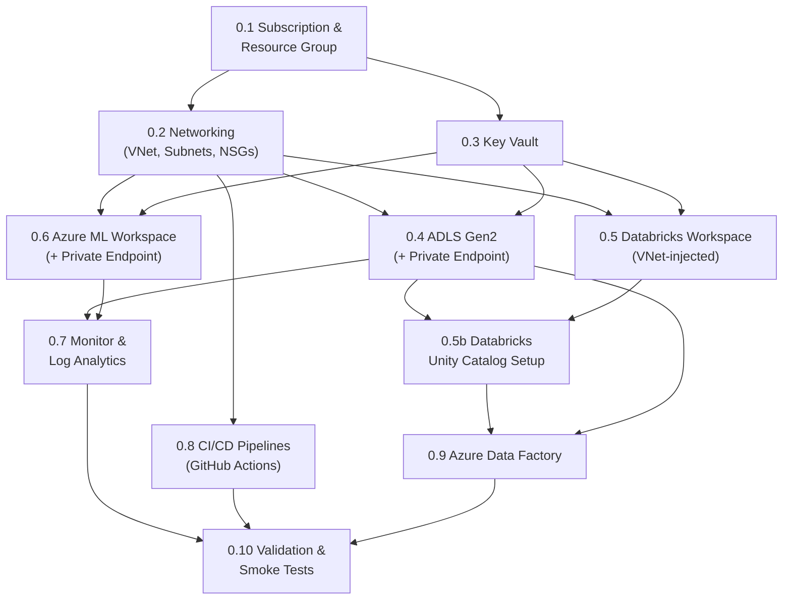

# Phase 0 — IaC & Environment Foundation: Production-Grade Implementation Plan

> [!CAUTION]
> **Superseded.** This is an earlier draft of the Phase 0 plan, written against Bicep. The authoritative, current plan — migrated to Terraform on 2026-08-11 and validated against the real `.tf` files under `infrastructure/` — lives in [`Phase_0_implementation_plan.md`](./Phase_0_implementation_plan.md). This file is kept only for historical reference; its Bicep code samples no longer reflect the codebase. For the commands actually run and bugs actually hit, see [`Step_By_Step_Build_Walkthrough.md`](./Step_By_Step_Build_Walkthrough.md) (§ "Phase 0").

> [!IMPORTANT]
> This is the **exhaustive, production-grade** plan for Phase 0. Every infrastructure decision — naming conventions, SKU selections, networking topology, RBAC strategy, secret management, diagnostic settings, and CI/CD architecture — is specified here. Phase 0 is the foundation that every subsequent phase depends on. No click-ops. No "we'll configure that later." Everything is code.

**Phase 0 Goal:** Provision all Azure infrastructure via Bicep, configure networking and security, set up Databricks workspace with Unity Catalog, establish CI/CD pipelines, and create the ADLS Gen2 directory structure — producing an environment where Phase 1 can begin immediately with zero manual setup.

**Duration:** 1–2 weeks

---

## Phase 0 Internal Dependency Graph



---

## 0.1 Azure Subscription & Resource Group Strategy

### 0.1.1 Subscription Decision

| Decision | Choice | Rationale |
|---|---|---|
| **Subscription model** | Single subscription, 3 resource groups (dev/staging/prod) | For a portfolio/team project, a single subscription with RG-level isolation is sufficient. Enterprise would use separate subscriptions per environment for billing isolation and blast-radius containment. |
| **Subscription type** | Pay-As-You-Go or MSDN/Visual Studio Enterprise (for dev) | Portfolio project; upgrade to Enterprise Agreement for production |

### 0.1.2 Resource Group Naming & Tagging

| Environment | Resource Group Name | Region | Purpose |
|---|---|---|---|
| Development | `rg-fraud-detection-dev` | Central India (or your nearest region) | Active development, experimentation |
| Staging | `rg-fraud-detection-staging` | Same region as prod | Pre-production validation |
| Production | `rg-fraud-detection-prod` | Central India | Live workloads |

**Tagging policy** — every resource gets these tags (enforced via Azure Policy):

| Tag | Value | Purpose |
|---|---|---|
| `project` | `fraud-detection` | Cost allocation |
| `environment` | `dev` / `staging` / `prod` | Environment identification |
| `owner` | `{your-email}` | Accountability |
| `cost-center` | `data-engineering` | Budget tracking |
| `managed-by` | `bicep` | Distinguish IaC-managed from click-ops resources |
| `phase` | `0` (updated as phases complete) | Track provisioning phase |

### 0.1.3 Budget Alerts

| Alert | Threshold | Action |
|---|---|---|
| Dev resource group | 80% of monthly budget ($200 suggested) | Email notification |
| Dev resource group | 100% of monthly budget | Email + Action Group (auto-deallocate non-critical resources) |
| Any single resource | 50% of RG budget | Email notification (catch runaway resources early) |

> [!TIP]
> **Cost-saving production decisions for dev:**
> - Databricks clusters: auto-terminate after 30 min idle
> - ADLS Gen2: LRS (not ZRS/GRS) for dev
> - Azure ML compute: scale to 0 nodes when idle
> - Key Vault: Standard tier (not Premium) for dev
> - Pause/deallocate resources outside working hours via Azure Automation runbook

### 0.1.4 Bicep Template: Resource Group

#### `infrastructure/modules/resource-group.bicep`

```bicep
targetScope = 'subscription'

@description('The environment name (dev, staging, prod)')
@allowed(['dev', 'staging', 'prod'])
param environment string

@description('The Azure region for the resource group')
param location string = 'centralindia'

@description('Project name for naming convention')
param projectName string = 'fraud-detection'

@description('Owner email for tagging')
param ownerEmail string

var rgName = 'rg-${projectName}-${environment}'

resource rg 'Microsoft.Resources/resourceGroups@2023-07-01' = {
  name: rgName
  location: location
  tags: {
    project: projectName
    environment: environment
    owner: ownerEmail
    'cost-center': 'data-engineering'
    'managed-by': 'bicep'
    phase: '0'
  }
}

output resourceGroupName string = rg.name
output resourceGroupId string = rg.id
```

---

## 0.2 Networking (VNet, Subnets, NSGs, Private DNS)

> [!WARNING]
> Networking is the **single hardest thing to change later**. Getting the CIDR allocation, subnet sizing, and private endpoint DNS right in Phase 0 saves weeks of rework. Over-allocate address space now — unused space costs nothing; re-IPing a production VNet costs everything.

### 0.2.1 VNet Design

| Component | Configuration | Production Notes |
|---|---|---|
| **VNet Name** | `vnet-fraud-{env}` | One VNet per environment |
| **Address space** | `10.0.0.0/16` (65,536 addresses) | Massively over-allocated for headroom; subnets carve this up |
| **Region** | Same as resource group | All resources in same region to avoid cross-region latency/egress |

### 0.2.2 Subnet Allocation

| Subnet | CIDR | IPs | Purpose | Delegation | NSG |
|---|---|---|---|---|---|
| `snet-databricks-host` | `10.0.1.0/24` | 254 | Databricks driver/host nodes | `Microsoft.Databricks/workspaces` | `nsg-databricks-host` |
| `snet-databricks-container` | `10.0.2.0/24` | 254 | Databricks worker/container nodes | `Microsoft.Databricks/workspaces` | `nsg-databricks-container` |
| `snet-private-endpoints` | `10.0.3.0/24` | 254 | Private endpoints (ADLS, KV, ML, SQL, Redis, Cosmos, Event Hubs) | None | `nsg-private-endpoints` |
| `snet-aks` | `10.0.4.0/22` | 1022 | Reserved for AKS (if used for model serving in Phase 4) | None | `nsg-aks` |
| `snet-azureml` | `10.0.8.0/24` | 254 | Azure ML compute instances/clusters | None | `nsg-azureml` |
| `snet-functions` | `10.0.9.0/24` | 254 | Azure Functions VNet integration (Phase 5) | `Microsoft.Web/serverFarms` | `nsg-functions` |

> [!NOTE]
> **Why 6 subnets now?** Databricks VNet injection requires **exactly 2 dedicated subnets** (host + container) with no other resources. Private endpoints need their own subnet. AKS, Azure ML compute, and Functions each need isolation for NSG rules. Provisioning all 6 now costs nothing but prevents having to expand the VNet later.

### 0.2.3 Network Security Group (NSG) Rules

#### `nsg-databricks-host` / `nsg-databricks-container`

> Databricks VNet injection creates its own required NSG rules automatically. Do NOT modify these programmatically — Databricks manages them. Only add custom outbound rules if needed.

| Rule | Direction | Priority | Source | Destination | Port | Protocol | Action |
|---|---|---|---|---|---|---|---|
| `AllowAzureDatabricks` | Inbound | 100 | `AzureDatabricks` | VirtualNetwork | Any | Any | Allow |
| `AllowAzureDatabricksOutbound` | Outbound | 100 | VirtualNetwork | `AzureDatabricks` | Any | Any | Allow |
| (Databricks-managed rules) | Both | 200–300 | (auto-created) | (auto-created) | Various | Various | Allow |
| `DenyAllOtherInbound` | Inbound | 4096 | Any | Any | Any | Any | Deny |

#### `nsg-private-endpoints`

| Rule | Direction | Priority | Source | Destination | Port | Protocol | Action |
|---|---|---|---|---|---|---|---|
| `AllowVNetInbound` | Inbound | 100 | `10.0.0.0/16` | `10.0.3.0/24` | 443 | TCP | Allow |
| `DenyInternetInbound` | Inbound | 4096 | Internet | Any | Any | Any | Deny |
| `DenyAllOtherInbound` | Inbound | 4095 | Any | Any | Any | Any | Deny |

### 0.2.4 Private DNS Zones

Each private endpoint needs a DNS zone for private name resolution:

| Service | Private DNS Zone | Records Created By |
|---|---|---|
| ADLS Gen2 (DFS) | `privatelink.dfs.core.windows.net` | Private endpoint creation |
| ADLS Gen2 (Blob) | `privatelink.blob.core.windows.net` | Private endpoint creation |
| Key Vault | `privatelink.vaultcore.azure.net` | Private endpoint creation |
| Azure ML Workspace | `privatelink.api.azureml.ms` | Private endpoint creation |
| Azure ML Notebooks | `privatelink.notebooks.azure.net` | Private endpoint creation |
| Azure SQL (Phase 5) | `privatelink.database.windows.net` | Provisioned later, DNS zone created now |
| Event Hubs (Phase 2) | `privatelink.servicebus.windows.net` | Provisioned later, DNS zone created now |
| Cosmos DB (Phase 3) | `privatelink.documents.azure.com` | Provisioned later, DNS zone created now |
| Redis (Phase 3) | `privatelink.redis.cache.windows.net` | Provisioned later, DNS zone created now |

> [!IMPORTANT]
> **Create all DNS zones now**, even for resources provisioned in later phases. DNS zone creation is free and takes seconds, but forgetting one during Phase 3 deployment and debugging for hours why private endpoint resolution fails is a classic time sink.

### 0.2.5 Bicep Template: VNet & Networking

#### `infrastructure/modules/vnet.bicep`

```bicep
@description('Environment name')
param environment string

@description('Location for resources')
param location string

param projectName string = 'fraud-detection'

var vnetName = 'vnet-${projectName}-${environment}'
var addressPrefix = '10.0.0.0/16'

// --- Subnet definitions ---
var subnets = [
  {
    name: 'snet-databricks-host'
    addressPrefix: '10.0.1.0/24'
    delegation: 'Microsoft.Databricks/workspaces'
    nsgName: 'nsg-databricks-host-${environment}'
  }
  {
    name: 'snet-databricks-container'
    addressPrefix: '10.0.2.0/24'
    delegation: 'Microsoft.Databricks/workspaces'
    nsgName: 'nsg-databricks-container-${environment}'
  }
  {
    name: 'snet-private-endpoints'
    addressPrefix: '10.0.3.0/24'
    delegation: ''
    nsgName: 'nsg-private-endpoints-${environment}'
  }
  {
    name: 'snet-aks'
    addressPrefix: '10.0.4.0/22'
    delegation: ''
    nsgName: 'nsg-aks-${environment}'
  }
  {
    name: 'snet-azureml'
    addressPrefix: '10.0.8.0/24'
    delegation: ''
    nsgName: 'nsg-azureml-${environment}'
  }
  {
    name: 'snet-functions'
    addressPrefix: '10.0.9.0/24'
    delegation: 'Microsoft.Web/serverFarms'
    nsgName: 'nsg-functions-${environment}'
  }
]

// --- NSGs ---
resource nsgs 'Microsoft.Network/networkSecurityGroups@2023-11-01' = [for subnet in subnets: {
  name: subnet.nsgName
  location: location
  tags: {
    project: projectName
    environment: environment
    'managed-by': 'bicep'
  }
  properties: {
    securityRules: [
      {
        name: 'DenyAllInbound'
        properties: {
          priority: 4096
          direction: 'Inbound'
          access: 'Deny'
          protocol: '*'
          sourceAddressPrefix: '*'
          destinationAddressPrefix: '*'
          sourcePortRange: '*'
          destinationPortRange: '*'
        }
      }
    ]
  }
}]

// --- VNet ---
resource vnet 'Microsoft.Network/virtualNetworks@2023-11-01' = {
  name: vnetName
  location: location
  tags: {
    project: projectName
    environment: environment
    'managed-by': 'bicep'
  }
  properties: {
    addressSpace: {
      addressPrefixes: [addressPrefix]
    }
    subnets: [for (subnet, i) in subnets: {
      name: subnet.name
      properties: {
        addressPrefix: subnet.addressPrefix
        networkSecurityGroup: {
          id: nsgs[i].id
        }
        delegations: subnet.delegation != '' ? [
          {
            name: '${subnet.name}-delegation'
            properties: {
              serviceName: subnet.delegation
            }
          }
        ] : []
        privateEndpointNetworkPolicies: subnet.name == 'snet-private-endpoints' ? 'Disabled' : 'Enabled'
      }
    }]
  }
}

// --- Private DNS Zones (all created upfront) ---
var dnsZones = [
  'privatelink.dfs.core.windows.net'
  'privatelink.blob.core.windows.net'
  'privatelink.vaultcore.azure.net'
  'privatelink.api.azureml.ms'
  'privatelink.notebooks.azure.net'
  'privatelink.database.windows.net'
  'privatelink.servicebus.windows.net'
  'privatelink.documents.azure.com'
  'privatelink.redis.cache.windows.net'
]

resource privateDnsZones 'Microsoft.Network/privateDnsZones@2020-06-01' = [for zone in dnsZones: {
  name: zone
  location: 'global'
  tags: {
    project: projectName
    environment: environment
    'managed-by': 'bicep'
  }
}]

// Link DNS zones to VNet
resource dnsVnetLinks 'Microsoft.Network/privateDnsZones/virtualNetworkLinks@2020-06-01' = [for (zone, i) in dnsZones: {
  parent: privateDnsZones[i]
  name: '${vnetName}-link'
  location: 'global'
  properties: {
    virtualNetwork: {
      id: vnet.id
    }
    registrationEnabled: false
  }
}]

output vnetId string = vnet.id
output vnetName string = vnet.name
output subnetIds object = {
  databricksHost: vnet.properties.subnets[0].id
  databricksContainer: vnet.properties.subnets[1].id
  privateEndpoints: vnet.properties.subnets[2].id
  aks: vnet.properties.subnets[3].id
  azureml: vnet.properties.subnets[4].id
  functions: vnet.properties.subnets[5].id
}
```

---

## 0.3 Azure Key Vault

### 0.3.1 Configuration

| Setting | Value | Rationale |
|---|---|---|
| **Name** | `kv-fraud-{env}` | Per-environment isolation |
| **SKU** | Standard (dev/staging), Premium (prod — HSM-backed keys) | Premium for production HSM compliance; Standard sufficient for dev |
| **Soft-delete** | Enabled (90-day retention) | Prevents accidental secret loss; required by Azure Policy |
| **Purge protection** | Enabled (prod); Disabled (dev — for easy cleanup) | Prod: irrecoverable delete prevention; Dev: allow cleanup |
| **Access model** | Azure RBAC (not vault access policies) | RBAC is the modern, auditable model; integrates with Entra ID |
| **Network access** | Private endpoint only (prod); Allow Azure services (dev) | Dev allows Portal access for debugging; prod is locked down |
| **Diagnostic settings** | All logs → Log Analytics Workspace | Audit trail for every secret access |

### 0.3.2 Secret Inventory (Phase 0 Provisioning)

> [!NOTE]
> Not all secrets exist yet. Phase 0 creates **placeholder entries** for secrets that will be populated in later phases. This ensures the Key Vault structure is correct and Databricks secret scope/Azure ML connections reference the right names from day one.

| Secret Name | Populated In | Consumer | Value (Phase 0) |
|---|---|---|---|
| `adls-account-name` | Phase 0 | Databricks, ADF | Actual account name |
| `adls-account-key` | Phase 0 | ADF (for legacy linked services) | Actual key (prefer managed identity) |
| `databricks-workspace-url` | Phase 0 | CI/CD, Azure ML | Actual URL |
| `databricks-pat-token` | Phase 0 | CI/CD (for Databricks CLI/API) | Generated PAT |
| `azureml-workspace-name` | Phase 0 | Training scripts, CI/CD | Actual name |
| `azureml-subscription-id` | Phase 0 | Training scripts | Actual sub ID |
| `azureml-resource-group` | Phase 0 | Training scripts | Actual RG name |
| `eventhub-conn-str` | Phase 2 | Databricks streaming, producers | `PLACEHOLDER` |
| `eventhub-namespace` | Phase 2 | Producers | `PLACEHOLDER` |
| `redis-conn-str` | Phase 3 | Feature store, scoring endpoint | `PLACEHOLDER` |
| `azure-sql-conn-str` | Phase 5 | Decision engine, case management | `PLACEHOLDER` |
| `cosmos-db-conn-str` | Phase 3 | Graph queries | `PLACEHOLDER` |
| `service-bus-conn-str` | Phase 5 | Decision engine, audit logger | `PLACEHOLDER` |
| `app-config-conn-str` | Phase 5 | Decision engine (thresholds) | `PLACEHOLDER` |

### 0.3.3 RBAC Assignments

| Principal | Role | Scope | Purpose |
|---|---|---|---|
| Databricks workspace (managed identity) | `Key Vault Secrets User` | Key Vault | Read secrets for connection strings |
| Azure ML workspace (managed identity) | `Key Vault Secrets User` | Key Vault | Read secrets for training/inference |
| ADF (managed identity) | `Key Vault Secrets User` | Key Vault | Read secrets for linked services |
| CI/CD service principal | `Key Vault Secrets Officer` | Key Vault | Create/update secrets during deployment |
| Developer (your Entra ID) | `Key Vault Administrator` | Key Vault (dev only) | Full access for debugging |
| Azure Functions (managed identity) | `Key Vault Secrets User` | Key Vault | Read secrets at runtime (Phase 5) |

### 0.3.4 Bicep Template: Key Vault

#### `infrastructure/modules/key-vault.bicep`

```bicep
@description('Environment name')
param environment string

@description('Location')
param location string

param projectName string = 'fraud-detection'

@description('Tenant ID for Azure AD')
param tenantId string

@description('Object ID of the deployer for initial access')
param deployerObjectId string

@description('Whether to enable purge protection')
param enablePurgeProtection bool = environment == 'prod'

var kvName = 'kv-fraud-${environment}'

resource keyVault 'Microsoft.KeyVault/vaults@2023-07-01' = {
  name: kvName
  location: location
  tags: {
    project: projectName
    environment: environment
    'managed-by': 'bicep'
  }
  properties: {
    tenantId: tenantId
    sku: {
      family: 'A'
      name: environment == 'prod' ? 'premium' : 'standard'
    }
    enableRbacAuthorization: true     // Use RBAC, not access policies
    enableSoftDelete: true
    softDeleteRetentionInDays: 90
    enablePurgeProtection: enablePurgeProtection
    enabledForDeployment: false
    enabledForDiskEncryption: false
    enabledForTemplateDeployment: true
    publicNetworkAccess: environment == 'prod' ? 'Disabled' : 'Enabled'
    networkAcls: {
      defaultAction: environment == 'prod' ? 'Deny' : 'Allow'
      bypass: 'AzureServices'
    }
  }
}

// --- Deployer gets admin role ---
resource deployerAccess 'Microsoft.Authorization/roleAssignments@2022-04-01' = {
  scope: keyVault
  name: guid(keyVault.id, deployerObjectId, 'Key Vault Administrator')
  properties: {
    roleDefinitionId: subscriptionResourceId(
      'Microsoft.Authorization/roleDefinitions', 
      '00482a5a-887f-4fb3-b363-3b7fe8e74483'  // Key Vault Administrator
    )
    principalId: deployerObjectId
    principalType: 'User'
  }
}

// --- Placeholder secrets for later phases ---
resource placeholderSecrets 'Microsoft.KeyVault/vaults/secrets@2023-07-01' = [for secretName in [
  'eventhub-conn-str'
  'eventhub-namespace'
  'redis-conn-str'
  'azure-sql-conn-str'
  'cosmos-db-conn-str'
  'service-bus-conn-str'
  'app-config-conn-str'
]: {
  parent: keyVault
  name: secretName
  properties: {
    value: 'PLACEHOLDER-TO-BE-SET-IN-PHASE-${secretName}'
    contentType: 'text/plain'
    attributes: {
      enabled: true
    }
  }
}]

// --- Diagnostic settings ---
resource kvDiagnostics 'Microsoft.Insights/diagnosticSettings@2021-05-01-preview' = {
  name: '${kvName}-diagnostics'
  scope: keyVault
  properties: {
    workspaceId: logAnalyticsWorkspaceId   // Passed as parameter
    logs: [
      {
        category: 'AuditEvent'
        enabled: true
        retentionPolicy: { enabled: true, days: 365 }
      }
    ]
    metrics: [
      {
        category: 'AllMetrics'
        enabled: true
        retentionPolicy: { enabled: true, days: 90 }
      }
    ]
  }
}

output keyVaultId string = keyVault.id
output keyVaultName string = keyVault.name
output keyVaultUri string = keyVault.properties.vaultUri
```

---

## 0.4 Azure Data Lake Storage Gen2 (ADLS)

### 0.4.1 Configuration

| Setting | Value (Dev) | Value (Prod) | Rationale |
|---|---|---|---|
| **Name** | `stfraudlakedev` | `stfraudlakeprod` | Globally unique, follows Azure naming (no hyphens) |
| **Account kind** | StorageV2 | StorageV2 | Required for ADLS Gen2 |
| **Hierarchical namespace** | Enabled | Enabled | Required for ADLS Gen2 (directory semantics, ACLs) |
| **Redundancy** | LRS | ZRS | Dev: cheapest. Prod: zone-redundant for availability |
| **Access tier (default)** | Hot | Hot | Transaction data accessed frequently |
| **TLS version** | 1.2 minimum | 1.2 minimum | Security baseline |
| **Blob public access** | Disabled | Disabled | Never expose lakehouse data publicly |
| **Shared key access** | Enabled (dev, for debugging) | Disabled (prod, Entra ID auth only) | Prod: no shared keys, only RBAC |
| **Blob soft delete** | 7 days (dev) | 30 days (prod) | Recovery from accidental deletion |
| **Container soft delete** | 7 days (dev) | 30 days (prod) | Recovery from accidental container deletion |
| **Versioning** | Disabled | Disabled | Delta Lake handles versioning via transaction log; blob versioning on top is redundant and doubles storage cost |

> [!IMPORTANT]
> **Blob versioning decision:** Do NOT enable blob versioning for a Delta Lake lakehouse. Delta's transaction log already provides time-travel, ACID transactions, and full audit trail. Enabling blob versioning on top creates a second copy of every Parquet file on every write, doubling storage cost with zero additional benefit. This is a common and expensive mistake.

### 0.4.2 Container Architecture

ADLS Gen2 uses **filesystem containers** (not blob containers) due to hierarchical namespace:

| Container | Purpose | Lifecycle Policy | Access Pattern |
|---|---|---|---|
| `raw` | Landing zone for batch data (IEEE-CIS CSVs from ADF) | Retain indefinitely (small volume) | Write-once by ADF, read by Auto Loader |
| `bronze` | Raw Delta tables (managed by Unity Catalog) | Retain indefinitely (append-only, replayable) | Write by streaming/batch ingestion, read by Silver jobs |
| `silver` | Cleaned Delta tables | Retain indefinitely | Write by transformation jobs, read by Gold + feature engineering |
| `gold` | Aggregated Delta tables | Retain indefinitely | Write by Gold jobs, read by BI/Power BI |
| `quarantine` | Rejected rows from quality gates | 90-day retention, then auto-delete | Write by quality gates, read by data-quality dashboards |
| `checkpoints` | Structured Streaming checkpoints | Retain while streaming jobs are active; clean up on job replacement | Write/read by Structured Streaming |
| `feature-store` | Offline feature materialization (Azure ML feature store) | Managed by Azure ML feature store | Write by materialization jobs, read by training pipelines |
| `eventhubs-capture` | Event Hubs Capture Avro archive (Phase 2) | 30-day hot, then move to cool tier | Write by Event Hubs Capture, read for recovery backfills |

### 0.4.3 Directory Pre-Creation

```
raw/
├── ieee-cis/                      # Phase 1: IEEE-CIS CSVs
├── reference-data/                # Phase 1+: merchant categories, FX rates
└── kaggle-credit-card/            # Phase 2: Kaggle CC transactions CSV

quarantine/
├── bronze_parse_failures/         # Auto Loader bad records
├── bronze_rejects/                # Quality gate rejects
└── silver_rejects/                # Silver transformation rejects

checkpoints/
├── bronze_ieee_cis/               # Phase 1: batch Auto Loader checkpoint
├── bronze_txn/                    # Phase 2: streaming Event Hubs checkpoint
├── silver_txn/                    # Phase 2: Silver streaming checkpoint
├── feature_eng_velocity/          # Phase 3: velocity features checkpoint
├── feature_eng_geo/               # Phase 3: geo features checkpoint
└── graph_edge_writer/             # Phase 3: Cosmos DB edge writer checkpoint
```

### 0.4.4 Lifecycle Management Policies

```json
{
  "rules": [
    {
      "name": "quarantine-cleanup",
      "enabled": true,
      "type": "Lifecycle",
      "definition": {
        "filters": {
          "blobTypes": ["blockBlob"],
          "prefixMatch": ["quarantine/"]
        },
        "actions": {
          "baseBlob": {
            "delete": { "daysAfterModificationGreaterThan": 90 }
          }
        }
      }
    },
    {
      "name": "eventhubs-capture-tiering",
      "enabled": true,
      "type": "Lifecycle",
      "definition": {
        "filters": {
          "blobTypes": ["blockBlob"],
          "prefixMatch": ["eventhubs-capture/"]
        },
        "actions": {
          "baseBlob": {
            "tierToCool": { "daysAfterModificationGreaterThan": 30 },
            "delete": { "daysAfterModificationGreaterThan": 180 }
          }
        }
      }
    }
  ]
}
```

### 0.4.5 RBAC Assignments for ADLS

| Principal | Role | Scope | Purpose |
|---|---|---|---|
| Databricks workspace (managed identity) | `Storage Blob Data Contributor` | Storage account | Read/write Delta tables, checkpoints |
| Azure ML workspace (managed identity) | `Storage Blob Data Contributor` | Storage account | Feature store materialization, training data access |
| ADF (managed identity) | `Storage Blob Data Contributor` | `raw/` container | Write raw data during ingestion |
| CI/CD service principal | `Storage Blob Data Contributor` | Storage account | Deploy, manage directory structure |
| Developer (Entra ID) | `Storage Blob Data Contributor` | Storage account (dev only) | Debugging, manual inspection |

### 0.4.6 Bicep Template: ADLS Gen2

#### `infrastructure/modules/storage-account.bicep`

```bicep
@description('Environment name')
param environment string

@description('Location')
param location string

param projectName string = 'fraud-detection'

@description('Subnet ID for private endpoint')
param privateEndpointSubnetId string

var storageName = 'stfraudlake${environment}'

resource storageAccount 'Microsoft.Storage/storageAccounts@2023-05-01' = {
  name: storageName
  location: location
  tags: {
    project: projectName
    environment: environment
    'managed-by': 'bicep'
  }
  kind: 'StorageV2'
  sku: {
    name: environment == 'prod' ? 'Standard_ZRS' : 'Standard_LRS'
  }
  properties: {
    isHnsEnabled: true                   // Hierarchical namespace = ADLS Gen2
    minimumTlsVersion: 'TLS1_2'
    supportsHttpsTrafficOnly: true
    allowBlobPublicAccess: false
    allowSharedKeyAccess: environment != 'prod'
    defaultToOAuthAuthentication: true
    accessTier: 'Hot'
    networkAcls: {
      defaultAction: environment == 'prod' ? 'Deny' : 'Allow'
      bypass: 'AzureServices'
    }
  }
}

// --- Blob services configuration ---
resource blobServices 'Microsoft.Storage/storageAccounts/blobServices@2023-05-01' = {
  parent: storageAccount
  name: 'default'
  properties: {
    deleteRetentionPolicy: {
      enabled: true
      days: environment == 'prod' ? 30 : 7
    }
    containerDeleteRetentionPolicy: {
      enabled: true
      days: environment == 'prod' ? 30 : 7
    }
    // No blob versioning — Delta Lake handles versioning via transaction log
  }
}

// --- Filesystem containers (ADLS Gen2) ---
var containers = [
  'raw'
  'bronze'
  'silver'
  'gold'
  'quarantine'
  'checkpoints'
  'feature-store'
  'eventhubs-capture'
]

resource filesystems 'Microsoft.Storage/storageAccounts/blobServices/containers@2023-05-01' = [for container in containers: {
  parent: blobServices
  name: container
  properties: {
    publicAccess: 'None'
  }
}]

// --- Private endpoint (DFS) ---
resource dfsPrivateEndpoint 'Microsoft.Network/privateEndpoints@2023-11-01' = {
  name: 'pe-${storageName}-dfs'
  location: location
  tags: {
    project: projectName
    environment: environment
    'managed-by': 'bicep'
  }
  properties: {
    subnet: {
      id: privateEndpointSubnetId
    }
    privateLinkServiceConnections: [
      {
        name: 'dfs-connection'
        properties: {
          privateLinkServiceId: storageAccount.id
          groupIds: ['dfs']
        }
      }
    ]
  }
}

// --- Private endpoint (Blob — needed for Event Hubs Capture) ---
resource blobPrivateEndpoint 'Microsoft.Network/privateEndpoints@2023-11-01' = {
  name: 'pe-${storageName}-blob'
  location: location
  tags: {
    project: projectName
    environment: environment
    'managed-by': 'bicep'
  }
  properties: {
    subnet: {
      id: privateEndpointSubnetId
    }
    privateLinkServiceConnections: [
      {
        name: 'blob-connection'
        properties: {
          privateLinkServiceId: storageAccount.id
          groupIds: ['blob']
        }
      }
    ]
  }
}

// --- Diagnostic settings ---
resource storageDiagnostics 'Microsoft.Insights/diagnosticSettings@2021-05-01-preview' = {
  name: '${storageName}-diagnostics'
  scope: storageAccount
  properties: {
    workspaceId: logAnalyticsWorkspaceId
    metrics: [
      {
        category: 'Transaction'
        enabled: true
        retentionPolicy: { enabled: true, days: 90 }
      }
    ]
  }
}

output storageAccountId string = storageAccount.id
output storageAccountName string = storageAccount.name
output dfsEndpoint string = storageAccount.properties.primaryEndpoints.dfs
```

---

## 0.5 Azure Databricks Workspace

### 0.5.1 Workspace Configuration

| Setting | Value | Rationale |
|---|---|---|
| **Name** | `dbw-fraud-{env}` | Per-environment workspace |
| **Pricing tier** | Premium | Required for Unity Catalog, VNet injection, SCIM provisioning, cluster policies |
| **VNet injection** | Enabled → `snet-databricks-host` + `snet-databricks-container` | Network isolation; required for private endpoint connectivity to ADLS/KV |
| **Managed resource group** | `rg-dbw-fraud-{env}-managed` | Databricks-managed RG for VMs, disks, NSGs (auto-created) |
| **Public network access** | Enabled (dev), Disabled + Private Link (prod) | Dev needs Portal/web UI access; prod fully private |
| **Encryption** | Azure-managed keys (dev), CMK (prod — via Key Vault) | Prod: customer-managed keys for compliance |

### 0.5.2 Bicep Template: Databricks Workspace

#### `infrastructure/modules/databricks-workspace.bicep`

```bicep
@description('Environment name')
param environment string

@description('Location')
param location string

param projectName string = 'fraud-detection'

@description('VNet ID')
param vnetId string

@description('Databricks host subnet name')
param hostSubnetName string = 'snet-databricks-host'

@description('Databricks container subnet name')
param containerSubnetName string = 'snet-databricks-container'

var workspaceName = 'dbw-fraud-${environment}'
var managedRgName = 'rg-dbw-fraud-${environment}-managed'

resource databricksWorkspace 'Microsoft.Databricks/workspaces@2024-05-01' = {
  name: workspaceName
  location: location
  tags: {
    project: projectName
    environment: environment
    'managed-by': 'bicep'
  }
  sku: {
    name: 'premium'     // Premium required for Unity Catalog, VNet injection
  }
  properties: {
    managedResourceGroupId: subscriptionResourceId(
      'Microsoft.Resources/resourceGroups', managedRgName
    )
    publicNetworkAccess: environment == 'prod' ? 'Disabled' : 'Enabled'
    requiredNsgRules: 'AllRules'
    parameters: {
      customVirtualNetworkId: {
        value: vnetId
      }
      customPublicSubnetName: {
        value: hostSubnetName
      }
      customPrivateSubnetName: {
        value: containerSubnetName
      }
      enableNoPublicIp: {
        value: environment == 'prod'
      }
    }
  }
}

output workspaceId string = databricksWorkspace.id
output workspaceUrl string = databricksWorkspace.properties.workspaceUrl
output workspaceName string = databricksWorkspace.name
```

### 0.5.3 Unity Catalog Setup

> [!IMPORTANT]
> Unity Catalog is configured **after** the Databricks workspace is deployed, because it requires the workspace to be running. This is a post-deployment configuration step, executed via Databricks CLI or SQL within the workspace.

#### `databricks/workspace-setup/create_catalog_schemas.sql`

```sql
-- ============================================================
-- Unity Catalog Setup for Fraud Detection Platform
-- Run this in the Databricks SQL Editor or via Databricks CLI
-- ============================================================

-- Step 1: Create the catalog (one per environment)
-- The metastore must already exist (Azure-managed or manually created)
CREATE CATALOG IF NOT EXISTS fraud_detection_dev
COMMENT 'Fraud Detection Platform — Development Environment';

-- Step 2: Set as default catalog for this workspace
USE CATALOG fraud_detection_dev;

-- Step 3: Create medallion schemas
CREATE SCHEMA IF NOT EXISTS bronze
COMMENT 'Raw, append-only data. No transformations beyond parsing and metadata attachment.';

CREATE SCHEMA IF NOT EXISTS silver
COMMENT 'Cleaned, conformed, deduplicated, quality-gated data. Source of truth for analytics and ML.';

CREATE SCHEMA IF NOT EXISTS gold
COMMENT 'Business-ready aggregations. Optimized for BI queries and executive dashboards.';

CREATE SCHEMA IF NOT EXISTS quarantine
COMMENT 'Rejected rows from quality gates. Contains rejection reasons. Retained for 90 days.';

CREATE SCHEMA IF NOT EXISTS reference
COMMENT 'Reference/lookup tables (merchant categories, FX rates, risk tiers). Source of record: Azure SQL.';

-- Step 4: Verify
SHOW SCHEMAS IN fraud_detection_dev;

-- Expected output:
-- bronze
-- silver
-- gold
-- quarantine
-- reference
-- default (auto-created, unused)
-- information_schema (system)
```

### 0.5.4 Cluster Policies

Three cluster policies govern all compute in the workspace:

#### `databricks/workspace-setup/cluster_policies.json`

```json
[
  {
    "name": "streaming-jobs",
    "description": "24/7 streaming jobs. Dedicated, autoscale, LTS runtime. No interactive use.",
    "definition": {
      "spark_version": {
        "type": "regex",
        "pattern": "14\\.[0-9]+\\.x-scala2\\.12",
        "defaultValue": "14.3.x-scala2.12"
      },
      "node_type_id": {
        "type": "allowlist",
        "values": ["Standard_DS3_v2", "Standard_DS4_v2", "Standard_E4s_v3"],
        "defaultValue": "Standard_DS3_v2"
      },
      "autoscale.min_workers": {
        "type": "range",
        "minValue": 2,
        "maxValue": 4,
        "defaultValue": 2
      },
      "autoscale.max_workers": {
        "type": "range",
        "minValue": 4,
        "maxValue": 8,
        "defaultValue": 4
      },
      "autotermination_minutes": {
        "type": "fixed",
        "value": 0,
        "hidden": true
      },
      "custom_tags.job-type": {
        "type": "fixed",
        "value": "streaming",
        "hidden": true
      },
      "spark_conf.spark.databricks.delta.autoOptimize.optimizeWrite": {
        "type": "fixed",
        "value": "true",
        "hidden": true
      }
    }
  },
  {
    "name": "batch-jobs",
    "description": "Batch processing jobs (Bronze→Silver→Gold). Autoscale, Photon enabled. Auto-terminate.",
    "definition": {
      "spark_version": {
        "type": "regex",
        "pattern": "14\\.[0-9]+\\.x-photon-scala2\\.12",
        "defaultValue": "14.3.x-photon-scala2.12"
      },
      "runtime_engine": {
        "type": "fixed",
        "value": "PHOTON",
        "hidden": true
      },
      "node_type_id": {
        "type": "allowlist",
        "values": ["Standard_DS3_v2", "Standard_DS4_v2"],
        "defaultValue": "Standard_DS3_v2"
      },
      "autoscale.min_workers": {
        "type": "range",
        "minValue": 1,
        "maxValue": 2,
        "defaultValue": 1
      },
      "autoscale.max_workers": {
        "type": "range",
        "minValue": 2,
        "maxValue": 4,
        "defaultValue": 2
      },
      "autotermination_minutes": {
        "type": "range",
        "minValue": 15,
        "maxValue": 60,
        "defaultValue": 30
      },
      "custom_tags.job-type": {
        "type": "fixed",
        "value": "batch",
        "hidden": true
      },
      "spark_conf.spark.databricks.delta.autoOptimize.optimizeWrite": {
        "type": "fixed",
        "value": "true",
        "hidden": true
      },
      "spark_conf.spark.databricks.delta.autoOptimize.autoCompact": {
        "type": "fixed",
        "value": "true",
        "hidden": true
      }
    }
  },
  {
    "name": "ml-training",
    "description": "ML training clusters. ML Runtime, larger nodes for XGBoost/PyTorch.",
    "definition": {
      "spark_version": {
        "type": "regex",
        "pattern": "14\\.[0-9]+\\.x-cpu-ml-scala2\\.12",
        "defaultValue": "14.3.x-cpu-ml-scala2.12"
      },
      "node_type_id": {
        "type": "allowlist",
        "values": ["Standard_DS4_v2", "Standard_DS5_v2", "Standard_NC6s_v3"],
        "defaultValue": "Standard_DS4_v2"
      },
      "autoscale.min_workers": {
        "type": "range",
        "minValue": 1,
        "maxValue": 2,
        "defaultValue": 1
      },
      "autoscale.max_workers": {
        "type": "range",
        "minValue": 2,
        "maxValue": 4,
        "defaultValue": 2
      },
      "autotermination_minutes": {
        "type": "range",
        "minValue": 30,
        "maxValue": 120,
        "defaultValue": 60
      },
      "custom_tags.job-type": {
        "type": "fixed",
        "value": "ml-training",
        "hidden": true
      }
    }
  }
]
```

### 0.5.5 Secret Scope Linked to Key Vault

#### `databricks/workspace-setup/secret_scope_setup.sh`

```bash
#!/bin/bash
# Create a Databricks secret scope backed by Azure Key Vault
# Run this AFTER the workspace and Key Vault are deployed
# Requires: Databricks CLI configured with workspace URL + PAT

set -euo pipefail

ENVIRONMENT="${1:-dev}"
KV_NAME="kv-fraud-${ENVIRONMENT}"
KV_RESOURCE_ID=$(az keyvault show --name "${KV_NAME}" --query id -o tsv)
KV_DNS_NAME=$(az keyvault show --name "${KV_NAME}" --query properties.vaultUri -o tsv)

echo "Creating Databricks secret scope 'kv-fraud' backed by Key Vault '${KV_NAME}'..."

databricks secrets create-scope \
    --scope "kv-fraud" \
    --scope-backend-type AZURE_KEYVAULT \
    --resource-id "${KV_RESOURCE_ID}" \
    --dns-name "${KV_DNS_NAME}"

echo "Verifying secret scope..."
databricks secrets list-scopes
databricks secrets list --scope "kv-fraud"

echo "Secret scope 'kv-fraud' created and linked to Key Vault '${KV_NAME}'"
```

### 0.5.6 Databricks Repos (Git Integration)

| Setting | Value |
|---|---|
| **Git provider** | GitHub |
| **Repository** | `https://github.com/{org}/fraud-detection-platform` |
| **Branch** | `develop` (dev workspace), `main` (prod workspace) |
| **Repos path** | `/Repos/{user}/fraud-detection-platform` |

> **Production decision:** Notebooks are NOT the source of truth — Git is. Developers edit in VS Code / local IDE, push to GitHub, and Databricks Repos syncs. Never edit directly in the Databricks notebook UI for production code.

---

## 0.6 Azure ML Workspace

### 0.6.1 Configuration

| Setting | Value | Rationale |
|---|---|---|
| **Name** | `mlw-fraud-{env}` | Per-environment workspace |
| **SKU** | Standard (Basic doesn't support managed endpoints) | Need managed online endpoints for Phase 4 |
| **Storage account** | Link to existing ADLS Gen2 (`stfraudlake{env}`) | Shared storage for feature store and training data |
| **Key Vault** | Link to existing `kv-fraud-{env}` | Shared secrets |
| **Application Insights** | Create new `appi-fraud-{env}` | Endpoint telemetry (Phase 4+) |
| **Container Registry** | Create new `crfraud{env}` | Custom Docker images for training/serving (Phase 4) |
| **Managed identity** | System-assigned | Service-to-service auth to ADLS, KV |
| **Public network access** | Enabled (dev), Disabled + Private Link (prod) | Dev needs UI access; prod private |

### 0.6.2 Bicep Template: Azure ML Workspace

#### `infrastructure/modules/azureml-workspace.bicep`

```bicep
@description('Environment name')
param environment string

@description('Location')
param location string

param projectName string = 'fraud-detection'

@description('ADLS Gen2 storage account ID')
param storageAccountId string

@description('Key Vault ID')
param keyVaultId string

@description('Private endpoint subnet ID')
param privateEndpointSubnetId string

var workspaceName = 'mlw-fraud-${environment}'
var appInsightsName = 'appi-fraud-${environment}'
var containerRegistryName = 'crfraud${environment}'

// --- Application Insights ---
resource appInsights 'Microsoft.Insights/components@2020-02-02' = {
  name: appInsightsName
  location: location
  kind: 'web'
  tags: {
    project: projectName
    environment: environment
    'managed-by': 'bicep'
  }
  properties: {
    Application_Type: 'web'
    RetentionInDays: 90
  }
}

// --- Container Registry ---
resource containerRegistry 'Microsoft.ContainerRegistry/registries@2023-07-01' = {
  name: containerRegistryName
  location: location
  tags: {
    project: projectName
    environment: environment
    'managed-by': 'bicep'
  }
  sku: {
    name: environment == 'prod' ? 'Premium' : 'Basic'
  }
  properties: {
    adminUserEnabled: false    // Use managed identity, not admin user
  }
}

// --- Azure ML Workspace ---
resource mlWorkspace 'Microsoft.MachineLearningServices/workspaces@2024-04-01' = {
  name: workspaceName
  location: location
  tags: {
    project: projectName
    environment: environment
    'managed-by': 'bicep'
  }
  identity: {
    type: 'SystemAssigned'
  }
  sku: {
    name: 'Basic'
    tier: 'Basic'
  }
  properties: {
    storageAccount: storageAccountId
    keyVault: keyVaultId
    applicationInsights: appInsights.id
    containerRegistry: containerRegistry.id
    publicNetworkAccess: environment == 'prod' ? 'Disabled' : 'Enabled'
    v1LegacyMode: false
  }
}

output workspaceId string = mlWorkspace.id
output workspaceName string = mlWorkspace.name
output principalId string = mlWorkspace.identity.principalId
```

---

## 0.7 Azure Monitor & Log Analytics

### 0.7.1 Log Analytics Workspace

| Setting | Value | Rationale |
|---|---|---|
| **Name** | `log-fraud-{env}` | Centralized log aggregation |
| **Retention** | 30 days (dev), 90 days (staging), 365 days (prod) | Cost vs. compliance trade-off |
| **Daily cap** | 5 GB/day (dev), unlimited (prod) | Dev cost control |
| **SKU** | PerGB2018 | Standard pay-as-you-go model |

### 0.7.2 Diagnostic Settings (Connected Resources)

Every resource provisioned in Phase 0 sends diagnostics to Log Analytics:

| Resource | Logs | Metrics |
|---|---|---|
| Key Vault | AuditEvent | AllMetrics |
| ADLS Gen2 | StorageRead, StorageWrite, StorageDelete | Transaction |
| Databricks (via workspace) | Clusters, Jobs, Notebook, SQLPermissions | N/A (via Databricks job metrics) |
| Azure ML | AmlComputeClusterEvent, AmlRunStatusChanged | AllMetrics |

### 0.7.3 Baseline Alerts (Phase 0)

| Alert | Condition | Severity | Action |
|---|---|---|---|
| Key Vault access failure | AuditEvent where ResultType != "Success" > 5 in 5 min | Sev 2 | Email notification |
| ADLS throttling | StorageAccountThrottling > 0 | Sev 3 | Email notification |
| Resource health degraded | Any resource health status != "Available" | Sev 2 | Email notification |
| Budget threshold exceeded | 80% of monthly budget | Sev 3 | Email notification |
| Databricks job failure | Job status == FAILED | Sev 2 | Email notification |
| Azure ML compute utilization | CPU > 90% sustained for 15 min | Sev 3 | Email notification |

### 0.7.4 Bicep Template: Log Analytics

#### `infrastructure/modules/log-analytics.bicep`

```bicep
@description('Environment name')
param environment string

@description('Location')
param location string

param projectName string = 'fraud-detection'

var logAnalyticsName = 'log-fraud-${environment}'

var retentionDays = environment == 'prod' ? 365 : (environment == 'staging' ? 90 : 30)
var dailyCapGb = environment == 'dev' ? 5 : -1  // -1 = unlimited

resource logAnalytics 'Microsoft.OperationalInsights/workspaces@2023-09-01' = {
  name: logAnalyticsName
  location: location
  tags: {
    project: projectName
    environment: environment
    'managed-by': 'bicep'
  }
  properties: {
    sku: {
      name: 'PerGB2018'
    }
    retentionInDays: retentionDays
    workspaceCapping: dailyCapGb > 0 ? {
      dailyQuotaGb: dailyCapGb
    } : null
  }
}

output logAnalyticsId string = logAnalytics.id
output logAnalyticsName string = logAnalytics.name
```

---

## 0.8 CI/CD Pipelines (GitHub Actions)

### 0.8.1 Branch Strategy

| Branch | Purpose | Deploys To | Protection |
|---|---|---|---|
| `main` | Production-ready code | Prod (on merge) | Require PR, 1 reviewer, CI passing |
| `staging` | Pre-production validation | Staging (on merge) | Require PR, CI passing |
| `develop` | Active development | Dev (on push) | CI must pass |
| `feature/*` | Feature branches | None (CI only) | None |

### 0.8.2 GitHub Actions Workflows

#### `.github/workflows/infra-deploy.yml`

```yaml
name: Infrastructure Deployment

on:
  push:
    branches: [develop, staging, main]
    paths:
      - 'infrastructure/**'
  pull_request:
    branches: [develop, staging, main]
    paths:
      - 'infrastructure/**'

permissions:
  id-token: write    # Required for Azure OIDC login
  contents: read

env:
  AZURE_SUBSCRIPTION_ID: ${{ secrets.AZURE_SUBSCRIPTION_ID }}

jobs:
  determine-environment:
    runs-on: ubuntu-latest
    outputs:
      environment: ${{ steps.set-env.outputs.environment }}
    steps:
      - id: set-env
        run: |
          if [[ "${{ github.ref }}" == "refs/heads/main" ]]; then
            echo "environment=prod" >> $GITHUB_OUTPUT
          elif [[ "${{ github.ref }}" == "refs/heads/staging" ]]; then
            echo "environment=staging" >> $GITHUB_OUTPUT
          else
            echo "environment=dev" >> $GITHUB_OUTPUT
          fi

  validate:
    runs-on: ubuntu-latest
    needs: determine-environment
    steps:
      - uses: actions/checkout@v4

      - name: Azure Login (OIDC)
        uses: azure/login@v2
        with:
          client-id: ${{ secrets.AZURE_CLIENT_ID }}
          tenant-id: ${{ secrets.AZURE_TENANT_ID }}
          subscription-id: ${{ secrets.AZURE_SUBSCRIPTION_ID }}

      - name: Validate Bicep
        run: |
          az bicep build --file infrastructure/main.bicep
          echo "Bicep validation passed"

      - name: What-If Deployment
        run: |
          az deployment sub what-if \
            --location centralindia \
            --template-file infrastructure/main.bicep \
            --parameters infrastructure/modules/parameters/${{ needs.determine-environment.outputs.environment }}.parameters.json

  deploy:
    runs-on: ubuntu-latest
    needs: [determine-environment, validate]
    if: github.event_name == 'push'
    environment: ${{ needs.determine-environment.outputs.environment }}
    steps:
      - uses: actions/checkout@v4

      - name: Azure Login (OIDC)
        uses: azure/login@v2
        with:
          client-id: ${{ secrets.AZURE_CLIENT_ID }}
          tenant-id: ${{ secrets.AZURE_TENANT_ID }}
          subscription-id: ${{ secrets.AZURE_SUBSCRIPTION_ID }}

      - name: Deploy Infrastructure
        run: |
          az deployment sub create \
            --location centralindia \
            --template-file infrastructure/main.bicep \
            --parameters infrastructure/modules/parameters/${{ needs.determine-environment.outputs.environment }}.parameters.json \
            --name "fraud-infra-$(date +%Y%m%d%H%M%S)"

      - name: Verify Deployment
        run: |
          ENV=${{ needs.determine-environment.outputs.environment }}
          echo "Verifying resources in rg-fraud-detection-${ENV}..."
          az resource list \
            --resource-group "rg-fraud-detection-${ENV}" \
            --output table
```

#### `.github/workflows/data-ci.yml`

```yaml
name: Data Pipeline CI

on:
  push:
    paths:
      - 'databricks/**'
      - 'data-factory/**'
  pull_request:
    paths:
      - 'databricks/**'
      - 'data-factory/**'

jobs:
  lint-and-test:
    runs-on: ubuntu-latest
    steps:
      - uses: actions/checkout@v4

      - name: Set up Python 3.11
        uses: actions/setup-python@v5
        with:
          python-version: '3.11'

      - name: Install dependencies
        run: |
          pip install ruff pytest pyspark==3.5.* pydeequ delta-spark==3.2.*

      - name: Lint PySpark code
        run: |
          ruff check databricks/ --select E,W,F,I

      - name: Run unit tests
        run: |
          pytest databricks/tests/ -v --tb=short

      - name: Validate ADF pipeline JSON
        run: |
          python -c "
          import json, glob
          for f in glob.glob('data-factory/**/*.json', recursive=True):
              with open(f) as fp:
                  json.load(fp)
              print(f'  ✓ {f}')
          "
```

#### `.github/workflows/ml-ci.yml`

```yaml
name: ML Pipeline CI

on:
  push:
    paths:
      - 'ml/**'
  pull_request:
    paths:
      - 'ml/**'

jobs:
  lint-and-test:
    runs-on: ubuntu-latest
    steps:
      - uses: actions/checkout@v4

      - name: Set up Python 3.11
        uses: actions/setup-python@v5
        with:
          python-version: '3.11'

      - name: Install dependencies
        run: |
          pip install -r ml/requirements.txt
          pip install ruff pytest

      - name: Lint ML code
        run: |
          ruff check ml/ --select E,W,F,I

      - name: Run ML unit tests
        run: |
          pytest ml/tests/ -v --tb=short
```

#### `.github/workflows/security-scan.yml`

```yaml
name: Security Scan

on:
  pull_request:
    branches: [develop, staging, main]
  schedule:
    - cron: '0 6 * * 1'  # Weekly Monday 6am UTC

jobs:
  secret-scan:
    runs-on: ubuntu-latest
    steps:
      - uses: actions/checkout@v4
        with:
          fetch-depth: 0

      - name: TruffleHog Secret Scan
        uses: trufflesecurity/trufflehog@main
        with:
          path: ./
          extra_args: --only-verified

  iac-scan:
    runs-on: ubuntu-latest
    steps:
      - uses: actions/checkout@v4

      - name: Checkov IaC Scan
        uses: bridgecrewio/checkov-action@master
        with:
          directory: infrastructure/
          framework: bicep
          soft_fail: true   # Don't block PR on first run; tighten later
```

### 0.8.3 Repository Configuration Files

#### `.github/CODEOWNERS`

```
# Infrastructure changes require platform team review
infrastructure/    @platform-team

# Data pipeline changes require data engineering review
databricks/        @data-engineering-team
data-factory/      @data-engineering-team

# ML code requires data science review
ml/                @data-science-team

# CI/CD changes require platform team review
.github/           @platform-team
```

#### `.github/pull_request_template.md`

```markdown
## Description
<!-- What does this PR do? -->

## Type of Change
- [ ] Infrastructure (Bicep/Terraform)
- [ ] Data pipeline (PySpark/ADF)
- [ ] ML model/training
- [ ] CI/CD
- [ ] Documentation

## Phase
- [ ] Phase 0 (IaC & Environment)
- [ ] Phase 1 (Batch Foundation)
- [ ] Phase 2+ (Streaming/Features/Model/etc.)

## Checklist
- [ ] No secrets/credentials in code
- [ ] Unit tests added/updated
- [ ] Documentation updated
- [ ] CI passes
- [ ] Tested in dev environment

## Verification
<!-- How can the reviewer verify this change works? -->
```

### 0.8.4 GitHub Secrets to Configure

| Secret Name | Purpose | Where to Get |
|---|---|---|
| `AZURE_CLIENT_ID` | Service principal app (client) ID for OIDC login | `az ad sp show --id {sp-id}` |
| `AZURE_TENANT_ID` | Azure AD tenant ID | `az account show --query tenantId` |
| `AZURE_SUBSCRIPTION_ID` | Target subscription | `az account show --query id` |
| `DATABRICKS_HOST` | Workspace URL | `https://adb-{workspace-id}.azuredatabricks.net` |
| `DATABRICKS_TOKEN` | PAT token (for Databricks CLI in CI) | Generated in workspace Settings → Developer |

> **Production decision:** Use **OIDC (federated credentials)** for Azure login in CI/CD, NOT a client secret. OIDC tokens are short-lived and don't require secret rotation.

---

## 0.9 Azure Data Factory

### 0.9.1 Configuration

| Setting | Value | Rationale |
|---|---|---|
| **Name** | `adf-fraud-{env}` | Per-environment factory |
| **Managed identity** | System-assigned | Auth to ADLS Gen2, Key Vault |
| **Git integration** | GitHub (`data-factory/` directory) | Version-controlled pipelines |
| **Global parameters** | `environment`, `adls_account_name` | Environment-specific configuration |
| **Managed VNet** | Enabled (prod), Disabled (dev) | Prod: private connectivity; dev: simpler debugging |

### 0.9.2 Linked Services (Created in Phase 0)

| Linked Service | Type | Auth Method |
|---|---|---|
| `ls_adls_gen2` | Azure Data Lake Storage Gen2 | Managed identity |
| `ls_keyvault` | Azure Key Vault | Managed identity |

### 0.9.3 RBAC Assignments for ADF

| Assignment | Role | Scope |
|---|---|---|
| ADF managed identity | `Storage Blob Data Contributor` | ADLS Gen2 storage account |
| ADF managed identity | `Key Vault Secrets User` | Key Vault |

---

## 0.10 Main Orchestrator Template

#### `infrastructure/main.bicep`

```bicep
// ============================================================
// Fraud Detection Platform — Main Infrastructure Orchestrator
// ============================================================
// Deploys all Phase 0 resources in dependency order.
// Usage: az deployment sub create --location centralindia \
//        --template-file main.bicep \
//        --parameters modules/parameters/dev.parameters.json

targetScope = 'subscription'

// --- Parameters ---
@description('Environment name')
@allowed(['dev', 'staging', 'prod'])
param environment string

@description('Azure region')
param location string = 'centralindia'

@description('Owner email for tagging')
param ownerEmail string

@description('Azure AD tenant ID')
param tenantId string

@description('Object ID of the deployer (for Key Vault admin access)')
param deployerObjectId string

param projectName string = 'fraud-detection'

// --- Step 1: Resource Group ---
module rg 'modules/resource-group.bicep' = {
  name: 'deploy-resource-group'
  params: {
    environment: environment
    location: location
    ownerEmail: ownerEmail
  }
}

// --- Step 2: Log Analytics (needed by all other resources for diagnostics) ---
module logAnalytics 'modules/log-analytics.bicep' = {
  name: 'deploy-log-analytics'
  scope: resourceGroup(rg.outputs.resourceGroupName)
  params: {
    environment: environment
    location: location
  }
}

// --- Step 3: Networking ---
module networking 'modules/vnet.bicep' = {
  name: 'deploy-networking'
  scope: resourceGroup(rg.outputs.resourceGroupName)
  params: {
    environment: environment
    location: location
  }
}

// --- Step 4: Key Vault ---
module keyVault 'modules/key-vault.bicep' = {
  name: 'deploy-keyvault'
  scope: resourceGroup(rg.outputs.resourceGroupName)
  params: {
    environment: environment
    location: location
    tenantId: tenantId
    deployerObjectId: deployerObjectId
  }
}

// --- Step 5: ADLS Gen2 ---
module storage 'modules/storage-account.bicep' = {
  name: 'deploy-storage'
  scope: resourceGroup(rg.outputs.resourceGroupName)
  params: {
    environment: environment
    location: location
    privateEndpointSubnetId: networking.outputs.subnetIds.privateEndpoints
  }
}

// --- Step 6: Databricks Workspace ---
module databricks 'modules/databricks-workspace.bicep' = {
  name: 'deploy-databricks'
  scope: resourceGroup(rg.outputs.resourceGroupName)
  params: {
    environment: environment
    location: location
    vnetId: networking.outputs.vnetId
  }
}

// --- Step 7: Azure ML Workspace ---
module azureml 'modules/azureml-workspace.bicep' = {
  name: 'deploy-azureml'
  scope: resourceGroup(rg.outputs.resourceGroupName)
  params: {
    environment: environment
    location: location
    storageAccountId: storage.outputs.storageAccountId
    keyVaultId: keyVault.outputs.keyVaultId
    privateEndpointSubnetId: networking.outputs.subnetIds.privateEndpoints
  }
}

// --- Outputs ---
output resourceGroupName string = rg.outputs.resourceGroupName
output storageAccountName string = storage.outputs.storageAccountName
output keyVaultName string = keyVault.outputs.keyVaultName
output databricksWorkspaceUrl string = databricks.outputs.workspaceUrl
output azuremlWorkspaceName string = azureml.outputs.workspaceName
output logAnalyticsName string = logAnalytics.outputs.logAnalyticsName
```

#### `infrastructure/modules/parameters/dev.parameters.json`

```json
{
  "$schema": "https://schema.management.azure.com/schemas/2019-04-01/deploymentParameters.json#",
  "contentVersion": "1.0.0.0",
  "parameters": {
    "environment": { "value": "dev" },
    "location": { "value": "centralindia" },
    "ownerEmail": { "value": "your-email@example.com" },
    "tenantId": { "value": "YOUR-TENANT-ID" },
    "deployerObjectId": { "value": "YOUR-OBJECT-ID" }
  }
}
```

---

## 0.11 Validation & Smoke Tests

### 0.11.1 Automated Smoke Test Script

#### `infrastructure/scripts/smoke_test.sh`

```bash
#!/bin/bash
# Phase 0 Smoke Test — Validates all provisioned resources
# Usage: ./smoke_test.sh dev
set -euo pipefail

ENV="${1:-dev}"
RG="rg-fraud-detection-${ENV}"
STORAGE="stfraudlake${ENV}"
KV="kv-fraud-${ENV}"
DBW="dbw-fraud-${ENV}"
MLW="mlw-fraud-${ENV}"
LOG="log-fraud-${ENV}"

PASS=0
FAIL=0

check() {
    local description="$1"
    local command="$2"
    
    if eval "$command" > /dev/null 2>&1; then
        echo "  ✅ PASS: ${description}"
        ((PASS++))
    else
        echo "  ❌ FAIL: ${description}"
        ((FAIL++))
    fi
}

echo "=========================================="
echo "Phase 0 Smoke Test — Environment: ${ENV}"
echo "=========================================="

echo ""
echo "--- Resource Group ---"
check "Resource group exists" \
    "az group show --name ${RG} --query name -o tsv"

echo ""
echo "--- Networking ---"
check "VNet exists" \
    "az network vnet show --resource-group ${RG} --name vnet-fraud-${ENV} --query name -o tsv"
check "Databricks host subnet exists" \
    "az network vnet subnet show --resource-group ${RG} --vnet-name vnet-fraud-${ENV} --name snet-databricks-host --query name -o tsv"
check "Databricks container subnet exists" \
    "az network vnet subnet show --resource-group ${RG} --vnet-name vnet-fraud-${ENV} --name snet-databricks-container --query name -o tsv"
check "Private endpoints subnet exists" \
    "az network vnet subnet show --resource-group ${RG} --vnet-name vnet-fraud-${ENV} --name snet-private-endpoints --query name -o tsv"

echo ""
echo "--- Key Vault ---"
check "Key Vault exists" \
    "az keyvault show --name ${KV} --query name -o tsv"
check "Key Vault soft-delete enabled" \
    "az keyvault show --name ${KV} --query properties.enableSoftDelete -o tsv | grep -i true"
check "Placeholder secrets exist" \
    "az keyvault secret list --vault-name ${KV} --query '[].name' -o tsv | grep eventhub-conn-str"

echo ""
echo "--- ADLS Gen2 ---"
check "Storage account exists" \
    "az storage account show --name ${STORAGE} --query name -o tsv"
check "Hierarchical namespace enabled" \
    "az storage account show --name ${STORAGE} --query isHnsEnabled -o tsv | grep -i true"
check "Container 'raw' exists" \
    "az storage fs list --account-name ${STORAGE} --auth-mode login --query '[?name==\`raw\`].name' -o tsv | grep raw"
check "Container 'bronze' exists" \
    "az storage fs list --account-name ${STORAGE} --auth-mode login --query '[?name==\`bronze\`].name' -o tsv | grep bronze"
check "Container 'silver' exists" \
    "az storage fs list --account-name ${STORAGE} --auth-mode login --query '[?name==\`silver\`].name' -o tsv | grep silver"
check "Container 'gold' exists" \
    "az storage fs list --account-name ${STORAGE} --auth-mode login --query '[?name==\`gold\`].name' -o tsv | grep gold"
check "Container 'quarantine' exists" \
    "az storage fs list --account-name ${STORAGE} --auth-mode login --query '[?name==\`quarantine\`].name' -o tsv | grep quarantine"
check "Container 'checkpoints' exists" \
    "az storage fs list --account-name ${STORAGE} --auth-mode login --query '[?name==\`checkpoints\`].name' -o tsv | grep checkpoints"

echo ""
echo "--- Databricks ---"
check "Databricks workspace exists" \
    "az databricks workspace show --resource-group ${RG} --name ${DBW} --query name -o tsv"
check "Databricks workspace is Premium tier" \
    "az databricks workspace show --resource-group ${RG} --name ${DBW} --query sku.name -o tsv | grep -i premium"

echo ""
echo "--- Azure ML ---"
check "Azure ML workspace exists" \
    "az ml workspace show --name ${MLW} --resource-group ${RG} --query name -o tsv"

echo ""
echo "--- Log Analytics ---"
check "Log Analytics workspace exists" \
    "az monitor log-analytics workspace show --workspace-name ${LOG} --resource-group ${RG} --query name -o tsv"

echo ""
echo "--- Private DNS Zones ---"
check "ADLS DFS DNS zone exists" \
    "az network private-dns zone show --resource-group ${RG} --name privatelink.dfs.core.windows.net --query name -o tsv"
check "Key Vault DNS zone exists" \
    "az network private-dns zone show --resource-group ${RG} --name privatelink.vaultcore.azure.net --query name -o tsv"

echo ""
echo "=========================================="
echo "Results: ${PASS} passed, ${FAIL} failed"
echo "=========================================="

if [ $FAIL -gt 0 ]; then
    echo "❌ Phase 0 smoke test FAILED"
    exit 1
else
    echo "✅ Phase 0 smoke test PASSED"
    exit 0
fi
```

### 0.11.2 Post-Deployment Manual Verification Checklist

| # | Check | Command / Method | Expected Result | Criticality |
|---|---|---|---|---|
| 1 | Resource group exists with correct tags | `az group show -n rg-fraud-detection-dev --query tags` | All 6 tags present | 🔴 Blocking |
| 2 | VNet with all 6 subnets | `az network vnet subnet list -g ... --vnet-name ...` | 6 subnets listed | 🔴 Blocking |
| 3 | NSGs attached to subnets | `az network vnet subnet show ... --query networkSecurityGroup.id` | NSG ID present for each subnet | 🔴 Blocking |
| 4 | Private DNS zones created | `az network private-dns zone list -g ...` | All 9 DNS zones | 🟡 Warning |
| 5 | DNS zones linked to VNet | `az network private-dns link vnet list -g ... -z ...` | Link exists for each zone | 🟡 Warning |
| 6 | Key Vault accessible | `az keyvault secret list --vault-name kv-fraud-dev` | Returns secret names | 🔴 Blocking |
| 7 | Key Vault RBAC mode | `az keyvault show ... --query properties.enableRbacAuthorization` | `true` | 🔴 Blocking |
| 8 | ADLS Gen2 hierarchical namespace | `az storage account show ... --query isHnsEnabled` | `true` | 🔴 Blocking |
| 9 | All 8 ADLS containers exist | `az storage fs list --account-name ...` | 8 containers | 🔴 Blocking |
| 10 | ADLS private endpoint resolves | `nslookup stfraudlakedev.dfs.core.windows.net` | Private IP (10.0.3.x) | 🟡 Warning (dev can skip) |
| 11 | Databricks workspace accessible | Open workspace URL in browser | Login page / workspace UI loads | 🔴 Blocking |
| 12 | Databricks is Premium tier | `az databricks workspace show ... --query sku.name` | `premium` | 🔴 Blocking |
| 13 | Unity Catalog schemas created | Databricks SQL: `SHOW SCHEMAS IN fraud_detection_dev` | `bronze, silver, gold, quarantine, reference` | 🔴 Blocking |
| 14 | Databricks secret scope linked | Databricks CLI: `databricks secrets list-scopes` | `kv-fraud` scope present | 🔴 Blocking |
| 15 | Databricks secret readable | Databricks notebook: `dbutils.secrets.get("kv-fraud", "adls-account-name")` | Returns actual account name | 🔴 Blocking |
| 16 | Cluster policies exist | Databricks workspace → Compute → Policies | `streaming-jobs`, `batch-jobs`, `ml-training` | 🟡 Warning |
| 17 | Azure ML workspace accessible | `az ml workspace show ...` or Azure ML Studio UI | Workspace info / Studio loads | 🔴 Blocking |
| 18 | Log Analytics receiving data | Azure Portal → Log Analytics → Logs → `Heartbeat` query | Returns recent heartbeat records | 🟡 Warning |
| 19 | CI/CD pipeline triggers | Push a change to `infrastructure/` → GitHub Actions runs | Workflow runs and passes | 🔴 Blocking |
| 20 | No secrets in codebase | `trufflehog --only-verified .` or GitHub security scan | Zero findings | 🔴 Blocking |

---

## Complete File Structure (Phase 0)

```
fraud-detection-platform/
├── infrastructure/
│   ├── main.bicep                         # Main orchestrator
│   ├── modules/
│   │   ├── resource-group.bicep
│   │   ├── vnet.bicep                     # VNet + 6 subnets + NSGs + DNS zones
│   │   ├── key-vault.bicep                # Key Vault + placeholder secrets + diagnostics
│   │   ├── storage-account.bicep          # ADLS Gen2 + 8 containers + private endpoints
│   │   ├── databricks-workspace.bicep     # Premium, VNet-injected
│   │   ├── azureml-workspace.bicep        # + App Insights + Container Registry
│   │   ├── log-analytics.bicep            # Centralized logging
│   │   └── parameters/
│   │       ├── dev.parameters.json
│   │       ├── staging.parameters.json
│   │       └── prod.parameters.json
│   ├── scripts/
│   │   └── smoke_test.sh                  # Automated Phase 0 validation
│   └── README.md
│
├── databricks/
│   ├── workspace-setup/
│   │   ├── create_catalog_schemas.sql     # Unity Catalog setup
│   │   ├── cluster_policies.json          # 3 cluster policies
│   │   └── secret_scope_setup.sh          # Link Databricks → Key Vault
│   └── README.md
│
├── .github/
│   ├── workflows/
│   │   ├── infra-deploy.yml               # IaC CI/CD
│   │   ├── data-ci.yml                    # Data pipeline lint + test
│   │   ├── ml-ci.yml                      # ML code lint + test
│   │   └── security-scan.yml              # TruffleHog + Checkov
│   ├── CODEOWNERS
│   └── pull_request_template.md
│
├── .gitignore
├── README.md
└── docs/
    └── phase0/
        ├── networking_design.md
        ├── security_decisions.md
        └── cost_estimates.md
```

---

## Production Decision Registry (Phase 0)

| # | Decision | Choice | Alternatives Considered | Rationale |
|---|---|---|---|---|
| 1 | IaC tool | **Bicep** | Terraform, ARM JSON, Pulumi | Bicep is Azure-native, first-class Azure support, simpler syntax than ARM JSON, no state file management (unlike Terraform). For an Azure-only project, Bicep has less operational overhead. |
| 2 | CI/CD platform | **GitHub Actions** | Azure DevOps Pipelines, Jenkins, GitLab CI | GitHub Actions is free for public repos, integrates natively with GitHub repos, OIDC support for Azure login. Azure DevOps is a valid choice if already in-house. |
| 3 | Azure login method | **OIDC federated credentials** | Client secret, managed identity | OIDC tokens are short-lived (no secret rotation needed). Client secrets expire and must be rotated. OIDC is the modern best practice for CI/CD → Azure auth. |
| 4 | Key Vault access model | **Azure RBAC** | Vault access policies | RBAC is auditable via Azure Activity Log, integrates with Entra ID, supports deny assignments. Access policies are legacy and harder to audit at scale. |
| 5 | ADLS blob versioning | **Disabled** | Enabled | Delta Lake transaction log provides time-travel and audit trail. Blob versioning on top doubles storage cost with zero incremental benefit for a lakehouse workload. |
| 6 | ADLS redundancy (dev) | **LRS** | ZRS, GRS, RA-GRS | Dev doesn't need zone/geo redundancy. LRS is cheapest. Prod uses ZRS for zone-resilient availability. |
| 7 | Databricks tier | **Premium** | Standard, Trial | Premium is required for Unity Catalog, VNet injection, SCIM, cluster policies, and RBAC. Standard lacks all of these. Non-negotiable for production governance. |
| 8 | VNet address space | **`10.0.0.0/16`** | `/20` (4096 IPs), `/24` (256 IPs) | Over-allocate. Unused address space costs nothing. A `/24` runs out the moment you add a second service. A `/16` gives 65k addresses and room for future subnets. |
| 9 | Subnet count | **6 (all upfront)** | 3 (add later as needed) | Subnets for Databricks, private endpoints, AKS, Azure ML, and Functions are all predictable. Adding subnets to a VNet later is trivial, but debugging network issues because a subnet doesn't exist is expensive. |
| 10 | Private DNS zones | **All 9 created upfront** | Create per-phase as services are provisioned | DNS zones are free. Missing a DNS zone during a Phase 3 or Phase 5 deployment and debugging "private endpoint not resolving" for hours is not free. |
| 11 | Key Vault SKU | **Standard (dev), Premium (prod)** | Premium everywhere | Premium provides HSM-backed keys (required for some compliance regimes). Standard is sufficient for dev/staging and costs less. |
| 12 | Secret management approach | **Placeholder secrets created in Phase 0** | Create secrets only when the service exists | Pre-creating placeholders ensures the Key Vault structure and Databricks secret scope references are correct from day one. Consumers that reference a secret before it's real get a clear "PLACEHOLDER" value instead of a cryptic "secret not found" error. |
| 13 | Databricks cluster auto-terminate | **30 min (batch), disabled (streaming)** | 60 min, 10 min | 30 min balances cost savings with developer convenience. Streaming clusters must never auto-terminate (they're 24/7 jobs). |
| 14 | Databricks Runtime | **14.x LTS** | Latest non-LTS, 13.x LTS | LTS gives a 2-year support window with no forced upgrades. Critical for 24/7 streaming jobs that can't tolerate surprise breakage from a runtime update. Latest non-LTS has a 6-month window. |
| 15 | Log Analytics retention | **30d (dev), 90d (staging), 365d (prod)** | Uniform 90d | Dev logs are disposable; prod logs need 1-year retention for regulatory compliance and incident forensics. Per-environment retention optimizes cost. |
| 16 | ADF managed VNet | **Disabled (dev), Enabled (prod)** | Enabled everywhere | Managed VNet adds complexity to ADF debugging (no interactive authoring from Portal). Dev benefits from the simplicity; prod needs the network isolation. |
| 17 | Container Registry SKU | **Basic (dev), Premium (prod)** | Standard | Basic is sufficient for dev (limited storage, no geo-replication). Premium for prod gives geo-replication, content trust, and private endpoint support. |
| 18 | Branch strategy | **3 long-lived branches (develop, staging, main)** | Trunk-based development, GitFlow (5+ branches) | Three branches maps cleanly to three environments. Trunk-based is ideal for large teams but overkill for a small project. GitFlow's release/hotfix branches add unnecessary complexity. |
| 19 | Mono-repo vs multi-repo | **Mono-repo** | Separate repos for infra, data, ML | Mono-repo keeps IaC, data pipelines, and ML code in one place — simpler CI/CD, simpler dependency management, simpler PR reviews. Multi-repo makes sense at >10 developers; for a portfolio project, mono-repo wins. |
| 20 | Security scanning | **TruffleHog + Checkov in CI** | No scanning, manual review only | Automated scanning catches secrets in code and IaC misconfigurations before they reach any environment. Manual review alone is error-prone and doesn't scale. |

